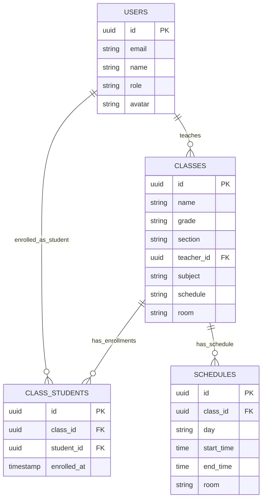
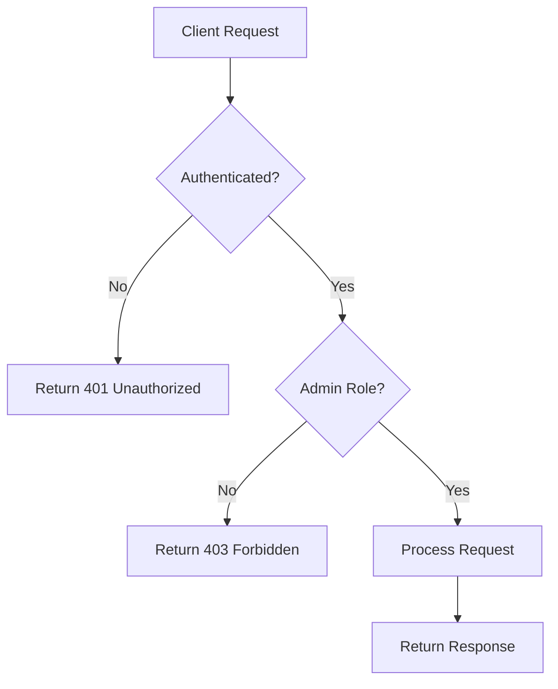
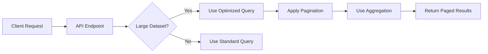
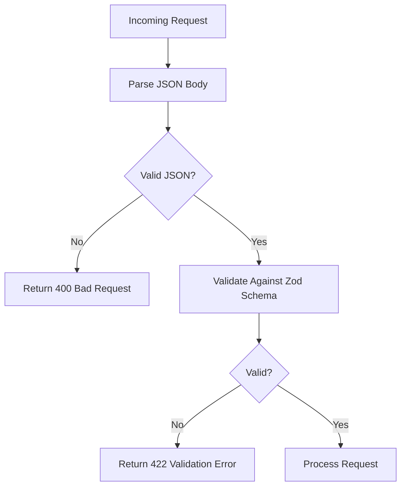
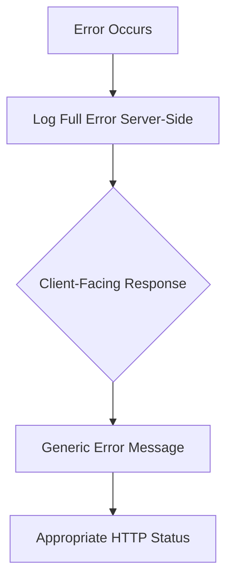

# Class Management

<cite>
**Referenced Files in This Document**   
- [create-class/route.ts](file://app/api/admin/create-class/route.ts)
- [classes/route.ts](file://app/api/admin/classes/route.ts)
- [classes/[id]/route.ts](file://app/api/admin/classes/[id]/route.ts)
- [enroll-student/route.ts](file://app/api/admin/enroll-student/route.ts)
- [unenroll-student/route.ts](file://app/api/admin/unenroll-student/route.ts)
- [link-parent-child/route.ts](file://app/api/admin/link-parent-child/route.ts)
- [queries.ts](file://lib/supabase/queries.ts)
- [queries-optimized.ts](file://lib/supabase/queries-optimized.ts)
- [validation-schemas.ts](file://lib/validation-schemas.ts)
- [20251219043440_create_classes_table.sql](file://supabase/migrations/20251219043440_create_classes_table.sql)
- [20251219103038_add_class_students_rls_policies.sql](file://supabase/migrations/20251219103038_add_class_students_rls_policies.sql)
- [types.ts](file://lib/supabase/types.ts)
</cite>

## Table of Contents
1. [Introduction](#introduction)
2. [Class Management Endpoints](#class-management-endpoints)
   - [Create Class (POST /api/admin/create-class)](#create-class-post-apimadmincreate-class)
   - [List Classes (GET /api/admin/classes)](#list-classes-get-apimadminclasses)
   - [Retrieve Class Details (GET /api/admin/classes/[id])](#retrieve-class-details-get-apimadminclassesid)
   - [Update Class (PUT /api/admin/classes/[id])](#update-class-put-apimadminclassesid)
   - [Delete Class (DELETE /api/admin/classes/[id])](#delete-class-delete-apimadminclassesid)
3. [Enrollment Management](#enrollment-management)
   - [Enroll Student (POST /api/admin/enroll-student)](#enroll-student-post-apimadminenroll-student)
   - [Unenroll Student (POST /api/admin/unenroll-student)](#unenroll-student-post-apimadminunenroll-student)
4. [Parent-Child Relationship Management](#parent-child-relationship-management)
   - [Link Parent-Child (POST /api/admin/link-parent-child)](#link-parent-child-post-apimadminlink-parent-child)
5. [Data Model and Database Schema](#data-model-and-database-schema)
6. [Security and Access Control](#security-and-access-control)
7. [Performance Optimization](#performance-optimization)
8. [Error Handling and Validation](#error-handling-and-validation)
9. [Audit Logging](#audit-logging)
10. [Real-World Examples](#real-world-examples)

## Introduction
This document provides comprehensive API documentation for class management functionality in the School-Management-System, specifically designed for administrative users. The system enables administrators to create, manage, and organize academic classes, handle student enrollments, and establish parent-child relationships through a secure and robust API infrastructure.

The class management system integrates with Supabase for data persistence, implements Row Level Security (RLS) policies for data protection, uses Zod for input validation, and incorporates rate limiting to prevent abuse. All operations are logged for audit purposes, ensuring transparency and accountability in academic record management.

## Class Management Endpoints

### Create Class (POST /api/admin/create-class)
Creates a new academic class with subject, schedule, and teacher assignment data.

**Request**
- Method: POST
- Endpoint: `/api/admin/create-class`
- Authentication: Required (Admin role)
- Rate Limit: 10 requests per minute

**Request Body**
```json
{
  "name": "Mathematics 10",
  "grade": "10",
  "section": "A",
  "subject": "Mathematics",
  "teacher_id": "uuid-of-teacher",
  "room": "Room 101",
  "scheduleDays": "MWF",
  "scheduleTime": "9:00 AM"
}
```

**Validation**
- Uses `createClassSchema` from `lib/validation-schemas.ts`
- Name and subject are required fields
- Teacher ID must be a valid UUID
- Schedule days follow predefined codes (MWF, TTh, Daily, etc.)

**Processing Logic**
1. Validates admin role and rate limits
2. Creates class record in the `classes` table
3. Generates schedule entries in the `schedules` table based on input
4. Implements transactional integrity: if schedule creation fails, rolls back class creation
5. Returns the created class object

**Response**
- Success: 200 OK with `{ success: true, class: { classData } }`
- Error: Appropriate HTTP status with error message

**Section sources**
- [create-class/route.ts](file://app/api/admin/create-class/route.ts#L1-L113)
- [validation-schemas.ts](file://lib/validation-schemas.ts#L70-L79)

### List Classes (GET /api/admin/classes)
Retrieves a paginated list of all academic classes with enrollment statistics.

**Request**
- Method: GET
- Endpoint: `/api/admin/classes`
- Authentication: Required (Admin role)
- Rate Limit: 30 requests per 10 minutes

**Query Parameters**
- `page`: Page number (default: 1)
- `pageSize`: Number of items per page (default: 50, max: 100)
- `search`: Text search filter for class name or subject

**Response Structure**
```json
{
  "classes": [
    {
      "id": "uuid",
      "name": "Mathematics 10",
      "grade": "10",
      "section": "A",
      "subject": "Mathematics",
      "room": "Room 101",
      "schedule": "MWF 9:00 AM",
      "teacher_id": "uuid-of-teacher",
      "teacher_name": "John Doe",
      "student_count": 25
    }
  ],
  "pagination": {
    "page": 1,
    "pageSize": 50,
    "total": 150,
    "totalPages": 3
  }
}
```

**Optimization Features**
- Uses optimized queries with aggregation to get student counts in a single query
- Implements pagination to handle large datasets efficiently
- Applies search filtering with proper sanitization to prevent injection attacks
- Returns only necessary fields (DTO pattern) to minimize data exposure

**Section sources**
- [classes/route.ts](file://app/api/admin/classes/route.ts#L7-L88)
- [queries-optimized.ts](file://lib/supabase/queries-optimized.ts#L119-L147)

### Retrieve Class Details (GET /api/admin/classes/[id])
Gets detailed information about a specific class including enrolled students.

**Request**
- Method: GET
- Endpoint: `/api/admin/classes/[id]`
- Authentication: Required (Admin role)

**Response**
Returns class details with teacher information and student enrollment data through related queries in the application layer.

**Section sources**
- [classes/[id]/route.ts](file://app/api/admin/classes/[id]/route.ts)

### Update Class (PUT /api/admin/classes/[id])
Modifies existing class information.

**Request**
- Method: PUT
- Endpoint: `/api/admin/classes/[id]`
- Authentication: Required (Admin role)

**Request Body**
```json
{
  "name": "Advanced Mathematics",
  "grade": "10",
  "section": "A",
  "subject": "Mathematics",
  "teacher_id": "uuid-of-teacher",
  "room": "Room 202",
  "schedule": "MWF 10:00 AM"
}
```

**Processing**
- Validates admin role
- Updates class record in the `classes` table
- Returns success status

**Section sources**
- [classes/[id]/route.ts](file://app/api/admin/classes/[id]/route.ts#L4-L49)

### Delete Class (DELETE /api/admin/classes/[id])
Removes a class and its associated data.

**Request**
- Method: DELETE
- Endpoint: `/api/admin/classes/[id]`
- Authentication: Required (Admin role)

**Processing Logic**
1. Validates admin role
2. Deletes related records from `schedules` and `class_students` tables
3. Removes the class record from the `classes` table
4. Ensures referential integrity by cleaning up dependent records

**Section sources**
- [classes/[id]/route.ts](file://app/api/admin/classes/[id]/route.ts#L56-L98)

## Enrollment Management

### Enroll Student (POST /api/admin/enroll-student)
Registers a student in an academic class.

**Request**
- Method: POST
- Endpoint: `/api/admin/enroll-student`
- Authentication: Required (Admin role)

**Request Body**
```json
{
  "studentId": "uuid-of-student",
  "classId": "uuid-of-class"
}
```

**Validation**
- Uses `enrollStudentSchema` from `lib/validation-schemas.ts`
- Both studentId and classId are required and must be valid UUIDs

**Processing**
- Creates a record in the `class_students` table
- Establishes the many-to-many relationship between students and classes
- Returns success status

**Error Cases**
- Duplicate enrollment (handled by database unique constraint)
- Invalid student or class IDs
- Missing required fields

**Section sources**
- [enroll-student/route.ts](file://app/api/admin/enroll-student/route.ts#L4-L42)
- [validation-schemas.ts](file://lib/validation-schemas.ts#L86-L89)

### Unenroll Student (POST /api/admin/unenroll-student)
Removes a student from a class.

**Request**
- Method: POST
- Endpoint: `/api/admin/unenroll-student`
- Authentication: Required (Admin role)

**Request Body**
```json
{
  "enrollmentId": "uuid-of-class-students-record"
}
```

**Processing**
- Deletes the specific enrollment record from the `class_students` table
- Uses the unique ID of the class-student relationship
- Maintains referential integrity through database cascading rules

**Section sources**
- [unenroll-student/route.ts](file://app/api/admin/unenroll-student/route.ts#L4-L38)
- [validation-schemas.ts](file://lib/validation-schemas.ts#L91-L93)

## Parent-Child Relationship Management

### Link Parent-Child (POST /api/admin/link-parent-child)
Establishes a guardianship relationship between a parent and student.

**Request**
- Method: POST
- Endpoint: `/api/admin/link-parent-child`
- Authentication: Required (Admin role)

**Request Body**
```json
{
  "parentId": "uuid-of-parent",
  "studentId": "uuid-of-student",
  "relationship": "guardian"
}
```

**Validation**
- Uses `linkParentChildSchema` from `lib/validation-schemas.ts`
- Relationship field accepts: 'father', 'mother', 'guardian', 'other'
- Prevents duplicate parent-child relationships via unique constraint

**Error Handling**
- Returns 400 if relationship already exists (unique constraint violation)
- Validates required fields
- Ensures both parent and student IDs exist

**Section sources**
- [link-parent-child/route.ts](file://app/api/admin/link-parent-child/route.ts#L4-L60)
- [validation-schemas.ts](file://lib/validation-schemas.ts#L96-L100)

## Data Model and Database Schema

### Class Management Data Model
The class management system is built on a relational data model with the following key entities:



**Diagram sources**
- [20251219043440_create_classes_table.sql](file://supabase/migrations/20251219043440_create_classes_table.sql#L1-L23)
- [types.ts](file://lib/supabase/types.ts#L114-L124)

### Key Tables

**classes table**
- Stores academic class information
- Fields: id, name, grade, section, teacher_id, subject, schedule, room, created_at
- teacher_id references users(id) with ON DELETE SET NULL

**class_students table**
- Junction table for many-to-many relationship between classes and students
- Fields: id, class_id, student_id, enrolled_at
- Unique constraint on (class_id, student_id) to prevent duplicate enrollments
- Cascading deletes when either class or student is removed

**schedules table**
- Stores class schedule details
- Allows for complex scheduling beyond simple text descriptions
- Fields: id, class_id, day, start_time, end_time, room

## Security and Access Control

### Authentication and Authorization
All class management endpoints require authentication and enforce role-based access control:



**Diagram sources**
- [create-class/route.ts](file://app/api/admin/create-class/route.ts#L38-L54)
- [enroll-student/route.ts](file://app/api/admin/enroll-student/route.ts#L7-L22)

### Row Level Security (RLS)
The system implements comprehensive RLS policies to protect data:

**classes table**
- Enabled with RLS
- Admins can create, read, update, and delete classes
- Teachers can view classes they teach
- Students can view classes they are enrolled in

**class_students table**
- Policies defined in migration file
- Admins can insert and delete enrollment records
- Teachers can manage enrollments for classes they teach
- Prevents unauthorized modification of enrollment data

```sql
-- RLS policies from 20251219103038_add_class_students_rls_policies.sql
CREATE POLICY "Admins can insert class_students" ON class_students FOR INSERT TO authenticated WITH CHECK ((SELECT role FROM users WHERE id = auth.uid()) = 'admin');
CREATE POLICY "Admins can delete class_students" ON class_students FOR DELETE TO authenticated USING ((SELECT role FROM users WHERE id = auth.uid()) = 'admin');
CREATE POLICY "Teachers can insert class_students" ON class_students FOR INSERT TO authenticated WITH CHECK ((SELECT role FROM users WHERE id = auth.uid()) = 'teacher');
CREATE POLICY "Teachers can delete class_students" ON class_students FOR DELETE TO authenticated USING ((SELECT role FROM users WHERE id = auth.uid()) = 'teacher');
```

**Section sources**
- [20251219103038_add_class_students_rls_policies.sql](file://supabase/migrations/20251219103038_add_class_students_rls_policies.sql#L1-L2)
- [20251219043440_create_classes_table.sql](file://supabase/migrations/20251219043440_create_classes_table.sql#L21-L22)

## Performance Optimization

### Optimized Queries
The system uses specialized query functions for improved performance with large datasets:



**Diagram sources**
- [queries-optimized.ts](file://lib/supabase/queries-optimized.ts)

### Key Optimization Strategies

**Pagination**
- Implemented on all list endpoints
- Default page size: 50 items
- Maximum page size: 100 items
- Includes total count and page metadata in response

**Aggregation**
- Uses Supabase `count: 'exact'` for accurate totals
- Aggregates student counts in the same query to avoid N+1 problems
- Reduces database round trips and improves response times

**Caching Considerations**
- While not explicitly implemented, the architecture supports caching
- Optimized queries return consistent data structures suitable for caching
- Rate limiting reduces the load on database queries

**Section sources**
- [queries-optimized.ts](file://lib/supabase/queries-optimized.ts)
- [classes/route.ts](file://app/api/admin/classes/route.ts#L34-L59)

## Error Handling and Validation

### Input Validation
The system uses Zod schemas for comprehensive input validation:



**Diagram sources**
- [validation-schemas.ts](file://lib/validation-schemas.ts)

### Validation Schemas

**createClassSchema**
- Validates class creation input
- Required fields: name, subject
- Optional fields: grade, section, teacher_id, room, scheduleDays, scheduleTime
- UUID validation for teacher_id

**enrollStudentSchema**
- Validates enrollment requests
- Requires valid UUIDs for studentId and classId
- Prevents null or malformed IDs

**linkParentChildSchema**
- Validates parent-child relationships
- Supports relationship types: father, mother, guardian, other
- Ensures both parent and student IDs are present

### Error Response Strategy
The system implements a centralized error handling approach:



**Key Principles**
- Never expose raw error messages to clients
- Log detailed error information server-side for debugging
- Return generic, user-friendly error messages
- Use appropriate HTTP status codes
- Prevent information disclosure about system internals

**Section sources**
- [api-errors.ts](file://lib/api-errors.ts)
- [validation-schemas.ts](file://lib/validation-schemas.ts)

## Audit Logging
All class management operations are automatically logged for accountability and security monitoring. The system tracks:

- Class creation, updates, and deletions
- Student enrollments and unenrollments
- Parent-child relationship changes
- User authentication and authorization events

Audit logs include:
- Timestamp of the action
- User ID who performed the action
- Type of action performed
- IP address of the request
- Relevant payload data (without sensitive information)

These logs are accessible to administrators through the audit logs interface and can be exported for compliance reporting.

**Section sources**
- [audit-logs.ts](file://lib/supabase/audit-logs.ts)

## Real-World Examples

### Enrolling a Student in a Math Class
```json
// POST /api/admin/enroll-student
{
  "studentId": "a1b2c3d4-e5f6-7890-1234-567890abcdef",
  "classId": "e5f6g7h8-i9j0-1234-5678-90abcdef1234"
}
```

This operation:
1. Validates that the user is an administrator
2. Checks that both the student and class exist
3. Creates a new record in the class_students table
4. Updates enrollment counts
5. Logs the enrollment action
6. Returns success confirmation

### Transferring a Student Between Sections
To transfer a student from Mathematics 10A to Mathematics 10B:

1. First, unenroll from the current class:
```json
// POST /api/admin/unenroll-student
{
  "enrollmentId": "existing-enrollment-uuid"
}
```

2. Then, enroll in the new class:
```json
// POST /api/admin/enroll-student
{
  "studentId": "student-uuid",
  "classId": "math-10b-class-uuid"
}
```

The system ensures transactional integrity and maintains accurate enrollment records throughout the transfer process.

**Section sources**
- [enroll-student/route.ts](file://app/api/admin/enroll-student/route.ts)
- [unenroll-student/route.ts](file://app/api/admin/unenroll-student/route.ts)