# System Settings

<cite>
**Referenced Files in This Document**   
- [route.ts](file://app/api/admin/settings/update/route.ts)
- [route.ts](file://app/api/admin/dashboard/route.ts)
- [route.ts](file://app/api/audit-logs/route.ts)
- [route.ts](file://app/api/audit-logs/export/route.ts)
- [route.ts](file://app/api/audit-logs/stats/route.ts)
- [validation-schemas.ts](file://lib/validation-schemas.ts)
- [queries-optimized.ts](file://lib/supabase/queries-optimized.ts)
- [audit-logs.ts](file://lib/supabase/audit-logs.ts)
- [security.ts](file://lib/security.ts)
- [session-security.ts](file://lib/session-security.ts)
- [20251219043619_create_school_settings_table.sql](file://supabase/migrations/20251219043619_create_school_settings_table.sql)
- [20251219044036_add_rls_policies.sql](file://supabase/migrations/20251219044036_add_rls_policies.sql)
- [20260110000003_hash_ip_addresses.sql](file://supabase/migrations/20260110000003_hash_ip_addresses.sql)
</cite>

## Table of Contents
1. [Introduction](#introduction)
2. [System Settings Management](#system-settings-management)
3. [Administrative Dashboard](#administrative-dashboard)
4. [Audit Logs Suite](#audit-logs-suite)
5. [Security Implementation](#security-implementation)
6. [Troubleshooting Guide](#troubleshooting-guide)
7. [Performance Recommendations](#performance-recommendations)

## Introduction
This document provides comprehensive API documentation for system settings and administrative operations in the School-Management-System. It covers the PATCH /api/admin/settings/update endpoint for modifying global system configurations, GET /api/admin/dashboard for retrieving administrative analytics, and the audit-logs suite (list, export, stats) for monitoring system activity. The documentation details validation mechanisms, data persistence with Row Level Security (RLS), aggregation of key metrics, audit log structure, export functionality, and security aspects including mandatory audit logging, IP address hashing, and session validation.

## System Settings Management

The system settings management functionality allows administrators to update global configuration parameters for the school. The PATCH /api/admin/settings/update endpoint handles these updates with strict validation and secure persistence.

The settings update process begins with authentication verification to ensure the requesting user is authenticated. Following authentication, role-based authorization confirms the user has administrative privileges. The input data is validated against a predefined schema that enforces data integrity and security constraints. Validated settings are persisted to the database using upsert operations with RLS enforcement.


**Diagram sources**
- [route.ts](file://app/api/admin/settings/update/route.ts)
- [validation-schemas.ts](file://lib/validation-schemas.ts)
- [20251219043619_create_school_settings_table.sql](file://supabase/migrations/20251219043619_create_school_settings_table.sql)

**Section sources**
- [route.ts](file://app/api/admin/settings/update/route.ts#L13-L61)
- [validation-schemas.ts](file://lib/validation-schemas.ts#L117-L125)

## Administrative Dashboard

The administrative dashboard endpoint provides a comprehensive overview of key system metrics and recent activities. The GET /api/admin/dashboard endpoint aggregates data from multiple sources to present a unified view of the school's operational status.

The dashboard implementation uses server-side caching with a 30-second TTL to optimize performance and reduce database load. It retrieves counts of students, teachers, and classes through parallel queries. Recent student enrollments, attendance records, and top grades are fetched with appropriate joins and limits. Class information is retrieved with student enrollment counts calculated through aggregation. The attendance rate is computed by analyzing all attendance records and calculating the percentage of present statuses.


**Diagram sources**
- [route.ts](file://app/api/admin/dashboard/route.ts)
- [queries-optimized.ts](file://lib/supabase/queries-optimized.ts)

**Section sources**
- [route.ts](file://app/api/admin/dashboard/route.ts#L5-L125)
- [queries-optimized.ts](file://lib/supabase/queries-optimized.ts#L233-L290)

## Audit Logs Suite

The audit logs suite provides comprehensive monitoring capabilities for system activity. It includes three endpoints: GET /api/audit-logs for listing logs, GET /api/audit-logs/export for exporting logs, and GET /api/audit-logs/stats for retrieving statistical summaries.

The audit logs functionality supports filtering by user ID, action type, date range, and IP address. It implements pagination for efficient data retrieval and includes a suspicious activity detection feature that identifies potential security threats. The export functionality converts audit logs to CSV format with protection against formula injection attacks. Statistical summaries provide insights into login patterns, failed attempts, and recent actions for compliance reporting.

```mermaid
classDiagram
class AuditLogEntry {
+string id
+string user_id
+string action
+string ip_address
+string created_at
+any payload
+string email
+string name
+string role
}
class AuditLogFilters {
+string userId
+string action
+string startDate
+string endDate
+string ipAddress
+number page
+number pageSize
}
class AuditLogStats {
+number totalLogins
+number failedLogins
+number successRate
+number uniqueUsers
+Array<{action : string, count : number}> recentActions
}
class AuditLogService {
+getAuditLogs(filters) PaginatedResponse
+getUserAuditLogs(userId, limit) Array
+getAuditLogStats(days) AuditLogStats
+detectSuspiciousActivity(userId) Array
+exportAuditLogsToCSV(logs) string
+getActionDisplayName(action) string
+getActionSeverity(action) string
}
AuditLogService --> AuditLogEntry : "returns"
AuditLogService --> AuditLogFilters : "accepts"
AuditLogService --> AuditLogStats : "returns"
```

**Diagram sources**
- [route.ts](file://app/api/audit-logs/route.ts)
- [route.ts](file://app/api/audit-logs/export/route.ts)
- [route.ts](file://app/api/audit-logs/stats/route.ts)
- [audit-logs.ts](file://lib/supabase/audit-logs.ts)

**Section sources**
- [route.ts](file://app/api/audit-logs/route.ts#L5-L65)
- [route.ts](file://app/api/audit-logs/export/route.ts#L5-L59)
- [route.ts](file://app/api/audit-logs/stats/route.ts#L5-L41)
- [audit-logs.ts](file://lib/supabase/audit-logs.ts#L41-L321)

## Security Implementation

The system implements multiple security layers to protect sensitive operations and data. These include Row Level Security (RLS) policies, IP address hashing, session validation, and input validation.

The RLS policies ensure that only authorized users can access or modify data. The school_settings table allows read access to all users but restricts updates to administrators. IP address hashing protects user privacy by storing only hashed versions of IP addresses, preventing direct identification while still enabling abuse detection. Session validation uses device fingerprinting to detect potential session hijacking attempts. Input validation with Zod schemas prevents injection attacks and ensures data integrity.

```mermaid
graph TB
subgraph "Security Layers"
RLS["Row Level Security"]
IPHashing["IP Address Hashing"]
SessionValidation["Session Validation"]
InputValidation["Input Validation"]
end
RLS --> |Policies| Database[(Supabase)]
IPHashing --> |hashIpAddress| SecurityEvents[(Security Events)]
SessionValidation --> |Fingerprint Matching| UserSessions[(User Sessions)]
InputValidation --> |Zod Schemas| APIEndpoints
APIEndpoints --> RLS
APIEndpoints --> IPHashing
APIEndpoints --> SessionValidation
APIEndpoints --> InputValidation
```



**Diagram sources**
- [20251219044036_add_rls_policies.sql](file://supabase/migrations/20251219044036_add_rls_policies.sql)
- [20260110000003_hash_ip_addresses.sql](file://supabase/migrations/20260110000003_hash_ip_addresses.sql)
- [security.ts](file://lib/security.ts)
- [session-security.ts](file://lib/session-security.ts)

**Section sources**
- [20251219044036_add_rls_policies.sql](file://supabase/migrations/20251219044036_add_rls_policies.sql#L20-L21)
- [20260110000003_hash_ip_addresses.sql](file://supabase/migrations/20260110000003_hash_ip_addresses.sql#L1-L18)
- [security.ts](file://lib/security.ts#L11-L14)
- [session-security.ts](file://lib/session-security.ts#L45-L56)

## Troubleshooting Guide

This section provides guidance for resolving common configuration issues related to system settings and administrative operations.

**Settings Update Failures**: When PATCH /api/admin/settings/update returns validation errors, verify that all required fields are present and within acceptable ranges. The name field must be 1-100 characters, latitude must be -90 to 90, longitude must be -180 to 180, and radiusMeters must be 10-5000. Ensure the user has administrative privileges and is properly authenticated.

**Dashboard Data Inconsistencies**: If dashboard metrics appear incorrect, check the caching mechanism. The dashboard data is cached for 30 seconds, so recent changes may not be immediately reflected. Clear the cache or wait for the TTL to expire to see updated values. Verify that the database queries are returning expected counts.

**Audit Log Access Issues**: When users cannot access audit logs, confirm their role and authorization. Only administrators can view all logs; regular users can only view their own logs. For export functionality, only administrators have permission. Check that query parameters are correctly formatted, especially date values which should be in ISO format.

**Session Validation Problems**: If users experience frequent session invalidation, examine the fingerprint strictness configuration. The system compares device fingerprints including user agent, language, timezone, and screen resolution. Significant changes to these properties may trigger session invalidation as a security measure. Mobile users changing networks may experience IP-based validation issues.

**Section sources**
- [route.ts](file://app/api/admin/settings/update/route.ts#L35-L40)
- [route.ts](file://app/api/admin/dashboard/route.ts#L24-L117)
- [route.ts](file://app/api/audit-logs/route.ts#L35-L38)
- [session-security.ts](file://lib/session-security.ts#L176-L197)

## Performance Recommendations

This section provides performance optimization tips for system settings and administrative operations, particularly for log querying at scale.

**Audit Log Query Optimization**: When querying audit logs with large datasets, use specific filters to narrow the result set. Filter by date range, user ID, or action type to reduce the amount of data processed. For statistical analysis, use the dedicated /stats endpoint instead of retrieving all logs and calculating client-side.

**Caching Strategy**: Leverage the built-in caching mechanisms where possible. The dashboard endpoint uses server-side caching with a 30-second TTL, reducing database load for frequent requests. Consider implementing client-side caching for audit log searches that are likely to be repeated.

**Batch Operations**: When processing multiple audit log entries, use batch operations instead of individual requests. The system supports retrieving up to 10,000 records in a single export request, which is more efficient than multiple smaller requests.

**Index Utilization**: The database includes indexes on frequently queried fields such as user_id, action, and created_at in the audit logs. Ensure queries leverage these indexes by using appropriate WHERE clauses and avoiding functions on indexed columns.

**Section sources**
- [route.ts](file://app/api/audit-logs/route.ts#L48-L57)
- [route.ts](file://app/api/audit-logs/export/route.ts#L36-L42)
- [queries-optimized.ts](file://lib/supabase/queries-optimized.ts#L233-L290)
- [20260110000003_hash_ip_addresses.sql](file://supabase/migrations/20260110000003_hash_ip_addresses.sql#L8-L9)