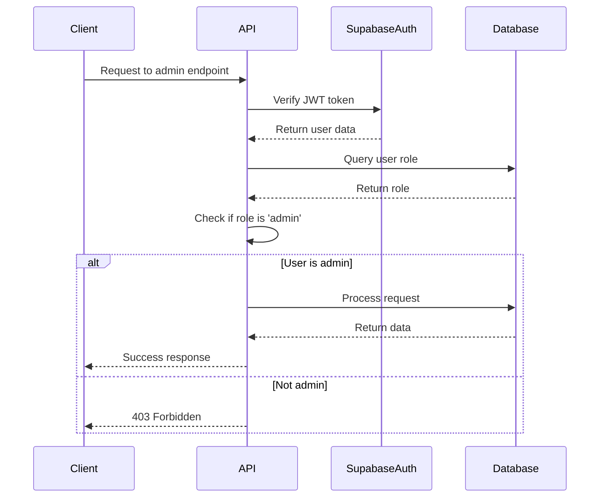
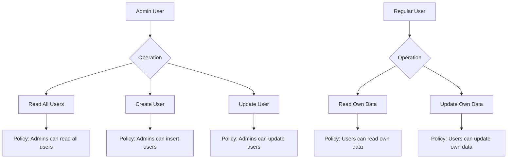
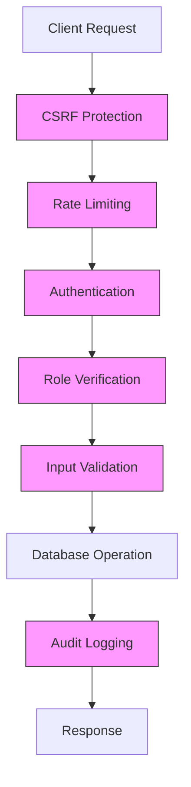

# User Management

<cite>
**Referenced Files in This Document**   
- [create-user/route.ts](file://app/api/admin/create-user/route.ts)
- [get-users/route.ts](file://app/api/admin/get-users/route.ts)
- [toggle-user-status/route.ts](file://app/api/admin/toggle-user-status/route.ts)
- [link-account/route.ts](file://app/api/admin/link-account/route.ts)
- [unlinked-accounts/route.ts](file://app/api/admin/unlinked-accounts/route.ts)
- [validation-schemas.ts](file://lib/validation-schemas.ts)
- [middleware.ts](file://lib/supabase/middleware.ts)
- [api-errors.ts](file://lib/api-errors.ts)
- [rate-limit.ts](file://lib/rate-limit.ts)
- [audit-monitor.ts](file://lib/audit-monitor.ts)
- [20251219043432_create_users_table.sql](file://supabase/migrations/20251219043432_create_users_table.sql)
- [20251219080307_allow_admin_insert_users.sql](file://supabase/migrations/20251219080307_allow_admin_insert_users.sql)
- [20251219081226_allow_admin_read_all_users.sql](file://supabase/migrations/20251219081226_allow_admin_read_all_users.sql)
- [20251219082433_add_admin_update_users.sql](file://supabase/migrations/20251219082433_add_admin_update_users.sql)
</cite>

## Table of Contents
1. [Introduction](#introduction)
2. [Core Endpoints](#core-endpoints)
3. [Request Validation](#request-validation)
4. [Authentication and Authorization](#authentication-and-authorization)
5. [Database Security and RLS Policies](#database-security-and-rls-policies)
6. [Security Features](#security-features)
7. [Usage Examples](#usage-examples)
8. [Error Handling](#error-handling)
9. [Common Issues](#common-issues)
10. [Conclusion](#conclusion)

## Introduction
This document provides comprehensive API documentation for the admin user management system in the School-Management-System. It details the endpoints responsible for creating, retrieving, and managing user accounts with role-based access control. The system leverages Supabase for authentication and database operations, implements robust security measures including rate limiting and audit logging, and enforces strict data validation through Zod schemas. All admin operations are protected by role-based access control, ensuring only authorized administrators can perform sensitive actions.

## Core Endpoints

### POST /api/admin/create-user
Creates a new user account with role-specific profile data. If no password is provided, a secure 12-character password is automatically generated and returned to the admin. The endpoint creates both an authentication record in Supabase Auth and a corresponding user record in the public users table, along with role-specific profile information.

**Section sources**
- [create-user/route.ts](file://app/api/admin/create-user/route.ts#L8-L156)

### GET /api/admin/get-users
Retrieves a paginated list of all users in the system. The endpoint supports pagination through `page` and `limit` query parameters and returns user information including ID, email, name, role, creation date, and active status. Only admin users can access this endpoint.

**Section sources**
- [get-users/route.ts](file://app/api/admin/get-users/route.ts#L4-L59)

### PATCH /api/admin/toggle-user-status
Activates or deactivates a user account by updating the `is_active` field in the users table. The request is validated using Zod to ensure proper data types. Administrators cannot deactivate their own accounts as a security measure.

**Section sources**
- [toggle-user-status/route.ts](file://app/api/admin/toggle-user-status/route.ts#L15-L62)

### POST /api/admin/link-account
Links an existing authentication account to a user record and creates or updates the corresponding profile (student or teacher). This endpoint is used to connect orphaned identities to complete user profiles with role-specific data.

**Section sources**
- [link-account/route.ts](file://app/api/admin/link-account/route.ts#L4-L85)

### GET /api/admin/unlinked-accounts
Retrieves a list of student accounts that exist in the student_profiles table but do not have corresponding entries in the users table. This helps identify orphaned profile data that needs to be linked to authentication accounts.

**Section sources**
- [unlinked-accounts/route.ts](file://app/api/admin/unlinked-accounts/route.ts#L4-L75)

## Request Validation

### Validation Schema
The system uses Zod for request validation to prevent injection attacks and ensure data integrity. While the toggle-user-status endpoint uses a specific schema, other endpoints perform manual validation.

```mermaid
classDiagram
class ToggleStatusSchema {
+userId : string (UUID)
+status : boolean
}
ToggleStatusSchema --> toggle-user-status/route.ts : "used by"
```

**Diagram sources**
- [toggle-user-status/route.ts](file://app/api/admin/toggle-user-status/route.ts#L10-L13)
- [validation-schemas.ts](file://lib/validation-schemas.ts#L1-L126)

## Authentication and Authorization

### JWT Authentication Flow
The system uses Supabase JWT authentication with middleware to verify user sessions. Admin endpoints first validate the user's authentication status and then verify their role before processing requests.



**Diagram sources**
- [middleware.ts](file://lib/supabase/middleware.ts#L4-L38)
- [create-user/route.ts](file://app/api/admin/create-user/route.ts#L23-L47)
- [get-users/route.ts](file://app/api/admin/get-users/route.ts#L7-L22)

## Database Security and RLS Policies

### Users Table Structure
The database implements a role-based user system with separate profile tables for different user types, connected via foreign key relationships.

```mermaid
erDiagram
USERS {
uuid id PK
string email UK
string name
string role
string phone
string address
bool is_active
bool must_change_password
timestamp created_at
timestamp updated_at
}
STUDENT_PROFILES {
uuid id PK FK
string lrn UK
string grade
string section
date join_date
}
TEACHER_PROFILES {
uuid id PK FK
string subject
string department
date join_date
}
USERS ||--o{ STUDENT_PROFILES : "has"
USERS ||--o{ TEACHER_PROFILES : "has"
```

**Diagram sources**
- [20251219043432_create_users_table.sql](file://supabase/migrations/20251219043432_create_users_table.sql#L1-L32)

### Row Level Security (RLS) Policies
The system implements strict RLS policies to ensure data isolation and admin-only access to sensitive operations.



**Diagram sources**
- [20251219080307_allow_admin_insert_users.sql](file://supabase/migrations/20251219080307_allow_admin_insert_users.sql#L1-L12)
- [20251219081226_allow_admin_read_all_users.sql](file://supabase/migrations/20251219081226_allow_admin_read_all_users.sql#L1-L12)
- [20251219082433_add_admin_update_users.sql](file://supabase/migrations/20251219082433_add_admin_update_users.sql#L1-L12)

## Security Features

### Security Implementation Overview
The user management system incorporates multiple layers of security to protect against common threats and ensure data integrity.



**Diagram sources**
- [create-user/route.ts](file://app/api/admin/create-user/route.ts#L9-L22)
- [rate-limit.ts](file://lib/rate-limit.ts#L25-L56)
- [api-errors.ts](file://lib/api-errors.ts#L21-L116)
- [audit-monitor.ts](file://lib/audit-monitor.ts#L14-L89)

### Rate Limiting
All admin endpoints are protected by rate limiting to prevent abuse. The system uses a Redis-like atomic RPC call to track requests per identifier (IP or user ID) within a specified time window.

**Section sources**
- [rate-limit.ts](file://lib/rate-limit.ts#L25-L56)
- [create-user/route.ts](file://app/api/admin/create-user/route.ts#L15-L21)

### Audit Logging
The system monitors authentication events and suspicious activities through audit logging. Administrators receive notifications for critical security events such as password changes or account deletions.

**Section sources**
- [audit-monitor.ts](file://lib/audit-monitor.ts#L14-L89)

## Usage Examples

### Creating a Teacher Account
To create a teacher account, send a POST request to `/api/admin/create-user` with teacher-specific information:

```json
{
  "email": "john.smith@school.edu",
  "name": "John Smith",
  "role": "teacher",
  "subject": "Mathematics",
  "department": "STEM",
  "phone": "+1234567890"
}
```

The system will create the user account, generate a secure password if none provided, and create a corresponding teacher profile.

**Section sources**
- [create-user/route.ts](file://app/api/admin/create-user/route.ts#L121-L138)

### Fetching Active Students
To retrieve all active students with pagination, use the get-users endpoint with query parameters:

```
GET /api/admin/get-users?page=1&limit=50
```

The response includes metadata about pagination and a list of users filtered by the admin's permissions.

**Section sources**
- [get-users/route.ts](file://app/api/admin/get-users/route.ts#L24-L37)

## Error Handling

### Error Response Structure
The system uses centralized error handling to prevent information disclosure and maintain consistency across endpoints.

```mermaid
classDiagram
class ApiErrors {
+unauthorized()
+forbidden()
+notFound(resource)
+badRequest(message)
+rateLimited()
+validationError(message)
+conflict(message)
}
ApiErrors --> api-errors.ts : "defined in"
create-user/route.ts --> ApiErrors : "uses"
toggle-user-status/route.ts --> ApiErrors : "uses"
```

**Diagram sources**
- [api-errors.ts](file://lib/api-errors.ts#L59-L69)
- [toggle-user-status/route.ts](file://app/api/admin/toggle-user-status/route.ts#L4-L5)

## Common Issues

### Duplicate Email Conflicts
When attempting to create a user with an email that already exists in Supabase Auth, the system returns a 400 error with the message "Unable to create user account. Please verify the details." This prevents duplicate accounts and informs administrators of the conflict.

**Section sources**
- [create-user/route.ts](file://app/api/admin/create-user/route.ts#L96-L98)

### Password Complexity Requirements
All user passwords must meet strict complexity requirements: at least 12 characters with uppercase, lowercase, numbers, and special characters. If these requirements are not met, the system returns a 400 error with specific guidance on password requirements.

**Section sources**
- [create-user/route.ts](file://app/api/admin/create-user/route.ts#L69-L80)

## Conclusion
The admin user management system in the School-Management-System provides a secure, robust interface for managing user accounts with comprehensive protection mechanisms. By leveraging Supabase's authentication and RLS features, implementing rate limiting, input validation, and audit logging, the system ensures that user management operations are both functional and secure. The clear separation of concerns between authentication, authorization, and business logic makes the system maintainable and extensible for future requirements.