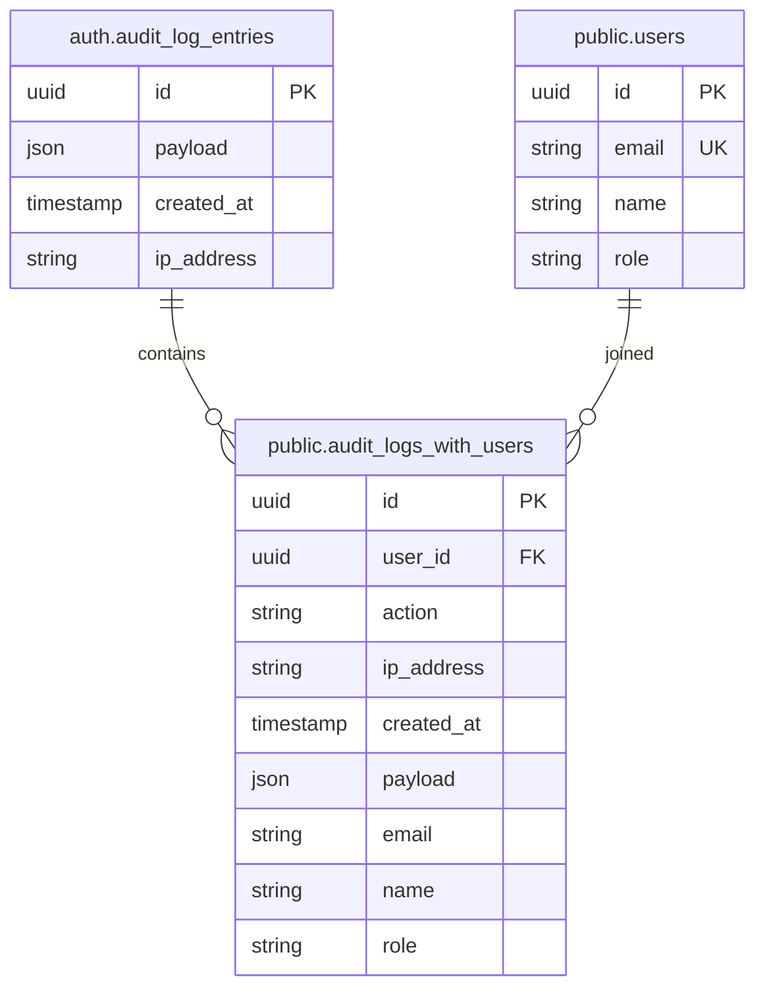
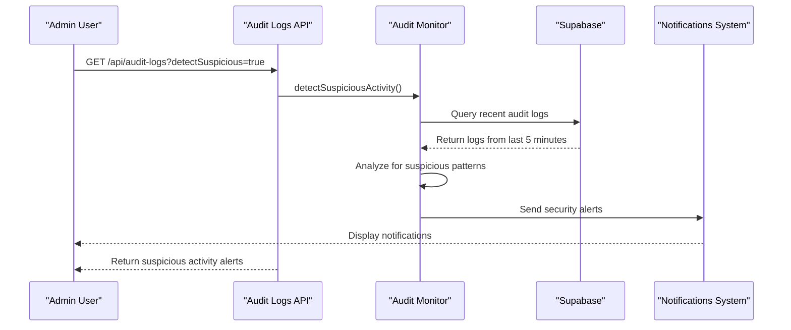
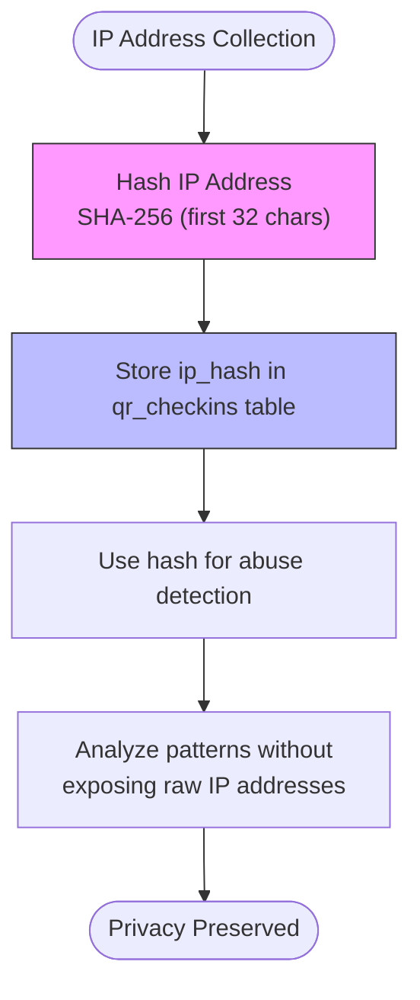
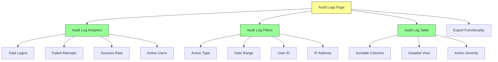

# Audit & Security API Endpoints

<cite>
**Referenced Files in This Document**   
- [route.ts](file://app/api/audit-logs/route.ts)
- [export/route.ts](file://app/api/audit-logs/export/route.ts)
- [stats/route.ts](file://app/api/audit-logs/stats/route.ts)
- [audit-logs.ts](file://lib/supabase/audit-logs.ts)
- [audit_monitor.ts](file://lib/audit-monitor.ts)
- [20260108132041_audit_logs_view_v2.sql](file://supabase/migrations/20260108132041_audit_logs_view_v2.sql)
- [20260110125232_hash_ip_addresses.sql](file://supabase/migrations/20260110125232_hash_ip_addresses.sql)
- [page.tsx](file://app/admin/audit-logs/page.tsx)
- [audit-log-table.tsx](file://components/audit-log-table.tsx)
- [audit-log-filters.tsx](file://components/audit-log-filters.tsx)
- [audit-log-analytics.tsx](file://components/audit-log-analytics.tsx)
</cite>

## Table of Contents
1. [Introduction](#introduction)
2. [Audit Log Endpoints](#audit-log-endpoints)
   - [GET /api/audit-logs](#get-apiaudit-logs)
   - [GET /api/audit-logs/export](#get-apiaudit-logsexport)
   - [GET /api/audit-logs/stats](#get-apiaudit-logsstats)
3. [Data Model and Database Structure](#data-model-and-database-structure)
4. [Security Monitoring and Real-time Alerts](#security-monitoring-and-real-time-alerts)
5. [Privacy and Data Protection](#privacy-and-data-protection)
6. [Performance Optimization](#performance-optimization)
7. [Usage Examples](#usage-examples)
8. [Frontend Implementation](#frontend-implementation)

## Introduction

The School-Management-System implements a comprehensive audit logging and security monitoring system to track authentication events, user activities, and system changes. This documentation details the API endpoints for retrieving audit logs, exporting log data, and accessing analytics, along with the underlying data model, privacy considerations, and integration with real-time monitoring.

The audit logging system captures events from Supabase Auth's audit log entries and provides administrators with tools to monitor security events, detect suspicious activity, and maintain compliance. All endpoints enforce strict access controls, ensuring that only authorized personnel can access sensitive audit information.

## Audit Log Endpoints

### GET /api/audit-logs

Retrieves audit logs with filtering and pagination capabilities.

**HTTP Method**: GET

**Access Control**: Admin-only access to all logs; users can only access their own logs.

**Query Parameters**:
- `userId` (string): Filter logs by user ID
- `action` (string): Filter by action type (e.g., "login", "user_updated_password")
- `startDate` (string): Filter logs from this date (ISO format)
- `endDate` (string): Filter logs up to this date (ISO format)
- `ipAddress` (string): Filter by IP address
- `page` (number): Page number for pagination (default: 1)
- `pageSize` (number): Number of records per page (default: 50)
- `detectSuspicious` (boolean): When true, returns suspicious activity alerts instead of logs

**Response Format**:
```json
{
  "data": [
    {
      "id": "string",
      "user_id": "string",
      "action": "string",
      "ip_address": "string",
      "created_at": "string (ISO format)",
      "payload": "object",
      "email": "string",
      "name": "string",
      "role": "string"
    }
  ],
  "pagination": {
    "page": "number",
    "pageSize": "number",
    "total": "number",
    "totalPages": "number"
  }
}
```

**Section sources**
- [route.ts](file://app/api/audit-logs/route.ts#L5-L64)
- [audit-logs.ts](file://lib/supabase/audit-logs.ts#L41-L82)

### GET /api/audit-logs/export

Exports audit logs as a CSV file for offline analysis.

**HTTP Method**: GET

**Access Control**: Admin-only access.

**Query Parameters**:
- `userId` (string): Filter logs by user ID
- `action` (string): Filter by action type
- `startDate` (string): Filter logs from this date (ISO format)
- `endDate` (string): Filter logs up to this date (ISO format)

**Response Format**: CSV file attachment with the following columns:
- Date
- User
- Email
- Role
- Action
- IP Address

The exported CSV includes proper escaping to prevent formula injection attacks when opened in spreadsheet applications.

**Section sources**
- [export/route.ts](file://app/api/audit-logs/export/route.ts#L5-L58)
- [audit-logs.ts](file://lib/supabase/audit-logs.ts#L244-L261)

### GET /api/audit-logs/stats

Retrieves analytics and statistics from audit logs.

**HTTP Method**: GET

**Access Control**: Admin-only access.

**Query Parameters**:
- `days` (number): Number of days to include in statistics (default: 30)

**Response Format**:
```json
{
  "totalLogins": "number",
  "failedLogins": "number",
  "successRate": "number",
  "uniqueUsers": "number",
  "recentActions": [
    {
      "action": "string",
      "count": "number"
    }
  ]
}
```

**Section sources**
- [stats/route.ts](file://app/api/audit-logs/stats/route.ts#L5-L40)
- [audit-logs.ts](file://lib/supabase/audit-logs.ts#L104-L145)

## Data Model and Database Structure

The audit logging system is built on Supabase Auth's audit log entries, enhanced with a database view that joins authentication events with user information for easier querying.



**Diagram sources**
- [20260108132041_audit_logs_view_v2.sql](file://supabase/migrations/20260108132041_audit_logs_view_v2.sql#L3-L20)
- [20260108_audit_logs_indexes.sql](file://supabase/migrations/20260108_audit_logs_indexes.sql#L8-L25)

The `audit_logs_with_users` view extracts the user ID and action from the JSON payload in `auth.audit_log_entries` and joins with the `users` table to provide enriched log data. This view enables efficient querying of audit logs with user context without requiring complex JSON parsing in application code.

The view includes the following fields:
- `id`: Unique identifier for the audit log entry
- `user_id`: UUID of the user who performed the action
- `action`: Type of action performed (e.g., "login", "user_updated_password")
- `ip_address`: IP address from which the action was performed
- `created_at`: Timestamp of the action
- `payload`: Full JSON payload containing additional details
- `email`, `name`, `role`: User information from the users table

**Section sources**
- [20260108132041_audit_logs_view_v2.sql](file://supabase/migrations/20260108132041_audit_logs_view_v2.sql#L3-L20)

## Security Monitoring and Real-time Alerts

The system includes real-time monitoring capabilities to detect and alert on suspicious activity patterns.



**Diagram sources**
- [route.ts](file://app/api/audit-logs/route.ts#L40-L46)
- [audit-logs.ts](file://lib/supabase/audit-logs.ts#L150-L226)
- [audit_monitor.ts](file://lib/audit-monitor.ts#L24-L46)

The `detectSuspiciousActivity` function identifies potential security threats by analyzing recent audit logs for patterns such as:
- Multiple failed login attempts (3 or more in 5 minutes)
- Password changes
- MFA settings modifications

The `startAuditMonitoring` function runs every 5 minutes for admin users, automatically checking for suspicious activity and creating notifications when threats are detected. Critical actions like password changes, user deletions, and MFA factor deletions also trigger immediate notifications.

**Section sources**
- [audit-logs.ts](file://lib/supabase/audit-logs.ts#L150-L226)
- [audit_monitor.ts](file://lib/audit-monitor.ts#L14-L88)

## Privacy and Data Protection

The system implements privacy-preserving measures to protect user data while maintaining security monitoring capabilities.



**Diagram sources**
- [20260110125232_hash_ip_addresses.sql](file://supabase/migrations/20260110125232_hash_ip_addresses.sql#L1-L13)

The `20260110125232_hash_ip_addresses.sql` migration adds an `ip_hash` column to the `qr_checkins` table, storing SHA-256 hashes of client IP addresses instead of raw IP addresses. This approach protects user privacy while still allowing abuse detection through hash comparison.

The system also implements data retention policies and ensures that audit logs are only accessible to authorized personnel. The CSV export functionality includes safeguards against formula injection attacks by properly escaping cell values that begin with dangerous characters (=, +, -, @).

**Section sources**
- [20260110125232_hash_ip_addresses.sql](file://supabase/migrations/20260110125232_hash_ip_addresses.sql#L1-L13)
- [audit-logs.ts](file://lib/supabase/audit-logs.ts#L232-L239)

## Performance Optimization

The audit logging system includes several performance optimizations to handle large datasets efficiently.

```mermaid
graph TD
A[Client Request] --> B{Filter Parameters}
B --> C[Apply Database Filters]
C --> D[Pagination: range()]
D --> E[Return Limited Results]
E --> F[Client-Side Processing]
G[Index Creation] --> H[audit_logs_with_users View]
H --> I[Optimized Queries]
I --> J[Fast Response Times]
style C fill:#f96,stroke:#333
style D fill:#f96,stroke:#333
style H fill:#69f,stroke:#333
```

**Diagram sources**
- [20260108132041_audit_logs_view_v2.sql](file://supabase/migrations/20260108132041_audit_logs_view_v2.sql#L3-L20)
- [audit-logs.ts](file://lib/supabase/audit-logs.ts#L52-L67)

Performance optimizations include:
- Database view (`audit_logs_with_users`) that pre-joins audit logs with user information
- Client-side pagination using Supabase's `range()` method to limit result sets
- Server-side filtering to reduce data transfer
- Efficient indexing on frequently queried fields
- Caching of frequently accessed statistics

The system uses Supabase's built-in pagination capabilities to handle large datasets, retrieving only the requested page of results rather than the entire dataset. For export operations, the system increases the page size limit to accommodate larger datasets while still maintaining reasonable performance.

**Section sources**
- [audit-logs.ts](file://lib/supabase/audit-logs.ts#L42-L67)
- [20260108132041_audit_logs_view_v2.sql](file://supabase/migrations/20260108132041_audit_logs_view_v2.sql#L3-L20)

## Usage Examples

### Querying User Activity

To retrieve login activity for a specific user:

```
GET /api/audit-logs?userId=123e4567-e89b-12d3-a456-426614174000&action=login&page=1&pageSize=25
```

This returns the user's login history with pagination, allowing administrators to monitor individual user activity patterns.

### Retrieving System Changes

To find all user modifications in the last 7 days:

```
GET /api/audit-logs?action=user_modified&startDate=2025-12-01T00:00:00Z&endDate=2025-12-08T23:59:59Z
```

This helps identify configuration changes or user profile updates across the system.

### Exporting Logs for Compliance

To export all audit logs for regulatory compliance:

```
GET /api/audit-logs/export?startDate=2025-01-01T00:00:00Z&endDate=2025-12-31T23:59:59Z
```

The system returns a CSV file containing all audit events within the specified date range, suitable for offline analysis and reporting.

### Monitoring Security Events

To check for suspicious activity:

```
GET /api/audit-logs?detectSuspicious=true
```

This returns alerts for potential security threats such as multiple failed login attempts or password changes, enabling rapid response to security incidents.

**Section sources**
- [route.ts](file://app/api/audit-logs/route.ts#L26-L33)
- [audit-logs.ts](file://lib/supabase/audit-logs.ts#L41-L82)

## Frontend Implementation

The admin audit logs interface provides a comprehensive dashboard for monitoring and analyzing security events.



**Diagram sources**
- [page.tsx](file://app/admin/audit-logs/page.tsx#L24-L157)
- [audit-log-analytics.tsx](file://components/audit-log-analytics.tsx#L11-L78)
- [audit-log-filters.tsx](file://components/audit-log-filters.tsx#L40-L154)
- [audit-log-table.tsx](file://components/audit-log-table.tsx#L13-L84)

The frontend components include:
- **AuditLogAnalytics**: Displays key metrics and statistics from the audit logs
- **AuditLogFilters**: Provides a user-friendly interface for filtering logs by various criteria
- **AuditLogTable**: Presents audit logs in a tabular format with sorting and pagination
- **Export Functionality**: Allows administrators to download logs as CSV files

The interface automatically refreshes statistics and checks for suspicious activity, providing real-time security monitoring capabilities. The table displays action severity levels using color-coded badges to highlight high-risk activities.

**Section sources**
- [page.tsx](file://app/admin/audit-logs/page.tsx#L24-L157)
- [audit-log-analytics.tsx](file://components/audit-log-analytics.tsx#L11-L78)
- [audit-log-filters.tsx](file://components/audit-log-filters.tsx#L40-L154)
- [audit-log-table.tsx](file://components/audit-log-table.tsx#L13-L84)