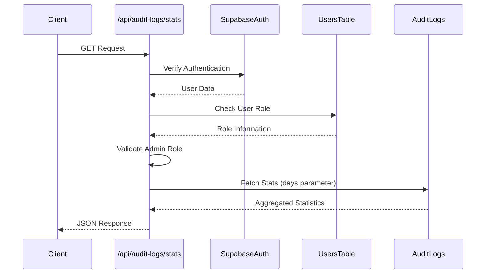
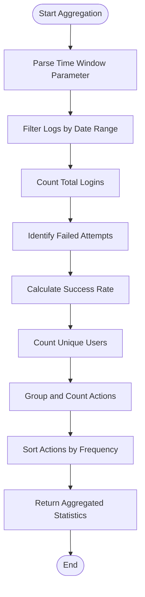
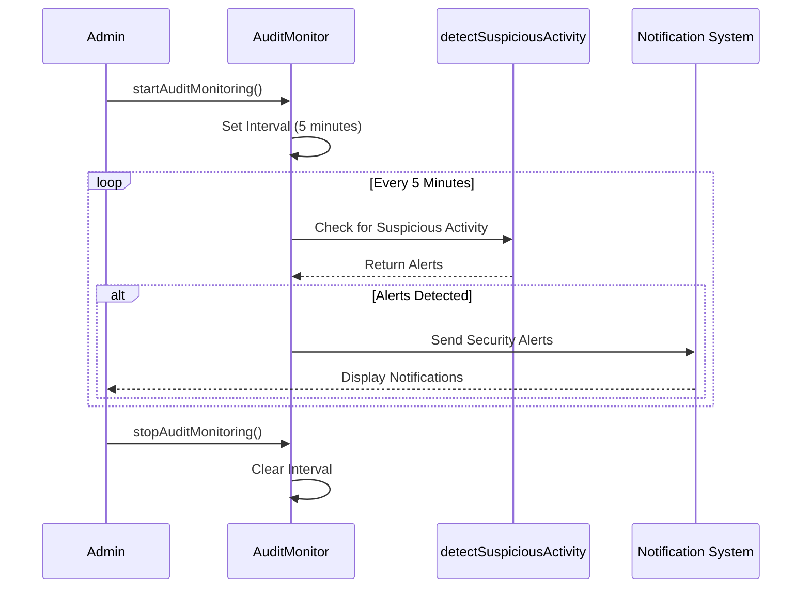
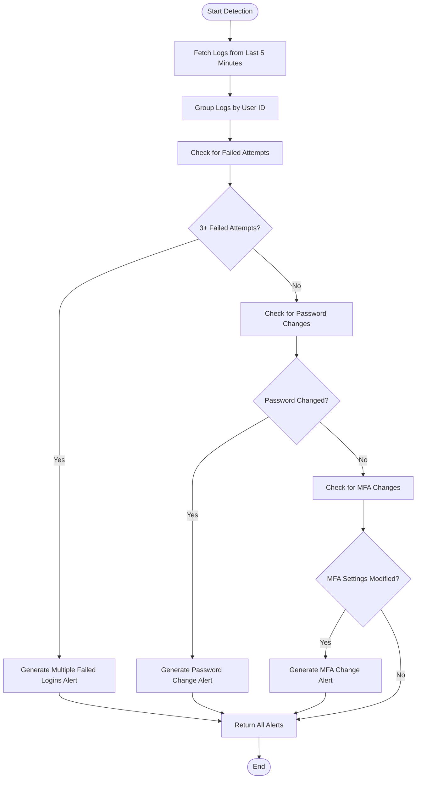
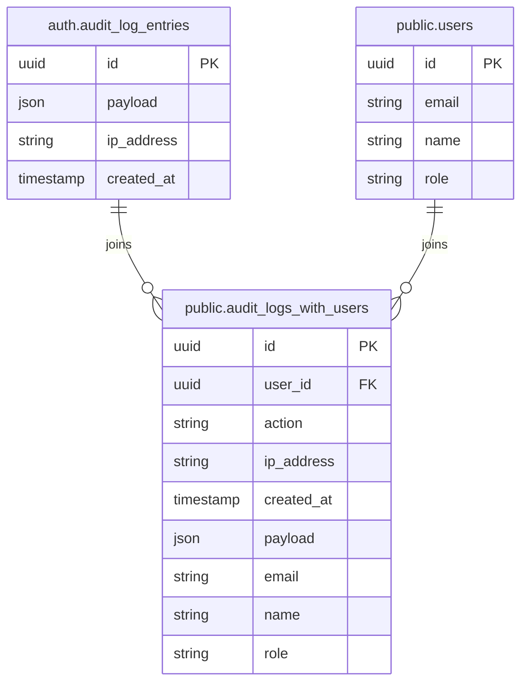
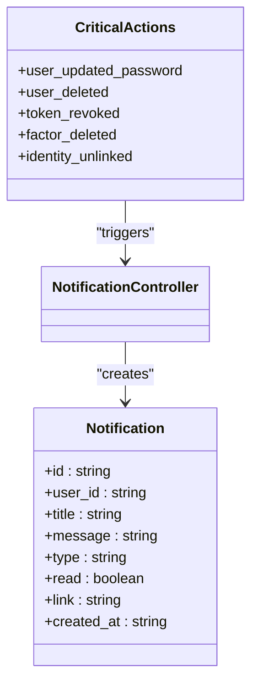
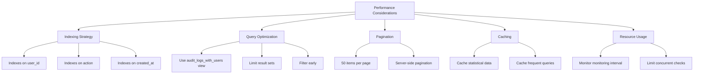
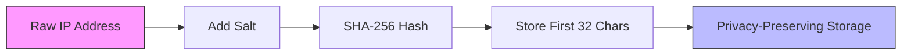

# Audit Analytics and Monitoring

<cite>
**Referenced Files in This Document**   
- [route.ts](file://app/api/audit-logs/stats/route.ts)
- [audit-logs.ts](file://lib/supabase/audit-logs.ts)
- [audit-monitor.ts](file://lib/audit-monitor.ts)
- [page.tsx](file://app/admin/audit-logs/page.tsx)
- [audit_logs_with_users.sql](file://supabase/migrations/20260108132041_audit_logs_view_v2.sql)
- [audit_log_indexes.sql](file://supabase/migrations/20260108_audit_logs_indexes.sql)
- [security.ts](file://lib/security.ts)
- [session-security.ts](file://lib/session-security.ts)
</cite>

## Table of Contents
1. [Introduction](#introduction)
2. [Audit Log Statistics Endpoint](#audit-log-statistics-endpoint)
3. [Data Aggregation Logic](#data-aggregation-logic)
4. [Available Metrics](#available-metrics)
5. [Real-Time Monitoring Service](#real-time-monitoring-service)
6. [Suspicious Activity Detection](#suspicious-activity-detection)
7. [Database View for Enriched Querying](#database-view-for-enriched-querying)
8. [Notification System for Critical Actions](#notification-system-for-critical-actions)
9. [Configuration Options](#configuration-options)
10. [Interpreting Analytics Data](#interpreting-analytics-data)
11. [Responding to Security Alerts](#responding-to-security-alerts)
12. [Performance Considerations](#performance-considerations)
13. [Privacy Aspects](#privacy-aspects)
14. [Troubleshooting Guidance](#troubleshooting-guidance)

## Introduction
The audit analytics and monitoring system provides comprehensive security oversight for the school management platform. This system enables administrators to monitor authentication events, detect suspicious activities, and respond to potential security threats. The core components include a statistics endpoint for aggregated data, a real-time monitoring service for anomaly detection, and a notification system for critical security events. This documentation details the implementation and usage of these components to ensure system integrity and data protection.

## Audit Log Statistics Endpoint
The GET /api/audit-logs/stats endpoint provides aggregated statistics from the audit logs over a configurable time window, defaulting to 30 days. This endpoint requires administrative privileges for access, ensuring that sensitive security data is protected. The endpoint processes authentication verification and role validation before returning statistical data. It accepts an optional "days" parameter to specify the time window for aggregation.



**Diagram sources**
- [route.ts](file://app/api/audit-logs/stats/route.ts#L5-L39)

**Section sources**
- [route.ts](file://app/api/audit-logs/stats/route.ts#L5-L39)

## Data Aggregation Logic
The data aggregation logic processes audit log entries to generate meaningful statistics for security monitoring. The system analyzes authentication events over a specified time period, categorizing them into various metrics. The aggregation process extracts action types from the audit log payload and groups them for statistical analysis. Failed login attempts are identified by actions containing "failed" or "repeated" patterns, while successful logins are counted separately. The system also calculates success rates and identifies unique users from the log data.



**Section sources**
- [audit-logs.ts](file://lib/supabase/audit-logs.ts#L104-L144)

## Available Metrics
The audit analytics system provides several key metrics for monitoring system security and user activity. These metrics include total login attempts, failed login attempts, authentication success rate, unique active users, and the most frequent actions. The success rate is calculated as a percentage of successful logins relative to total attempts. The system also tracks the top actions performed in the system, providing insight into user behavior patterns. These metrics are displayed in the admin dashboard with appropriate visual indicators for quick assessment.

```mermaid
classDiagram
class AuditLogStats {
+totalLogins : number
+failedLogins : number
+successRate : number
+uniqueUsers : number
+recentActions : Array<{action : string, count : number}>
}
class AuditLogEntry {
+id : string
+user_id : string | null
+action : string
+ip_address : string | null
+created_at : string
+payload : any
+email? : string
+name? : string
+role? : string
}
AuditLogStats --> AuditLogEntry : "aggregates"
```

**Diagram sources**
- [audit-logs.ts](file://lib/supabase/audit-logs.ts#L30-L36)

**Section sources**
- [audit-logs.ts](file://lib/supabase/audit-logs.ts#L30-L36)
- [audit-log-analytics.tsx](file://components/audit-log-analytics.tsx#L1-L78)

## Real-Time Monitoring Service
The real-time monitoring service in lib/audit-monitor.ts runs periodic checks every 5 minutes to detect suspicious activity. This service is automatically started for admin users and continuously monitors authentication events for anomalies. When suspicious activity is detected, the system sends security notifications to administrators. The monitoring service uses a setInterval function to perform regular checks and can be stopped when no longer needed. The service is designed to minimize performance impact while maintaining security oversight.



**Diagram sources**
- [audit-monitor.ts](file://lib/audit-monitor.ts#L14-L47)

**Section sources**
- [audit-monitor.ts](file://lib/audit-monitor.ts#L14-L57)

## Suspicious Activity Detection
The detectSuspiciousActivity function identifies anomalies such as multiple failed logins, password changes, and MFA configuration modifications. The system analyzes audit logs from the past 5 minutes to detect patterns indicative of security threats. Multiple failed login attempts (3 or more) trigger an alert, as do password changes and MFA-related actions. The detection logic groups log entries by user ID and applies specific rules to identify suspicious patterns. This function returns an array of alerts with details about the detected activity.



**Section sources**
- [audit-logs.ts](file://lib/supabase/audit-logs.ts#L150-L225)

## Database View for Enriched Querying
The audit_logs_with_users database view joins Supabase auth logs with user data to provide enriched querying capabilities. This view extracts the user ID and action from the JSON payload in the audit log entries and joins with the users table to include email, name, and role information. The view simplifies complex queries by providing a denormalized structure that combines authentication events with user context. This enables efficient filtering and aggregation operations without requiring complex joins in application code.



**Diagram sources**
- [audit_logs_with_users.sql](file://supabase/migrations/20260108132041_audit_logs_view_v2.sql#L3-L15)

**Section sources**
- [audit_logs_with_users.sql](file://supabase/migrations/20260108132041_audit_logs_view_v2.sql#L3-L15)
- [audit-logs.ts](file://lib/supabase/audit-logs.ts#L58-L59)

## Notification System for Critical Actions
The notification system alerts administrators to critical security actions such as password changes, account deletions, and MFA modifications. When a critical action is detected, the system creates a notification in the database with a warning type and appropriate message. The notifyAuditEvent function handles these notifications and is triggered by specific audit log actions. Notifications include a link to relevant sections of the admin interface for quick response. The system distinguishes between security alerts (requiring immediate attention) and security activities (notable but not urgent).



**Section sources**
- [audit-monitor.ts](file://lib/audit-monitor.ts#L62-L88)
- [db.types.ts](file://lib/supabase/types.ts#L212-L221)

## Configuration Options
The monitoring system includes configurable options for monitoring intervals and alert thresholds. The monitoring interval is set to 5 minutes by default but can be adjusted by modifying the interval value in the startAuditMonitoring function. Alert thresholds for failed login attempts are currently set at 3 or more attempts within a 5-minute window. These configuration values are hardcoded in the current implementation but could be externalized to environment variables or a configuration database for greater flexibility. The system also includes configuration for which actions trigger notifications.

**Configuration Options Table**

| Configuration | Default Value | Description | Location |
|---------------|---------------|-------------|----------|
| Monitoring Interval | 5 minutes | Frequency of suspicious activity checks | audit-monitor.ts |
| Failed Login Threshold | 3 attempts | Number of failed attempts to trigger alert | audit-logs.ts |
| Time Window for Detection | 5 minutes | Period analyzed for suspicious patterns | audit-logs.ts |
| Critical Actions | 5 types | Specific actions that trigger notifications | audit-monitor.ts |

**Section sources**
- [audit-monitor.ts](file://lib/audit-monitor.ts#L46)
- [audit-logs.ts](file://lib/supabase/audit-logs.ts#L189)

## Interpreting Analytics Data
Interpreting analytics data involves understanding the relationship between different metrics and identifying potential security concerns. A high number of failed login attempts relative to successful logins may indicate a brute force attack. Sudden spikes in authentication activity or unusual patterns of user actions should be investigated. The success rate metric provides a quick overview of authentication health, with significant drops warranting further analysis. The top actions list helps identify common user behaviors and detect anomalous activity patterns.

**Section sources**
- [audit-log-analytics.tsx](file://components/audit-log-analytics.tsx#L1-L78)
- [audit-logs.ts](file://lib/supabase/audit-logs.ts#L104-L144)

## Responding to Security Alerts
Responding to security alerts requires prompt investigation and appropriate action. When multiple failed login attempts are detected, administrators should review the associated IP addresses and consider temporary account lockout or additional verification. For password change alerts, verify that the change was authorized by the user. MFA configuration changes should be confirmed with the affected user to prevent unauthorized access. The system provides detailed log information including timestamps, IP addresses, and user context to support investigation and response.

**Section sources**
- [page.tsx](file://app/admin/audit-logs/page.tsx#L180-L193)
- [audit-logs.ts](file://lib/supabase/audit-logs.ts#L150-L225)

## Performance Considerations
Performance considerations for the audit analytics system include efficient database queries and appropriate indexing. The audit_logs_with_users view should have proper indexes on frequently queried columns such as user_id, action, and created_at to ensure fast response times. For large datasets, pagination is implemented to limit the amount of data transferred in each request. The real-time monitoring service is designed to minimize database load by checking only recent logs. Caching strategies could be implemented for frequently accessed statistical data to improve performance.



**Section sources**
- [audit_logs_with_users.sql](file://supabase/migrations/20260108132041_audit_logs_view_v2.sql)
- [audit-logs.ts](file://lib/supabase/audit-logs.ts#L52-L53)

## Privacy Aspects
Privacy aspects of the audit system include IP address hashing to protect user privacy while still enabling abuse detection. The system uses SHA-256 hashing with a salt to store IP addresses in a privacy-preserving manner. This approach prevents direct identification of users from their IP addresses while allowing detection of abusive patterns through hash comparison. The hashing process is implemented in the security.ts file and applied to IP addresses before storage. This ensures compliance with privacy regulations while maintaining security capabilities.



**Diagram sources**
- [security.ts](file://lib/security.ts#L11-L14)

**Section sources**
- [security.ts](file://lib/security.ts#L6-L14)
- [hash_ip_addresses.sql](file://supabase/migrations/20260110000003_hash_ip_addresses.sql#L1-L17)

## Troubleshooting Guidance
Troubleshooting guidance for monitoring failures or false positives includes verifying database migrations, checking monitoring service status, and reviewing alert thresholds. If audit logs are not appearing, ensure the database migration has been applied using "supabase db push". For monitoring service issues, verify that the startAuditMonitoring function is being called for admin users. False positives can be reduced by adjusting the failed login threshold or extending the detection time window. Error logs should be reviewed for any exceptions in the monitoring or notification processes.

**Common Issues and Solutions**

| Issue | Possible Cause | Solution |
|------|---------------|----------|
| No audit logs displayed | Database migration not applied | Run supabase db push |
| Monitoring not working | Service not started | Verify admin role and function call |
| Excessive false positives | Low threshold | Increase failed attempt threshold |
| Missing notifications | Database error | Check notifications table permissions |
| Slow performance | Missing indexes | Add indexes to audit log tables |

**Section sources**
- [page.tsx](file://app/admin/audit-logs/page.tsx#L161-L176)
- [audit-monitor.ts](file://lib/audit-monitor.ts#L43-L45)
- [audit-logs.ts](file://lib/supabase/audit-logs.ts#L71-L72)