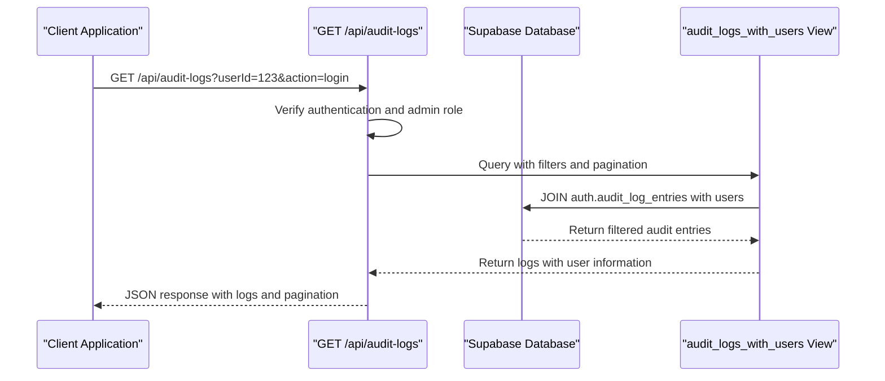
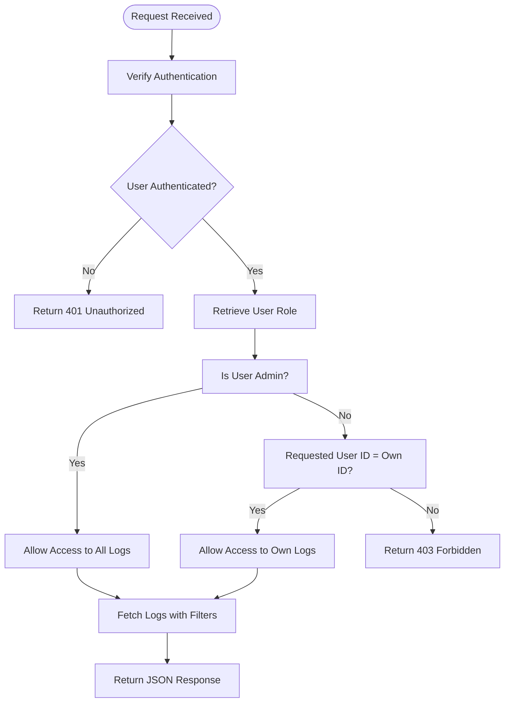
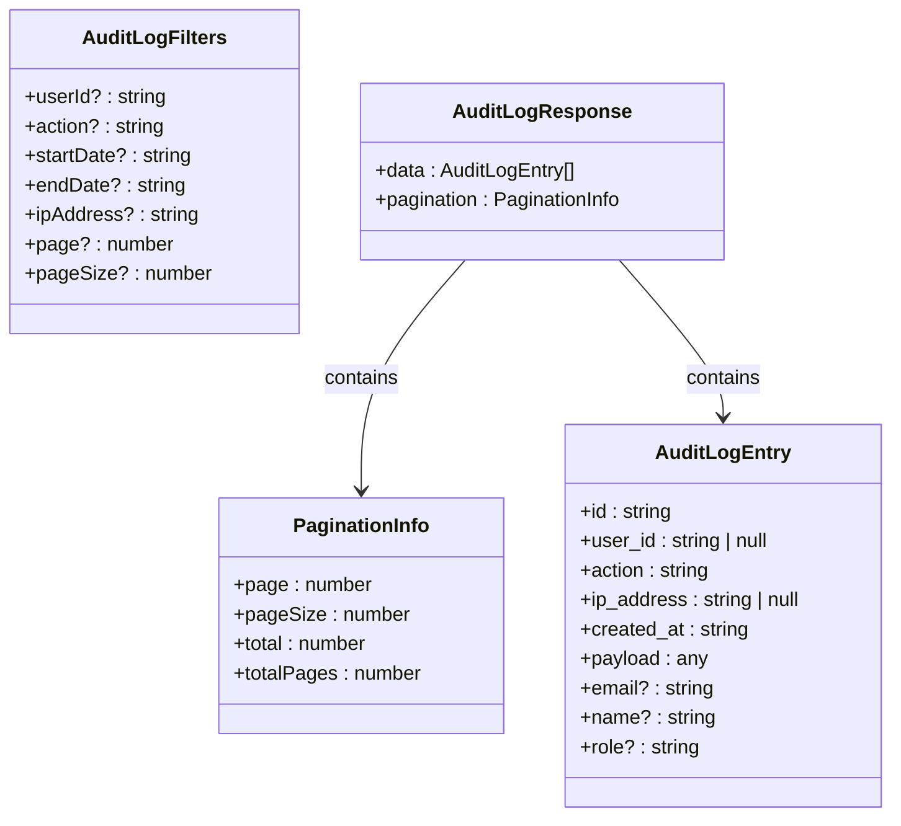
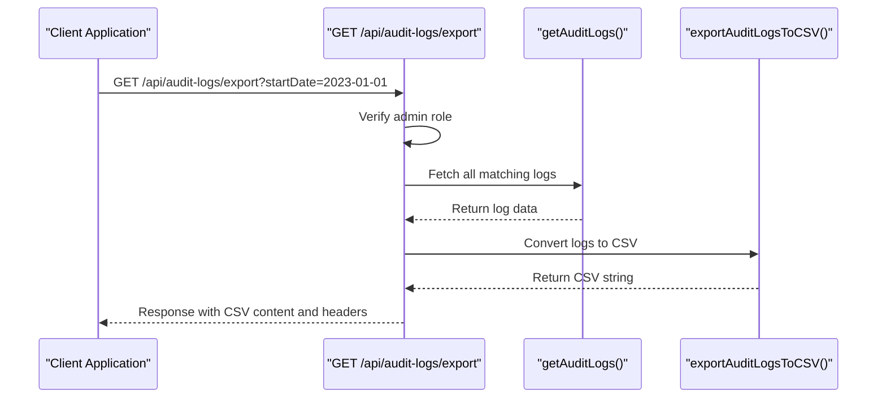
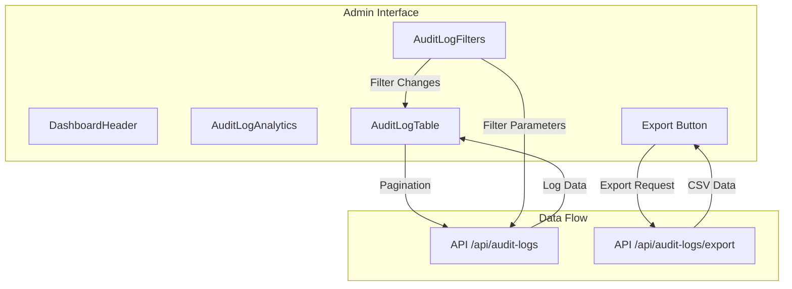
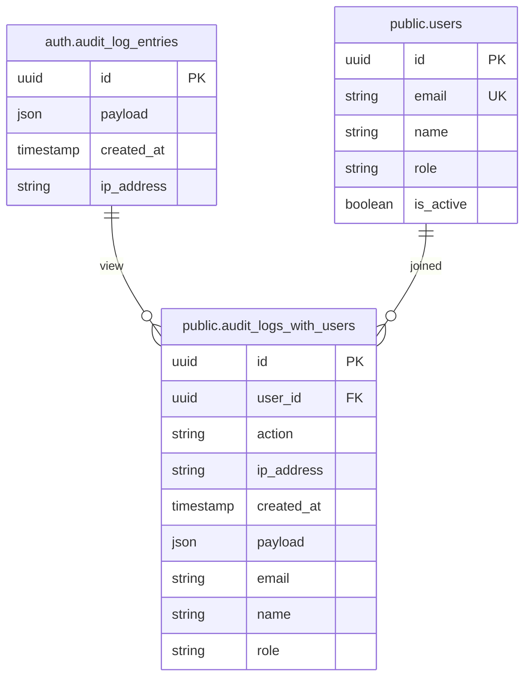

# Log Access and Retrieval

<cite>
**Referenced Files in This Document**   
- [route.ts](file://app/api/audit-logs/route.ts)
- [export/route.ts](file://app/api/audit-logs/export/route.ts)
- [audit-log-table.tsx](file://components/audit-log-table.tsx)
- [audit-log-filters.tsx](file://components/audit-log-filters.tsx)
- [audit-logs.ts](file://lib/supabase/audit-logs.ts)
- [page.tsx](file://app/admin/audit-logs/page.tsx)
- [20260108_audit_logs_indexes.sql](file://supabase/migrations/20260108_audit_logs_indexes.sql)
- [user-audit-history.tsx](file://components/user-audit-history.tsx)
</cite>

## Table of Contents
1. [Introduction](#introduction)
2. [Core API Endpoints](#core-api-endpoints)
3. [Authentication and Authorization](#authentication-and-authorization)
4. [Request Parameters and Filtering](#request-parameters-and-filtering)
5. [Pagination System](#pagination-system)
6. [Response Structure](#response-structure)
7. [CSV Export Functionality](#csv-export-functionality)
8. [UI Components and Integration](#ui-components-and-integration)
9. [Security Measures](#security-measures)
10. [Database Architecture](#database-architecture)
11. [Usage Examples](#usage-examples)
12. [Troubleshooting Guide](#troubleshooting-guide)

## Introduction
The audit log access functionality in the School-Management-System provides a comprehensive system for monitoring authentication events and security activities. This document details the implementation of the GET /api/audit-logs endpoint, which enables administrators to retrieve filtered logs with various parameters including user ID, action type, date range, and IP address. The system includes robust pagination, admin-only authorization controls, and CSV export capabilities with security protections against formula injection attacks.

The audit log system is designed to provide visibility into user activities while maintaining strict security controls. It integrates with Supabase Auth's audit log entries and extends them with user information through database views. The functionality is accessible through both API endpoints and UI components, allowing for flexible integration across the application.

**Section sources**
- [route.ts](file://app/api/audit-logs/route.ts#L1-L65)
- [audit-logs.ts](file://lib/supabase/audit-logs.ts#L1-L321)

## Core API Endpoints
The audit log system exposes two primary API endpoints for log retrieval and export. The main endpoint at `/api/audit-logs` handles filtered log retrieval with pagination, while the export endpoint at `/api/audit-logs/export` generates CSV files for download.

The GET /api/audit-logs endpoint serves as the primary interface for retrieving audit logs with various filtering options. It supports query parameters for filtering by user ID, action type, date range, and IP address. The endpoint also includes a special mode for detecting suspicious activity when the detectSuspicious parameter is set to true.

The export endpoint at `/api/audit-logs/export` provides CSV export functionality for audit logs. This endpoint is specifically designed for administrative use and returns properly formatted CSV files with appropriate Content-Disposition headers to trigger browser downloads.



**Diagram sources**
- [route.ts](file://app/api/audit-logs/route.ts#L5-L65)
- [20260108_audit_logs_indexes.sql](file://supabase/migrations/20260108_audit_logs_indexes.sql#L8-L20)

## Authentication and Authorization
The audit log access system implements a strict authorization model that restricts access based on user roles. Only users with the "admin" role can access the full audit log data, while regular users can only view their own activity logs.

The authorization process begins with authentication verification using Supabase Auth. The system first checks if the requesting user is authenticated by calling supabase.auth.getUser(). If no user is found, the request is rejected with a 401 Unauthorized status.

After successful authentication, the system retrieves the user's role from the users table. The authorization logic then determines access rights based on this role. Administrators can view all logs in the system, while non-admin users are restricted to viewing only their own logs. This is enforced by checking if the requested userId parameter matches the authenticated user's ID.



**Diagram sources**
- [route.ts](file://app/api/audit-logs/route.ts#L9-L38)
- [export/route.ts](file://app/api/audit-logs/export/route.ts#L17-L26)

**Section sources**
- [route.ts](file://app/api/audit-logs/route.ts#L9-L38)
- [export/route.ts](file://app/api/audit-logs/export/route.ts#L17-L26)

## Request Parameters and Filtering
The GET /api/audit-logs endpoint supports multiple query parameters for filtering and retrieving specific audit log entries. These parameters allow administrators to narrow down results based on various criteria including user identity, action type, timestamp range, and network information.

The supported filtering parameters include:
- **userId**: Filter logs by a specific user ID. Non-admin users can only access their own logs.
- **action**: Filter logs by action type (e.g., login, logout, user_signedup).
- **startDate**: Return logs created on or after this date (ISO format).
- **endDate**: Return logs created on or before this date (ISO format).
- **ipAddress**: Filter logs by IP address.
- **detectSuspicious**: When set to "true", returns suspicious activity alerts instead of logs.

The filtering system is implemented in the getAuditLogs utility function, which constructs a Supabase query based on the provided parameters. Each parameter is conditionally added to the query only if it is present in the request. For example, if a userId parameter is provided, the query includes an .eq("user_id", userId) condition.

**Section sources**
- [route.ts](file://app/api/audit-logs/route.ts#L24-L34)
- [audit-logs.ts](file://lib/supabase/audit-logs.ts#L41-L68)

## Pagination System
The audit log retrieval system implements a comprehensive pagination mechanism to handle large volumes of log data efficiently. The pagination is controlled by two query parameters: page and pageSize, with default values of 1 and 50 respectively.

The pagination system calculates the appropriate data range using the formula: from = (page - 1) * pageSize and to = from + pageSize - 1. This range is then applied to the Supabase query using the .range() method, which limits the results to the specified offset and count.

The response includes a pagination object that provides metadata about the result set:
- **page**: Current page number
- **pageSize**: Number of items per page
- **total**: Total number of matching logs
- **totalPages**: Total number of pages available

This pagination metadata allows clients to implement navigation controls and understand the scope of the results. The system also handles edge cases such as invalid page numbers and empty result sets.



**Diagram sources**
- [audit-logs.ts](file://lib/supabase/audit-logs.ts#L20-L28)
- [audit-logs.ts](file://lib/supabase/audit-logs.ts#L74-L81)

**Section sources**
- [route.ts](file://app/api/audit-logs/route.ts#L31-L32)
- [audit-logs.ts](file://lib/supabase/audit-logs.ts#L48-L53)

## Response Structure
The GET /api/audit-logs endpoint returns a structured JSON response containing the requested audit log entries and pagination metadata. The response format is designed to provide both the log data and contextual information about the result set.

The response object has two main properties:
- **data**: An array of AuditLogEntry objects containing the actual log records
- **pagination**: An object with metadata about the pagination state

Each AuditLogEntry contains comprehensive information about an authentication event:
- **id**: Unique identifier for the log entry
- **user_id**: ID of the user associated with the action
- **action**: Type of action performed (e.g., login, logout)
- **ip_address**: IP address from which the action originated
- **created_at**: Timestamp of when the action occurred
- **payload**: Additional data related to the action
- **email**: Email address of the user (joined from users table)
- **name**: Name of the user (joined from users table)
- **role**: Role of the user (joined from users table)

The response structure enables clients to display the logs in a user-friendly format while maintaining access to all relevant details for security analysis.

**Section sources**
- [route.ts](file://app/api/audit-logs/route.ts#L59)
- [audit-logs.ts](file://lib/supabase/audit-logs.ts#L73-L81)

## CSV Export Functionality
The audit log system includes a dedicated export endpoint that generates CSV files for download. This functionality is accessible at `/api/audit-logs/export` and is restricted to admin users only.

The export process begins by fetching all matching logs without pagination limits, using a large pageSize value of 10,000 to accommodate extensive datasets. The retrieved logs are then converted to CSV format using the exportAuditLogsToCSV utility function.

A critical security feature of the export functionality is the protection against formula injection attacks. The escapeCSVCell function sanitizes each cell value to prevent malicious content from being interpreted as formulas when opened in spreadsheet applications. Values that start with dangerous characters (=, +, -, @, tab, or carriage return) are prefixed with a single quote and wrapped in double quotes.

The response includes proper HTTP headers to ensure the browser treats the content as a downloadable file:
- **Content-Type**: text/csv
- **Content-Disposition**: attachment; filename="audit-logs-{date}.csv"



**Diagram sources**
- [export/route.ts](file://app/api/audit-logs/export/route.ts#L5-L58)
- [audit-logs.ts](file://lib/supabase/audit-logs.ts#L244-L261)

**Section sources**
- [export/route.ts](file://app/api/audit-logs/export/route.ts#L5-L58)
- [audit-logs.ts](file://lib/supabase/audit-logs.ts#L232-L261)

## UI Components and Integration
The audit log functionality is integrated into the application through several UI components that provide a user-friendly interface for viewing and managing logs. The primary components include AuditLogTable, AuditLogFilters, and the admin page at /admin/audit-logs.

The AuditLogTable component renders the audit logs in a tabular format with columns for date/time, user information, role, action, and IP address. Each action is displayed with a badge that reflects its severity level (high, medium, low) using different visual styles. The component uses the DataTable component from the UI library to provide a consistent interface.

The AuditLogFilters component provides a form interface for applying filters to the log data. It includes input fields for all filter parameters (userId, action, startDate, endDate, ipAddress) and buttons for applying and clearing filters. The component maintains its own state and communicates filter changes to parent components through callback functions.

The admin page at /admin/audit-logs integrates these components and handles the API communication. It manages the state for pagination, filters, and loading status, and makes the appropriate API calls to retrieve data based on user interactions.



**Diagram sources**
- [page.tsx](file://app/admin/audit-logs/page.tsx#L24-L336)
- [audit-log-table.tsx](file://components/audit-log-table.tsx#L1-L84)
- [audit-log-filters.tsx](file://components/audit-log-filters.tsx#L1-L154)

**Section sources**
- [page.tsx](file://app/admin/audit-logs/page.tsx#L24-L336)
- [audit-log-table.tsx](file://components/audit-log-table.tsx#L1-L84)
- [audit-log-filters.tsx](file://components/audit-log-filters.tsx#L1-L154)

## Security Measures
The audit log access system implements multiple security measures to protect sensitive data and prevent abuse. These measures include role-based access control, data sanitization, and protection against common web vulnerabilities.

The primary security mechanism is the role-based authorization system that restricts access to audit logs. Only users with the "admin" role can view logs for all users, while regular users are limited to viewing their own activity. This prevents privilege escalation and ensures that sensitive authentication data is only accessible to authorized personnel.

For the CSV export functionality, the system includes protection against formula injection attacks. The escapeCSVCell function sanitizes cell values by prefixing potentially dangerous characters (=, +, -, @, tab, carriage return) with a single quote and properly escaping quotes within the content. This prevents malicious content from being interpreted as formulas when opened in spreadsheet applications.

The system also implements proper error handling and logging. All errors are caught and logged server-side, while generic error messages are returned to clients to prevent information disclosure. The system logs API errors to help with debugging while maintaining security.

**Section sources**
- [route.ts](file://app/api/audit-logs/route.ts#L36-L38)
- [audit-logs.ts](file://lib/supabase/audit-logs.ts#L232-L239)
- [security.ts](file://lib/security.ts#L11-L14)

## Database Architecture
The audit log system relies on a database architecture that combines Supabase Auth's built-in audit log functionality with custom views and policies. The core data is stored in the auth.audit_log_entries table, which is automatically managed by Supabase Auth.

To make the audit log data more accessible and useful, the system creates a view called audit_logs_with_users. This view joins the audit log entries with the users table to include user information such as email, name, and role. The view extracts the user ID and action type from the JSON payload in the audit log entries and combines them with user data from the public.users table.

Row Level Security (RLS) policies are implemented to control access to the audit log data. The view is granted SELECT access to authenticated users, but the actual access is controlled by the application-level authorization logic. This layered approach provides both database-level and application-level security controls.



**Diagram sources**
- [20260108_audit_logs_indexes.sql](file://supabase/migrations/20260108_audit_logs_indexes.sql#L8-L20)
- [20260108132041_audit_logs_view_v2.sql](file://supabase/migrations/20260108132041_audit_logs_view_v2.sql#L3-L15)

**Section sources**
- [20260108_audit_logs_indexes.sql](file://supabase/migrations/20260108_audit_logs_indexes.sql#L8-L20)

## Usage Examples
The audit log access functionality can be used in various scenarios to monitor system activity and investigate security events. Below are examples of common use cases and their corresponding API requests.

To retrieve login attempts for a specific user within a date range:
```
GET /api/audit-logs?userId=123e4567-e89b-12d3-a456-426614174000&action=login&startDate=2023-01-01&endDate=2023-01-31&page=1&pageSize=50
```

To fetch all user modification events across the system (admin only):
```
GET /api/audit-logs?action=user_modified&page=1&pageSize=100
```

To export all audit logs for compliance reporting:
```
GET /api/audit-logs/export?startDate=2023-01-01&endDate=2023-12-31
```

To check for suspicious activity on a specific user account:
```
GET /api/audit-logs?userId=123e4567-e89b-12d3-a456-426614174000&detectSuspicious=true
```

The UserAuditHistory component can be used to display a user's recent security activity on their profile page:
```tsx
<UserAuditHistory userId={currentUser.id} limit={10} />
```

**Section sources**
- [route.ts](file://app/api/audit-logs/route.ts#L26-L34)
- [page.tsx](file://app/admin/audit-logs/page.tsx#L48-L52)
- [user-audit-history.tsx](file://components/user-audit-history.tsx#L26)

## Troubleshooting Guide
When working with the audit log access functionality, several common issues may arise. This section provides guidance for diagnosing and resolving these issues.

**Permission Errors (403 Forbidden)**: This error occurs when a non-admin user attempts to access logs for another user or when trying to export logs. Ensure that the requesting user has the "admin" role, or that a regular user is only accessing their own logs.

**Empty Results**: If the API returns an empty data array, verify that:
- The database migration has been applied (supabase db push)
- Audit log entries exist in the auth.audit_log_entries table
- The filter parameters match existing data
- The date format is correct (ISO format)

**Database Setup Required**: The admin interface displays a notice when the audit logs feature requires database migration. Run `supabase db push` or manually apply the migration file at supabase/migrations/20260108_audit_logs_indexes.sql.

**CSV Export Issues**: If the CSV export fails, check that:
- The user has admin privileges
- The server can generate the CSV content
- The Content-Disposition header is properly formatted
- The file size is within browser limits

**Suspicious Activity Detection**: If suspicious activity alerts are not appearing, verify that:
- The detectSuspicious parameter is set to "true"
- There are recent log entries within the last 5 minutes
- The log entries contain actions that trigger alerts (failed logins, password changes, etc.)

**Section sources**
- [page.tsx](file://app/admin/audit-logs/page.tsx#L161-L177)
- [route.ts](file://app/api/audit-logs/route.ts#L14-L15)
- [route.ts](file://app/api/audit-logs/route.ts#L36-L38)