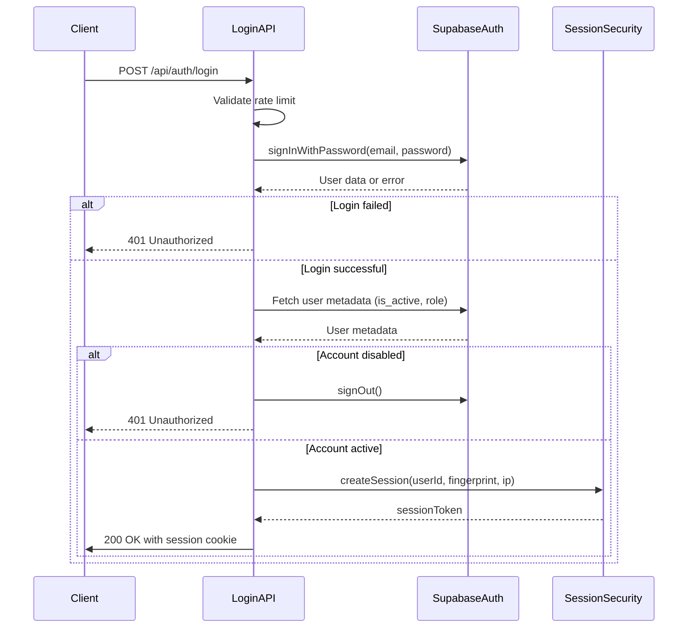
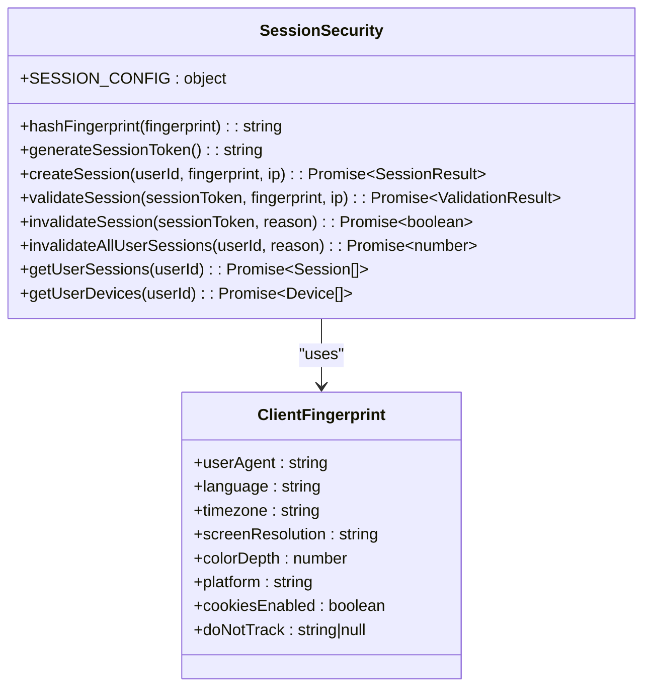
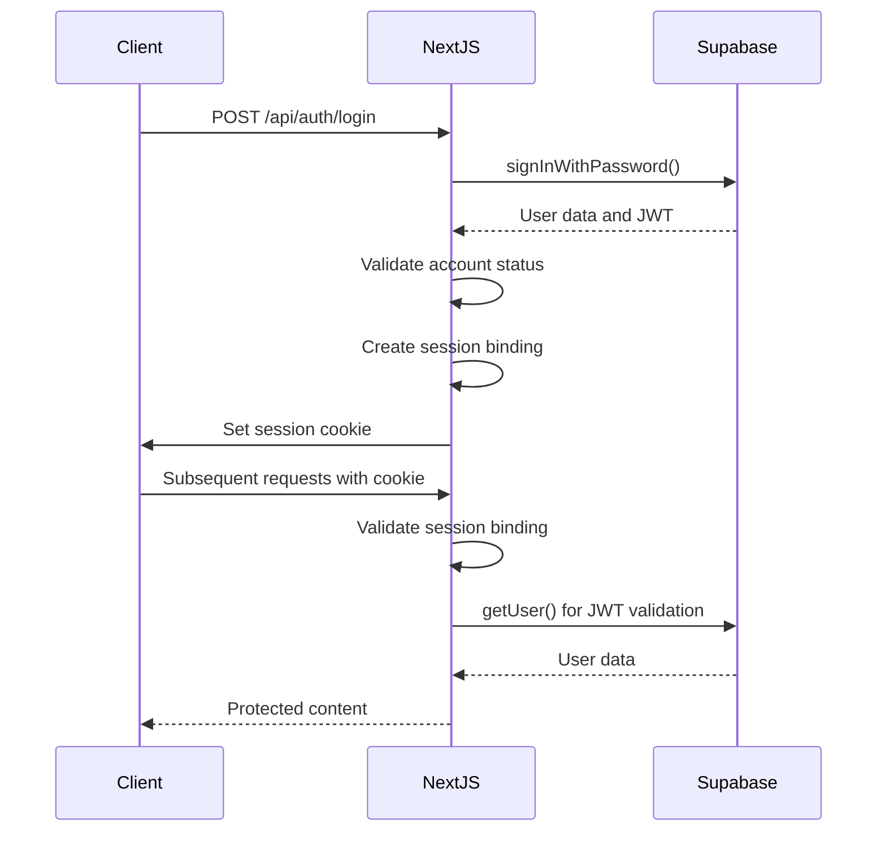

# Authentication API Endpoints

<cite>
**Referenced Files in This Document**   
- [login/route.ts](file://app/api/auth/login/route.ts)
- [logout/route.ts](file://app/api/auth/logout/route.ts)
- [me/route.ts](file://app/api/auth/me/route.ts)
- [sessions/route.ts](file://app/api/auth/sessions/route.ts)
- [check-auth/route.ts](file://app/api/check-auth/route.ts)
- [profile/update/route.ts](file://app/api/profile/update/route.ts)
- [profile/upload-avatar/route.ts](file://app/api/profile/upload-avatar/route.ts)
- [session-security.ts](file://lib/session-security.ts)
- [use-session-timeout.ts](file://lib/hooks/use-session-timeout.ts)
- [security.ts](file://lib/security.ts)
- [enroll/page.tsx](file://app/auth/mfa/enroll/page.tsx)
- [verify/page.tsx](file://app/auth/mfa/verify/page.tsx)
- [server.ts](file://lib/supabase/server.ts)
</cite>

## Table of Contents
1. [Introduction](#introduction)
2. [Authentication Endpoints](#authentication-endpoints)
3. [Profile Management Endpoints](#profile-management-endpoints)
4. [Session Management and Security](#session-management-and-security)
5. [Multi-Factor Authentication](#multi-factor-authentication)
6. [Security Practices](#security-practices)
7. [Integration with Supabase](#integration-with-supabase)
8. [Error Handling](#error-handling)

## Introduction
The School-Management-System implements a robust authentication system using Supabase Auth with enhanced security features including session binding, rate limiting, and multi-factor authentication. This documentation details the authentication and profile management endpoints, their request/response schemas, security mechanisms, and integration patterns.

**Section sources**
- [login/route.ts](file://app/api/auth/login/route.ts#L1-L117)
- [logout/route.ts](file://app/api/auth/logout/route.ts#L1-L36)

## Authentication Endpoints

### POST /api/auth/login
Authenticates a user with email and password credentials.

**Request**
- Method: POST
- URL: `/api/auth/login`
- Content-Type: `application/json`
- Body Schema:
```json
{
  "email": "string",
  "password": "string",
  "fingerprint": {
    "userAgent": "string",
    "language": "string",
    "timezone": "string",
    "screenResolution": "string",
    "colorDepth": "number",
    "platform": "string",
    "cookiesEnabled": "boolean",
    "doNotTrack": "string|null"
  }
}
```

**Response**
- Success (200): 
```json
{
  "user": "object",
  "role": "string",
  "isNewDevice": "boolean"
}
```
- Unauthorized (401): `{ "error": "Invalid login credentials" }`
- Rate Limited (429): `{ "error": "Too many login attempts. Please try again later." }`

**Security Features**
- Rate limiting (5 attempts per minute)
- Generic error messages to prevent user enumeration
- Session binding with device fingerprint
- Account status validation (active/inactive)



**Diagram sources**
- [login/route.ts](file://app/api/auth/login/route.ts#L7-L117)
- [session-security.ts](file://lib/session-security.ts#L68-L147)

**Section sources**
- [login/route.ts](file://app/api/auth/login/route.ts#L7-L117)

### POST /api/auth/logout
Terminates the current user session.

**Request**
- Method: POST
- URL: `/api/auth/logout`
- Headers: Session binding cookie

**Response**
- Success (200): `{ "success": true }`

**Security Features**
- Invalidates session in database
- Clears session binding cookie
- Signs out from Supabase Auth

**Section sources**
- [logout/route.ts](file://app/api/auth/logout/route.ts#L6-L36)

### GET /api/auth/me
Retrieves the authenticated user's profile information.

**Request**
- Method: GET
- URL: `/api/auth/me`
- Headers: Authorization (Bearer token) or session cookie

**Response**
- Success (200): `{ "user": { "id": "string", "name": "string", "email": "string", "avatar": "string", "role": "string" } }`
- Unauthorized (401): `{ "error": "Unauthorized" }`

**Security Features**
- Server-side user data fetching
- Role-based access control
- Secure data filtering

**Section sources**
- [me/route.ts](file://app/api/auth/me/route.ts#L4-L28)

### POST /api/check-auth
Checks authentication status of a user (admin-only endpoint).

**Request**
- Method: POST
- URL: `/api/check-auth`
- Body: `{ "userId": "string" }`

**Response**
- Success (200): `{ "hasAuth": "boolean" }`
- Unauthorized (401): `{ "error": "Unauthorized" }`
- Forbidden (403): `{ "error": "Forbidden" }`

**Security Features**
- Admin role verification
- Service role key for user status checking
- Multi-layer authentication validation

**Section sources**
- [check-auth/route.ts](file://app/api/check-auth/route.ts#L19-L64)

## Profile Management Endpoints

### POST /api/profile/update
Updates user profile information.

**Request**
- Method: POST
- URL: `/api/profile/update`
- Body Schema: Validated against `profileUpdateSchema` with role-specific fields
- Security: Origin validation and CSRF protection

**Response**
- Success (200): `{ "success": true }`
- Bad Request (400): `{ "error": "validation error message" }`
- Unauthorized (401): `{ "error": "Unauthorized" }`
- Forbidden (403): `{ "error": "Invalid Origin" }`

**Field Access Control**
- All Users: name, phone, address, avatar
- Students: contact information, emergency contacts, medical data
- Teachers: subject, department

**Section sources**
- [profile/update/route.ts](file://app/api/profile/update/route.ts#L5-L105)
- [security.ts](file://lib/security.ts#L101-L136)

### POST /api/profile/upload-avatar
Uploads and sets a new user avatar.

**Request**
- Method: POST
- URL: `/api/profile/upload-avatar`
- Content-Type: `multipart/form-data`
- Form Field: `avatar` (File)

**Validation**
- File size: ≤ 5MB
- File types: JPEG, PNG, GIF, WebP (validated via magic numbers)
- Rate limiting: 5 uploads per 10 minutes

**Response**
- Success (200): `{ "success": true, "url": "string" }`
- Bad Request (400): `{ "error": "validation error" }`
- Unauthorized (401): `{ "error": "Unauthorized" }`
- Rate Limited (429): `{ "error": "Too many upload attempts. Please wait." }`

**Security Features**
- Magic number validation to prevent file type spoofing
- Secure filename generation
- Public URL generation via Supabase Storage
- Rate limiting by IP address

**Section sources**
- [profile/upload-avatar/route.ts](file://app/api/profile/upload-avatar/route.ts#L15-L110)

## Session Management and Security

### GET /api/auth/sessions
Retrieves the user's active sessions and devices.

**Response**
```json
{
  "sessions": [
    {
      "id": "string",
      "user_agent": "string",
      "created_at": "string",
      "last_active": "string",
      "ip_hash": "string"
    }
  ],
  "devices": [
    {
      "id": "string",
      "device_name": "string",
      "last_seen": "string",
      "login_count": "number"
    }
  ],
  "sessionCount": "number",
  "deviceCount": "number"
}
```

### DELETE /api/auth/sessions
Logs out from all devices.

**Response**
```json
{
  "success": true,
  "invalidatedSessions": "number"
}
```

**Session Security Features**
- Device fingerprinting with SHA-256 hashing
- Session binding cookies (HttpOnly, Secure, SameSite=strict)
- Single session enforcement (previous sessions invalidated on new login)
- Session timeout handling (8 hours absolute timeout)
- Inactivity timeout with warning



**Diagram sources**
- [session-security.ts](file://lib/session-security.ts#L17-L373)

**Section sources**
- [sessions/route.ts](file://app/api/auth/sessions/route.ts#L6-L72)
- [session-security.ts](file://lib/session-security.ts#L17-L373)

## Multi-Factor Authentication

### MFA Enrollment Flow
1. User navigates to `/auth/mfa/enroll`
2. Verifies password to confirm identity
3. System generates TOTP secret and QR code
4. User scans QR code with authenticator app
5. User enters verification code to complete enrollment

### MFA Verification Flow
1. User logs in with email/password
2. System redirects to `/auth/mfa/verify`
3. User enters 6-digit code from authenticator app
4. System verifies code and grants AAL2 access

**Security Features**
- TOTP-based authentication
- AAL2 (Authentication Assurance Level 2) for admin access
- Secure secret key handling
- QR code generation with styling

**Section sources**
- [enroll/page.tsx](file://app/auth/mfa/enroll/page.tsx#L1-L251)
- [verify/page.tsx](file://app/auth/mfa/verify/page.tsx#L1-L91)

## Security Practices

### Password Security
- Password hashing via Supabase Auth (Argon2 or equivalent)
- No password storage in application database
- Rate limiting to prevent brute force attacks
- Generic error messages to prevent user enumeration

### Session Security
- **Session Binding**: Cookies bound to device fingerprint
- **CSRF Protection**: Origin validation for state-changing requests
- **Secure Cookies**: HttpOnly, Secure, SameSite=strict attributes
- **Account Takeover Prevention**: Fingerprint mismatch detection and session invalidation
- **IP Change Detection**: Configurable IP change handling

### Rate Limiting
- Login attempts: 5 per minute
- Avatar uploads: 5 per 10 minutes
- Implemented via `checkRateLimit` function
- IP-based tracking with secure extraction

### Input Validation
- Zod schemas for all API inputs
- XSS prevention through URL protocol validation
- Character filtering in user input
- Field length restrictions

**Section sources**
- [session-security.ts](file://lib/session-security.ts#L17-L373)
- [security.ts](file://lib/security.ts#L1-L136)
- [rate-limit.ts](file://lib/rate-limit.ts)

## Integration with Supabase

### Authentication Flow


**Diagram sources**
- [server.ts](file://lib/supabase/server.ts#L5-L30)
- [middleware.ts](file://lib/supabase/middleware.ts#L4-L38)

### Client Configuration
- **Server Components**: `createServerClient` with cookie integration
- **Client Components**: `createBrowserClient` for client-side operations
- **Admin Operations**: Service role client for RLS bypass
- **Middleware**: Session handling with `updateSession` function

**Section sources**
- [server.ts](file://lib/supabase/server.ts#L5-L51)
- [client.ts](file://lib/supabase/client.ts#L3-L9)
- [middleware.ts](file://lib/supabase/middleware.ts#L4-L38)

## Error Handling

### Standard Error Codes
- **400 Bad Request**: Invalid input data
- **401 Unauthorized**: Missing or invalid authentication
- **403 Forbidden**: Insufficient permissions
- **429 Too Many Requests**: Rate limit exceeded
- **500 Internal Server Error**: Unexpected server error

### Error Response Format
```json
{ "error": "error message" }
```

### Security Error Handling
- Fail-closed approach for authentication
- Generic error messages to prevent information disclosure
- Comprehensive logging of security events
- Silent failure for certain operations (e.g., logout)

**Section sources**
- [login/route.ts](file://app/api/auth/login/route.ts#L114-L116)
- [logout/route.ts](file://app/api/auth/logout/route.ts#L28-L33)
- [me/route.ts](file://app/api/auth/me/route.ts#L24-L27)