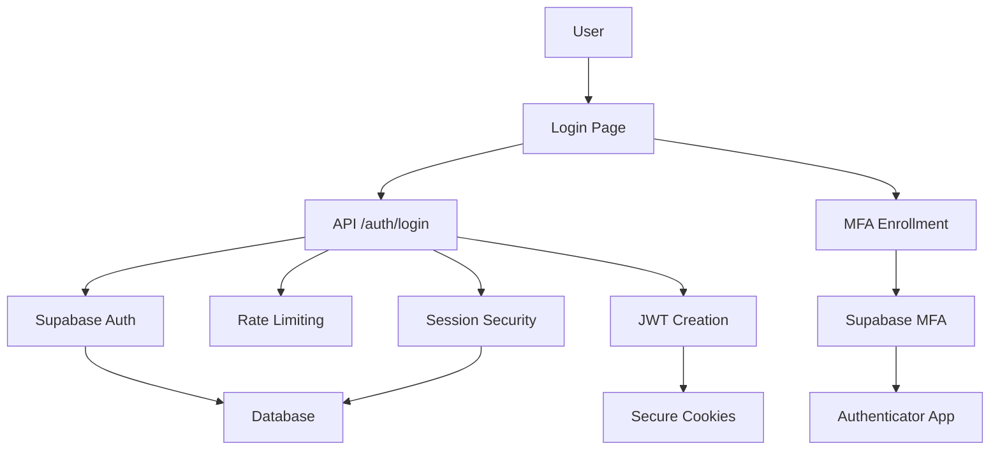
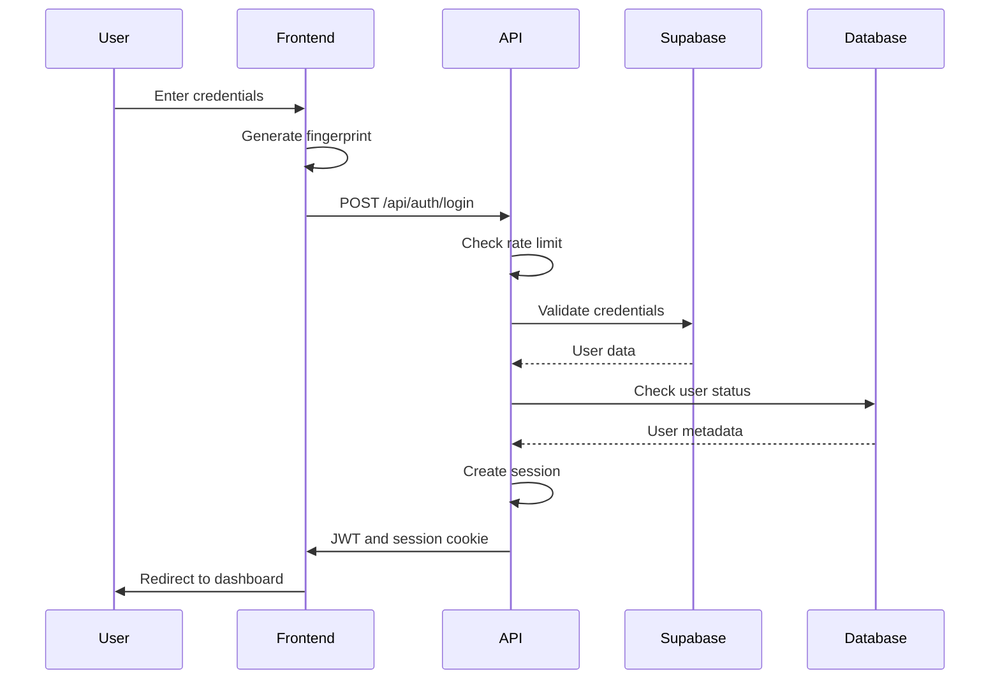
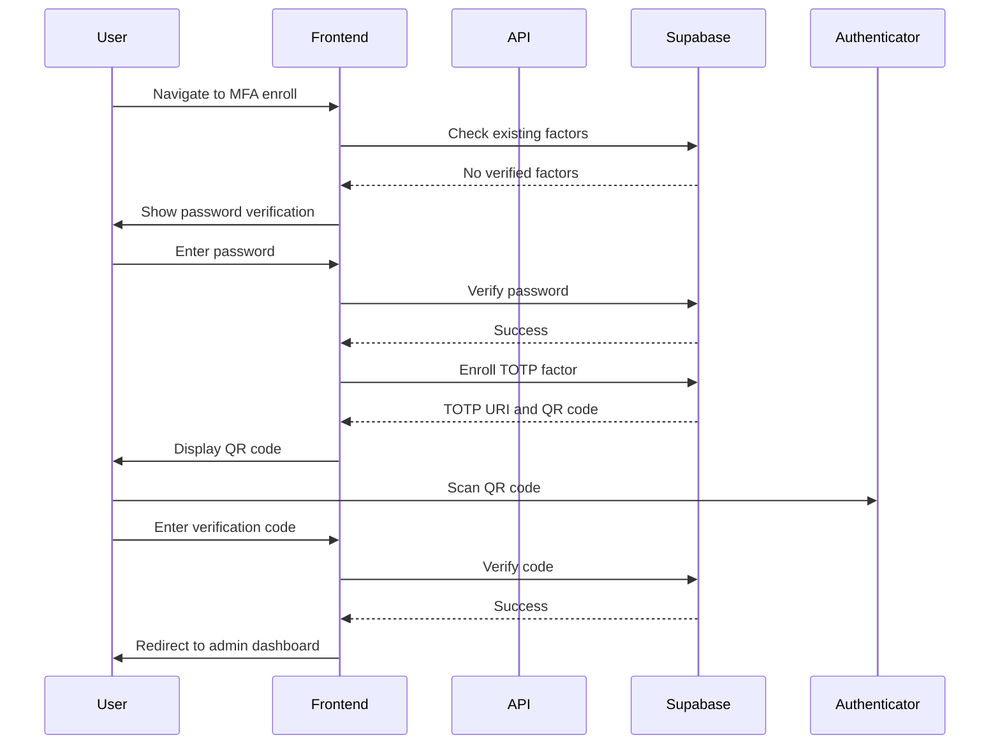
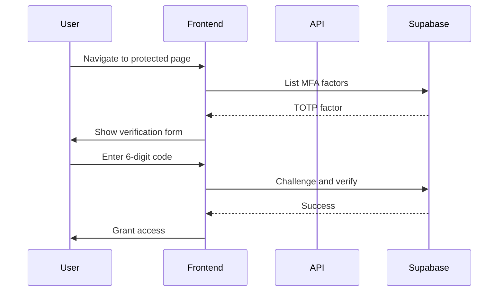
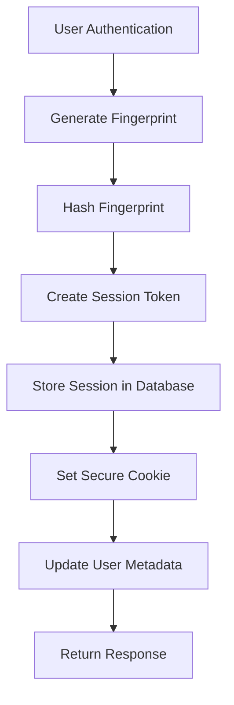
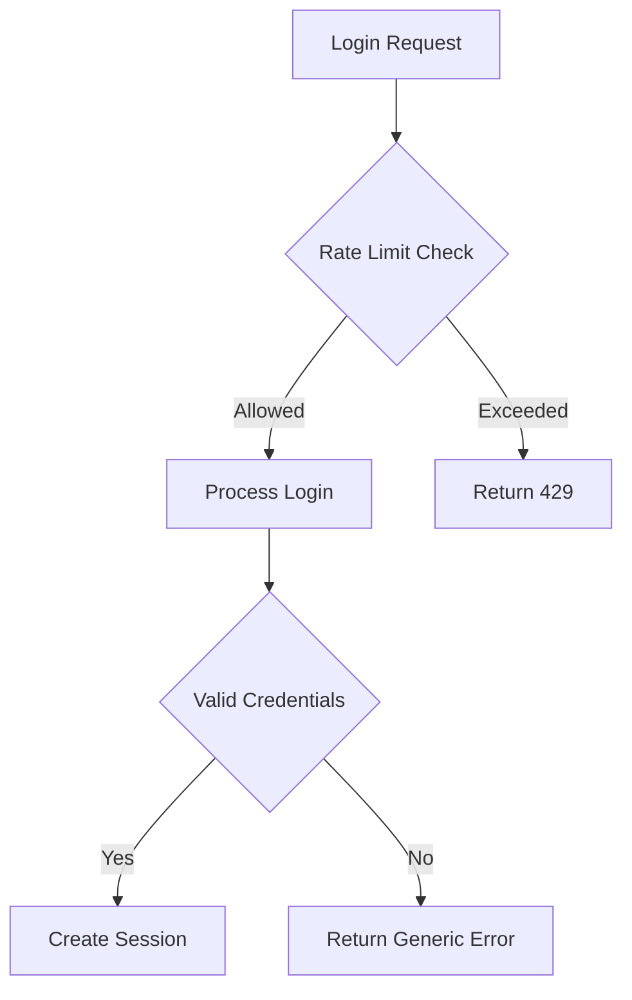
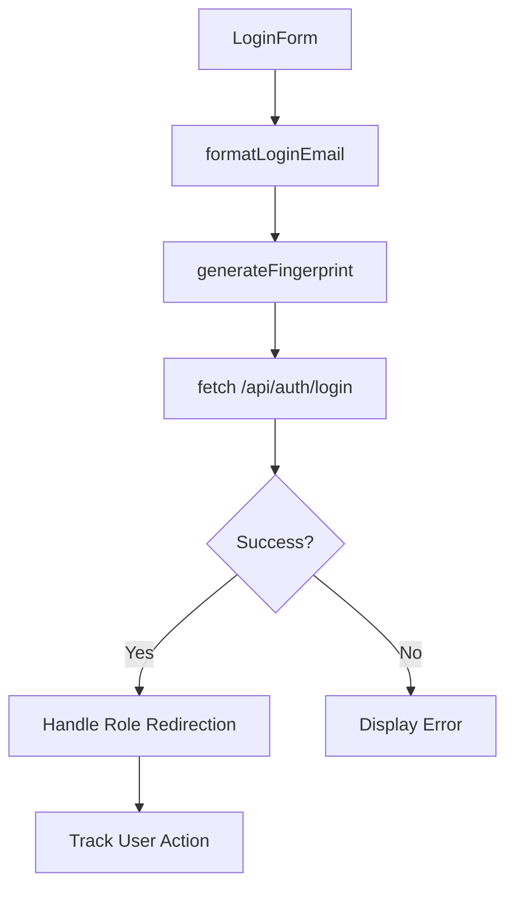
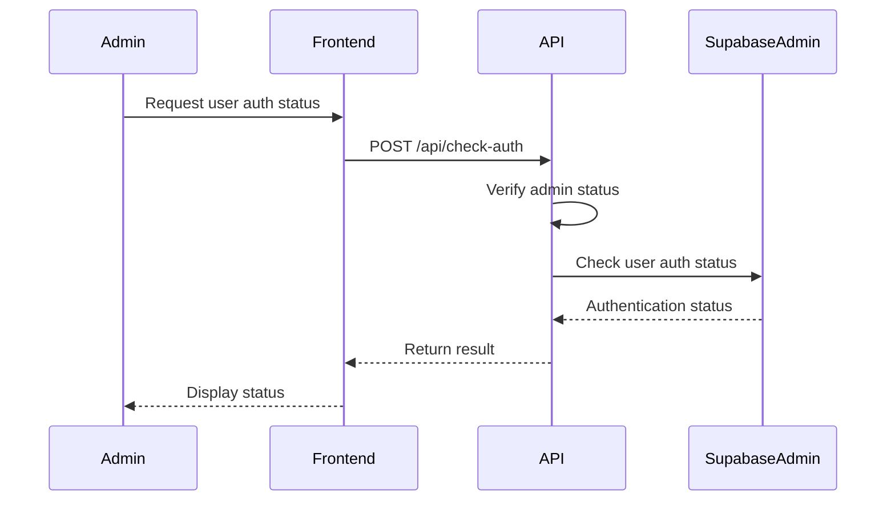

# Authentication Flow

<cite>
**Referenced Files in This Document**   
- [login/route.ts](file://app/api/auth/login/route.ts)
- [logout/route.ts](file://app/api/auth/logout/route.ts)
- [me/route.ts](file://app/api/auth/me/route.ts)
- [check-auth/route.ts](file://app/api/check-auth/route.ts)
- [session-security.ts](file://lib/session-security.ts)
- [rate-limit.ts](file://lib/rate-limit.ts)
- [security.ts](file://lib/security.ts)
- [fingerprint.ts](file://lib/fingerprint.ts)
- [login/page.tsx](file://app/login/page.tsx)
- [mfa/enroll/page.tsx](file://app/auth/mfa/enroll/page.tsx)
- [mfa/verify/page.tsx](file://app/auth/mfa/verify/page.tsx)
- [use-session-timeout.ts](file://lib/hooks/use-session-timeout.ts)
- [admin-session-guard.tsx](file://components/admin-session-guard.tsx)
- [20260111053538_session_security.sql](file://supabase/migrations/20260111053538_session_security.sql)
- [20260111054141_fix_session_functions_search_path.sql](file://supabase/migrations/20260111054141_fix_session_functions_search_path.sql)
</cite>

## Table of Contents
1. [Introduction](#introduction)
2. [Authentication Architecture](#authentication-architecture)
3. [Standard Login Flow](#standard-login-flow)
4. [MFA Enrollment and Verification](#mfa-enrollment-and-verification)
5. [Session Management and Security](#session-management-and-security)
6. [Security Measures](#security-measures)
7. [Frontend Integration](#frontend-integration)
8. [Session Validation](#session-validation)
9. [Conclusion](#conclusion)

## Introduction
The School-Management-System implements a comprehensive authentication system that ensures secure access to educational resources while maintaining usability. This document details the complete authentication flow from credential submission to session establishment, covering standard login, multi-factor authentication (MFA), session management, and security measures. The system leverages Supabase Auth for identity management, implements robust session security through device fingerprinting, and incorporates multiple layers of protection against common threats such as brute-force attacks and session hijacking.

**Section sources**
- [login/route.ts](file://app/api/auth/login/route.ts#L1-L117)
- [session-security.ts](file://lib/session-security.ts#L1-L373)

## Authentication Architecture
The authentication system follows a layered security approach with multiple components working together to provide secure access control. The architecture consists of frontend components for user interaction, API routes for authentication processing, and backend security services for session management and protection.

**Diagram sources**
- [login/route.ts](file://app/api/auth/login/route.ts#L1-L117)
- [session-security.ts](file://lib/session-security.ts#L1-L373)
- [login/page.tsx](file://app/login/page.tsx#L1-L209)

## Standard Login Flow
The standard login process begins when a user submits their credentials through the login form. The system supports both email and LRN (Learner Reference Number) based authentication, automatically formatting LRNs into valid email addresses for authentication purposes.

The login flow proceeds as follows:
1. User enters email or 12-digit LRN and password
2. Frontend generates a browser fingerprint and submits credentials to the API
3. Server applies rate limiting to prevent brute-force attacks
4. Supabase Auth validates credentials
5. System checks account status and user metadata
6. Session is created with device binding
7. JWT and secure cookies are issued

**Diagram sources**
- [login/route.ts](file://app/api/auth/login/route.ts#L1-L117)
- [login/page.tsx](file://app/login/page.tsx#L1-L209)

**Section sources**
- [login/route.ts](file://app/api/auth/login/route.ts#L1-L117)
- [login/page.tsx](file://app/login/page.tsx#L1-L209)

## MFA Enrollment and Verification
The system implements Time-based One-Time Password (TOTP) multi-factor authentication to enhance security for administrative accounts. The MFA flow consists of two main processes: enrollment and verification.

### MFA Enrollment Process
The enrollment process guides users through setting up MFA with their authenticator app:

### MFA Verification Process
After enrollment, users must verify their identity with MFA when accessing protected resources:

**Diagram sources**
- [mfa/enroll/page.tsx](file://app/auth/mfa/enroll/page.tsx#L1-L251)
- [mfa/verify/page.tsx](file://app/auth/mfa/verify/page.tsx#L1-L91)

**Section sources**
- [mfa/enroll/page.tsx](file://app/auth/mfa/enroll/page.tsx#L1-L251)
- [mfa/verify/page.tsx](file://app/auth/mfa/verify/page.tsx#L1-L91)

## Session Management and Security
The system implements robust session management to prevent session hijacking and ensure secure access. Each session is bound to the user's device through a cryptographic fingerprint, providing an additional layer of security beyond traditional authentication methods.

### Session Creation
When a user successfully authenticates, the system creates a session record that includes:

- Session token (cryptographically random)
- Device fingerprint hash
- IP address hash
- User agent string
- Timestamps for creation and last activity

### Session Validation
The system validates sessions on each request by comparing the current device fingerprint with the stored hash. If a mismatch is detected, the session is immediately invalidated to prevent potential hijacking.

**Section sources**
- [session-security.ts](file://lib/session-security.ts#L1-L373)
- [fingerprint.ts](file://lib/fingerprint.ts#L1-L68)

## Security Measures
The authentication system incorporates multiple security measures to protect against common threats and vulnerabilities.

### Rate Limiting and Brute-Force Protection
The system implements rate limiting to prevent brute-force attacks on the login endpoint. The rate limiting mechanism allows 5 login attempts per minute per IP address, with a fail-closed policy to ensure security during database outages.

### Account Lockout Mechanism
The system prevents user enumeration by returning generic error messages for both invalid credentials and disabled accounts. This ensures that attackers cannot determine whether an account exists based on error responses.

**Section sources**
- [rate-limit.ts](file://lib/rate-limit.ts#L1-L56)
- [security.ts](file://lib/security.ts#L1-L136)
- [login/route.ts](file://app/api/auth/login/route.ts#L1-L117)

## Frontend Integration
The frontend components provide a seamless user experience while maintaining security best practices. The login form handles both standard authentication and MFA flows, with appropriate feedback for users.

### Login Form Implementation
The login form includes the following features:
- LRN to email formatting
- Password visibility toggle
- Loading states
- Error handling
- Session timeout notifications

### Session Timeout Handling
The system implements both inactivity and absolute session timeouts to ensure security. The inactivity timeout is set to 30 minutes, while the absolute timeout is 8 hours. Users receive a 2-minute warning before timeout, allowing them to extend their session.

**Section sources**
- [login/page.tsx](file://app/login/page.tsx#L1-L209)
- [use-session-timeout.ts](file://lib/hooks/use-session-timeout.ts#L1-L198)
- [admin-session-guard.tsx](file://components/admin-session-guard.tsx#L1-L34)

## Session Validation
The system validates session integrity through multiple mechanisms to prevent unauthorized access. The check-auth endpoint allows administrative users to verify the authentication status of other users, which is useful for account management and security monitoring.

### check-auth Endpoint
The check-auth API endpoint performs the following validation steps:
1. Verify the requesting user is authenticated and has admin privileges
2. Use the service role key to check the target user's authentication status
3. Return the authentication status without exposing sensitive information

**Diagram sources**
- [check-auth/route.ts](file://app/api/check-auth/route.ts#L1-L64)

**Section sources**
- [check-auth/route.ts](file://app/api/check-auth/route.ts#L1-L64)
- [me/route.ts](file://app/api/auth/me/route.ts#L1-L28)

## Conclusion
The School-Management-System implements a comprehensive authentication system that balances security and usability. By leveraging Supabase Auth for identity management and implementing additional security layers such as device fingerprinting, rate limiting, and multi-factor authentication, the system provides robust protection for educational data and resources. The session management system ensures that user sessions are bound to specific devices, preventing session hijacking, while the frontend components provide a seamless user experience. The combination of these security measures creates a defense-in-depth approach that protects against common threats while maintaining accessibility for legitimate users.