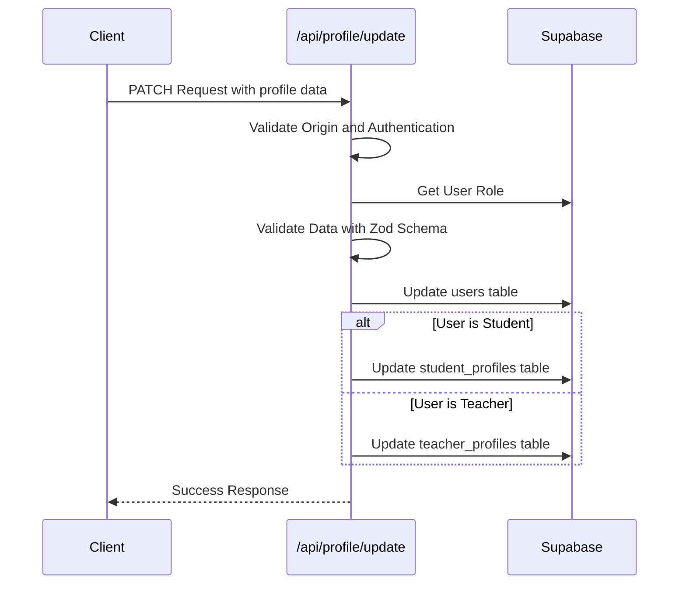
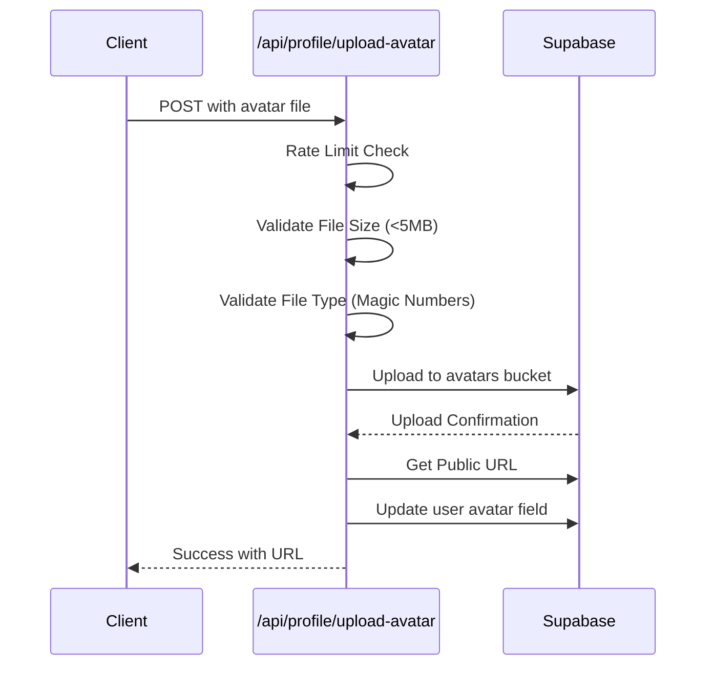
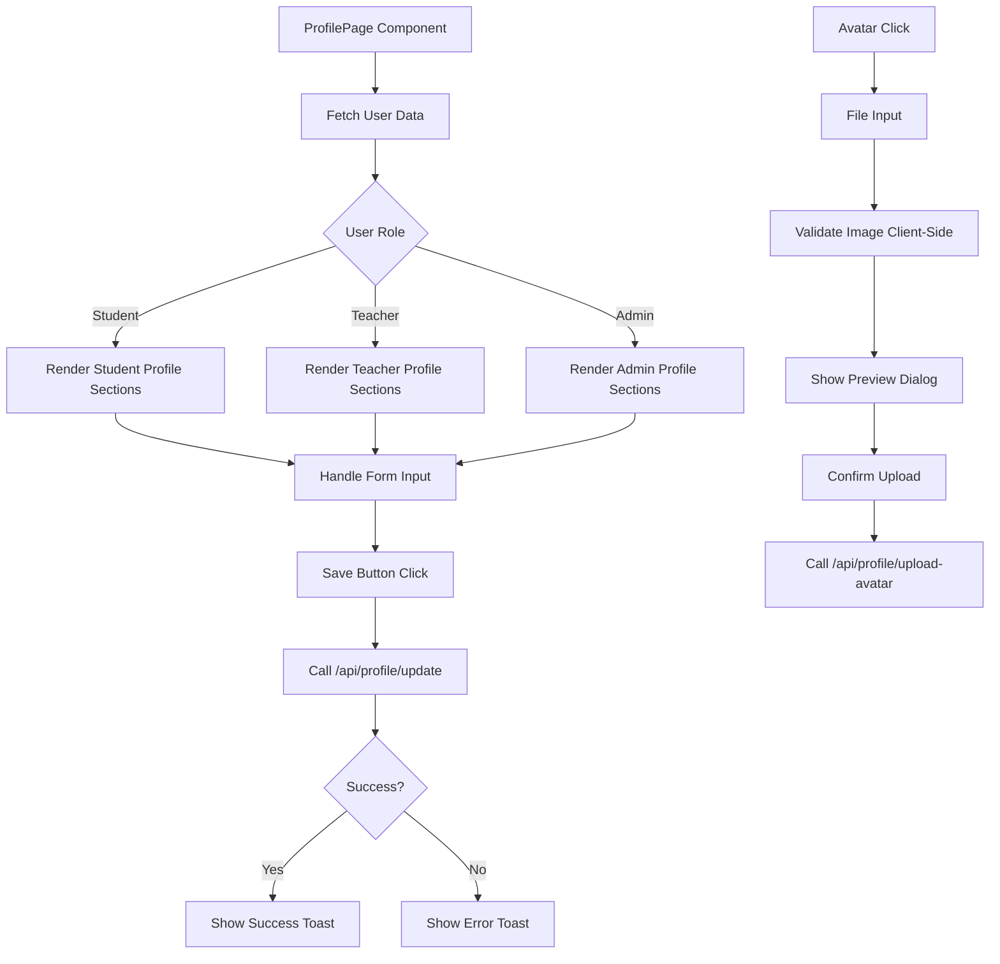
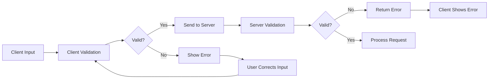
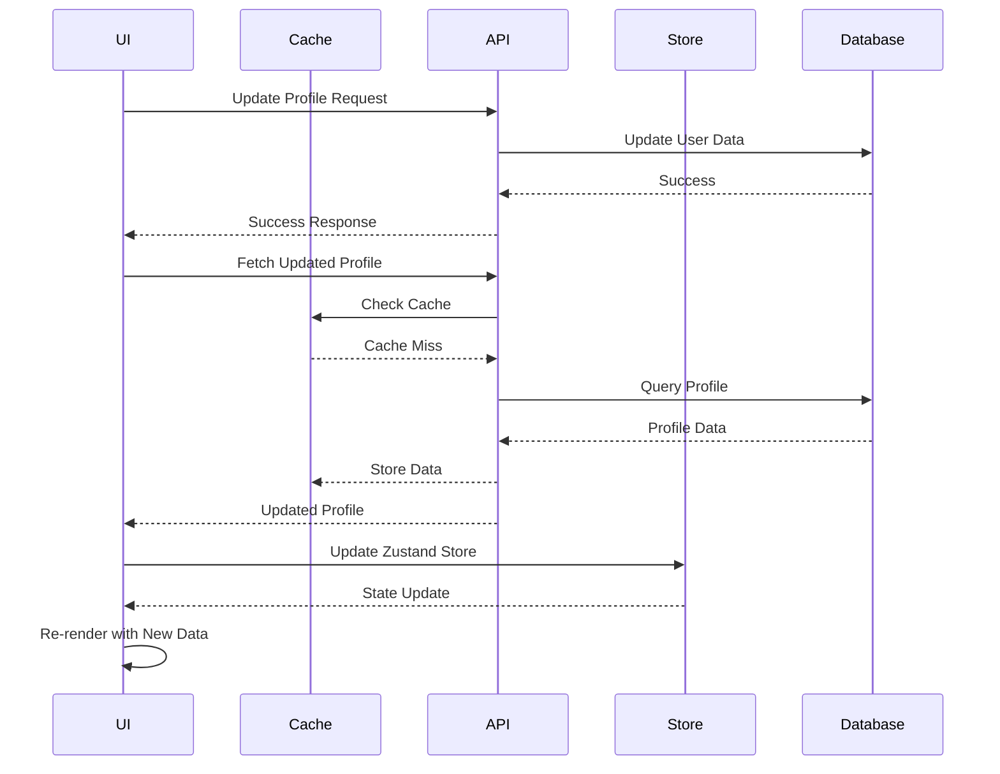
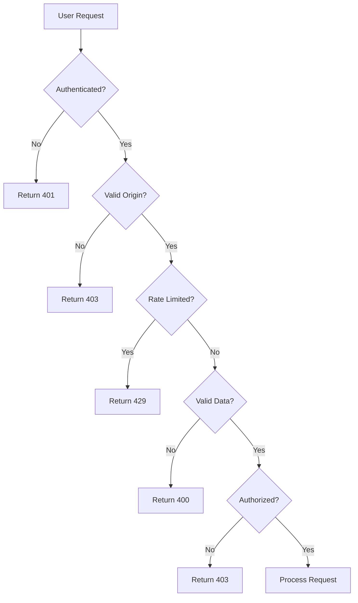

# Profile Operations

<cite>
**Referenced Files in This Document**   
- [route.ts](file://app/api/profile/update/route.ts)
- [route.ts](file://app/api/profile/upload-avatar/route.ts)
- [profile-page.tsx](file://components/profile-page.tsx)
- [storage.ts](file://lib/supabase/storage.ts)
- [security.ts](file://lib/security.ts)
- [audit-logs.ts](file://lib/supabase/audit-logs.ts)
- [cache.ts](file://lib/cache.ts)
- [auth-store.ts](file://lib/auth-store.ts)
- [20251219043432_create_users_table.sql](file://supabase/migrations/20251219043432_create_users_table.sql)
- [20270107115502_fix_avatar_storage_policies.sql](file://supabase/migrations/20260107115502_fix_avatar_storage_policies.sql)
</cite>

## Table of Contents
1. [Introduction](#introduction)
2. [Profile Update Endpoint](#profile-update-endpoint)
3. [Avatar Upload Endpoint](#avatar-upload-endpoint)
4. [Client-Side Implementation](#client-side-implementation)
5. [Data Validation and Sanitization](#data-validation-and-sanitization)
6. [Supabase Storage Integration](#supabase-storage-integration)
7. [Real-Time Updates and Caching](#real-time-updates-and-caching)
8. [Security and Access Control](#security-and-access-control)
9. [Audit Logging](#audit-logging)
10. [Usage Examples](#usage-examples)

## Introduction
This document provides comprehensive documentation for user profile management operations in the School Management System. It covers the PATCH /api/profile/update endpoint for modifying user attributes and the POST /api/profile/upload-avatar endpoint for avatar image uploads. The system implements robust security measures, data validation, and real-time updates to ensure a secure and responsive user experience.

**Section sources**
- [route.ts](file://app/api/profile/update/route.ts)
- [route.ts](file://app/api/profile/upload-avatar/route.ts)

## Profile Update Endpoint
The PATCH /api/profile/update endpoint handles modifications to user profile attributes. The implementation follows a role-based access control model, allowing different sets of fields to be updated based on the user's role (student, teacher, or admin).

The endpoint first validates the request origin to prevent CSRF attacks, then authenticates the user through Supabase auth. After retrieving the user's role, it validates the incoming data against a predefined schema. The system then processes updates to the appropriate tables based on the user's role:
- Base user fields (name, phone, address) are updated in the users table
- Student-specific fields are updated in the student_profiles table
- Teacher-specific fields are updated in the teacher_profiles table



**Diagram sources**
- [route.ts](file://app/api/profile/update/route.ts)
- [security.ts](file://lib/security.ts)

**Section sources**
- [route.ts](file://app/api/profile/update/route.ts)
- [security.ts](file://lib/security.ts)

## Avatar Upload Endpoint
The POST /api/profile/upload-avatar endpoint handles avatar image uploads with comprehensive security measures. The implementation includes rate limiting, file type validation, and secure storage integration.

The endpoint first applies rate limiting based on the client's IP address to prevent abuse. It then validates the uploaded file through multiple layers of security checks:
- File size validation (maximum 5MB)
- File type validation using magic number signatures
- MIME type verification and enforcement

After successful validation, the system uploads the file to Supabase Storage in the avatars bucket, generates a public URL, and updates the user's avatar field in the database.



**Diagram sources**
- [route.ts](file://app/api/profile/upload-avatar/route.ts)
- [storage.ts](file://lib/supabase/storage.ts)

**Section sources**
- [route.ts](file://app/api/profile/upload-avatar/route.ts)
- [storage.ts](file://lib/supabase/storage.ts)

## Client-Side Implementation
The profile management interface is implemented in the ProfilePage component, which provides a user-friendly form for updating profile information and uploading avatars. The component uses Zustand for state management and integrates with Supabase for data persistence.

The implementation features:
- Role-specific form fields that adapt based on the user's role
- Real-time form validation and error feedback
- Avatar upload preview with client-side validation
- Loading states for all asynchronous operations
- Toast notifications for success and error states

The component organizes profile information into collapsible sections for better usability, with different sections visible based on the user's role. Student profiles include extensive personal and academic information, while teacher profiles focus on professional details.



**Diagram sources**
- [profile-page.tsx](file://components/profile-page.tsx)
- [auth-store.ts](file://lib/auth-store.ts)

**Section sources**
- [profile-page.tsx](file://components/profile-page.tsx)
- [auth-store.ts](file://lib/auth-store.ts)

## Data Validation and Sanitization
The profile management system implements comprehensive data validation at both client and server levels to ensure data integrity and security.

Server-side validation is performed using Zod schemas defined in the security module. The profileUpdateSchema enforces:
- String length limits for all text fields
- Regular expression patterns to prevent malicious input
- Proper URL formatting for avatar URLs
- Type validation for boolean and numeric fields

Client-side validation complements server validation with immediate feedback:
- File type and size validation before upload
- Real-time form field validation
- Magic number verification to confirm file type
- Input sanitization to prevent XSS attacks

The system also implements origin validation to prevent CSRF attacks and rate limiting to prevent brute force attempts on the avatar upload endpoint.



**Diagram sources**
- [security.ts](file://lib/security.ts)
- [profile-page.tsx](file://components/profile-page.tsx)

**Section sources**
- [security.ts](file://lib/security.ts)
- [validation-schemas.ts](file://lib/validation-schemas.ts)

## Supabase Storage Integration
The avatar upload functionality integrates with Supabase Storage to persist profile images securely. The system uses a dedicated avatars bucket with specific security policies and configuration.

Key implementation details:
- The avatars bucket is configured with a 5MB file size limit
- Only specific image MIME types are allowed (JPEG, PNG, WebP)
- Files are stored with unique, unpredictable paths using UUIDs
- Public URLs are generated for avatar access
- Server-side validation ensures file integrity

The storage.ts module provides utility functions for avatar management:
- validateImageFile: Client and server-side file validation
- generateAvatarPath: Creates unique file paths
- uploadAvatar: Handles the complete upload process
- deleteAvatar: Removes avatars when needed

```mermaid
classDiagram
class StorageService {
+AVATAR_BUCKET : string
+MAX_AVATAR_SIZE : number
+ALLOWED_IMAGE_TYPES : string[]
+validateImageFile(file : File) : {valid : boolean, error? : string}
+generateAvatarPath(userId : string, fileExtension : string) : string
+uploadAvatar(userId : string, file : File) : Promise<{url : string | null, error? : string}>
+deleteAvatar(filePath : string) : Promise<{success : boolean, error? : string}>
}
class SupabaseStorage {
+from(bucket : string)
+upload(path : string, file : File, options : UploadOptions)
+getPublicUrl(path : string)
+remove(paths : string[])
}
StorageService --> SupabaseStorage : "uses"
```

**Diagram sources**
- [storage.ts](file://lib/supabase/storage.ts)
- [20270107115502_fix_avatar_storage_policies.sql](file://supabase/migrations/20260107115502_fix_avatar_storage_policies.sql)

**Section sources**
- [storage.ts](file://lib/supabase/storage.ts)
- [route.ts](file://app/api/profile/upload-avatar/route.ts)

## Real-Time Updates and Caching
The profile management system implements real-time updates and caching to provide a responsive user experience while maintaining data consistency.

The system uses multiple caching strategies:
- Client-side caching with Zustand stores for user authentication state
- In-memory caching for API responses with a 30-second TTL
- Next.js server-side caching with automatic revalidation
- Cache invalidation on profile updates

When a user updates their profile, the system:
1. Makes the API call to update the profile
2. On success, refetches the updated profile data
3. Updates the Zustand store with the new data
4. Invalidates relevant cache entries
5. Triggers UI updates through React state changes



**Diagram sources**
- [cache.ts](file://lib/cache.ts)
- [auth-store.ts](file://lib/auth-store.ts)
- [profile-page.tsx](file://components/profile-page.tsx)

**Section sources**
- [cache.ts](file://lib/cache.ts)
- [auth-store.ts](file://lib/auth-store.ts)

## Security and Access Control
The profile management system implements a comprehensive security model with multiple layers of protection.

Access control is enforced through:
- Row Level Security (RLS) policies in Supabase
- Role-based field access in the API
- Origin validation to prevent CSRF
- Rate limiting on avatar uploads
- Input validation and sanitization

The RLS policies ensure that:
- Users can only view and update their own profile data
- Teachers and administrators can view student profiles
- Students cannot access other students' profiles
- All operations are authenticated

The system also implements additional security measures:
- Password change detection through audit logs
- Session management with token revocation
- IP address hashing for privacy-preserving logging
- Protection against formula injection in CSV exports



**Diagram sources**
- [security.ts](file://lib/security.ts)
- [20251219043432_create_users_table.sql](file://supabase/migrations/20251219043432_create_users_table.sql)
- [20270107115502_fix_avatar_storage_policies.sql](file://supabase/migrations/20260107115502_fix_avatar_storage_policies.sql)

**Section sources**
- [security.ts](file://lib/security.ts)
- [rate-limit.ts](file://lib/rate-limit.ts)

## Audit Logging
The system maintains comprehensive audit logs of all profile changes for security and compliance purposes. The audit-logs.ts module provides utilities for querying and analyzing audit data.

Key features of the audit logging system:
- Automatic logging of all profile updates
- Detection of suspicious activity patterns
- Export capabilities for compliance reporting
- Severity classification of different actions
- User-friendly display names for audit events

The audit logs capture:
- Timestamp of each action
- User ID and role
- IP address (hashed for privacy)
- Action type (e.g., "user_modified")
- Payload with relevant details

Administrators can view recent activity on user profiles, helping to detect unauthorized changes and maintain accountability.

**Section sources**
- [audit-logs.ts](file://lib/supabase/audit-logs.ts)
- [profile-page.tsx](file://components/profile-page.tsx)

## Usage Examples
The profile management functionality is used throughout the application, with the primary interface in the profile-page.tsx component.

Key usage patterns:
- Users update their personal information through the profile form
- Students update contact and address information
- Teachers update their subject specialization and department
- All users can upload and change their profile avatar

The implementation demonstrates best practices for form handling:
- Controlled components with React state
- Immediate validation feedback
- Loading states during API calls
- Error handling with user-friendly messages
- Success notifications

The avatar upload flow provides a seamless experience:
1. User clicks on avatar to trigger file input
2. Client validates file type and size
3. Preview dialog shows the image before upload
4. System uploads to Supabase Storage
5. UI updates with the new avatar immediately

**Section sources**
- [profile-page.tsx](file://components/profile-page.tsx)
- [route.ts](file://app/api/profile/update/route.ts)
- [route.ts](file://app/api/profile/upload-avatar/route.ts)