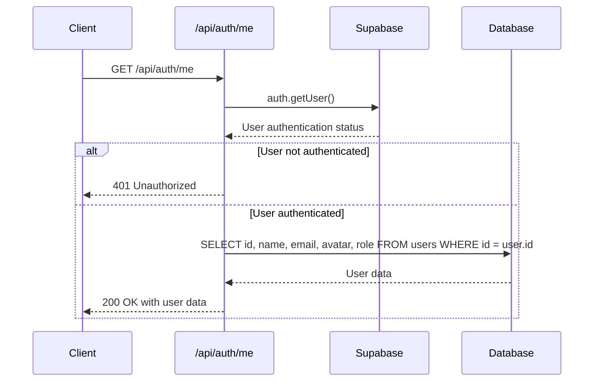
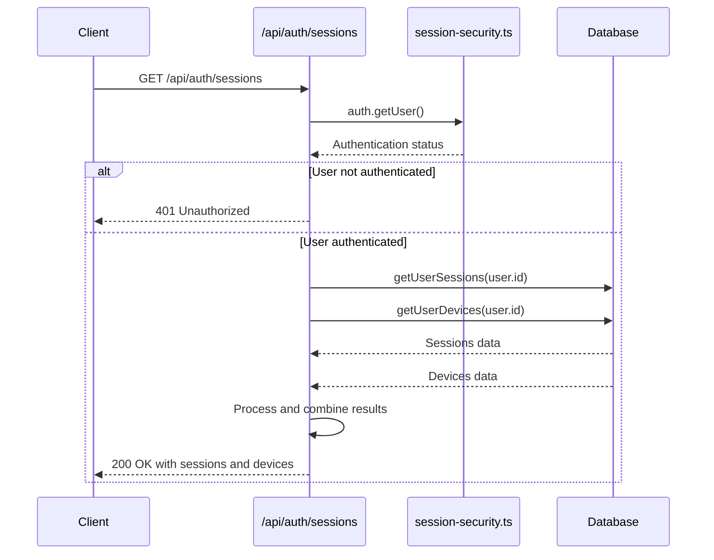
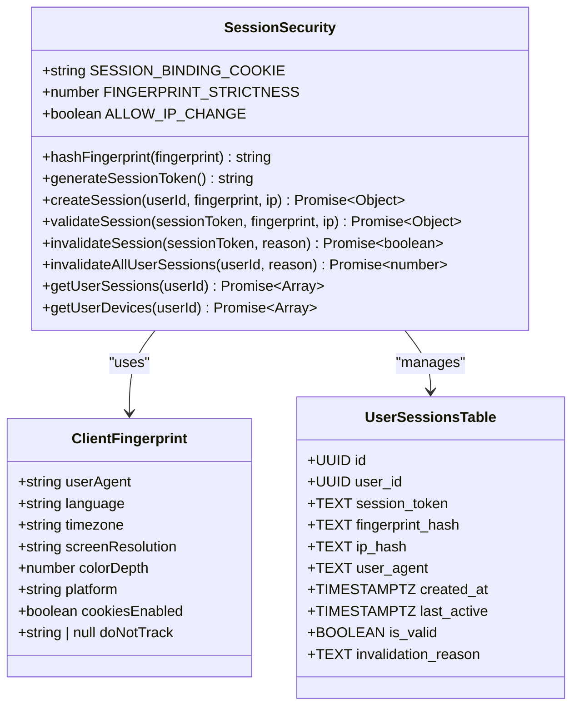
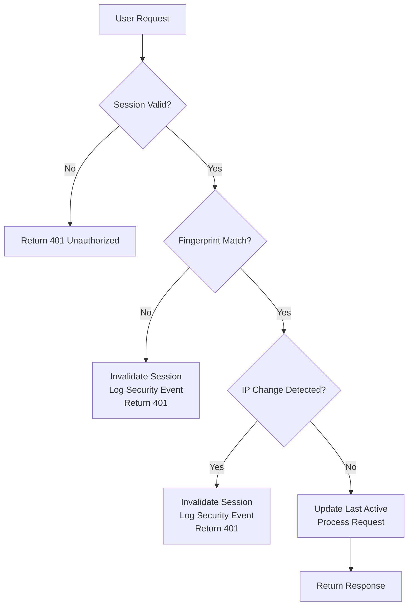
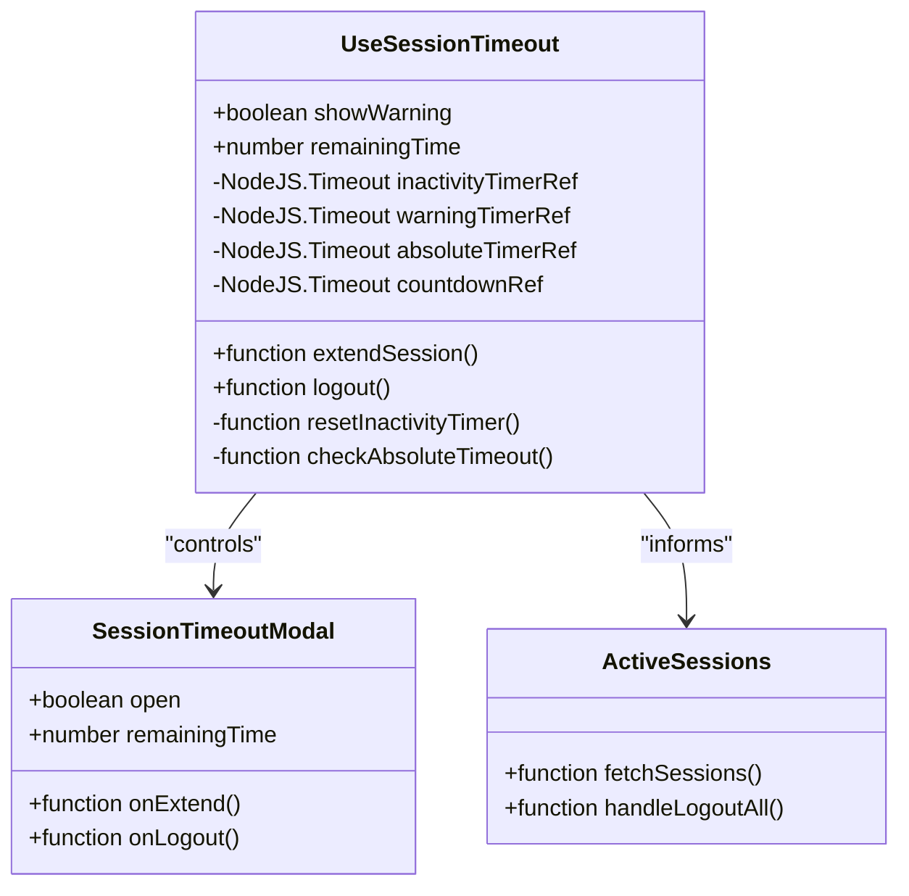
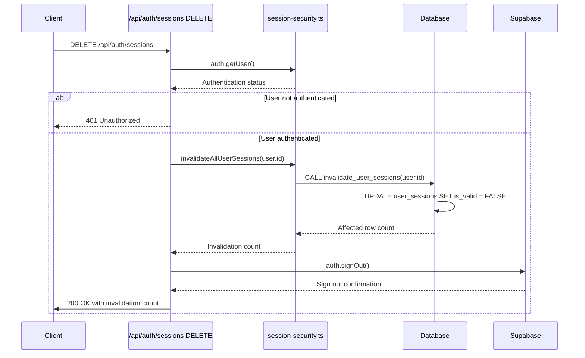
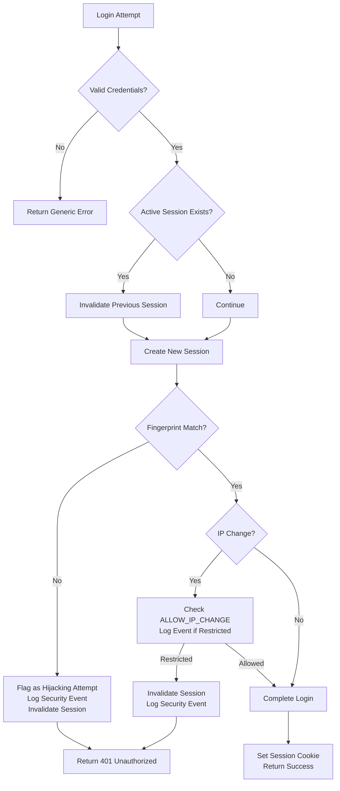
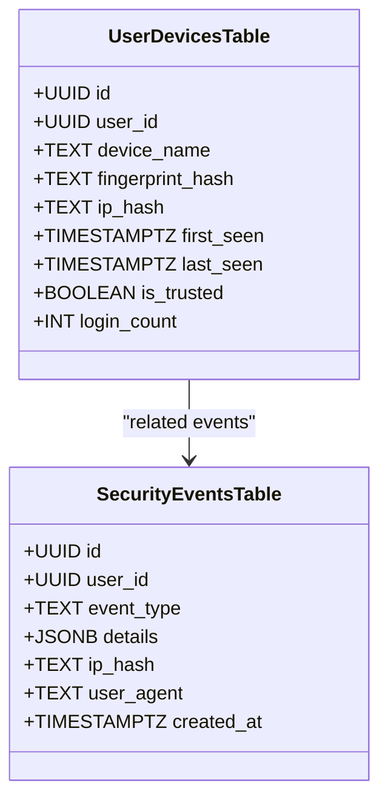
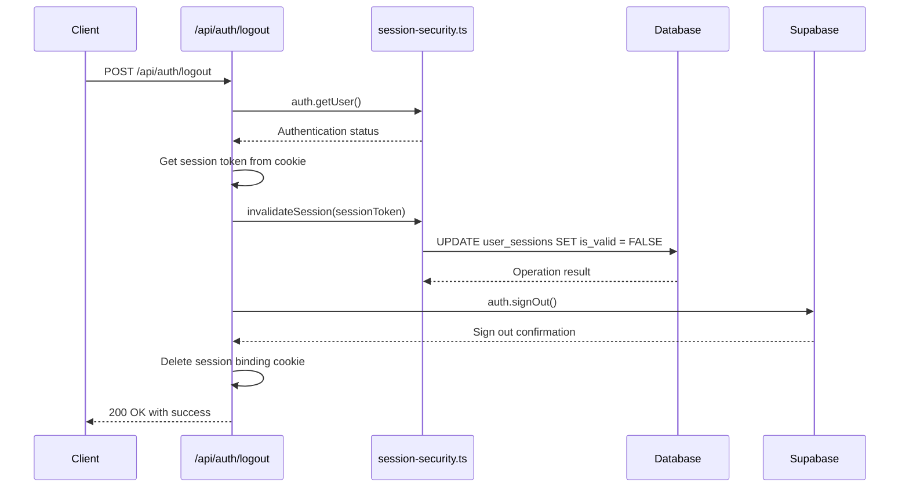
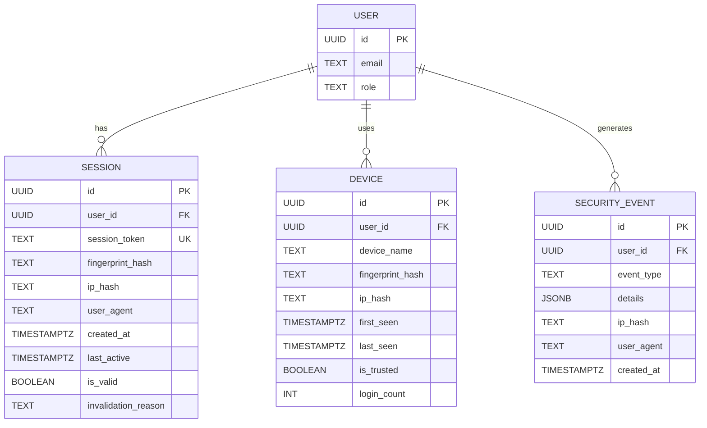

# Session Management

<cite>
**Referenced Files in This Document**   
- [me/route.ts](file://app/api/auth/me/route.ts)
- [sessions/route.ts](file://app/api/auth/sessions/route.ts)
- [use-session-timeout.ts](file://lib/hooks/use-session-timeout.ts)
- [session-security.ts](file://lib/session-security.ts)
- [fingerprint.ts](file://lib/fingerprint.ts)
- [logout/route.ts](file://app/api/auth/logout/route.ts)
- [login/route.ts](file://app/api/auth/login/route.ts)
- [active-sessions.tsx](file://components/active-sessions.tsx)
- [session-timeout-modal.tsx](file://components/session-timeout-modal.tsx)
- [20260111_session_security.sql](file://supabase/migrations/20260111_session_security.sql)
</cite>

## Table of Contents
1. [Introduction](#introduction)
2. [Core Session Endpoints](#core-session-endpoints)
3. [Session Token Validation and Security](#session-token-validation-and-security)
4. [Session Expiration and Refresh Policies](#session-expiration-and-refresh-policies)
5. [Client-Side Session Monitoring](#client-side-session-monitoring)
6. [Server-Side Session Revocation and Cleanup](#server-side-session-revocation-and-cleanup)
7. [Security Practices and Anomaly Detection](#security-practices-and-anomaly-detection)
8. [Concurrent Session Handling](#concurrent-session-handling)
9. [Secure Logout Implementation](#secure-logout-implementation)
10. [Database Schema and Infrastructure](#database-schema-and-infrastructure)

## Introduction
This document provides a comprehensive overview of the session management system in the School Management System. The architecture implements a robust security model that combines server-side session validation with client-side monitoring to protect user accounts from unauthorized access. The system features multiple layers of protection including device fingerprinting, IP binding, anomaly detection, and strict session lifecycle management. This documentation covers the complete flow from user authentication through session validation, monitoring, and secure termination.

## Core Session Endpoints

The system exposes two primary endpoints for session management: GET /api/auth/me for retrieving authenticated user data and GET /api/auth/sessions for active session enumeration. These endpoints form the foundation of the session management system and are protected by comprehensive authentication and authorization checks.

### GET /api/auth/me Endpoint
The GET /api/auth/me endpoint securely retrieves the authenticated user's profile information. The implementation follows a zero-trust principle by first validating the user's authentication status through Supabase's auth.getUser() method. Upon successful authentication, the system queries the users table to retrieve essential user attributes including ID, name, email, avatar, and role. The endpoint implements proper error handling with appropriate HTTP status codes, returning 401 Unauthorized for unauthenticated requests and 500 Internal Server Error for unexpected server-side issues.



**Diagram sources**
- [me/route.ts](file://app/api/auth/me/route.ts#L4-L28)

**Section sources**
- [me/route.ts](file://app/api/auth/me/route.ts#L4-L28)

### GET /api/auth/sessions Endpoint
The GET /api/auth/sessions endpoint provides users with visibility into their active sessions across devices. This endpoint returns comprehensive information about all active sessions and associated devices for the authenticated user. The implementation uses Promise.all() to efficiently retrieve session and device data concurrently from the database. The response includes session metadata such as user agent, creation time, last active timestamp, and IP hash, along with device information including device name, login count, and trust status. The endpoint also provides summary counts of sessions and devices to support UI rendering.



**Diagram sources**
- [sessions/route.ts](file://app/api/auth/sessions/route.ts#L7-L41)

**Section sources**
- [sessions/route.ts](file://app/api/auth/sessions/route.ts#L7-L41)

## Session Token Validation and Security

The session management system implements a comprehensive token validation mechanism that goes beyond standard JWT validation to include device fingerprinting and behavioral analysis. This multi-layered approach significantly enhances security by making session tokens bound to specific devices and usage patterns.

### Fingerprint-Based Session Binding
The system creates a unique fingerprint for each device based on non-PII browser characteristics including user agent, language, timezone, screen resolution, color depth, platform, and cookie settings. This fingerprint is hashed using SHA-256 with a server-side salt to create a secure identifier that is stored in the user_sessions table. During each request, the system compares the current device fingerprint with the stored hash, and automatically invalidates the session if a mismatch is detected, which may indicate a session hijacking attempt.



**Diagram sources**
- [session-security.ts](file://lib/session-security.ts#L31-L56)
- [session-security.ts](file://lib/session-security.ts#L17-L26)
- [20260111_session_security.sql](file://supabase/migrations/20260111_session_security.sql#L5-L19)

**Section sources**
- [session-security.ts](file://lib/session-security.ts#L149-L228)

### IP Address Binding and Change Detection
The system implements IP address binding as an additional security layer to detect potential session hijacking. When a session is created, the user's IP address is hashed and stored in the user_sessions table. The system can be configured to either allow or disallow IP address changes during a session. When IP change detection is enabled, any change in the user's IP address triggers session invalidation and logs a security event. This feature is particularly effective at preventing session hijacking attacks where an attacker attempts to use a stolen session token from a different network location.



**Diagram sources**
- [session-security.ts](file://lib/session-security.ts#L199-L214)

## Session Expiration and Refresh Policies

The system implements a dual-layer session expiration policy combining absolute timeouts with inactivity-based timeouts to balance security and user experience. This approach ensures that sessions cannot remain active indefinitely while also protecting against unauthorized access when users leave their devices unattended.

### Absolute Session Timeout
Each session has an absolute lifetime of 8 hours, after which it expires regardless of activity. This timeout is enforced server-side by storing the session start time in the user's JWT metadata during login. The client-side use-session-timeout hook periodically checks this server-side timestamp to determine the remaining session duration. When the absolute timeout is reached, the user is automatically logged out and redirected to the login page.

### Inactivity-Based Timeout
The system implements an inactivity timeout of 15 minutes, after which a warning is displayed to the user. If no activity is detected within an additional 2-minute warning period, the session is automatically terminated. This mechanism protects against unauthorized access when users leave their workstations unattended. The inactivity timer is reset by common user interactions including mouse movements, keystrokes, scrolling, and touch events.

```mermaid
sequenceDiagram
participant User
participant Client as use-session-timeout
participant Server
User->>Client : User activity (mouse, keyboard, etc.)
Client->>Client : Reset inactivity timer
Client->>Client : Start 15-minute countdown
... Inactivity period ...
Client->>Client : 2-minute warning threshold reached
Client->>User : Display timeout warning modal
alt User extends session
User->>Client : Click "Stay Logged In"
Client->>Client : Reset timers
else User inactive
Client->>Client : Countdown expires
Client->>Client : Execute logout procedure
Client->>Server : POST /api/auth/logout
Server->>Server : Invalidate session
Client->>User : Redirect to login page
end
```

**Diagram sources**
- [use-session-timeout.ts](file://lib/hooks/use-session-timeout.ts#L34-L198)

**Section sources**
- [use-session-timeout.ts](file://lib/hooks/use-session-timeout.ts#L34-L198)

## Client-Side Session Monitoring

The client-side session monitoring system is implemented through the use-session-timeout custom React hook, which provides a comprehensive solution for tracking user activity and managing session state. This hook integrates seamlessly with the application's UI to provide a smooth user experience while maintaining strict security controls.

### Activity Detection and Timer Management
The use-session-timeout hook monitors a comprehensive set of user activity events including mousedown, mousemove, keydown, scroll, touchstart, and click. When any of these events occur, the hook resets the inactivity timer and updates the last activity timestamp in sessionStorage. The hook maintains multiple timers for different aspects of session management: an inactivity timer, a warning timer, an absolute timeout timer, and a countdown timer for the warning period. This multi-timer approach allows for precise control over the session lifecycle.

### Session Extension and Logout Workflow
The hook provides two primary user-facing functions: extendSession and logout. The extendSession function allows users to manually extend their session when the warning modal appears, resetting all timers and continuing the session. The logout function handles the complete session termination process, which includes clearing all timers, removing session data from storage, calling the logout API to invalidate the server-side session, signing out from Supabase, and redirecting the user to the login page with a session timeout reason parameter.



**Diagram sources**
- [use-session-timeout.ts](file://lib/hooks/use-session-timeout.ts#L34-L198)
- [session-timeout-modal.tsx](file://components/session-timeout-modal.tsx#L1-L74)
- [active-sessions.tsx](file://components/active-sessions.tsx#L1-L194)

**Section sources**
- [use-session-timeout.ts](file://lib/hooks/use-session-timeout.ts#L34-L198)
- [session-timeout-modal.tsx](file://components/session-timeout-modal.tsx#L1-L74)

## Server-Side Session Revocation and Cleanup

The server-side session management system implements robust mechanisms for session revocation and cleanup to ensure that inactive and compromised sessions are properly terminated and removed from the system.

### Immediate Session Revocation
When a user logs out, either manually or due to timeout, the system immediately revokes the session by calling the invalidateSession function. This function updates the is_valid flag to false in the user_sessions table and records the invalidation reason. The session binding cookie is also deleted from the client's browser to prevent reuse. This immediate revocation ensures that the session token cannot be used for subsequent requests.

### Bulk Session Termination
The system supports bulk session termination through the DELETE /api/auth/sessions endpoint, which allows users to log out from all devices simultaneously. This operation invalidates all active sessions for the user by calling the invalidateAllUserSessions function, which executes the invalidate_user_sessions PostgreSQL function. This function performs a bulk update on the user_sessions table, setting is_valid to false for all sessions belonging to the user. After invalidating all sessions, the current session is signed out through Supabase's auth.signOut() method.



**Diagram sources**
- [sessions/route.ts](file://app/api/auth/sessions/route.ts#L43-L72)
- [session-security.ts](file://lib/session-security.ts#L253-L273)

**Section sources**
- [sessions/route.ts](file://app/api/auth/sessions/route.ts#L43-L72)
- [logout/route.ts](file://app/api/auth/logout/route.ts#L6-L36)

## Security Practices and Anomaly Detection

The session management system incorporates advanced security practices and anomaly detection mechanisms to identify and respond to suspicious login activities and potential security threats.

### Security Event Logging
The system maintains a comprehensive security event log in the security_events table, which records significant events such as new device logins, session hijacking attempts, and IP address changes. Each security event includes the user ID, event type, detailed JSON payload with relevant information, hashed IP address, and user agent string. These logs are invaluable for security audits and incident response, providing a complete trail of potentially suspicious activities.

### Suspicious Login Detection
The system detects several types of suspicious login patterns:
- **Fingerprint Mismatch**: When a session token is used from a device with a different fingerprint than the one it was created with
- **IP Address Changes**: When a session is accessed from a significantly different IP address (when configured to disallow IP changes)
- **New Device Logins**: When a user logs in from a previously unknown device
- **Concurrent Sessions**: When multiple sessions are detected for the same user (though the system typically enforces single-session policy)

When any of these anomalies are detected, the system automatically invalidates the suspicious session, logs a security event, and may notify the user depending on the severity.



**Diagram sources**
- [login/route.ts](file://app/api/auth/login/route.ts#L7-L117)
- [session-security.ts](file://lib/session-security.ts#L149-L214)

**Section sources**
- [session-security.ts](file://lib/session-security.ts#L278-L298)
- [login/route.ts](file://app/api/auth/login/route.ts#L7-L117)

## Concurrent Session Handling

The system implements a strict single-session policy by default, where logging in from a new device automatically invalidates all previous sessions. This approach significantly reduces the attack surface by ensuring that a user's account can only be actively used from one location at a time.

### Single-Session Enforcement
When a user successfully authenticates, the createSession function is called, which first invalidates all existing sessions for that user by calling the invalidate_user_sessions PostgreSQL function. This ensures that only one active session exists per user at any given time. This policy prevents scenarios where a user might unknowingly have multiple active sessions, potentially on compromised devices.

### Multi-Device Support with Monitoring
While enforcing single-session policy for security, the system still provides users with visibility into their device usage through the user_devices table. This table tracks all devices a user has logged in from, including the device name, first and last seen timestamps, login count, and trust status. Users can view this information in the Active Sessions component and can manually log out from specific devices or all devices simultaneously.



**Diagram sources**
- [20260111_session_security.sql](file://supabase/migrations/20260111_session_security.sql#L21-L34)
- [20260111_session_security.sql](file://supabase/migrations/20260111_session_security.sql#L36-L45)

**Section sources**
- [session-security.ts](file://lib/session-security.ts#L322-L335)

## Secure Logout Implementation

The logout process is designed to be comprehensive and secure, ensuring that all traces of the user's session are properly cleaned up on both the client and server sides.

### Complete Session Termination
The logout process, implemented in the POST /api/auth/logout endpoint, follows a thorough procedure to ensure complete session termination:
1. Retrieve the current session token from the session binding cookie
2. Invalidate the session in the database by setting is_valid to false
3. Sign out from Supabase authentication
4. Delete the session binding cookie from the client
5. Return a success response

This multi-step process ensures that the session cannot be reused, even if an attacker has obtained the session token.

### Error Resilience
The logout implementation is designed to be resilient to errors. Even if the database operation fails, the system still attempts to sign out from Supabase and clear the cookie. This fail-safe approach ensures that the user is logged out from at least the client side, preventing continued access to the application. The error is logged for administrative review, but the user receives a success response to ensure a consistent user experience.



**Diagram sources**
- [logout/route.ts](file://app/api/auth/logout/route.ts#L6-L36)

**Section sources**
- [logout/route.ts](file://app/api/auth/logout/route.ts#L6-L36)

## Database Schema and Infrastructure

The session management system is supported by a robust database schema that stores session and device information with appropriate security controls and performance optimizations.

### Session and Device Tables
The system uses three primary tables to manage session security:
- **user_sessions**: Stores active session information with fingerprint and IP binding
- **user_devices**: Tracks devices users have logged in from, enabling trust management
- **security_events**: Logs security-related events for audit and analysis

These tables are protected by Row Level Security (RLS) policies that ensure users can only access their own data, while administrators can view all records for security monitoring.

### Indexing and Performance
The tables are optimized with strategic indexes to ensure fast lookups:
- Indexes on user_id for efficient user-based queries
- Unique constraint on session_token for fast session validation
- Composite indexes for active session queries
- Timestamp indexes for cleanup operations

The system also includes database functions for critical operations:
- **invalidate_user_sessions**: Efficiently invalidates all sessions for a user
- **cleanup_old_sessions**: Periodically removes expired sessions to maintain performance



**Diagram sources**
- [20260111_session_security.sql](file://supabase/migrations/20260111_session_security.sql#L5-L115)

**Section sources**
- [20260111_session_security.sql](file://supabase/migrations/20260111_session_security.sql#L5-L115)