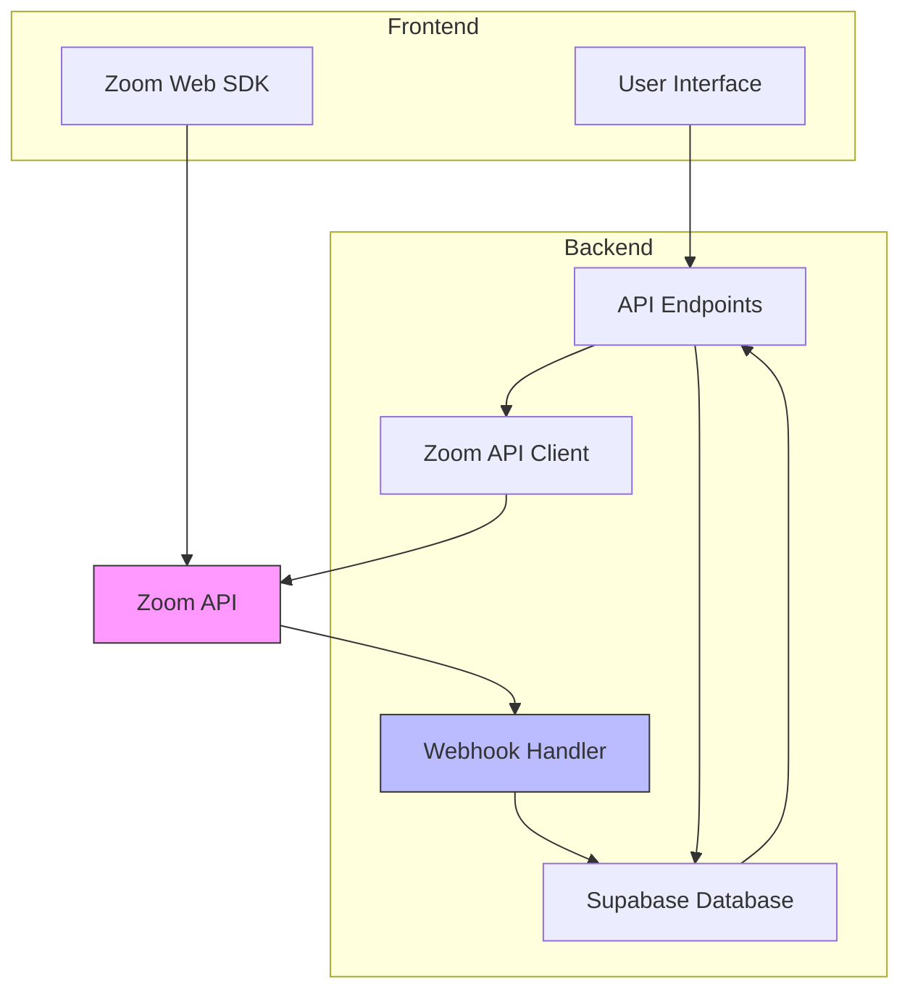
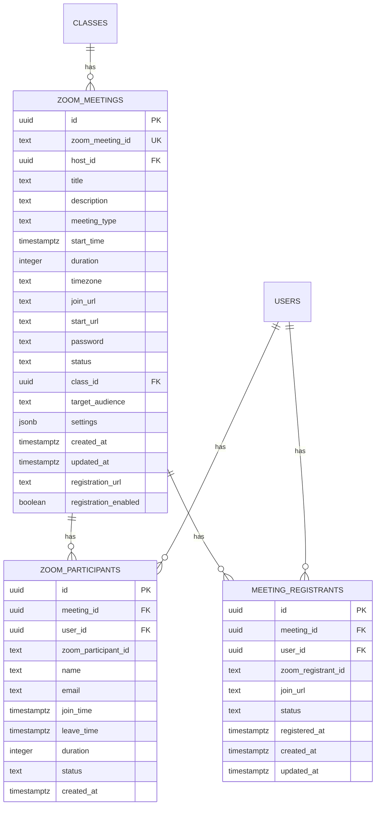
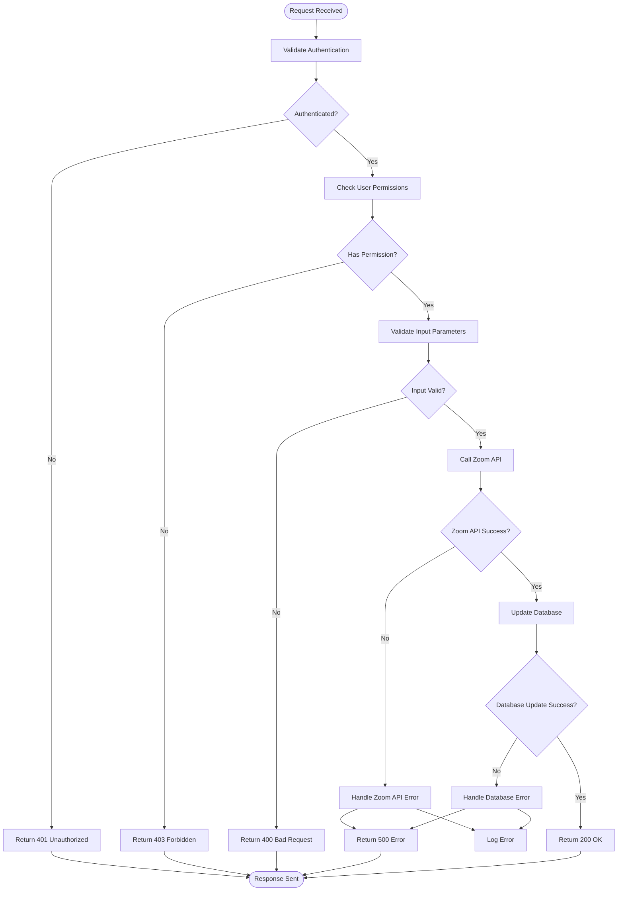
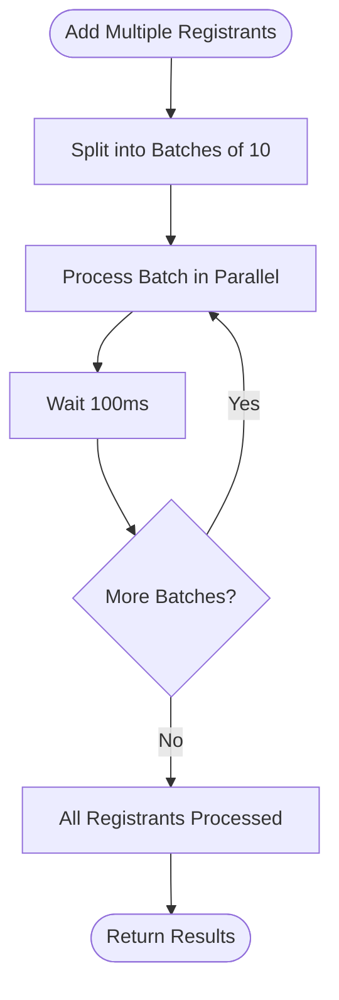

# Integration API Endpoints

<cite>
**Referenced Files in This Document**   
- [client.ts](file://lib/zoom/client.ts)
- [types.ts](file://lib/zoom/types.ts)
- [constants.ts](file://lib/zoom/constants.ts)
- [route.ts](file://app/api/zoom/meetings/route.ts)
- [register-student/route.ts](file://app/api/zoom/meetings/register-student/route.ts)
- [meetings/[id]/route.ts](file://app/api/zoom/meetings/[id]/route.ts)
- [meetings/[id]/participants/route.ts](file://app/api/zoom/meetings/[id]/participants/route.ts)
- [meetings/[id]/attendance/route.ts](file://app/api/zoom/meetings/[id]/attendance/route.ts)
- [meetings/[id]/join/route.ts](file://app/api/zoom/meetings/[id]/join/route.ts)
- [reports/route.ts](file://app/api/zoom/reports/route.ts)
- [webhook/route.ts](file://app/api/zoom/webhook/route.ts)
- [create_zoom_meetings_table.sql](file://supabase/migrations/20260110000001_create_zoom_meetings_table.sql)
- [create_meeting_registrants_table.sql](file://supabase/migrations/20260110000002_create_meeting_registrants_table.sql)
</cite>

## Table of Contents
1. [Introduction](#introduction)
2. [Authentication and Authorization](#authentication-and-authorization)
3. [Meeting Management Endpoints](#meeting-management-endpoints)
4. [Participant Tracking Endpoints](#participant-tracking-endpoints)
5. [Joining Session Endpoints](#joining-session-endpoints)
6. [Reporting Endpoints](#reporting-endpoints)
7. [Webhook Endpoint](#webhook-endpoint)
8. [Integration Architecture](#integration-architecture)
9. [Data Synchronization](#data-synchronization)
10. [Error Handling](#error-handling)
11. [Rate Limiting and Retry Logic](#rate-limiting-and-retry-logic)

## Introduction
This document provides comprehensive documentation for the Zoom meeting integration endpoints in the School-Management-System. The integration enables seamless management of virtual classrooms and meetings through Zoom, with features for creating, retrieving, and managing meetings, tracking participants and attendance, joining sessions, retrieving reports, and processing webhook notifications. The system uses Server-to-Server OAuth for authentication with Zoom and maintains data synchronization between Zoom and the internal database.

## Authentication and Authorization
The Zoom integration uses Server-to-Server OAuth for backend operations, requiring the following environment variables: `ZOOM_ACCOUNT_ID`, `ZOOM_CLIENT_ID`, and `ZOOM_CLIENT_SECRET`. The authentication flow involves obtaining an access token from Zoom's OAuth endpoint, which is then used to make authenticated requests to the Zoom API. The token is cached and reused until expiration.

User authorization is handled through the application's role-based access control system. Only teachers and administrators can create meetings, while access to specific meetings is determined by the meeting's target audience and the user's role. The system also supports embedded meeting joining through Zoom SDK signatures, which are generated server-side using `ZOOM_SDK_KEY` and `ZOOM_SDK_SECRET`.

**Section sources**
- [client.ts](file://lib/zoom/client.ts#L1-L54)
- [meetings/route.ts](file://app/api/zoom/meetings/route.ts#L56-L65)

## Meeting Management Endpoints
The meeting management endpoints provide CRUD operations for Zoom meetings, with synchronization between the application database and Zoom's API.

### Create Meeting (POST /api/zoom/meetings)
Creates a new Zoom meeting and stores it in the database.

**Request**
- Method: POST
- URL: `/api/zoom/meetings`
- Authentication: JWT
- Request Body:
```json
{
  "title": "string",
  "description": "string",
  "startTime": "string (ISO 8601)",
  "duration": "number (minutes)",
  "timezone": "string",
  "classId": "string",
  "targetAudience": "string",
  "settings": "object"
}
```

**Response**
- Status: 201 Created
- Response Body:
```json
{
  "meeting": {
    "id": "string",
    "zoom_meeting_id": "string",
    "host_id": "string",
    "title": "string",
    "description": "string",
    "meeting_type": "scheduled",
    "start_time": "string",
    "duration": "number",
    "timezone": "string",
    "join_url": "string",
    "start_url": "string",
    "password": "string",
    "class_id": "string",
    "target_audience": "string",
    "settings": "object",
    "registration_url": "string",
    "registration_enabled": "boolean",
    "created_at": "string",
    "updated_at": "string"
  }
}
```

**Section sources**
- [meetings/route.ts](file://app/api/zoom/meetings/route.ts#L54-L168)

### Retrieve Meetings (GET /api/zoom/meetings)
Retrieves a list of meetings with optional filtering.

**Request**
- Method: GET
- URL: `/api/zoom/meetings?status=scheduled&classId=123&upcoming=true&limit=50`
- Authentication: JWT
- Query Parameters:
  - `status`: Filter by meeting status
  - `classId`: Filter by class ID
  - `upcoming`: Include only upcoming meetings
  - `limit`: Maximum number of results

**Response**
- Status: 200 OK
- Response Body:
```json
{
  "meetings": [
    {
      "id": "string",
      "title": "string",
      "start_time": "string",
      "status": "string",
      "host": {
        "id": "string",
        "name": "string",
        "email": "string",
        "avatar": "string"
      },
      "class": {
        "id": "string",
        "name": "string"
      }
    }
  ]
}
```

**Section sources**
- [meetings/route.ts](file://app/api/zoom/meetings/route.ts#L6-L52)

### Retrieve Single Meeting (GET /api/zoom/meetings/{id})
Retrieves a specific meeting by ID.

**Request**
- Method: GET
- URL: `/api/zoom/meetings/{id}`
- Authentication: JWT

**Response**
- Status: 200 OK
- Response Body:
```json
{
  "meeting": {
    "id": "string",
    "title": "string",
    "start_time": "string",
    "status": "string",
    "host": {
      "id": "string",
      "name": "string",
      "email": "string",
      "avatar": "string"
    },
    "class": {
      "id": "string",
      "name": "string"
    },
    "participants": [
      {
        "id": "string",
        "user_id": "string",
        "name": "string",
        "email": "string",
        "join_time": "string",
        "leave_time": "string",
        "duration": "number",
        "status": "string"
      }
    ]
  }
}
```

**Section sources**
- [meetings/[id]/route.ts](file://app/api/zoom/meetings/[id]/route.ts#L9-L38)

### Update Meeting (PATCH /api/zoom/meetings/{id})
Updates an existing meeting.

**Request**
- Method: PATCH
- URL: `/api/zoom/meetings/{id}`
- Authentication: JWT
- Request Body:
```json
{
  "title": "string",
  "description": "string",
  "startTime": "string",
  "duration": "number",
  "timezone": "string",
  "classId": "string",
  "targetAudience": "string",
  "settings": "object"
}
```

**Response**
- Status: 200 OK
- Response Body:
```json
{
  "meeting": {
    "id": "string",
    "title": "string",
    "start_time": "string",
    "status": "string"
  }
}
```

**Section sources**
- [meetings/[id]/route.ts](file://app/api/zoom/meetings/[id]/route.ts#L40-L124)

### Delete Meeting (DELETE /api/zoom/meetings/{id})
Deletes a meeting.

**Request**
- Method: DELETE
- URL: `/api/zoom/meetings/{id}`
- Authentication: JWT

**Response**
- Status: 200 OK
- Response Body:
```json
{
  "success": true
}
```

**Section sources**
- [meetings/[id]/route.ts](file://app/api/zoom/meetings/[id]/route.ts#L127-L186)

### Register Student for Meetings (POST /api/zoom/meetings/register-student)
Registers a student for all upcoming class meetings.

**Request**
- Method: POST
- URL: `/api/zoom/meetings/register-student`
- Authentication: JWT (Admin only)
- Request Body:
```json
{
  "studentId": "string",
  "classId": "string"
}
```

**Response**
- Status: 200 OK
- Response Body:
```json
{
  "message": "Registered for X meetings",
  "registered": "number",
  "meetingIds": ["string"]
}
```

**Section sources**
- [register-student/route.ts](file://app/api/zoom/meetings/register-student/route.ts#L9-L115)

## Participant Tracking Endpoints
These endpoints provide functionality for tracking meeting participants and attendance.

### Retrieve Participants (GET /api/zoom/meetings/{id}/participants)
Retrieves detailed information about meeting participants.

**Request**
- Method: GET
- URL: `/api/zoom/meetings/{id}/participants`
- Authentication: JWT
- Access Control: Host, admin, or teacher of the class

**Response**
- Status: 200 OK
- Response Body:
```json
{
  "meeting": {
    "id": "string",
    "title": "string",
    "class": {
      "id": "string",
      "name": "string"
    },
    "start_time": "string",
    "status": "string"
  },
  "participants": [
    {
      "id": "string",
      "user_id": "string",
      "zoom_participant_id": "string",
      "name": "string",
      "email": "string",
      "join_time": "string",
      "leave_time": "string",
      "duration": "number",
      "status": "string"
    }
  ],
  "expectedAttendees": [
    {
      "id": "string",
      "name": "string",
      "email": "string",
      "avatar": "string",
      "role": "string",
      "attended": "boolean"
    }
  ],
  "stats": {
    "totalParticipants": "number",
    "joinedCount": "number",
    "expectedCount": "number",
    "attendanceRate": "number",
    "totalDurationSeconds": "number",
    "avgDurationSeconds": "number"
  }
}
```

**Section sources**
- [meetings/[id]/participants/route.ts](file://app/api/zoom/meetings/[id]/participants/route.ts#L8-L133)

### Retrieve Attendance (GET /api/zoom/meetings/{id}/attendance)
Retrieves attendance summary for a meeting.

**Request**
- Method: GET
- URL: `/api/zoom/meetings/{id}/attendance`
- Authentication: JWT

**Response**
- Status: 200 OK
- Response Body (Meeting Ended):
```json
{
  "summary": {
    "total": "number",
    "present": "number",
    "absent": "number",
    "partial": "number",
    "late": "number"
  },
  "records": [
    {
      "student_id": "string",
      "status": "string",
      "student": {
        "id": "string",
        "name": "string",
        "email": "string"
      }
    }
  ]
}
```

- Response Body (Meeting in Progress):
```json
{
  "summary": {
    "total": "number",
    "present": "number",
    "absent": 0,
    "partial": 0,
    "late": 0
  },
  "records": [],
  "message": "Meeting in progress - final attendance will be recorded when meeting ends",
  "inProgress": true
}
```

**Section sources**
- [meetings/[id]/attendance/route.ts](file://app/api/zoom/meetings/[id]/attendance/route.ts#L8-L102)

## Joining Session Endpoints
These endpoints handle the process of joining Zoom meetings.

### Get Join Information (GET /api/zoom/meetings/{id}/join)
Retrieves information needed to join a meeting.

**Request**
- Method: GET
- URL: `/api/zoom/meetings/{id}/join`
- Authentication: JWT

**Response**
- Status: 200 OK
- Response Body:
```json
{
  "joinUrl": "string",
  "startUrl": "string",
  "password": "string",
  "meetingNumber": "string",
  "isHost": "boolean",
  "sdkSignature": "string",
  "sdkKey": "string",
  "userName": "string",
  "userEmail": "string",
  "isRegistered": "boolean"
}
```

**Section sources**
- [meetings/[id]/join/route.ts](file://app/api/zoom/meetings/[id]/join/route.ts#L9-L172)

### Record Join/Leave Events (POST /api/zoom/meetings/{id}/join)
Records when a user joins or leaves a meeting.

**Request**
- Method: POST
- URL: `/api/zoom/meetings/{id}/join`
- Authentication: JWT
- Request Body:
```json
{
  "action": "join" | "leave"
}
```

**Response**
- Status: 200 OK
- Response Body:
```json
{
  "success": true
}
```

**Section sources**
- [meetings/[id]/join/route.ts](file://app/api/zoom/meetings/[id]/join/route.ts#L174-L231)

## Reporting Endpoints
These endpoints provide reporting and analytics functionality.

### Retrieve Reports (GET /api/zoom/reports)
Retrieves meeting reports and analytics.

**Request**
- Method: GET
- URL: `/api/zoom/reports?meetingId=123&startDate=2023-01-01&endDate=2023-12-31`
- Authentication: JWT (Teacher or Admin)
- Query Parameters:
  - `meetingId`: Specific meeting to retrieve
  - `startDate`: Start date for filtering
  - `endDate`: End date for filtering

**Response**
- Status: 200 OK
- Response Body (Specific Meeting):
```json
{
  "meeting": {
    "id": "string",
    "title": "string",
    "start_time": "string",
    "status": "string",
    "host": {
      "id": "string",
      "name": "string",
      "email": "string"
    },
    "class": {
      "id": "string",
      "name": "string"
    },
    "participants": [
      {
        "id": "string",
        "user_id": "string",
        "name": "string",
        "email": "string",
        "join_time": "string",
        "leave_time": "string",
        "duration": "number",
        "status": "string"
      }
    ]
  },
  "stats": {
    "totalInvited": "number",
    "totalJoined": "number",
    "attendanceRate": "number",
    "totalDurationSeconds": "number",
    "avgDurationSeconds": "number"
  }
}
```

- Response Body (Aggregate Stats):
```json
{
  "meetings": [
    {
      "id": "string",
      "title": "string",
      "start_time": "string",
      "status": "string",
      "host": {
        "id": "string",
        "name": "string"
      },
      "class": {
        "id": "string",
        "name": "string"
      },
      "participantCount": "number",
      "attendeeCount": "number"
    }
  ],
  "stats": {
    "totalMeetings": "number",
    "completedMeetings": "number",
    "totalParticipants": "number",
    "totalAttendees": "number",
    "avgAttendanceRate": "number",
    "totalMeetingMinutes": "number"
  }
}
```

**Section sources**
- [reports/route.ts](file://app/api/zoom/reports/route.ts#L4-L133)

## Webhook Endpoint
The webhook endpoint processes notifications from Zoom about meeting events.

### Webhook Handler (POST /api/zoom/webhook)
Receives and processes Zoom webhook notifications.

**Request**
- Method: POST
- URL: `/api/zoom/webhook`
- Authentication: Signature Verification
- Headers:
  - `x-zm-signature`: HMAC signature
  - `x-zm-request-timestamp`: Request timestamp

**Event Types**
- `endpoint.url_validation`: URL validation challenge
- `meeting.started`: Meeting has started
- `meeting.ended`: Meeting has ended
- `meeting.participant_joined`: Participant joined meeting
- `meeting.participant_left`: Participant left meeting

**Response**
- Status: 200 OK
- Response Body:
```json
{
  "received": true
}
```

**Section sources**
- [webhook/route.ts](file://app/api/zoom/webhook/route.ts#L17-L247)

## Integration Architecture
The Zoom integration architecture consists of several key components that work together to provide a seamless meeting experience.



**Diagram sources**
- [client.ts](file://lib/zoom/client.ts)
- [webhook/route.ts](file://app/api/zoom/webhook/route.ts)

The architecture follows a layered approach with clear separation of concerns. The frontend interacts with API endpoints to perform meeting operations, while the Zoom API Client handles communication with Zoom's API. The Webhook Handler receives notifications from Zoom and updates the database accordingly. All data is stored in Supabase with Row Level Security policies to ensure proper access control.

**Section sources**
- [client.ts](file://lib/zoom/client.ts)
- [webhook/route.ts](file://app/api/zoom/webhook/route.ts)

## Data Synchronization
The system maintains synchronization between Zoom and the internal database through a combination of direct API calls and webhook processing.

### Database Schema
The integration uses two main tables to store meeting data:

**zoom_meetings table**
- Stores meeting metadata and settings
- Maintains a reference to the Zoom meeting ID
- Includes fields for status, timing, and access control

**zoom_participants table**
- Tracks participant attendance
- Records join/leave times and duration
- Links to user accounts when possible



**Diagram sources**
- [create_zoom_meetings_table.sql](file://supabase/migrations/20260110000001_create_zoom_meetings_table.sql)
- [create_meeting_registrants_table.sql](file://supabase/migrations/20260110000002_create_meeting_registrants_table.sql)

Data synchronization occurs in both directions:
1. Outbound: When creating or updating meetings, changes are pushed to Zoom and stored in the database
2. Inbound: Webhook notifications from Zoom update the database with real-time meeting data

The system also handles edge cases such as participants joining without accounts by storing their Zoom participant ID and email, then linking to user accounts when possible.

**Section sources**
- [create_zoom_meetings_table.sql](file://supabase/migrations/20260110000001_create_zoom_meetings_table.sql)
- [create_meeting_registrants_table.sql](file://supabase/migrations/20260110000002_create_meeting_registrants_table.sql)

## Error Handling
The integration implements comprehensive error handling to ensure reliability and provide meaningful feedback.

### Client-Side Error Handling
Frontend components should handle the following error responses:
- 401 Unauthorized: User not authenticated
- 403 Forbidden: User lacks required permissions
- 400 Bad Request: Invalid request parameters
- 404 Not Found: Resource not found
- 500 Internal Server Error: Server-side error
- 503 Service Unavailable: Zoom not configured

### Server-Side Error Handling
The backend implements error handling at multiple levels:



**Diagram sources**
- [meetings/route.ts](file://app/api/zoom/meetings/route.ts)
- [webhook/route.ts](file://app/api/zoom/webhook/route.ts)

Specific error handling strategies include:
- Graceful degradation when Zoom SDK is not configured
- Domain restriction enforcement for student emails
- Automatic retry for transient failures
- Comprehensive logging for debugging
- User-friendly error messages

**Section sources**
- [meetings/route.ts](file://app/api/zoom/meetings/route.ts)
- [webhook/route.ts](file://app/api/zoom/webhook/route.ts)

## Rate Limiting and Retry Logic
The integration implements strategies to handle rate limiting and ensure reliability when calling external APIs.

### Rate Limiting
The system respects Zoom's rate limits through:
- Token caching to minimize OAuth requests
- Batch processing for multiple registrants
- Delay between batches to avoid hitting limits
- Error handling for rate limit exceeded responses



**Diagram sources**
- [client.ts](file://lib/zoom/client.ts#L285-L304)

### Retry Logic
The system implements retry logic for external API calls:

- **Token Acquisition**: The access token is cached and reused until expiration, reducing the number of OAuth requests.
- **Batch Processing**: When registering multiple students, the system processes them in batches of 10 with a 100ms delay between batches to respect rate limits.
- **Error Tolerance**: Individual registration failures are logged but don't prevent other registrations from proceeding.
- **Webhook Reliability**: Webhook processing is designed to be idempotent, allowing for safe retries if needed.

The integration also handles failure recovery by:
- Maintaining data consistency between Zoom and the database
- Providing fallback mechanisms when external services are unavailable
- Implementing circuit breaker patterns to prevent cascading failures

**Section sources**
- [client.ts](file://lib/zoom/client.ts#L285-L304)
- [webhook/route.ts](file://app/api/zoom/webhook/route.ts)