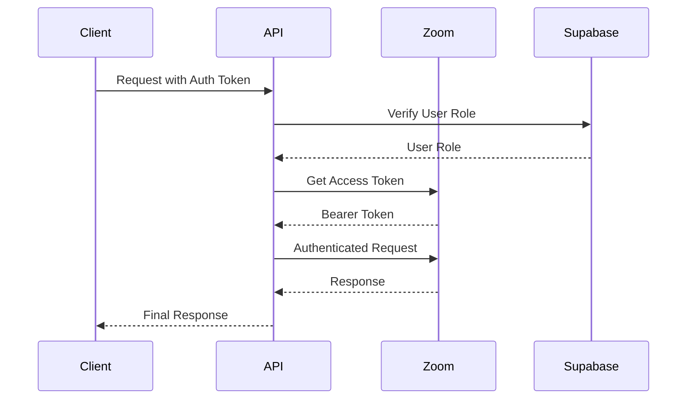
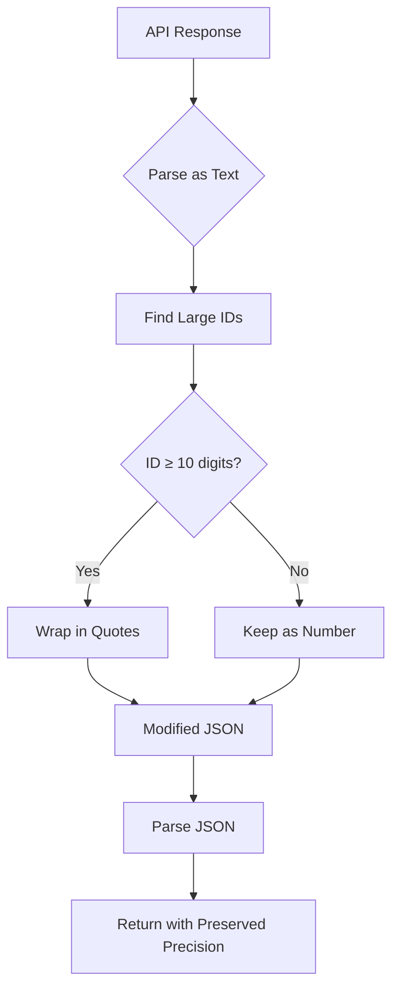
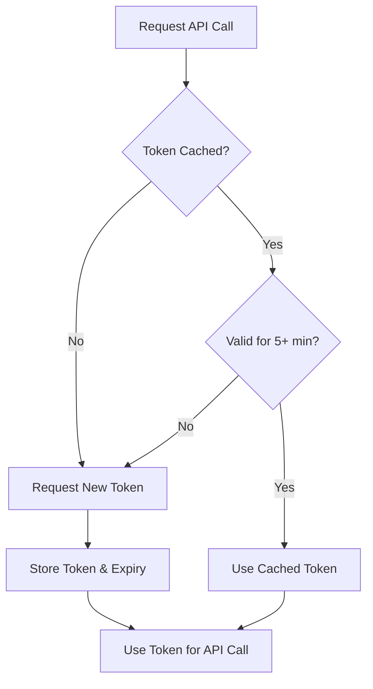

# Meeting Management

<cite>
**Referenced Files in This Document**   
- [client.ts](file://lib/zoom/client.ts)
- [types.ts](file://lib/zoom/types.ts)
- [route.ts](file://app/api/zoom/meetings/route.ts)
- [route.ts](file://app/api/zoom/meetings/[id]/route.ts)
- [constants.ts](file://lib/zoom/constants.ts)
- [20260110023523_create_zoom_meetings_table.sql](file://supabase/migrations/20260110023523_create_zoom_meetings_table.sql)
</cite>

## Table of Contents
1. [Introduction](#introduction)
2. [Zoom Meeting Endpoints Overview](#zoom-meeting-endpoints-overview)
3. [Authentication and Authorization](#authentication-and-authorization)
4. [Core Data Structures](#core-data-structures)
5. [POST /api/zoom/meetings - Create Meeting](#post-apizoommeetings---create-meeting)
6. [GET /api/zoom/meetings - List Meetings](#get-apizoommeetings---list-meetings)
7. [GET /api/zoom/meetings/[id] - Get Meeting Details](#get-apizoommeetingsid---get-meeting-details)
8. [Integration with Zoom Client](#integration-with-zoom-client)
9. [Meeting ID Precision Handling](#meeting-id-precision-handling)
10. [Token Caching Mechanism](#token-caching-mechanism)
11. [Practical Example: Teacher-Hosted Class Session](#practical-example-teacher-hosted-class-session)
12. [Error Handling](#error-handling)

## Introduction
The School-Management-System integrates with Zoom to manage virtual classroom sessions and meetings. This documentation details the Zoom meeting lifecycle management endpoints, focusing on creating, retrieving, and managing scheduled meetings. The system uses Server-to-Server OAuth for authentication with Zoom, ensuring secure and seamless integration. Key features include meeting creation with customizable settings, participant registration, and attendance tracking.

## Zoom Meeting Endpoints Overview
The system provides a comprehensive set of endpoints for managing Zoom meetings throughout their lifecycle. These endpoints enable users to create, retrieve, update, and delete meetings, as well as manage participants and attendance. The endpoints are designed to support educational use cases, particularly teacher-hosted class sessions with enrolled students.

```mermaid
graph TB
A[Client Application] --> B[POST /api/zoom/meetings]
A --> C[GET /api/zoom/meetings]
A --> D[GET /api/zoom/meetings/[id]]
A --> E[PATCH /api/zoom/meetings/[id]]
A --> F[DELETE /api/zoom/meetings/[id]]
B --> G[Zoom API Client]
C --> G
D --> G
E --> G
F --> G
G --> H[Zoom API]
G --> I[Supabase Database]
```

**Diagram sources**
- [route.ts](file://app/api/zoom/meetings/route.ts)
- [route.ts](file://app/api/zoom/meetings/[id]/route.ts)
- [client.ts](file://lib/zoom/client.ts)

**Section sources**
- [route.ts](file://app/api/zoom/meetings/route.ts)
- [route.ts](file://app/api/zoom/meetings/[id]/route.ts)

## Authentication and Authorization
The Zoom integration uses Server-to-Server OAuth authentication, requiring three environment variables: ZOOM_ACCOUNT_ID, ZOOM_CLIENT_ID, and ZOOM_CLIENT_SECRET. This authentication method allows the backend to make API calls to Zoom without user intervention. Access to the meeting endpoints is restricted based on user roles, with only teachers and administrators permitted to create meetings.



**Diagram sources**
- [client.ts](file://lib/zoom/client.ts)
- [route.ts](file://app/api/zoom/meetings/route.ts)
- [server.ts](file://lib/supabase/server.ts)

**Section sources**
- [client.ts](file://lib/zoom/client.ts)
- [route.ts](file://app/api/zoom/meetings/route.ts)

## Core Data Structures
The system defines several key interfaces for representing Zoom meetings and related data. The ZoomApiMeeting interface defines the structure of meeting data returned by the Zoom API, while the ZoomMeeting interface extends this with additional fields specific to the School-Management-System.

```mermaid
classDiagram
class ZoomApiMeeting {
+id : number | string
+uuid : string
+host_id : string
+topic : string
+type : number
+start_time : string
+duration : number
+timezone : string
+created_at : string
+join_url : string
+start_url : string
+password : string
+registration_url? : string
+settings : ZoomMeetingSettings
}
class ZoomMeeting {
+id : string
+zoom_meeting_id : string
+host_id : string
+title : string
+description? : string
+meeting_type : ZoomMeetingType
+start_time : string
+duration : number
+timezone : string
+join_url : string
+start_url? : string
+password? : string
+status : ZoomMeetingStatus
+class_id? : string
+target_audience : 'all' | 'students' | 'teachers' | 'class' | 'personal'
+settings : ZoomMeetingSettings
+created_at : string
+updated_at : string
+host? : { id : string; name : string; email : string; avatar? : string }
+class? : { id : string; name : string }
}
class ZoomMeetingSettings {
+host_video? : boolean
+participant_video? : boolean
+join_before_host? : boolean
+mute_upon_entry? : boolean
+waiting_room? : boolean
+auto_recording? : 'none' | 'local' | 'cloud'
+meeting_authentication? : boolean
+registration_type? : 1 | 2 | 3
+approval_type? : 0 | 1 | 2
}
ZoomApiMeeting <|-- ZoomMeeting
```

**Diagram sources**
- [types.ts](file://lib/zoom/types.ts)

**Section sources**
- [types.ts](file://lib/zoom/types.ts)

## POST /api/zoom/meetings - Create Meeting
The POST /api/zoom/meetings endpoint creates a new scheduled Zoom meeting. Only teachers and administrators can create meetings. The endpoint validates required fields (title, start time, and duration) before proceeding with meeting creation.

When creating a meeting linked to a class, the system automatically enables registration and registers all enrolled students with valid DepEd email addresses (@r1.deped.gov.ph). This registration allows students to bypass the waiting room when joining the meeting. The endpoint also registers all teachers and administrators for class meetings, enabling them to join without waiting.

After creating the meeting in Zoom, the system stores the meeting details in the Supabase database and creates a corresponding calendar event. Notifications are sent to all participants based on the meeting's target audience (all users, specific class, teachers, or students).

**Section sources**
- [route.ts](file://app/api/zoom/meetings/route.ts)
- [client.ts](file://lib/zoom/client.ts)

## GET /api/zoom/meetings - List Meetings
The GET /api/zoom/meetings endpoint retrieves a list of meetings with optional filtering by status, class ID, and upcoming status. The endpoint returns meetings that the authenticated user has permission to view based on their role and the meeting's target audience.

Users can filter meetings by:
- status: Filter by meeting status (scheduled, started, ended, cancelled)
- classId: Filter by class ID
- upcoming: Include only upcoming meetings (start time ≥ current time)
- limit: Limit the number of results returned (default: 50)

The endpoint joins meeting data with host and class information for a comprehensive response. Access control is enforced through Supabase Row Level Security (RLS) policies, which determine which meetings a user can view based on their role and relationship to the meeting.

**Section sources**
- [route.ts](file://app/api/zoom/meetings/route.ts)
- [20260110023523_create_zoom_meetings_table.sql](file://supabase/migrations/20260110023523_create_zoom_meetings_table.sql)

## GET /api/zoom/meetings/[id] - Get Meeting Details
The GET /api/zoom/meetings/[id] endpoint retrieves detailed information about a specific meeting, including its participants. Access to meeting details is restricted to the meeting host, administrators, and teachers of the associated class.

The response includes:
- Meeting metadata (title, description, start time, duration, etc.)
- Host information (name, email, avatar)
- Class information (if applicable)
- Participant list with join/leave times and duration
- Attendance statistics

The endpoint performs comprehensive permission checks to ensure users can only access meetings they are authorized to view. For class meetings, teachers can view attendance data for their classes, enabling them to track student participation.

**Section sources**
- [route.ts](file://app/api/zoom/meetings/[id]/route.ts)
- [20260110023523_create_zoom_meetings_table.sql](file://supabase/migrations/20260110023523_create_zoom_meetings_table.sql)

## Integration with Zoom Client
The system integrates with Zoom through the lib/zoom/client.ts module, which provides a wrapper around the Zoom API. This client handles authentication, request formatting, and response processing.

Key functions include:
- createZoomMeeting(): Creates a new scheduled meeting with specified settings
- getZoomMeeting(): Retrieves meeting details by ID
- updateZoomMeeting(): Updates an existing meeting
- deleteZoomMeeting(): Deletes a meeting
- addMeetingRegistrant(): Registers a participant for a meeting
- addMeetingRegistrantsBatch(): Registers multiple participants in batches

The client automatically handles Server-to-Server OAuth authentication, token caching, and error handling. When creating meetings, the client configures settings such as enabling the waiting room (which registered users bypass), setting video preferences, and configuring registration.

**Section sources**
- [client.ts](file://lib/zoom/client.ts)
- [types.ts](file://lib/zoom/types.ts)

## Meeting ID Precision Handling
The system addresses JavaScript's limitation in handling large integers by implementing a precision-preserving mechanism for Zoom meeting IDs. Since Zoom meeting IDs can be large integers that exceed JavaScript's safe integer range, the system converts these IDs to strings during JSON parsing to prevent precision loss.

This is achieved in the zoomFetch function, which:
1. Parses the API response as text first
2. Uses a regular expression to find large numeric IDs (10+ digits)
3. Wraps these IDs in quotes to convert them to strings
4. Parses the modified JSON text

This approach ensures that meeting IDs are preserved accurately throughout the system, preventing issues that could arise from floating-point precision errors when handling large integers.



**Diagram sources**
- [client.ts](file://lib/zoom/client.ts#L81-L85)

**Section sources**
- [client.ts](file://lib/zoom/client.ts#L81-L85)

## Token Caching Mechanism
The system implements a token caching mechanism to optimize performance and reduce the number of authentication requests to Zoom. The cache stores the access token and its expiry time in memory, reusing the token for subsequent API calls as long as it remains valid.

The caching logic:
1. Checks if a token exists and will remain valid for at least 5 minutes
2. If valid, returns the cached token
3. If expired or missing, requests a new token from Zoom
4. Stores the new token and its expiry time

This approach minimizes the overhead of authentication while ensuring that API calls always use a valid token. The 5-minute buffer prevents race conditions where a token might expire during a series of API calls.



**Diagram sources**
- [client.ts](file://lib/zoom/client.ts#L20-L53)

**Section sources**
- [client.ts](file://lib/zoom/client.ts#L20-L53)

## Practical Example: Teacher-Hosted Class Session
Creating a teacher-hosted class session involves the following steps:

1. Teacher initiates meeting creation through the UI
2. System validates user is a teacher or administrator
3. POST /api/zoom/meetings is called with parameters:
   - title: "Math 101 - Quadratic Equations"
   - startTime: "2025-01-15T09:00:00Z"
   - duration: 60
   - classId: "class-123"
   - targetAudience: "class"
   - settings: { waiting_room: true, participant_video: true }

4. System creates the meeting in Zoom with registration enabled
5. Meeting details are stored in the database
6. Enrolled students with @r1.deped.gov.ph emails are registered
7. All teachers and administrators are registered
8. Calendar event is created
9. Notifications are sent to class participants

The meeting is configured with a waiting room to control access, but registered students bypass this room automatically. The teacher receives a start URL to begin the meeting, while students receive a join URL. Attendance is automatically tracked through the system's integration with Zoom webhooks.

**Section sources**
- [route.ts](file://app/api/zoom/meetings/route.ts)
- [client.ts](file://lib/zoom/client.ts)

## Error Handling
The system implements comprehensive error handling for Zoom API interactions. Errors are categorized and handled appropriately:

- Authentication errors: Invalid credentials or missing environment variables
- Authorization errors: Users attempting to access unauthorized meetings
- Validation errors: Missing required fields or invalid data
- Rate limiting: Handling Zoom API rate limits during batch operations
- Domain restrictions: Preventing non-DepEd email addresses from joining class meetings

The addMeetingRegistrantsBatch function demonstrates sophisticated error handling by processing registrants in batches of 10 with 100ms delays between batches to respect rate limits. Individual registration failures are logged but don't prevent the overall operation from completing.

API errors from Zoom are propagated with descriptive messages, while internal errors are logged for debugging without exposing sensitive information to clients.

**Section sources**
- [client.ts](file://lib/zoom/client.ts)
- [route.ts](file://app/api/zoom/meetings/route.ts)
- [constants.ts](file://lib/zoom/constants.ts)