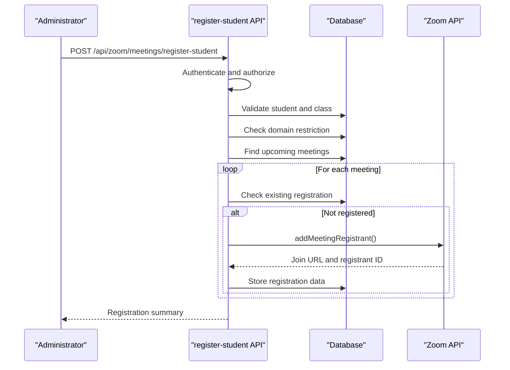
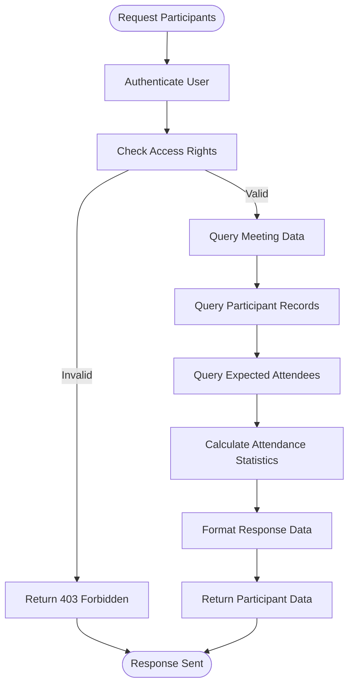
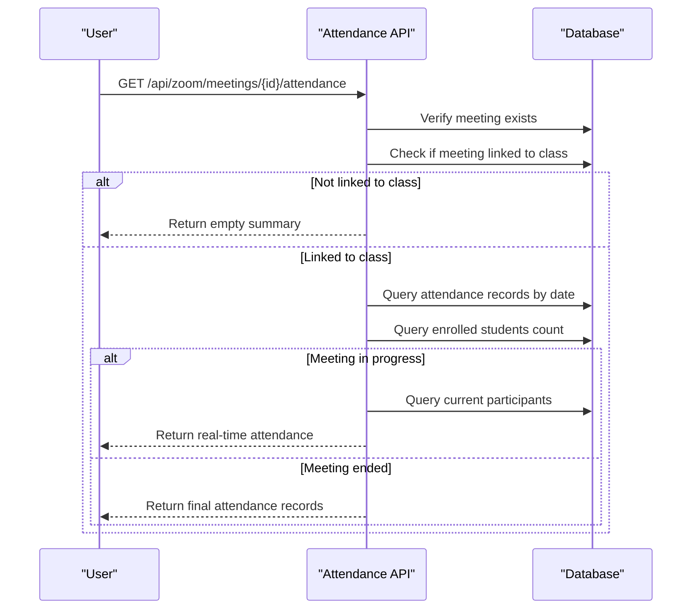
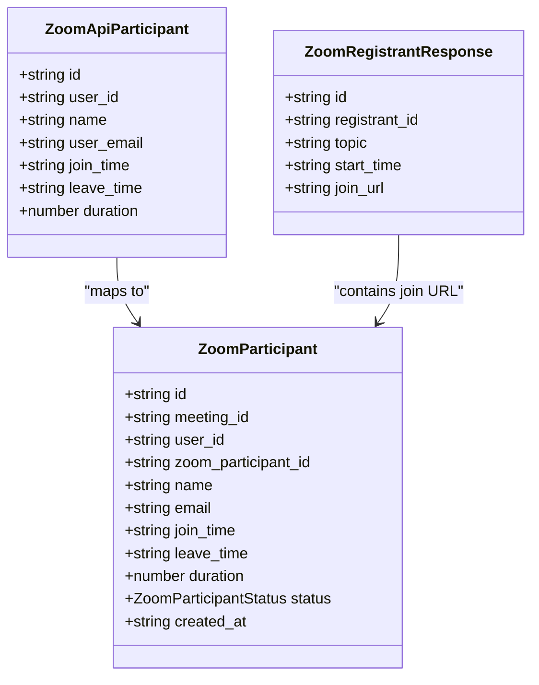
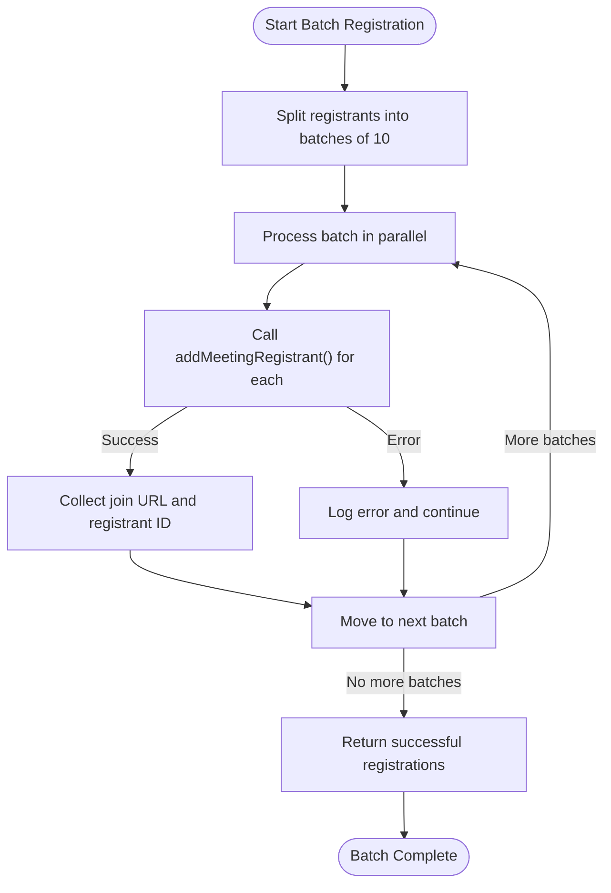
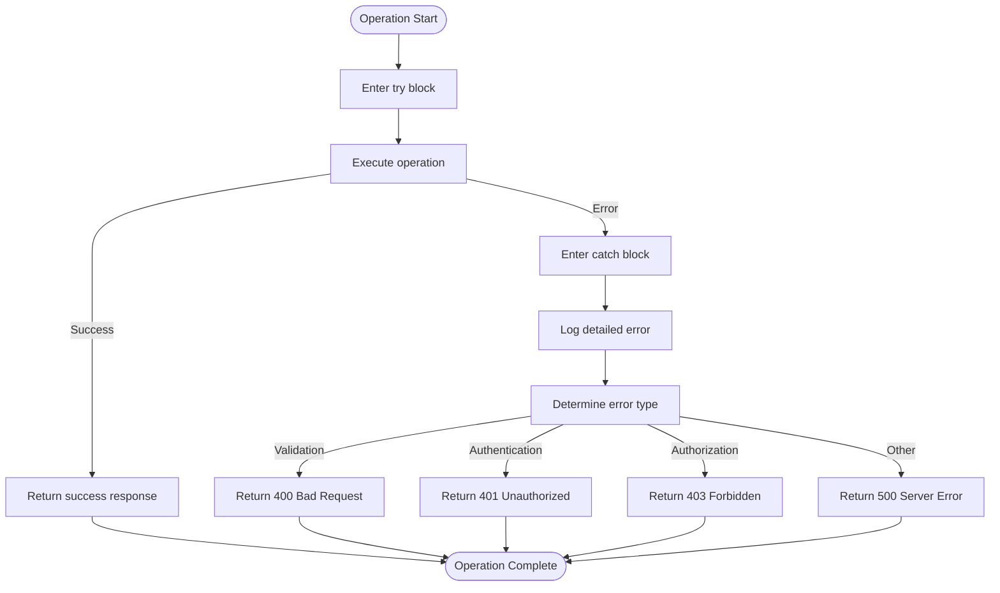
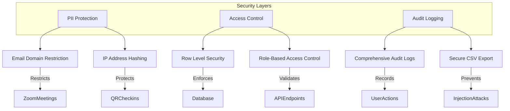
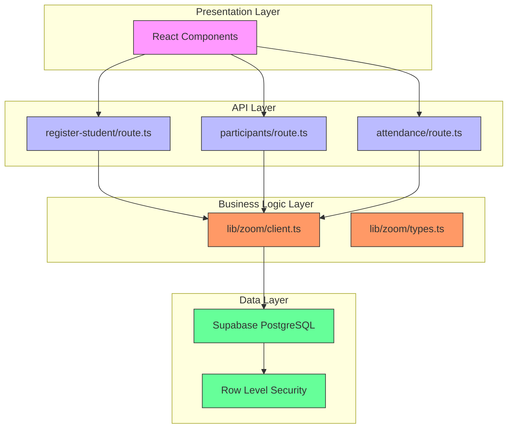

# Participant Operations

<cite>
**Referenced Files in This Document**   
- [types.ts](file://lib/zoom/types.ts)
- [client.ts](file://lib/zoom/client.ts)
- [register-student/route.ts](file://app/api/zoom/meetings/register-student/route.ts)
- [participants/route.ts](file://app/api/zoom/meetings/[id]/participants/route.ts)
- [attendance/route.ts](file://app/api/zoom/meetings/[id]/attendance/route.ts)
- [security.ts](file://lib/security.ts)
- [create_zoom_meetings_table.sql](file://supabase/migrations/20260110000001_create_zoom_meetings_table.sql)
- [create_meeting_registrants_table.sql](file://supabase/migrations/20260110000002_create_meeting_registrants_table.sql)
- [hash_ip_addresses.sql](file://supabase/migrations/20260110000003_hash_ip_addresses.sql)
- [constants.ts](file://lib/zoom/constants.ts)
- [zoom-participants-section.tsx](file://components/zoom-participants-section.tsx)
- [audit-logs.ts](file://lib/supabase/audit-logs.ts)
</cite>

## Table of Contents
1. [Introduction](#introduction)
2. [Core Registration Workflow](#core-registration-workflow)
3. [Participant Retrieval Operations](#participant-retrieval-operations)
4. [Attendance Data Synchronization](#attendance-data-synchronization)
5. [Data Types and Interfaces](#data-types-and-interfaces)
6. [Batch Processing and Rate Limiting](#batch-processing-and-rate-limiting)
7. [Error Resilience Strategies](#error-resilience-strategies)
8. [Security and Privacy Considerations](#security-and-privacy-considerations)
9. [Integration Architecture](#integration-architecture)

## Introduction
This document provides comprehensive documentation for participant management operations in the Zoom integration system. It covers the complete lifecycle of student registration, participant tracking, and attendance synchronization within the school management platform. The system enables administrators to register students for class meetings, retrieve participant lists, extract attendance records, and maintain compliance with privacy regulations. The integration leverages Zoom's API to manage meeting registrants and participants while maintaining synchronized data in the internal database.

## Core Registration Workflow

The POST /api/zoom/meetings/register-student endpoint enables administrators to register students for upcoming class meetings. This operation initiates a multi-step workflow that ensures proper authorization, validates domain restrictions, and synchronizes registration data across systems.

The registration process begins with authentication and role verification to ensure only administrators can register students. The system then validates that the student has a valid email address from the allowed domain (r1.deped.gov.ph). For each upcoming meeting associated with the specified class that has registration enabled, the system checks if the student is already registered to prevent duplicates.

For new registrations, the system calls the addMeetingRegistrant() function from lib/zoom/client.ts, which communicates with Zoom's API to create a registrant record and generate a unique join URL. Upon successful registration with Zoom, the system stores the registration details including the Zoom registrant ID and join URL in the meeting_registrants database table. This ensures that students can access their personalized join links while maintaining an audit trail of all registration activities.

**Diagram sources**
- [register-student/route.ts](file://app/api/zoom/meetings/register-student/route.ts#L9-L115)
- [client.ts](file://lib/zoom/client.ts#L259-L273)

**Section sources**
- [register-student/route.ts](file://app/api/zoom/meetings/register-student/route.ts#L9-L115)
- [client.ts](file://lib/zoom/client.ts#L259-L273)
- [constants.ts](file://lib/zoom/constants.ts#L5-L21)

## Participant Retrieval Operations

The GET /api/zoom/meetings/[id]/participants endpoint provides comprehensive participant information for a specific meeting. This operation retrieves both real-time participant data from the database and enriches it with expected attendee information from class enrollment records.

Access to participant data is strictly controlled through role-based permissions. Users can access participant information if they are the meeting host, an administrator, or the teacher of the associated class. The system performs these authorization checks before retrieving any data to ensure compliance with privacy policies.

The response includes three main components: the meeting details, the list of actual participants with their join/leave timestamps and duration, and the expected attendees based on class enrollment. For each expected attendee, the system indicates whether they attended the meeting and includes their participant record if available. This allows teachers and administrators to quickly assess attendance patterns and identify absent students.

Statistical calculations are performed to provide meaningful insights, including total participants, joined count, expected count, attendance rate percentage, total duration of participation, and average duration. These metrics help educators evaluate engagement levels and meeting effectiveness.

**Diagram sources**
- [participants/route.ts](file://app/api/zoom/meetings/[id]/participants/route.ts#L8-L132)
- [zoom-participants-section.tsx](file://components/zoom-participants-section.tsx#L76-L97)

**Section sources**
- [participants/route.ts](file://app/api/zoom/meetings/[id]/participants/route.ts#L8-L132)
- [zoom-participants-section.tsx](file://components/zoom-participants-section.tsx#L76-L97)
- [create_zoom_meetings_table.sql](file://supabase/migrations/20260110000001_create_zoom_meetings_table.sql#L24-L37)

## Attendance Data Synchronization

The GET /api/zoom/meetings/[id]/attendance endpoint facilitates the synchronization of Zoom attendance data with the internal attendance tracking system. This operation bridges the gap between real-time meeting participation and formal attendance records, enabling accurate reporting and compliance.

The attendance retrieval process first verifies that the meeting is linked to a class, as standalone meetings do not contribute to formal attendance records. For class-linked meetings, the system determines the meeting date and queries the attendance_records table for entries matching the class and date.

The response includes a summary of attendance status counts (present, absent, partial, late) and the detailed attendance records. When a meeting is still in progress, the system provides real-time participant data instead of final attendance, indicating that the official records will be updated upon meeting completion.

The system supports partial attendance status, which is particularly useful for extended meetings or sessions where students may join late or leave early. This granular tracking allows for more accurate assessment of student engagement and participation patterns over time.

**Diagram sources**
- [attendance/route.ts](file://app/api/zoom/meetings/[id]/attendance/route.ts#L8-L101)
- [create_zoom_meetings_table.sql](file://supabase/migrations/20260110000001_create_zoom_meetings_table.sql#L24-L37)

**Section sources**
- [attendance/route.ts](file://app/api/zoom/meetings/[id]/attendance/route.ts#L8-L101)
- [create_zoom_meetings_table.sql](file://supabase/migrations/20260110000001_create_zoom_meetings_table.sql#L24-L37)

## Data Types and Interfaces

The system utilizes well-defined TypeScript interfaces to ensure type safety and consistency across the Zoom integration. The ZoomRegistrantResponse and ZoomApiParticipant types play crucial roles in structuring the data exchanged between the application and Zoom's API.

The ZoomRegistrantResponse interface, defined in lib/zoom/types.ts, represents the response from Zoom's registration API. It contains essential information including the registrant ID, join URL, meeting topic, start time, and unique identifier. This interface ensures that the application can reliably extract the join URL needed for student access.

The ZoomApiParticipant interface defines the structure of participant data returned by Zoom's reporting API. It includes the participant's ID, user ID, name, email, join time, leave time, and duration of participation in seconds. This comprehensive data model enables detailed attendance analysis and reporting.

These interfaces are used throughout the application to maintain consistency between API responses, database operations, and frontend components. They serve as contracts that ensure data integrity and facilitate type checking during development.

**Diagram sources**
- [types.ts](file://lib/zoom/types.ts#L73-L116)
- [create_zoom_meetings_table.sql](file://supabase/migrations/20260110000001_create_zoom_meetings_table.sql#L24-L37)

**Section sources**
- [types.ts](file://lib/zoom/types.ts#L73-L116)
- [create_zoom_meetings_table.sql](file://supabase/migrations/20260110000001_create_zoom_meetings_table.sql#L24-L37)

## Batch Processing and Rate Limiting

The system implements batch registration processing to efficiently handle multiple student registrations while respecting Zoom API rate limits. The addMeetingRegistrantsBatch() function in lib/zoom/client.ts processes registrants in batches of 10, which aligns with Zoom's rate limiting policies.

The batch processing algorithm divides the registrant list into chunks of 10 and processes each chunk in parallel using Promise.all(). This approach maximizes efficiency while preventing rate limit violations. After processing each batch, the system introduces a 100ms delay before processing the next batch, providing additional protection against rate limiting.

Error handling is integrated into the batch process, allowing individual registration failures without aborting the entire batch. When a registration fails, the error is logged, and the process continues with the remaining registrants. Successful registrations are collected and returned as an array of ZoomRegistrantResponse objects, while failed attempts are filtered out.

This batch processing strategy ensures reliable registration of large groups of students, such as when enrolling an entire class, while maintaining system stability and API compliance.

**Diagram sources**
- [client.ts](file://lib/zoom/client.ts#L279-L307)
- [register-student/route.ts](file://app/api/zoom/meetings/register-student/route.ts#L69-L101)

**Section sources**
- [client.ts](file://lib/zoom/client.ts#L279-L307)
- [register-student/route.ts](file://app/api/zoom/meetings/register-student/route.ts#L69-L101)

## Error Resilience Strategies

The system incorporates comprehensive error resilience strategies to ensure reliable operation despite network issues, API failures, or invalid data. These strategies are implemented at multiple levels of the participant management workflow.

At the API level, all endpoints include try-catch blocks to handle unexpected errors gracefully. When an error occurs, detailed error messages are logged for debugging purposes, while users receive appropriate HTTP status codes and user-friendly error messages. This approach maintains system stability while providing meaningful feedback.

For registration operations, the system implements idempotency by checking for existing registrations before attempting to create new ones. This prevents duplicate entries and ensures that retrying a failed registration request will not create multiple records.

Network-related errors when communicating with Zoom's API are handled with specific error logging that captures the failed email and error message. This allows administrators to identify problematic registrations and take corrective action without disrupting the entire process.

Validation errors are handled at the request level, with clear error messages returned to the client. For example, missing required parameters result in a 400 Bad Request response, while unauthorized access attempts return appropriate 401 or 403 status codes.

**Section sources**
- [register-student/route.ts](file://app/api/zoom/meetings/register-student/route.ts#L34-L113)
- [client.ts](file://lib/zoom/client.ts#L71-L74)
- [participants/route.ts](file://app/api/zoom/meetings/[id]/participants/route.ts#L57-L68)

## Security and Privacy Considerations

The system implements robust security measures to protect personally identifiable information (PII) and ensure compliance with privacy regulations. These measures address both data protection and access control aspects of participant management.

Email domain restrictions are enforced through the isAllowedEmail() function, which verifies that students have valid @r1.deped.gov.ph email addresses before allowing registration. This policy ensures that only authorized users can participate in class meetings, maintaining the integrity of the educational environment.

IP address privacy is protected through hashing using SHA-256 with a salt. The hashIpAddress() function in lib/security.ts converts raw IP addresses into irreversible hashes before storage, preventing the exposure of sensitive location information while still allowing abuse detection through hash comparison.

Access to participant and attendance data is strictly controlled through role-based permissions and Row Level Security (RLS) policies in the database. Users can only access data for meetings they are authorized to view, based on their role as host, administrator, teacher, or enrolled student.

Audit logging captures all access and modification events, with sensitive data protected through proper escaping to prevent injection attacks. The exportAuditLogsToCSV() function includes safeguards against formula injection by prefixing potentially dangerous characters with single quotes.

**Diagram sources**
- [security.ts](file://lib/security.ts#L11-L14)
- [constants.ts](file://lib/zoom/constants.ts#L5-L21)
- [hash_ip_addresses.sql](file://supabase/migrations/20260110000003_hash_ip_addresses.sql#L1-L18)
- [create_zoom_meetings_table.sql](file://supabase/migrations/20260110000001_create_zoom_meetings_table.sql#L51-L92)

**Section sources**
- [security.ts](file://lib/security.ts#L11-L14)
- [constants.ts](file://lib/zoom/constants.ts#L5-L21)
- [hash_ip_addresses.sql](file://supabase/migrations/20260110000003_hash_ip_addresses.sql#L1-L18)
- [audit-logs.ts](file://lib/supabase/audit-logs.ts#L232-L261)

## Integration Architecture

The participant management system follows a layered architecture that separates concerns between API endpoints, business logic, and data persistence. This design promotes maintainability, testability, and scalability of the Zoom integration features.

The API layer consists of Next.js route handlers that receive HTTP requests, perform authentication and authorization, and orchestrate the required operations. These endpoints serve as the entry points for all participant management operations.

The business logic layer, implemented in lib/zoom/client.ts, contains the core functionality for interacting with Zoom's API. This includes functions for creating meetings, registering participants, and retrieving meeting data. The client handles OAuth token management, request formatting, and response parsing.

The data persistence layer leverages Supabase PostgreSQL database with Row Level Security policies to ensure data isolation and access control. Database tables such as zoom_meetings, zoom_participants, and meeting_registrants store the synchronized state between the application and Zoom.

Type definitions in lib/zoom/types.ts provide a contract for data structures used throughout the system, ensuring type safety and consistency between different components.

**Diagram sources**
- [register-student/route.ts](file://app/api/zoom/meetings/register-student/route.ts)
- [participants/route.ts](file://app/api/zoom/meetings/[id]/participants/route.ts)
- [attendance/route.ts](file://app/api/zoom/meetings/[id]/attendance/route.ts)
- [client.ts](file://lib/zoom/client.ts)
- [types.ts](file://lib/zoom/types.ts)
- [create_zoom_meetings_table.sql](file://supabase/migrations/20260110000001_create_zoom_meetings_table.sql)

**Section sources**
- [register-student/route.ts](file://app/api/zoom/meetings/register-student/route.ts)
- [participants/route.ts](file://app/api/zoom/meetings/[id]/participants/route.ts)
- [attendance/route.ts](file://app/api/zoom/meetings/[id]/attendance/route.ts)
- [client.ts](file://lib/zoom/client.ts)
- [types.ts](file://lib/zoom/types.ts)
- [create_zoom_meetings_table.sql](file://supabase/migrations/20260110000001_create_zoom_meetings_table.sql)