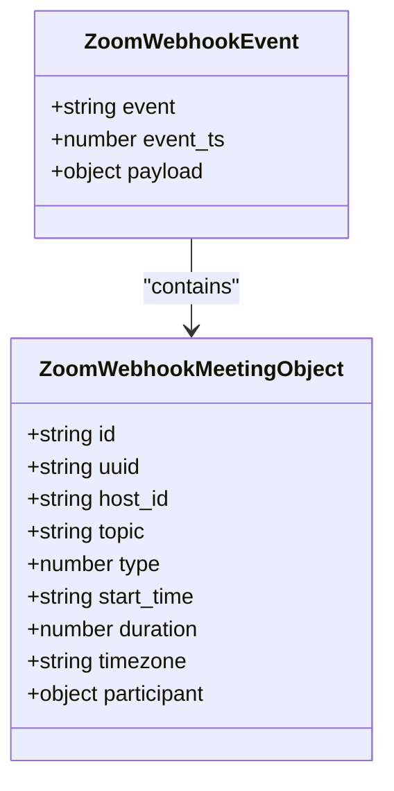
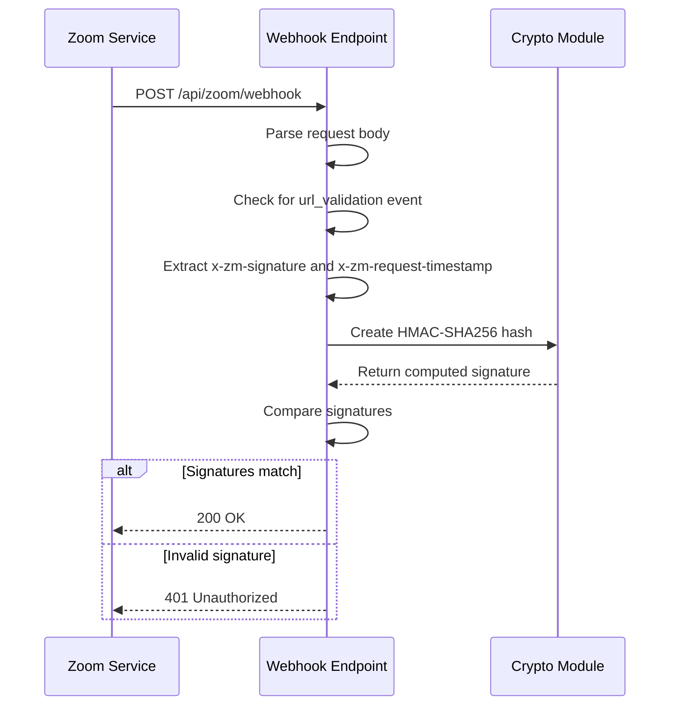
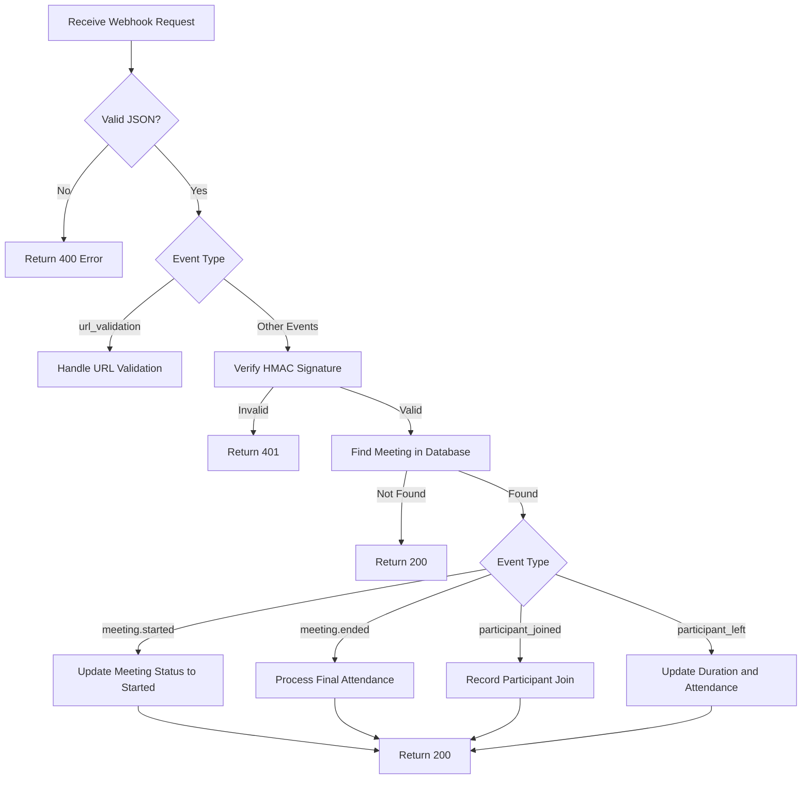
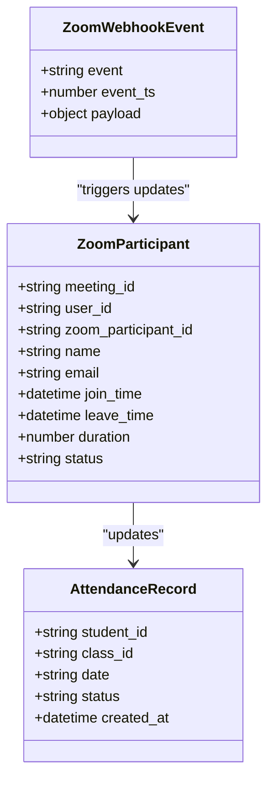
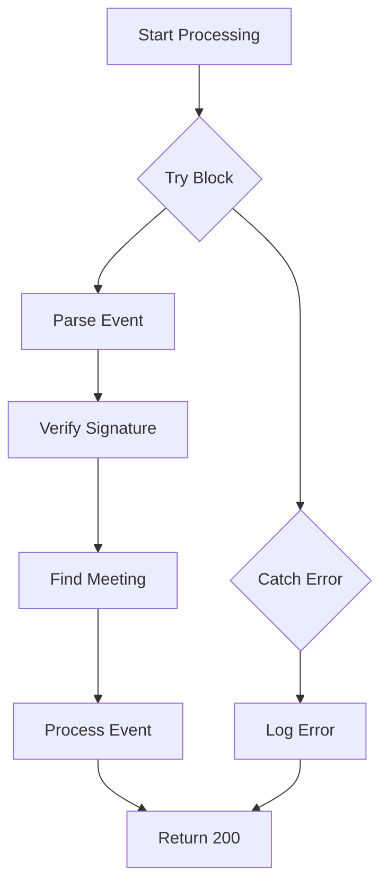
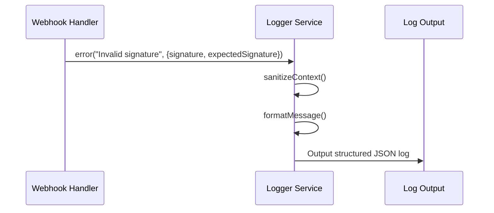
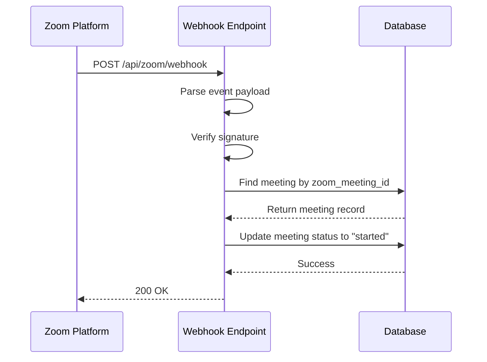
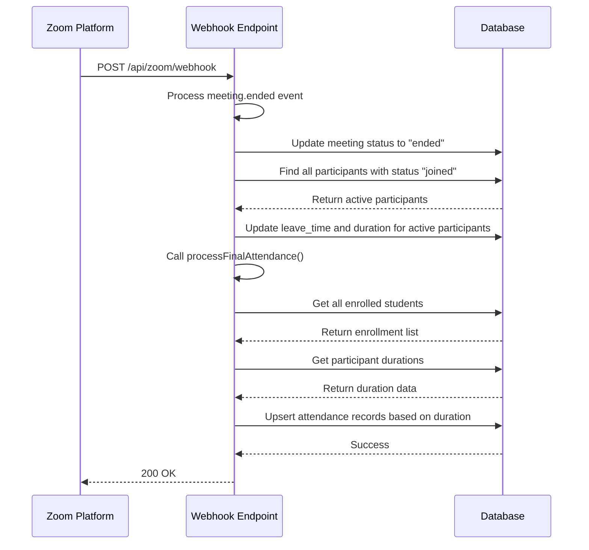
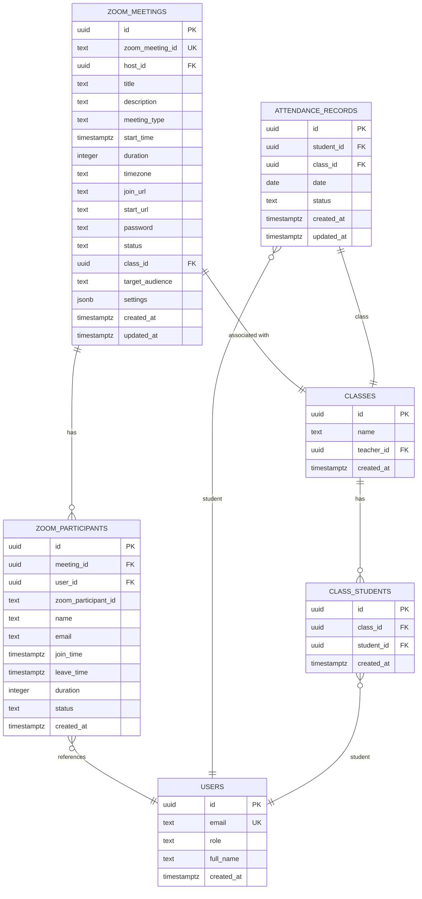

# Webhook Handling

<cite>
**Referenced Files in This Document**   
- [route.ts](file://app/api/zoom/webhook/route.ts)
- [types.ts](file://lib/zoom/types.ts)
- [audit-monitor.ts](file://lib/audit-monitor.ts)
- [create_zoom_meetings_table.sql](file://supabase/migrations/20260110023523_create_zoom_meetings_table.sql)
- [create_meeting_registrants_table.sql](file://supabase/migrations/20260110095507_create_meeting_registrants_table.sql)
- [logger.ts](file://lib/logger.ts)
</cite>

## Table of Contents
1. [Introduction](#introduction)
2. [Webhook Endpoint Overview](#webhook-endpoint-overview)
3. [Request Schema and ZoomWebhookEvent Interface](#request-schema-and-zoomwebhookevent-interface)
4. [HMAC Signature Verification](#hmac-signature-verification)
5. [Event Routing and Processing Logic](#event-routing-and-processing-logic)
6. [Integration with Internal Systems](#integration-with-internal-systems)
7. [Error Handling and Retry Mechanisms](#error-handling-and-retry-mechanisms)
8. [Logging and Audit Monitoring](#logging-and-audit-monitoring)
9. [Example Use Cases](#example-use-cases)
10. [Database Schema](#database-schema)

## Introduction
This document provides comprehensive API documentation for the Zoom webhook endpoint `POST /api/zoom/webhook` in the School Management System. The endpoint enables real-time processing of Zoom lifecycle events, facilitating seamless integration between Zoom meetings and internal school systems such as attendance tracking and gradebook updates. The system listens for key events including meeting start, end, participant join, and leave, and processes them to maintain accurate records across the platform.

## Webhook Endpoint Overview
The Zoom webhook endpoint at `POST /api/zoom/webhook` serves as the central integration point between Zoom's event system and the school management platform. It receives HTTP POST requests from Zoom containing lifecycle events, validates their authenticity, and routes them to appropriate handlers based on the event type. The endpoint supports several critical event types:
- `meeting.started`: Triggered when a Zoom meeting begins
- `meeting.ended`: Triggered when a Zoom meeting concludes
- `meeting.participant_joined`: Triggered when a participant joins a meeting
- `meeting.participant_left`: Triggered when a participant leaves a meeting
- `endpoint.url_validation`: Special event for initial URL validation during webhook setup

The endpoint is designed to be idempotent and resilient, ensuring reliable processing even under high load or network instability conditions.

**Section sources**
- [route.ts](file://app/api/zoom/webhook/route.ts#L17-L45)

## Request Schema and ZoomWebhookEvent Interface
The Zoom webhook follows a standardized JSON payload structure defined by the `ZoomWebhookEvent` interface in `lib/zoom/types.ts`. This interface specifies the expected format for all incoming webhook events from Zoom.

**Diagram sources**
- [types.ts](file://lib/zoom/types.ts#L130-L157)

The complete request schema includes:
- **event**: String identifier for the event type (e.g., "meeting.started")
- **event_ts**: Timestamp of the event in milliseconds
- **payload**: Container object with:
  - **account_id**: Zoom account identifier
  - **object**: Meeting object containing meeting details and optional participant data

For participant events, the payload includes additional participant information such as user ID, name, email, and timestamps for join/leave events. The system uses this data to track attendance and update participant status in real-time.

**Section sources**
- [types.ts](file://lib/zoom/types.ts#L130-L157)
- [route.ts](file://app/api/zoom/webhook/route.ts#L21-L26)

## HMAC Signature Verification
To ensure request authenticity and prevent unauthorized access, the webhook implements HMAC signature verification using the `ZOOM_WEBHOOK_SECRET` environment variable. The verification process occurs after initial JSON parsing but before any business logic processing.

The signature verification follows Zoom's security protocol:
1. Extract the `x-zm-signature` header from the incoming request
2. Extract the `x-zm-request-timestamp` header
3. Construct a message string in the format `v0:{timestamp}:{body}`
4. Create an HMAC-SHA256 hash of the message using the `ZOOM_WEBHOOK_SECRET`
5. Compare the computed signature with the received signature in `v0={hash}` format

**Diagram sources**
- [route.ts](file://app/api/zoom/webhook/route.ts#L47-L62)

For the initial URL validation during webhook setup, a special validation process is used where Zoom sends a `endpoint.url_validation` event with a plain token that must be hashed and returned to complete verification.

**Section sources**
- [route.ts](file://app/api/zoom/webhook/route.ts#L29-L45)
- [route.ts](file://app/api/zoom/webhook/route.ts#L47-L62)

## Event Routing and Processing Logic
The webhook implements a switch-based routing mechanism to handle different event types appropriately. After successful signature verification, the system extracts the meeting ID from the event payload and validates that the meeting exists in the internal database.

**Diagram sources**
- [route.ts](file://app/api/zoom/webhook/route.ts#L83-L241)

The event routing logic handles four primary event types:
- **meeting.started**: Updates the meeting status to "started" in the database
- **meeting.ended**: Updates the meeting status to "ended" and triggers final attendance processing
- **meeting.participant_joined**: Creates or updates participant records and sets status to "joined"
- **meeting.participant_left**: Updates participant leave time, calculates duration, and updates attendance status

Each event type triggers specific database operations to maintain accurate state across the system.

**Section sources**
- [route.ts](file://app/api/zoom/webhook/route.ts#L83-L241)

## Integration with Internal Systems
The webhook endpoint integrates with multiple internal systems to provide seamless functionality across the school management platform. These integrations occur automatically when specific events are processed.

### Attendance Tracking System
When a meeting starts, the system automatically updates the meeting status, which triggers attendance tracking. The system processes attendance in two phases:

1. **Real-time participant tracking**: As participants join and leave, their duration is accumulated
2. **Final attendance processing**: When the meeting ends, all enrolled students are accounted for

The attendance system uses a 15-minute minimum duration threshold to determine presence. Students who attend for at least 15 minutes are marked as "present", those who attend for less time are marked as "partial", and those who never join are marked as "absent".

**Diagram sources**
- [route.ts](file://app/api/zoom/webhook/route.ts#L254-L283)
- [route.ts](file://app/api/zoom/webhook/route.ts#L290-L340)

### Gradebook Integration
While the webhook itself doesn't directly update grades, it provides the foundation for gradebook integration by accurately tracking attendance, which is often a component of overall student grades. The attendance records created by the webhook can be used by grading algorithms to calculate participation scores.

**Section sources**
- [route.ts](file://app/api/zoom/webhook/route.ts#L254-L340)

## Error Handling and Retry Mechanisms
The webhook implements robust error handling to ensure reliability and data consistency. The system follows a fail-safe approach where errors are logged but do not prevent acknowledgment of the webhook request.

### Error Handling Strategy
- **Invalid JSON**: Returns 400 Bad Request with "Invalid JSON" message
- **Invalid signature**: Returns 401 Unauthorized with "Invalid signature" message
- **Missing meeting**: Returns 200 OK to acknowledge receipt, even if the meeting isn't found in the database
- **Processing errors**: All errors in the try-catch block are logged but do not prevent the final response

The system uses a try-catch wrapper around the main event processing logic to prevent unhandled exceptions from disrupting the webhook acknowledgment.

**Diagram sources**
- [route.ts](file://app/api/zoom/webhook/route.ts#L242-L244)

### Retry Mechanisms
Zoom automatically retries webhook delivery if it doesn't receive a successful response (2xx status code) within a certain timeframe. The system is designed to be idempotent, meaning that repeated delivery of the same event will not create duplicate records due to the use of upsert operations with conflict resolution.

**Section sources**
- [route.ts](file://app/api/zoom/webhook/route.ts#L242-L244)
- [route.ts](file://app/api/zoom/webhook/route.ts#L141-L151)
- [route.ts](file://app/api/zoom/webhook/route.ts#L274-L282)

## Logging and Audit Monitoring
The system implements comprehensive logging and audit monitoring to ensure security and facilitate troubleshooting. All webhook processing activities are logged with appropriate context while protecting sensitive information.

### Logging Implementation
The system uses a structured logging approach with the following characteristics:
- Errors are logged with full context for debugging
- Sensitive data is redacted from logs
- Log levels are environment-aware (more verbose in development, limited to warnings/errors in production)

**Diagram sources**
- [logger.ts](file://lib/logger.ts#L70-L80)

The audit monitoring system also provides security alerts for suspicious activities, though this is not directly tied to the webhook processing. The system logs all significant events including invalid signatures and processing errors for security review.

**Section sources**
- [logger.ts](file://lib/logger.ts#L70-L80)
- [route.ts](file://app/api/zoom/webhook/route.ts#L59-L60)
- [route.ts](file://app/api/zoom/webhook/route.ts#L243-L244)

## Example Use Cases

### Handling Meeting Start Events for Attendance
When a teacher starts a Zoom meeting, the system automatically processes the `meeting.started` event to update the meeting status and prepare for attendance tracking.

**Diagram sources**
- [route.ts](file://app/api/zoom/webhook/route.ts#L84-L89)

This automatic status update enables the UI to reflect that a class is currently in session and triggers the attendance tracking system to begin monitoring participant join events.

### Processing Meeting End Events for Session Reports
When a meeting ends, the system processes the `meeting.ended` event to generate comprehensive session reports and update attendance records for all enrolled students.

**Diagram sources**
- [route.ts](file://app/api/zoom/webhook/route.ts#L91-L129)
- [route.ts](file://app/api/zoom/webhook/route.ts#L290-L340)

The final attendance processing ensures that all students are accounted for, marking those who attended for at least 15 minutes as "present", those with shorter attendance as "partial", and those who never joined as "absent".

**Section sources**
- [route.ts](file://app/api/zoom/webhook/route.ts#L91-L129)
- [route.ts](file://app/api/zoom/webhook/route.ts#L254-L340)

## Database Schema
The webhook functionality relies on several database tables to store meeting and participant information. These tables are defined in the Supabase migration files and are essential for the proper operation of the webhook system.

**Diagram sources**
- [create_zoom_meetings_table.sql](file://supabase/migrations/20260110023523_create_zoom_meetings_table.sql)
- [create_meeting_registrants_table.sql](file://supabase/migrations/20260110095507_create_meeting_registrants_table.sql)

The key tables include:
- **zoom_meetings**: Stores information about Zoom meetings linked to classes
- **zoom_participants**: Tracks individual participant attendance in meetings
- **attendance_records**: Contains the final attendance status for students
- **class_students**: Links students to classes for enrollment verification

The schema supports efficient querying for attendance reports and ensures data integrity through appropriate foreign key constraints and unique indexes.

**Section sources**
- [create_zoom_meetings_table.sql](file://supabase/migrations/20260110023523_create_zoom_meetings_table.sql)
- [create_meeting_registrants_table.sql](file://supabase/migrations/20260110095507_create_meeting_registrants_table.sql)
- [route.ts](file://app/api/zoom/webhook/route.ts#L72-L77)
- [route.ts](file://app/api/zoom/webhook/route.ts#L262-L268)
- [route.ts](file://app/api/zoom/webhook/route.ts#L299-L303)
- [route.ts](file://app/api/zoom/webhook/route.ts#L307-L312)
- [route.ts](file://app/api/zoom/webhook/route.ts#L274-L282)
- [route.ts](file://app/api/zoom/webhook/route.ts#L331-L339)