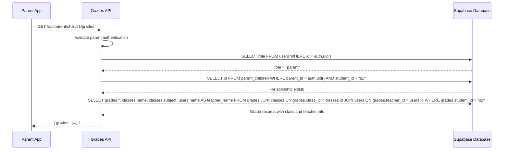
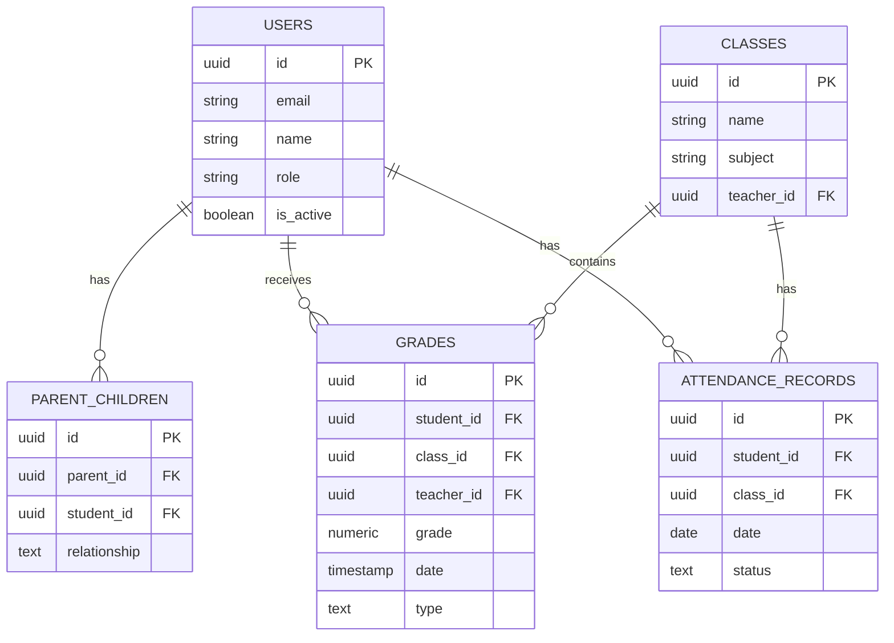
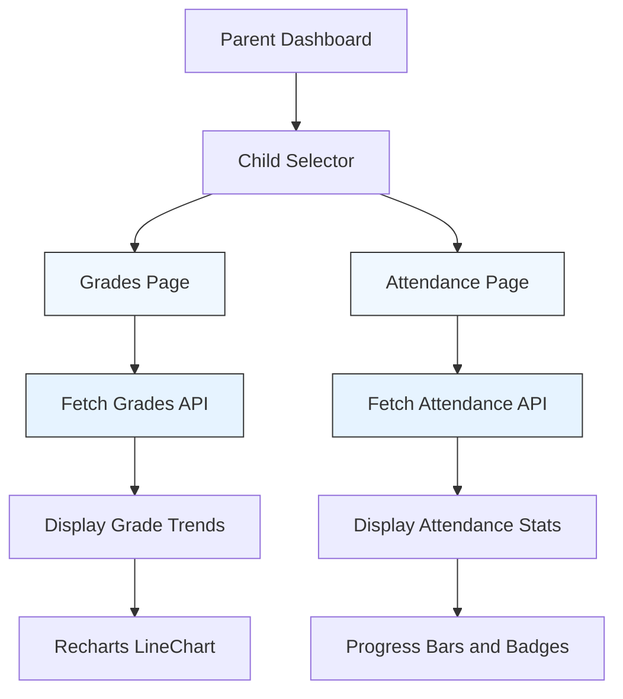

# Academic Monitoring

<cite>
**Referenced Files in This Document**   
- [route.ts](file://app/api/parent/child/[id]/grades/route.ts)
- [route.ts](file://app/api/parent/child/[id]/attendance/route.ts)
- [attendance-utils.ts](file://lib/attendance-utils.ts)
- [parent-store.ts](file://lib/parent-store.ts)
- [analytics-store.ts](file://lib/analytics-store.ts)
- [page.tsx](file://app/parent/grades/page.tsx)
- [page.tsx](file://app/parent/attendance/page.tsx)
- [20260105000003_create_parent_tables.sql](file://supabase/migrations/20260105000003_create_parent_tables.sql)
- [20250228_security_hardening.sql](file://supabase/migrations/20250228_security_hardening.sql)
- [20240101000000_secure_rls.sql](file://supabase/migrations/20240101000000_secure_rls.sql)
- [server.ts](file://lib/supabase/server.ts)
</cite>

## Table of Contents
1. [Introduction](#introduction)
2. [Grades Endpoint](#grades-endpoint)
3. [Attendance Endpoint](#attendance-endpoint)
4. [Shared Authorization Pattern](#shared-authorization-pattern)
5. [Security Model and RLS Policies](#security-model-and-rls-policies)
6. [Frontend Integration](#frontend-integration)
7. [Performance Considerations](#performance-considerations)
8. [Usage Examples](#usage-examples)
9. [Conclusion](#conclusion)

## Introduction
The Academic Monitoring system enables parents to access their child's educational records through secure API endpoints. This document details the implementation of two critical endpoints: one for retrieving academic grades and another for viewing attendance records. Both endpoints follow a consistent security model, require proper authentication and authorization, and return structured data suitable for display in the parent dashboard UI. The system leverages Supabase for database operations, Row Level Security (RLS) for data protection, and a well-defined frontend integration pattern using React and Zustand for state management.

**Section sources**
- [route.ts](file://app/api/parent/child/[id]/grades/route.ts)
- [route.ts](file://app/api/parent/child/[id]/attendance/route.ts)

## Grades Endpoint
The grades endpoint allows parents to retrieve their linked child's academic performance data. It is accessible via a GET request to `/api/parent/child/[id]/grades`, where `[id]` represents the student's unique identifier.

### HTTP Method and Route
- **Method**: GET
- **Route**: `/api/parent/child/[id]/grades`
- **Authentication**: Required (JWT via Supabase Auth)
- **Authorization**: Parent must have a valid relationship with the specified student

### Parameter Validation
The endpoint validates the `studentId` path parameter to ensure it corresponds to a student with whom the requesting parent has a registered relationship. The validation occurs through a database query against the `parent_children` table, which maps parent and student user IDs. If no relationship exists, the endpoint returns a 403 Forbidden response.

### Response Structure
The response contains a JSON object with a `grades` array. Each grade entry includes:
- Grade details (score, date, type)
- Associated class information (name, subject)
- Teacher information (name)

The data is fetched using a Supabase query that performs a join across the `grades`, `classes`, and `users` tables to enrich the grade records with contextual information. Results are ordered by date in descending order to show the most recent grades first.



**Diagram sources**
- [route.ts](file://app/api/parent/child/[id]/grades/route.ts)
- [server.ts](file://lib/supabase/server.ts)

**Section sources**
- [route.ts](file://app/api/parent/child/[id]/grades/route.ts)

## Attendance Endpoint
The attendance endpoint provides parents with access to their child's attendance history and summary statistics. It is accessible via a GET request to `/api/parent/child/[id]/attendance`.

### HTTP Method and Route
- **Method**: GET
- **Route**: `/api/parent/child/[id]/attendance`
- **Authentication**: Required (JWT via Supabase Auth)
- **Authorization**: Parent must have a valid relationship with the specified student

### Date Range Filtering
The endpoint supports optional query parameters for filtering attendance records by date:
- `startDate`: Filters records from this date onward (inclusive)
- `endDate`: Filters records up to this date (inclusive)

When these parameters are provided, the endpoint applies `gte` (greater than or equal) and `lte` (less than or equal) filters to the date field in the database query.

### Response Format
The response includes two main components:
1. **attendance**: An array of attendance records, each containing:
   - Date of attendance
   - Status (present, absent, late, excused)
   - Associated class information (name, subject)
2. **stats**: Calculated attendance statistics including counts for each status type and an overall attendance rate percentage.

### Integration with calculateAttendanceStats
The endpoint imports and utilizes the `calculateAttendanceStats` utility function from `attendance-utils.ts`. This function processes the raw attendance records and computes:
- Individual counts for present, absent, late, and excused statuses
- Total number of records
- Attendance rate (percentage of records marked as present or late)

The attendance rate is calculated as `(present + late) / total * 100`, rounded to the nearest integer.

```mermaid
flowchart TD
A[API Request] --> B{Validate Parent Auth}
B --> |Valid| C[Check Parent-Child Relationship]
C --> |Exists| D[Apply Date Filters if Provided]
D --> E[Query Attendance Records]
E --> F[Fetch Class Information]
F --> G[Calculate Statistics]
G --> H[Return Response]
B --> |Invalid| I[Return 401 Unauthorized]
C --> |No Relationship| J[Return 403 Forbidden]
G --> |Use Utility| K[calculateAttendanceStats()]
```

**Diagram sources**
- [route.ts](file://app/api/parent/child/[id]/attendance/route.ts)
- [attendance-utils.ts](file://lib/attendance-utils.ts)

**Section sources**
- [route.ts](file://app/api/parent/child/[id]/attendance/route.ts)
- [attendance-utils.ts](file://lib/attendance-utils.ts)

## Shared Authorization Pattern
Both academic monitoring endpoints implement a consistent authorization pattern to ensure data privacy and prevent unauthorized access.

### Authentication Flow
1. The endpoint first verifies that a user is authenticated by calling `supabase.auth.getUser()`.
2. If no user is found in the session, a 401 Unauthorized response is returned.

### Role Verification
After successful authentication, the endpoint queries the `users` table to confirm the user's role:
```typescript
const { data: userData } = await supabase
  .from("users")
  .select("role")
  .eq("id", user.id)
  .single()
```
Only users with the `parent` role are permitted to proceed.

### Parent-Child Relationship Verification
The core authorization check verifies that the authenticated parent has a valid relationship with the requested student by querying the `parent_children` table:
```typescript
const { data: relationship } = await supabase
  .from("parent_children")
  .select("id")
  .eq("parent_id", user.id)
  .eq("student_id", studentId)
  .single()
```
This relationship table serves as the authorization boundary, ensuring parents can only access data for their linked children.

**Section sources**
- [route.ts](file://app/api/parent/child/[id]/grades/route.ts)
- [route.ts](file://app/api/parent/child/[id]/attendance/route.ts)

## Security Model and RLS Policies
The system employs a defense-in-depth security approach combining Row Level Security (RLS) policies with application-level authorization checks.

### Database Schema and RLS
The `parent_children` table, created in migration `20260105000003_create_parent_tables.sql`, establishes the relationship between parents and students. This table is protected by RLS policies that restrict access based on user roles.

### Key RLS Policies
- **Parents can view their own children**: Allows a parent to select records where `parent_id = auth.uid()`
- **Admin can manage all relationships**: Grants administrators full access to the table
- **Parents can view children's grades**: A policy on the `grades` table that allows parents to select grades where a corresponding entry exists in `parent_children`

These policies are defined in the migration files and provide an additional layer of security that complements the application-level checks.



**Diagram sources**
- [20260105000003_create_parent_tables.sql](file://supabase/migrations/20260105000003_create_parent_tables.sql)
- [20250228_security_hardening.sql](file://supabase/migrations/20250228_security_hardening.sql)
- [20240101000000_secure_rls.sql](file://supabase/migrations/20240101000000_secure_rls.sql)

**Section sources**
- [20260105000003_create_parent_tables.sql](file://supabase/migrations/20260105000003_create_parent_tables.sql)
- [20250228_security_hardening.sql](file://supabase/migrations/20250228_security_hardening.sql)

## Frontend Integration
The academic monitoring endpoints are integrated into the parent dashboard through dedicated UI components that consume the API data and present it in a user-friendly format.

### State Management
The frontend uses Zustand stores for state management:
- `useParentStore`: Manages parent-related data including child relationships
- `useAnalyticsStore`: Handles student analytics data including grades and attendance

These stores provide selectors like `getChildrenIds()` and `getStudentAnalytics()` that abstract the data access logic from the UI components.

### UI Components
Two primary pages consume the academic monitoring endpoints:
- **Grades Page** (`app/parent/grades/page.tsx`): Displays grade trends, subject performance, and recent grades using charts and data visualizations
- **Attendance Page** (`app/parent/attendance/page.tsx`): Shows attendance statistics, rate progress, and recent attendance records with status indicators

Both components follow a consistent pattern of:
1. Loading child selection state
2. Fetching analytics data
3. Displaying summary cards and detailed lists
4. Providing visual feedback during loading states



**Diagram sources**
- [page.tsx](file://app/parent/grades/page.tsx)
- [page.tsx](file://app/parent/attendance/page.tsx)
- [parent-store.ts](file://lib/parent-store.ts)
- [analytics-store.ts](file://lib/analytics-store.ts)

**Section sources**
- [page.tsx](file://app/parent/grades/page.tsx)
- [page.tsx](file://app/parent/attendance/page.tsx)
- [parent-store.ts](file://lib/parent-store.ts)
- [analytics-store.ts](file://lib/analytics-store.ts)

## Performance Considerations
The academic monitoring system incorporates several performance optimizations to ensure responsive data retrieval and display.

### Data Fetching Optimization
The API endpoints use Supabase's efficient query builder to:
- Select only necessary fields
- Perform joins at the database level to minimize round trips
- Apply filters and ordering in the database rather than in application code

### Client-Side Caching
The frontend implements client-side caching through Zustand stores, which:
- Prevents redundant API calls when navigating between pages
- Maintains state across component re-renders
- Reduces perceived loading times for users

### Efficient Data Processing
The `calculateAttendanceStats` function uses a single `reduce` operation to compute all statistics in one pass through the data, minimizing computational overhead.

### Loading States
Both UI components implement proper loading states with skeleton screens and loading indicators to provide feedback during data retrieval, enhancing the user experience even when network latency occurs.

**Section sources**
- [route.ts](file://app/api/parent/child/[id]/grades/route.ts)
- [route.ts](file://app/api/parent/child/[id]/attendance/route.ts)
- [attendance-utils.ts](file://lib/attendance-utils.ts)

## Usage Examples
The academic monitoring endpoints support several real-world scenarios for parent engagement.

### Checking Recent Grades
A parent can visit the Grades page to view their child's latest academic performance. The system displays:
- Overall average grade with improvement trend
- Grade trends over time in a line chart
- Subject-by-subject performance breakdown
- Recent grade entries with assessment type and date

This allows parents to quickly identify areas of strength and opportunities for improvement.

### Reviewing Monthly Attendance
Parents can use the Attendance page to monitor their child's attendance patterns. By optionally specifying a date range, they can:
- View attendance rate for a specific month
- See counts of present, absent, late, and excused days
- Examine recent attendance records with status indicators
- Identify patterns of tardiness or absenteeism

The visual presentation with progress bars and status badges makes it easy to understand the child's attendance behavior at a glance.

**Section sources**
- [page.tsx](file://app/parent/grades/page.tsx)
- [page.tsx](file://app/parent/attendance/page.tsx)

## Conclusion
The academic monitoring endpoints provide parents with secure, efficient access to their child's educational records. By combining robust authentication and authorization checks with well-structured API responses and intuitive frontend components, the system enables meaningful parent engagement in the educational process. The implementation follows security best practices through Row Level Security policies and defense-in-depth authorization, while performance optimizations ensure a responsive user experience. These endpoints serve as a model for secure data access in educational technology applications.