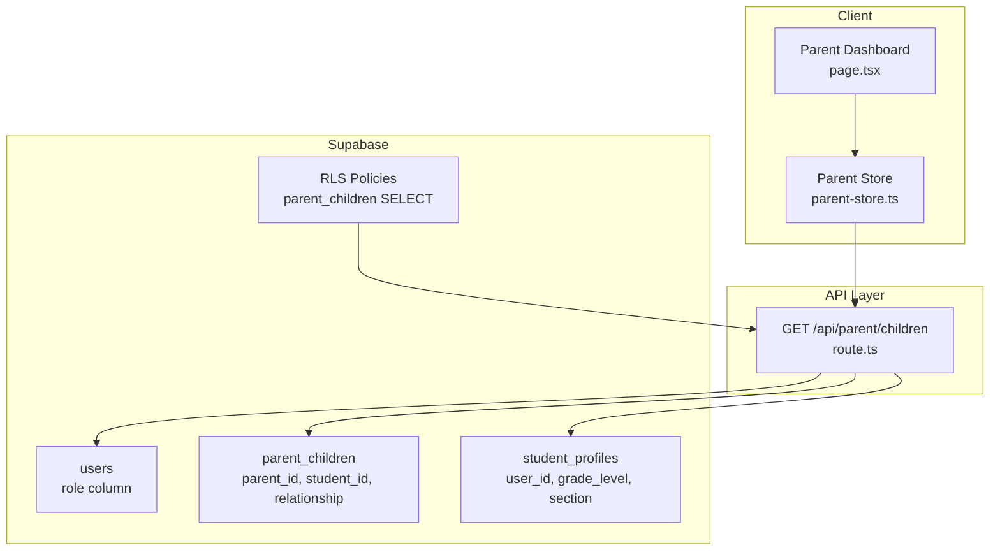
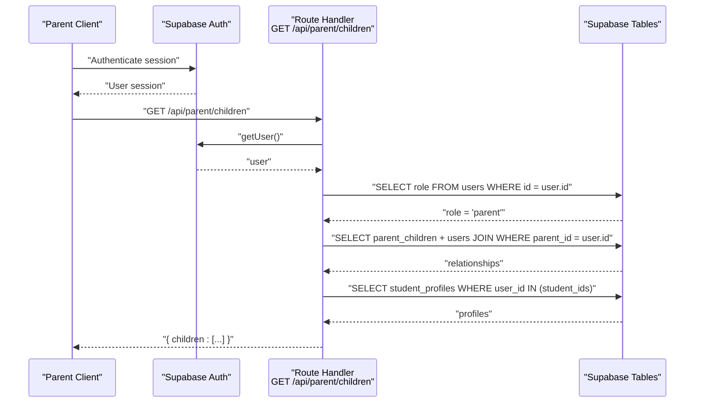
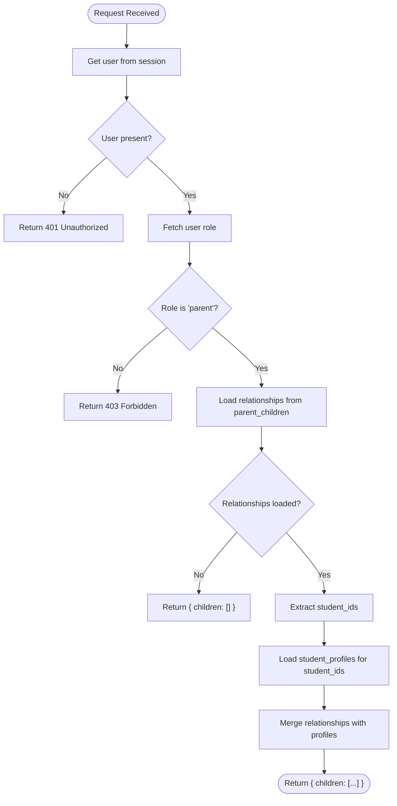
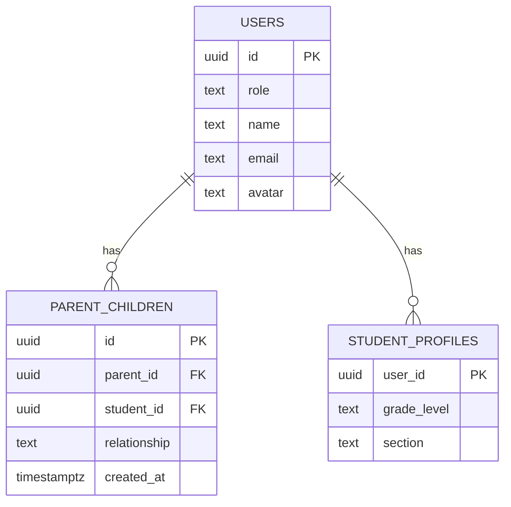
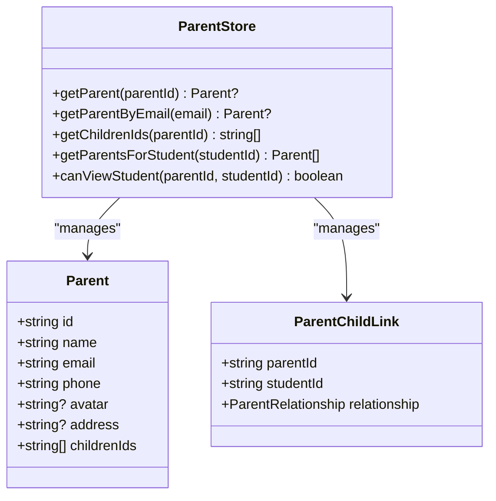
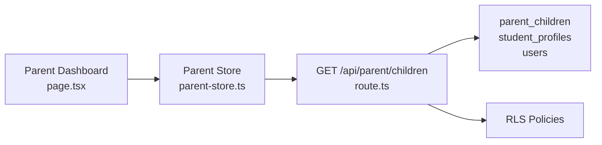

# Child Management

<cite>
**Referenced Files in This Document**
- [route.ts](file://app/api/parent/children/route.ts)
- [20260105000003_create_parent_tables.sql](file://supabase/migrations/20260105000003_create_parent_tables.sql)
- [20260105082250_create_parent_tables.sql](file://supabase/migrations/20260105082250_create_parent_tables.sql)
- [parent-store.ts](file://lib/parent-store.ts)
- [types.ts](file://lib/types.ts)
- [page.tsx](file://app/parent/page.tsx)
</cite>

## Table of Contents
1. [Introduction](#introduction)
2. [Project Structure](#project-structure)
3. [Core Components](#core-components)
4. [Architecture Overview](#architecture-overview)
5. [Detailed Component Analysis](#detailed-component-analysis)
6. [Dependency Analysis](#dependency-analysis)
7. [Performance Considerations](#performance-considerations)
8. [Troubleshooting Guide](#troubleshooting-guide)
9. [Conclusion](#conclusion)

## Introduction
This document describes the Parent Child Management endpoint that lists a logged-in parent’s children. It covers the HTTP GET method, authentication requirements (must be authenticated and have the parent role), response structure, implementation details, security enforcement via Supabase Row Level Security (RLS), and client-side integration patterns.

## Project Structure
The endpoint is implemented as a Next.js route under the API surface and backed by Supabase tables and policies. The client-side parent dashboard uses a store to manage parent-child relationships and display child information.

**Diagram sources**
- [route.ts](file://app/api/parent/children/route.ts#L1-L74)
- [20260105000003_create_parent_tables.sql](file://supabase/migrations/20260105000003_create_parent_tables.sql#L1-L53)
- [20260105082250_create_parent_tables.sql](file://supabase/migrations/20260105082250_create_parent_tables.sql#L1-L53)
- [parent-store.ts](file://lib/parent-store.ts#L1-L66)
- [page.tsx](file://app/parent/page.tsx#L1-L245)

**Section sources**
- [route.ts](file://app/api/parent/children/route.ts#L1-L74)
- [20260105000003_create_parent_tables.sql](file://supabase/migrations/20260105000003_create_parent_tables.sql#L1-L53)
- [20260105082250_create_parent_tables.sql](file://supabase/migrations/20260105082250_create_parent_tables.sql#L1-L53)
- [parent-store.ts](file://lib/parent-store.ts#L1-L66)
- [page.tsx](file://app/parent/page.tsx#L1-L245)

## Core Components
- Endpoint: GET /api/parent/children
- Authentication requirement: Must be authenticated and have role “parent”
- Authorization enforcement: Supabase RLS policy restricts access to rows where parent_id equals the authenticated user id
- Data sources:
  - parent_children: relationship records linking parent to children
  - users: child basic profile (id, name, email, avatar)
  - student_profiles: academic details (grade_level, section)

Response shape:
- children: array of objects with:
  - id, name, email, avatar
  - grade, section
  - relationship

**Section sources**
- [route.ts](file://app/api/parent/children/route.ts#L1-L74)
- [20260105000003_create_parent_tables.sql](file://supabase/migrations/20260105000003_create_parent_tables.sql#L1-L53)
- [20260105082250_create_parent_tables.sql](file://supabase/migrations/20260105082250_create_parent_tables.sql#L1-L53)
- [types.ts](file://lib/types.ts#L1-L28)

## Architecture Overview
The endpoint enforces role-based access and retrieves linked children with enriched academic details.

**Diagram sources**
- [route.ts](file://app/api/parent/children/route.ts#L1-L74)
- [20260105000003_create_parent_tables.sql](file://supabase/migrations/20260105000003_create_parent_tables.sql#L1-L53)
- [20260105082250_create_parent_tables.sql](file://supabase/migrations/20260105082250_create_parent_tables.sql#L1-L53)

## Detailed Component Analysis

### Endpoint: GET /api/parent/children
- Purpose: Return the authenticated parent’s children with basic profile and academic details.
- Authentication:
  - Requires a valid session; otherwise returns 401 Unauthorized.
  - Verifies user role is “parent”; otherwise returns 403 Forbidden.
- Authorization:
  - Uses Supabase RLS on parent_children to ensure the authenticated user can only access their own relationships.
- Data retrieval:
  - Joins parent_children with users to get child profile fields.
  - Fetches student_profiles to enrich with grade and section.
  - Merges relationship data with profile data to produce the response payload.
- Response:
  - children: array of child objects with id, name, email, avatar, grade, section, relationship.
  - Returns empty array when no relationships exist.

**Diagram sources**
- [route.ts](file://app/api/parent/children/route.ts#L1-L74)

**Section sources**
- [route.ts](file://app/api/parent/children/route.ts#L1-L74)

### Database Schema and RLS Policies
- parent_children table:
  - Columns: id, parent_id, student_id, relationship, created_at
  - Constraints: foreign keys to users, unique constraint on (parent_id, student_id)
- student_profiles table:
  - Columns: user_id, grade_level, section
- RLS policies:
  - parent_children: SELECT policy allows access only when parent_id equals auth.uid()
  - Additional policies enable parents to view related student data in grades, attendance_records, and class_students

**Diagram sources**
- [20260105000003_create_parent_tables.sql](file://supabase/migrations/20260105000003_create_parent_tables.sql#L1-L53)
- [20260105082250_create_parent_tables.sql](file://supabase/migrations/20260105082250_create_parent_tables.sql#L1-L53)

**Section sources**
- [20260105000003_create_parent_tables.sql](file://supabase/migrations/20260105000003_create_parent_tables.sql#L1-L53)
- [20260105082250_create_parent_tables.sql](file://supabase/migrations/20260105082250_create_parent_tables.sql#L1-L53)

### Client-Side Integration and State Management
- Parent Dashboard page:
  - Demonstrates a parent selecting a child from a list and displaying child analytics.
  - Uses a local store to manage parent and child relationships.
- Parent Store:
  - Provides selectors for retrieving children ids for a given parent id.
  - Utility to check if a parent can view a specific student.
- Practical example:
  - On dashboard load, the store is populated with children ids for the current parent.
  - The dashboard renders child information and analytics based on the selected child.

**Diagram sources**
- [parent-store.ts](file://lib/parent-store.ts#L1-L66)
- [types.ts](file://lib/types.ts#L1-L28)

**Section sources**
- [page.tsx](file://app/parent/page.tsx#L1-L245)
- [parent-store.ts](file://lib/parent-store.ts#L1-L66)
- [types.ts](file://lib/types.ts#L1-L28)

## Dependency Analysis
- Endpoint depends on:
  - Supabase client configured for server-side usage
  - Supabase tables: users, parent_children, student_profiles
  - Supabase RLS policies on parent_children and related tables
- Client-side depends on:
  - Parent Store for managing relationships and access checks
  - Dashboard page for rendering child selection and analytics

**Diagram sources**
- [route.ts](file://app/api/parent/children/route.ts#L1-L74)
- [20260105000003_create_parent_tables.sql](file://supabase/migrations/20260105000003_create_parent_tables.sql#L1-L53)
- [20260105082250_create_parent_tables.sql](file://supabase/migrations/20260105082250_create_parent_tables.sql#L1-L53)
- [parent-store.ts](file://lib/parent-store.ts#L1-L66)
- [page.tsx](file://app/parent/page.tsx#L1-L245)

**Section sources**
- [route.ts](file://app/api/parent/children/route.ts#L1-L74)
- [20260105000003_create_parent_tables.sql](file://supabase/migrations/20260105000003_create_parent_tables.sql#L1-L53)
- [20260105082250_create_parent_tables.sql](file://supabase/migrations/20260105082250_create_parent_tables.sql#L1-L53)
- [parent-store.ts](file://lib/parent-store.ts#L1-L66)
- [page.tsx](file://app/parent/page.tsx#L1-L245)

## Performance Considerations
- Indexes:
  - parent_children has indexes on parent_id and student_id to optimize lookups.
- Query patterns:
  - Single query to parent_children with a join to users to fetch child profile fields.
  - Single query to student_profiles using an IN clause on extracted student ids.
- Recommendations:
  - Keep the number of children manageable to minimize IN list size.
  - Consider pagination if a parent can have a very large number of children.

[No sources needed since this section provides general guidance]

## Troubleshooting Guide
Common error scenarios and resolutions:
- 401 Unauthorized:
  - Cause: Request sent without a valid session.
  - Resolution: Ensure the parent is logged in and the session is active.
- 403 Forbidden:
  - Cause: User is authenticated but role is not “parent”.
  - Resolution: Verify the user’s role is set to “parent” in the users table.
- Empty children list:
  - Cause: No relationships found for the authenticated parent.
  - Resolution: Confirm parent_children entries exist for the parent id.
- Internal server error (500):
  - Cause: Database errors during relationship or profile retrieval.
  - Resolution: Check Supabase logs and confirm tables and policies are correctly deployed.

**Section sources**
- [route.ts](file://app/api/parent/children/route.ts#L1-L74)
- [20260105000003_create_parent_tables.sql](file://supabase/migrations/20260105000003_create_parent_tables.sql#L1-L53)
- [20260105082250_create_parent_tables.sql](file://supabase/migrations/20260105082250_create_parent_tables.sql#L1-L53)

## Conclusion
The GET /api/parent/children endpoint securely returns a parent’s children with enriched academic details. Role verification and Supabase RLS ensure that only authorized parents can access their children’s data. The client-side parent dashboard integrates with a store to manage and render child information, enabling a practical parent dashboard experience.