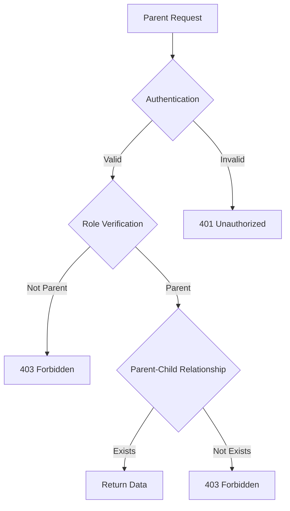

# Parent API Endpoints

<cite>
**Referenced Files in This Document**   
- [children/route.ts](file://app/api/parent/children/route.ts)
- [child/[id]/grades/route.ts](file://app/api/parent/child/[id]/grades/route.ts)
- [child/[id]/attendance/route.ts](file://app/api/parent/child/[id]/attendance/route.ts)
- [link-parent-child/route.ts](file://app/api/admin/link-parent-child/route.ts)
- [unlink-parent-child/route.ts](file://app/api/admin/unlink-parent-child/route.ts)
- [parent-store.ts](file://lib/parent-store.ts)
- [attendance-utils.ts](file://lib/attendance-utils.ts)
- [20251219044036_add_rls_policies.sql](file://supabase/migrations/20251219044036_add_rls_policies.sql)
- [20260107115657_tighten_rls_policies.sql](file://supabase/migrations/20260107115657_tighten_rls_policies.sql)
- [rate-limit.ts](file://lib/rate-limit.ts)
- [audit-logs.ts](file://lib/supabase/audit-logs.ts)
</cite>

## Table of Contents
1. [Introduction](#introduction)
2. [Parent-Child Relationship Management](#parent-child-relationship-management)
3. [Core Parent API Endpoints](#core-parent-api-endpoints)
4. [Security and Access Control](#security-and-access-control)
5. [State Management and Data Formatting](#state-management-and-data-formatting)
6. [Rate Limiting and Audit Logging](#rate-limiting-and-audit-logging)
7. [Conclusion](#conclusion)

## Introduction
The School-Management-System provides a dedicated API for parents to monitor their children's academic progress. This documentation details the parent-specific endpoints that enable guardians to retrieve linked children, view individual child's grades, and check attendance records. The system enforces strict security measures through role-based access control and Row Level Security (RLS) policies to ensure data privacy. All parent access is mediated through verified parent-child relationships managed by administrative endpoints.

**Section sources**
- [children/route.ts](file://app/api/parent/children/route.ts)
- [child/[id]/grades/route.ts](file://app/api/parent/child/[id]/grades/route.ts)
- [child/[id]/attendance/route.ts](file://app/api/parent/child/[id]/attendance/route.ts)

## Parent-Child Relationship Management
Parent access to student data is governed by explicit parent-child relationships established through administrative endpoints. These relationships are stored in the `parent_children` table and serve as the foundation for data access authorization.

### Link Parent-Child Endpoint
The `POST /api/admin/link-parent-child` endpoint allows administrators to establish a parent-child relationship.

**Endpoint Details:**
- **HTTP Method**: POST
- **URL Pattern**: `/api/admin/link-parent-child`
- **Authentication**: Admin role required
- **Request Body Parameters**:
  - `parentId` (string, required): The ID of the parent user
  - `studentId` (string, required): The ID of the student user
  - `relationship` (string, optional): Relationship type (mother, father, guardian, other)
- **Response Structure**: 
  - Success: `{ success: true }` with status 200
  - Error: `{ error: string }` with appropriate status code
- **Error Conditions**:
  - 400 Bad Request: Missing parentId or studentId, or duplicate relationship
  - 401 Unauthorized: User not authenticated
  - 403 Forbidden: User not an admin
  - 500 Internal Server Error: Database operation failure

**Section sources**
- [link-parent-child/route.ts](file://app/api/admin/link-parent-child/route.ts)

### Unlink Parent-Child Endpoint
The `POST /api/admin/unlink-parent-child` endpoint allows administrators to remove a parent-child relationship.

**Endpoint Details:**
- **HTTP Method**: POST
- **URL Pattern**: `/api/admin/unlink-parent-child`
- **Authentication**: Admin role required
- **Request Body Parameters**:
  - `parentId` (string, required): The ID of the parent user
  - `studentId` (string, required): The ID of the student user
- **Response Structure**: 
  - Success: `{ success: true }` with status 200
  - Error: `{ error: string }` with appropriate status code
- **Error Conditions**:
  - 400 Bad Request: Missing parentId or studentId
  - 401 Unauthorized: User not authenticated
  - 403 Forbidden: User not an admin
  - 500 Internal Server Error: Database operation failure

**Section sources**
- [unlink-parent-child/route.ts](file://app/api/admin/unlink-parent-child/route.ts)

## Core Parent API Endpoints
The parent API provides three primary endpoints for accessing student academic information. Each endpoint requires parent role authentication and verifies the parent-child relationship before returning data.

### Retrieve Linked Children
The `GET /api/parent/children` endpoint returns a list of all children linked to the authenticated parent.

**Endpoint Details:**
- **HTTP Method**: GET
- **URL Pattern**: `/api/parent/children`
- **Authentication**: Parent role required
- **Parameter Validation**: None (retrieves all linked children)
- **Response Structure**:
```json
{
  "children": [
    {
      "id": "string",
      "name": "string",
      "email": "string",
      "avatar": "string",
      "grade": "string",
      "section": "string",
      "relationship": "string"
    }
  ]
}
```
- **Error Conditions**:
  - 401 Unauthorized: User not authenticated
  - 403 Forbidden: User not a parent
  - 500 Internal Server Error: Database query failure

**Section sources**
- [children/route.ts](file://app/api/parent/children/route.ts)

### View Child's Grades
The `GET /api/parent/child/[id]/grades` endpoint returns all grades for a specific child.

**Endpoint Details:**
- **HTTP Method**: GET
- **URL Pattern**: `/api/parent/child/[id]/grades` where `[id]` is the student ID
- **Authentication**: Parent role required
- **Parameter Validation**: 
  - Path parameter `id` must be a valid student ID
  - Parent must have an established relationship with the student
- **Response Structure**:
```json
{
  "grades": [
    {
      "id": "string",
      "student_id": "string",
      "class_id": "string",
      "score": "number",
      "max_score": "number",
      "percentage": "number",
      "grade": "number",
      "type": "string",
      "date": "string",
      "class": {
        "id": "string",
        "name": "string",
        "subject": "string"
      },
      "teacher": {
        "id": "string",
        "name": "string"
      }
    }
  ]
}
```
- **Error Conditions**:
  - 401 Unauthorized: User not authenticated
  - 403 Forbidden: User not a parent or not authorized for this student
  - 500 Internal Server Error: Database query failure
- **Real-world Example**: `GET /api/parent/child/123/grades` returns recent grades for the child with ID 123

**Section sources**
- [child/[id]/grades/route.ts](file://app/api/parent/child/[id]/grades/route.ts)

### Check Attendance Records
The `GET /api/parent/child/[id]/attendance` endpoint returns attendance records for a specific child.

**Endpoint Details:**
- **HTTP Method**: GET
- **URL Pattern**: `/api/parent/child/[id]/attendance` where `[id]` is the student ID
- **Authentication**: Parent role required
- **Parameter Validation**: 
  - Path parameter `id` must be a valid student ID
  - Parent must have an established relationship with the student
  - Optional query parameters: `startDate` and `endDate` for date range filtering
- **Response Structure**:
```json
{
  "attendance": [
    {
      "id": "string",
      "student_id": "string",
      "class_id": "string",
      "date": "string",
      "status": "present|absent|late|excused",
      "class": {
        "id": "string",
        "name": "string",
        "subject": "string"
      }
    }
  ],
  "stats": {
    "present": "number",
    "absent": "number",
    "late": "number",
    "excused": "number",
    "total": "number",
    "rate": "number"
  }
}
```
- **Error Conditions**:
  - 401 Unauthorized: User not authenticated
  - 403 Forbidden: User not a parent or not authorized for this student
  - 500 Internal Server Error: Database query failure

**Section sources**
- [child/[id]/attendance/route.ts](file://app/api/parent/child/[id]/attendance/route.ts)

## Security and Access Control
The system implements robust security measures to protect student data and ensure parents can only access information for their linked children.

### Row Level Security (RLS) Policies
The Supabase database enforces Row Level Security policies that restrict data access based on user roles and relationships. Key policies include:

- **User Data Access**: Users can only read their own data (`auth.uid() = id`)
- **Parent-Child Verification**: Parent endpoints verify relationships through the `parent_children` table
- **Admin-Only Operations**: Linking and unlinking parent-child relationships require admin privileges

The RLS policies are defined in migration files such as `20251219044036_add_rls_policies.sql` and `20260107115657_tighten_rls_policies.sql`, which implement strict access controls and prevent unauthorized data access.



**Diagram sources**
- [20251219044036_add_rls_policies.sql](file://supabase/migrations/20251219044036_add_rls_policies.sql)
- [20260107115657_tighten_rls_policies.sql](file://supabase/migrations/20260107115657_tighten_rls_policies.sql)

**Section sources**
- [20251219044036_add_rls_policies.sql](file://supabase/migrations/20251219044036_add_rls_policies.sql)
- [20260107115657_tighten_rls_policies.sql](file://supabase/migrations/20260107115657_tighten_rls_policies.sql)

## State Management and Data Formatting
The frontend implements efficient state management and data formatting for parent-related functionality.

### Parent Store
The `parent-store.ts` file implements a Zustand store for managing parent-related state in the client application. It provides functions to:

- Retrieve parent information by ID or email
- Get children IDs for a specific parent
- Determine if a parent can view a particular student's data
- Manage parent-child links

The store maintains collections of parents and parent-child links, enabling efficient client-side lookups without repeated API calls.

**Section sources**
- [parent-store.ts](file://lib/parent-store.ts)

### Attendance Data Formatting
The `attendance-utils.ts` file contains utilities for processing and formatting attendance data. The `calculateAttendanceStats` function computes comprehensive statistics from attendance records:

- Counts of present, absent, late, and excused records
- Total number of attendance records
- Attendance rate percentage (calculated as present + late divided by total)

This utility is used by the attendance endpoint to provide summarized statistics along with detailed records.

```mermaid
function calculateAttendanceStats(records)
stats = { present: 0, absent: 0, late: 0, excused: 0, total: 0 }
for each record in records
increment corresponding status count
increment total
attendanceRate = (present + late) / total * 100
return { ...stats, rate: attendanceRate }
```

**Diagram sources**
- [attendance-utils.ts](file://lib/attendance-utils.ts)

**Section sources**
- [attendance-utils.ts](file://lib/attendance-utils.ts)

## Rate Limiting and Audit Logging
The system implements rate limiting and comprehensive audit logging for these sensitive data access points.

### Rate Limiting Implementation
The `rate-limit.ts` file provides rate limiting functionality using Supabase's service role key to bypass RLS policies. This ensures reliable rate limiting even during authentication issues. The system uses an atomic RPC function `check_rate_limit` to prevent race conditions and maintain accurate request counts.

Key features:
- Uses service role key for system-level access
- Implements atomic operations to prevent race conditions
- Configurable fail-open behavior for availability
- Tracks requests by identifier (user ID or IP) and endpoint

**Section sources**
- [rate-limit.ts](file://lib/rate-limit.ts)

### Audit Logging
The system maintains comprehensive audit logs for security monitoring and compliance. The `audit-logs.ts` file provides utilities for:

- Querying audit logs with filters and pagination
- Generating audit log statistics for dashboards
- Detecting suspicious activity patterns
- Exporting logs to CSV format

Audit logs capture critical events including data access, authentication attempts, and administrative actions, providing a complete audit trail for security investigations.

**Section sources**
- [audit-logs.ts](file://lib/supabase/audit-logs.ts)

## Conclusion
The parent API endpoints in the School-Management-System provide secure, role-based access to student academic information. The architecture combines frontend state management with backend security controls to ensure parents can monitor their children's progress while maintaining data privacy. Key components include parent-child relationship management, Row Level Security policies, rate limiting, and comprehensive audit logging. These endpoints follow RESTful principles and provide consistent response structures, making them easy to integrate into client applications.