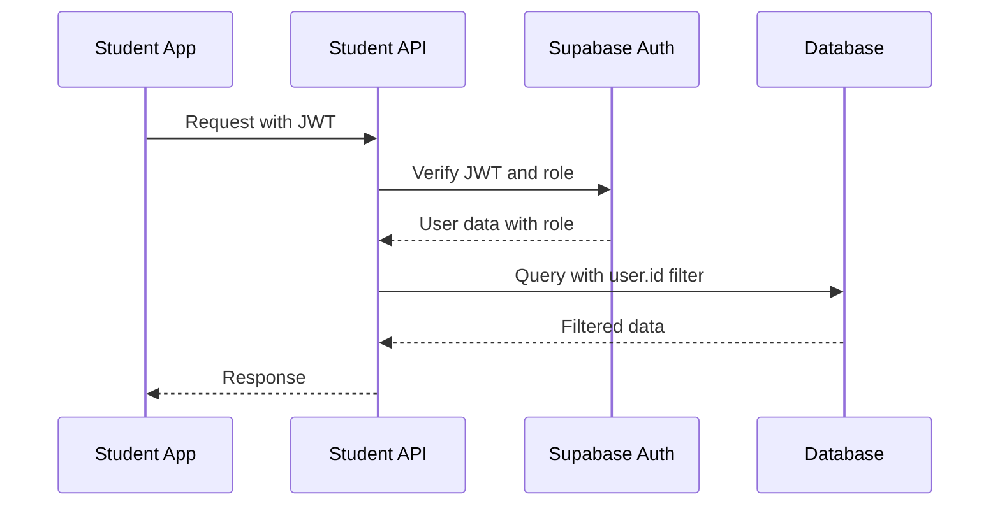
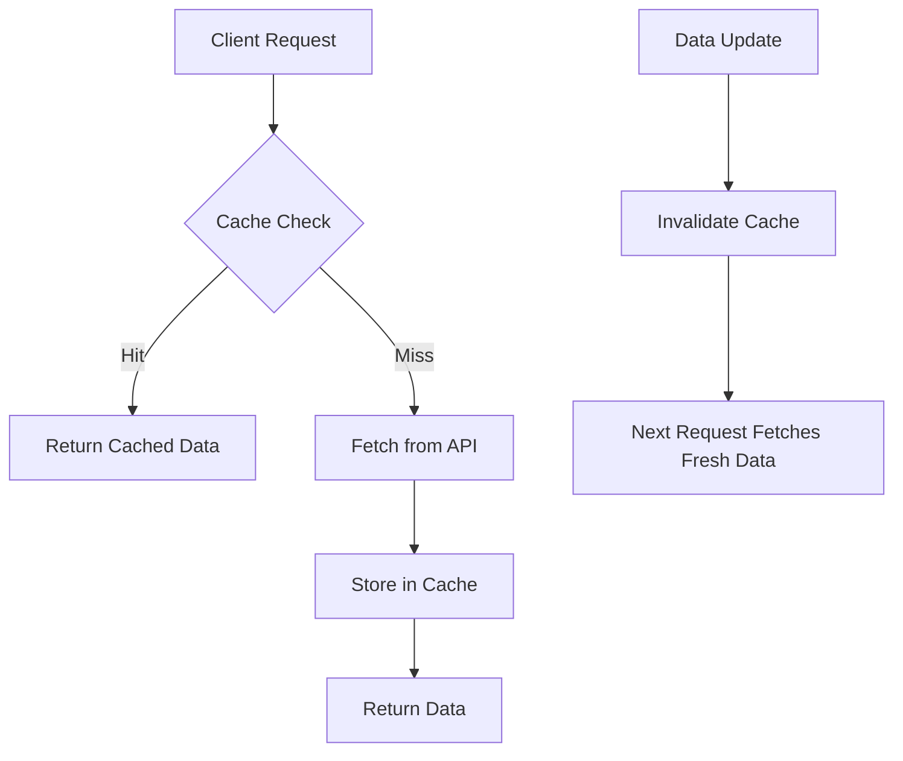
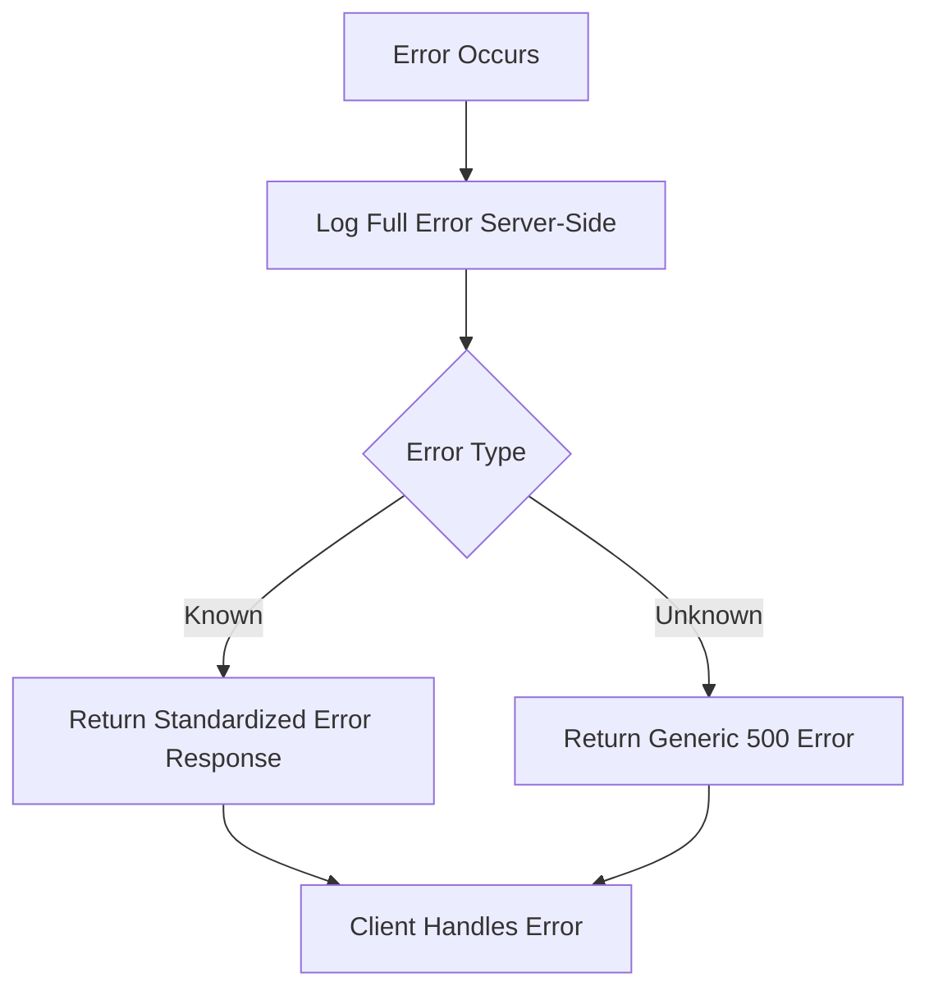

# Student API Endpoints

<cite>
**Referenced Files in This Document**   
- [announcements/route.ts](file://app/api/student/announcements/route.ts)
- [grades/route.ts](file://app/api/student/grades/route.ts)
- [schedule/route.ts](file://app/api/student/schedule/route.ts)
- [classes/route.ts](file://app/api/student/classes/route.ts)
- [check-in/route.ts](file://app/api/student/check-in/route.ts)
- [quizzes/route.ts](file://app/api/student/quizzes/route.ts)
- [start-quiz/route.ts](file://app/api/student/start-quiz/route.ts)
- [submit-quiz/route.ts](file://app/api/student/submit-quiz/route.ts)
- [lessons/route.ts](file://app/api/student/lessons/route.ts)
- [dashboard/route.ts](file://app/api/student/dashboard/route.ts)
- [cache.ts](file://lib/cache.ts)
- [api-errors.ts](file://lib/api-errors.ts)
- [security.ts](file://lib/security.ts)
- [rate-limit.ts](file://lib/rate-limit.ts)
- [qr-scanner.tsx](file://components/qr-scanner.tsx)
- [assignment-list.tsx](file://components/assignment-list.tsx)
</cite>

## Table of Contents
1. [Introduction](#introduction)
2. [Authentication and Security Model](#authentication-and-security-model)
3. [Endpoint Reference](#endpoint-reference)
   - [GET /api/student/announcements](#get-apistudentannouncements)
   - [GET /api/student/grades](#get-apistudentgrades)
   - [GET /api/student/schedule](#get-apistudentschedule)
   - [GET /api/student/classes](#get-apistudentclasses)
   - [POST /api/student/check-in](#post-apistudentcheck-in)
   - [GET /api/student/quizzes](#get-apistudentquizzes)
   - [POST /api/student/start-quiz](#post-apistudentstart-quiz)
   - [POST /api/student/submit-quiz](#post-apistudentsubmit-quiz)
   - [GET /api/student/lessons](#get-apistudentlessons)
   - [GET /api/student/dashboard](#get-apistudentdashboard)
4. [Usage Examples](#usage-examples)
5. [Security and Access Control](#security-and-access-control)
6. [Caching Strategy](#caching-strategy)
7. [Error Handling](#error-handling)
8. [Related UI Components](#related-ui-components)

## Introduction
This document provides comprehensive API documentation for student-facing endpoints in the School-Management-System. The API enables students to access their academic information, interact with learning materials, participate in quizzes, and check in for attendance. All endpoints enforce strict role-based access control and Row Level Security (RLS) policies to ensure students can only access their own data. The documentation covers request/response schemas, authentication requirements, potential errors, and usage examples for each endpoint.

## Authentication and Security Model
All student endpoints require authentication via JWT tokens managed by Supabase Auth. The system verifies the student role on each request to prevent privilege escalation. The security model implements multiple layers of protection:

1. **Role Verification**: Each request validates that the authenticated user has the "student" role
2. **Row Level Security (RLS)**: Database policies restrict data access to the authenticated student's records
3. **Rate Limiting**: Critical endpoints are protected against abuse with configurable limits
4. **Input Validation**: All inputs are sanitized to prevent injection attacks
5. **Origin Validation**: Requests are validated to ensure they originate from the authorized domain

The system uses Supabase's RLS policies to enforce data isolation at the database level, ensuring that even if an endpoint is compromised, students cannot access other students' data.

**Section sources**
- [security.ts](file://lib/security.ts#L68-L96)
- [api-errors.ts](file://lib/api-errors.ts#L17-L42)

## Endpoint Reference

### GET /api/student/announcements
Retrieves announcements targeted to the authenticated student based on their grade level and audience targeting.

**Request Parameters**
- None (uses authenticated user context)

**Response Schema**
```json
{
  "announcements": [
    {
      "id": "string",
      "title": "string",
      "content": "string",
      "target_audience": "string",
      "priority": "string",
      "created_at": "string",
      "author": {
        "name": "string"
      }
    }
  ]
}
```

**Authentication Requirements**
- Valid JWT token
- User role must be "student"

**Potential Errors**
- 401 Unauthorized: No valid authentication token
- 403 Forbidden: User does not have student role
- 500 Internal Server Error: Database or server error

**Section sources**
- [announcements/route.ts](file://app/api/student/announcements/route.ts#L4-L39)

### GET /api/student/grades
Retrieves the authenticated student's grades across all enrolled classes.

**Request Parameters**
- None (uses authenticated user context)

**Response Schema**
```json
{
  "grades": [
    {
      "id": "string",
      "class_id": "string",
      "type": "string",
      "score": "number",
      "max_score": "number",
      "percentage": "number",
      "grade": "string",
      "date": "string",
      "class": {
        "name": "string"
      }
    }
  ]
}
```

**Authentication Requirements**
- Valid JWT token
- User role must be "student"

**Potential Errors**
- 401 Unauthorized: No valid authentication token
- 403 Forbidden: User does not have student role
- 500 Internal Server Error: Database or server error

**Section sources**
- [grades/route.ts](file://app/api/student/grades/route.ts#L4-L40)

### GET /api/student/schedule
Retrieves the authenticated student's class schedule.

**Request Parameters**
- None (uses authenticated user context)

**Response Schema**
```json
{
  "schedule": [
    {
      "id": "string",
      "day": "string",
      "start_time": "string",
      "end_time": "string",
      "room": "string",
      "class_name": "string",
      "subject": "string",
      "teacher_name": "string"
    }
  ]
}
```

**Authentication Requirements**
- Valid JWT token
- User role must be "student"

**Potential Errors**
- 401 Unauthorized: No valid authentication token
- 403 Forbidden: User does not have student role
- 500 Internal Server Error: Database or server error

**Section sources**
- [schedule/route.ts](file://app/api/student/schedule/route.ts#L4-L64)

### GET /api/student/classes
Retrieves the classes the authenticated student is enrolled in, including teacher information and enrollment counts.

**Request Parameters**
- None (uses authenticated user context)

**Response Schema**
```json
{
  "classes": [
    {
      "id": "string",
      "name": "string",
      "subject": "string",
      "schedule": "string",
      "room": "string",
      "teacher_name": "string",
      "teacher_avatar": "string",
      "student_count": "number"
    }
  ]
}
```

**Authentication Requirements**
- Valid JWT token
- User role must be "student"

**Potential Errors**
- 401 Unauthorized: No valid authentication token
- 403 Forbidden: User does not have student role
- 500 Internal Server Error: Database or server error

**Section sources**
- [classes/route.ts](file://app/api/student/classes/route.ts#L4-L66)

### POST /api/student/check-in
Submits a QR code-based attendance check-in for the authenticated student.

**Request Parameters**
```json
{
  "qrData": "string",
  "latitude": "number",
  "longitude": "number"
}
```

**Response Schema**
```json
{
  "success": "boolean"
}
```

**Authentication Requirements**
- Valid JWT token
- User role must be "student"

**Potential Errors**
- 400 Bad Request: Invalid QR code format, expired QR code, or invalid GPS coordinates
- 401 Unauthorized: No valid authentication token
- 403 Forbidden: Network check failed, security violation, or not enrolled in class
- 409 Conflict: Already checked in
- 429 Too Many Requests: Rate limit exceeded
- 500 Internal Server Error: Database or server error

**Section sources**
- [check-in/route.ts](file://app/api/student/check-in/route.ts#L23-L237)

### GET /api/student/quizzes
Retrieves published quizzes for the classes the authenticated student is enrolled in.

**Request Parameters**
- None (uses authenticated user context)

**Response Schema**
```json
{
  "quizzes": [
    {
      "id": "string",
      "title": "string",
      "description": "string",
      "duration": "number",
      "due_date": "string",
      "teacher_id": "string",
      "class_id": "string",
      "class": {
        "name": "string"
      }
    }
  ]
}
```

**Authentication Requirements**
- Valid JWT token
- User role must be "student"

**Potential Errors**
- 401 Unauthorized: No valid authentication token
- 403 Forbidden: User does not have student role
- 500 Internal Server Error: Database or server error

**Section sources**
- [quizzes/route.ts](file://app/api/student/quizzes/route.ts#L4-L43)

### POST /api/student/start-quiz
Initiates a quiz attempt for the authenticated student.

**Request Parameters**
```json
{
  "quizId": "string"
}
```

**Response Schema**
```json
{
  "success": "boolean",
  "attemptId": "string",
  "questions": [
    {
      "id": "string",
      "question": "string",
      "type": "string",
      "options": "array",
      "points": "number"
    }
  ]
}
```

**Authentication Requirements**
- Valid JWT token
- User role must be "student"

**Potential Errors**
- 400 Bad Request: Quiz ID required or quiz not available
- 401 Unauthorized: No valid authentication token
- 403 Forbidden: Not enrolled in class
- 409 Conflict: Quiz already submitted
- 429 Too Many Requests: Rate limit exceeded
- 500 Internal Server Error: Database or server error

**Section sources**
- [start-quiz/route.ts](file://app/api/student/start-quiz/route.ts#L7-L122)

### POST /api/student/submit-quiz
Submits answers for a quiz attempt by the authenticated student.

**Request Parameters**
```json
{
  "quizId": "string",
  "answers": [
    {
      "questionId": "string",
      "answer": "string"
    }
  ],
  "activityLog": {
    "tabSwitches": "number",
    "copyPasteCount": "number",
    "exitAttempts": "number"
  }
}
```

**Response Schema**
```json
{
  "success": "boolean",
  "score": "number",
  "maxScore": "number",
  "percentage": "number",
  "needsGrading": "boolean"
}
```

**Authentication Requirements**
- Valid JWT token
- User role must be "student"

**Potential Errors**
- 400 Bad Request: Invalid submission data or quiz attempt not started
- 401 Unauthorized: No valid authentication token
- 403 Forbidden: User does not have student role
- 404 Not Found: Quiz not found
- 409 Conflict: Quiz already submitted
- 429 Too Many Requests: Rate limit exceeded
- 500 Internal Server Error: Database or server error

**Section sources**
- [submit-quiz/route.ts](file://app/api/student/submit-quiz/route.ts#L5-L170)

### GET /api/student/lessons
Retrieves lessons for the classes the authenticated student is enrolled in.

**Request Parameters**
- None (uses authenticated user context)

**Response Schema**
```json
{
  "lessons": [
    {
      "id": "string",
      "title": "string",
      "description": "string",
      "content": "string",
      "class_name": "string",
      "teacher_name": "string",
      "materials": [
        {
          "id": "string",
          "name": "string",
          "type": "string",
          "url": "string",
          "size": "string"
        }
      ]
    }
  ]
}
```

**Authentication Requirements**
- Valid JWT token
- User role must be "student"

**Potential Errors**
- 401 Unauthorized: No valid authentication token
- 403 Forbidden: User does not have student role
- 500 Internal Server Error: Database or server error

**Section sources**
- [lessons/route.ts](file://app/api/student/lessons/route.ts#L4-L67)

### GET /api/student/dashboard
Retrieves dashboard data for the authenticated student, including classes, schedule, grades, and attendance rate.

**Request Parameters**
- None (uses authenticated user context)

**Response Schema**
```json
{
  "userName": "string",
  "classes": [
    {
      "id": "string",
      "name": "string",
      "subject": "string",
      "schedule": "string",
      "room": "string",
      "teacher_name": "string"
    }
  ],
  "todaySchedule": [
    {
      "id": "string",
      "start_time": "string",
      "end_time": "string",
      "room": "string",
      "class_name": "string",
      "teacher_name": "string"
    }
  ],
  "grades": [
    {
      "id": "string",
      "class_name": "string",
      "type": "string",
      "score": "number",
      "max_score": "number",
      "grade": "string"
    }
  ],
  "attendanceRate": "number"
}
```

**Authentication Requirements**
- Valid JWT token
- User role must be "student"

**Potential Errors**
- 401 Unauthorized: No valid authentication token
- 403 Forbidden: User does not have student role
- 500 Internal Server Error: Database or server error

**Section sources**
- [dashboard/route.ts](file://app/api/student/dashboard/route.ts#L4-L117)

## Usage Examples

### Starting a Quiz Attempt
To initiate a quiz attempt, send a POST request to the start-quiz endpoint:

```javascript
fetch('/api/student/start-quiz', {
  method: 'POST',
  headers: {
    'Content-Type': 'application/json',
    'Authorization': 'Bearer ' + token
  },
  body: JSON.stringify({
    quizId: 'quiz-123'
  })
})
.then(response => response.json())
.then(data => {
  // Handle quiz questions and attemptId
  console.log('Quiz started:', data.attemptId);
  displayQuizQuestions(data.questions);
});
```

### Submitting Attendance via QR Code
To submit attendance using a QR code scanner:

```javascript
// After scanning QR code with qr-scanner.tsx
function submitCheckIn(qrData, latitude, longitude) {
  fetch('/api/student/check-in', {
    method: 'POST',
    headers: {
      'Content-Type': 'application/json',
      'Authorization': 'Bearer ' + token
    },
    body: JSON.stringify({
      qrData: qrData,
      latitude: latitude,
      longitude: longitude
    })
  })
  .then(response => response.json())
  .then(data => {
    if (data.success) {
      showSuccess('Attendance recorded');
    } else {
      showError('Check-in failed');
    }
  });
}
```

## Security and Access Control
The system implements a robust security model to protect student data and prevent unauthorized access:

1. **Row Level Security (RLS)**: All database queries include filters that restrict data to the authenticated student's records. For example, when retrieving grades, the query includes `.eq("student_id", user.id)` to ensure only the student's grades are returned.

2. **Role-Based Access Control**: Each request verifies the user's role to prevent privilege escalation. Endpoints check that the authenticated user has the "student" role before processing the request.

3. **IDOR Prevention**: The system prevents Insecure Direct Object References by validating that students are authorized to access specific resources. For example, when starting a quiz, the system verifies the student is enrolled in the class associated with the quiz.

4. **Rate Limiting**: Critical endpoints are protected against abuse with rate limiting. The check-in and quiz submission endpoints limit requests to prevent automated abuse.

5. **Input Validation**: All inputs are validated and sanitized to prevent injection attacks and ensure data integrity.

6. **Origin Validation**: Requests are validated to ensure they originate from the authorized domain, preventing CSRF attacks.



**Diagram sources**
- [security.ts](file://lib/security.ts#L68-L96)
- [api-errors.ts](file://lib/api-errors.ts#L17-L42)

**Section sources**
- [security.ts](file://lib/security.ts#L68-L96)
- [api-errors.ts](file://lib/api-errors.ts#L17-L42)

## Caching Strategy
The system implements a multi-layer caching strategy to improve performance and reduce database load:

1. **Client-Side Caching**: Uses in-memory caching with a 30-second TTL to prevent duplicate API calls within a short time window.

2. **Server-Side Caching**: Leverages Next.js `unstable_cache` for automatic revalidation of frequently accessed data like dashboard information.

3. **Cache Tags**: Implements cache tagging to enable targeted invalidation when data changes.

4. **Revalidation**: Configures appropriate revalidation intervals based on data volatility:
   - Dashboard data: 60 seconds
   - Student lists: 120 seconds
   - Class lists: 180 seconds

The caching system balances performance with data freshness, ensuring users receive timely updates while minimizing server load.



**Diagram sources**
- [cache.ts](file://lib/cache.ts#L6-L128)

**Section sources**
- [cache.ts](file://lib/cache.ts#L6-L128)

## Error Handling
The system implements consistent error handling patterns to provide a reliable client experience:

1. **Centralized Error Handler**: Uses `handleApiError` to process all errors, preventing information disclosure by not exposing raw error messages to clients.

2. **Standardized Error Responses**: Returns consistent error formats with clear messages and appropriate HTTP status codes.

3. **Server-Side Logging**: Logs full error details server-side for debugging while returning generic messages to clients.

4. **Common Error Types**: Predefined error responses for common scenarios like unauthorized access, forbidden operations, and rate limiting.

5. **Validation Error Handling**: Sanitizes inputs and returns specific validation errors when appropriate.

The error handling system ensures that clients receive meaningful feedback while protecting system internals from exposure.



**Diagram sources**
- [api-errors.ts](file://lib/api-errors.ts#L21-L116)

**Section sources**
- [api-errors.ts](file://lib/api-errors.ts#L21-L116)

## Related UI Components
The student API endpoints are consumed by several UI components that provide the student interface:

### qr-scanner.tsx
Implements a QR code scanner for attendance check-in. The component:
- Uses the html5-qrcode library to scan QR codes
- Provides both camera scanning and manual input options
- Handles camera permissions and device errors
- Integrates with the /api/student/check-in endpoint

**Section sources**
- [qr-scanner.tsx](file://components/qr-scanner.tsx#L1-L161)

### assignment-list.tsx
Displays a list of assignments for a student with submission capabilities. The component:
- Shows assignment details, due dates, and submission status
- Provides a dialog for submitting assignments with file uploads
- Displays submission history and teacher feedback
- Integrates with the assignment submission system

**Section sources**
- [assignment-list.tsx](file://components/assignment-list.tsx#L1-L271)