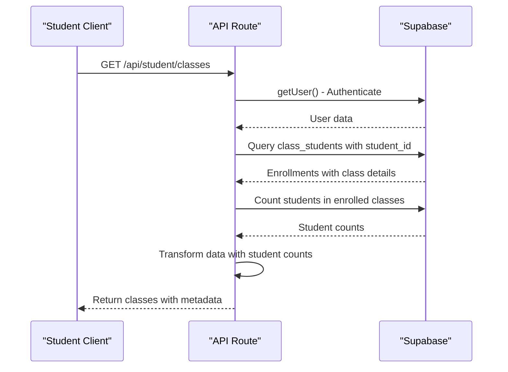
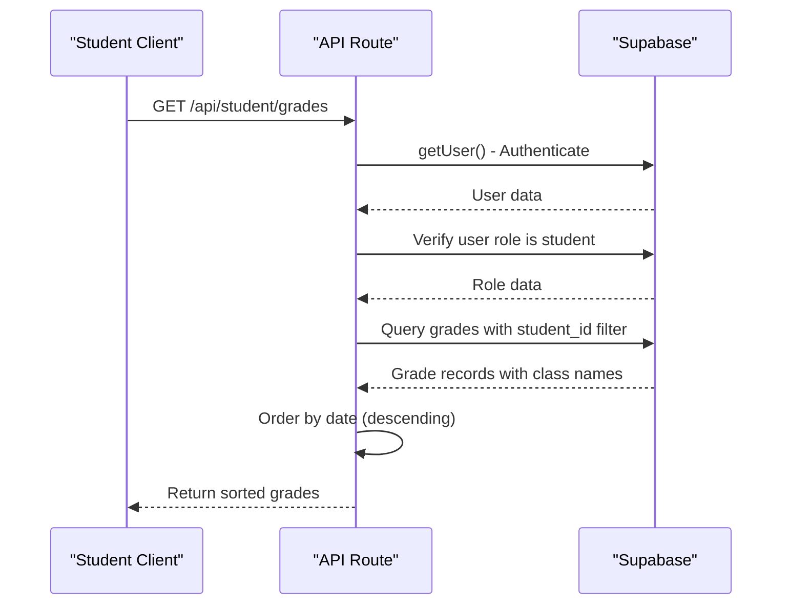
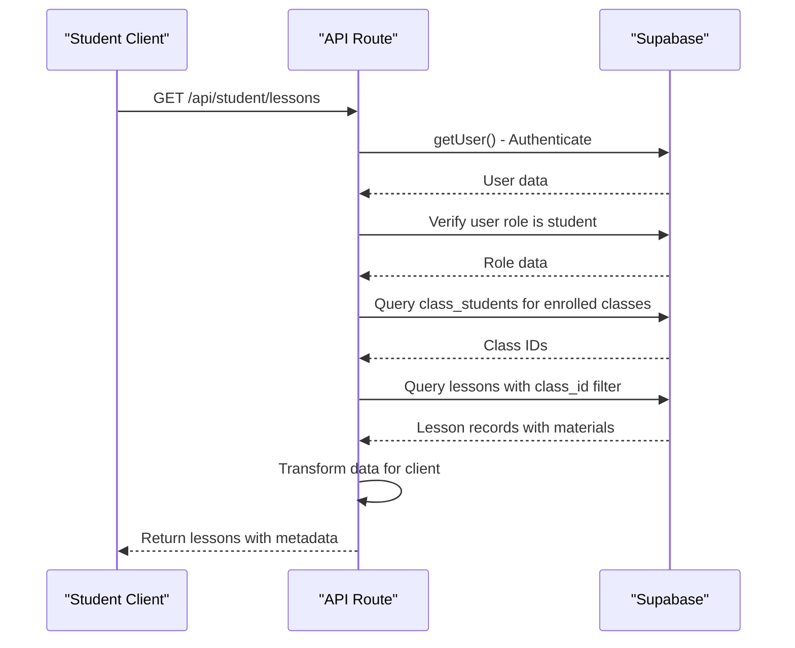
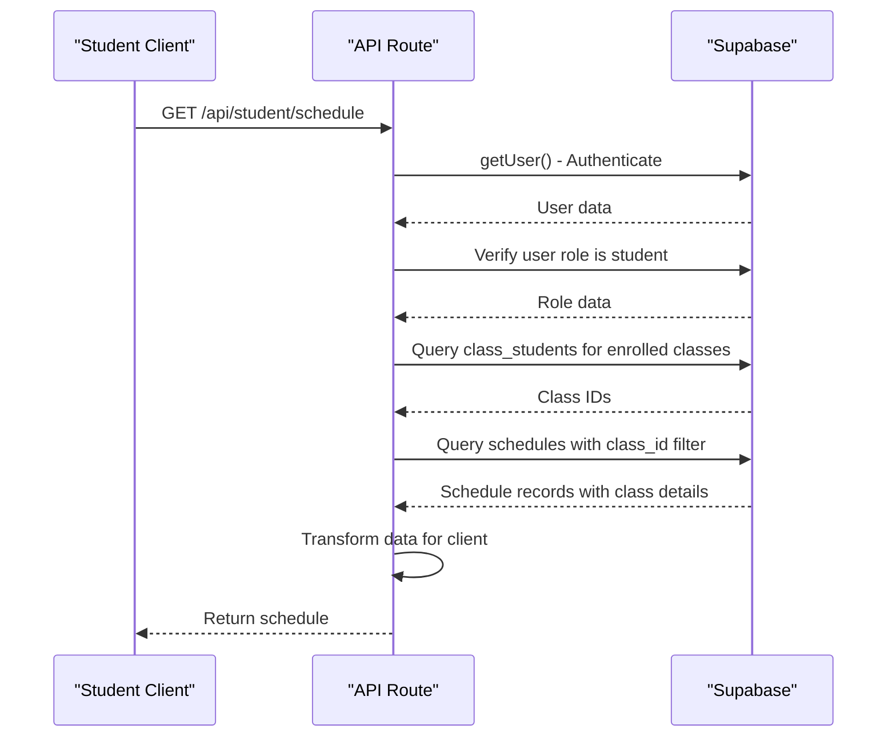
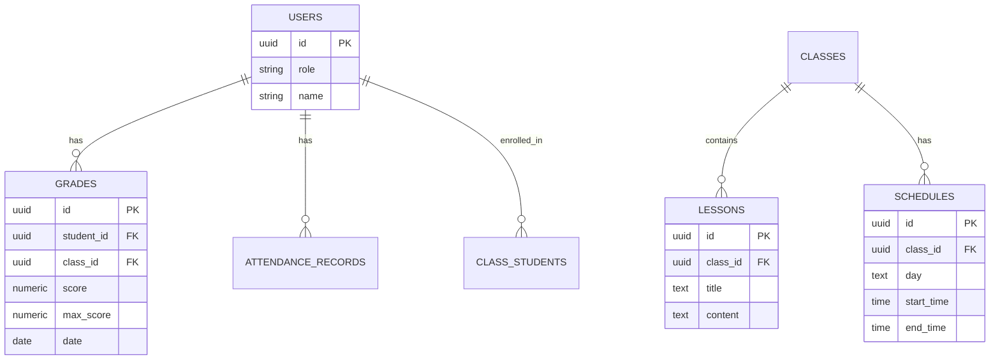
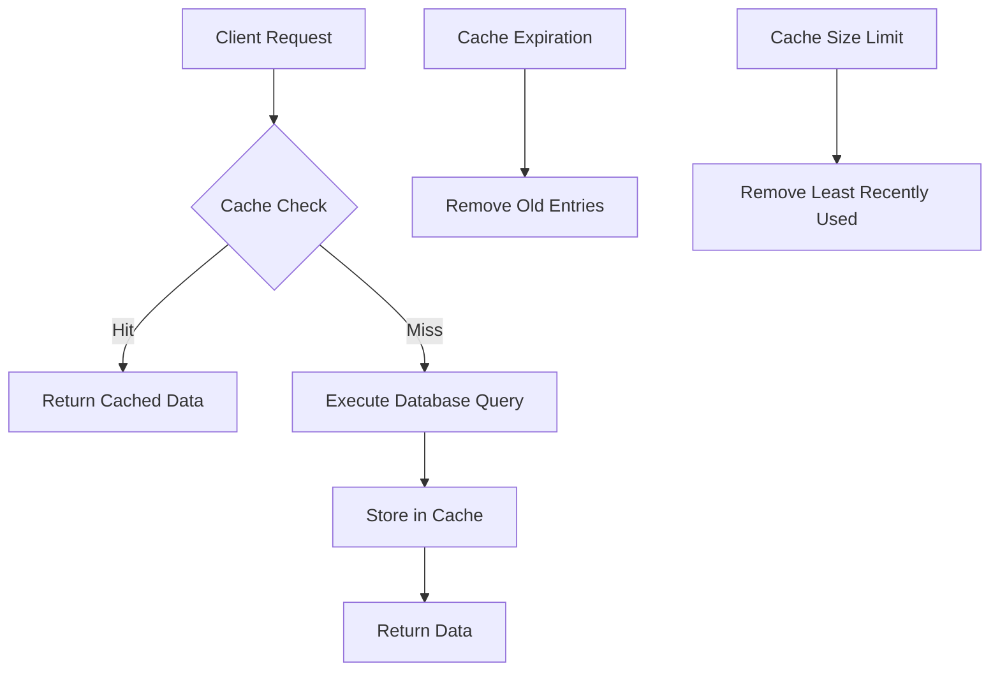
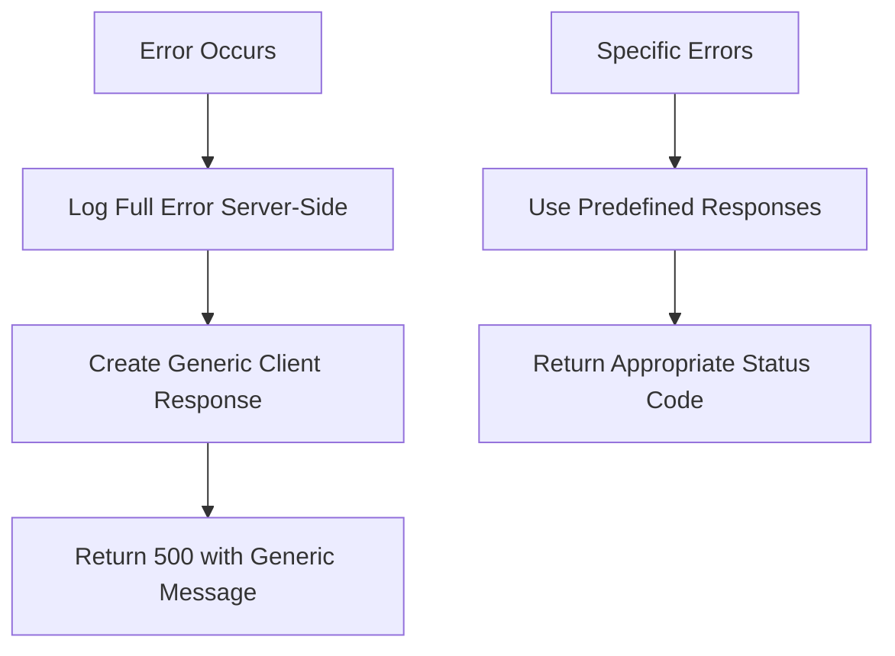
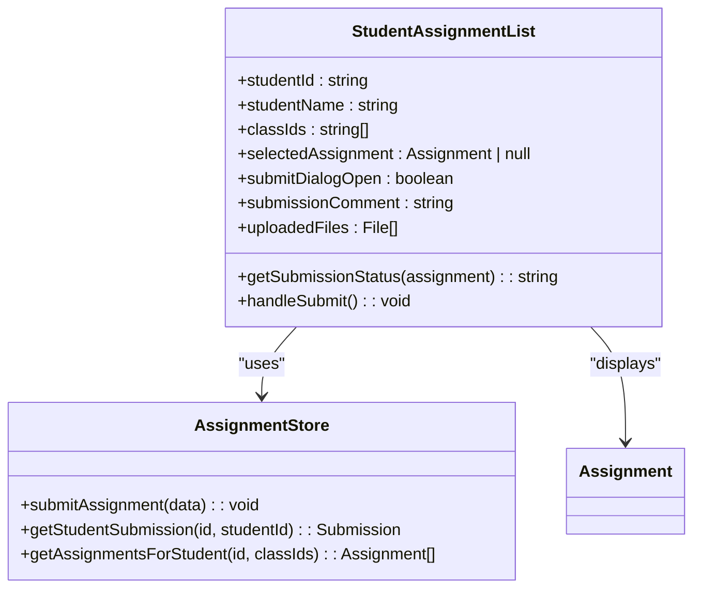

# Student Academic Access API

<cite>
**Referenced Files in This Document**   
- [classes/route.ts](file://app/api/student/classes/route.ts)
- [grades/route.ts](file://app/api/student/grades/route.ts)
- [lessons/route.ts](file://app/api/student/lessons/route.ts)
- [schedule/route.ts](file://app/api/student/schedule/route.ts)
- [grade-weights-store.ts](file://lib/grade-weights-store.ts)
- [cache.ts](file://lib/cache.ts)
- [api-errors.ts](file://lib/api-errors.ts)
- [queries.ts](file://lib/supabase/queries.ts)
- [assignment-list.tsx](file://components/assignment-list.tsx)
- [calendar-view.tsx](file://components/calendar-view.tsx)
- [20240101000000_secure_rls.sql](file://supabase/migrations/20240101000000_secure_rls.sql)
- [20251219043509_create_grades_tables.sql](file://supabase/migrations/20251219043509_create_grades_tables.sql)
- [20251219043541_create_lessons_tables.sql](file://supabase/migrations/20251219043541_create_lessons_tables.sql)
- [20251219043556_create_schedule_table.sql](file://supabase/migrations/20251219043556_create_schedule_table.sql)
</cite>

## Table of Contents
1. [Introduction](#introduction)
2. [Core Endpoints](#core-endpoints)
3. [Response Structures](#response-structures)
4. [Data Isolation and Security](#data-isolation-and-security)
5. [Caching Strategy](#caching-strategy)
6. [Error Handling](#error-handling)
7. [UI Integration](#ui-integration)
8. [Usage Examples](#usage-examples)
9. [Conclusion](#conclusion)

## Introduction
The Student Academic Access API provides secure endpoints for students to retrieve their academic data, including enrolled classes, performance grades, lesson materials, and daily/weekly schedules. This API enforces strict data isolation through Row Level Security (RLS) policies, ensuring students can only access their own records. The endpoints are optimized with caching strategies to reduce database load and improve response times.

The API is built on Next.js with Supabase as the backend, leveraging server-side rendering and authentication. All endpoints validate the user's role to ensure only students can access academic data. The response structures are designed to provide comprehensive information while maintaining performance through selective field inclusion.

**Section sources**
- [classes/route.ts](file://app/api/student/classes/route.ts#L1-L66)
- [grades/route.ts](file://app/api/student/grades/route.ts#L1-L40)

## Core Endpoints
The API provides four primary endpoints for student academic data access:

### GET /api/student/classes
Retrieves all classes in which the authenticated student is enrolled. The response includes class details such as name, subject, schedule, room, and teacher information. Additionally, it provides the student count for each class.



**Diagram sources**
- [classes/route.ts](file://app/api/student/classes/route.ts#L1-L66)

**Section sources**
- [classes/route.ts](file://app/api/student/classes/route.ts#L1-L66)

### GET /api/student/grades
Retrieves all grades for the authenticated student across all enrolled classes. The response includes detailed grade information such as score, maximum score, percentage, grade value, date, and associated class name. Grades are ordered by date in descending order to show the most recent first.



**Diagram sources**
- [grades/route.ts](file://app/api/student/grades/route.ts#L1-L40)

**Section sources**
- [grades/route.ts](file://app/api/student/grades/route.ts#L1-L40)

### GET /api/student/lessons
Retrieves all lessons for classes in which the authenticated student is enrolled. The response includes lesson details such as title, description, content, class name, teacher name, and associated materials. Lessons are ordered by creation date in descending order.



**Diagram sources**
- [lessons/route.ts](file://app/api/student/lessons/route.ts#L1-L67)

**Section sources**
- [lessons/route.ts](file://app/api/student/lessons/route.ts#L1-L67)

### GET /api/student/schedule
Retrieves the schedule for all classes in which the authenticated student is enrolled. The response includes schedule details such as day, start time, end time, room, class name, subject, and teacher name. Results are ordered by day and start time.



**Diagram sources**
- [schedule/route.ts](file://app/api/student/schedule/route.ts#L1-L64)

**Section sources**
- [schedule/route.ts](file://app/api/student/schedule/route.ts#L1-L64)

## Response Structures
The API returns structured JSON responses with consistent formatting across endpoints.

### Classes Response Structure
```json
{
  "classes": [
    {
      "id": "string",
      "name": "string",
      "subject": "string",
      "schedule": "string",
      "room": "string",
      "teacher_name": "string",
      "teacher_avatar": "string",
      "student_count": "number"
    }
  ]
}
```

The classes endpoint returns an array of class objects containing essential information for student enrollment. The student_count field is calculated server-side by querying the class_students table for each enrolled class.

**Section sources**
- [classes/route.ts](file://app/api/student/classes/route.ts#L46-L58)

### Grades Response Structure
```json
{
  "grades": [
    {
      "id": "string",
      "class_id": "string",
      "type": "string",
      "score": "number",
      "max_score": "number",
      "percentage": "number",
      "grade": "number",
      "date": "string",
      "class": {
        "name": "string"
      }
    }
  ]
}
```

The grades endpoint returns an array of grade objects with detailed assessment information. The grade breakdown includes weights from the grade-weights-store.ts configuration, which defines default weight distributions for different assessment types.

**Section sources**
- [grades/route.ts](file://app/api/student/grades/route.ts#L27-L31)
- [grade-weights-store.ts](file://lib/grade-weights-store.ts#L10-L15)

### Lessons Response Structure
```json
{
  "lessons": [
    {
      "id": "string",
      "title": "string",
      "description": "string",
      "content": "string",
      "class_name": "string",
      "teacher_name": "string",
      "materials": [
        {
          "id": "string",
          "name": "string",
          "type": "string",
          "url": "string",
          "size": "string"
        }
      ]
    }
  ]
}
```

The lessons endpoint returns an array of lesson objects with associated materials. The materials array contains metadata about lesson resources, including type (pdf, video, link, document), URL, and size.

**Section sources**
- [lessons/route.ts](file://app/api/student/lessons/route.ts#L39-L44)
- [20251219043541_create_lessons_tables.sql](file://supabase/migrations/20251219043541_create_lessons_tables.sql#L1-L23)

### Schedule Response Structure
```json
{
  "schedule": [
    {
      "id": "string",
      "day": "string",
      "start_time": "string",
      "end_time": "string",
      "room": "string",
      "class_name": "string",
      "subject": "string",
      "teacher_name": "string"
    }
  ]
}
```

The schedule endpoint returns an array of schedule objects with time and location information. The day field uses full day names (Monday, Tuesday, etc.), while start_time and end_time use 24-hour format.

**Section sources**
- [schedule/route.ts](file://app/api/student/schedule/route.ts#L39-L42)
- [20251219043556_create_schedule_table.sql](file://supabase/migrations/20251219043556_create_schedule_table.sql#L1-L11)

## Data Isolation and Security
The API enforces strict data isolation through Row Level Security (RLS) policies in Supabase, ensuring students can only access their own academic records.

### RLS Policy Implementation
The system implements multiple RLS policies to protect sensitive data:



**Diagram sources**
- [20240101000000_secure_rls.sql](file://supabase/migrations/20240101000000_secure_rls.sql#L40-L44)
- [20251219043509_create_grades_tables.sql](file://supabase/migrations/20251219043509_create_grades_tables.sql#L1-L47)

### Security Measures
The API implements multiple security layers:

1. **Authentication**: All endpoints verify the user's authentication status using Supabase auth.getUser()
2. **Role Verification**: Endpoints validate that the authenticated user has the "student" role
3. **Data Filtering**: Server-side queries include strict filters (e.g., .eq("student_id", user.id))
4. **RLS Enforcement**: Database policies prevent unauthorized access even if application logic is bypassed

The RLS policy "Students view own grades" specifically ensures that students can only access grades where the student_id matches their user ID:

```sql
CREATE POLICY "Students view own grades" ON grades
  FOR SELECT USING (student_id = auth.uid());
```

This policy is enforced at the database level, providing an additional security layer beyond application-level filtering.

**Section sources**
- [classes/route.ts](file://app/api/student/classes/route.ts#L7-L11)
- [grades/route.ts](file://app/api/student/grades/route.ts#L14-L22)
- [20240101000000_secure_rls.sql](file://supabase/migrations/20240101000000_secure_rls.sql#L42-L44)

## Caching Strategy
The API implements a comprehensive caching strategy to reduce database load and improve response times.

### Cache Implementation
The caching system is implemented in lib/cache.ts and provides both in-memory and server-side caching:



**Diagram sources**
- [cache.ts](file://lib/cache.ts#L6-L39)

**Section sources**
- [cache.ts](file://lib/cache.ts#L6-L39)

### Cache Configuration
The caching system uses the following parameters:

- **TTL**: 30 seconds for in-memory cache
- **Max Size**: 100 entries before cleanup
- **Cleanup Strategy**: Remove 50 oldest entries when limit is exceeded

The `cachedQuery` function provides a generic interface for caching queries:

```typescript
export async function cachedQuery<T>(
  key: string,
  queryFn: () => Promise<T>,
  ttl = CACHE_TTL
): Promise<T>
```

This function checks if data exists in the cache and is still valid based on the TTL. If valid, it returns the cached data; otherwise, it executes the query function, stores the result, and returns it.

**Section sources**
- [cache.ts](file://lib/cache.ts#L16-L39)

## Error Handling
The API implements robust error handling to ensure secure and consistent responses.

### Error Handling Architecture
The error handling system is centralized in lib/api-errors.ts and follows security best practices:



**Diagram sources**
- [api-errors.ts](file://lib/api-errors.ts#L21-L42)

**Section sources**
- [api-errors.ts](file://lib/api-errors.ts#L21-L42)

### Error Response Types
The API uses the ApiErrors object to provide consistent error responses:

- **Unauthorized (401)**: When user is not authenticated
- **Forbidden (403)**: When user lacks required role
- **Not Found (404)**: When requested resource doesn't exist
- **Bad Request (400)**: When request parameters are invalid
- **Rate Limited (429)**: When rate limits are exceeded

All error messages are generic to prevent information disclosure, with detailed error information logged server-side only.

**Section sources**
- [api-errors.ts](file://lib/api-errors.ts#L59-L69)
- [classes/route.ts](file://app/api/student/classes/route.ts#L10-L11)
- [grades/route.ts](file://app/api/student/grades/route.ts#L20-L22)

## UI Integration
The API data is consumed by various UI components to provide a comprehensive student experience.

### Assignment List Component
The assignment-list.tsx component displays assignments and allows submission:



**Diagram sources**
- [assignment-list.tsx](file://components/assignment-list.tsx#L40-L271)

**Section sources**
- [assignment-list.tsx](file://components/assignment-list.tsx#L40-L271)

### Calendar View Component
The calendar-view.tsx component displays academic events in a calendar format:

```mermaid
classDiagram
class CalendarView {
+currentDate : Date
+selectedDate : Date | null
+showEventDialog : boolean
+events : CalendarEvent[]
+loading : boolean
+saving : boolean
+newEvent : EventData
+fetchEvents() : Promise~void~
+handleCreateEvent() : Promise~void~
+handleExportEvent(event) : void
}
class CalendarEvent {
+id : string
+title : string
+description : string
+type : string
+start_date : string
+end_date : string
+start_time : string
+end_time : string
+all_day : boolean
+location : string
+class : ClassRef
+target_audience : string
}
CalendarView --> CalendarEvent : "displays"
CalendarView --> "API" : "fetches events"
```

**Diagram sources**
- [calendar-view.tsx](file://components/calendar-view.tsx#L46-L497)

**Section sources**
- [calendar-view.tsx](file://components/calendar-view.tsx#L46-L497)

## Usage Examples
The following examples demonstrate common use cases for the API endpoints.

### Fetching Enrolled Classes
To retrieve a student's enrolled classes:

```javascript
fetch('/api/student/classes', {
  headers: {
    'Authorization': 'Bearer ' + token
  }
})
.then(response => response.json())
.then(data => {
  // Process classes array
  data.classes.forEach(cls => {
    console.log(`${cls.name} - ${cls.teacher_name}`);
  });
});
```

This request returns all classes the student is enrolled in, including teacher information and student count.

**Section sources**
- [classes/route.ts](file://app/api/student/classes/route.ts#L1-L66)

### Viewing Grade History
To retrieve a student's grade history:

```javascript
fetch('/api/student/grades', {
  headers: {
    'Authorization': 'Bearer ' + token
  }
})
.then(response => response.json())
.then(data => {
  // Process grades array
  const recentGrades = data.grades.slice(0, 5);
  recentGrades.forEach(grade => {
    console.log(`${grade.class.name}: ${grade.score}/${grade.max_score}`);
  });
});
```

This request returns all grades ordered by date, allowing students to track their academic performance over time.

**Section sources**
- [grades/route.ts](file://app/api/student/grades/route.ts#L1-L40)

### Accessing Lesson Materials
To retrieve lesson materials for upcoming classes:

```javascript
fetch('/api/student/lessons', {
  headers: {
    'Authorization': 'Bearer ' + token
  }
})
.then(response => response.json())
.then(data => {
  // Process lessons array
  data.lessons.forEach(lesson => {
    console.log(`Lesson: ${lesson.title}`);
    lesson.materials.forEach(material => {
      console.log(`- ${material.name} (${material.type})`);
    });
  });
});
```

This request returns all lessons with associated materials, enabling students to access learning resources.

**Section sources**
- [lessons/route.ts](file://app/api/student/lessons/route.ts#L1-L67)

### Checking Daily Schedule
To retrieve a student's daily schedule:

```javascript
fetch('/api/student/schedule', {
  headers: {
    'Authorization': 'Bearer ' + token
  }
})
.then(response => response.json())
.then(data => {
  // Process schedule array
  data.schedule.forEach(item => {
    console.log(`${item.day}: ${item.class_name} ${item.start_time}-${item.end_time}`);
  });
});
```

This request returns the complete schedule for all enrolled classes, helping students plan their academic activities.

**Section sources**
- [schedule/route.ts](file://app/api/student/schedule/route.ts#L1-L64)

## Conclusion
The Student Academic Access API provides a secure and efficient interface for students to access their academic data. Through the implementation of RLS policies, the API ensures data isolation, preventing unauthorized access to sensitive information. The caching strategy improves performance by reducing database load, while comprehensive error handling maintains system stability.

The API's well-defined endpoints and response structures make it easy to integrate with frontend components, as demonstrated by the assignment-list.tsx and calendar-view.tsx components. By following security best practices and providing clear usage examples, the API enables students to effectively manage their academic journey while maintaining the highest standards of data protection.