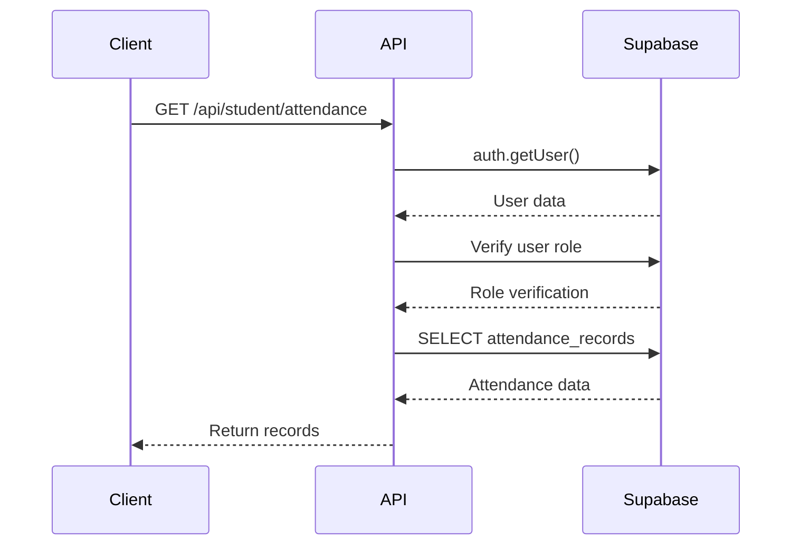
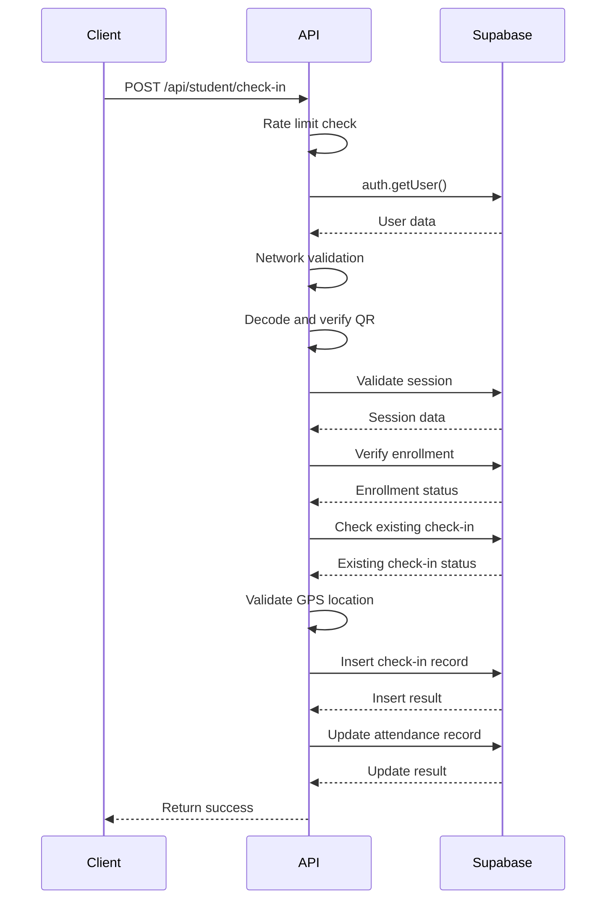
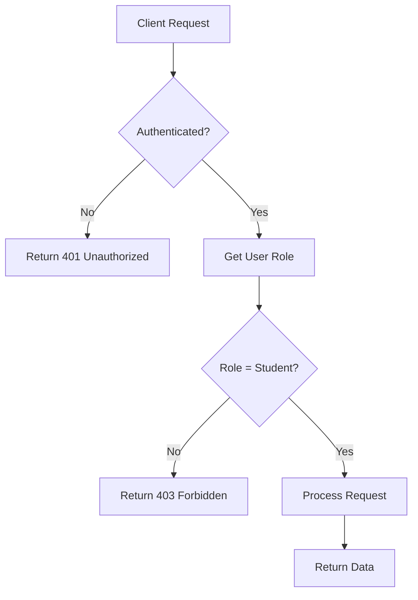
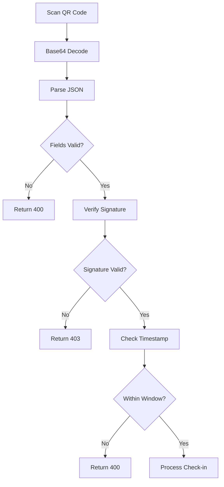
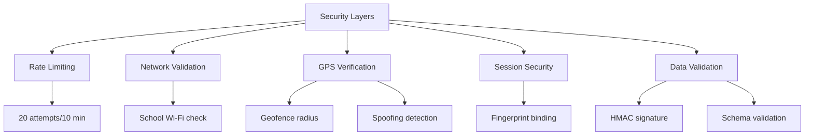
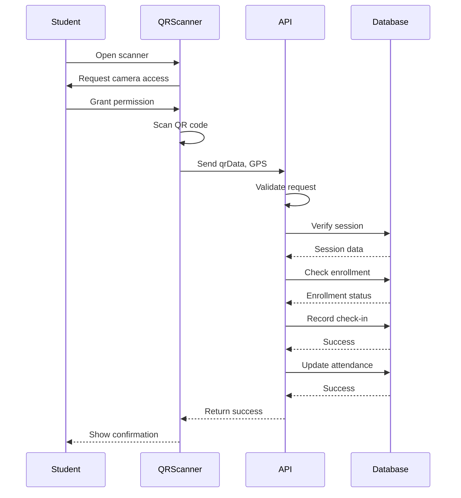
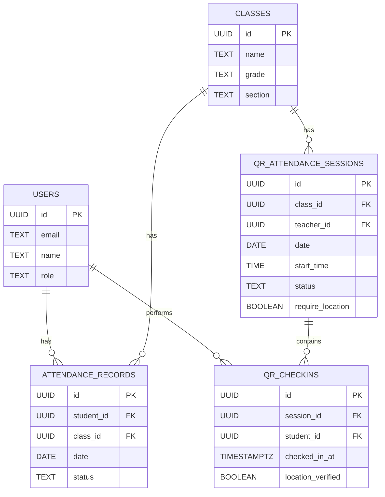
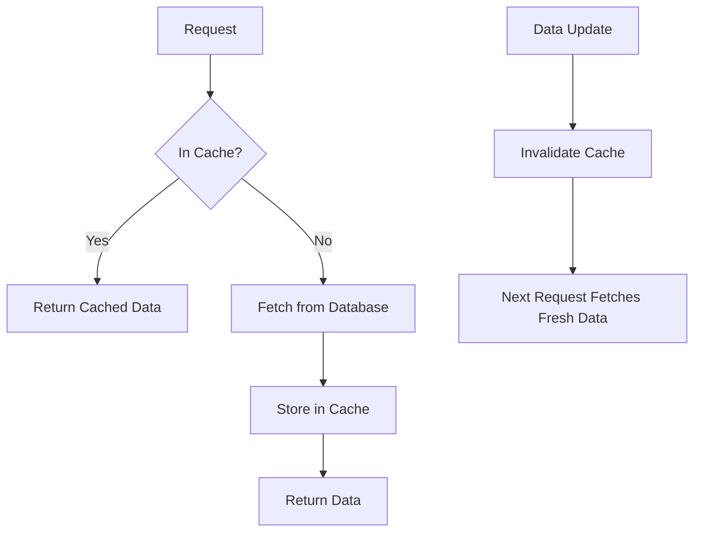

# Student Attendance API

<cite>
**Referenced Files in This Document**   
- [attendance/route.ts](file://app/api/student/attendance/route.ts)
- [check-in/route.ts](file://app/api/student/check-in/route.ts)
- [qr-scanner.tsx](file://components/qr-scanner.tsx)
- [attendance-utils.ts](file://lib/attendance-utils.ts)
- [rate-limit.ts](file://lib/rate-limit.ts)
- [auth-store.ts](file://lib/auth-store.ts)
- [cache.ts](file://lib/cache.ts)
- [types.ts](file://lib/supabase/types.ts)
- [20251219043454_create_attendance_tables.sql](file://supabase/migrations/20251219043454_create_attendance_tables.sql)
</cite>

## Table of Contents
1. [Introduction](#introduction)
2. [API Endpoints](#api-endpoints)
   - [GET /api/student/attendance](#get-apistudentattendance)
   - [POST /api/student/check-in](#post-apistudentcheck-in)
3. [Authentication and Authorization](#authentication-and-authorization)
4. [QR Code Structure and Validation](#qr-code-structure-and-validation)
5. [Security Considerations](#security-considerations)
6. [Data Flow and Integration](#data-flow-and-integration)
7. [Database Schema](#database-schema)
8. [Performance and Caching](#performance-and-caching)
9. [Error Handling](#error-handling)
10. [Usage Examples](#usage-examples)

## Introduction

The Student Attendance API provides endpoints for retrieving attendance records and performing QR-based check-ins within the School-Management-System. This documentation details the implementation of the GET /api/student/attendance route for retrieving a student's attendance history and the POST /api/student/check-in route for QR-based attendance verification. The system integrates with Supabase for authentication and database operations, implements robust security measures including role-based access control, rate limiting, and network validation, and leverages client-side components for QR scanning functionality.

**Section sources**
- [attendance/route.ts](file://app/api/student/attendance/route.ts)
- [check-in/route.ts](file://app/api/student/check-in/route.ts)

## API Endpoints

### GET /api/student/attendance

Retrieves the authenticated student's attendance records with class information.

**HTTP Method**: GET  
**Authentication Required**: Yes  
**Role Required**: student  
**Response Format**: JSON

**Request Parameters**: None

**Response Schema**:
```json
{
  "records": [
    {
      "id": "string",
      "date": "string",
      "status": "present|absent|late|excused",
      "class": {
        "name": "string"
      }
    }
  ]
}
```

**Success Response**:
- **200 OK**: Returns attendance records ordered by date (newest first)

**Error Responses**:
- **401 Unauthorized**: User not authenticated
- **403 Forbidden**: User does not have student role
- **500 Internal Server Error**: Database or server error



**Diagram sources**
- [attendance/route.ts](file://app/api/student/attendance/route.ts)

**Section sources**
- [attendance/route.ts](file://app/api/student/attendance/route.ts)

### POST /api/student/check-in

Processes a QR code scan for student attendance check-in with comprehensive validation.

**HTTP Method**: POST  
**Authentication Required**: Yes  
**Role Required**: student  
**Content-Type**: application/json  
**Response Format**: JSON

**Request Body**:
```json
{
  "qrData": "string",
  "latitude": "number",
  "longitude": "number"
}
```

**Request Parameters**:
- **qrData**: Base64-encoded JSON containing session ID, timestamp, and HMAC signature
- **latitude**: GPS latitude (required if session requires location)
- **longitude**: GPS longitude (required if session requires location)

**Response Schema**:
```json
{
  "success": "boolean"
}
```

**Success Response**:
- **200 OK**: Check-in processed successfully

**Error Responses**:
- **400 Bad Request**: Invalid QR format, expired QR, or invalid coordinates
- **401 Unauthorized**: User not authenticated
- **403 Forbidden**: Invalid signature, network restriction, or GPS spoofing detected
- **409 Conflict**: Already checked in
- **429 Too Many Requests**: Rate limit exceeded
- **500 Internal Server Error**: Server processing error



**Diagram sources**
- [check-in/route.ts](file://app/api/student/check-in/route.ts)

**Section sources**
- [check-in/route.ts](file://app/api/student/check-in/route.ts)

## Authentication and Authorization

The attendance API implements a multi-layered authentication and authorization system using Supabase authentication and Row Level Security (RLS) policies.

**Authentication Flow**:
1. The API endpoint calls `supabase.auth.getUser()` to retrieve the authenticated user
2. If no user is found, a 401 Unauthorized response is returned
3. The system queries the users table to verify the user's role
4. Only users with the "student" role are permitted to access attendance endpoints

**Role-Based Access Control**:
- Students can only access their own attendance records
- Students can only check in for sessions they are enrolled in
- The system uses Supabase RLS policies to enforce data isolation



**Diagram sources**
- [attendance/route.ts](file://app/api/student/attendance/route.ts)
- [check-in/route.ts](file://app/api/student/check-in/route.ts)
- [auth-store.ts](file://lib/auth-store.ts)

**Section sources**
- [attendance/route.ts](file://app/api/student/attendance/route.ts)
- [check-in/route.ts](file://app/api/student/check-in/route.ts)
- [auth-store.ts](file://lib/auth-store.ts)

## QR Code Structure and Validation

The QR-based check-in system uses cryptographically signed QR codes to prevent tampering and ensure authenticity.

**QR Data Structure**:
The QR code contains a Base64-encoded JSON payload with the following structure:
```json
{
  "sessionId": "string",
  "timestamp": "number",
  "signature": "string"
}
```

**Validation Process**:
1. Decode the Base64-encoded QR data
2. Parse the JSON payload
3. Verify all required fields (sessionId, timestamp, signature) are present
4. Recalculate the HMAC signature using the shared secret (QR_SECRET)
5. Compare the calculated signature with the provided signature
6. Validate the timestamp is within a 5-second window (3 seconds validity + 2 seconds latency buffer)

**Security Features**:
- HMAC-SHA256 signature prevents QR code tampering
- Short validity window prevents replay attacks
- Server-side validation ensures only valid QR codes are accepted



**Diagram sources**
- [check-in/route.ts](file://app/api/student/check-in/route.ts)
- [qr-scanner.tsx](file://components/qr-scanner.tsx)

**Section sources**
- [check-in/route.ts](file://app/api/student/check-in/route.ts)

## Security Considerations

The attendance system implements multiple security layers to prevent abuse and ensure data integrity.

**Rate Limiting**:
- Implemented via `lib/rate-limit.ts` using Supabase RPC
- Check-in attempts limited to 20 per 10 minutes per IP address
- Uses service role key for atomic operations and bypassing RLS
- Fail-open by default for availability, with option for fail-closed on security-critical endpoints

**Network Validation**:
- Optional school network enforcement via SCHOOL_IP_RANGE environment variable
- For non-school networks: strict limits on multiple student check-ins from same IP
- IP addresses are hashed for privacy-preserving abuse detection

**GPS Spoofing Protection**:
- Geofencing based on school location and radius
- Detection of suspiciously perfect GPS matches (distance < 1 meter)
- Requires location verification when session is configured to do so

**Session Security**:
- Uses Supabase auth session management
- Implements fingerprinting to detect session hijacking
- Secure fetch interceptor for API calls



**Diagram sources**
- [check-in/route.ts](file://app/api/student/check-in/route.ts)
- [rate-limit.ts](file://lib/rate-limit.ts)
- [security.ts](file://lib/security.ts)
- [auth-store.ts](file://lib/auth-store.ts)

**Section sources**
- [check-in/route.ts](file://app/api/student/check-in/route.ts)
- [rate-limit.ts](file://lib/rate-limit.ts)
- [auth-store.ts](file://lib/auth-store.ts)

## Data Flow and Integration

The attendance system integrates multiple components to provide a seamless check-in experience.

**QR Scanner Integration**:
- The `qr-scanner.tsx` component provides a modal interface for scanning QR codes
- Uses html5-qrcode library for camera-based scanning
- Handles camera permissions and device errors
- Provides manual input fallback for accessibility

**Check-in Workflow**:
1. Student opens QR scanner from attendance page
2. Camera activates and scans classroom QR code
3. QR data is sent to POST /api/student/check-in
4. Server validates QR, location, and enrollment
5. Check-in record is created and attendance updated
6. Response confirms successful check-in

**Data Processing**:
- Uses `attendance-utils.ts` for calculating attendance statistics
- Implements caching via `lib/cache.ts` for performance
- Updates both check-in and attendance records for data consistency



**Diagram sources**
- [qr-scanner.tsx](file://components/qr-scanner.tsx)
- [check-in/route.ts](file://app/api/student/check-in/route.ts)
- [attendance-utils.ts](file://lib/attendance-utils.ts)

**Section sources**
- [qr-scanner.tsx](file://components/qr-scanner.tsx)
- [check-in/route.ts](file://app/api/student/check-in/route.ts)
- [attendance-utils.ts](file://lib/attendance-utils.ts)

## Database Schema

The attendance system uses three related tables to manage attendance data.

**Tables**:
- `attendance_records`: Stores student attendance status for classes
- `qr_attendance_sessions`: Manages active QR-based attendance sessions
- `qr_checkins`: Records individual QR check-in attempts

**Key Relationships**:
- attendance_records.student_id → users.id (CASCADE)
- attendance_records.class_id → classes.id (CASCADE)
- qr_attendance_sessions.class_id → classes.id (CASCADE)
- qr_attendance_sessions.teacher_id → users.id (CASCADE)
- qr_checkins.session_id → qr_attendance_sessions.id (CASCADE)
- qr_checkins.student_id → users.id (CASCADE)

**Constraints**:
- Unique constraint on attendance_records (student_id, class_id, date)
- Unique constraint on qr_checkins (session_id, student_id)
- Status values restricted by CHECK constraints



**Diagram sources**
- [20251219043454_create_attendance_tables.sql](file://supabase/migrations/20251219043454_create_attendance_tables.sql)
- [types.ts](file://lib/supabase/types.ts)

**Section sources**
- [20251219043454_create_attendance_tables.sql](file://supabase/migrations/20251219043454_create_attendance_tables.sql)

## Performance and Caching

The system implements multiple caching strategies to optimize performance and reduce database load.

**Client-Side Caching**:
- Implemented in `lib/cache.ts` using in-memory Map
- TTL-based expiration (default 30 seconds)
- Limits cache size to 100 entries with LRU cleanup
- Used for API response caching in client components

**Server-Side Caching**:
- Uses Next.js unstable_cache for server components
- Revalidation intervals (60-180 seconds) based on data volatility
- Tag-based invalidation for cache busting
- Supports revalidation by tag for data consistency

**Cache Usage**:
- Attendance records can be cached to prevent duplicate API calls
- Student and class lists use server-side caching
- Dashboard data is cached with role-based keys
- Cache is invalidated on data mutations



**Diagram sources**
- [cache.ts](file://lib/cache.ts)

**Section sources**
- [cache.ts](file://lib/cache.ts)

## Error Handling

The API implements comprehensive error handling for both expected and unexpected conditions.

**Client-Side Errors**:
- 400 Bad Request: Invalid QR format, missing fields, or invalid coordinates
- 401 Unauthorized: Missing or invalid authentication
- 403 Forbidden: Role mismatch, invalid signature, or network restrictions
- 409 Conflict: Duplicate check-in attempt
- 429 Too Many Requests: Rate limit exceeded

**Server-Side Errors**:
- 500 Internal Server Error: Database errors or unhandled exceptions
- Detailed error logging for debugging
- Generic error messages to prevent information disclosure

**Error Response Structure**:
```json
{
  "error": "string"
}
```

**Validation Strategy**:
- Early validation of request structure
- Progressive validation with specific error messages
- Security-focused error messages that don't reveal system details
- Comprehensive logging for audit and debugging

**Section sources**
- [attendance/route.ts](file://app/api/student/attendance/route.ts)
- [check-in/route.ts](file://app/api/student/check-in/route.ts)

## Usage Examples

### Scanning a Classroom QR Code

1. Student navigates to the attendance page in the student portal
2. Clicks "Check In" button to open the QR scanner
3. Points device camera at the classroom QR code displayed by the teacher
4. QR scanner automatically detects and decodes the QR code
5. Device GPS location is captured (if required by session)
6. Check-in request is sent to the server with QR data and location
7. Server validates the request and processes the check-in
8. Student receives confirmation of successful check-in

### Manual Code Entry

When camera access is unavailable or problematic:

1. Student clicks "Enter Code Manually" in the QR scanner interface
2. System prompts for the attendance code
3. Student enters the alphanumeric code displayed in the classroom
4. Code is processed as if it were scanned from a QR code
5. Check-in proceeds with the same validation steps

### Teacher-Initiated Attendance Session

1. Teacher navigates to the QR attendance page
2. Clicks "Generate QR Code" for their current class
3. System creates a time-limited QR code with cryptographic signature
4. QR code is displayed on the teacher's screen
5. Students scan the code to check in
6. Teacher can monitor real-time attendance through the attendance dashboard

**Section sources**
- [qr-scanner.tsx](file://components/qr-scanner.tsx)
- [check-in/route.ts](file://app/api/student/check-in/route.ts)
- [attendance/route.ts](file://app/api/student/attendance/route.ts)