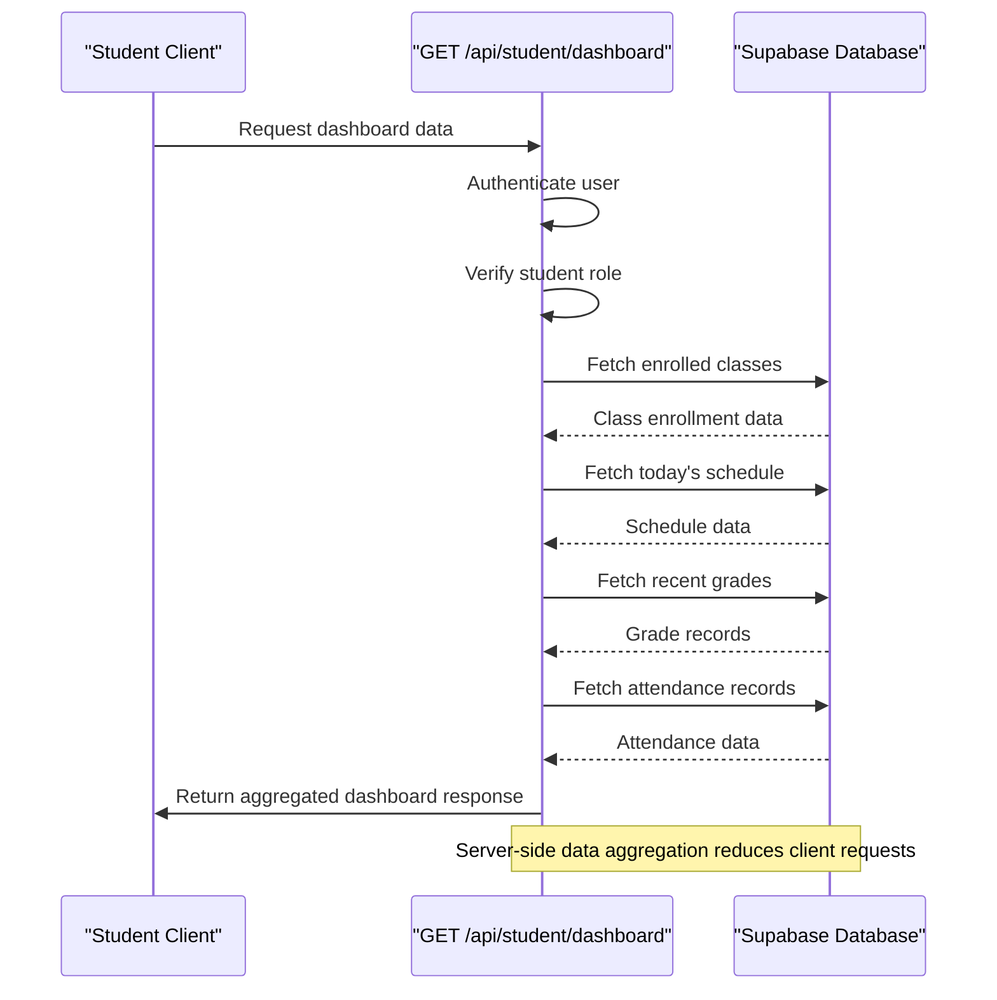
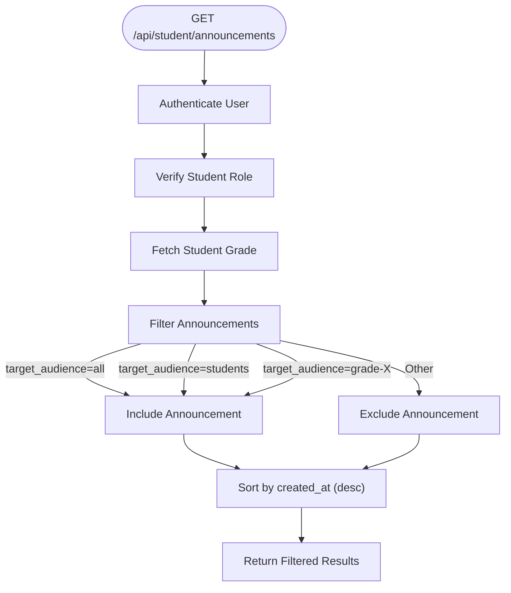
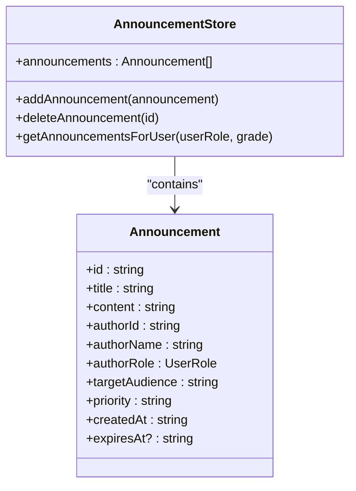
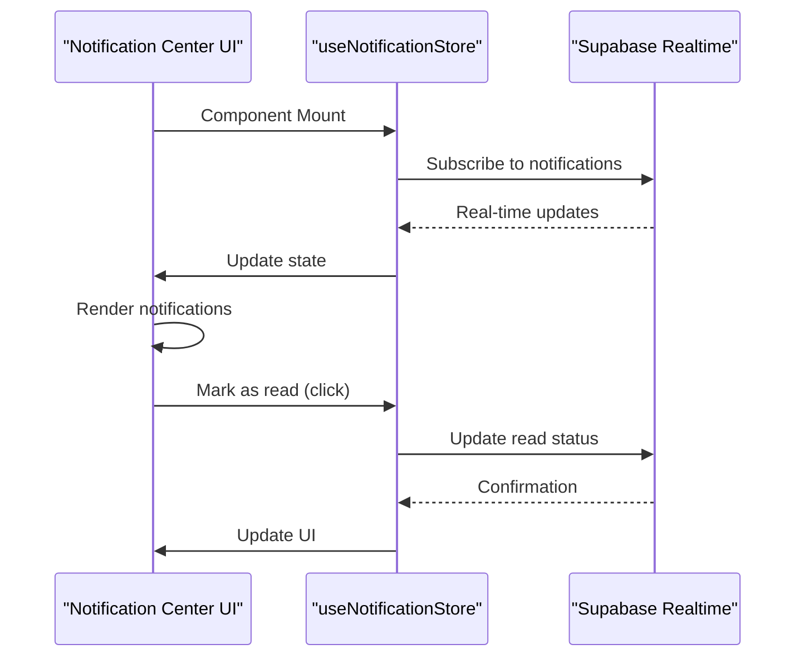
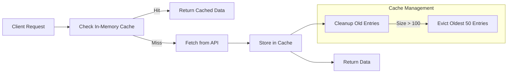
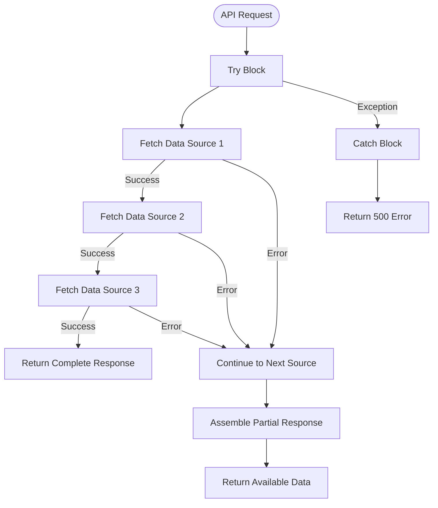
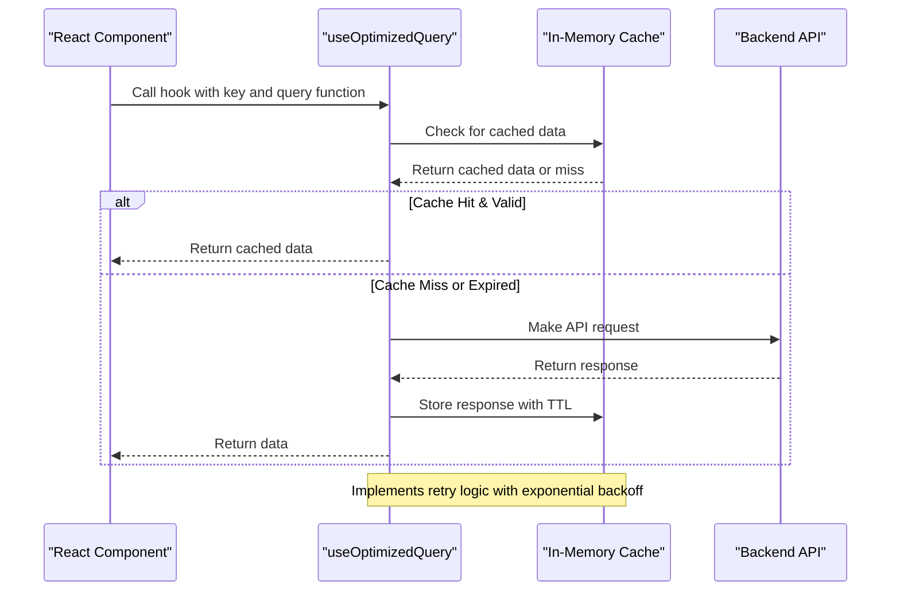

# Student Dashboard Data Services

<cite>
**Referenced Files in This Document**   
- [dashboard/route.ts](file://app/api/student/dashboard/route.ts)
- [announcements/route.ts](file://app/api/student/announcements/route.ts)
- [announcement-store.ts](file://lib/announcement-store.ts)
- [notification-center.tsx](file://components/notification-center.tsx)
- [notification-store.ts](file://lib/notification-store.ts)
- [cache.ts](file://lib/cache.ts)
- [use-optimized-query.ts](file://lib/hooks/use-optimized-query.ts)
- [20251219043609_create_communication_tables.sql](file://supabase/migrations/20251219043609_create_communication_tables.sql)
- [20240101000000_secure_rls.sql](file://supabase/migrations/20240101000000_secure_rls.sql)
- [20250228_security_hardening.sql](file://supabase/migrations/20250228_security_hardening.sql)
</cite>

## Table of Contents
1. [Introduction](#introduction)
2. [Dashboard Data Aggregation](#dashboard-data-aggregation)
3. [Announcements Service](#announcements-service)
4. [Real-time Updates with Announcement Store](#real-time-updates-with-announcement-store)
5. [Notification Center Integration](#notification-center-integration)
6. [Performance Optimization](#performance-optimization)
7. [Error Resilience and Fallback](#error-resilience-and-fallback)
8. [Security and RLS Policies](#security-and-rls-policies)
9. [Frontend Data Fetching](#frontend-data-fetching)

## Introduction
The student dashboard services provide a centralized data access point for students to view their academic information in a single, optimized interface. The backend architecture is designed to aggregate multiple data sources into cohesive responses while maintaining security, performance, and real-time capabilities. This document details the implementation of the GET /api/student/dashboard and GET /api/student/announcements endpoints, their integration with client-side stores, and the security mechanisms that ensure data privacy.

## Dashboard Data Aggregation

The GET /api/student/dashboard endpoint serves as a data aggregation service that combines multiple academic data points into a single optimized response. This approach minimizes client-server round trips by consolidating information that would otherwise require multiple API calls.

The endpoint follows a sequential data fetching pattern after authentication and role verification:
1. Retrieves the user's profile to confirm student role
2. Fetches enrolled classes through the class_students junction table
3. Retrieves today's schedule based on the current day of the week
4. Obtains recent grades (limited to 5 most recent entries)
5. Calculates attendance rate from attendance_records

This server-side aggregation reduces the client's network overhead and provides a consistent data structure for the dashboard UI components.



**Diagram sources**
- [dashboard/route.ts](file://app/api/student/dashboard/route.ts#L4-L116)

**Section sources**
- [dashboard/route.ts](file://app/api/student/dashboard/route.ts#L4-L116)

## Announcements Service

The GET /api/student/announcements endpoint provides filtered access to school announcements with role-based and grade-level targeting. The service implements strict server-side filtering to ensure students only receive announcements relevant to their audience segment.

The announcement data structure includes:
- **id**: Unique identifier for the announcement
- **title**: Headline of the announcement
- **content**: Detailed message body
- **target_audience**: Audience segmentation (all, students, teachers, grade-specific)
- **priority**: Importance level (normal, important, urgent)
- **created_at**: Timestamp of publication
- **author**: Embedded author information (name)

The filtering logic in the endpoint uses Supabase's RLS policies combined with query-time filtering to restrict results to announcements targeting "all", "students", or the specific grade level of the requesting student.



**Diagram sources**
- [announcements/route.ts](file://app/api/student/announcements/route.ts#L4-L38)

**Section sources**
- [announcements/route.ts](file://app/api/student/announcements/route.ts#L4-L38)

## Real-time Updates with Announcement Store

The announcement-store.ts implements a client-side state management solution using Zustand for real-time announcement handling. This store maintains an in-memory cache of announcements and provides methods for adding, removing, and filtering announcements based on user context.

The store's key features include:
- **addAnnouncement**: Adds a new announcement with auto-generated UUID and timestamp
- **deleteAnnouncement**: Removes an announcement by ID
- **getAnnouncementsForUser**: Filters announcements based on user role and grade level, with admin override capability

The filtering logic in getAnnouncementsForUser mirrors the server-side filtering, creating a consistent experience between API responses and client-side state management. This dual-layer filtering ensures data security even if announcements are cached client-side.



**Diagram sources**
- [announcement-store.ts](file://lib/announcement-store.ts#L7-L60)

**Section sources**
- [announcement-store.ts](file://lib/announcement-store.ts#L7-L60)

## Notification Center Integration

The notification-center.tsx component provides a UI interface for students to view and manage their notifications, including announcements. It integrates with the useNotificationStore to manage notification state and display real-time updates.

Key integration points include:
- Real-time fetching of notifications on component mount
- Visual indicators for unread notifications (badge count)
- One-click marking as read and bulk mark-all-as-read functionality
- Time-ago formatting for notification timestamps
- Type-based icon and color coding for different notification categories

The component uses Supabase's real-time capabilities through the notification-store.ts to update the UI when new notifications arrive, creating a responsive experience without requiring manual refresh.



**Diagram sources**
- [notification-center.tsx](file://components/notification-center.tsx#L63-L189)
- [notification-store.ts](file://lib/notification-store.ts#L45-L147)

**Section sources**
- [notification-center.tsx](file://components/notification-center.tsx#L63-L189)
- [notification-store.ts](file://lib/notification-store.ts#L45-L147)

## Performance Optimization

The system implements multiple caching strategies to optimize performance and reduce database load. The cache.ts utility provides both client-side and server-side caching mechanisms.

Client-side caching uses an in-memory Map with TTL (Time-To-Live) of 30 seconds to prevent duplicate API calls within a short timeframe. The cache automatically evicts entries when exceeding 100 items to prevent memory leaks.

Server-side caching leverages Next.js's unstable_cache with revalidate tags for automatic cache invalidation. Different data types have appropriate TTL settings:
- Dashboard data: 60 seconds
- Student lists: 120 seconds
- Class lists: 180 seconds

The caching strategy balances freshness with performance, ensuring users receive reasonably current data while minimizing redundant database queries.



**Diagram sources**
- [cache.ts](file://lib/cache.ts#L6-L128)

**Section sources**
- [cache.ts](file://lib/cache.ts#L6-L128)

## Error Resilience and Fallback

The system implements robust error handling at multiple levels to ensure graceful degradation when data sources fail. The dashboard endpoint uses a try-catch wrapper to prevent complete failure when individual data sources encounter issues.

For the dashboard service, if one data source fails (e.g., grades or attendance), the endpoint continues to aggregate available data and returns what it can, rather than failing completely. This partial success pattern ensures users still receive valuable information even when some services are temporarily unavailable.

The use-optimized-query hook implements retry logic with exponential backoff for transient network failures, attempting up to three retries with increasing delays (1s, 2s, 4s, up to 5s maximum). This handles temporary connectivity issues without immediately showing errors to users.



**Section sources**
- [dashboard/route.ts](file://app/api/student/dashboard/route.ts#L4-L116)
- [use-optimized-query.ts](file://lib/hooks/use-optimized-query.ts#L49-L87)

## Security and RLS Policies

The system implements comprehensive Row Level Security (RLS) policies in Supabase to ensure data privacy and prevent unauthorized access. These policies are enforced at the database level, providing a security boundary that cannot be bypassed by client-side code.

For announcements, the RLS policies ensure that:
- Students can only read announcements targeted to "all", "students", or their specific grade level
- Teachers can create announcements for any audience
- Admins have full access to all announcements

The announcements table schema includes a CHECK constraint on target_audience to ensure valid values (all, students, teachers, grade-10, grade-11, grade-12), preventing invalid audience specifications.

The combination of database-level RLS and application-level filtering creates defense in depth, where even if one layer is compromised, the other provides protection.

```mermaid
erDiagram
ANNOUNCEMENTS {
string id PK
string title
string content
string author_id FK
string target_audience
string priority
datetime expires_at
datetime created_at
}
USERS {
string id PK
string name
string email
string role
}
ANNOUNCEMENTS ||--|| USERS : "author"
class "Security Constraints" {
CHECK(target_audience IN ('all', 'students', 'teachers', 'grade-10', 'grade-11', 'grade-12'))
RLS: Students can only view targeted announcements
RLS: Users can only update their own profile
}
```

**Diagram sources**
- [20251219043609_create_communication_tables.sql](file://supabase/migrations/20251219043609_create_communication_tables.sql#L1-L34)
- [20240101000000_secure_rls.sql](file://supabase/migrations/20240101000000_secure_rls.sql#L1-L62)
- [20250228_security_hardening.sql](file://supabase/migrations/20250228_security_hardening.sql#L1-L32)

**Section sources**
- [20251219043609_create_communication_tables.sql](file://supabase/migrations/20251219043609_create_communication_tables.sql#L1-L34)
- [20240101000000_secure_rls.sql](file://supabase/migrations/20240101000000_secure_rls.sql#L1-L62)
- [20250228_security_hardening.sql](file://supabase/migrations/20250228_security_hardening.sql#L1-L32)

## Frontend Data Fetching

The use-optimized-query.ts hook provides a robust data fetching solution for the frontend, integrating with the caching system to optimize performance. The hook implements several key features:

- Automatic caching with configurable TTL
- Deduplication of concurrent requests for the same data
- Retry logic for transient network failures
- Refetch interval for periodic updates
- Manual invalidation to force refresh

The hook is designed to work seamlessly with the server-side caching, creating a cohesive caching strategy across the entire stack. When combined with the dashboard's server-side aggregation, it minimizes both network requests and database queries.

The hook's retry mechanism uses exponential backoff to handle temporary connectivity issues, improving user experience during network fluctuations without overwhelming the server with rapid retry requests.



**Diagram sources**
- [use-optimized-query.ts](file://lib/hooks/use-optimized-query.ts#L28-L275)

**Section sources**
- [use-optimized-query.ts](file://lib/hooks/use-optimized-query.ts#L28-L275)