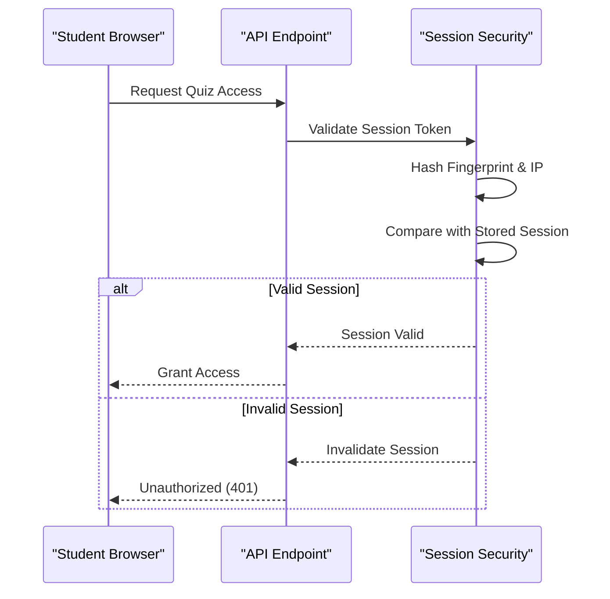
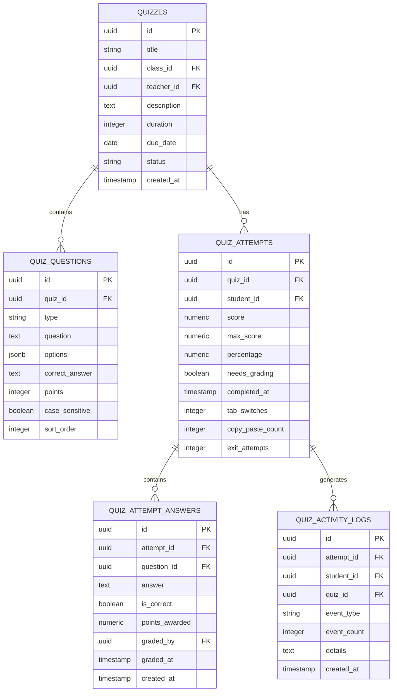
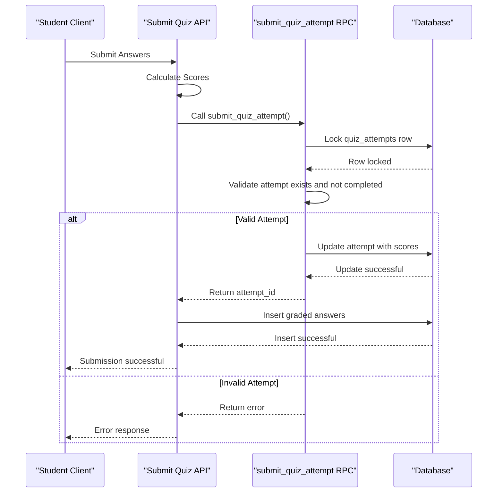
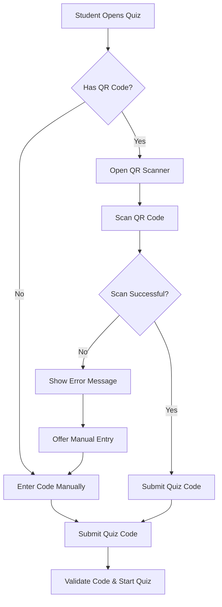

# Student Quiz Interaction API

<cite>
**Referenced Files in This Document**   
- [app/api/student/quizzes/route.ts](file://app/api/student/quizzes/route.ts)
- [app/api/student/start-quiz/route.ts](file://app/api/student/start-quiz/route.ts)
- [app/api/student/submit-quiz/route.ts](file://app/api/student/submit-quiz/route.ts)
- [app/api/teacher/create-quiz/route.ts](file://app/api/teacher/create-quiz/route.ts)
- [app/api/teacher/grading/[attemptId]/route.ts](file://app/api/teacher/grading/[attemptId]/route.ts)
- [lib/session-security.ts](file://lib/session-security.ts)
- [components/qr-scanner.tsx](file://components/qr-scanner.tsx)
- [lib/supabase/queries-optimized.ts](file://lib/supabase/queries-optimized.ts)
- [supabase/migrations/20251219043525_create_quizzes_tables.sql](file://supabase/migrations/20251219043525_create_quizzes_tables.sql)
- [supabase/migrations/20251219105024_create_quiz_attempt_answers.sql](file://supabase/migrations/20251219105024_create_quiz_attempt_answers.sql)
- [supabase/migrations/20251219112310_create_quiz_activity_logs.sql](file://supabase/migrations/20251219112310_create_quiz_activity_logs.sql)
- [supabase/migrations/20260107115626_fix_function_search_path_v2.sql](file://supabase/migrations/20260107115626_fix_function_search_path_v2.sql)
</cite>

## Table of Contents
1. [Introduction](#introduction)
2. [API Endpoints](#api-endpoints)
   - [GET /api/student/quizzes](#get-apistudentquizzes)
   - [POST /api/student/start-quiz](#post-apistudentstart-quiz)
   - [POST /api/student/submit-quiz](#post-apistudentsubmit-quiz)
3. [Integration with Teacher Workflows](#integration-with-teacher-workflows)
4. [Security Measures](#security-measures)
5. [Data Persistence and Database Schema](#data-persistence-and-database-schema)
6. [Performance Optimization](#performance-optimization)
7. [Quiz Access Control](#quiz-access-control)

## Introduction
This document provides comprehensive documentation for the student quiz interaction endpoints in the School Management System. The API enables students to list available quizzes, start quiz attempts, and submit their answers securely. The system integrates with teacher-created quizzes and grading workflows, ensuring a seamless assessment experience. Security measures such as session validation, rate limiting, and anti-cheating mechanisms are implemented throughout the quiz lifecycle.

## API Endpoints

### GET /api/student/quizzes
Retrieves a list of available quizzes for the authenticated student based on their class enrollments.

**Request**
- Method: GET
- URL: `/api/student/quizzes`
- Authentication: Required (JWT token in Authorization header)

**Response**
```json
{
  "quizzes": [
    {
      "id": "uuid",
      "title": "string",
      "description": "string",
      "duration": "integer (minutes)",
      "due_date": "string (ISO date)",
      "teacher_id": "uuid",
      "class_id": "uuid",
      "class": {
        "name": "string"
      }
    }
  ]
}
```

**Status Codes**
- 200: Success - Returns list of quizzes
- 401: Unauthorized - User not authenticated
- 500: Internal Server Error - Failed to retrieve quizzes

**Behavior**
- Fetches only published quizzes from classes the student is enrolled in
- Excludes quiz questions from response for security reasons
- Returns quizzes ordered by creation date (newest first)

**Section sources**
- [app/api/student/quizzes/route.ts](file://app/api/student/quizzes/route.ts#L4-L43)

### POST /api/student/start-quiz
Initiates a new quiz attempt by generating a quiz session and retrieving the question set.

**Request**
- Method: POST
- URL: `/api/student/start-quiz`
- Authentication: Required (JWT token in Authorization header)
- Rate Limit: 5 requests per 10 minutes per IP

**Request Payload**
```json
{
  "quizId": "uuid"
}
```

**Response**
```json
{
  "success": "boolean",
  "attemptId": "uuid",
  "questions": [
    {
      "id": "uuid",
      "question": "string",
      "type": "string (multiple-choice|true-false|identification|essay)",
      "options": ["string"],
      "points": "integer"
    }
  ]
}
```

**Status Codes**
- 200: Success - Returns quiz questions and attempt ID
- 400: Bad Request - Missing quizId or quiz not available
- 401: Unauthorized - User not authenticated
- 403: Forbidden - Student not enrolled in the quiz's class
- 429: Too Many Requests - Rate limit exceeded
- 500: Internal Server Error - Failed to start quiz

**Behavior**
- Validates student enrollment in the quiz's class to prevent IDOR attacks
- Creates a new quiz attempt record if one doesn't exist
- Returns 400 if quiz already submitted
- Uses service role key to securely fetch quiz questions
- Implements rate limiting to prevent abuse

**Section sources**
- [app/api/student/start-quiz/route.ts](file://app/api/student/start-quiz/route.ts#L7-L122)

### POST /api/student/submit-quiz
Submits answers for a quiz attempt and processes grading.

**Request**
- Method: POST
- URL: `/api/student/submit-quiz`
- Authentication: Required (JWT token in Authorization header)
- Rate Limit: 3 submissions per minute per user

**Request Payload**
```json
{
  "quizId": "uuid",
  "answers": [
    {
      "questionId": "uuid",
      "answer": "string"
    }
  ],
  "activityLog": {
    "tabSwitches": "integer",
    "copyPasteCount": "integer",
    "exitAttempts": "integer"
  }
}
```

**Response**
```json
{
  "success": "boolean",
  "score": "number",
  "maxScore": "number",
  "percentage": "integer",
  "needsGrading": "boolean"
}
```

**Status Codes**
- 200: Success - Quiz submitted and partially graded
- 400: Bad Request - Invalid submission data or quiz already submitted
- 401: Unauthorized - User not authenticated
- 404: Not Found - Quiz not found
- 429: Too Many Requests - Rate limit exceeded
- 500: Internal Server Error - Submission failed

**Behavior**
- Performs server-side time validation to prevent timer bypassing
- Grades multiple-choice, true-false, and identification questions automatically
- Flags essay questions for manual grading by teachers
- Uses atomic RPC call to prevent race conditions during submission
- Validates active quiz attempt before processing
- Accepts late submissions with activity log warnings

**Section sources**
- [app/api/student/submit-quiz/route.ts](file://app/api/student/submit-quiz/route.ts#L5-L170)

## Integration with Teacher Workflows

### Quiz Creation Workflow
The student quiz system integrates with the teacher quiz creation endpoint at `app/api/teacher/create-quiz/route.ts`. Teachers create quizzes with questions, time limits, and point values that become available to enrolled students.

**Key Integration Points:**
- Teacher-created quizzes are automatically available to students in the same class
- Quiz status ("published") determines student visibility
- Class enrollment relationships control quiz access
- Question types and correct answers are stored for automated grading

**Section sources**
- [app/api/teacher/create-quiz/route.ts](file://app/api/teacher/create-quiz/route.ts#L26-L124)

### Grading Workflow
After submission, teachers can review and grade quiz attempts through the grading endpoint at `app/api/teacher/grading/[attemptId]/route.ts`.

**Grading Process:**
1. Teachers access graded attempts through the grading interface
2. System displays student answers alongside correct answers
3. Essay questions require manual scoring by teachers
4. Activity logs show potential cheating indicators (tab switches, copy/paste)
5. Final grades are recorded and made available to students

**Section sources**
- [app/api/teacher/grading/[attemptId]/route.ts](file://app/api/teacher/grading/[attemptId]/route.ts#L4-L86)

## Security Measures

### Session Validation
The system uses robust session security implemented in `lib/session-security.ts` to prevent session hijacking and ensure quiz integrity.

**Security Features:**
- Device fingerprinting using browser and system characteristics
- Session binding to prevent cross-device access
- Automatic session invalidation on login
- IP address monitoring with configurable change tolerance
- Security event logging for suspicious activities



**Diagram sources**
- [lib/session-security.ts](file://lib/session-security.ts#L154-L227)

**Section sources**
- [lib/session-security.ts](file://lib/session-security.ts#L1-L373)

### Anti-Cheating Mechanisms
The system implements multiple layers of protection against cheating:

- **Activity Monitoring**: Tracks tab switches, copy/paste attempts, and window focus changes
- **Time Validation**: Server-side timer validation prevents client-side timer manipulation
- **Single Attempt Enforcement**: Database constraints prevent multiple submissions
- **Rate Limiting**: Protects against brute force and automated submission attempts

**Section sources**
- [app/api/student/submit-quiz/route.ts](file://app/api/student/submit-quiz/route.ts#L61-L76)
- [supabase/migrations/20251219112310_create_quiz_activity_logs.sql](file://supabase/migrations/20251219112310_create_quiz_activity_logs.sql#L1-L34)

## Data Persistence and Database Schema

### Quiz Data Model
The quiz system uses several interconnected tables to store quiz data, attempts, and answers.



**Diagram sources**
- [supabase/migrations/20251219043525_create_quizzes_tables.sql](file://supabase/migrations/20251219043525_create_quizzes_tables.sql#L1-L60)
- [supabase/migrations/20251219105024_create_quiz_attempt_answers.sql](file://supabase/migrations/20251219105024_create_quiz_attempt_answers.sql#L1-L46)
- [supabase/migrations/20251219112310_create_quiz_activity_logs.sql](file://supabase/migrations/20251219112310_create_quiz_activity_logs.sql#L1-L34)

### Atomic Submission Process
The system uses a stored procedure to ensure atomic quiz submission, preventing race conditions.



**Diagram sources**
- [supabase/migrations/20260107115626_fix_function_search_path_v2.sql](file://supabase/migrations/20260107115626_fix_function_search_path_v2.sql#L90-L139)
- [app/api/student/submit-quiz/route.ts](file://app/api/student/submit-quiz/route.ts#L125-L157)

**Section sources**
- [supabase/migrations/20260107115626_fix_function_search_path_v2.sql](file://supabase/migrations/20260107115626_fix_function_search_path_v2.sql#L90-L139)

## Performance Optimization

### Optimized Database Queries
The system uses optimized queries from `lib/supabase/queries-optimized.ts` to improve performance and reduce database load.

**Key Optimizations:**
- **Pagination**: All list endpoints support pagination to limit result sets
- **Aggregation**: Single queries with joins instead of N+1 query patterns
- **Caching**: Strategic caching of frequently accessed data
- **Indexing**: Proper database indexing for faster lookups
- **Parallel Processing**: Concurrent queries for dashboard statistics

**Section sources**
- [lib/supabase/queries-optimized.ts](file://lib/supabase/queries-optimized.ts#L1-L317)

### Query Examples
```typescript
// Optimized query for getting classes with student counts
export async function getClassesWithCounts() {
  // Single query with aggregation instead of N+1
  const { data, error } = await supabase
    .from("classes")
    .select(`
      id, name, grade, section, subject, room, schedule, teacher_id,
      teacher:users!classes_teacher_id_fkey (id, name, email, avatar),
      enrollments:class_students(count)
    `)
    .order("name")
}

// Optimized query for getting class students
export async function getClassStudentsOptimized(classId: string) {
  // Single query with proper joins
  const { data, error } = await supabase
    .from("class_students")
    .select(`
      enrolled_at,
      student:users!class_students_student_id_fkey (
        id, name, email, avatar,
        student_profiles (grade, section, lrn)
      )
    `)
    .eq("class_id", classId)
    .order("enrolled_at", { ascending: false })
}
```

## Quiz Access Control

### QR-Based Access
The system supports QR code-based quiz access through the `qr-scanner.tsx` component, providing an alternative to manual quiz code entry.

**QR Scanner Features:**
- Camera-based QR code scanning
- Manual code entry fallback
- Permission handling for camera access
- Error handling for device limitations
- Responsive design for mobile devices



**Diagram sources**
- [components/qr-scanner.tsx](file://components/qr-scanner.tsx#L1-L161)

**Section sources**
- [components/qr-scanner.tsx](file://components/qr-scanner.tsx#L1-L161)