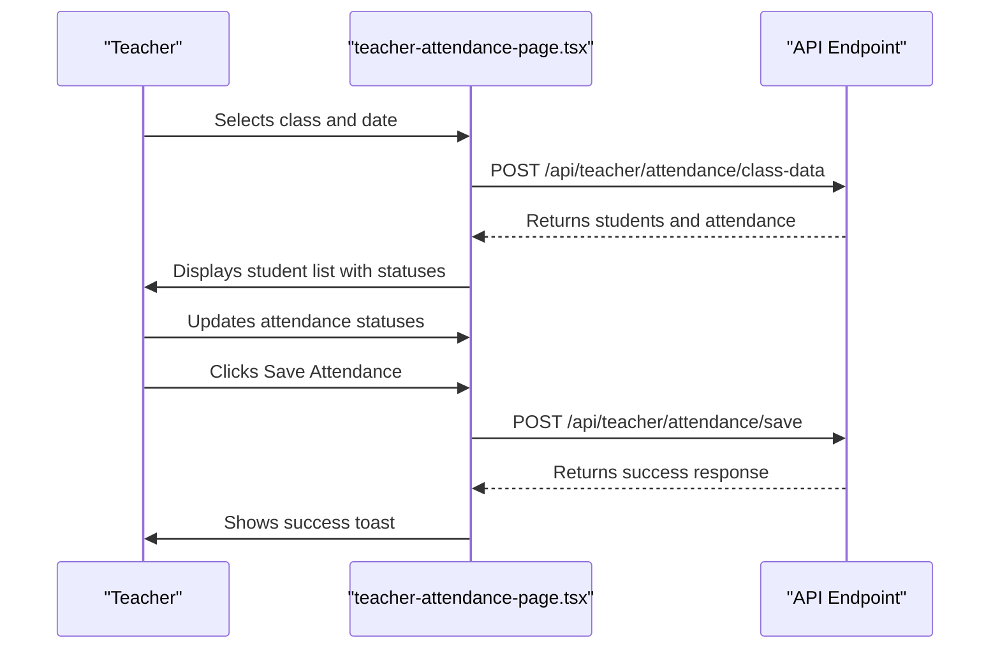
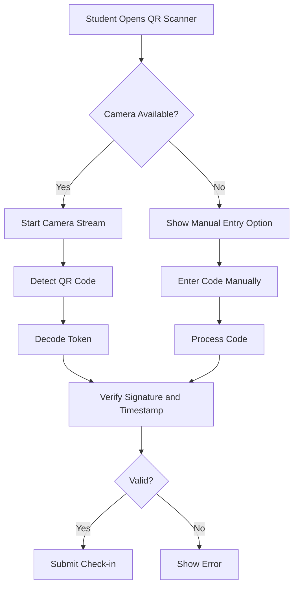
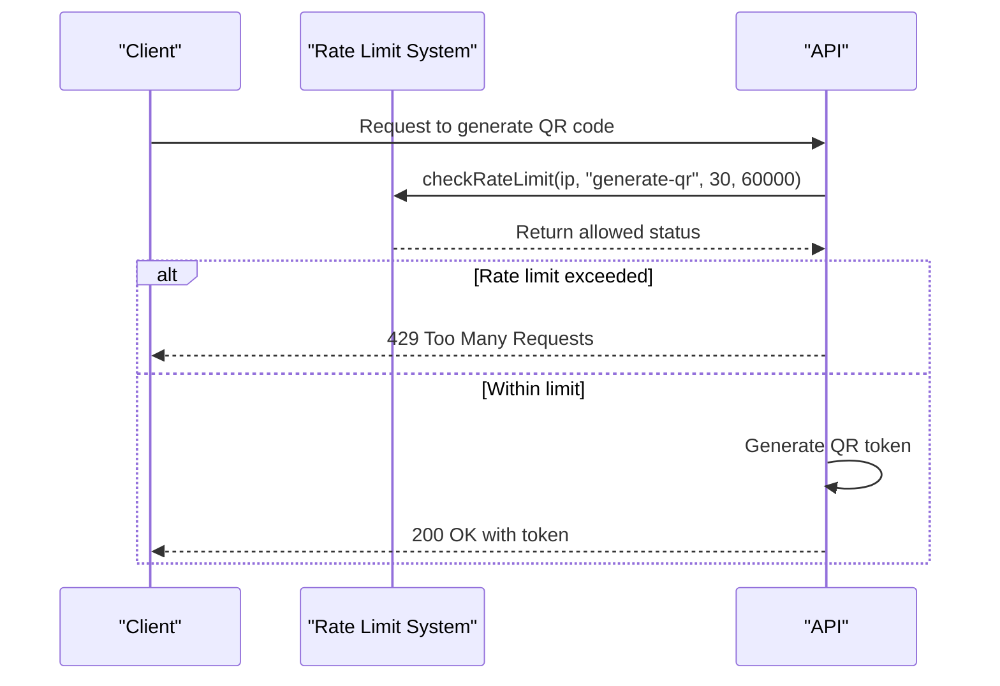
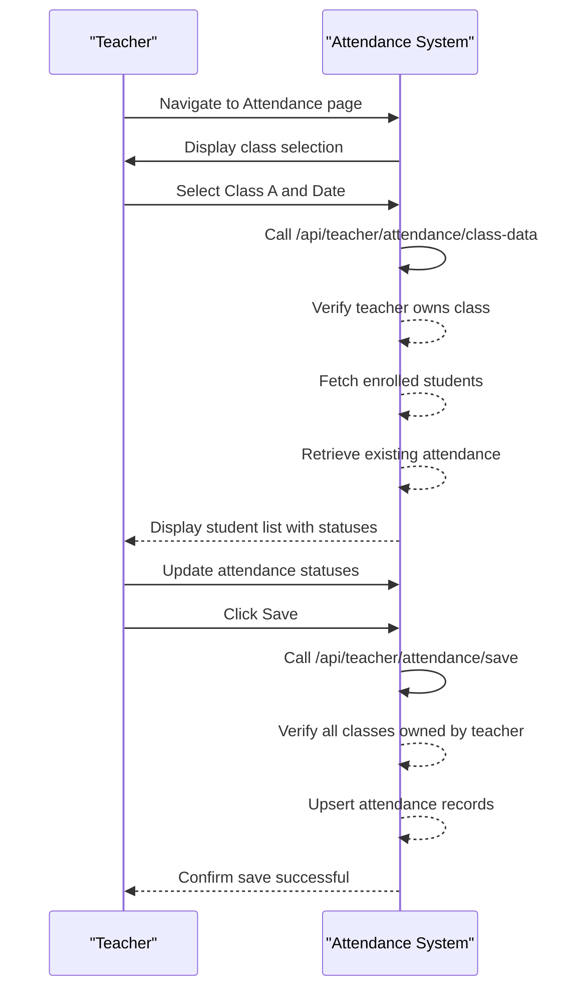
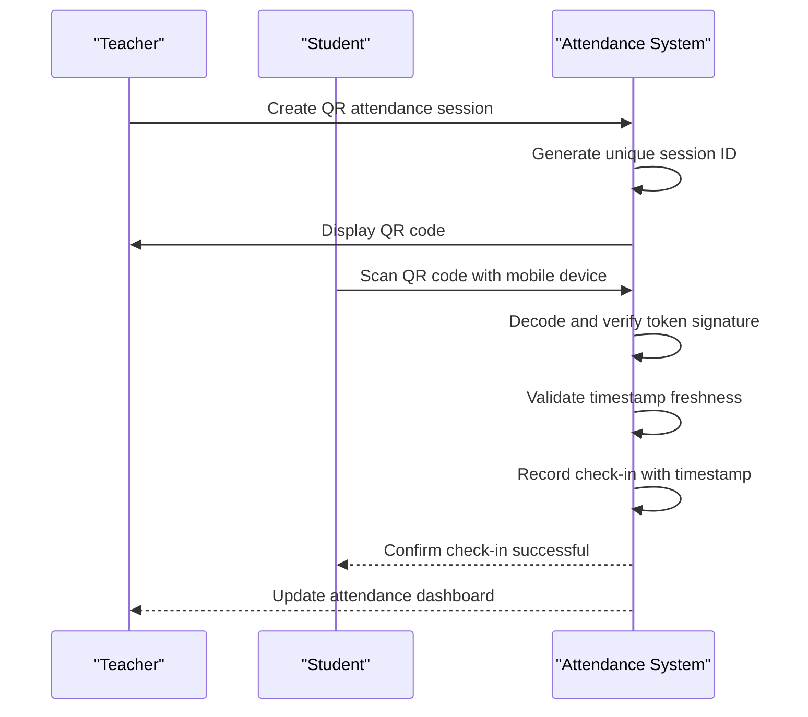
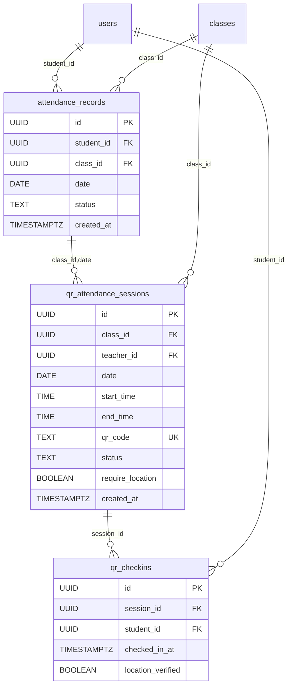

# Attendance

<cite>
**Referenced Files in This Document**   
- [class-data/route.ts](file://app/api/teacher/attendance/class-data/route.ts)
- [save/route.ts](file://app/api/teacher/attendance/save/route.ts)
- [generate-qr/route.ts](file://app/api/teacher/generate-qr/route.ts)
- [page.tsx](file://app/teacher/attendance/page.tsx)
- [qr-scanner.tsx](file://components/qr-scanner.tsx)
- [qr-attendance-store.ts](file://lib/qr-attendance-store.ts)
- [rate-limit.ts](file://lib/rate-limit.ts)
- [security.ts](file://lib/security.ts)
- [20251219043454_create_attendance_tables.sql](file://supabase/migrations/20251219043454_create_attendance_tables.sql)
- [20260101070343_rate_limit_rpc.sql](file://supabase/migrations/20260101070343_rate_limit_rpc.sql)
</cite>

## Table of Contents
1. [Introduction](#introduction)
2. [API Endpoints](#api-endpoints)
   - [POST /api/teacher/attendance/class-data](#post-apiteacherattendanceclass-data)
   - [POST /api/teacher/attendance/save](#post-apiteacherattendancesave)
   - [POST /api/teacher/generate-qr](#post-apiteachergenerate-qr)
3. [Frontend Integration](#frontend-integration)
4. [Security and Authentication](#security-and-authentication)
5. [Usage Examples](#usage-examples)
6. [Error Handling](#error-handling)
7. [Data Models](#data-models)

## Introduction
This document provides comprehensive API documentation for the teacher attendance system in the School-Management-System. The system enables teachers to manage student attendance through both manual entry and automated QR code check-in methods. The documentation covers three primary API endpoints: retrieving class attendance data, saving attendance records, and generating time-limited QR codes for automated check-ins. The system implements robust security measures including role-based access control, rate limiting, and protection against replay attacks.

## API Endpoints

### POST /api/teacher/attendance/class-data
Retrieves class enrollment and current attendance status by class and date.

**Request**
```json
{
  "classId": "string",
  "date": "string (YYYY-MM-DD)"
}
```

**Response**
```json
{
  "students": [
    {
      "id": "string",
      "name": "string",
      "email": "string",
      "avatar": "string | null"
    }
  ],
  "attendance": {
    "student_id": "present|absent|late|excused"
  }
}
```

**Authentication Requirements**
- User must be authenticated
- User role must be "teacher"

**Validation Rules**
- Both `classId` and `date` are required
- Teacher must own the class (teacher_id matches class record)

**Section sources**
- [class-data/route.ts](file://app/api/teacher/attendance/class-data/route.ts#L1-L67)

### POST /api/teacher/attendance/save
Submits attendance records for one or more students.

**Request**
```json
{
  "records": [
    {
      "student_id": "string",
      "class_id": "string",
      "date": "string (YYYY-MM-DD)",
      "status": "present|absent|late|excused"
    }
  ]
}
```

**Response**
```json
{
  "success": true
}
```

**Authentication Requirements**
- User must be authenticated
- User role must be "teacher"

**Validation Rules**
- Records array must be present and non-empty
- Teacher must own all classes referenced in the batch
- Uses upsert operation with conflict resolution on (student_id, class_id, date)

**Section sources**
- [save/route.ts](file://app/api/teacher/attendance/save/route.ts#L1-L58)

### POST /api/teacher/generate-qr
Generates time-limited QR codes for automated check-in.

**Request**
```json
{
  "sessionId": "string"
}
```

**Response**
```json
{
  "token": "string (base64-encoded JSON)"
}
```

**Token Structure**
```json
{
  "sessionId": "string",
  "timestamp": "number (epoch milliseconds)",
  "signature": "string (HMAC-SHA256)"
}
```

**Authentication Requirements**
- User must be authenticated
- User role must be "teacher" or "admin"

**Security Measures**
- Rate limiting: 30 requests per minute per IP
- HMAC signature using QR_SECRET to prevent token tampering
- Timestamp included to prevent replay attacks
- Admins can generate for any session; teachers only for their own sessions

**Section sources**
- [generate-qr/route.ts](file://app/api/teacher/generate-qr/route.ts#L1-L79)

## Frontend Integration

### Teacher Attendance Page
The teacher attendance interface allows manual attendance recording through a user-friendly form.

**Key Features**
- Class selection dropdown populated from `/api/teacher/my-classes`
- Date picker for selecting attendance date
- Student list with status buttons (Present, Absent, Late)
- Real-time statistics display (total, present, absent, late)
- Save functionality that calls `/api/teacher/attendance/save`

**Component Flow**
1. User selects class and date
2. System calls `/api/teacher/attendance/class-data` to fetch students and existing attendance
3. User updates attendance status for students
4. User clicks "Save Attendance" to submit records



**Diagram sources**
- [page.tsx](file://app/teacher/attendance/page.tsx#L1-L253)

### QR Scanner Functionality
The QR scanner component enables students to check in using QR codes.

**Key Features**
- Camera-based QR scanning using html5-qrcode library
- Manual code entry fallback
- Error handling for camera permissions and device issues
- Secure token processing



**Diagram sources**
- [qr-scanner.tsx](file://components/qr-scanner.tsx#L1-L161)

## Security and Authentication

### Authentication Requirements
All attendance endpoints require authentication and enforce role-based access control:

**Teacher Endpoints**
- `/api/teacher/attendance/class-data`
- `/api/teacher/attendance/save`
- Require: Authenticated user with "teacher" role

**Admin/Teacher Endpoints**
- `/api/teacher/generate-qr`
- Require: Authenticated user with "teacher" or "admin" role

### Rate Limiting
The QR code generation endpoint implements rate limiting to prevent abuse:

- **Limit**: 30 requests per minute per IP address
- **Implementation**: Uses `checkRateLimit` function with Redis-backed rate limiting
- **Purpose**: Prevents brute force attacks and excessive resource consumption



**Diagram sources**
- [generate-qr/route.ts](file://app/api/teacher/generate-qr/route.ts#L7-L17)
- [rate-limit.ts](file://lib/rate-limit.ts#L1-L56)

### Security Measures
The system implements multiple security layers:

**Replay Attack Prevention**
- QR tokens include timestamp (milliseconds since epoch)
- Server validates token freshness (typically within 30 seconds)
- HMAC signature prevents token tampering

**Ownership Verification**
- Teachers can only access classes they own
- Batch operations verify ownership of all referenced classes
- Admins have elevated privileges for system management

**Input Validation**
- All endpoints validate required parameters
- Database constraints enforce data integrity
- Row Level Security (RLS) policies protect data access

**Section sources**
- [security.ts](file://lib/security.ts#L1-L136)
- [generate-qr/route.ts](file://app/api/teacher/generate-qr/route.ts#L65-L74)

## Usage Examples

### Daily Attendance Workflow


### QR-Based Check-in Scenario


## Error Handling

### HTTP Status Codes
| Status | Meaning | Scenario |
|--------|-------|---------|
| 400 | Bad Request | Missing parameters, invalid data format |
| 401 | Unauthorized | No authentication token provided |
| 403 | Forbidden | User role insufficient or ownership mismatch |
| 429 | Too Many Requests | Rate limit exceeded |
| 500 | Internal Server Error | Unexpected server error |

### Common Error Responses
```json
// 400 Bad Request
{ "error": "Missing parameters" }

// 401 Unauthorized
{ "error": "Unauthorized" }

// 403 Forbidden
{ "error": "Forbidden: You do not own this class" }

// 429 Too Many Requests
{ "error": "Too many requests. Please wait." }

// 500 Internal Server Error
{ "error": "Internal Server Error" }
```

**Section sources**
- [class-data/route.ts](file://app/api/teacher/attendance/class-data/route.ts#L9-L11)
- [save/route.ts](file://app/api/teacher/attendance/save/route.ts#L9-L11)
- [generate-qr/route.ts](file://app/api/teacher/generate-qr/route.ts#L15-L16)

## Data Models

### Database Schema


**Diagram sources**
- [20251219043454_create_attendance_tables.sql](file://supabase/migrations/20251219043454_create_attendance_tables.sql#L1-L35)

### Data Integrity Constraints
- **Primary Keys**: UUID-based primary keys for all tables
- **Foreign Keys**: Enforced relationships between entities
- **Unique Constraints**: 
  - `attendance_records`: Unique on (student_id, class_id, date)
  - `qr_checkins`: Unique on (session_id, student_id)
  - `qr_attendance_sessions`: Unique on qr_code
- **Check Constraints**:
  - `attendance_records.status`: Must be one of 'present', 'absent', 'late', 'excused'
  - `qr_attendance_sessions.status`: Must be 'active' or 'expired'

**Section sources**
- [20251219043454_create_attendance_tables.sql](file://supabase/migrations/20251219043454_create_attendance_tables.sql#L1-L35)
- [20260101070343_rate_limit_rpc.sql](file://supabase/migrations/20260101070343_rate_limit_rpc.sql#L1-L41)