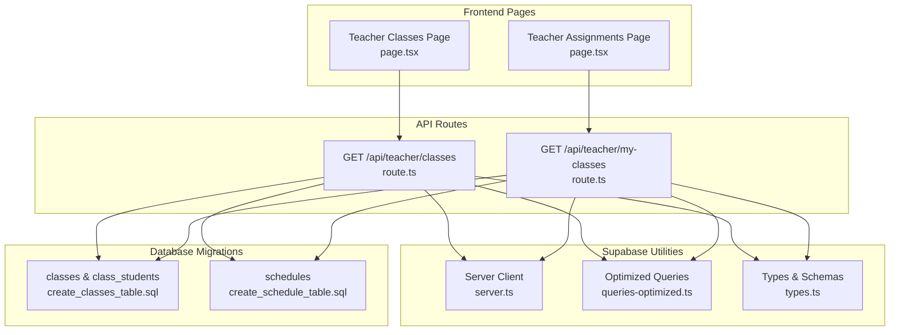
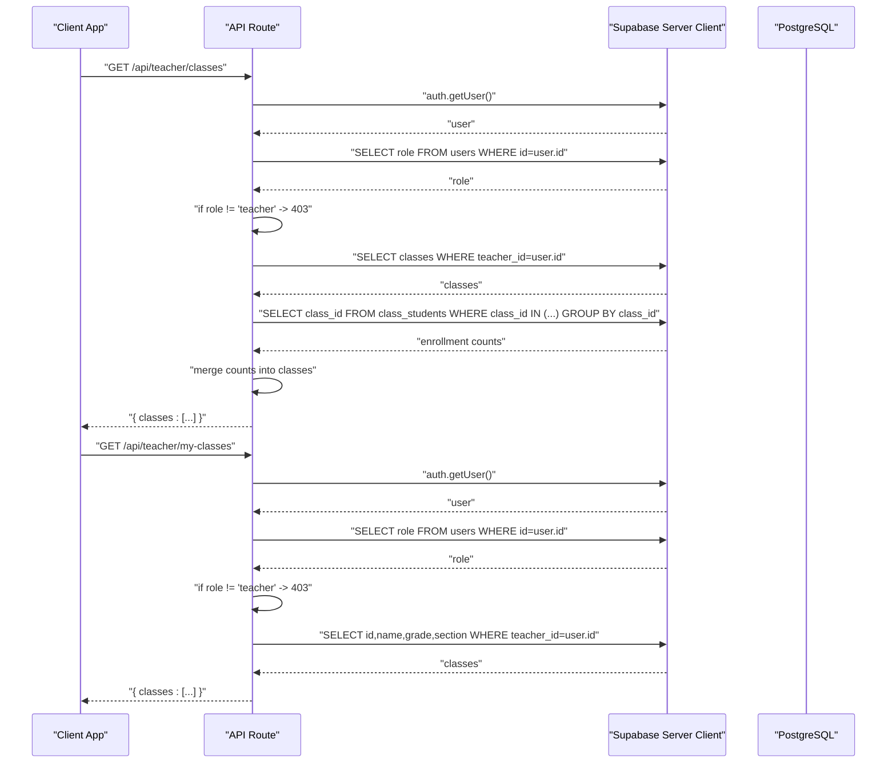
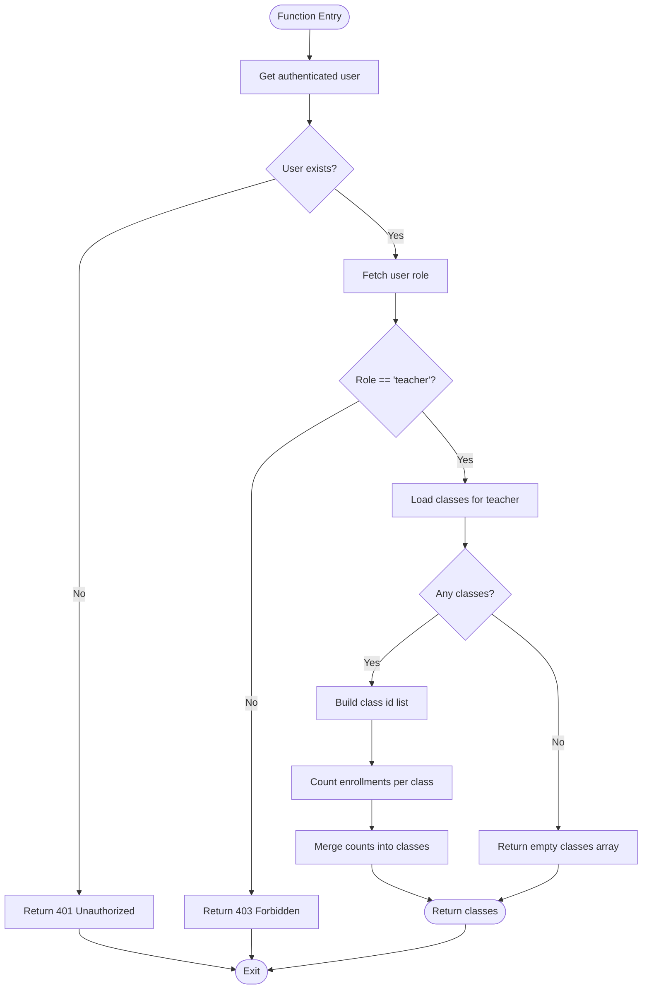
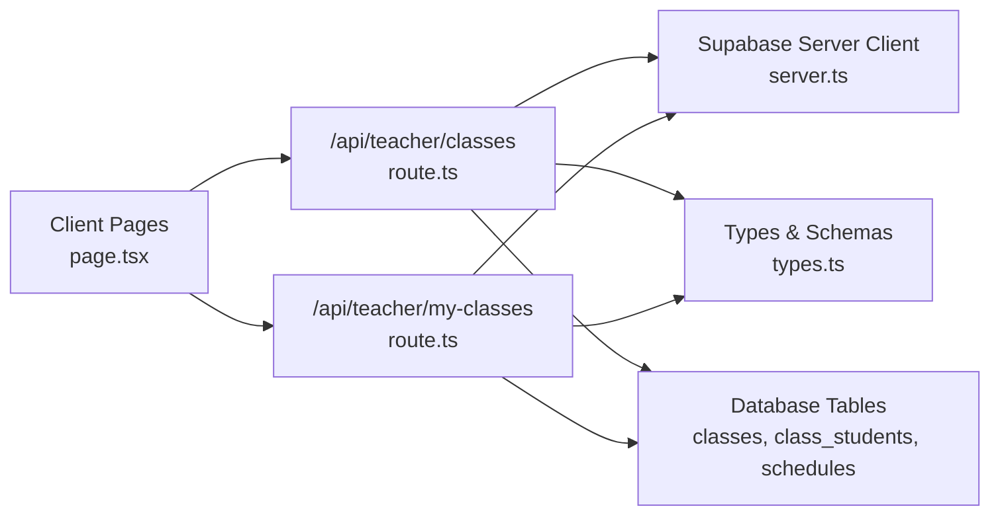
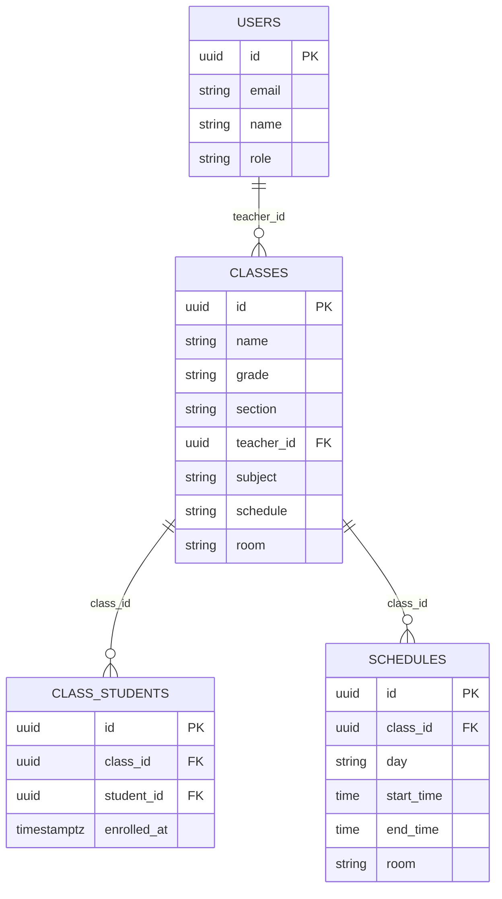

# Classes

<cite>
**Referenced Files in This Document**
- [route.ts](file://app/api/teacher/classes/route.ts)
- [route.ts](file://app/api/teacher/my-classes/route.ts)
- [queries-optimized.ts](file://lib/supabase/queries-optimized.ts)
- [types.ts](file://lib/supabase/types.ts)
- [page.tsx](file://app/teacher/classes/page.tsx)
- [page.tsx](file://app/teacher/assignments/page.tsx)
- [server.ts](file://lib/supabase/server.ts)
- [middleware.ts](file://lib/supabase/middleware.ts)
- [create_classes_table.sql](file://supabase/migrations/20251219043440_create_classes_table.sql)
- [create_schedule_table.sql](file://supabase/migrations/20251219043556_create_schedule_table.sql)
</cite>

## Table of Contents
1. [Introduction](#introduction)
2. [Project Structure](#project-structure)
3. [Core Components](#core-components)
4. [Architecture Overview](#architecture-overview)
5. [Detailed Component Analysis](#detailed-component-analysis)
6. [Dependency Analysis](#dependency-analysis)
7. [Performance Considerations](#performance-considerations)
8. [Troubleshooting Guide](#troubleshooting-guide)
9. [Conclusion](#conclusion)
10. [Appendices](#appendices)

## Introduction
This document provides detailed API documentation for teacher class management endpoints in the School Management System. It focuses on:
- GET /api/teacher/classes: Returns detailed class information including student counts, schedule, and room assignment for all classes owned by the authenticated teacher.
- GET /api/teacher/my-classes: Returns minimal class metadata (id, name, grade, section) for navigation and selection, optimized for fast loading.

It explains authentication requirements (teacher role), response schemas, database JOINs and enrollment counting logic, performance optimizations using lib/supabase/queries-optimized.ts, and practical examples for populating class dashboards and dropdown selectors.

## Project Structure
The relevant implementation spans API routes, frontend pages, Supabase utilities, and database migrations.

**Diagram sources**
- [route.ts](file://app/api/teacher/classes/route.ts#L1-L59)
- [route.ts](file://app/api/teacher/my-classes/route.ts#L1-L35)
- [page.tsx](file://app/teacher/classes/page.tsx#L1-L122)
- [page.tsx](file://app/teacher/assignments/page.tsx#L1-L43)
- [server.ts](file://lib/supabase/server.ts#L1-L51)
- [queries-optimized.ts](file://lib/supabase/queries-optimized.ts#L1-L317)
- [types.ts](file://lib/supabase/types.ts#L1-L253)
- [create_classes_table.sql](file://supabase/migrations/20251219043440_create_classes_table.sql#L1-L23)
- [create_schedule_table.sql](file://supabase/migrations/20251219043556_create_schedule_table.sql#L1-L11)

**Section sources**
- [route.ts](file://app/api/teacher/classes/route.ts#L1-L59)
- [route.ts](file://app/api/teacher/my-classes/route.ts#L1-L35)
- [page.tsx](file://app/teacher/classes/page.tsx#L1-L122)
- [page.tsx](file://app/teacher/assignments/page.tsx#L1-L43)
- [server.ts](file://lib/supabase/server.ts#L1-L51)
- [queries-optimized.ts](file://lib/supabase/queries-optimized.ts#L1-L317)
- [types.ts](file://lib/supabase/types.ts#L1-L253)
- [create_classes_table.sql](file://supabase/migrations/20251219043440_create_classes_table.sql#L1-L23)
- [create_schedule_table.sql](file://supabase/migrations/20251219043556_create_schedule_table.sql#L1-L11)

## Core Components
- Authentication and Authorization:
  - Both endpoints authenticate the caller and verify the user’s role equals “teacher” before proceeding.
  - Authentication is performed server-side using the Supabase server client.
- Endpoint A: GET /api/teacher/classes
  - Retrieves all classes owned by the teacher.
  - Computes student counts by grouping enrollments from the class_students table.
  - Returns detailed fields including schedule and room assignment.
- Endpoint B: GET /api/teacher/my-classes
  - Retrieves minimal metadata (id, name, grade, section) for quick navigation and selection.
  - Optimized for fast loading with fewer fields and simpler queries.
- Frontend Usage:
  - The teacher classes page consumes Endpoint A to populate class cards with student counts, schedule, and room.
  - The teacher assignments page consumes Endpoint B to populate dropdown selectors for class selection.

**Section sources**
- [route.ts](file://app/api/teacher/classes/route.ts#L1-L59)
- [route.ts](file://app/api/teacher/my-classes/route.ts#L1-L35)
- [page.tsx](file://app/teacher/classes/page.tsx#L1-L122)
- [page.tsx](file://app/teacher/assignments/page.tsx#L1-L43)

## Architecture Overview
The teacher class endpoints follow a consistent flow:
- Authenticate user and confirm teacher role.
- Query the database for class records owned by the teacher.
- Enrich data with student counts via a secondary query and aggregation.
- Return structured JSON responses tailored to the endpoint’s purpose.

**Diagram sources**
- [route.ts](file://app/api/teacher/classes/route.ts#L1-L59)
- [route.ts](file://app/api/teacher/my-classes/route.ts#L1-L35)
- [server.ts](file://lib/supabase/server.ts#L1-L51)

## Detailed Component Analysis

### GET /api/teacher/classes
Purpose:
- Provide detailed class information for the teacher’s dashboard, including student counts, schedule, and room assignment.

Processing Logic:
- Authentication and Role Check:
  - Uses the server client to get the current user.
  - Confirms the user’s role is “teacher”; otherwise returns 403 Forbidden.
- Retrieve Owned Classes:
  - Selects id, name, grade, section, subject, schedule, room from the classes table where teacher_id equals the authenticated user’s id.
  - Orders by name for consistent presentation.
- Compute Student Counts:
  - Collects class ids from the initial query.
  - Performs a grouped count on class_students to compute enrollments per class.
  - Merges counts into the class objects, defaulting to 0 when no enrollments exist.
- Response:
  - Returns a JSON object containing an array of classes with student_count included.

Response Schema:
- Root object:
  - classes: array of class objects
- Class object:
  - id: string
  - name: string
  - grade: string
  - section: string
  - subject: string
  - schedule: string | null
  - room: string | null
  - student_count: number

Performance Notes:
- Two round-trips to the database: one for classes and one for enrollment counts.
- Aggregation is performed in memory; consider using a single query with JOINs and GROUP BY for larger datasets.

Use Cases:
- Populate class dashboard cards with student counts, schedule, and room.
- Drive detailed class views and analytics.

**Section sources**
- [route.ts](file://app/api/teacher/classes/route.ts#L1-L59)
- [types.ts](file://lib/supabase/types.ts#L114-L124)
- [create_classes_table.sql](file://supabase/migrations/20251219043440_create_classes_table.sql#L1-L23)

#### Algorithm Flow (Enrollment Counting)

**Diagram sources**
- [route.ts](file://app/api/teacher/classes/route.ts#L1-L59)

### GET /api/teacher/my-classes
Purpose:
- Provide minimal class metadata for navigation and selection, optimized for fast loading.

Processing Logic:
- Authentication and Role Check:
  - Same as Endpoint A: authenticate user and verify role equals “teacher”.
- Retrieve Minimal Metadata:
  - Selects id, name, grade, section from the classes table where teacher_id equals the authenticated user’s id.
  - Orders by name for consistent presentation.
- Response:
  - Returns a JSON object containing an array of minimal class objects.

Response Schema:
- Root object:
  - classes: array of class objects
- Class object:
  - id: string
  - name: string
  - grade: string
  - section: string

Use Cases:
- Populate dropdown selectors for class switching or assignment creation.
- Drive lightweight navigation lists.

**Section sources**
- [route.ts](file://app/api/teacher/my-classes/route.ts#L1-L35)
- [types.ts](file://lib/supabase/types.ts#L114-L124)
- [create_classes_table.sql](file://supabase/migrations/20251219043440_create_classes_table.sql#L1-L23)

### Frontend Integration Examples
- Class Dashboard:
  - The teacher classes page calls GET /api/teacher/classes and renders cards with student_count, schedule, and room.
  - Example usage path: [page.tsx](file://app/teacher/classes/page.tsx#L1-L122)
- Dropdown Selector:
  - The teacher assignments page calls GET /api/teacher/my-classes to populate a dropdown with id and name for class selection.
  - Example usage path: [page.tsx](file://app/teacher/assignments/page.tsx#L1-L43)

**Section sources**
- [page.tsx](file://app/teacher/classes/page.tsx#L1-L122)
- [page.tsx](file://app/teacher/assignments/page.tsx#L1-L43)

### Database JOINs and Enrollment Counting Logic
- Classes and Enrollments:
  - The classes table stores class metadata and links to users via teacher_id.
  - The class_students table enforces unique enrollments and enables counting via GROUP BY.
  - The enrollment counting logic aggregates rows from class_students grouped by class_id.
- Schedule:
  - The schedules table defines weekly schedule entries with day, start_time, end_time, and room.
  - The classes table includes a schedule field; depending on the UI, either the classes schedule field or joined schedule records can be used.

**Section sources**
- [create_classes_table.sql](file://supabase/migrations/20251219043440_create_classes_table.sql#L1-L23)
- [create_schedule_table.sql](file://supabase/migrations/20251219043556_create_schedule_table.sql#L1-L11)

### Relationship Between Endpoints and UI Contexts
- GET /api/teacher/classes:
  - Used by the teacher classes dashboard to show detailed information for each class.
  - Best for contexts requiring richer metadata (schedule, room, student count).
- GET /api/teacher/my-classes:
  - Used by the teacher assignments page and similar lightweight selections.
  - Best for dropdowns and navigation lists where minimal data suffices.

**Section sources**
- [page.tsx](file://app/teacher/classes/page.tsx#L1-L122)
- [page.tsx](file://app/teacher/assignments/page.tsx#L1-L43)

## Dependency Analysis
- API routes depend on:
  - Supabase server client for authentication and database access.
  - Types for consistent typing of database entities.
- Frontend pages depend on:
  - API routes for data.
  - UI components for rendering.

**Diagram sources**
- [page.tsx](file://app/teacher/classes/page.tsx#L1-L122)
- [page.tsx](file://app/teacher/assignments/page.tsx#L1-L43)
- [route.ts](file://app/api/teacher/classes/route.ts#L1-L59)
- [route.ts](file://app/api/teacher/my-classes/route.ts#L1-L35)
- [server.ts](file://lib/supabase/server.ts#L1-L51)
- [types.ts](file://lib/supabase/types.ts#L1-L253)
- [create_classes_table.sql](file://supabase/migrations/20251219043440_create_classes_table.sql#L1-L23)
- [create_schedule_table.sql](file://supabase/migrations/20251219043556_create_schedule_table.sql#L1-L11)

**Section sources**
- [route.ts](file://app/api/teacher/classes/route.ts#L1-L59)
- [route.ts](file://app/api/teacher/my-classes/route.ts#L1-L35)
- [server.ts](file://lib/supabase/server.ts#L1-L51)
- [types.ts](file://lib/supabase/types.ts#L1-L253)
- [create_classes_table.sql](file://supabase/migrations/20251219043440_create_classes_table.sql#L1-L23)
- [create_schedule_table.sql](file://supabase/migrations/20251219043556_create_schedule_table.sql#L1-L11)

## Performance Considerations
- Current Implementation:
  - Endpoint A performs two queries: one for classes and one for enrollment counts. This is acceptable for small to medium datasets but can be improved.
- Recommended Optimizations Using lib/supabase/queries-optimized.ts:
  - Use a single query with JOINs and aggregations to compute student counts inline, reducing round-trips.
  - Leverage optimized query patterns for pagination and caching where applicable.
- Practical Improvements:
  - Replace separate enrollment counting with a single SELECT that groups by class and includes a count.
  - Consider adding indexes on frequently queried columns (e.g., classes.teacher_id, class_students.class_id) to speed up filtering and grouping.
  - Cache responses for short durations on the client side to reduce repeated requests.

**Section sources**
- [queries-optimized.ts](file://lib/supabase/queries-optimized.ts#L1-L317)
- [route.ts](file://app/api/teacher/classes/route.ts#L1-L59)

## Troubleshooting Guide
Common Issues and Resolutions:
- Unauthorized Access:
  - Symptom: 401 Unauthorized.
  - Cause: Missing or invalid session cookie.
  - Resolution: Ensure the client is authenticated and the session is refreshed via middleware.
- Forbidden Access:
  - Symptom: 403 Forbidden.
  - Cause: User role is not “teacher”.
  - Resolution: Verify the user’s role in the users table and ensure the correct account is signed in.
- Empty Results:
  - Symptom: Empty classes array.
  - Cause: Teacher has no classes assigned.
  - Resolution: Confirm class assignments in the classes table and ensure teacher_id matches the authenticated user.
- Slow Loading:
  - Symptom: Delayed response for class dashboard.
  - Cause: Two separate queries for classes and counts.
  - Resolution: Apply the aggregated query pattern from queries-optimized.ts to combine counts into a single query.

**Section sources**
- [route.ts](file://app/api/teacher/classes/route.ts#L1-L59)
- [route.ts](file://app/api/teacher/my-classes/route.ts#L1-L35)
- [middleware.ts](file://lib/supabase/middleware.ts#L1-L38)

## Conclusion
The teacher class management endpoints provide complementary data for different UI contexts. Endpoint A delivers rich, detailed information suitable for dashboards, while Endpoint B offers minimal metadata for quick navigation and selection. By adopting the optimized query patterns from lib/supabase/queries-optimized.ts, the system can reduce database round-trips and improve responsiveness. Proper authentication checks and consistent response schemas ensure reliable integrations across frontend components.

## Appendices

### API Definitions

- GET /api/teacher/classes
  - Description: Retrieve detailed class information for the authenticated teacher, including student counts, schedule, and room assignment.
  - Authentication: Requires a valid session; user role must be “teacher”.
  - Response: { classes: [ { id, name, grade, section, subject, schedule, room, student_count }, ... ] }
  - Status Codes:
    - 200 OK: Successful retrieval.
    - 401 Unauthorized: No authenticated user.
    - 403 Forbidden: User is not a teacher.
    - 500 Internal Server Error: Unexpected error.

- GET /api/teacher/my-classes
  - Description: Retrieve minimal class metadata (id, name, grade, section) for navigation and selection.
  - Authentication: Requires a valid session; user role must be “teacher”.
  - Response: { classes: [ { id, name, grade, section }, ... ] }
  - Status Codes:
    - 200 OK: Successful retrieval.
    - 401 Unauthorized: No authenticated user.
    - 403 Forbidden: User is not a teacher.
    - 500 Internal Server Error: Unexpected error.

**Section sources**
- [route.ts](file://app/api/teacher/classes/route.ts#L1-L59)
- [route.ts](file://app/api/teacher/my-classes/route.ts#L1-L35)

### Database Model Overview

**Diagram sources**
- [create_classes_table.sql](file://supabase/migrations/20251219043440_create_classes_table.sql#L1-L23)
- [create_schedule_table.sql](file://supabase/migrations/20251219043556_create_schedule_table.sql#L1-L11)