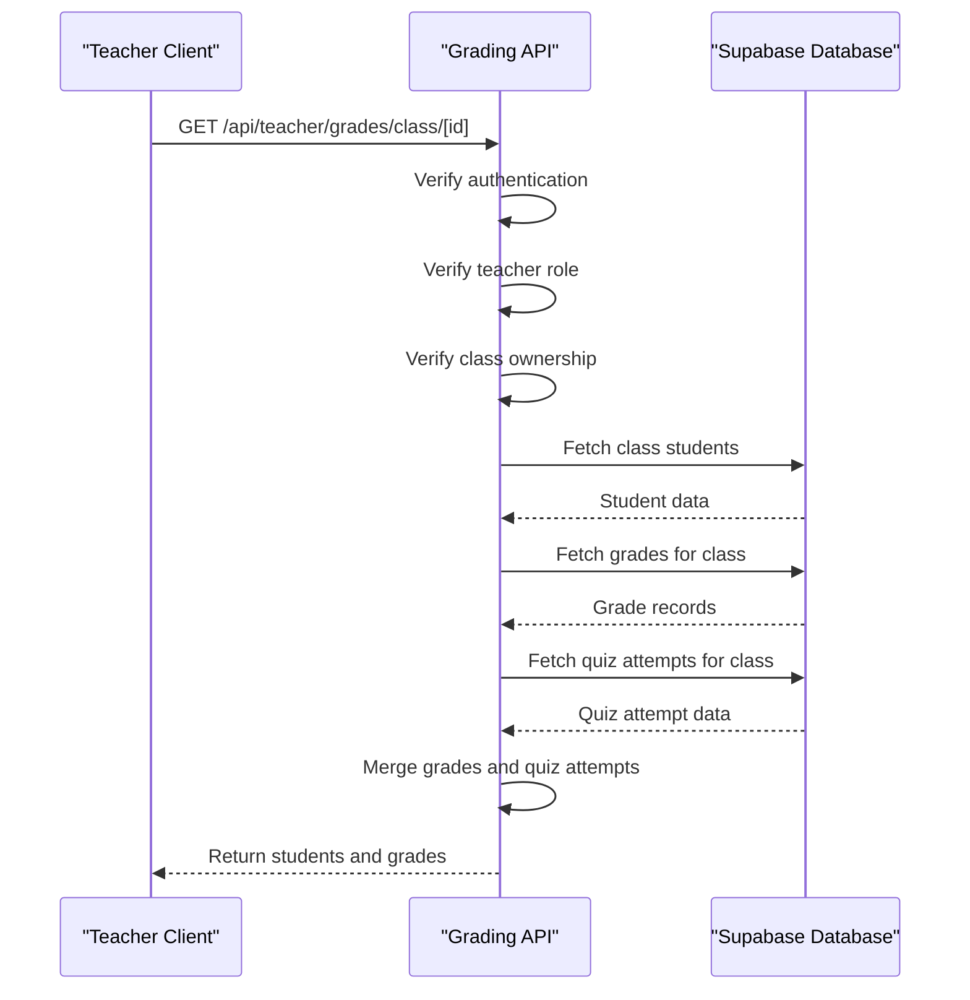
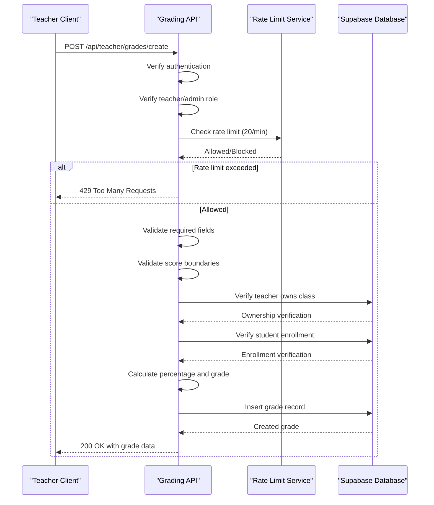
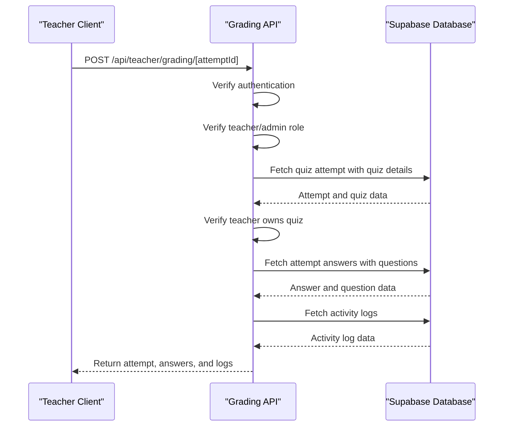
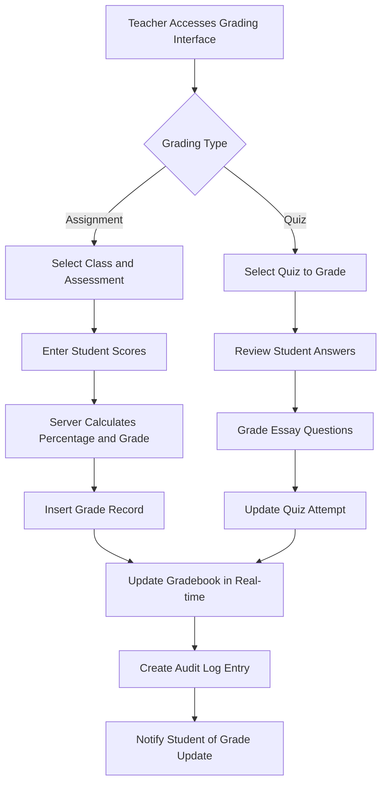
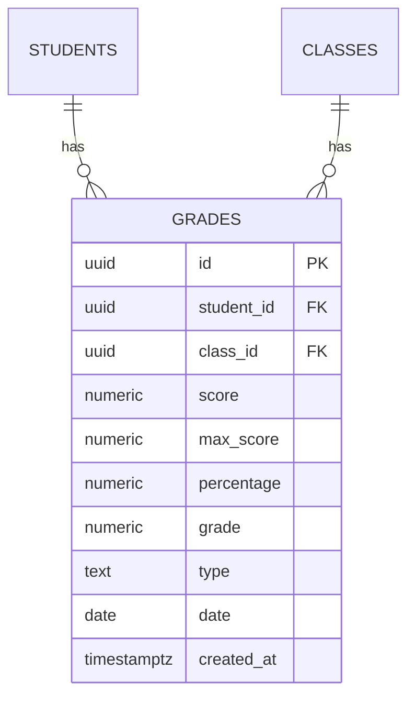
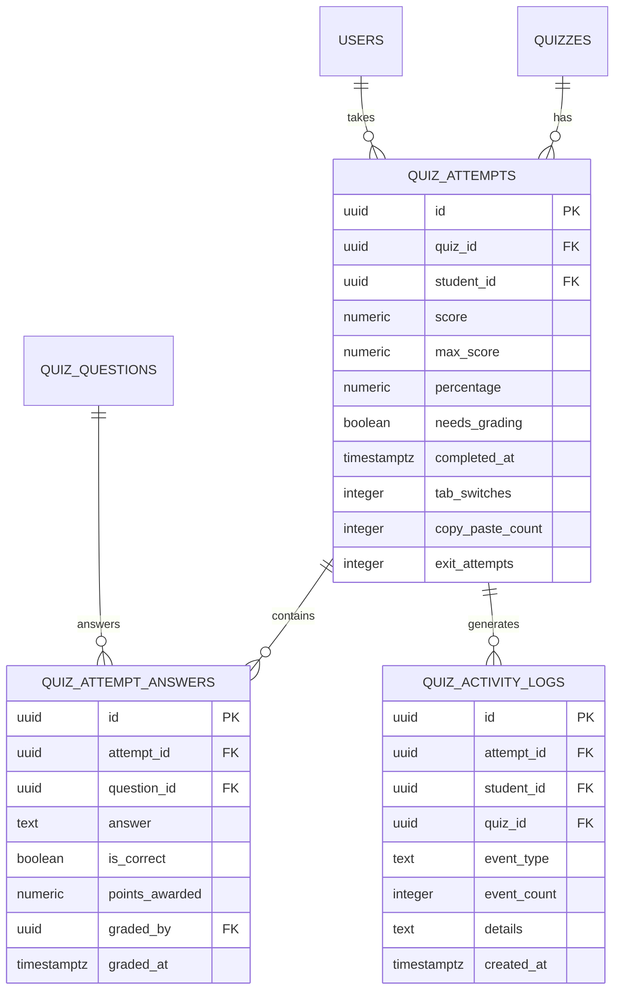
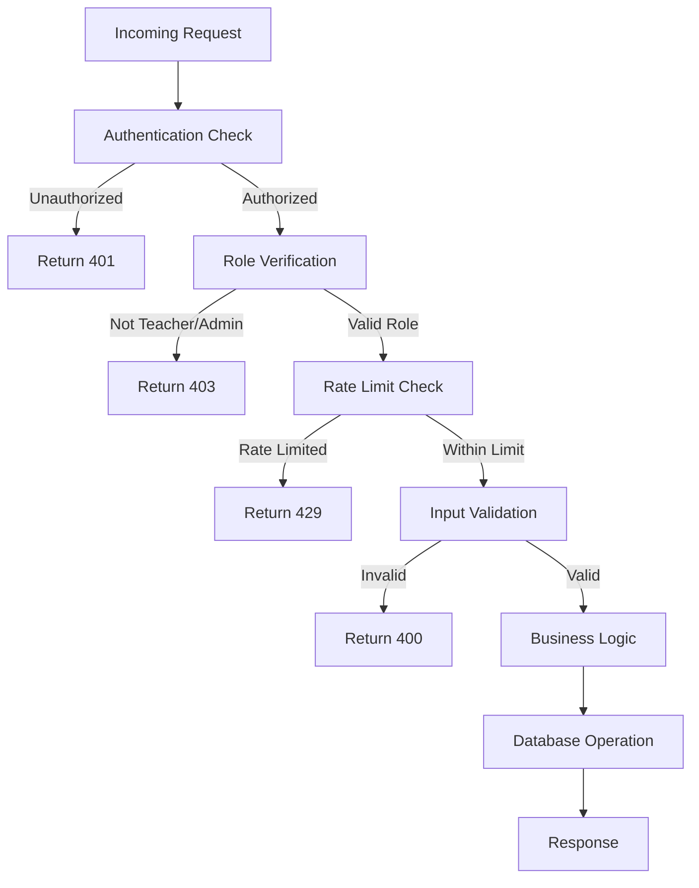
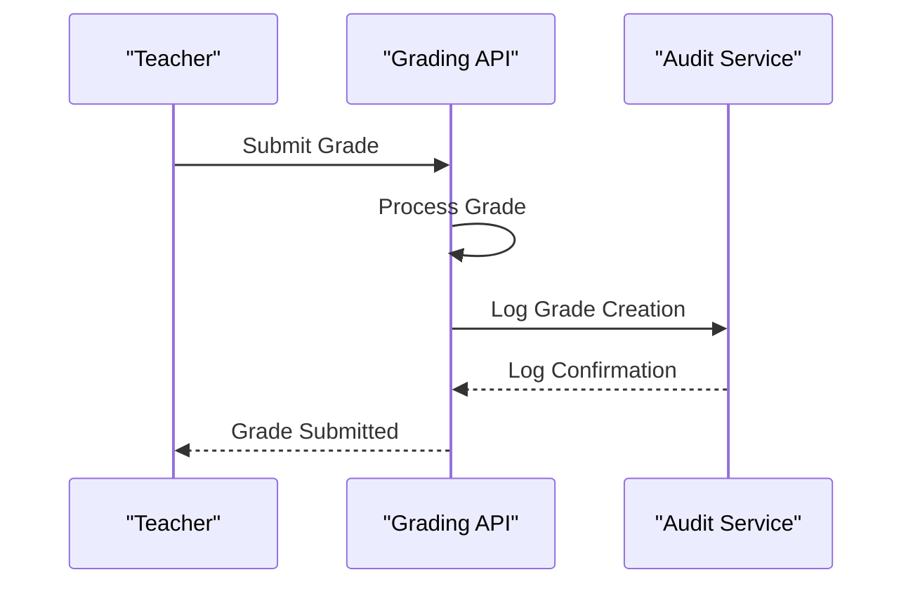

# Grading

<cite>
**Referenced Files in This Document**   
- [route.ts](file://app/api/teacher/grades/class/[id]/route.ts)
- [route.ts](file://app/api/teacher/grades/create/route.ts)
- [route.ts](file://app/api/teacher/grading/[attemptId]/route.ts)
- [grade-utils.ts](file://lib/grade-utils.ts)
- [rate-limit.ts](file://lib/rate-limit.ts)
- [queries.ts](file://lib/supabase/queries.ts)
- [types.ts](file://lib/supabase/types.ts)
- [20251219043509_create_grades_tables.sql](file://supabase/migrations/20251219043509_create_grades_tables.sql)
- [20251219105024_create_quiz_attempt_answers.sql](file://supabase/migrations/20251219105024_create_quiz_attempt_answers.sql)
- [20251219112310_create_quiz_activity_logs.sql](file://supabase/migrations/20251219112310_create_quiz_activity_logs.sql)
- [audit-logs.ts](file://lib/supabase/audit-logs.ts)
- [logger.ts](file://lib/logger.ts)
</cite>

## Table of Contents
1. [Introduction](#introduction)
2. [API Endpoints](#api-endpoints)
   - [GET /api/teacher/grades/class/[id]](#get-apiteachergradesclassid)
   - [POST /api/teacher/grades/create](#post-apiteachergradescreate)
   - [POST /api/teacher/grading/[attemptId]](#post-apiteachergradingattemptid)
3. [Grading Workflows](#grading-workflows)
4. [Data Models](#data-models)
5. [Security and Validation](#security-and-validation)
6. [Error Handling](#error-handling)
7. [Examples](#examples)
8. [Audit Logging](#audit-logging)

## Introduction
This document provides comprehensive API documentation for teacher grading endpoints in the School-Management-System. The grading system enables teachers to retrieve student rosters, submit grades for various assessment types, and grade quiz attempts with detailed answer review. The system implements robust security measures including role-based authentication, ownership verification, rate limiting, and audit logging to ensure data integrity and prevent abuse.

The grading functionality is designed to support the Philippine grading system, with server-side conversion of percentage scores to standardized Philippine grades using the `percentageToPhGrade` utility. The system integrates with real-time gradebook updates and provides comprehensive audit trails for all grading activities.

**Section sources**
- [route.ts](file://app/api/teacher/grades/class/[id]/route.ts)
- [grade-utils.ts](file://lib/grade-utils.ts)

## API Endpoints

### GET /api/teacher/grades/class/[id]
Retrieves the student roster and associated grades for a teacher-owned class. This endpoint validates teacher authentication and ownership of the specified class before returning student data and grades.

#### Request
- **Method**: GET
- **URL**: `/api/teacher/grades/class/[id]`
- **Authentication**: Bearer token (teacher role required)
- **Path Parameters**:
  - `id`: Class ID (UUID)

#### Response
Returns a JSON object containing:
- `students`: Array of student objects with ID, name, email, and avatar
- `grades`: Array of grade objects including score, percentage, and calculated Philippine grade



**Diagram sources**
- [route.ts](file://app/api/teacher/grades/class/[id]/route.ts)
- [queries.ts](file://lib/supabase/queries.ts)

**Section sources**
- [route.ts](file://app/api/teacher/grades/class/[id]/route.ts)

### POST /api/teacher/grades/create
Submits a new grade record for a student in a teacher-owned class. This endpoint validates student enrollment, score boundaries, and teacher ownership of the class, with server-side percentage calculation using the `percentageToPhGrade` utility.

#### Request
- **Method**: POST
- **URL**: `/api/teacher/grades/create`
- **Authentication**: Bearer token (teacher or admin role required)
- **Rate Limit**: 20 requests per minute per teacher
- **Request Body**:
```json
{
  "studentId": "string",
  "classId": "string",
  "score": "number",
  "maxScore": "number",
  "type": "exam|quiz|assignment|project",
  "date": "string (YYYY-MM-DD)"
}
```

#### Response
Returns a JSON object with:
- `success`: Boolean indicating success
- `grade`: Created grade object with calculated percentage and Philippine grade



**Diagram sources**
- [route.ts](file://app/api/teacher/grades/create/route.ts)
- [rate-limit.ts](file://lib/rate-limit.ts)
- [grade-utils.ts](file://lib/grade-utils.ts)

**Section sources**
- [route.ts](file://app/api/teacher/grades/create/route.ts)

### POST /api/teacher/grading/[attemptId]
Grades a quiz attempt with detailed answer review. This endpoint provides transactional updates to both quiz_attempts and student_grades tables, ensuring data consistency during the grading process.

#### Request
- **Method**: POST
- **URL**: `/api/teacher/grading/[attemptId]`
- **Authentication**: Bearer token (teacher or admin role required)
- **Path Parameters**:
  - `attemptId`: Quiz attempt ID (UUID)

#### Response
Returns a JSON object containing:
- `attempt`: Quiz attempt details including score metrics
- `answers`: Array of answer objects with question details and grading status
- `logs`: Array of activity logs for anti-cheating monitoring



**Diagram sources**
- [route.ts](file://app/api/teacher/grading/[attemptId]/route.ts)
- [20251219105024_create_quiz_attempt_answers.sql](file://supabase/migrations/20251219105024_create_quiz_attempt_answers.sql)
- [20251219112310_create_quiz_activity_logs.sql](file://supabase/migrations/20251219112310_create_quiz_activity_logs.sql)

**Section sources**
- [route.ts](file://app/api/teacher/grading/[attemptId]/route.ts)

## Grading Workflows
The grading system supports two primary workflows: assignment grading and quiz assessment. Both workflows integrate with real-time gradebook updates and audit logging.

### Assignment Grading Workflow
1. Teacher selects a class and assessment type
2. System validates teacher ownership of the class
3. Teacher enters student scores with maximum possible score
4. System calculates percentage and Philippine grade server-side
5. Grade record is inserted into the database
6. Real-time gradebook updates notify students
7. Audit log records the grading activity

### Quiz Assessment Workflow
1. Teacher selects a quiz to grade
2. System verifies teacher ownership of the quiz
3. Teacher reviews student answers with question details
4. Teacher sees anti-cheating metrics (tab switches, copy/paste attempts)
5. Teacher grades essay questions and adjusts scores if needed
6. System updates quiz attempt with final score and percentage
7. Grade record is created in the grades table
8. Real-time updates are sent to the student's gradebook



**Diagram sources**
- [route.ts](file://app/api/teacher/grades/create/route.ts)
- [route.ts](file://app/api/teacher/grading/[attemptId]/route.ts)
- [audit-logs.ts](file://lib/supabase/audit-logs.ts)

**Section sources**
- [route.ts](file://app/api/teacher/grades/create/route.ts)
- [route.ts](file://app/api/teacher/grading/[attemptId]/route.ts)

## Data Models
The grading system uses several interconnected database tables to store grade-related data.

### Grades Table
Stores individual grade records for students across various assessment types.



**Diagram sources**
- [20251219043509_create_grades_tables.sql](file://supabase/migrations/20251219043509_create_grades_tables.sql)
- [types.ts](file://lib/supabase/types.ts)

### Quiz Attempts and Answers
Stores quiz attempt data with detailed answer records for grading.



**Diagram sources**
- [20251219105024_create_quiz_attempt_answers.sql](file://supabase/migrations/20251219105024_create_quiz_attempt_answers.sql)
- [20251219112310_create_quiz_activity_logs.sql](file://supabase/migrations/20251219112310_create_quiz_activity_logs.sql)
- [types.ts](file://lib/supabase/types.ts)

## Security and Validation
The grading system implements multiple layers of security and validation to ensure data integrity and prevent unauthorized access.

### Authentication and Authorization
- All grading endpoints require authentication via Bearer token
- Teachers can only grade their own classes and quizzes
- Admin users have elevated privileges to access any grading data
- Role verification occurs server-side for every request

### Input Validation
- Required fields validation for all grade submissions
- Score boundary validation (score cannot exceed max_score)
- Numeric value validation for score and max_score
- Date format validation for grade date

### Rate Limiting
- 20 grade submissions per minute per teacher
- Uses user ID as identifier to prevent shared IP blocking
- Implemented using Supabase RPC with atomic operations
- Fail-open behavior for availability during database issues



**Diagram sources**
- [route.ts](file://app/api/teacher/grades/create/route.ts)
- [rate-limit.ts](file://lib/rate-limit.ts)

**Section sources**
- [route.ts](file://app/api/teacher/grades/create/route.ts)
- [rate-limit.ts](file://lib/rate-limit.ts)

## Error Handling
The grading system implements comprehensive error handling with appropriate HTTP status codes and descriptive error messages.

### Error Codes
- **400 Bad Request**: Missing required fields or invalid input
- **401 Unauthorized**: Missing or invalid authentication token
- **403 Forbidden**: Insufficient permissions or ownership violation
- **404 Not Found**: Resource not found (e.g., quiz attempt)
- **429 Too Many Requests**: Rate limit exceeded
- **500 Internal Server Error**: Unexpected server error

### Error Response Format
```json
{
  "error": "Descriptive error message"
}
```

**Section sources**
- [route.ts](file://app/api/teacher/grades/class/[id]/route.ts)
- [route.ts](file://app/api/teacher/grades/create/route.ts)
- [route.ts](file://app/api/teacher/grading/[attemptId]/route.ts)

## Examples

### Grading an Assignment
**Request**:
```http
POST /api/teacher/grades/create
Content-Type: application/json
Authorization: Bearer <teacher_token>

{
  "studentId": "a1b2c3d4-e5f6-7890-g1h2-i3j4k5l6m7n8",
  "classId": "p9q0r1s2-t3u4-5678-v9w0-x1y2z3a4b5c6",
  "score": 85,
  "maxScore": 100,
  "type": "assignment",
  "date": "2025-01-15"
}
```

**Response**:
```json
{
  "success": true,
  "grade": {
    "id": "d4e5f6g7-h8i9-0123-j4k5-l6m7n8o9p0q1",
    "student_id": "a1b2c3d4-e5f6-7890-g1h2-i3j4k5l6m7n8",
    "class_id": "p9q0r1s2-t3u4-5678-v9w0-x1y2z3a4b5c6",
    "score": 85,
    "max_score": 100,
    "percentage": 85,
    "grade": 92,
    "type": "assignment",
    "date": "2025-01-15",
    "created_at": "2025-01-15T10:30:00Z"
  }
}
```

### Assessing a Quiz Attempt
**Request**:
```http
GET /api/teacher/grading/a1b2c3d4-e5f6-7890-g1h2-i3j4k5l6m7n8
Authorization: Bearer <teacher_token>
```

**Response**:
```json
{
  "attempt": {
    "id": "a1b2c3d4-e5f6-7890-g1h2-i3j4k5l6m7n8",
    "quiz_id": "p9q0r1s2-t3u4-5678-v9w0-x1y2z3a4b5c6",
    "student_id": "d4e5f6g7-h8i9-0123-j4k5-l6m7n8o9p0q1",
    "score": 0,
    "max_score": 100,
    "percentage": 0,
    "needs_grading": true,
    "completed_at": "2025-01-15T09:45:00Z",
    "tab_switches": 3,
    "copy_paste_count": 2,
    "exit_attempts": 1
  },
  "answers": [
    {
      "id": "e5f6g7h8-i9j0-1234-k5l6-m7n8o9p0q1r2",
      "attempt_id": "a1b2c3d4-e5f6-7890-g1h2-i3j4k5l6m7n8",
      "question_id": "r3s4t5u6-v7w8-9012-x3y4-z5a6b7c8d9e0",
      "answer": "Photosynthesis",
      "is_correct": false,
      "points_awarded": 0,
      "question": {
        "id": "r3s4t5u6-v7w8-9012-x3y4-z5a6b7c8d9e0",
        "question": "What process do plants use to convert sunlight into energy?",
        "type": "identification",
        "options": null,
        "correct_answer": "Photosynthesis",
        "points": 10
      }
    }
  ],
  "logs": [
    {
      "id": "f6g7h8i9-j0k1-2345-l6m7-n8o9p0q1r2s3",
      "event_type": "tab_switch",
      "details": "Switched to tab: Google Search",
      "created_at": "2025-01-15T09:46:30Z"
    }
  ]
}
```

**Section sources**
- [route.ts](file://app/api/teacher/grades/create/route.ts)
- [route.ts](file://app/api/teacher/grading/[attemptId]/route.ts)

## Audit Logging
All grading activities are recorded in the audit log system for accountability and security monitoring.

### Logged Events
- Grade creation
- Quiz grading
- Grade modifications
- Failed grading attempts

### Audit Log Structure
Audit logs capture the following information:
- User ID and role
- Action performed
- IP address
- Timestamp
- Relevant payload data

The system includes utilities for querying audit logs, generating statistics, and detecting suspicious activity patterns such as multiple failed grading attempts.



**Diagram sources**
- [audit-logs.ts](file://lib/supabase/audit-logs.ts)
- [logger.ts](file://lib/logger.ts)

**Section sources**
- [audit-logs.ts](file://lib/supabase/audit-logs.ts)
- [logger.ts](file://lib/logger.ts)