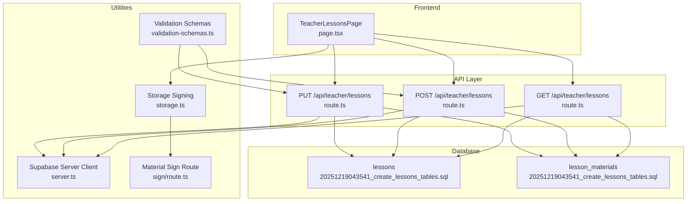
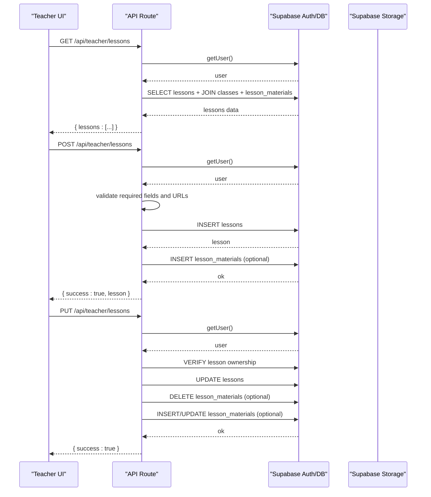
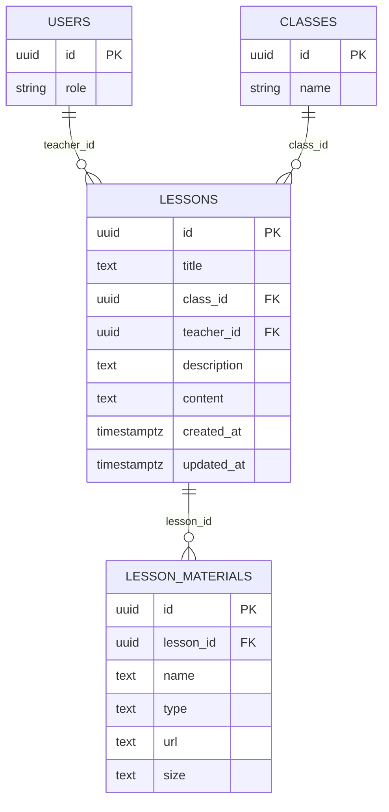
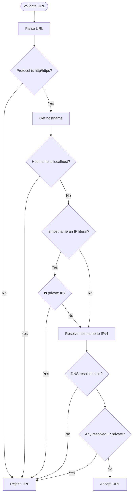
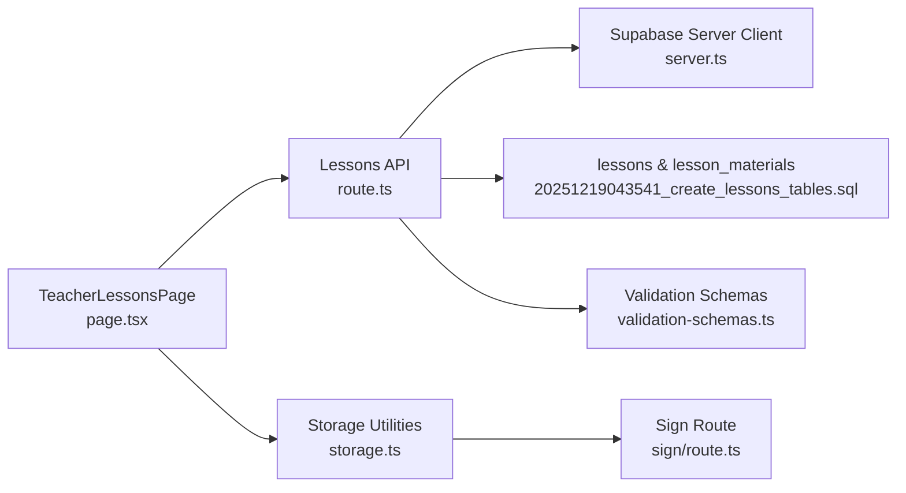

# Lessons

<cite>
**Referenced Files in This Document**
- [route.ts](file://app/api/teacher/lessons/route.ts)
- [20251219043541_create_lessons_tables.sql](file://supabase/migrations/20251219043541_create_lessons_tables.sql)
- [page.tsx](file://app/teacher/lessons/page.tsx)
- [storage.ts](file://lib/supabase/storage.ts)
- [sign/route.ts](file://app/api/materials/sign/route.ts)
- [validation-schemas.ts](file://lib/validation-schemas.ts)
- [server.ts](file://lib/supabase/server.ts)
- [proxy.ts](file://proxy.ts)
</cite>

## Table of Contents
1. [Introduction](#introduction)
2. [Project Structure](#project-structure)
3. [Core Components](#core-components)
4. [Architecture Overview](#architecture-overview)
5. [Detailed Component Analysis](#detailed-component-analysis)
6. [Dependency Analysis](#dependency-analysis)
7. [Performance Considerations](#performance-considerations)
8. [Troubleshooting Guide](#troubleshooting-guide)
9. [Conclusion](#conclusion)
10. [Appendices](#appendices)

## Introduction
This document provides comprehensive API documentation for teacher lesson management endpoints in the School-Management-System. It covers:
- Retrieving all lessons created by a teacher with associated materials, including JOINs to classes and lesson_materials, and field sanitization to prevent XSS.
- Creating new lesson plans with title, description, content, and optional materials (documents, videos, links), including validation of required fields and teacher ownership of target class.
- Integration with the rich text editor, material upload workflow, and security measures such as URL validation to prevent SSRF.
- Authentication requirements (teacher role), request/response formats, and error handling.
- Practical examples for curriculum planning and resource sharing with students.

## Project Structure
The lessons feature spans API routes, database migrations, frontend pages, and shared utilities:
- API routes implement GET and POST for lessons and PUT for updates.
- Database migrations define lessons and lesson_materials tables with RLS enabled.
- Frontend pages integrate with the API and provide a rich text editor experience.
- Shared utilities support Supabase client creation, storage signing, and validation schemas.

**Diagram sources**
- [route.ts](file://app/api/teacher/lessons/route.ts#L56-L170)
- [20251219043541_create_lessons_tables.sql](file://supabase/migrations/20251219043541_create_lessons_tables.sql#L1-L23)
- [page.tsx](file://app/teacher/lessons/page.tsx#L90-L114)
- [server.ts](file://lib/supabase/server.ts#L1-L51)
- [storage.ts](file://lib/supabase/storage.ts#L97-L110)
- [sign/route.ts](file://app/api/materials/sign/route.ts#L89-L112)
- [validation-schemas.ts](file://lib/validation-schemas.ts#L8-L26)

**Section sources**
- [route.ts](file://app/api/teacher/lessons/route.ts#L56-L170)
- [20251219043541_create_lessons_tables.sql](file://supabase/migrations/20251219043541_create_lessons_tables.sql#L1-L23)
- [page.tsx](file://app/teacher/lessons/page.tsx#L90-L114)
- [server.ts](file://lib/supabase/server.ts#L1-L51)
- [storage.ts](file://lib/supabase/storage.ts#L97-L110)
- [sign/route.ts](file://app/api/materials/sign/route.ts#L89-L112)
- [validation-schemas.ts](file://lib/validation-schemas.ts#L8-L26)

## Core Components
- GET /api/teacher/lessons: Returns lessons created by the authenticated teacher, joined with class and materials data. Response includes sanitized fields to mitigate XSS risks.
- POST /api/teacher/lessons: Creates a new lesson with title and classId, and optional description, content, and materials. Validates required fields and URL safety for materials.
- PUT /api/teacher/lessons: Updates an existing lesson and manages materials, including deletion and updates with IDOR protections.

Key behaviors:
- Authentication: Requires a valid session; teacher or admin roles are accepted for GET.
- Authorization: POST/PUT enforce teacher ownership of the target class and lesson.
- Security: URL validation prevents SSRF to private/local networks; server-side DNS resolution mitigates rebinding.
- Data shaping: Response fields are explicitly selected and mapped to avoid exposing sensitive data.

**Section sources**
- [route.ts](file://app/api/teacher/lessons/route.ts#L56-L170)
- [route.ts](file://app/api/teacher/lessons/route.ts#L172-L253)

## Architecture Overview
The lessons API integrates with Supabase for authentication, authorization, and data persistence. The frontend interacts with the API to display lessons and materials, and uses signed URLs for secure access to stored resources.

**Diagram sources**
- [route.ts](file://app/api/teacher/lessons/route.ts#L56-L170)
- [route.ts](file://app/api/teacher/lessons/route.ts#L172-L253)
- [server.ts](file://lib/supabase/server.ts#L1-L51)

## Detailed Component Analysis

### GET /api/teacher/lessons
Purpose:
- Retrieve all lessons authored by the authenticated teacher, including associated class name and materials.

Behavior:
- Authentication: Requires a valid user session.
- Authorization: Accepts teacher or admin roles.
- Data retrieval: Performs a SELECT with JOINs to classes and lesson_materials, ordered by creation time.
- Field sanitization: Response data is mapped to a controlled shape, ensuring only safe fields are returned.

Request
- Method: GET
- Path: /api/teacher/lessons
- Headers: Authorization cookie/session-based (via Supabase SSR client)
- Query parameters: None

Response
- Status: 200 OK on success
- Body: lessons array containing:
  - id: string
  - title: string
  - description: string or null
  - content: string or null
  - class_id: string
  - class_name: string
  - materials: array of objects with keys id, name, type, url
  - updated_at: ISO timestamp

Security and validations
- Role check: teacher or admin
- Data exposure: Only explicitly selected fields are included in response

Common errors
- 401 Unauthorized: No active session
- 403 Forbidden: Non-teacher/non-admin role
- 500 Internal Server Error: Database or server error

**Section sources**
- [route.ts](file://app/api/teacher/lessons/route.ts#L56-L108)

### POST /api/teacher/lessons
Purpose:
- Create a new lesson with title and classId, and optional description, content, and materials.

Behavior:
- Authentication: Requires a valid teacher session.
- Validation:
  - Required fields: title, classId
  - Materials: If provided, each material’s URL is validated to prevent SSRF to private/local networks.
- Persistence:
  - Insert into lessons table with teacher_id derived from session.
  - Optionally insert into lesson_materials table for each valid material.

Request
- Method: POST
- Path: /api/teacher/lessons
- Headers: Content-Type: application/json
- Body fields:
  - title: string (required)
  - classId: UUID (required)
  - description: string (optional)
  - content: string (optional)
  - materials: array of objects (optional)
    - name: string
    - type: string (pdf, video, link, document)
    - url: string (must be http/https and pass validation)

Response
- Status: 200 OK on success
- Body: { success: true, lesson }

Security and validations
- Role check: teacher
- URL validation: Ensures protocol is http/https and resolves to public IPs; rejects private/local network ranges and localhost.
- Server-side DNS resolution: Mitigates DNS rebinding attacks.

Common errors
- 400 Bad Request: Missing required fields or invalid URL
- 401 Unauthorized: No active session
- 403 Forbidden: Non-teacher role
- 500 Internal Server Error: Database or server error

**Section sources**
- [route.ts](file://app/api/teacher/lessons/route.ts#L110-L170)

### PUT /api/teacher/lessons
Purpose:
- Update an existing lesson and manage associated materials (add, update, delete).

Behavior:
- Authentication: Requires a valid teacher session.
- Ownership verification: Ensures the lesson belongs to the current teacher.
- Material management:
  - Delete materials by IDs (with IDOR protection).
  - Insert new materials (marked as isNew).
  - Update existing materials (with IDOR protection).
- Persistence: Updates lessons and lesson_materials accordingly.

Request
- Method: PUT
- Path: /api/teacher/lessons
- Headers: Content-Type: application/json
- Body fields:
  - id: UUID (required)
  - title: string (required)
  - classId: UUID (required)
  - description: string (optional)
  - content: string (optional)
  - materials: array of objects (optional)
    - id: string (UUID or temp id)
    - name: string
    - type: string
    - url: string (optional)
    - isNew: boolean (optional)
  - deletedMaterialIds: array of material ids to remove (optional)

Response
- Status: 200 OK on success
- Body: { success: true }

Security and validations
- Role check: teacher
- Ownership checks: Ensures lesson.teacher_id matches current user.
- IDOR protection: Deletes and updates are scoped to the lesson’s materials.

Common errors
- 400 Bad Request: Invalid URL or malformed payload
- 401 Unauthorized: No active session
- 403 Forbidden: Not authorized to modify the lesson
- 500 Internal Server Error: Database or server error

**Section sources**
- [route.ts](file://app/api/teacher/lessons/route.ts#L172-L253)

### Frontend Integration and Rich Text Editor
The teacher lessons page integrates with the API and provides a rich text editor experience:
- Fetch lessons via GET /api/teacher/lessons and render cards with class name and material counts.
- Create lessons using POST /api/teacher/lessons with title, classId, description, content, and materials.
- Edit lessons using PUT /api/teacher/lessons with support for adding/removing/updating materials.
- Client-side URL validation complements server-side checks.

Request/response formats
- Creation and update payloads mirror the backend schemas (title, classId, description, content, materials).
- Response bodies are standardized across endpoints.

**Section sources**
- [page.tsx](file://app/teacher/lessons/page.tsx#L90-L114)
- [page.tsx](file://app/teacher/lessons/page.tsx#L153-L184)
- [page.tsx](file://app/teacher/lessons/page.tsx#L235-L266)

### Material Upload Workflow and Security
Material handling:
- Materials can be stored as links (URLs) or uploaded files. For uploaded files, the system uses Supabase Storage with signed URLs for secure access.
- Signed URLs are generated server-side with short expiration to minimize risk.

Workflow
- Students click a material link in the UI.
- The UI requests a signed URL from /api/materials/sign.
- The sign route validates access and generates a short-lived signed URL.
- The UI opens the signed URL in a new tab/window.

Security measures
- Signed URL expiry is limited (e.g., 5 minutes).
- Signed URL validation prevents open redirects to unauthorized hosts.
- URL validation for lesson materials prevents SSRF to private/local networks.

**Section sources**
- [storage.ts](file://lib/supabase/storage.ts#L97-L110)
- [sign/route.ts](file://app/api/materials/sign/route.ts#L89-L112)
- [page.tsx](file://app/student/lessons/page.tsx#L99-L131)

### Database Schema and Relationships
The lessons feature relies on two tables with RLS enabled:
- lessons: Stores lesson metadata and references to classes and users.
- lesson_materials: Stores materials linked to lessons with type and URL.

**Diagram sources**
- [20251219043541_create_lessons_tables.sql](file://supabase/migrations/20251219043541_create_lessons_tables.sql#L1-L23)

**Section sources**
- [20251219043541_create_lessons_tables.sql](file://supabase/migrations/20251219043541_create_lessons_tables.sql#L1-L23)

### URL Validation and SSRF Prevention
The API implements robust URL validation to prevent SSRF:
- Protocol enforcement: Only http/https are allowed.
- Private IP blocking: Rejects private/local network ranges and localhost.
- DNS resolution: Resolves hostnames to IPv4 addresses and rejects private IPs.
- Rejection on DNS failure: Prevents DNS rebinding by failing closed.

**Diagram sources**
- [route.ts](file://app/api/teacher/lessons/route.ts#L21-L54)

**Section sources**
- [route.ts](file://app/api/teacher/lessons/route.ts#L21-L54)

## Dependency Analysis
- API routes depend on Supabase server client for authentication and database operations.
- Frontend pages depend on the API routes and storage utilities for signed URLs.
- Validation schemas define constraints for lesson creation and updates.

**Diagram sources**
- [page.tsx](file://app/teacher/lessons/page.tsx#L90-L114)
- [route.ts](file://app/api/teacher/lessons/route.ts#L56-L170)
- [server.ts](file://lib/supabase/server.ts#L1-L51)
- [20251219043541_create_lessons_tables.sql](file://supabase/migrations/20251219043541_create_lessons_tables.sql#L1-L23)
- [storage.ts](file://lib/supabase/storage.ts#L97-L110)
- [sign/route.ts](file://app/api/materials/sign/route.ts#L89-L112)
- [validation-schemas.ts](file://lib/validation-schemas.ts#L8-L26)

**Section sources**
- [page.tsx](file://app/teacher/lessons/page.tsx#L90-L114)
- [route.ts](file://app/api/teacher/lessons/route.ts#L56-L170)
- [server.ts](file://lib/supabase/server.ts#L1-L51)
- [20251219043541_create_lessons_tables.sql](file://supabase/migrations/20251219043541_create_lessons_tables.sql#L1-L23)
- [storage.ts](file://lib/supabase/storage.ts#L97-L110)
- [sign/route.ts](file://app/api/materials/sign/route.ts#L89-L112)
- [validation-schemas.ts](file://lib/validation-schemas.ts#L8-L26)

## Performance Considerations
- Database joins: The GET endpoint performs JOINs to classes and lesson_materials; ensure indexes exist on foreign keys (class_id, teacher_id, lesson_id) for optimal performance.
- Pagination: For large datasets, consider adding pagination to reduce payload sizes.
- Material URLs: Avoid storing extremely large URLs or excessive materials per lesson to keep response sizes manageable.
- Signed URL caching: For frequently accessed materials, consider caching signed URLs on the server to reduce repeated storage calls.

[No sources needed since this section provides general guidance]

## Troubleshooting Guide
Common issues and resolutions:
- Unauthorized access:
  - Ensure the user is authenticated and has a valid session cookie.
  - Verify role-based routing middleware allows teacher access to /api/teacher routes.
- Forbidden errors:
  - Confirm the user role is teacher or admin for GET.
  - For POST/PUT, ensure the lesson belongs to the current teacher.
- Invalid URL errors:
  - Ensure all material URLs use http/https and resolve to public IPs.
  - Avoid localhost or private network addresses.
- Database errors:
  - Check foreign key constraints for class_id and teacher_id.
  - Verify RLS policies allow access to lessons and lesson_materials.

**Section sources**
- [proxy.ts](file://proxy.ts#L95-L103)
- [proxy.ts](file://proxy.ts#L251-L259)
- [route.ts](file://app/api/teacher/lessons/route.ts#L56-L170)
- [route.ts](file://app/api/teacher/lessons/route.ts#L172-L253)

## Conclusion
The lessons API provides a secure and efficient way for teachers to manage curriculum content and associated materials. It enforces authentication and authorization, validates inputs to prevent SSRF and XSS, and integrates with Supabase Storage for secure material access. The frontend pages offer a rich editing experience and seamless resource sharing with students.

[No sources needed since this section summarizes without analyzing specific files]

## Appendices

### Authentication Requirements
- GET /api/teacher/lessons: teacher or admin role
- POST /api/teacher/lessons: teacher role
- PUT /api/teacher/lessons: teacher role

**Section sources**
- [route.ts](file://app/api/teacher/lessons/route.ts#L56-L170)
- [proxy.ts](file://proxy.ts#L95-L103)

### Request/Response Formats

GET /api/teacher/lessons
- Request: GET /api/teacher/lessons
- Response: { lessons: [{ id, title, description, content, class_id, class_name, materials, updated_at }] }

POST /api/teacher/lessons
- Request: { title, classId, description?, content?, materials? }
- Response: { success: true, lesson }

PUT /api/teacher/lessons
- Request: { id, title, classId, description?, content?, materials?, deletedMaterialIds? }
- Response: { success: true }

**Section sources**
- [route.ts](file://app/api/teacher/lessons/route.ts#L56-L170)
- [route.ts](file://app/api/teacher/lessons/route.ts#L172-L253)

### Example Use Cases
- Curriculum planning:
  - Create a lesson with a title, classId, and content describing learning objectives.
  - Attach materials such as PDF guides and video lectures.
- Resource sharing:
  - Share links to external educational resources; ensure URLs pass validation.
  - For uploaded files, store in Supabase Storage and provide signed URLs to students.

[No sources needed since this section provides general guidance]