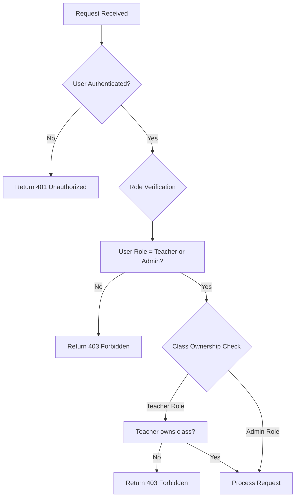
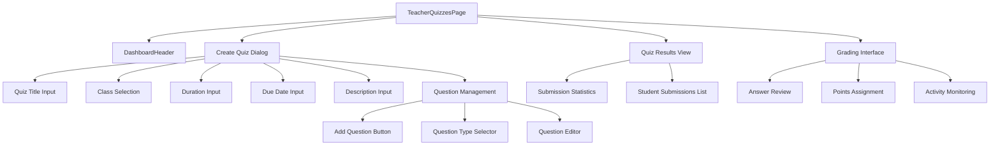
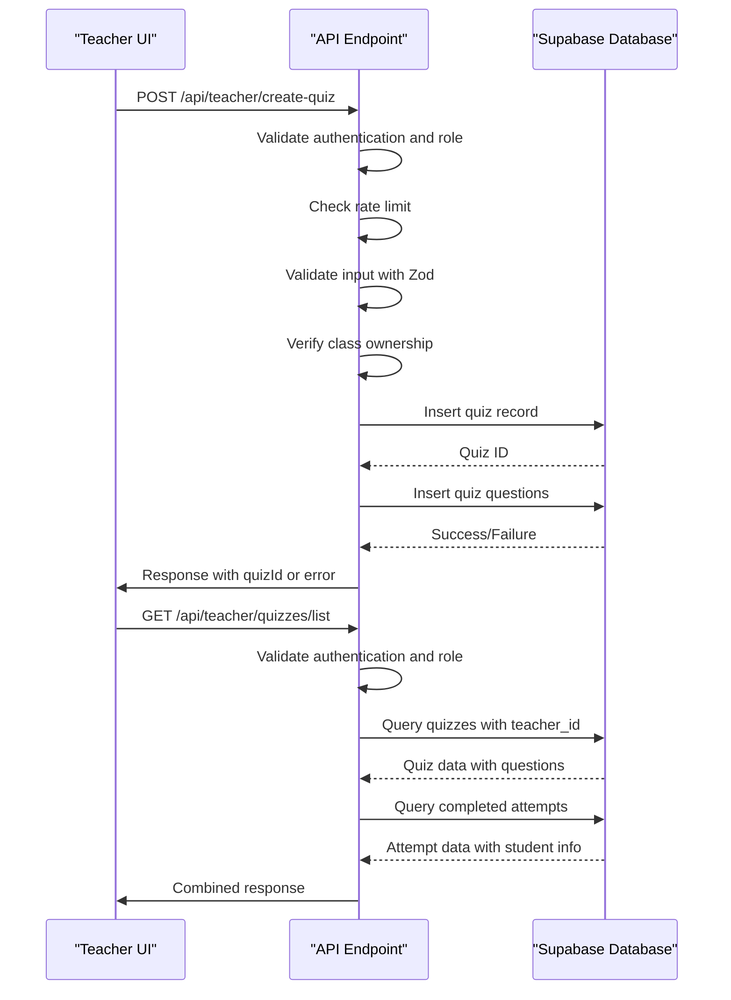
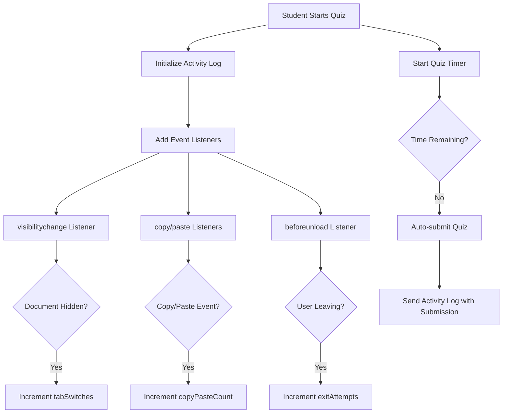
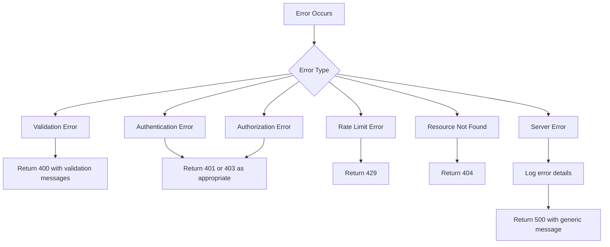
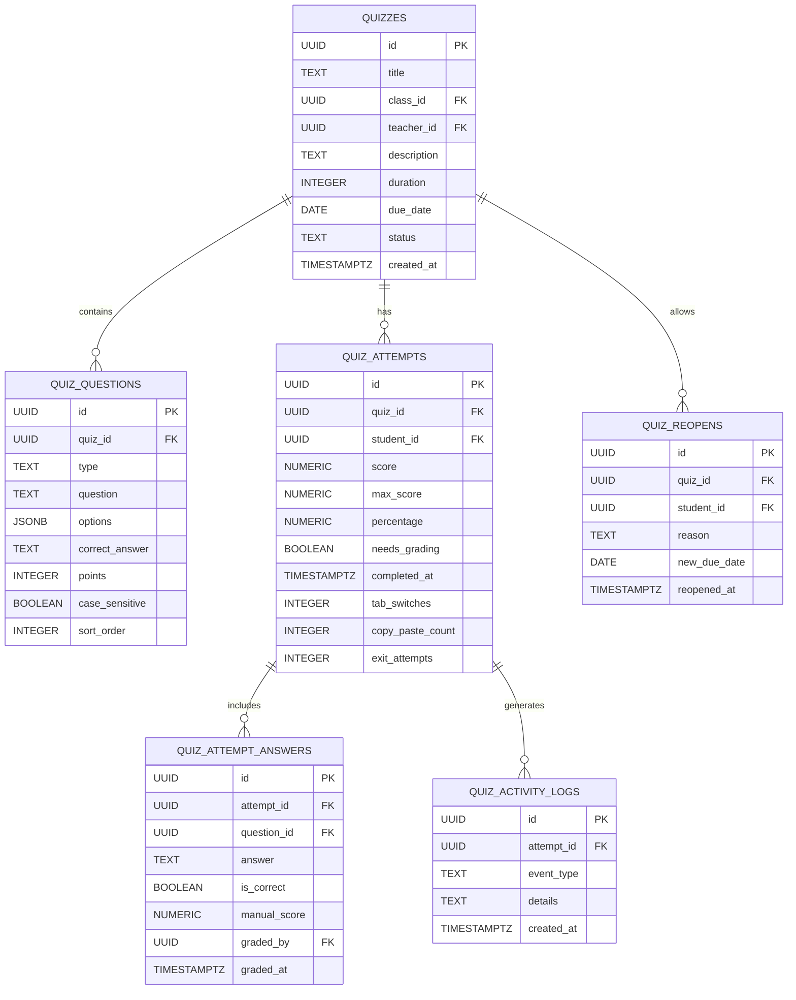

# Quizzes

<cite>
**Referenced Files in This Document**   
- [create-quiz/route.ts](file://app/api/teacher/create-quiz/route.ts)
- [list/route.ts](file://app/api/teacher/quizzes/list/route.ts)
- [page.tsx](file://app/teacher/quizzes/page.tsx)
- [types.ts](file://lib/supabase/types.ts)
- [queries.ts](file://lib/supabase/queries.ts)
- [20251219043525_create_quizzes_tables.sql](file://supabase/migrations/20251219043525_create_quizzes_tables.sql)
- [20260101070324_secure_quiz_questions.sql](file://supabase/migrations/20260101070324_secure_quiz_questions.sql)
- [security.ts](file://lib/security.ts)
- [rate-limit.ts](file://lib/rate-limit.ts)
- [student/quizzes/page.tsx](file://app/student/quizzes/page.tsx)
- [grading/[attemptId]/route.ts](file://app/api/teacher/grading/[attemptId]/route.ts)
</cite>

## Table of Contents
1. [Introduction](#introduction)
2. [API Endpoints](#api-endpoints)
   - [POST /api/teacher/create-quiz](#post-apiteachercreate-quiz)
   - [GET /api/teacher/quizzes/list](#get-apiteacherquizzeslist)
3. [Request/Response Payloads](#requestresponse-payloads)
4. [Authentication and Security](#authentication-and-security)
5. [Integration with UI Components](#integration-with-ui-components)
6. [Real-time Monitoring and Academic Integrity](#real-time-monitoring-and-academic-integrity)
7. [Error Handling](#error-handling)
8. [Usage Examples](#usage-examples)
9. [Database Schema](#database-schema)
10. [Conclusion](#conclusion)

## Introduction

This document provides comprehensive API documentation for teacher quiz management endpoints in the School-Management-System. The system enables teachers to create, manage, and analyze quizzes for their classes with robust security measures, input validation, and integration with real-time monitoring features. The documentation covers the two primary endpoints: creating quizzes and retrieving quiz data with associated attempts.

The quiz management system is designed with security and academic integrity as core principles, implementing role-based access control, rate limiting, and question exposure controls. Teachers can create timed assessments with various question types and retrieve detailed performance data for student review and grading purposes.

**Section sources**
- [create-quiz/route.ts](file://app/api/teacher/create-quiz/route.ts)
- [list/route.ts](file://app/api/teacher/quizzes/list/route.ts)

## API Endpoints

### POST /api/teacher/create-quiz

This endpoint allows authenticated teachers to create new quiz configurations with title, duration, questions, and class assignment. The system validates that the teacher owns the target class and applies comprehensive input sanitization.

#### Functionality
- Creates a new quiz with specified parameters
- Validates teacher ownership of the target class
- Applies strict input validation using Zod schema
- Implements rate limiting to prevent abuse
- Enforces role-based access control (teacher or admin only)
- Creates associated quiz questions in a transactional manner

#### Security Measures
- Rate limiting: 5 quizzes per minute per IP address
- Role verification: Only teachers and admins can create quizzes
- Class ownership validation: Teachers can only create quizzes for their own classes
- Input validation: Comprehensive schema validation for all fields
- Transactional integrity: Quiz creation is atomic (rollback on failure)

**Section sources**
- [create-quiz/route.ts](file://app/api/teacher/create-quiz/route.ts)

### GET /api/teacher/quizzes/list

This endpoint retrieves all quizzes created by the authenticated teacher, including associated attempts, class information, and student data. The response includes JOINs to classes and student data with filtering of completed attempts.

#### Functionality
- Retrieves all quizzes created by the authenticated teacher
- Includes related class information (name, grade, section)
- Includes all quiz questions for each quiz
- Retrieves completed quiz attempts with student information
- Filters attempts to only include completed ones
- Orders quizzes by creation date (newest first)

#### Data Relationships
- Quizzes are linked to their respective classes
- Quiz attempts are linked to both the quiz and the student
- Student information is included in attempt records
- Reopen requests are included with associated student data

**Section sources**
- [list/route.ts](file://app/api/teacher/quizzes/list/route.ts)

## Request/Response Payloads

### POST /api/teacher/create-quiz

#### Request Payload
```json
{
  "title": "string",
  "classId": "string (UUID)",
  "description": "string (optional)",
  "duration": "number (minutes)",
  "dueDate": "string (ISO date, optional)",
  "questions": [
    {
      "type": "multiple-choice | true-false | identification | essay",
      "question": "string",
      "options": ["string"] (optional),
      "correctAnswer": "string | number",
      "points": "number",
      "caseSensitive": "boolean (optional)"
    }
  ]
}
```

#### Response Payload (Success)
```json
{
  "success": true,
  "quizId": "string (UUID)"
}
```

#### Response Payload (Error)
```json
{
  "error": "string"
}
```

### GET /api/teacher/quizzes/list

#### Response Payload (Success)
```json
{
  "quizzes": [
    {
      "id": "string",
      "title": "string",
      "class_id": "string",
      "teacher_id": "string",
      "description": "string | null",
      "duration": "number",
      "due_date": "string | null",
      "status": "draft | published | closed",
      "created_at": "string",
      "class": {
        "id": "string",
        "name": "string",
        "grade": "string",
        "section": "string"
      },
      "questions": [
        {
          "id": "string",
          "quiz_id": "string",
          "type": "string",
          "question": "string",
          "options": ["string"] | null,
          "correct_answer": "string | null",
          "points": "number",
          "case_sensitive": "boolean",
          "sort_order": "number"
        }
      ],
      "reopens": [
        {
          "id": "string",
          "quiz_id": "string",
          "student_id": "string",
          "reason": "string | null",
          "new_due_date": "string",
          "reopened_at": "string",
          "student": {
            "id": "string",
            "name": "string"
          }
        }
      ]
    }
  ],
  "attempts": [
    {
      "id": "string",
      "quiz_id": "string",
      "student_id": "string",
      "score": "number | null",
      "max_score": "number | null",
      "percentage": "number | null",
      "needs_grading": "boolean",
      "completed_at": "string",
      "student": {
        "id": "string",
        "name": "string",
        "avatar": "string | null"
      },
      "quiz": {
        "teacher_id": "string"
      }
    }
  ]
}
```

**Section sources**
- [create-quiz/route.ts](file://app/api/teacher/create-quiz/route.ts)
- [list/route.ts](file://app/api/teacher/quizzes/list/route.ts)
- [types.ts](file://lib/supabase/types.ts)

## Authentication and Security

### Authentication Requirements
- All endpoints require authentication via Supabase auth
- Users must be logged in to access any quiz management functionality
- Teacher role is required for both endpoints (admin role also permitted)

### Authorization Checks


**Diagram sources**
- [create-quiz/route.ts](file://app/api/teacher/create-quiz/route.ts#L39-L52)
- [list/route.ts](file://app/api/teacher/quizzes/list/route.ts#L13-L22)

### Security Measures

#### Rate Limiting
- Implemented using Supabase RPC function `check_rate_limit`
- Limits: 5 quiz creations per minute per IP address
- Uses service role key to bypass RLS for rate limiting table access
- Fail-open by default to maintain availability

#### Input Validation
- Uses Zod schema validation for comprehensive input sanitization
- Validates all required fields with appropriate constraints
- Enforces UUID format for classId
- Validates question types against allowed values
- Ensures minimum and maximum limits for duration and questions

#### Question Exposure Control
- Row Level Security (RLS) policies prevent unauthorized access to quiz questions
- Students cannot directly query the quiz_questions table
- Teachers can only access questions for quizzes they created
- Implemented through database policies in `secure_quiz_questions.sql`

**Section sources**
- [create-quiz/route.ts](file://app/api/teacher/create-quiz/route.ts)
- [security.ts](file://lib/security.ts)
- [rate-limit.ts](file://lib/rate-limit.ts)
- [20260101070324_secure_quiz_questions.sql](file://supabase/migrations/20260101070324_secure_quiz_questions.sql)

## Integration with UI Components

### Teacher Quiz Management Interface

The teacher quiz management UI is implemented in `app/teacher/quizzes/page.tsx` and provides a comprehensive interface for creating and managing quizzes.

#### Key Features
- **Quiz Creation Dialog**: Modal interface for creating new quizzes with form validation
- **Question Management**: Dynamic addition and editing of questions with different types
- **Class Selection**: Dropdown to select the class for the quiz from teacher's classes
- **Results Dashboard**: Visual display of quiz results with submission statistics
- **Grading Interface**: Comprehensive grading interface for manual grading of essay questions

#### Component Structure


**Diagram sources**
- [page.tsx](file://app/teacher/quizzes/page.tsx)

### Data Flow


**Diagram sources**
- [create-quiz/route.ts](file://app/api/teacher/create-quiz/route.ts)
- [list/route.ts](file://app/api/teacher/quizzes/list/route.ts)
- [page.tsx](file://app/teacher/quizzes/page.tsx)

**Section sources**
- [page.tsx](file://app/teacher/quizzes/page.tsx)

## Real-time Monitoring and Academic Integrity

### Client-Side Monitoring
The system implements client-side monitoring to detect potential academic integrity issues during quiz attempts. These metrics are advisory only and can be bypassed by determined users.

#### Monitored Activities
- **Tab Switching**: Detected using document visibility API
- **Copy/Paste Events**: Detected using clipboard event listeners
- **Exit Attempts**: Tracked when users attempt to leave the quiz page
- **Right-Click Events**: Monitored for potential context menu usage

### Implementation Details


**Diagram sources**
- [student/quizzes/page.tsx](file://app/student/quizzes/page.tsx#L85-L107)

### Security Considerations
- All monitoring is client-side and advisory only
- Metrics can be bypassed by technical users
- No enforcement actions taken based on these metrics
- Teachers are informed that metrics are self-reported and not definitive proof of misconduct
- System includes disclaimers about the advisory nature of these metrics

**Section sources**
- [student/quizzes/page.tsx](file://app/student/quizzes/page.tsx)

## Error Handling

### Error Responses

#### Authentication Errors
- **401 Unauthorized**: User not authenticated
- **403 Forbidden**: User lacks required role or permissions

#### Validation Errors
- **400 Bad Request**: Invalid input data
  - Field-specific validation messages
  - Comma-separated list of validation issues
- **429 Too Many Requests**: Rate limit exceeded

#### Server Errors
- **500 Internal Server Error**: Unexpected server error
- **404 Not Found**: Resource not found (for grading endpoint)

### Error Response Structure
All error responses follow the same structure:
```json
{
  "error": "Descriptive error message"
}
```

### Error Handling Implementation


**Diagram sources**
- [create-quiz/route.ts](file://app/api/teacher/create-quiz/route.ts#L120-L123)
- [list/route.ts](file://app/api/teacher/quizzes/list/route.ts#L56-L58)

**Section sources**
- [create-quiz/route.ts](file://app/api/teacher/create-quiz/route.ts)
- [list/route.ts](file://app/api/teacher/quizzes/list/route.ts)

## Usage Examples

### Creating a Timed Assessment

#### Request
```json
{
  "title": "Algebra Midterm",
  "classId": "a1b2c3d4-e5f6-7890-g1h2-i3j4k5l6m7n8",
  "description": "Midterm assessment covering linear equations and functions",
  "duration": 45,
  "dueDate": "2025-03-15",
  "questions": [
    {
      "type": "multiple-choice",
      "question": "What is the slope of the line y = 2x + 3?",
      "options": ["1", "2", "3", "5"],
      "correctAnswer": 1,
      "points": 5
    },
    {
      "type": "identification",
      "question": "What is the y-intercept of the line y = 2x + 3?",
      "correctAnswer": "3",
      "points": 5,
      "caseSensitive": false
    },
    {
      "type": "essay",
      "question": "Explain the concept of slope in your own words.",
      "points": 10
    }
  ]
}
```

#### Response
```json
{
  "success": true,
  "quizId": "q1r2s3t4-u5v6-7890-w1x2-y3z4a5b6c7d8"
}
```

### Retrieving Student Quiz Performance Data

#### Request
```
GET /api/teacher/quizzes/list
Authorization: Bearer <teacher_token>
```

#### Response
```json
{
  "quizzes": [
    {
      "id": "q1r2s3t4-u5v6-7890-w1x2-y3z4a5b6c7d8",
      "title": "Algebra Midterm",
      "class_id": "a1b2c3d4-e5f6-7890-g1h2-i3j4k5l6m7n8",
      "teacher_id": "t1u2v3w4-x5y6-7890-z1a2-b3c4d5e6f7g8",
      "description": "Midterm assessment covering linear equations and functions",
      "duration": 45,
      "due_date": "2025-03-15",
      "status": "published",
      "created_at": "2025-03-10T10:30:00Z",
      "class": {
        "id": "a1b2c3d4-e5f6-7890-g1h2-i3j4k5l6m7n8",
        "name": "Grade 9 Algebra",
        "grade": "9",
        "section": "A"
      },
      "questions": [
        {
          "id": "q1q2q3q4-q5q6-7890-q1q2-q3q4q5q6q7q8",
          "quiz_id": "q1r2s3t4-u5v6-7890-w1x2-y3z4a5b6c7d8",
          "type": "multiple-choice",
          "question": "What is the slope of the line y = 2x + 3?",
          "options": ["1", "2", "3", "5"],
          "correct_answer": "1",
          "points": 5,
          "case_sensitive": false,
          "sort_order": 0
        }
      ],
      "reopens": []
    }
  ],
  "attempts": [
    {
      "id": "a1a2a3a4-a5a6-7890-a1a2-a3a4a5a6a7a8",
      "quiz_id": "q1r2s3t4-u5v6-7890-w1x2-y3z4a5b6c7d8",
      "student_id": "s1s2s3s4-s5s6-7890-s1s2-s3s4s5s6s7s8",
      "score": 15,
      "max_score": 20,
      "percentage": 75,
      "needs_grading": true,
      "completed_at": "2025-03-12T14:20:00Z",
      "student": {
        "id": "s1s2s3s4-s5s6-7890-s1s2-s3s4s5s6s7s8",
        "name": "John Doe",
        "avatar": "https://example.com/avatars/john.jpg"
      },
      "quiz": {
        "teacher_id": "t1u2v3w4-x5y6-7890-z1a2-b3c4d5e6f7g8"
      }
    }
  ]
}
```

**Section sources**
- [create-quiz/route.ts](file://app/api/teacher/create-quiz/route.ts)
- [list/route.ts](file://app/api/teacher/quizzes/list/route.ts)

## Database Schema

### Quiz-Related Tables



**Diagram sources**
- [20251219043525_create_quizzes_tables.sql](file://supabase/migrations/20251219043525_create_quizzes_tables.sql)

### Key Relationships
- **Quizzes to Classes**: One-to-many relationship (one class can have many quizzes)
- **Quizzes to Questions**: One-to-many relationship (one quiz can have many questions)
- **Quizzes to Attempts**: One-to-many relationship (one quiz can have many attempts)
- **Attempts to Answers**: One-to-many relationship (one attempt can have many answers)
- **Attempts to Activity Logs**: One-to-many relationship (one attempt can generate many logs)
- **Quizzes to Reopens**: One-to-many relationship (one quiz can have multiple reopen requests)

**Section sources**
- [20251219043525_create_quizzes_tables.sql](file://supabase/migrations/20251219043525_create_quizzes_tables.sql)
- [types.ts](file://lib/supabase/types.ts)

## Conclusion

The teacher quiz management system in the School-Management-System provides a comprehensive solution for creating, managing, and analyzing quizzes with robust security measures and integration with real-time monitoring features. The two primary endpoints—POST /api/teacher/create-quiz and GET /api/teacher/quizzes/list—enable teachers to efficiently manage assessments for their classes.

Key features include:
- Strict validation and input sanitization
- Role-based access control with teacher ownership verification
- Rate limiting to prevent abuse
- Secure question exposure controls through RLS policies
- Comprehensive data retrieval with JOINs to classes and student data
- Integration with real-time monitoring for academic integrity
- Detailed error handling with descriptive messages

The system is designed to balance functionality with security, ensuring that teachers can create effective assessments while maintaining academic integrity. The integration with the teacher UI provides a seamless experience for quiz creation and performance analysis, making it easier for educators to evaluate student learning and provide timely feedback.

**Section sources**
- [create-quiz/route.ts](file://app/api/teacher/create-quiz/route.ts)
- [list/route.ts](file://app/api/teacher/quizzes/list/route.ts)
- [page.tsx](file://app/teacher/quizzes/page.tsx)