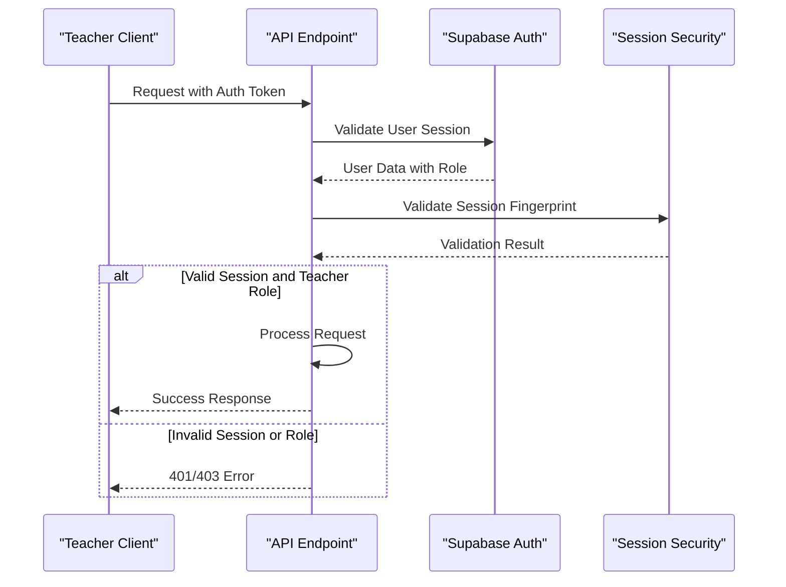
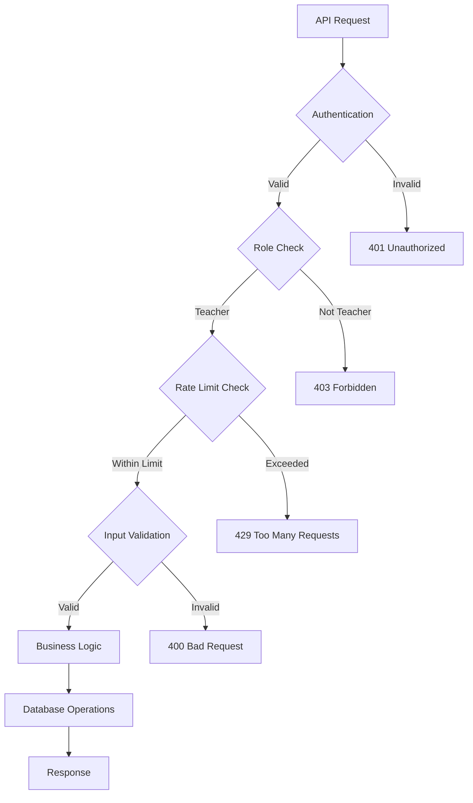

# Teacher API Endpoints

<cite>
**Referenced Files in This Document**   
- [save/route.ts](file://app/api/teacher/attendance/save/route.ts)
- [class-data/route.ts](file://app/api/teacher/attendance/class-data/route.ts)
- [generate-qr/route.ts](file://app/api/teacher/generate-qr/route.ts)
- [create-quiz/route.ts](file://app/api/teacher/create-quiz/route.ts)
- [create/route.ts](file://app/api/teacher/grades/create/route.ts)
- [class/[id]/route.ts](file://app/api/teacher/grades/class/[id]/route.ts)
- [grading/[attemptId]/route.ts](file://app/api/teacher/grading/[attemptId]/route.ts)
- [classes/route.ts](file://app/api/teacher/classes/route.ts)
- [my-classes/route.ts](file://app/api/teacher/my-classes/route.ts)
- [lessons/route.ts](file://app/api/teacher/lessons/route.ts)
- [dashboard/route.ts](file://app/api/teacher/dashboard/route.ts)
- [middleware.ts](file://lib/supabase/middleware.ts)
- [server.ts](file://lib/supabase/server.ts)
- [secure-fetch.ts](file://lib/secure-fetch.ts)
- [session-security.ts](file://lib/session-security.ts)
- [queries-optimized.ts](file://lib/supabase/queries-optimized.ts)
- [teacher-assignment-manager.tsx](file://components/teacher-assignment-manager.tsx)
- [qr-code-generator.tsx](file://components/qr-code-generator.tsx)
</cite>

## Table of Contents
1. [Introduction](#introduction)
2. [Authentication and Authorization](#authentication-and-authorization)
3. [Attendance Operations](#attendance-operations)
4. [Grading Endpoints](#grading-endpoints)
5. [Quiz Creation](#quiz-creation)
6. [Class Management](#class-management)
7. [Lesson Delivery](#lesson-delivery)
8. [Dashboard Functionality](#dashboard-functionality)
9. [Security and Performance](#security-and-performance)
10. [Integration Components](#integration-components)

## Introduction
This document provides comprehensive documentation for teacher-specific API endpoints in the School-Management-System. The endpoints enable teachers to manage attendance, grades, quizzes, classes, lessons, and access dashboard information. Each endpoint requires authentication and role validation to ensure only authorized teachers can access these functionalities. The system implements robust security measures including session validation, rate limiting, and input validation to protect sensitive educational data.

## Authentication and Authorization
All teacher endpoints require valid authentication and role verification. The system uses Supabase for authentication, with middleware validating user sessions and roles on each request. Teachers must have a "teacher" role to access these endpoints, while some endpoints also allow "admin" access. The authentication flow includes session validation through fingerprinting technology that detects potential session hijacking by comparing client device characteristics with stored session data.



**Diagram sources**
- [middleware.ts](file://lib/supabase/middleware.ts#L1-L38)
- [server.ts](file://lib/supabase/server.ts#L1-L51)
- [session-security.ts](file://lib/session-security.ts#L1-L373)

**Section sources**
- [middleware.ts](file://lib/supabase/middleware.ts#L1-L38)
- [server.ts](file://lib/supabase/server.ts#L1-L51)

## Attendance Operations
The attendance system provides endpoints for saving attendance records, retrieving class data for attendance taking, and generating QR codes for student check-in. These operations are protected by role-based access control and include validation to ensure teachers can only manage attendance for classes they own.

### Save Attendance Records
Endpoint for saving attendance records for students in a teacher's classes.

- **HTTP Method**: POST
- **URL**: `/api/teacher/attendance/save`
- **Authentication**: Required (Teacher role)
- **Request Payload**: 
```json
{
  "records": [
    {
      "student_id": "string",
      "class_id": "string",
      "status": "present|absent|late|excused",
      "date": "string (ISO date)"
    }
  ]
}
```
- **Response**: 
```json
{ "success": true }
```
- **Error Responses**: 400 (Invalid data), 401 (Unauthorized), 403 (Forbidden - class ownership), 500 (Server error)

**Section sources**
- [save/route.ts](file://app/api/teacher/attendance/save/route.ts#L1-L58)

### Retrieve Class Attendance Data
Fetches student enrollment data and existing attendance records for a specific class and date.

- **HTTP Method**: POST
- **URL**: `/api/teacher/attendance/class-data`
- **Authentication**: Required (Teacher role)
- **Request Payload**: 
```json
{
  "classId": "string",
  "date": "string (ISO date)"
}
```
- **Response**: 
```json
{
  "students": [
    {
      "id": "string",
      "name": "string",
      "email": "string",
      "avatar": "string"
    }
  ],
  "attendance": {
    "student_id": "status"
  }
}
```
- **Error Responses**: 400 (Missing parameters), 401 (Unauthorized), 403 (Forbidden - class ownership), 500 (Server error)

**Section sources**
- [class-data/route.ts](file://app/api/teacher/attendance/class-data/route.ts#L1-L67)

### Generate QR Code for Attendance
Generates a secure QR code token for student attendance check-in sessions.

- **HTTP Method**: POST
- **URL**: `/api/teacher/generate-qr`
- **Authentication**: Required (Teacher or Admin role)
- **Rate Limit**: 30 requests per minute
- **Request Payload**: 
```json
{
  "sessionId": "string"
}
```
- **Response**: 
```json
{
  "token": "string (base64 encoded)"
}
```
- **Error Responses**: 400 (Session ID required), 401 (Unauthorized), 403 (Forbidden - session ownership), 429 (Rate limited), 500 (Server error)

**Section sources**
- [generate-qr/route.ts](file://app/api/teacher/generate-qr/route.ts#L1-L79)

## Grading Endpoints
The grading system enables teachers to create grades, retrieve class grade data, and access quiz attempt details for grading purposes. These endpoints include validation to ensure teachers can only grade students in their own classes.

### Create Grade Record
Creates a new grade record for a student in a teacher's class.

- **HTTP Method**: POST
- **URL**: `/api/teacher/grades/create`
- **Authentication**: Required (Teacher or Admin role)
- **Rate Limit**: 20 requests per minute per teacher
- **Request Payload**: 
```json
{
  "studentId": "string",
  "classId": "string",
  "score": "number",
  "maxScore": "number",
  "type": "quiz|assignment|exam|project",
  "date": "string (ISO date)"
}
```
- **Response**: 
```json
{
  "success": true,
  "grade": {
    "id": "string",
    "student_id": "string",
    "class_id": "string",
    "score": "number",
    "max_score": "number",
    "percentage": "number",
    "grade": "string (PH grading system)",
    "type": "string",
    "date": "string"
  }
}
```
- **Error Responses**: 400 (Missing fields, invalid scores), 401 (Unauthorized), 403 (Forbidden - class ownership), 500 (Server error)

**Section sources**
- [create/route.ts](file://app/api/teacher/grades/create/route.ts#L1-L105)

### Retrieve Class Grade Data
Fetches all grade data for a specific class, including both manually entered grades and quiz attempts.

- **HTTP Method**: GET
- **URL**: `/api/teacher/grades/class/[id]`
- **Authentication**: Required (Teacher role)
- **Path Parameter**: `id` (Class ID)
- **Response**: 
```json
{
  "students": [
    {
      "id": "string",
      "name": "string",
      "email": "string",
      "avatar": "string"
    }
  ],
  "grades": [
    {
      "id": "string",
      "student_id": "string",
      "class_id": "string",
      "score": "number",
      "max_score": "number",
      "percentage": "number",
      "grade": "string",
      "type": "string",
      "date": "string"
    }
  ]
}
```
- **Error Responses**: 401 (Unauthorized), 403 (Forbidden - class ownership), 500 (Server error)

**Section sources**
- [class/[id]/route.ts](file://app/api/teacher/grades/class/[id]/route.ts#L1-L101)

### Retrieve Quiz Attempt for Grading
Fetches detailed information about a specific quiz attempt for grading purposes, including answers and activity logs.

- **HTTP Method**: GET
- **URL**: `/api/teacher/grading/[attemptId]`
- **Authentication**: Required (Teacher or Admin role)
- **Path Parameter**: `attemptId` (Quiz Attempt ID)
- **Response**: 
```json
{
  "attempt": {
    "id": "string",
    "quiz_id": "string",
    "student_id": "string",
    "score": "number",
    "max_score": "number",
    "percentage": "number",
    "tab_switches": "number",
    "copy_paste_count": "number",
    "exit_attempts": "number"
  },
  "answers": [
    {
      "id": "string",
      "attempt_id": "string",
      "question_id": "string",
      "answer": "string",
      "is_correct": "boolean",
      "points_awarded": "number",
      "question": {
        "id": "string",
        "question": "string",
        "type": "string",
        "options": ["string"],
        "correct_answer": "string",
        "points": "number"
      }
    }
  ],
  "logs": [
    {
      "id": "string",
      "event_type": "string",
      "details": "object",
      "created_at": "string"
    }
  ]
}
```
- **Error Responses**: 403 (Forbidden - quiz ownership), 404 (Attempt not found), 500 (Server error)

**Section sources**
- [grading/[attemptId]/route.ts](file://app/api/teacher/grading/[attemptId]/route.ts#L1-L86)

## Quiz Creation
The quiz creation endpoint allows teachers to create quizzes with multiple question types and configurations.

### Create Quiz
Creates a new quiz with questions for a specific class.

- **HTTP Method**: POST
- **URL**: `/api/teacher/create-quiz`
- **Authentication**: Required (Teacher or Admin role)
- **Rate Limit**: 5 requests per minute
- **Request Payload**: 
```json
{
  "title": "string",
  "classId": "string",
  "description": "string",
  "duration": "number (minutes)",
  "dueDate": "string (ISO date)",
  "questions": [
    {
      "type": "multiple-choice|true-false|identification|essay",
      "question": "string",
      "options": ["string"],
      "correctAnswer": "string|number",
      "points": "number (1-100)",
      "caseSensitive": "boolean"
    }
  ]
}
```
- **Response**: 
```json
{
  "success": true,
  "quizId": "string"
}
```
- **Error Responses**: 400 (Validation errors), 401 (Unauthorized), 403 (Forbidden - class ownership), 429 (Rate limited), 500 (Server error)

**Section sources**
- [create-quiz/route.ts](file://app/api/teacher/create-quiz/route.ts#L1-L124)

## Class Management
Endpoints for retrieving class information that the teacher owns or is associated with.

### Retrieve All Classes
Fetches all classes owned by the authenticated teacher with student count information.

- **HTTP Method**: GET
- **URL**: `/api/teacher/classes`
- **Authentication**: Required (Teacher role)
- **Response**: 
```json
{
  "classes": [
    {
      "id": "string",
      "name": "string",
      "grade": "string",
      "section": "string",
      "subject": "string",
      "schedule": "string",
      "room": "string",
      "student_count": "number"
    }
  ]
}
```
- **Error Responses**: 401 (Unauthorized), 403 (Forbidden), 500 (Server error)

**Section sources**
- [classes/route.ts](file://app/api/teacher/classes/route.ts#L1-L59)

### Retrieve My Classes (Minimal)
Fetches basic information about classes owned by the teacher (name, grade, section).

- **HTTP Method**: GET
- **URL**: `/api/teacher/my-classes`
- **Authentication**: Required (Teacher role)
- **Response**: 
```json
{
  "classes": [
    {
      "id": "string",
      "name": "string",
      "grade": "string",
      "section": "string"
    }
  ]
}
```
- **Error Responses**: 401 (Unauthorized), 403 (Forbidden), 500 (Server error)

**Section sources**
- [my-classes/route.ts](file://app/api/teacher/my-classes/route.ts#L1-L35)

## Lesson Delivery
Comprehensive endpoints for managing lesson plans, content, and associated materials.

### Lesson Management
Supports GET, POST, and PUT operations for lesson delivery functionality.

- **HTTP Method**: GET, POST, PUT
- **URL**: `/api/teacher/lessons`
- **Authentication**: Required (Teacher or Admin role for GET, Teacher role for POST/PUT)

#### GET Lessons
Retrieves all lessons created by the teacher with associated materials.

**Response**: 
```json
{
  "lessons": [
    {
      "id": "string",
      "title": "string",
      "description": "string",
      "content": "string",
      "class_id": "string",
      "class_name": "string",
      "materials": [
        {
          "id": "string",
          "name": "string",
          "type": "string",
          "url": "string"
        }
      ],
      "updated_at": "string"
    }
  ]
}
```

#### POST Create Lesson
Creates a new lesson with optional materials.

**Request Payload**: 
```json
{
  "title": "string",
  "classId": "string",
  "description": "string",
  "content": "string",
  "materials": [
    {
      "name": "string",
      "type": "string",
      "url": "string"
    }
  ]
}
```

#### PUT Update Lesson
Updates an existing lesson, with support for adding, updating, and deleting materials.

**Request Payload**: 
```json
{
  "id": "string",
  "title": "string",
  "classId": "string",
  "description": "string",
  "content": "string",
  "materials": [
    {
      "id": "string|temp-id",
      "name": "string",
      "type": "string",
      "url": "string",
      "isNew": "boolean"
    }
  ],
  "deletedMaterialIds": ["string"]
}
```

**Security Features**: URL validation to prevent SSRF attacks, ownership verification, and proper material association checks.

**Section sources**
- [lessons/route.ts](file://app/api/teacher/lessons/route.ts#L1-L253)

## Dashboard Functionality
Provides aggregated data for the teacher's dashboard view.

### Retrieve Dashboard Data
Fetches comprehensive dashboard information including classes, student counts, attendance rates, and schedule.

- **HTTP Method**: GET
- **URL**: `/api/teacher/dashboard`
- **Authentication**: Required (Teacher role)
- **Response**: 
```json
{
  "classes": [
    {
      "id": "string",
      "name": "string",
      "grade": "string",
      "section": "string",
      "subject": "string",
      "schedule": "string",
      "room": "string"
    }
  ],
  "totalStudents": "number",
  "attendanceRate": "number (percentage)",
  "students": [
    {
      "id": "string",
      "name": "string",
      "avatar": "string",
      "grade": "string",
      "section": "string"
    }
  ],
  "todaySchedule": [
    {
      "id": "string",
      "day": "string",
      "start_time": "string",
      "end_time": "string",
      "room": "string",
      "class_name": "string"
    }
  ]
}
```
- **Error Responses**: 401 (Unauthorized), 403 (Forbidden), 500 (Server error)

**Section sources**
- [dashboard/route.ts](file://app/api/teacher/dashboard/route.ts#L1-L128)

## Security and Performance
The teacher API endpoints implement multiple security and performance measures to ensure system integrity and optimal performance.

### Security Measures
- **Role-Based Access Control**: All endpoints verify the teacher role before processing requests
- **Class Ownership Verification**: Teachers can only access data for classes they own
- **Rate Limiting**: Protection against abuse with endpoint-specific limits
- **Input Validation**: Comprehensive validation using Zod for complex inputs
- **Session Security**: Fingerprint-based session validation to prevent hijacking
- **URL Validation**: Prevention of SSRF attacks in lesson materials
- **CSRF Protection**: Synchronized session validation across client and server

### Performance Considerations
- **Optimized Queries**: Use of `queries-optimized.ts` for efficient database operations
- **Batch Operations**: Support for bulk attendance and grade updates
- **Caching Strategy**: Strategic data fetching to minimize database load
- **Connection Pooling**: Efficient database connection management
- **Index Optimization**: Database indexes on frequently queried fields



**Diagram sources**
- [queries-optimized.ts](file://lib/supabase/queries-optimized.ts)
- [rate-limit.ts](file://lib/rate-limit.ts)
- [validation-schemas.ts](file://lib/validation-schemas.ts)

**Section sources**
- [queries-optimized.ts](file://lib/supabase/queries-optimized.ts)
- [rate-limit.ts](file://lib/rate-limit.ts)

## Integration Components
Key frontend components that integrate with the teacher API endpoints.

### Teacher Assignment Manager
Component for managing assignments, integrated with the grading and quiz creation endpoints.

**Section sources**
- [teacher-assignment-manager.tsx](file://components/teacher-assignment-manager.tsx)

### QR Code Generator
Component for generating QR codes for attendance, integrated with the generate-qr endpoint.

**Section sources**
- [qr-code-generator.tsx](file://components/qr-code-generator.tsx)