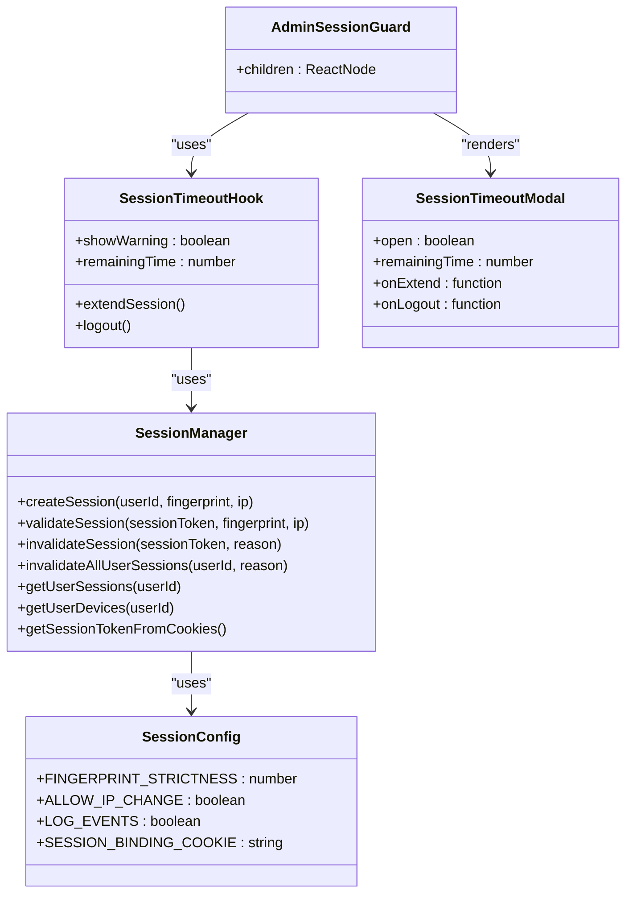
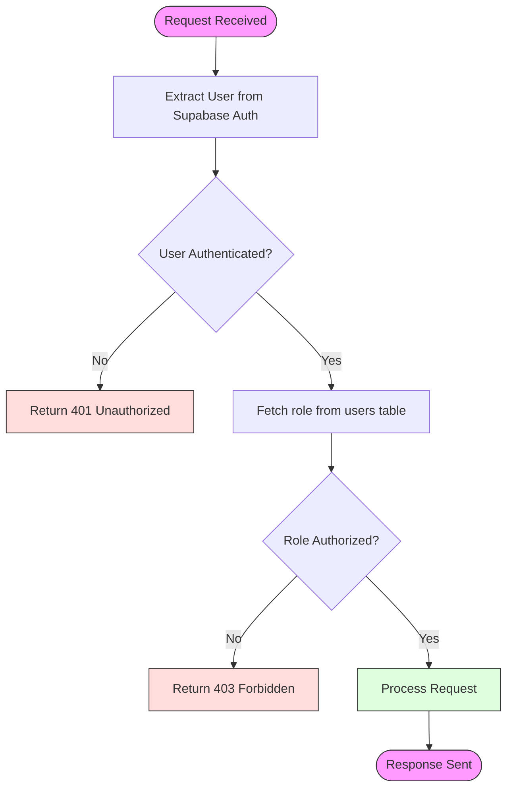
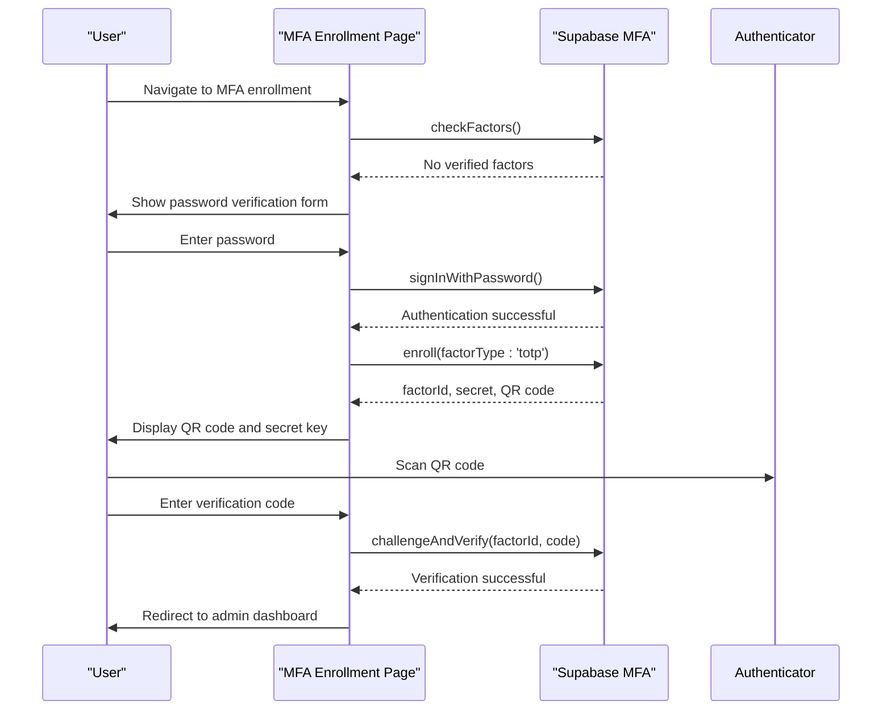
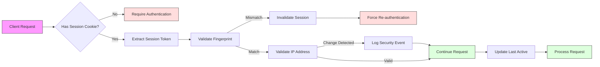
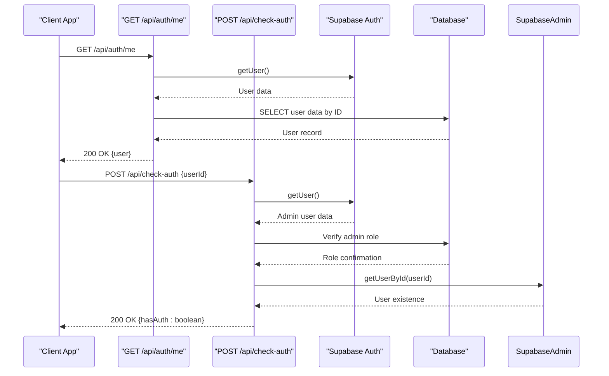
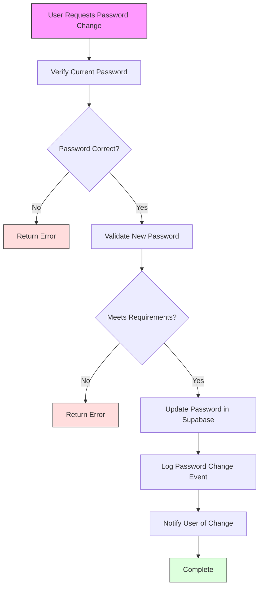
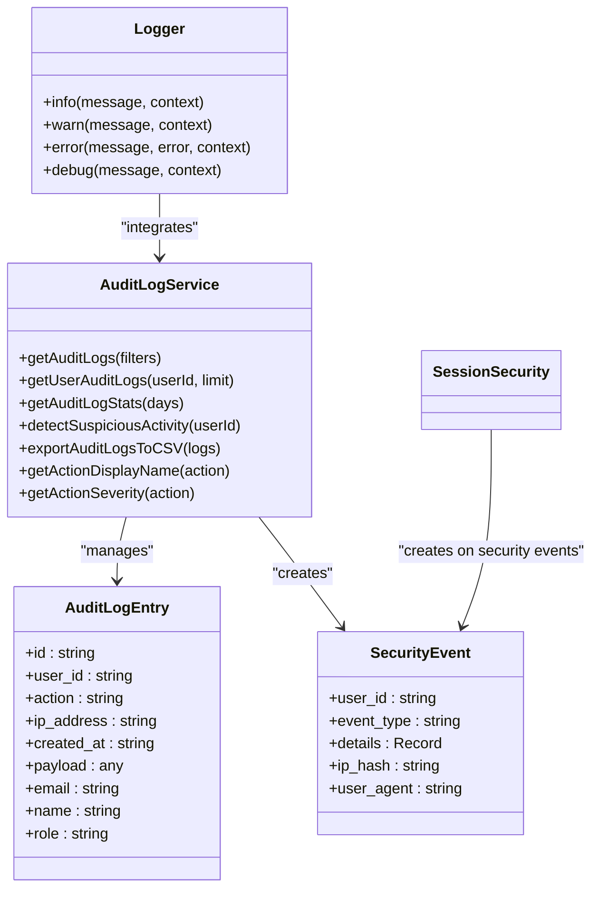

# Authentication Flow

<cite>
**Referenced Files in This Document**   
- [app/api/auth/login/route.ts](file://app/api/auth/login/route.ts)
- [app/api/auth/logout/route.ts](file://app/api/auth/logout/route.ts)
- [app/api/auth/me/route.ts](file://app/api/auth/me/route.ts)
- [app/api/check-auth/route.ts](file://app/api/check-auth/route.ts)
- [lib/supabase/middleware.ts](file://lib/supabase/middleware.ts)
- [lib/session-security.ts](file://lib/session-security.ts)
- [lib/fingerprint.ts](file://lib/fingerprint.ts)
- [app/auth/mfa/enroll/page.tsx](file://app/auth/mfa/enroll/page.tsx)
- [app/auth/mfa/verify/page.tsx](file://app/auth/mfa/verify/page.tsx)
- [lib/hooks/use-session-timeout.ts](file://lib/hooks/use-session-timeout.ts)
- [components/admin-session-guard.tsx](file://components/admin-session-guard.tsx)
- [components/session-timeout-modal.tsx](file://components/session-timeout-modal.tsx)
- [lib/supabase/audit-logs.ts](file://lib/supabase/audit-logs.ts)
- [lib/logger.ts](file://lib/logger.ts)
- [lib/security.ts](file://lib/security.ts)
</cite>

## Table of Contents
1. [Introduction](#introduction)
2. [Authentication Flow](#authentication-flow)
3. [Session Management](#session-management)
4. [Role-Based Access Control](#role-based-access-control)
5. [Multi-Factor Authentication](#multi-factor-authentication)
6. [Session Security Mechanisms](#session-security-mechanisms)
7. [User Context and Session Validation](#user-context-and-session-validation)
8. [Password Change Workflows](#password-change-workflows)
9. [Security Considerations](#security-considerations)
10. [Audit Logging](#audit-logging)

## Introduction
This document provides a comprehensive overview of the authentication and session management system in the School Management System. The system is built on Supabase Auth with multiple layers of security including role-based access control, multi-factor authentication, session binding, and comprehensive audit logging. The authentication flow is designed to be both secure and user-friendly, with special considerations for different user roles (admin, teacher, student, parent).

## Authentication Flow

The authentication flow begins with a POST request to `/api/auth/login` which handles user authentication, session creation, and security validation. The process includes rate limiting, credential validation, account status checking, and session binding with device fingerprinting.

```mermaid
sequenceDiagram
participant Client as "Client App"
participant LoginAPI as "POST /api/auth/login"
participant SupabaseAuth as "Supabase Auth"
participant Database as "Database"
participant SessionSecurity as "Session Security"
Client->>LoginAPI : POST /api/auth/login {email, password, fingerprint}
LoginAPI->>LoginAPI : Extract client IP
LoginAPI->>LoginAPI : Check rate limit (5/min)
alt Rate limit exceeded
LoginAPI-->>Client : 429 Too Many Requests
return
end
LoginAPI->>SupabaseAuth : signInWithPassword(email, password)
SupabaseAuth-->>LoginAPI : User data or error
alt Authentication failed
LoginAPI-->>Client : 401 Unauthorized (generic error)
return
end
LoginAPI->>Database : Check user.is_active and role
Database-->>LoginAPI : User status and metadata
alt Account disabled
LoginAPI->>SupabaseAuth : signOut()
LoginAPI-->>Client : 401 Unauthorized (generic error)
return
end
LoginAPI->>SupabaseAuth : updateUser() with role and session_start
LoginAPI->>SessionSecurity : createSession(userId, fingerprint, ip)
SessionSecurity->>Database : Check existing device
SessionSecurity->>Database : Invalidate previous sessions
SessionSecurity->>Database : Create new session record
SessionSecurity->>Database : Update/create device record
SessionSecurity-->>LoginAPI : sessionToken and isNewDevice
LoginAPI->>Client : 200 OK {user, role, isNewDevice}
LoginAPI->>Client : Set HttpOnly session binding cookie
```

**Diagram sources**
- [app/api/auth/login/route.ts](file://app/api/auth/login/route.ts#L7-L117)
- [lib/session-security.ts](file://lib/session-security.ts#L68-L147)

**Section sources**
- [app/api/auth/login/route.ts](file://app/api/auth/login/route.ts#L7-L117)

## Session Management

The system implements a comprehensive session management system that combines Supabase's built-in authentication with custom session binding and timeout mechanisms. Sessions are managed through both client-side and server-side components, with automatic timeout handling and secure cookie management.



**Diagram sources**
- [lib/session-security.ts](file://lib/session-security.ts#L17-L373)
- [lib/hooks/use-session-timeout.ts](file://lib/hooks/use-session-timeout.ts#L1-L198)
- [components/admin-session-guard.tsx](file://components/admin-session-guard.tsx#L1-L34)
- [components/session-timeout-modal.tsx](file://components/session-timeout-modal.tsx#L1-L74)

**Section sources**
- [lib/session-security.ts](file://lib/session-security.ts#L17-L373)
- [lib/hooks/use-session-timeout.ts](file://lib/hooks/use-session-timeout.ts#L1-L198)

## Role-Based Access Control

The system implements role-based access control (RBAC) to restrict access to different parts of the application based on user roles (admin, teacher, student, parent). Role information is stored in the database and included in JWT tokens for efficient middleware validation.



**Diagram sources**
- [lib/supabase/middleware.ts](file://lib/supabase/middleware.ts#L4-L38)
- [app/api/check-auth/route.ts](file://app/api/check-auth/route.ts#L19-L64)

**Section sources**
- [lib/supabase/middleware.ts](file://lib/supabase/middleware.ts#L4-L38)
- [app/api/check-auth/route.ts](file://app/api/check-auth/route.ts#L19-L64)

## Multi-Factor Authentication

The system implements multi-factor authentication (MFA) using TOTP (Time-based One-Time Password) for enhanced security, particularly for administrative users. The MFA flow includes enrollment, verification, and challenge-response mechanisms.



**Diagram sources**
- [app/auth/mfa/enroll/page.tsx](file://app/auth/mfa/enroll/page.tsx#L1-L251)
- [app/auth/mfa/verify/page.tsx](file://app/auth/mfa/verify/page.tsx#L1-L91)

**Section sources**
- [app/auth/mfa/enroll/page.tsx](file://app/auth/mfa/enroll/page.tsx#L1-L251)
- [app/auth/mfa/verify/page.tsx](file://app/auth/mfa/verify/page.tsx#L1-L91)

## Session Security Mechanisms

The system implements multiple layers of session security to protect against common attacks such as session hijacking, CSRF, and brute force attempts. These mechanisms include device fingerprinting, secure cookie handling, rate limiting, and IP address validation.



**Diagram sources**
- [lib/session-security.ts](file://lib/session-security.ts#L154-L228)
- [lib/fingerprint.ts](file://lib/fingerprint.ts#L1-L68)
- [lib/security.ts](file://lib/security.ts#L6-L96)

**Section sources**
- [lib/session-security.ts](file://lib/session-security.ts#L154-L228)
- [lib/fingerprint.ts](file://lib/fingerprint.ts#L1-L68)

## User Context and Session Validation

The system provides endpoints for retrieving current user context and validating session status. The `/api/auth/me` endpoint returns authenticated user information, while `/api/check-auth` allows administrators to verify the authentication status of other users.



**Diagram sources**
- [app/api/auth/me/route.ts](file://app/api/auth/me/route.ts#L4-L28)
- [app/api/check-auth/route.ts](file://app/api/check-auth/route.ts#L19-L64)

**Section sources**
- [app/api/auth/me/route.ts](file://app/api/auth/me/route.ts#L4-L28)
- [app/api/check-auth/route.ts](file://app/api/check-auth/route.ts#L19-L64)

## Password Change Workflows

The system includes secure password change workflows that validate current credentials before allowing password updates. The process includes client-side validation, server-side verification, and audit logging of password change events.



**Section sources**
- [app/change-password/page.tsx](file://app/change-password/page.tsx)

## Security Considerations

The authentication system incorporates multiple security best practices to protect user accounts and sensitive data. These include secure cookie handling, CSRF protection, rate limiting, and input validation.

### Secure Cookie Handling
- Session binding cookies are marked as HttpOnly, Secure, and SameSite=strict
- Cookies have appropriate expiration times (8 hours, matching session timeout)
- Sensitive data is not stored in cookies

### CSRF Protection
- Origin validation for API routes
- Use of SameSite cookies to prevent cross-site requests
- Server-side validation of request sources

### Rate Limiting
- Login attempts limited to 5 per minute per IP address
- Fail-closed approach during database outages
- Prevention of brute force attacks

### Input Validation
- Comprehensive validation of user input
- Prevention of XSS and injection attacks
- Sanitization of sensitive data in logs

**Section sources**
- [lib/security.ts](file://lib/security.ts#L6-L96)
- [app/api/auth/login/route.ts](file://app/api/auth/login/route.ts#L7-L117)
- [lib/logger.ts](file://lib/logger.ts#L1-L99)

## Audit Logging

The system implements comprehensive audit logging to track authentication events and detect suspicious activity. All authentication-related actions are logged with relevant metadata for security monitoring and compliance.



**Diagram sources**
- [lib/supabase/audit-logs.ts](file://lib/supabase/audit-logs.ts#L1-L321)
- [lib/logger.ts](file://lib/logger.ts#L1-L99)
- [lib/session-security.ts](file://lib/session-security.ts#L278-L298)

**Section sources**
- [lib/supabase/audit-logs.ts](file://lib/supabase/audit-logs.ts#L1-L321)
- [lib/logger.ts](file://lib/logger.ts#L1-L99)