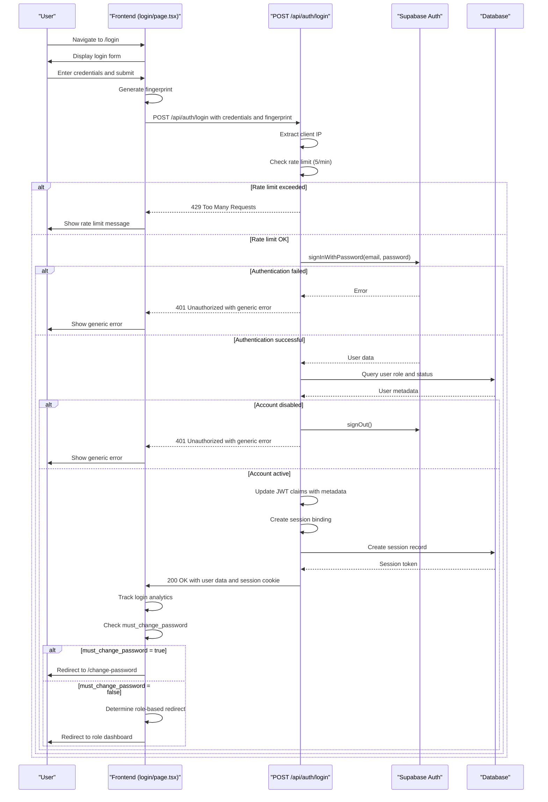

# Login Process

<cite>
**Referenced Files in This Document**   
- [route.ts](file://app/api/auth/login/route.ts)
- [page.tsx](file://app/login/page.tsx)
- [auth-store.ts](file://lib/auth-store.ts)
- [session-security.ts](file://lib/session-security.ts)
- [rate-limit.ts](file://lib/rate-limit.ts)
- [security.ts](file://lib/security.ts)
- [client.ts](file://lib/supabase/client.ts)
- [middleware.ts](file://lib/supabase/middleware.ts)
- [fingerprint.ts](file://lib/fingerprint.ts)
- [proxy.ts](file://proxy.ts)
- [create_users_table.sql](file://supabase/migrations/20251219043432_create_users_table.sql)
</cite>

## Table of Contents
1. [Introduction](#introduction)
2. [Login Endpoint Implementation](#login-endpoint-implementation)
3. [Frontend Login Page](#frontend-login-page)
4. [Authentication State Management](#authentication-state-management)
5. [Role-Based Redirect Logic](#role-based-redirect-logic)
6. [Request/Response Payloads](#requestresponse-payloads)
7. [Error Handling](#error-handling)
8. [Security Practices](#security-practices)
9. [Sequence Diagram](#sequence-diagram)

## Introduction
The login process in the School Management System is a comprehensive authentication flow that combines frontend user interface components with robust backend security measures. The system implements a secure login endpoint that validates user credentials, integrates with Supabase authentication, issues JWT tokens, and manages user sessions with advanced security features. This document details the complete login process, from the user interface interaction to the backend authentication flow, including security measures such as rate limiting, session binding, and protection against brute-force attacks.

## Login Endpoint Implementation

The POST /api/auth/login endpoint handles the authentication process by validating user credentials and creating a secure session. The implementation follows a structured flow that prioritizes security while maintaining usability.

The endpoint begins by extracting the client IP address using a secure method that prioritizes platform-provided IP information to prevent spoofing. It then checks the rate limit for login attempts, allowing a maximum of 5 attempts per minute. The rate limiting is implemented using a Supabase RPC function that prevents race conditions through row-level locking.

Upon passing the rate limit check, the endpoint validates the provided email and password credentials using Supabase Auth's signInWithPassword method. For security reasons, the system returns a generic error message ("Invalid login credentials") for all authentication failures to prevent user enumeration attacks.

When authentication succeeds, the system performs additional checks on the user account, including verifying that the account is active. The implementation stores user metadata (role, must_change_password flag, and session_start timestamp) in the JWT claims to reduce database queries during subsequent requests.

The endpoint also implements session binding by creating a session record that links the user to their device fingerprint and IP address. This creates a session binding token that is stored in an HttpOnly, Secure, SameSite cookie to prevent CSRF attacks and session hijacking.

**Section sources**
- [route.ts](file://app/api/auth/login/route.ts#L7-L117)

## Frontend Login Page

The login page provides a user-friendly interface for authentication with support for both email and LRN (Learner Reference Number) based login. The page is implemented as a React component with client-side interactivity.

The login form includes fields for email/LRN and password, with a toggle to show/hide the password for usability. The email field supports automatic formatting, converting a 12-digit LRN into a valid email address with the @r1.deped.gov.ph domain.

When the user submits the form, the frontend generates a browser fingerprint using various client-side properties such as user agent, language, timezone, screen resolution, and platform. This fingerprint is sent to the backend along with the login credentials to enable session binding.

The page also handles session timeout messages, displaying appropriate notifications when a user is redirected due to an expired or invalidated session. Successful login triggers analytics tracking and appropriate redirects based on user role, while failed attempts display error messages.

**Section sources**
- [page.tsx](file://app/login/page.tsx#L1-L209)

## Authentication State Management

The authentication state is managed using a Zustand store (useAuthStore) that provides a centralized location for user authentication data. The store maintains the current user object, profile information, loading state, and initialization status.

The store initializes by checking the current authentication state with Supabase and fetching the user's profile data from the database. It sets up a subscription to Supabase's authentication state changes, automatically updating the store when the user logs in or out.

The signOut method implements a comprehensive logout process that clears the session binding token from localStorage and calls the logout API to invalidate the server-side session. It also unsubscribes from the authentication state change listener to prevent memory leaks.

The store is designed with performance optimizations, including cleanup of existing subscriptions before creating new ones and storing the subscription reference for proper cleanup.

**Section sources**
- [auth-store.ts](file://lib/auth-store.ts#L1-L110)

## Role-Based Redirect Logic

After successful authentication, the system implements role-based redirect logic to direct users to their appropriate dashboard. The process begins with retrieving the user's role from the database, which is then used to determine the destination route.

The redirect logic checks if the user has the must_change_password flag set to true. If so, the user is redirected to the change-password page regardless of their role, enforcing password policy compliance.

For users who don't need to change their password, the system redirects them to their role-specific dashboard:
- Admin users are redirected to /admin
- Teachers are redirected to /teacher
- Students are redirected to /student
- Other roles follow a default path

This logic is implemented in both the frontend login handler and the proxy middleware, creating a consistent user experience across the application.

**Section sources**
- [page.tsx](file://app/login/page.tsx#L73-L110)
- [proxy.ts](file://proxy.ts#L274-L283)

## Request/Response Payloads

### Login Request
```json
{
  "email": "user@example.com",
  "password": "secure_password",
  "fingerprint": {
    "userAgent": "Mozilla/5.0...",
    "language": "en-US",
    "timezone": "America/New_York",
    "screenResolution": "1920x1080",
    "colorDepth": 24,
    "platform": "Win32",
    "cookiesEnabled": true,
    "doNotTrack": null
  }
}
```

### Successful Response
```json
{
  "user": {
    "id": "uuid",
    "email": "user@example.com",
    "role": "student"
  },
  "role": "student",
  "isNewDevice": false
}
```

### Error Response
```json
{
  "error": "Invalid login credentials"
}
```

The request includes the user's email, password, and a fingerprint object containing browser characteristics. The successful response includes the user object, role, and a flag indicating whether this is a new device. Error responses use generic messages to prevent information disclosure.

**Section sources**
- [route.ts](file://app/api/auth/login/route.ts#L23-L27)
- [page.tsx](file://app/login/page.tsx#L59-L60)

## Error Handling

The login process implements comprehensive error handling to provide a secure and user-friendly experience. All authentication errors return a generic "Invalid login credentials" message to prevent user enumeration attacks, regardless of whether the error is due to incorrect credentials or a disabled account.

Rate limiting errors return a 429 status code with the message "Too many login attempts. Please try again later." This helps prevent brute-force attacks while providing clear feedback to users.

The system handles various error scenarios:
- Invalid credentials: Returns generic error message
- Disabled accounts: Returns same generic error as invalid credentials
- Rate limiting: Returns 429 status code
- Server errors: Returns 500 status code with generic message
- Network errors: Handled by the frontend with appropriate user feedback

The frontend displays error messages to users while logging detailed error information on the server for debugging purposes. This approach balances security (by not revealing specific error details to users) with maintainability (by logging detailed information for developers).

**Section sources**
- [route.ts](file://app/api/auth/login/route.ts#L38-L58)
- [page.tsx](file://app/login/page.tsx#L106-L107)

## Security Practices

The login process implements multiple security practices to protect against common attacks and ensure the integrity of user authentication.

### Rate Limiting
The system implements rate limiting to prevent brute-force attacks, allowing only 5 login attempts per minute per IP address. The rate limiting is enforced using a Supabase RPC function that prevents race conditions through row-level locking. For security-critical endpoints like login, the system fails closed during database outages to prevent brute-force attacks.

### Session Binding
The system implements session binding by creating a cryptographic hash of browser fingerprint data (user agent, language, timezone, screen resolution, etc.) and storing it server-side. Each request is validated against this fingerprint to detect session hijacking attempts. The session binding token is stored in an HttpOnly, Secure, SameSite cookie to prevent XSS and CSRF attacks.

### Password Security
The system follows security best practices for password handling:
- Passwords are never logged or exposed in error messages
- The system uses Supabase Auth for password hashing and verification
- Generic error messages prevent user enumeration
- New accounts require password change on first login

### IP Address Handling
The system securely extracts client IP addresses, prioritizing platform-provided IP information to prevent spoofing. IP addresses are hashed using SHA-256 with a salt before storage to protect user privacy while still allowing abuse detection.

### Additional Security Measures
- CSRF protection through origin validation
- Security headers (X-Frame-Options, X-Content-Type-Options, etc.)
- Session timeout after 8 hours of activity
- Single session enforcement (logging in invalidates previous sessions)
- Security event logging for suspicious activities

**Section sources**
- [rate-limit.ts](file://lib/rate-limit.ts#L1-L56)
- [session-security.ts](file://lib/session-security.ts#L1-L373)
- [security.ts](file://lib/security.ts#L1-L136)
- [fingerprint.ts](file://lib/fingerprint.ts#L1-L68)
- [proxy.ts](file://proxy.ts#L1-L304)

## Sequence Diagram



**Diagram sources**
- [route.ts](file://app/api/auth/login/route.ts#L7-L117)
- [page.tsx](file://app/login/page.tsx#L44-L110)
- [session-security.ts](file://lib/session-security.ts#L68-L147)
- [rate-limit.ts](file://lib/rate-limit.ts#L25-L56)