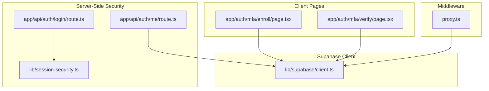
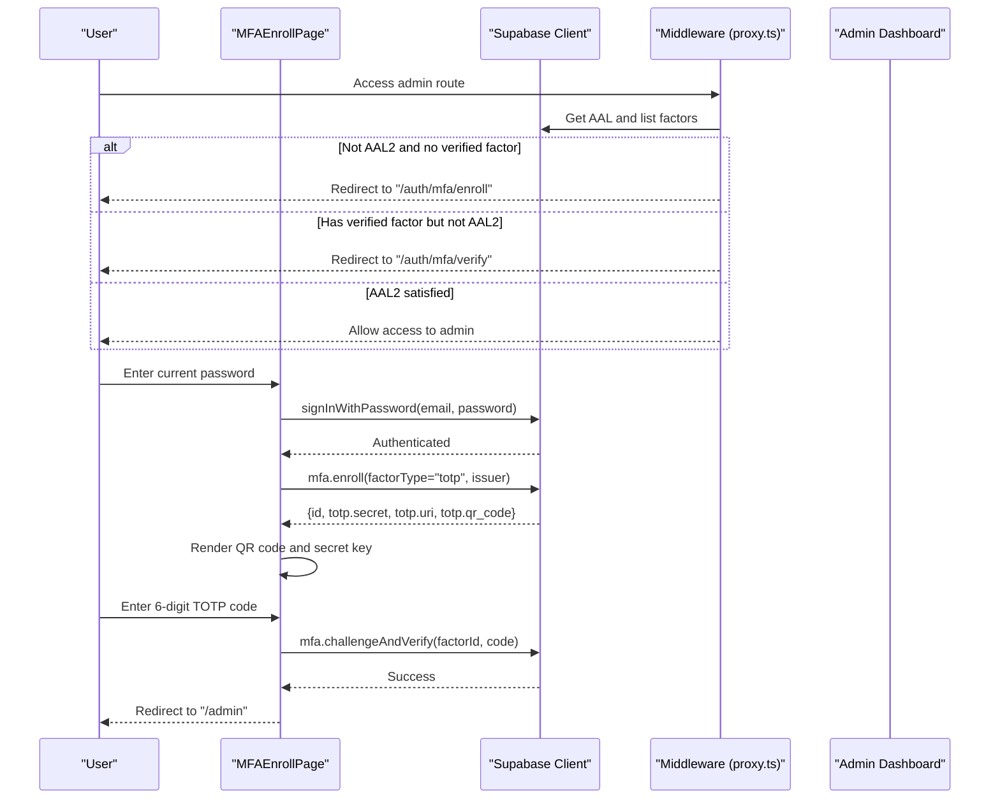
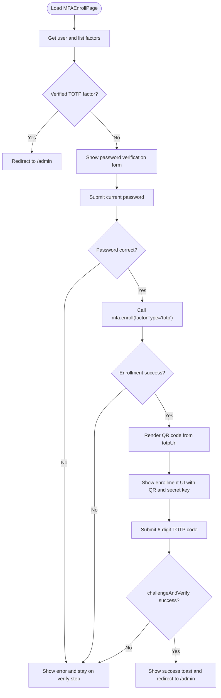
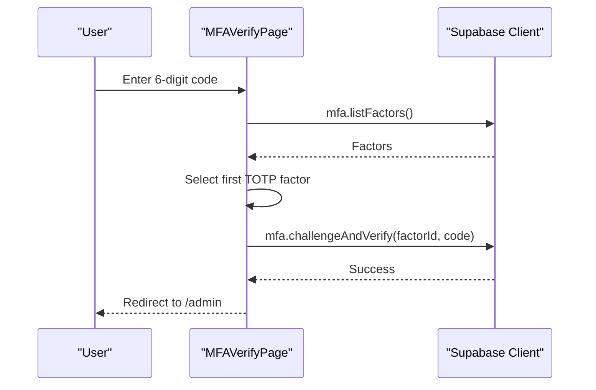
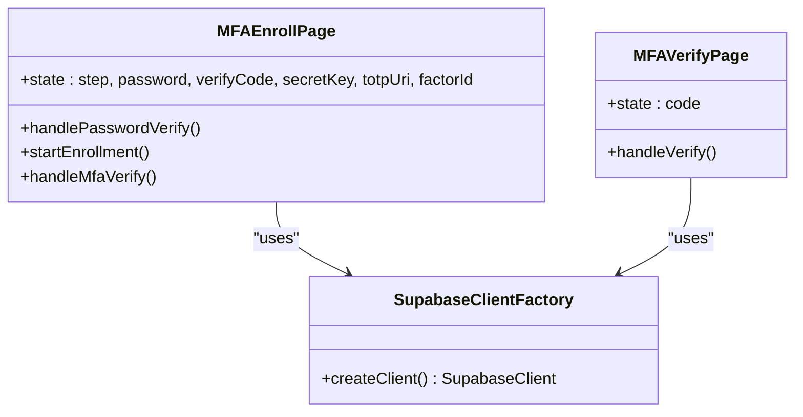
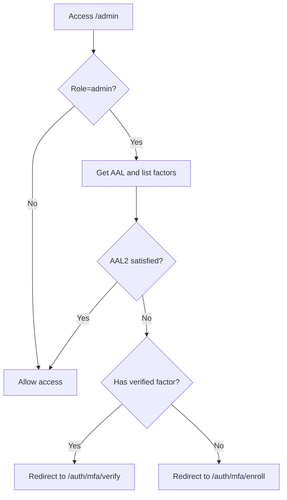
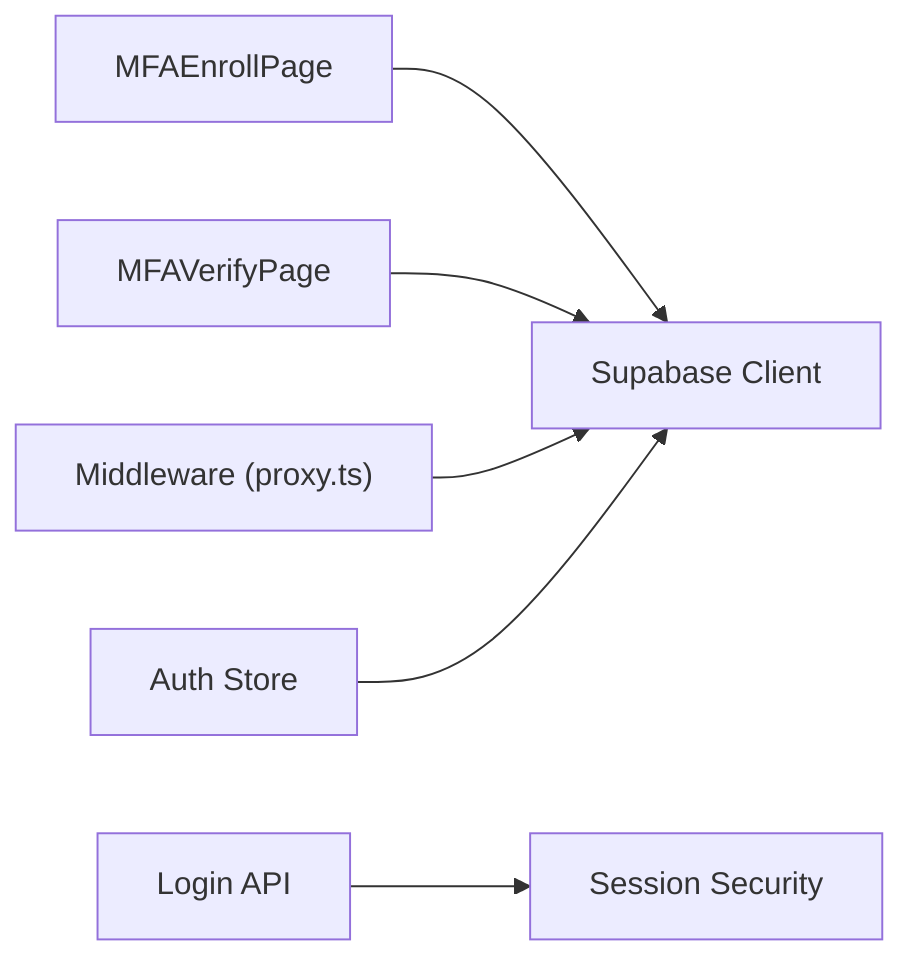

# MFA Enrollment Flow

<cite>
**Referenced Files in This Document**
- [MFAEnrollPage](file://app/auth/mfa/enroll/page.tsx)
- [MFAVerifyPage](file://app/auth/mfa/verify/page.tsx)
- [proxy.ts](file://proxy.ts)
- [client.ts](file://lib/supabase/client.ts)
- [auth-store.ts](file://lib/auth-store.ts)
- [session-security.ts](file://lib/session-security.ts)
- [login/route.ts](file://app/api/auth/login/route.ts)
- [me/route.ts](file://app/api/auth/me/route.ts)
</cite>

## Table of Contents
1. [Introduction](#introduction)
2. [Project Structure](#project-structure)
3. [Core Components](#core-components)
4. [Architecture Overview](#architecture-overview)
5. [Detailed Component Analysis](#detailed-component-analysis)
6. [Dependency Analysis](#dependency-analysis)
7. [Performance Considerations](#performance-considerations)
8. [Troubleshooting Guide](#troubleshooting-guide)
9. [Conclusion](#conclusion)

## Introduction
This document explains the MFA enrollment flow for administrators in the School Management System. It covers the end-to-end process from password verification to TOTP factor enrollment via Supabase Auth, including the UI steps, QR code generation, secret key display and copy functionality, Supabase MFA API integration, error handling, success redirection, and security considerations such as client-side validation and session refresh after enrollment.

## Project Structure
The MFA enrollment and verification pages are located under the Next.js app directory. They integrate with Supabase client libraries and middleware to enforce MFA policies for admin routes.

**Diagram sources**
- [MFAEnrollPage](file://app/auth/mfa/enroll/page.tsx#L1-L251)
- [MFAVerifyPage](file://app/auth/mfa/verify/page.tsx#L1-L91)
- [client.ts](file://lib/supabase/client.ts#L1-L9)
- [proxy.ts](file://proxy.ts#L207-L249)
- [session-security.ts](file://lib/session-security.ts#L1-L373)
- [login/route.ts](file://app/api/auth/login/route.ts#L1-L117)
- [me/route.ts](file://app/api/auth/me/route.ts#L1-L28)

**Section sources**
- [MFAEnrollPage](file://app/auth/mfa/enroll/page.tsx#L1-L251)
- [MFAVerifyPage](file://app/auth/mfa/verify/page.tsx#L1-L91)
- [client.ts](file://lib/supabase/client.ts#L1-L9)
- [proxy.ts](file://proxy.ts#L207-L249)
- [session-security.ts](file://lib/session-security.ts#L1-L373)
- [login/route.ts](file://app/api/auth/login/route.ts#L1-L117)
- [me/route.ts](file://app/api/auth/me/route.ts#L1-L28)

## Core Components
- MFAEnrollPage: Handles password verification, initiates TOTP enrollment, renders QR code, displays secret key, and verifies the TOTP code to enable MFA.
- MFAVerifyPage: Verifies a TOTP code for an existing MFA factor.
- Supabase client factory: Provides a Supabase client instance for browser-side auth operations.
- Middleware: Enforces MFA policy for admin routes and redirects to enrollment or verification as needed.
- Session security: Manages session binding and validation for robust session security.

**Section sources**
- [MFAEnrollPage](file://app/auth/mfa/enroll/page.tsx#L1-L251)
- [MFAVerifyPage](file://app/auth/mfa/verify/page.tsx#L1-L91)
- [client.ts](file://lib/supabase/client.ts#L1-L9)
- [proxy.ts](file://proxy.ts#L207-L249)
- [session-security.ts](file://lib/session-security.ts#L1-L373)

## Architecture Overview
The MFA enrollment flow integrates client-side UI with Supabase Auth MFA APIs. The middleware enforces MFA for admin routes and ensures users are redirected appropriately based on their MFA status and session assurance level.

**Diagram sources**
- [MFAEnrollPage](file://app/auth/mfa/enroll/page.tsx#L1-L251)
- [proxy.ts](file://proxy.ts#L207-L249)

## Detailed Component Analysis

### MFAEnrollPage: Step-by-Step Enrollment
- Initial checks: Retrieves current user and checks for existing verified TOTP factor; if present, redirects to admin.
- Password verification: Submits current password to Supabase Auth to confirm identity.
- Factor enrollment: Calls Supabase MFA enroll with factor type TOTP and issuer; receives factor ID, secret, TOTP URI, and QR code.
- QR rendering: Uses qr-code-styling to render a QR code from the TOTP URI.
- Secret key display: Shows the base32 secret and provides a copy-to-clipboard action.
- Verification: Submits a 6-digit TOTP code to Supabase MFA challengeAndVerify; on success, shows a success toast and redirects to admin.

**Diagram sources**
- [MFAEnrollPage](file://app/auth/mfa/enroll/page.tsx#L1-L251)

**Section sources**
- [MFAEnrollPage](file://app/auth/mfa/enroll/page.tsx#L1-L251)

### MFAVerifyPage: Verification After Enrollment
- Lists existing MFA factors and selects the first TOTP factor.
- Submits a 6-digit code to Supabase MFA challengeAndVerify.
- On success, redirects to admin.

**Diagram sources**
- [MFAVerifyPage](file://app/auth/mfa/verify/page.tsx#L1-L91)

**Section sources**
- [MFAVerifyPage](file://app/auth/mfa/verify/page.tsx#L1-L91)

### Supabase Client Integration
- The Supabase client is created via a factory that reads environment variables for the Supabase URL and anonymous key.
- Both enrollment and verification pages import and use this client to call Supabase Auth MFA APIs.

**Diagram sources**
- [client.ts](file://lib/supabase/client.ts#L1-L9)
- [MFAEnrollPage](file://app/auth/mfa/enroll/page.tsx#L1-L251)
- [MFAVerifyPage](file://app/auth/mfa/verify/page.tsx#L1-L91)

**Section sources**
- [client.ts](file://lib/supabase/client.ts#L1-L9)
- [MFAEnrollPage](file://app/auth/mfa/enroll/page.tsx#L1-L251)
- [MFAVerifyPage](file://app/auth/mfa/verify/page.tsx#L1-L91)

### Middleware Enforcement and Session Refresh
- Middleware inspects the user’s role and current AAL. If admin tries to access admin routes without AAL2, it redirects to MFA enrollment or verification depending on whether a verified factor exists.
- After successful MFA verification/enrollment, the client-side code forces a full page reload to refresh the session with AAL2.

**Diagram sources**
- [proxy.ts](file://proxy.ts#L207-L249)

**Section sources**
- [proxy.ts](file://proxy.ts#L207-L249)
- [MFAEnrollPage](file://app/auth/mfa/enroll/page.tsx#L1-L251)
- [MFAVerifyPage](file://app/auth/mfa/verify/page.tsx#L1-L91)

## Dependency Analysis
- MFAEnrollPage depends on:
  - Supabase client for auth operations.
  - qr-code-styling for QR rendering.
  - UI primitives from the shared component library.
- MFAVerifyPage depends on:
  - Supabase client for auth operations.
- Middleware depends on:
  - Supabase MFA APIs to check AAL and factors.
- Session security:
  - Server-side login route creates session records and binds sessions to fingerprints/IPs.
  - Client-side auth store subscribes to auth state changes.

**Diagram sources**
- [MFAEnrollPage](file://app/auth/mfa/enroll/page.tsx#L1-L251)
- [MFAVerifyPage](file://app/auth/mfa/verify/page.tsx#L1-L91)
- [proxy.ts](file://proxy.ts#L207-L249)
- [client.ts](file://lib/supabase/client.ts#L1-L9)
- [session-security.ts](file://lib/session-security.ts#L1-L373)
- [login/route.ts](file://app/api/auth/login/route.ts#L1-L117)
- [auth-store.ts](file://lib/auth-store.ts#L1-L110)

**Section sources**
- [MFAEnrollPage](file://app/auth/mfa/enroll/page.tsx#L1-L251)
- [MFAVerifyPage](file://app/auth/mfa/verify/page.tsx#L1-L91)
- [proxy.ts](file://proxy.ts#L207-L249)
- [client.ts](file://lib/supabase/client.ts#L1-L9)
- [session-security.ts](file://lib/session-security.ts#L1-L373)
- [login/route.ts](file://app/api/auth/login/route.ts#L1-L117)
- [auth-store.ts](file://lib/auth-store.ts#L1-L110)

## Performance Considerations
- QR rendering is performed only when the TOTP URI is available, minimizing unnecessary work.
- The UI disables submission buttons until inputs meet validation criteria (e.g., password present, 6-digit code).
- Full page reload after enabling MFA ensures the session is refreshed with AAL2, avoiding stale state.

[No sources needed since this section provides general guidance]

## Troubleshooting Guide
Common issues and resolutions:
- Incorrect password during verification: The enrollment page shows an error and keeps the user on the verify step.
- Enrollment failure: Errors from Supabase MFA enroll are caught and displayed; ensure network connectivity and valid credentials.
- QR rendering not appearing: Confirm the totpUri is set and the DOM element is mounted; the effect runs when totpUri changes.
- Secret key copy: Ensure clipboard permissions are granted; a success toast confirms the action.
- Verification failure: The verify page shows an error and keeps the user on the verify step; ensure the authenticator app is synchronized and the code is correct.
- Redirect loops: Middleware enforces MFA; if stuck, verify that a verified factor exists and the session has AAL2.

**Section sources**
- [MFAEnrollPage](file://app/auth/mfa/enroll/page.tsx#L1-L251)
- [MFAVerifyPage](file://app/auth/mfa/verify/page.tsx#L1-L91)
- [proxy.ts](file://proxy.ts#L207-L249)

## Conclusion
The MFA enrollment flow integrates a straightforward UI with Supabase Auth MFA APIs. It validates user identity via password, enrolls a TOTP factor, renders a QR code, and enables MFA through a 6-digit code. The middleware enforces MFA for admin routes, redirecting users to enrollment or verification as needed. Client-side session refresh ensures AAL2 is established after successful enrollment or verification.