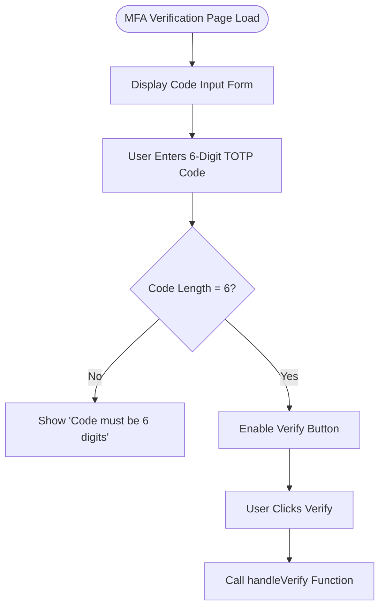
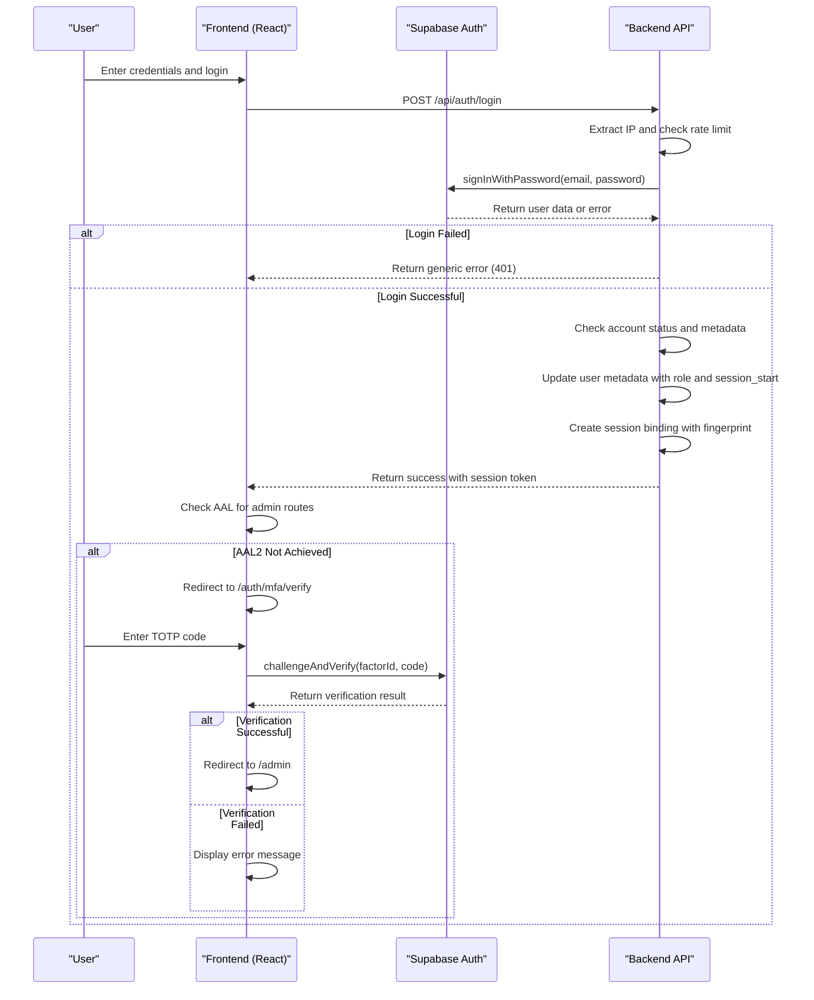
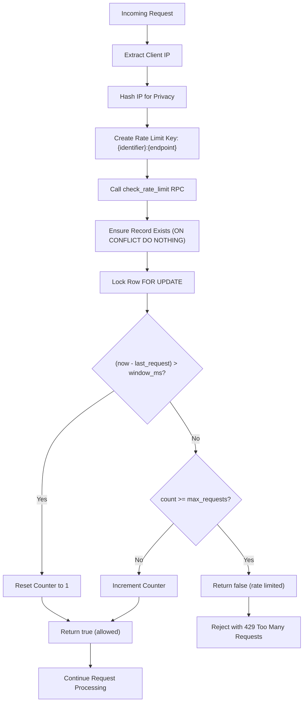
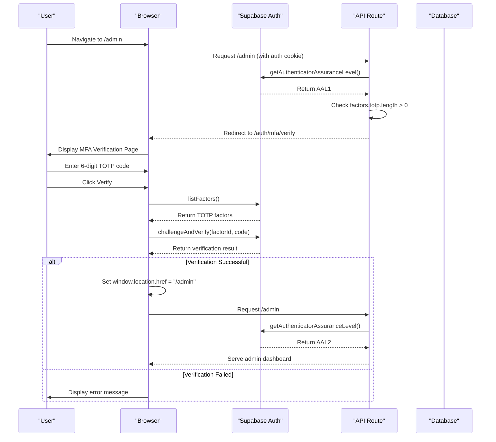

# MFA Verification Flow

<cite>
**Referenced Files in This Document**   
- [MFAVerifyPage.tsx](file://app/auth/mfa/verify/page.tsx)
- [login/route.ts](file://app/api/auth/login/route.ts)
- [session-security.ts](file://lib/session-security.ts)
- [rate-limit.ts](file://lib/rate-limit.ts)
- [security.ts](file://lib/security.ts)
- [session_security.sql](file://supabase/migrations/20260111053538_session_security.sql)
- [proxy.ts](file://proxy.ts)
</cite>

## Table of Contents
1. [Introduction](#introduction)
2. [UI Components and User Interface](#ui-components-and-user-interface)
3. [Frontend Verification Process](#frontend-verification-process)
4. [Backend Authentication Flow](#backend-authentication-flow)
5. [Session Handling and Redirection](#session-handling-and-redirection)
6. [Security Mechanisms](#security-mechanisms)
7. [Rate Limiting Implementation](#rate-limiting-implementation)
8. [IP-Based Security and Fingerprinting](#ip-based-security-and-fingerprinting)
9. [Sequence Diagram: MFA Verification Flow](#sequence-diagram-mfa-verification-flow)
10. [Conclusion](#conclusion)

## Introduction
The Multi-Factor Authentication (MFA) verification flow in the School Management System ensures secure access to protected routes, particularly for administrative users. This document details the complete MFA verification process, including the user interface, frontend logic, backend authentication, session management, and security mechanisms such as rate limiting and IP-based protection. The system leverages Supabase's MFA functionality with TOTP (Time-Based One-Time Password) codes and enforces strict security policies to prevent brute-force attacks and session hijacking.

**Section sources**
- [MFAVerifyPage.tsx](file://app/auth/mfa/verify/page.tsx)
- [proxy.ts](file://proxy.ts)

## UI Components and User Interface
The MFA verification page provides a clean and intuitive interface for users to enter their TOTP code. The UI is built using React components from the ShadCN UI library and includes the following elements:

- A centered card layout with a lock icon indicating secure authentication
- An input field for the 6-digit authentication code with auto-focus
- Form submission button with loading state indicator
- Error display area for validation and authentication failures
- Responsive design suitable for various screen sizes

The input field is styled with large, spaced digits to improve usability and includes a maximum length of 6 characters to match the TOTP format. The form is disabled until exactly 6 digits are entered, preventing premature submission.

**Diagram sources**
- [MFAVerifyPage.tsx](file://app/auth/mfa/verify/page.tsx)

**Section sources**
- [MFAVerifyPage.tsx](file://app/auth/mfa/verify/page.tsx)

## Frontend Verification Process
The frontend verification process is implemented in the `MFAVerifyPage` component using React and Supabase client SDK. When the user submits the form, the `handleVerify` function is triggered, which performs the following steps:

1. Prevents default form submission behavior
2. Sets loading state to indicate processing
3. Clears any previous error messages
4. Retrieves the list of MFA factors associated with the user
5. Identifies the TOTP factor for verification
6. Calls Supabase's `challengeAndVerify` API with the factor ID and entered code
7. Handles successful verification by redirecting to the admin dashboard
8. Catches and displays any errors that occur during the process

The component uses React hooks (`useState`, `useRouter`) for state management and navigation. The Supabase client is initialized using `createClient()` from the application's Supabase configuration.

**Section sources**
- [MFAVerifyPage.tsx](file://app/auth/mfa/verify/page.tsx)

## Backend Authentication Flow
The backend authentication flow begins with the login route, which handles the initial authentication and sets up the session. When a user attempts to log in, the system performs the following steps:

1. Extracts the client IP address using secure methods
2. Checks rate limits to prevent brute-force attacks
3. Validates user credentials using Supabase's authentication system
4. Verifies account status (active/inactive)
5. Updates user metadata in the JWT token for performance optimization
6. Creates a session binding with device fingerprint for security

For MFA verification specifically, the system uses Supabase's built-in MFA functionality. After successful password authentication, if the user is an admin accessing protected routes, the system checks the Authenticator Assurance Level (AAL). If AAL2 is not achieved, the user is redirected to the MFA verification page.

**Diagram sources**
- [login/route.ts](file://app/api/auth/login/route.ts)
- [MFAVerifyPage.tsx](file://app/auth/mfa/verify/page.tsx)
- [proxy.ts](file://proxy.ts)

**Section sources**
- [login/route.ts](file://app/api/auth/login/route.ts)
- [proxy.ts](file://proxy.ts)

## Session Handling and Redirection
After successful MFA verification, the system handles session management and redirection as follows:

1. The frontend performs a full page reload by setting `window.location.href` to `/admin`
2. This triggers the middleware to validate the session and AAL2 status
3. The session token is bound to the device fingerprint for additional security
4. User metadata is stored in the JWT claims to reduce database queries
5. Session start time is recorded server-side for absolute timeout validation

The system implements an 8-hour absolute session timeout, enforced server-side through middleware. When a session expires, the user is automatically redirected to the login page with a session timeout reason. The session binding cookie is configured with HttpOnly, Secure, and SameSite=strict attributes to prevent XSS and CSRF attacks.

**Section sources**
- [session-security.ts](file://lib/session-security.ts)
- [proxy.ts](file://proxy.ts)

## Security Mechanisms
The MFA verification flow incorporates multiple security mechanisms to protect against various attack vectors:

- **Generic error messages**: The system returns the same error message for invalid credentials and disabled accounts to prevent user enumeration
- **Session binding**: Each session is bound to a device fingerprint that includes userAgent, language, timezone, and other browser characteristics
- **Absolute session timeout**: Server-side validation ensures sessions cannot exceed 8 hours regardless of client-side activity
- **Single session enforcement**: When a user logs in from a new device, all previous sessions are invalidated
- **Security event logging**: All security-relevant events are logged for audit and monitoring purposes

The system also enforces password change policies and account status checks during the authentication process, ensuring that users with expired passwords or disabled accounts cannot access the system.

**Section sources**
- [session-security.ts](file://lib/session-security.ts)
- [login/route.ts](file://app/api/auth/login/route.ts)

## Rate Limiting Implementation
The rate limiting system protects against brute-force attacks by limiting the number of authentication attempts from a given identifier (IP address or user ID). The implementation includes:

- A `rate_limits` table that tracks request counts and timestamps
- An atomic `check_rate_limit` function that prevents race conditions
- Configurable limits (5 attempts per minute for login)
- Fail-closed behavior for security-critical endpoints
- IP hashing for privacy-preserving storage

The rate limiting function is implemented as a PostgreSQL stored procedure with `SECURITY DEFINER` to bypass RLS (Row Level Security) and ensure reliable access. The function uses row-level locking (`FOR UPDATE`) to ensure serial execution and prevent race conditions during high-concurrency scenarios.

**Diagram sources**
- [rate-limit.ts](file://lib/rate-limit.ts)
- [session_security.sql](file://supabase/migrations/20260111053538_session_security.sql)

**Section sources**
- [rate-limit.ts](file://lib/rate-limit.ts)
- [security.ts](file://lib/security.ts)

## IP-Based Security and Fingerprinting
The system implements comprehensive IP-based security and device fingerprinting to detect and prevent session hijacking:

- **IP address extraction**: The system prioritizes platform-provided IP addresses (e.g., Vercel's `x-vercel-forwarded-for`) to prevent spoofing
- **IP hashing**: IP addresses are hashed using SHA-256 with a salt before storage to protect user privacy
- **Device fingerprinting**: Client-side characteristics (userAgent, screen resolution, timezone, etc.) are hashed and stored server-side
- **Session validation**: Each request validates that the current fingerprint matches the stored fingerprint for the session
- **Security event logging**: Mismatches trigger security events and session invalidation

The fingerprinting system allows for some variation in client characteristics while maintaining security. The system can detect when a session is being used from a different device or location, which helps prevent account takeover attacks.

**Section sources**
- [security.ts](file://lib/security.ts)
- [session-security.ts](file://lib/session-security.ts)

## Sequence Diagram: MFA Verification Flow
The complete MFA verification flow from user login to admin dashboard access is illustrated in the following sequence diagram:

**Diagram sources**
- [MFAVerifyPage.tsx](file://app/auth/mfa/verify/page.tsx)
- [login/route.ts](file://app/api/auth/login/route.ts)
- [proxy.ts](file://proxy.ts)

## Conclusion
The MFA verification flow in the School Management System provides a robust and secure authentication mechanism for protecting sensitive administrative functionality. By combining Supabase's built-in MFA capabilities with custom security enhancements such as rate limiting, IP-based protection, device fingerprinting, and session binding, the system effectively mitigates common attack vectors including brute-force attacks, session hijacking, and account takeover. The implementation follows security best practices with fail-closed behavior for critical endpoints, privacy-preserving data storage, and comprehensive logging for audit purposes. The user experience remains smooth and intuitive while maintaining a high level of security.