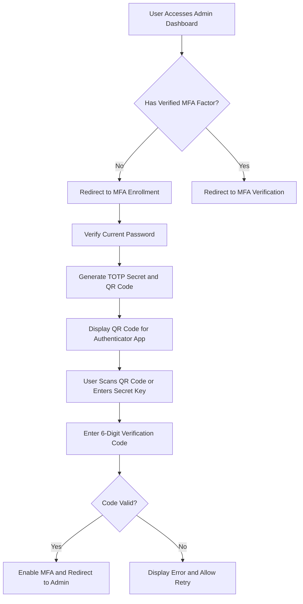
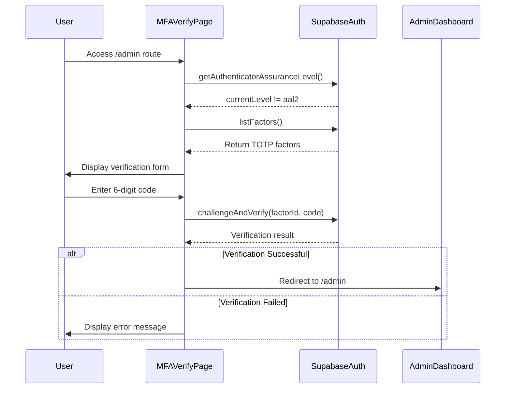
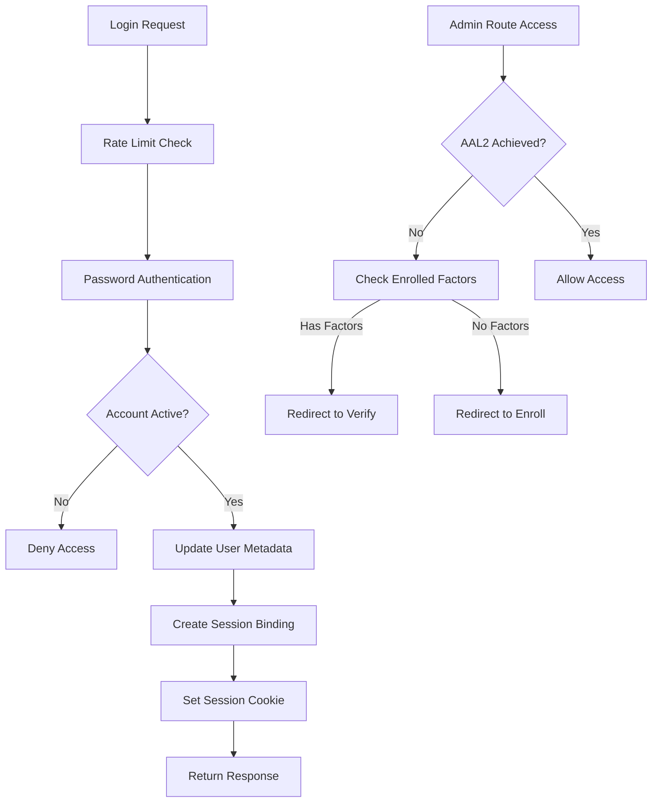
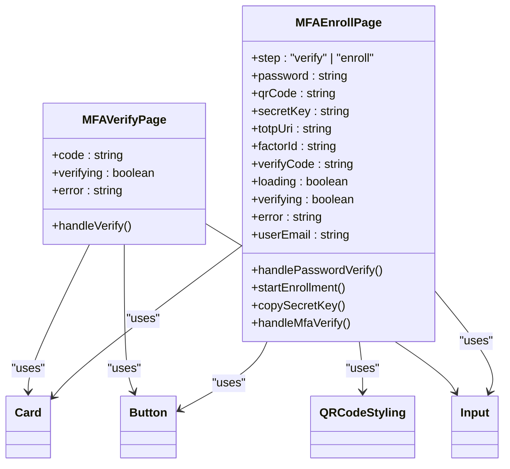
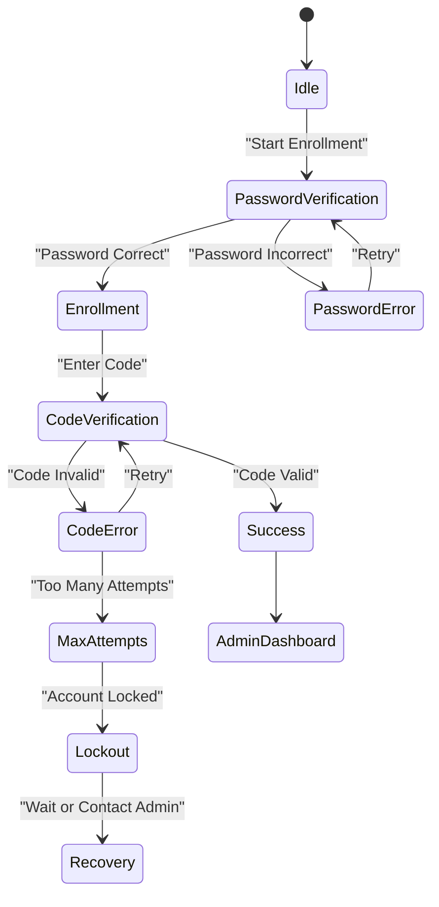
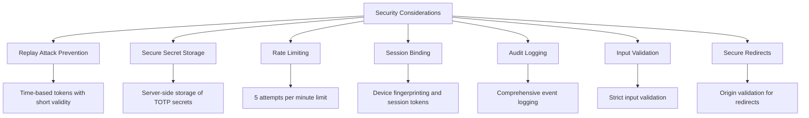
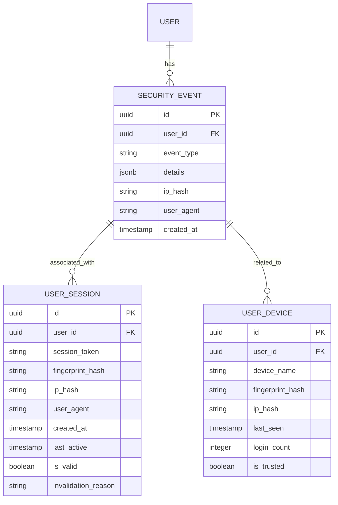

# Multi-Factor Authentication

<cite>
**Referenced Files in This Document**   
- [MFAEnrollPage.tsx](file://app/auth/mfa/enroll/page.tsx)
- [MFAVerifyPage.tsx](file://app/auth/mfa/verify/page.tsx)
- [login/route.ts](file://app/api/auth/login/route.ts)
- [session-security.ts](file://lib/session-security.ts)
- [security.ts](file://lib/security.ts)
- [audit-logs.ts](file://lib/supabase/audit-logs.ts)
- [client.ts](file://lib/supabase/client.ts)
- [server.ts](file://lib/supabase/server.ts)
- [proxy.ts](file://proxy.ts)
</cite>

## Table of Contents
1. [Introduction](#introduction)
2. [MFA Enrollment Flow](#mfa-enrollment-flow)
3. [MFA Verification Process](#mfa-verification-process)
4. [Backend Validation and Security Integration](#backend-validation-and-security-integration)
5. [User Interface Components](#user-interface-components)
6. [Error States and Recovery Options](#error-states-and-recovery-options)
7. [Security Considerations](#security-considerations)
8. [Audit Logging and Monitoring](#audit-logging-and-monitoring)
9. [Conclusion](#conclusion)

## Introduction
The Multi-Factor Authentication (MFA) system in the School Management System implements Time-Based One-Time Password (TOTP) authentication using the Authenticator Assurance Level 2 (AAL2) standard. This documentation details the complete MFA implementation, covering enrollment, verification, backend validation, and security integration. The system is designed to enhance security for administrative users by requiring a second factor during login, preventing unauthorized access even if passwords are compromised.

The MFA implementation leverages Supabase Auth's built-in MFA functionality while extending it with custom security measures including session binding, device fingerprinting, and comprehensive audit logging. The system enforces MFA for all admin users accessing the admin dashboard, redirecting them to the appropriate MFA flow based on their enrollment status.

**Section sources**
- [MFAEnrollPage.tsx](file://app/auth/mfa/enroll/page.tsx)
- [MFAVerifyPage.tsx](file://app/auth/mfa/verify/page.tsx)
- [proxy.ts](file://proxy.ts)

## MFA Enrollment Flow

The MFA enrollment process guides users through setting up TOTP-based two-factor authentication in a secure, step-by-step manner. The flow begins when an admin user attempts to access the admin dashboard without an enrolled MFA factor, triggering a redirect to the enrollment page.

**Diagram sources**
- [MFAEnrollPage.tsx](file://app/auth/mfa/enroll/page.tsx)

The enrollment process consists of two main steps:

1. **Password Verification**: The user must first verify their current password to confirm their identity before proceeding with MFA setup. This prevents unauthorized users from enrolling a second factor on an account.

2. **TOTP Setup and Verification**: After password verification, the system generates a TOTP secret key and corresponding QR code using Supabase's `enroll` method with factor type 'totp'. The QR code is rendered client-side using the qr-code-styling library and can be scanned by authenticator apps like Google Authenticator or Authy.

The enrollment page provides both QR code scanning and manual entry options, displaying the secret key with a copy-to-clipboard functionality for user convenience. Once the user enters a valid 6-digit code from their authenticator app, the system verifies it using Supabase's `challengeAndVerify` method, completing the enrollment process.

**Section sources**
- [MFAEnrollPage.tsx](file://app/auth/mfa/enroll/page.tsx)

## MFA Verification Process

The MFA verification process occurs during login for users who have already enrolled in MFA but need to elevate their session to AAL2. This flow is triggered when an admin user attempts to access protected routes after successful password authentication but without an elevated assurance level.

**Diagram sources**
- [MFAVerifyPage.tsx](file://app/auth/mfa/verify/page.tsx)
- [proxy.ts](file://proxy.ts)

The verification process follows these steps:

1. **Access Attempt**: When an admin user attempts to access the admin dashboard, the middleware checks their authenticator assurance level using `supabase.auth.mfa.getAuthenticatorAssuranceLevel()`.

2. **Factor Check**: If the assurance level is not AAL2, the system checks if the user has any verified TOTP factors using `supabase.auth.mfa.listFactors()`.

3. **Code Verification**: The user is presented with a form to enter a 6-digit code from their authenticator app. Upon submission, the code is verified against the user's enrolled factor using `supabase.auth.mfa.challengeAndVerify()`.

4. **Session Elevation**: Upon successful verification, the user's session is elevated to AAL2, allowing access to protected routes. The page reloads to refresh the session state.

The verification interface is minimal and focused, displaying only the code input field with appropriate styling for easy entry of the 6-digit code. Error handling provides clear feedback for invalid codes while maintaining security by not revealing specific details about the nature of the failure.

**Section sources**
- [MFAVerifyPage.tsx](file://app/auth/mfa/verify/page.tsx)
- [proxy.ts](file://proxy.ts)

## Backend Validation and Security Integration

The MFA implementation is tightly integrated with the application's security layer, ensuring robust protection against various attack vectors. The login route and middleware work together to enforce MFA policies and maintain session integrity.

**Diagram sources**
- [login/route.ts](file://app/api/auth/login/route.ts)
- [proxy.ts](file://proxy.ts)

Key components of the backend validation and security integration include:

**Login Route Processing**: The login API endpoint performs several security checks before granting access:
- Rate limiting to prevent brute force attacks (5 attempts per minute)
- Password authentication using Supabase's signInWithPassword method
- Account status verification to ensure the user is active
- User metadata updates to include role and session information in JWT claims

**Session Security**: The system implements advanced session protection through:
- Session binding with device fingerprinting
- HttpOnly, Secure, SameSite cookies for session tokens
- Server-side session validation on each request
- Automatic invalidation of previous sessions on new login

**Security Layer Integration**: The MFA system integrates with multiple security components:
- Rate limiting to prevent abuse of the MFA endpoints
- IP address hashing for privacy-preserving audit logs
- Client fingerprinting to detect session hijacking attempts
- Comprehensive audit logging of all MFA-related events

**Section sources**
- [login/route.ts](file://app/api/auth/login/route.ts)
- [session-security.ts](file://lib/session-security.ts)
- [security.ts](file://lib/security.ts)

## User Interface Components

The MFA implementation includes dedicated user interface components for both enrollment and verification flows, designed with security and usability in mind.

**Diagram sources**
- [MFAEnrollPage.tsx](file://app/auth/mfa/enroll/page.tsx)
- [MFAVerifyPage.tsx](file://app/auth/mfa/verify/page.tsx)

The MFA enrollment page (MFAEnrollPage) implements a multi-step process with the following key features:
- Two distinct steps: password verification and MFA enrollment
- Responsive card-based layout with clear visual hierarchy
- QR code generation and display using the qr-code-styling library
- Secret key display with copy-to-clipboard functionality
- Form validation and error handling
- Loading states and verification indicators

The MFA verification page (MFAVerifyPage) provides a streamlined interface for code entry with:
- Simple form with single input field for the 6-digit code
- Auto-focus on the code input field
- Visual feedback during verification
- Clear error messaging
- Minimal design focused on the verification task

Both components use the application's UI component library, ensuring consistency with the overall design system. They leverage React hooks for state management and side effects, with proper error handling and loading states to provide a smooth user experience.

**Section sources**
- [MFAEnrollPage.tsx](file://app/auth/mfa/enroll/page.tsx)
- [MFAVerifyPage.tsx](file://app/auth/mfa/verify/page.tsx)

## Error States and Recovery Options

The MFA system handles various error conditions gracefully, providing appropriate feedback to users while maintaining security. The implementation includes specific error handling for both enrollment and verification flows.

**Diagram sources**
- [MFAEnrollPage.tsx](file://app/auth/mfa/enroll/page.tsx)
- [MFAVerifyPage.tsx](file://app/auth/mfa/verify/page.tsx)

Error states include:

**Enrollment Errors**:
- Incorrect password during the initial verification step
- Network or API errors during factor enrollment
- Invalid verification codes during the setup process
- Browser compatibility issues with the QR code generator

**Verification Errors**:
- Invalid or expired TOTP codes
- Network or API errors during code verification
- Missing MFA factors for the user
- Session-related errors

The system provides clear, user-friendly error messages while avoiding disclosure of sensitive information that could aid attackers. For example, incorrect passwords are reported generically as "Incorrect password" rather than distinguishing between invalid credentials and other issues.

Recovery options are limited by design to maintain security, but the system allows users to:
- Retry the enrollment or verification process
- Use the manual entry option with the secret key if QR code scanning fails
- Contact administrators if they lose access to their authenticator app

The architecture does not currently implement backup codes or alternative recovery methods, relying instead on administrative intervention for account recovery, which aligns with the high-security requirements of an educational administration system.

**Section sources**
- [MFAEnrollPage.tsx](file://app/auth/mfa/enroll/page.tsx)
- [MFAVerifyPage.tsx](file://app/auth/mfa/verify/page.tsx)

## Security Considerations

The MFA implementation incorporates multiple security measures to protect against various attack vectors and ensure the integrity of the authentication process.

**Diagram sources**
- [session-security.ts](file://lib/session-security.ts)
- [security.ts](file://lib/security.ts)
- [login/route.ts](file://app/api/auth/login/route.ts)

Key security considerations include:

**Replay Attack Prevention**: The system prevents replay attacks through the use of time-based one-time passwords with a short validity period (typically 30 seconds). Each TOTP code can only be used once, and the server maintains appropriate windowing to prevent reuse of recent codes.

**Secure Secret Storage**: TOTP secrets are generated and stored securely by Supabase Auth, never exposed to client-side code in a way that would allow extraction. The secrets are transmitted over HTTPS and stored with appropriate cryptographic protection on the server side.

**Rate Limiting**: The login endpoint implements rate limiting (5 attempts per minute) to prevent brute force attacks against both password and MFA code entry. The rate limiting is enforced at the API level using Supabase's RPC functions to prevent race conditions.

**Session Binding**: The system implements strong session binding using device fingerprinting and session tokens. Each session is bound to a specific device fingerprint, and attempts to use the session from a different device are detected and blocked.

**Audit Logging**: All MFA-related events are logged for security monitoring and incident response. The audit system captures events such as MFA enrollment, verification attempts, and factor management, providing a complete trail of authentication activities.

**Input Validation**: The system validates all inputs to prevent injection attacks and other vulnerabilities. The MFA code input is strictly limited to 6 digits, and all API endpoints validate their inputs before processing.

**Secure Redirects**: The system uses secure redirects with origin validation to prevent open redirect vulnerabilities. Users are only redirected to trusted internal routes after successful authentication.

**Section sources**
- [session-security.ts](file://lib/session-security.ts)
- [security.ts](file://lib/security.ts)
- [login/route.ts](file://app/api/auth/login/route.ts)
- [rate-limit.ts](file://lib/rate-limit.ts)

## Audit Logging and Monitoring

The MFA system integrates with the application's comprehensive audit logging framework to provide visibility into authentication activities and support security monitoring.

**Diagram sources**
- [audit-logs.ts](file://lib/supabase/audit-logs.ts)
- [session-security.ts](file://lib/session-security.ts)

The audit system captures the following MFA-related events:

- **factor_in_progress**: MFA enrollment started
- **challenge_created**: MFA challenge created
- **verification_attempted**: MFA verification attempted
- **factor_unenrolled**: MFA factor removed
- **factor_deleted**: MFA factor deleted
- **factor_updated**: MFA factor updated

Each event includes relevant details such as the user ID, timestamp, IP address (hashed for privacy), user agent, and specific event details. This information enables security teams to monitor for suspicious activities, investigate incidents, and generate compliance reports.

The system also maintains records of user sessions and devices, allowing administrators to view active sessions, detect potential hijacking attempts, and manage trusted devices. The session security system logs events such as new device detection and potential session hijack attempts, providing early warning of security incidents.

**Section sources**
- [audit-logs.ts](file://lib/supabase/audit-logs.ts)
- [session-security.ts](file://lib/session-security.ts)

## Conclusion

The Multi-Factor Authentication implementation in the School Management System provides a robust security layer for protecting administrative accounts. By leveraging Supabase Auth's built-in MFA capabilities and extending them with custom security measures, the system achieves a high level of protection against unauthorized access.

The enrollment and verification flows are designed to balance security with usability, guiding users through the setup process while maintaining strong cryptographic protections. The integration with the application's security layer ensures comprehensive protection against various attack vectors, including brute force attacks, session hijacking, and replay attacks.

Key strengths of the implementation include:
- Proper enforcement of MFA for admin users through middleware
- Secure handling of TOTP secrets and verification codes
- Comprehensive audit logging for security monitoring
- Strong session binding and device fingerprinting
- Rate limiting to prevent abuse

The system could be enhanced with additional recovery options such as backup codes or alternative authentication methods, but the current implementation appropriately prioritizes security for an educational administration system where unauthorized access could have significant consequences.

Overall, the MFA implementation significantly enhances the security posture of the School Management System, protecting sensitive administrative functions and student data from unauthorized access.