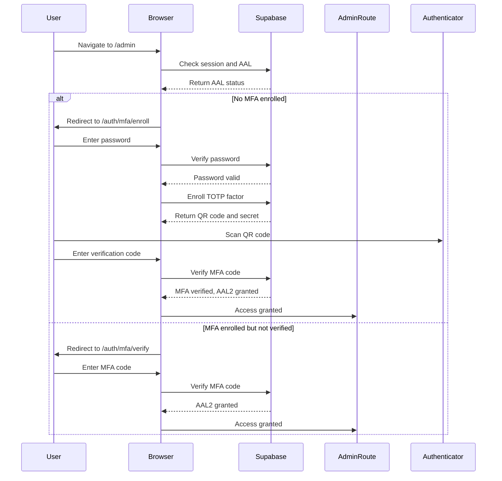
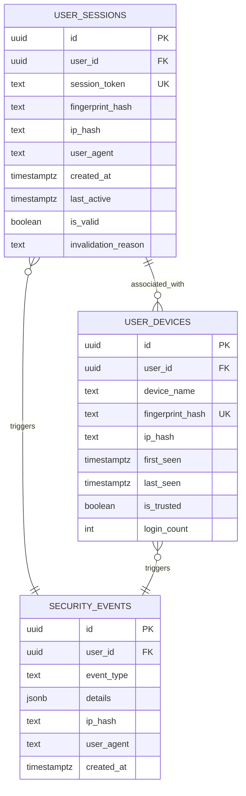
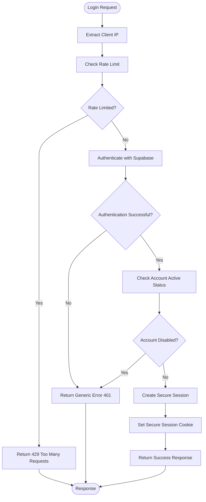
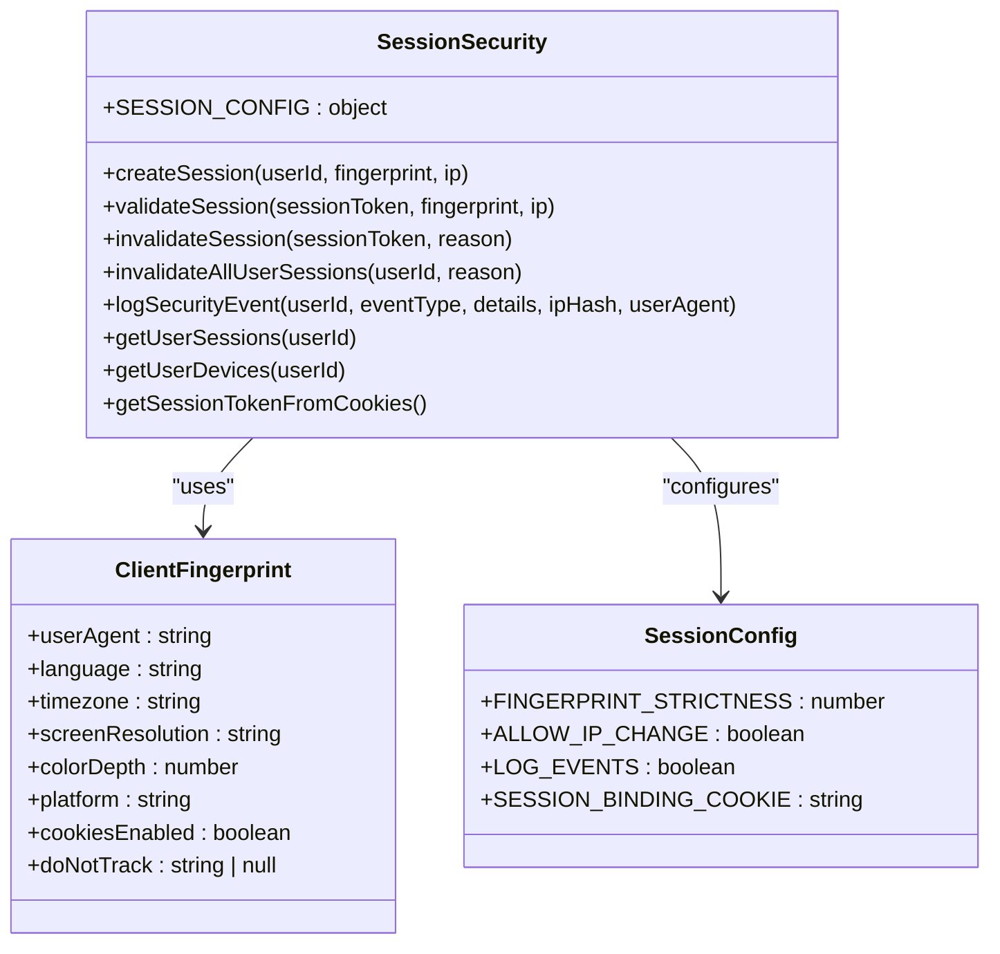
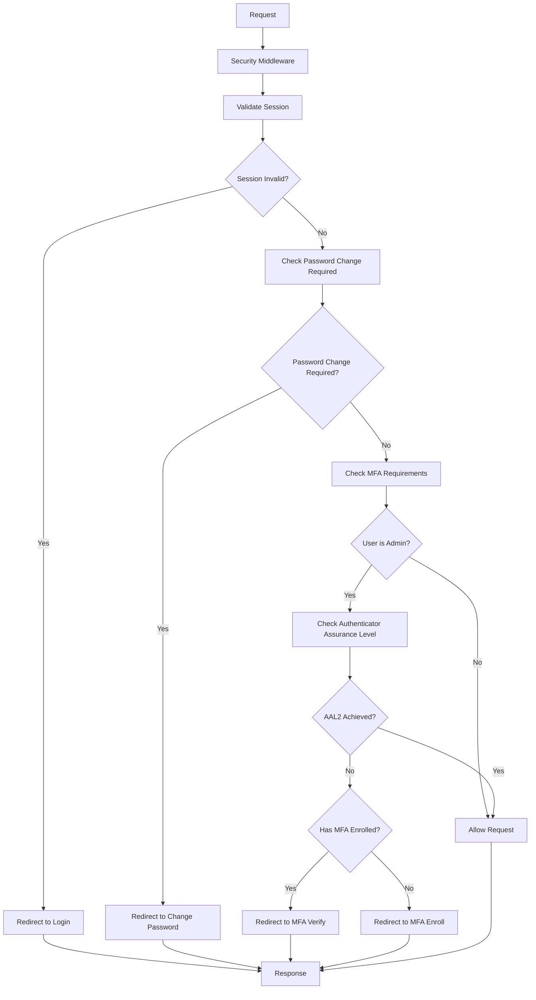

# Security Layer Integration

<cite>
**Referenced Files in This Document**   
- [lib/security.ts](file://lib/security.ts)
- [lib/session-security.ts](file://lib/session-security.ts)
- [app/api/auth/login/route.ts](file://app/api/auth/login/route.ts)
- [lib/fingerprint.ts](file://lib/fingerprint.ts)
- [lib/rate-limit.ts](file://lib/rate-limit.ts)
- [supabase/migrations/20260111053538_session_security.sql](file://supabase/migrations/20260111053538_session_security.sql)
- [supabase/migrations/20260101070343_rate_limit_rpc.sql](file://supabase/migrations/20260101070343_rate_limit_rpc.sql)
- [app/auth/mfa/enroll/page.tsx](file://app/auth/mfa/enroll/page.tsx)
- [app/auth/mfa/verify/page.tsx](file://app/auth/mfa/verify/page.tsx)
- [proxy.ts](file://proxy.ts)
</cite>

## Table of Contents
1. [Introduction](#introduction)
2. [Core Security Utilities](#core-security-utilities)
3. [MFA Flow Security Integration](#mfa-flow-security-integration)
4. [IP Hashing and Audit Logging](#ip-hashing-and-audit-logging)
5. [Login Route Security Implementation](#login-route-security-implementation)
6. [Secure Session Handling](#secure-session-handling)
7. [Threat Models Addressed](#threat-models-addressed)
8. [Security Middleware Patterns](#security-middleware-patterns)
9. [Error Handling Strategies](#error-handling-strategies)
10. [Conclusion](#conclusion)

## Introduction
This document provides comprehensive architectural documentation for the security integration in multi-factor authentication (MFA) flows within the School Management System. The security architecture implements multiple layers of protection including client IP validation, origin verification, session binding with client fingerprints, and rate limiting to prevent various attack vectors. The system leverages Supabase authentication with MFA enforcement for administrative access, ensuring that only properly authenticated users can access sensitive functionality. The security model addresses threats such as session hijacking, replay attacks, credential stuffing, and CSRF attacks through a combination of cryptographic techniques, secure session management, and request validation.

## Core Security Utilities

The security architecture is built around several core utility functions that provide foundational security capabilities. The `getClientIp` function securely extracts the client IP address by prioritizing platform-provided IP information (such as `request.ip` in Next.js/Vercel environments) and falling back to trusted headers like `x-vercel-forwarded-for` when available. This approach prevents IP spoofing by relying on infrastructure-set values rather than client-provided headers. The function also handles development environments appropriately by returning a safe localhost address.

The `validateOrigin` function provides CSRF protection by validating that requests originate from the same domain as the application. It implements a strict validation process that checks the Origin and Referer headers against the configured application URL, with a fallback to Host header comparison for dynamic deployments. This multi-layered approach ensures that cross-site requests are properly validated while maintaining compatibility across different deployment scenarios.

**Section sources**
- [lib/security.ts](file://lib/security.ts#L69-L96)
- [lib/security.ts](file://lib/security.ts#L20-L67)

## MFA Flow Security Integration

The MFA enrollment and verification flows are implemented as secure, client-side applications that integrate with Supabase's authentication system. The enrollment process begins with password verification to confirm user identity before allowing MFA setup. Once verified, the system generates a TOTP (Time-based One-Time Password) factor with a QR code that can be scanned by authenticator apps. The enrollment flow prevents users who already have verified MFA factors from re-enrolling, redirecting them directly to the admin interface.

The MFA verification flow is triggered when an authenticated user with MFA capabilities attempts to access protected administrative routes. The system checks the user's authenticator assurance level (AAL), redirecting to the appropriate MFA page if the current session does not meet the required AAL2 level. For users who have already enrolled in MFA, the system redirects to the verification page to complete the second factor authentication. For users without enrolled factors, the system directs them to the enrollment process.

**Diagram sources**
- [app/auth/mfa/enroll/page.tsx](file://app/auth/mfa/enroll/page.tsx#L14-L251)
- [app/auth/mfa/verify/page.tsx](file://app/auth/mfa/verify/page.tsx#L1-L91)
- [proxy.ts](file://proxy.ts#L229-L249)

**Section sources**
- [app/auth/mfa/enroll/page.tsx](file://app/auth/mfa/enroll/page.tsx#L14-L251)
- [app/auth/mfa/verify/page.tsx](file://app/auth/mfa/verify/page.tsx#L1-L91)
- [proxy.ts](file://proxy.ts#L229-L249)

## IP Hashing and Audit Logging

The system implements privacy-preserving IP hashing for audit logging and abuse detection. The `hashIpAddress` function uses SHA-256 with a salt (derived from environment variables) to create a consistent hash of client IP addresses. This approach allows the system to detect patterns of abuse or suspicious activity without storing raw IP addresses, thereby preserving user privacy. The hashed IP values are used in multiple security contexts, including rate limiting, session validation, and security event logging.

Audit logging is implemented through the `security_events` table, which records security-relevant events such as new device detection, session hijack attempts, and IP changes. Each event includes the hashed IP address, user agent string, and detailed context about the event. This information enables administrators to investigate security incidents while maintaining compliance with privacy regulations. The system also maintains a `user_sessions` table that tracks active sessions with their associated fingerprint hashes and IP hashes, providing a comprehensive view of user activity.

**Diagram sources**
- [lib/security.ts](file://lib/security.ts#L11-L14)
- [lib/session-security.ts](file://lib/session-security.ts#L5-L6)
- [supabase/migrations/20260111053538_session_security.sql](file://supabase/migrations/20260111053538_session_security.sql#L5-L106)

**Section sources**
- [lib/security.ts](file://lib/security.ts#L11-L14)
- [lib/session-security.ts](file://lib/session-security.ts#L5-L6)
- [supabase/migrations/20260111053538_session_security.sql](file://supabase/migrations/20260111053538_session_security.sql#L5-L106)

## Login Route Security Implementation

The login route implements multiple security measures to prevent common attacks such as brute force, credential stuffing, and CSRF. The route begins by extracting the client IP address using the secure `getClientIp` function, which ensures that the IP cannot be spoofed by malicious clients. This IP address is then used for rate limiting, with the system allowing only five login attempts per minute per IP address.

The route employs a fail-closed approach for rate limiting on authentication endpoints, meaning that any database errors during rate limit checking result in the request being denied. This prevents attackers from bypassing rate limits during database outages. The system also implements generic error messages for failed login attempts to prevent user enumeration attacks, returning the same "Invalid login credentials" message regardless of whether the email exists or the password is incorrect.

For active accounts, the system creates a secure session with client fingerprint binding. The fingerprint data, collected from the client browser, is hashed and stored with the session record. This enables the system to detect session hijacking attempts by comparing the current fingerprint with the stored hash on each request.

**Diagram sources**
- [app/api/auth/login/route.ts](file://app/api/auth/login/route.ts#L7-L117)
- [lib/rate-limit.ts](file://lib/rate-limit.ts#L16-L56)

**Section sources**
- [app/api/auth/login/route.ts](file://app/api/auth/login/route.ts#L7-L117)
- [lib/rate-limit.ts](file://lib/rate-limit.ts#L16-L56)

## Secure Session Handling

The system implements robust session handling with multiple security features to prevent session hijacking and replay attacks. When a user successfully authenticates, the system creates a session record in the `user_sessions` table that includes a cryptographically secure session token, a hash of the client fingerprint, and a hash of the client IP address. The session token is stored in an HttpOnly, Secure, SameSite=strict cookie to prevent XSS attacks and CSRF.

The client fingerprint is generated from non-PII browser characteristics including user agent, language, timezone, screen resolution, color depth, platform, and cookie support. This fingerprint is hashed with a salt to create a unique identifier for the device. On subsequent requests, the system validates that the current fingerprint hash matches the one stored in the session record. A mismatch indicates a potential session hijacking attempt and results in immediate session invalidation.

The system also implements single-session enforcement by invalidating all previous sessions when a user logs in. This prevents users from maintaining multiple active sessions across different devices, reducing the attack surface. Sessions are automatically cleaned up after 30 days of inactivity or 7 days after being invalidated.

**Diagram sources**
- [lib/session-security.ts](file://lib/session-security.ts#L1-L373)
- [lib/fingerprint.ts](file://lib/fingerprint.ts#L1-L68)

**Section sources**
- [lib/session-security.ts](file://lib/session-security.ts#L1-L373)
- [lib/fingerprint.ts](file://lib/fingerprint.ts#L1-L68)

## Threat Models Addressed

The security architecture addresses several key threat models including session hijacking, replay attacks, credential stuffing, and CSRF attacks. For session hijacking, the system implements fingerprint binding that detects when a session is accessed from a different device or browser configuration. When a fingerprint mismatch is detected, the system immediately invalidates the session and logs a security event, preventing unauthorized access.

Replay attacks are mitigated through the use of time-based one-time passwords (TOTP) for MFA, which are only valid for a short window of time. The system also uses cryptographically secure session tokens that are randomly generated and stored in HttpOnly cookies, making them difficult to intercept and replay.

Credential stuffing attacks are prevented through rate limiting on the login endpoint, which limits the number of authentication attempts from a single IP address. The system also uses generic error messages to prevent attackers from determining which email addresses are registered, reducing the effectiveness of credential stuffing attacks.

CSRF attacks are mitigated through multiple layers of protection including SameSite cookie attributes, origin validation, and the requirement for MFA on administrative endpoints. The system validates that requests to API routes originate from the same domain, preventing cross-site requests from malicious sites.

**Section sources**
- [lib/security.ts](file://lib/security.ts#L20-L67)
- [app/api/auth/login/route.ts](file://app/api/auth/login/route.ts#L7-L117)
- [lib/session-security.ts](file://lib/session-security.ts#L154-L228)

## Security Middleware Patterns

The system implements security middleware patterns through the use of Next.js middleware and Supabase integration. The proxy middleware enforces security policies such as session timeout validation, password change requirements, and MFA enforcement for administrative routes. When a user's session exceeds the timeout period, they are redirected to the login page with a session timeout reason.

The MFA enforcement pattern checks the user's role and current authenticator assurance level (AAL) when accessing protected routes. For admin users, the system requires AAL2 (multi-factor authentication) to access administrative functionality. If the user has not completed MFA verification in the current session, they are redirected to the appropriate MFA page based on whether they have already enrolled in MFA.

Rate limiting is implemented as a reusable function that can be applied to any endpoint. The function uses a database-backed rate limiting system with atomic operations to prevent race conditions. The rate limiting system is configurable with different limits and time windows for different endpoints, allowing for fine-grained control over request rates.

**Diagram sources**
- [proxy.ts](file://proxy.ts#L207-L249)
- [lib/rate-limit.ts](file://lib/rate-limit.ts#L16-L56)

**Section sources**
- [proxy.ts](file://proxy.ts#L207-L249)
- [lib/rate-limit.ts](file://lib/rate-limit.ts#L16-L56)

## Error Handling Strategies

The system implements comprehensive error handling strategies that balance security and usability. For authentication failures, the system returns generic error messages to prevent information disclosure that could aid attackers in enumeration attacks. Whether the email is invalid or the password is incorrect, the system returns the same "Invalid login credentials" message.

Security-critical operations implement a fail-closed approach, where any unexpected error results in the operation being denied. This is particularly important for rate limiting on authentication endpoints, where database errors could otherwise allow attackers to bypass rate limits during outages.

The system logs detailed security events for investigation while presenting user-friendly error messages in the UI. Security events include contextual information such as hashed IP addresses, user agent strings, and specific details about the event, enabling administrators to investigate incidents without exposing sensitive information to users.

Client-side error handling is implemented with appropriate feedback to users, including toast notifications for successful operations and inline error messages for form validation issues. The MFA enrollment and verification flows provide clear guidance to users throughout the process, helping them successfully complete the security setup.

**Section sources**
- [app/api/auth/login/route.ts](file://app/api/auth/login/route.ts#L36-L41)
- [app/auth/mfa/enroll/page.tsx](file://app/auth/mfa/enroll/page.tsx#L65-L68)
- [app/auth/mfa/verify/page.tsx](file://app/auth/mfa/verify/page.tsx#L41-L44)

## Conclusion

The security integration in MFA flows for the School Management System implements a comprehensive, multi-layered approach to authentication and session security. By combining client IP validation, origin verification, fingerprint-based session binding, and rate limiting, the system effectively mitigates common attack vectors including session hijacking, replay attacks, credential stuffing, and CSRF. The architecture leverages Supabase's robust authentication system while adding additional security layers through custom middleware and database-backed session management.

The system's design prioritizes both security and usability, providing strong protection against attacks while maintaining a smooth user experience. Security measures such as generic error messages, fail-closed rate limiting, and automatic session invalidation help prevent abuse without compromising user privacy. The comprehensive audit logging and security event tracking enable administrators to monitor and respond to potential threats effectively.

This security architecture serves as a robust foundation for protecting sensitive administrative functionality within the school management system, ensuring that only properly authenticated users can access critical functionality while maintaining compliance with privacy regulations and security best practices.