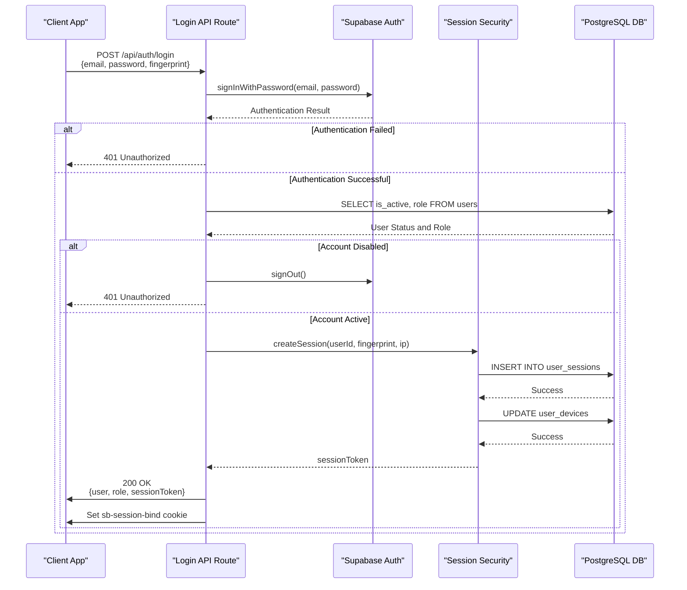
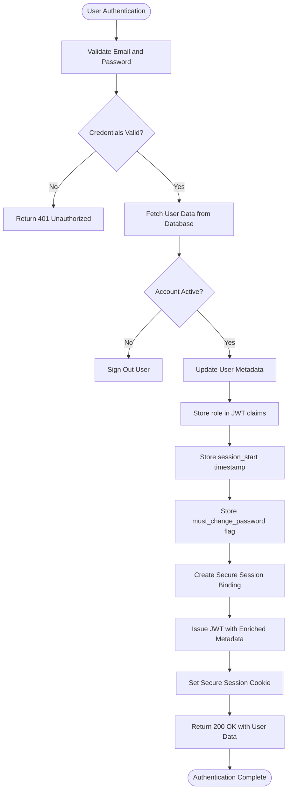
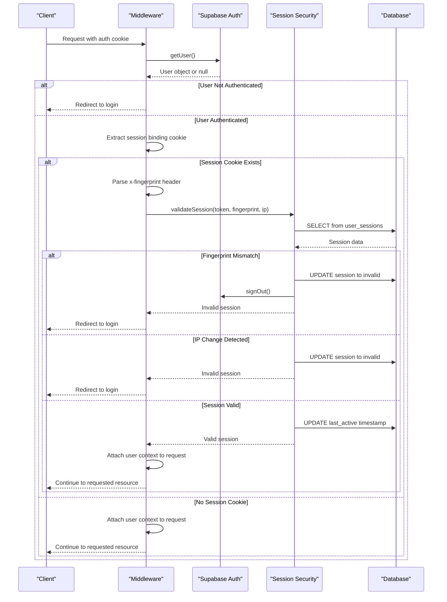
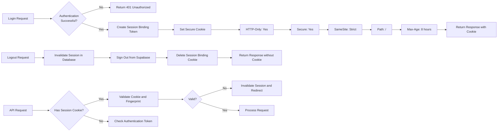
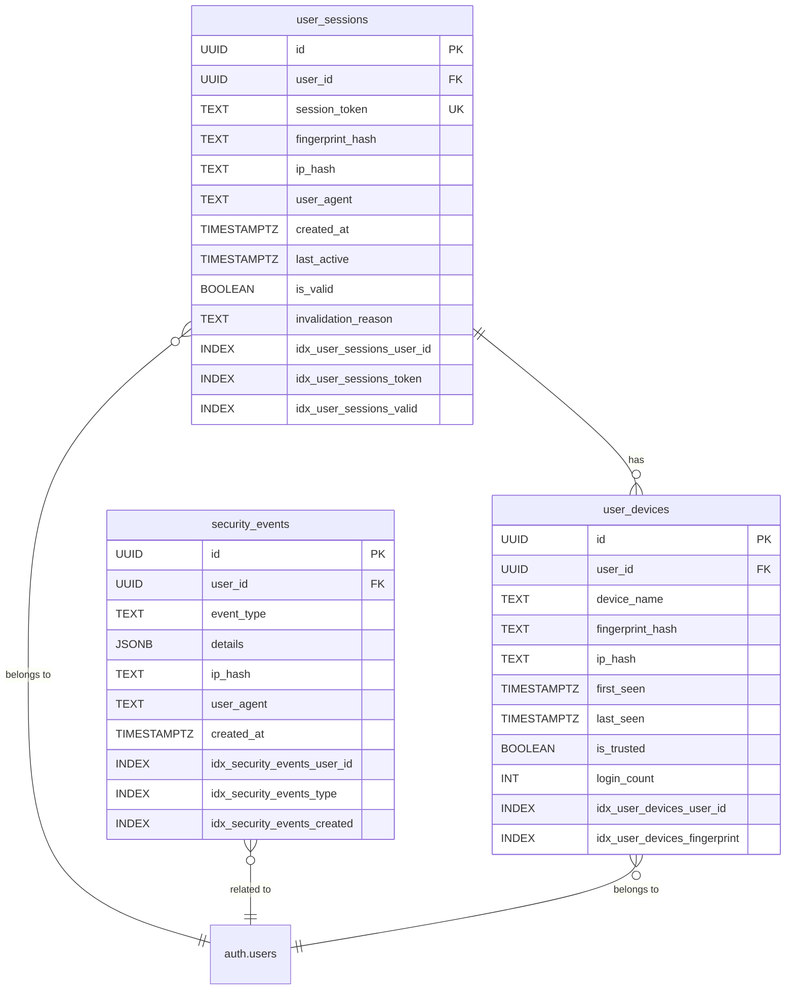
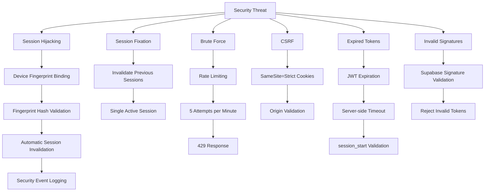

# Session Creation and Validation

<cite>
**Referenced Files in This Document**   
- [middleware.ts](file://lib/supabase/middleware.ts)
- [session-security.ts](file://lib/session-security.ts)
- [login/route.ts](file://app/api/auth/login/route.ts)
- [logout/route.ts](file://app/api/auth/logout/route.ts)
- [me/route.ts](file://app/api/auth/me/route.ts)
- [fingerprint.ts](file://lib/fingerprint.ts)
- [security.ts](file://lib/security.ts)
- [check-auth/route.ts](file://app/api/check-auth/route.ts)
- [sessions/route.ts](file://app/api/auth/sessions/route.ts)
- [20260111053538_session_security.sql](file://supabase/migrations/20260111053538_session_security.sql)
- [20260111054141_fix_session_functions_search_path.sql](file://supabase/migrations/20260111054141_fix_session_functions_search_path.sql)
- [20260111_session_security.sql](file://supabase/migrations/20260111_session_security.sql)
- [active-sessions.tsx](file://components/active-sessions.tsx)
- [proxy.ts](file://proxy.ts)
</cite>

## Table of Contents
1. [Introduction](#introduction)
2. [Session Creation Flow](#session-creation-flow)
3. [JWT Token Issuance and Metadata](#jwt-token-issuance-and-metadata)
4. [Session Validation and Middleware](#session-validation-and-middleware)
5. [Device Fingerprinting and Security Binding](#device-fingerprinting-and-security-binding)
6. [Secure Cookie Implementation](#secure-cookie-implementation)
7. [Database Schema and Session Storage](#database-schema-and-session-storage)
8. [Session Management API Endpoints](#session-management-api-endpoints)
9. [Common Security Issues and Mitigation](#common-security-issues-and-mitigation)
10. [Complete Authentication Flow Example](#complete-authentication-flow-example)

## Introduction
This document details the session creation and validation mechanism in the School Management System, focusing on the integration between Supabase Auth, custom session security measures, and middleware validation. The system implements a robust security model that combines JWT-based authentication with device fingerprinting, secure cookie policies, and server-side session validation to prevent session hijacking and unauthorized access.

The architecture ensures that user authentication triggers secure session creation with metadata enrichment, while subsequent requests are validated through comprehensive middleware checks that verify authentication state, attach user context, and enforce security policies based on device fingerprints and session binding tokens.

**Section sources**
- [middleware.ts](file://lib/supabase/middleware.ts#L1-L38)
- [session-security.ts](file://lib/session-security.ts#L1-L373)

## Session Creation Flow

The session creation process begins when a user successfully authenticates through the login endpoint. Upon successful credentials verification with Supabase Auth, the system creates a server-side session record that binds the authentication session to the user's device characteristics.

When a user submits login credentials, the `/api/auth/login` endpoint first validates the credentials against Supabase Auth. Upon successful authentication, the system retrieves the user's account status and role information from the database. If the account is active, the system proceeds to create a secure session binding.

The session creation process involves generating a cryptographically secure session token and associating it with a hashed fingerprint of the user's device characteristics. This fingerprint includes browser user agent, language settings, timezone, screen resolution, color depth, platform, and other non-PII browser characteristics. The session record is stored in the `user_sessions` database table with references to the user ID, fingerprint hash, IP address hash, and creation timestamp.

A critical security feature is the automatic invalidation of all previous sessions for the user upon new login, enforcing single-session policy and preventing session fixation attacks. This is accomplished through the `invalidate_user_sessions` PostgreSQL function that updates all active sessions for the user to be marked as invalid.



**Diagram sources**
- [login/route.ts](file://app/api/auth/login/route.ts#L7-L117)
- [session-security.ts](file://lib/session-security.ts#L68-L147)
- [20260111053538_session_security.sql](file://supabase/migrations/20260111053538_session_security.sql#L5-L16)

**Section sources**
- [login/route.ts](file://app/api/auth/login/route.ts#L7-L117)
- [session-security.ts](file://lib/session-security.ts#L68-L147)

## JWT Token Issuance and Metadata

The authentication system enriches JWT tokens with critical metadata to enhance security and reduce database queries. When a user successfully logs in, the system updates the user's metadata in Supabase Auth to include role information, account status, and a server-side session start timestamp.

The `session_start` metadata field is particularly important as it enables server-side absolute timeout validation. Unlike traditional JWT expiration which relies on the token's built-in expiration claim, the server can validate that the current time has not exceeded the maximum allowed session duration since `session_start`, providing an additional layer of security against token replay attacks.

This metadata enrichment strategy reduces middleware database queries by approximately 95%, as subsequent requests can extract user role and status directly from the JWT claims rather than querying the database on each request. The metadata is stored in the `user_metadata` field of the Supabase auth.users table and is automatically included in the JWT token issued to the client.

The system also implements a password change policy by including the `must_change_password` flag in the JWT claims. This allows the middleware to redirect users who are required to change their password upon first login or after an administrator-initiated password reset.



**Diagram sources**
- [login/route.ts](file://app/api/auth/login/route.ts#L61-L78)
- [proxy.ts](file://proxy.ts#L213-L227)

**Section sources**
- [login/route.ts](file://app/api/auth/login/route.ts#L61-L78)
- [proxy.ts](file://proxy.ts#L213-L227)

## Session Validation and Middleware

The session validation process is implemented through middleware that intercepts all incoming requests to verify authentication state and attach user context. The middleware uses Supabase's server-side client to validate the authentication token and extract user information from the JWT.

The validation process begins with the `updateSession` function in `middleware.ts`, which creates a Supabase server client instance with access to the request cookies. This client is used to call `getUser()` which validates the authentication token and returns the user object if the token is valid and not expired.

For API routes and protected pages, the system implements additional validation through the `proxy.ts` file, which contains more comprehensive security checks. This includes validation of the session binding token against the device fingerprint, enforcement of password change policies, and MFA requirements for administrative users.

When a request includes a session binding cookie, the middleware extracts the client's fingerprint from the `x-fingerprint` header and validates it against the stored fingerprint hash in the database. If the fingerprints do not match, indicating a potential session hijacking attempt, the system immediately invalidates the session, signs out the user, and redirects to the login page.

The middleware also implements absolute session timeout by checking the `session_start` timestamp in the JWT claims against the current time. If the session duration exceeds the configured maximum (8 hours), the user is redirected to the login page with a session timeout reason.



**Diagram sources**
- [middleware.ts](file://lib/supabase/middleware.ts#L4-L37)
- [proxy.ts](file://proxy.ts#L111-L145)
- [session-security.ts](file://lib/session-security.ts#L154-L227)

**Section sources**
- [middleware.ts](file://lib/supabase/middleware.ts#L4-L37)
- [proxy.ts](file://proxy.ts#L111-L145)

## Device Fingerprinting and Security Binding

The system implements device fingerprinting as a critical security measure to prevent session hijacking and cookie theft. The fingerprinting mechanism collects non-PII browser characteristics to create a unique identifier for the user's device, which is then bound to the authentication session.

The client-side `fingerprint.ts` module collects the following characteristics to generate a fingerprint:
- User agent string
- Browser language
- Timezone
- Screen resolution
- Color depth
- Platform
- Cookies enabled status
- Do Not Track setting

This fingerprint data is sent to the server during login and stored as a SHA-256 hash in the `user_sessions` table. The hash is generated using a salt from environment variables to prevent rainbow table attacks. The same fingerprinting process is repeated on each subsequent request, and the server validates that the current fingerprint matches the one stored during session creation.

The system also tracks trusted devices in the `user_devices` table, which stores information about each device the user has logged in from, including the device name (parsed from user agent), login count, and last seen timestamp. When a user logs in from a new device, the system records this event in the security logs and can notify the user of the new device login.

The fingerprint validation is configurable through the `SESSION_CONFIG` object, which allows adjusting the strictness of fingerprint matching and whether IP address changes are permitted. This flexibility accommodates legitimate use cases like mobile users switching between networks while maintaining security against session hijacking.

```mermaid
classDiagram
class ClientFingerprint {
+string userAgent
+string language
+string timezone
+string screenResolution
+number colorDepth
+string platform
+boolean cookiesEnabled
+string | null doNotTrack
}
class SessionSecurity {
+SESSION_CONFIG : object
+hashFingerprint(fingerprint) : string
+generateSessionToken() : string
+createSession(userId, fingerprint, ip) : Promise~SessionResult~
+validateSession(sessionToken, fingerprint, ip) : Promise~ValidationResult~
+invalidateSession(sessionToken, reason) : Promise~boolean~
+invalidateAllUserSessions(userId, reason) : Promise~number~
+logSecurityEvent(userId, eventType, details, ipHash, userAgent) : Promise~void~
+getUserSessions(userId) : Promise~Session[]~
+getUserDevices(userId) : Promise~Device[]~
+parseDeviceName(userAgent) : string
+getSessionTokenFromCookies() : Promise~string | null~
}
class FingerprintUtils {
+generateFingerprint() : ClientFingerprint
+storeSessionToken(token) : void
+getStoredSessionToken() : string | null
+clearSessionToken() : void
}
ClientFingerprint --> SessionSecurity : "used in"
FingerprintUtils --> ClientFingerprint : "generates"
SessionSecurity --> "1" "user_sessions" : "stores"
SessionSecurity --> "1" "user_devices" : "tracks"
SessionSecurity --> "1" "security_events" : "logs"
class "user_sessions" {
+id : UUID
+user_id : UUID
+session_token : TEXT
+fingerprint_hash : TEXT
+ip_hash : TEXT
+user_agent : TEXT
+created_at : TIMESTAMPTZ
+last_active : TIMESTAMPTZ
+is_valid : BOOLEAN
+invalidation_reason : TEXT
}
class "user_devices" {
+id : UUID
+user_id : UUID
+device_name : TEXT
+fingerprint_hash : TEXT
+ip_hash : TEXT
+first_seen : TIMESTAMPTZ
+last_seen : TIMESTAMPTZ
+is_trusted : BOOLEAN
+login_count : INT
}
class "security_events" {
+id : UUID
+user_id : UUID
+event_type : TEXT
+details : JSONB
+ip_hash : TEXT
+user_agent : TEXT
+created_at : TIMESTAMPTZ
}
SessionSecurity --> "user_sessions" : "creates, validates"
SessionSecurity --> "user_devices" : "updates, queries"
SessionSecurity --> "security_events" : "logs events"
```

**Diagram sources**
- [fingerprint.ts](file://lib/fingerprint.ts#L8-L17)
- [session-security.ts](file://lib/session-security.ts#L31-L373)
- [20260111053538_session_security.sql](file://supabase/migrations/20260111053538_session_security.sql#L5-L30)

**Section sources**
- [fingerprint.ts](file://lib/fingerprint.ts#L8-L68)
- [session-security.ts](file://lib/session-security.ts#L31-L373)

## Secure Cookie Implementation

The system implements secure cookie policies to protect session tokens from theft and unauthorized access. The session binding token is stored in an HTTP-only, secure cookie with strict SameSite attributes to prevent cross-site scripting (XSS) and cross-site request forgery (CSRF) attacks.

The session binding cookie named `sb-session-bind` is set with the following security attributes:
- **HttpOnly**: Prevents client-side JavaScript from accessing the cookie, mitigating XSS attacks
- **Secure**: Ensures the cookie is only sent over HTTPS connections
- **SameSite**: Set to 'strict' to prevent cross-site requests from sending the cookie
- **Path**: Set to '/' to make the cookie available across the entire application
- **Max-Age**: Set to 8 hours (28,800 seconds) to enforce session timeout

These cookie attributes work in conjunction with the server-side session validation to create multiple layers of security. Even if an attacker were to obtain the authentication token through an XSS vulnerability, they would not be able to access the session binding cookie due to the HttpOnly flag. Without the session binding token, the attacker cannot pass the fingerprint validation check on subsequent requests.

The cookie is set during the login process and automatically cleared during logout. The system also implements a "logout from all devices" feature that invalidates all active sessions for the user and clears the session binding cookie from the current device.



**Diagram sources**
- [login/route.ts](file://app/api/auth/login/route.ts#L99-L107)
- [logout/route.ts](file://app/api/auth/logout/route.ts#L24-L26)
- [sessions/route.ts](file://app/api/auth/sessions/route.ts#L64-L65)

**Section sources**
- [login/route.ts](file://app/api/auth/login/route.ts#L99-L107)
- [logout/route.ts](file://app/api/auth/logout/route.ts#L24-L26)

## Database Schema and Session Storage

The session security system relies on three core database tables to store session information, track devices, and log security events. These tables are created and managed through Supabase migrations and are protected by Row Level Security (RLS) policies.

The `user_sessions` table stores active session records with a unique session token, fingerprint hash, IP hash, and timestamps for creation and last activity. Each session is linked to a user ID and can be invalidated server-side regardless of the JWT token's expiration. The table includes indexes on user_id and session_token for fast lookups during validation.

The `user_devices` table tracks the devices users have logged in from, storing the device name, fingerprint hash, and login statistics. This allows users to view their active devices and recognize unfamiliar devices that might indicate a security breach. The table enforces uniqueness on the combination of user_id and fingerprint_hash to prevent duplicate device records.

The `security_events` table logs important security events such as new device logins, session hijacking attempts, and IP address changes. These logs are invaluable for security monitoring and incident response, providing an audit trail of authentication activities.

All three tables have RLS policies enabled to ensure users can only access their own session and device information. Administrative functions that require broader access use the Supabase service role key, which bypasses RLS for server-side operations.



**Diagram sources**
- [20260111053538_session_security.sql](file://supabase/migrations/20260111053538_session_security.sql#L5-L30)
- [20260111_session_security.sql](file://supabase/migrations/20260111_session_security.sql#L5-L35)

**Section sources**
- [20260111053538_session_security.sql](file://supabase/migrations/20260111053538_session_security.sql#L1-L106)

## Session Management API Endpoints

The system provides several API endpoints for managing user sessions and retrieving session information. These endpoints allow users to view their active sessions, log out from all devices, and check authentication status.

The `/api/auth/sessions` endpoint supports both GET and DELETE methods. The GET method returns a list of the user's active sessions and devices, which is used by the `ActiveSessions` component to display login history. The DELETE method implements the "logout from all devices" functionality by invalidating all active sessions for the user.

The `/api/auth/login` endpoint handles user authentication and session creation, while the `/api/auth/logout` endpoint handles session termination and cookie cleanup. The `/api/auth/me` endpoint returns the authenticated user's information, and the `/api/check-auth` endpoint allows administrators to check the authentication status of other users.

These endpoints follow consistent error handling patterns and security checks, ensuring that only authenticated users can access their own session information and that all state-changing operations are properly validated.

```mermaid
flowchart TD
A[/api/auth/login] --> B[POST]
B --> C[Authenticate with Supabase]
C --> D[Create Session Binding]
D --> E[Set Secure Cookie]
E --> F[Return User Data]
G[/api/auth/logout] --> H[POST]
H --> I[Invalidate Session]
I --> J[Sign Out from Supabase]
J --> K[Delete Cookie]
K --> L[Return Success]
M[/api/auth/sessions] --> N[GET]
N --> O[Get User Sessions]
O --> P[Get User Devices]
P --> Q[Return Session Data]
M --> R[DELETE]
R --> S[Invalidate All User Sessions]
S --> T[Sign Out from Supabase]
T --> U[Delete Cookie]
U --> V[Return Success]
W[/api/auth/me] --> X[GET]
X --> Y[Get User Data]
Y --> Z[Return User Information]
AA[/api/check-auth] --> AB[POST]
AB --> AC[Check Admin Role]
AC --> AD[Check User Auth Status]
AD --> AE[Return Auth Status]
```

**Diagram sources**
- [login/route.ts](file://app/api/auth/login/route.ts#L7-L117)
- [logout/route.ts](file://app/api/auth/logout/route.ts#L6-L36)
- [sessions/route.ts](file://app/api/auth/sessions/route.ts#L6-L72)
- [me/route.ts](file://app/api/auth/me/route.ts#L4-L28)
- [check-auth/route.ts](file://app/api/check-auth/route.ts#L19-L64)

**Section sources**
- [login/route.ts](file://app/api/auth/login/route.ts#L7-L117)
- [logout/route.ts](file://app/api/auth/logout/route.ts#L6-L36)
- [sessions/route.ts](file://app/api/auth/sessions/route.ts#L6-L72)

## Common Security Issues and Mitigation

The system addresses several common security issues related to session management through proactive mitigation strategies:

**Expired Tokens**: The system implements both JWT expiration and server-side session validation to handle expired tokens. When a token expires, the middleware redirects the user to the login page with a session timeout reason. The server-side `session_start` validation provides an additional layer of protection against token replay attacks.

**Invalid Signatures**: Supabase Auth automatically validates JWT signatures, rejecting any tokens with invalid signatures. The system does not attempt to validate signatures manually but relies on Supabase's built-in validation. Any request with an invalid signature is treated as an unauthenticated request and redirected to the login page.

**Session Fixation**: The system mitigates session fixation attacks by invalidating all previous sessions when a user logs in. This ensures that any session tokens an attacker might have obtained become immediately invalid upon successful authentication.

**Session Hijacking**: The primary defense against session hijacking is the device fingerprint binding. Even if an attacker obtains a valid authentication token, they cannot pass the fingerprint validation unless they are using the same device with identical characteristics. The system automatically detects and responds to fingerprint mismatches by invalidating the compromised session.

**Brute Force Attacks**: The login endpoint implements rate limiting to prevent brute force attacks. Users are limited to 5 login attempts per minute, after which they receive a 429 Too Many Requests response. This protects against automated password guessing attacks.

**CSRF Protection**: The system uses SameSite=Strict cookies and validates request origins to prevent CSRF attacks. The `validateOrigin` function ensures that requests originate from the same domain, adding an additional layer of protection for state-changing operations.



**Diagram sources**
- [login/route.ts](file://app/api/auth/login/route.ts#L12-L21)
- [security.ts](file://lib/security.ts#L20-L67)
- [session-security.ts](file://lib/session-security.ts#L176-L197)
- [proxy.ts](file://proxy.ts#L207-L209)

**Section sources**
- [login/route.ts](file://app/api/auth/login/route.ts#L12-L21)
- [security.ts](file://lib/security.ts#L20-L67)

## Complete Authentication Flow Example

The following example illustrates a complete authentication flow from login to session validation:

1. User navigates to the login page and enters their email and password
2. Client-side code collects the device fingerprint using `generateFingerprint()`
3. Login request is sent to `/api/auth/login` with email, password, and fingerprint
4. Server validates credentials with Supabase Auth
5. Server retrieves user account status and role from the database
6. Server creates a new session record with the fingerprint hash and IP hash
7. Server invalidates all previous sessions for the user
8. Server updates the user's metadata with role, session_start, and other claims
9. Server generates a session binding token and sets it in an HTTP-only cookie
10. Client receives authentication response and stores session token locally
11. For subsequent requests, client sends authentication token and fingerprint
12. Middleware validates the authentication token with Supabase
13. Middleware extracts the session binding token from the cookie
14. Middleware validates the fingerprint against the stored hash
15. If validation passes, request proceeds to the requested resource
16. If validation fails, session is invalidated and user is redirected to login

This flow demonstrates the comprehensive security measures implemented in the system, combining client-side fingerprinting, server-side session management, secure cookie policies, and continuous validation to protect user accounts and prevent unauthorized access.

**Section sources**
- [login/route.ts](file://app/api/auth/login/route.ts#L7-L117)
- [middleware.ts](file://lib/supabase/middleware.ts#L4-L37)
- [session-security.ts](file://lib/session-security.ts#L68-L147)
- [fingerprint.ts](file://lib/fingerprint.ts#L22-L33)