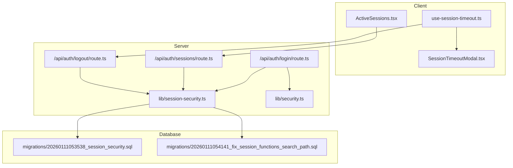
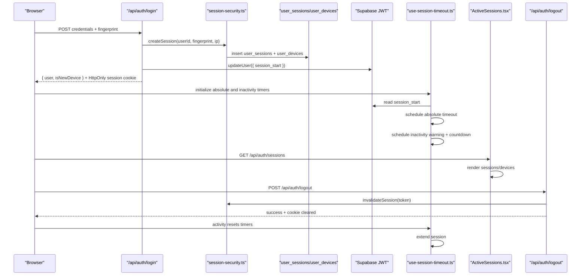
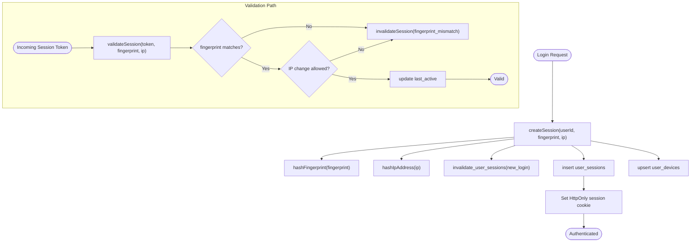
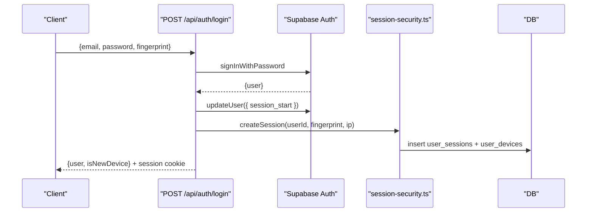
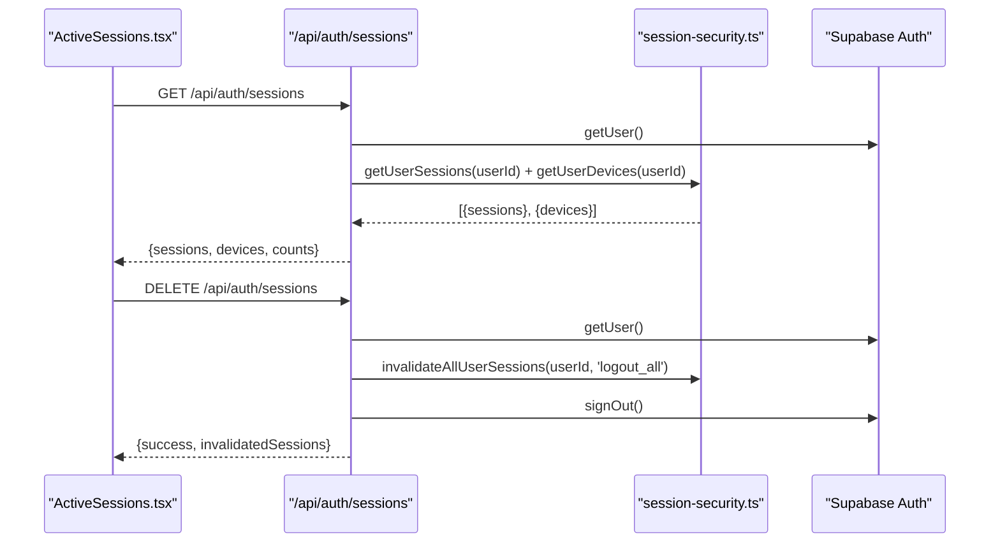
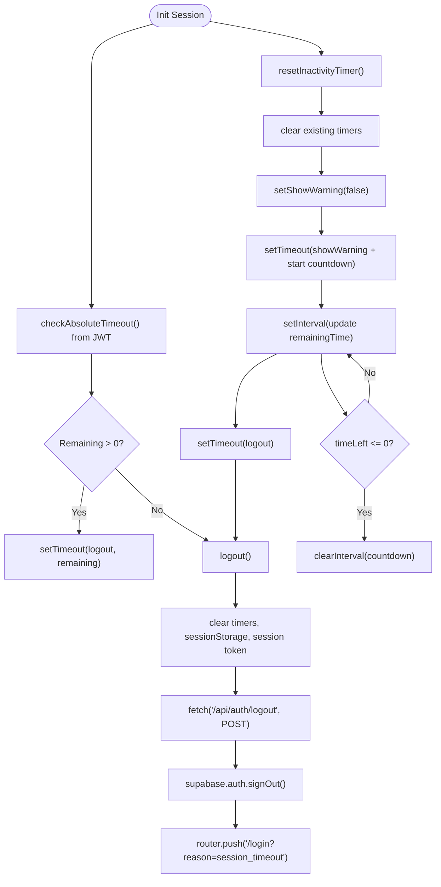
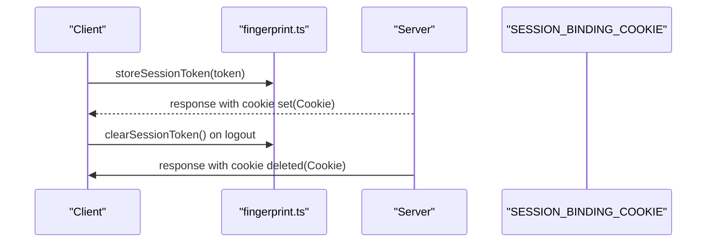
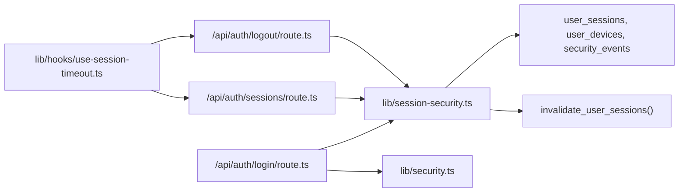

# Session Lifecycle Management

<cite>
**Referenced Files in This Document**
- [app/api/auth/sessions/route.ts](file://app/api/auth/sessions/route.ts)
- [lib/session-security.ts](file://lib/session-security.ts)
- [app/api/auth/logout/route.ts](file://app/api/auth/logout/route.ts)
- [lib/fingerprint.ts](file://lib/fingerprint.ts)
- [lib/hooks/use-session-timeout.ts](file://lib/hooks/use-session-timeout.ts)
- [components/session-timeout-modal.tsx](file://components/session-timeout-modal.tsx)
- [components/active-sessions.tsx](file://components/active-sessions.tsx)
- [app/api/auth/login/route.ts](file://app/api/auth/login/route.ts)
- [lib/security.ts](file://lib/security.ts)
- [supabase/migrations/20260111053538_session_security.sql](file://supabase/migrations/20260111053538_session_security.sql)
- [supabase/migrations/20260111054141_fix_session_functions_search_path.sql](file://supabase/migrations/20260111054141_fix_session_functions_search_path.sql)
</cite>

## Table of Contents
1. [Introduction](#introduction)
2. [Project Structure](#project-structure)
3. [Core Components](#core-components)
4. [Architecture Overview](#architecture-overview)
5. [Detailed Component Analysis](#detailed-component-analysis)
6. [Dependency Analysis](#dependency-analysis)
7. [Performance Considerations](#performance-considerations)
8. [Troubleshooting Guide](#troubleshooting-guide)
9. [Conclusion](#conclusion)

## Introduction
This document explains the full session lifecycle from creation to expiration and manual termination, focusing on:
- Server-side enforcement of session validity via fingerprint/IP binding and database-backed sessions
- Client-side session timeout handling with inactivity warnings, countdown timers, and automatic logout
- The /api/auth/sessions endpoint enabling users to view active sessions and devices, and the DELETE method to log out from all devices by invalidating session records server-side
- Absolute timeout based on JWT metadata and relative inactivity timeout
- Integration with UI components like SessionTimeoutModal and ActiveSessions
- Error handling during logout API calls and fallback behaviors
- Performance considerations for timer management and memory cleanup

## Project Structure
The session lifecycle spans backend API routes, server-side session security utilities, client-side hooks and UI components, and database migrations that define session and device tracking tables.

**Diagram sources**
- [lib/hooks/use-session-timeout.ts](file://lib/hooks/use-session-timeout.ts#L1-L198)
- [components/session-timeout-modal.tsx](file://components/session-timeout-modal.tsx#L1-L74)
- [components/active-sessions.tsx](file://components/active-sessions.tsx#L1-L194)
- [app/api/auth/login/route.ts](file://app/api/auth/login/route.ts#L1-L117)
- [app/api/auth/sessions/route.ts](file://app/api/auth/sessions/route.ts#L1-L72)
- [app/api/auth/logout/route.ts](file://app/api/auth/logout/route.ts#L1-L36)
- [lib/session-security.ts](file://lib/session-security.ts#L1-L373)
- [lib/security.ts](file://lib/security.ts#L1-L136)
- [supabase/migrations/20260111053538_session_security.sql](file://supabase/migrations/20260111053538_session_security.sql#L1-L106)
- [supabase/migrations/20260111054141_fix_session_functions_search_path.sql](file://supabase/migrations/20260111054141_fix_session_functions_search_path.sql#L1-L37)

**Section sources**
- [lib/hooks/use-session-timeout.ts](file://lib/hooks/use-session-timeout.ts#L1-L198)
- [components/session-timeout-modal.tsx](file://components/session-timeout-modal.tsx#L1-L74)
- [components/active-sessions.tsx](file://components/active-sessions.tsx#L1-L194)
- [app/api/auth/login/route.ts](file://app/api/auth/login/route.ts#L1-L117)
- [app/api/auth/sessions/route.ts](file://app/api/auth/sessions/route.ts#L1-L72)
- [app/api/auth/logout/route.ts](file://app/api/auth/logout/route.ts#L1-L36)
- [lib/session-security.ts](file://lib/session-security.ts#L1-L373)
- [lib/security.ts](file://lib/security.ts#L1-L136)
- [supabase/migrations/20260111053538_session_security.sql](file://supabase/migrations/20260111053538_session_security.sql#L1-L106)
- [supabase/migrations/20260111054141_fix_session_functions_search_path.sql](file://supabase/migrations/20260111054141_fix_session_functions_search_path.sql#L1-L37)

## Core Components
- Server-side session security utilities manage fingerprint/IP hashing, session creation/invalidation, and device tracking.
- The /api/auth/sessions endpoint exposes active sessions and devices and supports logout-all via DELETE.
- The /api/auth/logout endpoint invalidates the current session and clears the session binding cookie.
- The client-side hook manages absolute and relative timeouts, inactivity tracking, and UI interactions.
- UI components render active sessions/devices and present a timeout warning modal with countdown and actions.

**Section sources**
- [lib/session-security.ts](file://lib/session-security.ts#L1-L373)
- [app/api/auth/sessions/route.ts](file://app/api/auth/sessions/route.ts#L1-L72)
- [app/api/auth/logout/route.ts](file://app/api/auth/logout/route.ts#L1-L36)
- [lib/hooks/use-session-timeout.ts](file://lib/hooks/use-session-timeout.ts#L1-L198)
- [components/session-timeout-modal.tsx](file://components/session-timeout-modal.tsx#L1-L74)
- [components/active-sessions.tsx](file://components/active-sessions.tsx#L1-L194)

## Architecture Overview
The session lifecycle integrates client and server components:
- On login, the server creates a session record bound to a fingerprint and IP hash, sets a session binding cookie, and stores a session_start timestamp in JWT metadata.
- During the session, the server validates the session against stored fingerprint/IP and updates last_active timestamps.
- The client enforces two timeout mechanisms: absolute (based on JWT session_start) and relative (inactivity).
- Users can view active sessions/devices and log out from all devices via the sessions endpoint.

**Diagram sources**
- [app/api/auth/login/route.ts](file://app/api/auth/login/route.ts#L1-L117)
- [lib/session-security.ts](file://lib/session-security.ts#L68-L147)
- [lib/hooks/use-session-timeout.ts](file://lib/hooks/use-session-timeout.ts#L116-L165)
- [components/active-sessions.tsx](file://components/active-sessions.tsx#L36-L71)
- [app/api/auth/logout/route.ts](file://app/api/auth/logout/route.ts#L1-L36)

## Detailed Component Analysis

### Server-Side Session Security
- Session creation binds a session_token to a hashed fingerprint and IP, invalidates prior sessions for single-session enforcement, and tracks devices.
- Session validation checks fingerprint/IP against stored values and updates last_active.
- Session invalidation supports per-session and bulk invalidation for logout-all scenarios.
- Database tables and policies enforce ownership and enable efficient lookups.

**Diagram sources**
- [lib/session-security.ts](file://lib/session-security.ts#L68-L147)
- [lib/session-security.ts](file://lib/session-security.ts#L150-L228)
- [lib/session-security.ts](file://lib/session-security.ts#L230-L273)
- [supabase/migrations/20260111053538_session_security.sql](file://supabase/migrations/20260111053538_session_security.sql#L1-L106)

**Section sources**
- [lib/session-security.ts](file://lib/session-security.ts#L1-L373)
- [supabase/migrations/20260111053538_session_security.sql](file://supabase/migrations/20260111053538_session_security.sql#L1-L106)
- [supabase/migrations/20260111054141_fix_session_functions_search_path.sql](file://supabase/migrations/20260111054141_fix_session_functions_search_path.sql#L1-L37)

### Authentication Login Flow and Session Binding
- On successful sign-in, the server updates user metadata with session_start and creates a session record with a session_token.
- A session binding cookie is set with secure attributes and a bounded lifetime aligned with session timeout.
- IP is extracted securely and hashed for storage.

**Diagram sources**
- [app/api/auth/login/route.ts](file://app/api/auth/login/route.ts#L1-L117)
- [lib/session-security.ts](file://lib/session-security.ts#L68-L147)
- [lib/security.ts](file://lib/security.ts#L1-L136)

**Section sources**
- [app/api/auth/login/route.ts](file://app/api/auth/login/route.ts#L1-L117)
- [lib/security.ts](file://lib/security.ts#L1-L136)

### Active Sessions Endpoint and Logout-All
- GET /api/auth/sessions returns active sessions and devices for the authenticated user, marking the current session contextually.
- DELETE /api/auth/sessions invalidates all sessions for the user, signs out the current session, and clears the session binding cookie.

**Diagram sources**
- [components/active-sessions.tsx](file://components/active-sessions.tsx#L36-L71)
- [app/api/auth/sessions/route.ts](file://app/api/auth/sessions/route.ts#L1-L72)
- [lib/session-security.ts](file://lib/session-security.ts#L300-L335)
- [lib/session-security.ts](file://lib/session-security.ts#L250-L273)

**Section sources**
- [app/api/auth/sessions/route.ts](file://app/api/auth/sessions/route.ts#L1-L72)
- [components/active-sessions.tsx](file://components/active-sessions.tsx#L1-L194)
- [lib/session-security.ts](file://lib/session-security.ts#L300-L335)
- [lib/session-security.ts](file://lib/session-security.ts#L250-L273)

### Client-Side Session Timeout Mechanism
- Absolute timeout: Derived from JWT user_metadata.session_start to compute remaining time server-side; schedules a logout when reached.
- Relative inactivity timeout: Tracks user activity, sets warning and countdown timers, and triggers logout when countdown completes.
- UI integration: SessionTimeoutModal displays remaining time and actions to extend or logout; ActiveSessions renders sessions/devices and supports logout-all.

**Diagram sources**
- [lib/hooks/use-session-timeout.ts](file://lib/hooks/use-session-timeout.ts#L116-L165)
- [lib/hooks/use-session-timeout.ts](file://lib/hooks/use-session-timeout.ts#L166-L190)
- [components/session-timeout-modal.tsx](file://components/session-timeout-modal.tsx#L1-L74)
- [components/active-sessions.tsx](file://components/active-sessions.tsx#L55-L71)
- [app/api/auth/logout/route.ts](file://app/api/auth/logout/route.ts#L1-L36)

**Section sources**
- [lib/hooks/use-session-timeout.ts](file://lib/hooks/use-session-timeout.ts#L1-L198)
- [components/session-timeout-modal.tsx](file://components/session-timeout-modal.tsx#L1-L74)
- [components/active-sessions.tsx](file://components/active-sessions.tsx#L1-L194)
- [app/api/auth/logout/route.ts](file://app/api/auth/logout/route.ts#L1-L36)

### Session Binding Token Management
- The client generates and stores a session binding token locally for validation and clears it on logout.
- The server sets an HttpOnly session cookie named according to SESSION_CONFIG and deletes it on logout.

**Diagram sources**
- [lib/fingerprint.ts](file://lib/fingerprint.ts#L36-L68)
- [app/api/auth/login/route.ts](file://app/api/auth/login/route.ts#L92-L110)
- [app/api/auth/logout/route.ts](file://app/api/auth/logout/route.ts#L23-L27)

**Section sources**
- [lib/fingerprint.ts](file://lib/fingerprint.ts#L1-L68)
- [app/api/auth/login/route.ts](file://app/api/auth/login/route.ts#L92-L110)
- [app/api/auth/logout/route.ts](file://app/api/auth/logout/route.ts#L23-L27)

## Dependency Analysis
- The login route depends on session-security for session creation and on security utilities for IP extraction and hashing.
- The sessions route depends on session-security for retrieving sessions/devices and for bulk invalidation.
- The logout route depends on session-security for per-session invalidation and on Supabase auth for sign-out.
- The client hook depends on Supabase client for user metadata and auth operations, and on the logout API for server-side invalidation.
- Database migrations define the schema and stored procedures used by session-security.

**Diagram sources**
- [app/api/auth/login/route.ts](file://app/api/auth/login/route.ts#L1-L117)
- [lib/session-security.ts](file://lib/session-security.ts#L1-L373)
- [app/api/auth/sessions/route.ts](file://app/api/auth/sessions/route.ts#L1-L72)
- [app/api/auth/logout/route.ts](file://app/api/auth/logout/route.ts#L1-L36)
- [lib/hooks/use-session-timeout.ts](file://lib/hooks/use-session-timeout.ts#L1-L198)
- [supabase/migrations/20260111053538_session_security.sql](file://supabase/migrations/20260111053538_session_security.sql#L1-L106)
- [supabase/migrations/20260111054141_fix_session_functions_search_path.sql](file://supabase/migrations/20260111054141_fix_session_functions_search_path.sql#L1-L37)

**Section sources**
- [app/api/auth/login/route.ts](file://app/api/auth/login/route.ts#L1-L117)
- [lib/session-security.ts](file://lib/session-security.ts#L1-L373)
- [app/api/auth/sessions/route.ts](file://app/api/auth/sessions/route.ts#L1-L72)
- [app/api/auth/logout/route.ts](file://app/api/auth/logout/route.ts#L1-L36)
- [lib/hooks/use-session-timeout.ts](file://lib/hooks/use-session-timeout.ts#L1-L198)
- [supabase/migrations/20260111053538_session_security.sql](file://supabase/migrations/20260111053538_session_security.sql#L1-L106)
- [supabase/migrations/20260111054141_fix_session_functions_search_path.sql](file://supabase/migrations/20260111054141_fix_session_functions_search_path.sql#L1-L37)

## Performance Considerations
- Timer management: The client uses multiple timers (inactivity, warning, absolute, countdown). Proper cleanup in useEffect prevents memory leaks and redundant intervals.
- Database lookups: Session validation and retrieval use indexed columns (user_id, session_token, is_valid). The stored procedure for bulk invalidation minimizes round-trips.
- JWT metadata caching: Storing session_start in JWT avoids frequent DB reads for absolute timeout checks.
- Cookie attributes: HttpOnly and secure attributes protect the session binding cookie from XSS and ensure transport security.

[No sources needed since this section provides general guidance]

## Troubleshooting Guide
- Unauthorized responses from /api/auth/sessions indicate missing or invalid user context; ensure authentication is established before calling.
- If logout-all does not redirect, verify the client navigates to the login page and that the server clears the session binding cookie.
- Client-side logout API failures are handled gracefully; the client still clears local state and redirects to the login page.
- If absolute timeout appears incorrect, confirm that session_start is present in user metadata and that the client’s clock is accurate.
- Activity events: If the inactivity timer does not reset, ensure passive event listeners are attached and that sessionStorage is writable.

**Section sources**
- [app/api/auth/sessions/route.ts](file://app/api/auth/sessions/route.ts#L1-L72)
- [app/api/auth/logout/route.ts](file://app/api/auth/logout/route.ts#L1-L36)
- [lib/hooks/use-session-timeout.ts](file://lib/hooks/use-session-timeout.ts#L44-L70)
- [components/active-sessions.tsx](file://components/active-sessions.tsx#L55-L71)

## Conclusion
The session lifecycle combines robust server-side session binding with client-side timeout controls to deliver a secure and user-friendly experience. Users can monitor active sessions and devices, and terminate all sessions remotely. The client enforces both absolute and relative timeouts, providing clear warnings and a smooth logout flow with fallback behaviors.