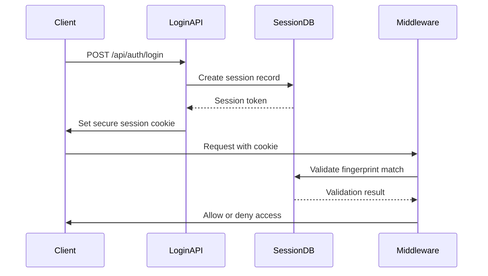
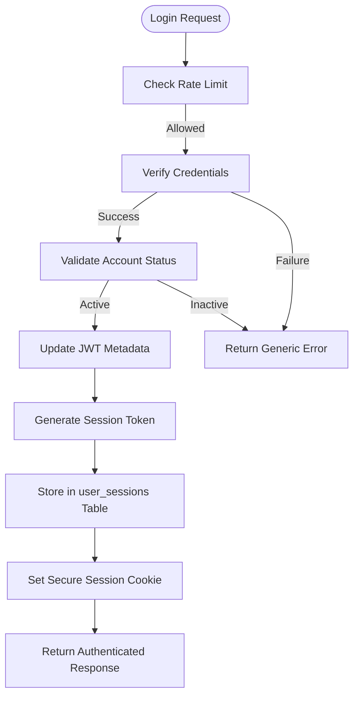
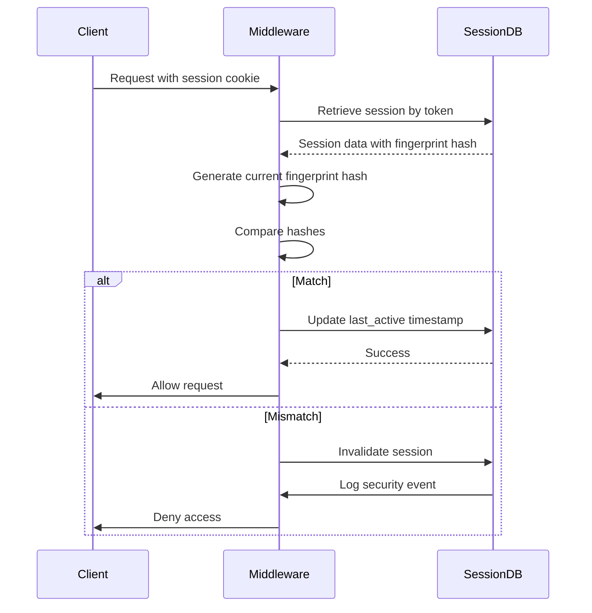
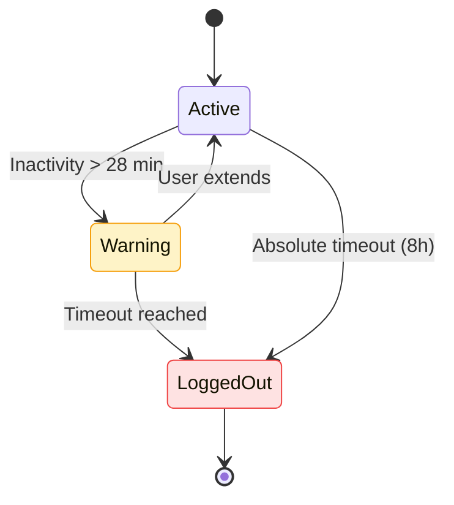
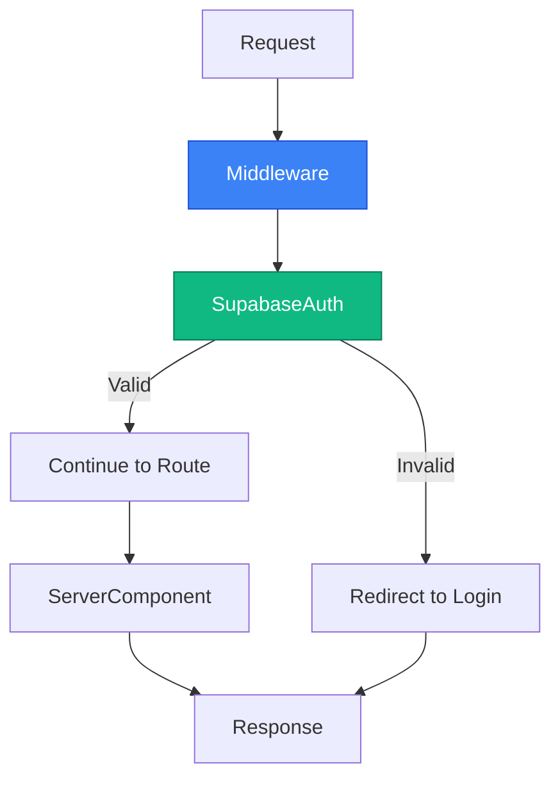
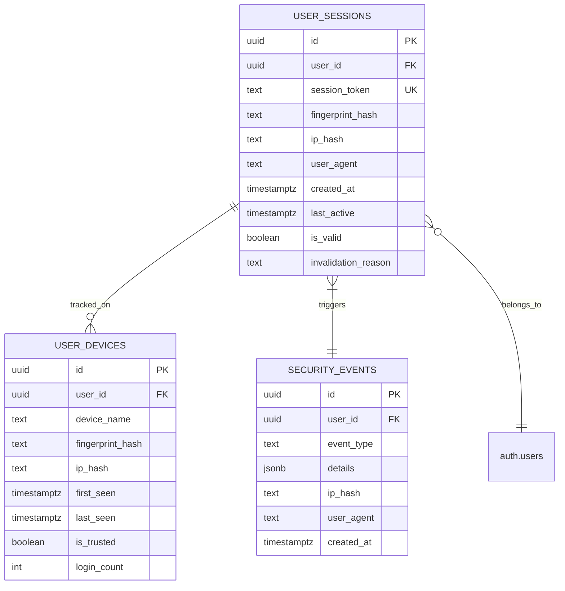

# Session Management

<cite>
**Referenced Files in This Document**   
- [use-session-timeout.ts](file://lib/hooks/use-session-timeout.ts)
- [middleware.ts](file://lib/supabase/middleware.ts)
- [sessions/route.ts](file://app/api/auth/sessions/route.ts)
- [session-security.ts](file://lib/session-security.ts)
- [fingerprint.ts](file://lib/fingerprint.ts)
- [login/route.ts](file://app/api/auth/login/route.ts)
- [logout/route.ts](file://app/api/auth/logout/route.ts)
- [security.ts](file://lib/security.ts)
- [session_security.sql](file://supabase/migrations/20260111_session_security.sql)
- [admin-session-guard.tsx](file://components/admin-session-guard.tsx)
- [active-sessions.tsx](file://components/active-sessions.tsx)
- [session-timeout-modal.tsx](file://components/session-timeout-modal.tsx)
- [client.ts](file://lib/supabase/client.ts)
- [server.ts](file://lib/supabase/server.ts)
</cite>

## Table of Contents
1. [Introduction](#introduction)
2. [Session Lifecycle Management](#session-lifecycle-management)
3. [Authentication Flow and Session Creation](#authentication-flow-and-session-creation)
4. [Session Validation and Security Mechanisms](#session-validation-and-security-mechanisms)
5. [Client-Side Session Timeout Handling](#client-side-session-timeout-handling)
6. [Active Session Management via API](#active-session-management-via-api)
7. [Middleware Enforcement of Authentication](#middleware-enforcement-of-authentication)
8. [Database Schema and Security Infrastructure](#database-schema-and-security-infrastructure)
9. [Integration with Role-Based Access Control](#integration-with-role-based-access-control)
10. [Conclusion](#conclusion)

## Introduction
This document provides a comprehensive overview of the session management system in the School Management System. The architecture leverages Supabase Auth for identity management while implementing custom middleware and security layers to enhance session integrity, prevent hijacking, and enforce strict access control. The system combines server-side session validation with client-side timeout monitoring to ensure both security and usability across administrative, teacher, parent, and student roles.

## Session Lifecycle Management

The session lifecycle in this application follows a secure, multi-layered approach that begins at login and ends at logout or timeout. Each session is bound to a specific device fingerprint and tracked in the database to prevent unauthorized access. Sessions are invalidated on logout, timeout, or when a new login occurs from a different device.

Session creation occurs during successful authentication, where a unique session token is generated and stored in a secure, HttpOnly cookie. This token is validated on every request through middleware. Sessions can be terminated individually or globally via the `/api/auth/sessions` endpoint. The system enforces single-session-per-user policy by invalidating previous sessions upon new login.



**Diagram sources**
- [login/route.ts](file://app/api/auth/login/route.ts#L7-117)
- [session-security.ts](file://lib/session-security.ts#L68-147)
- [middleware.ts](file://lib/supabase/middleware.ts#L4-38)

**Section sources**
- [session-security.ts](file://lib/session-security.ts#L68-147)
- [login/route.ts](file://app/api/auth/login/route.ts#L7-117)
- [logout/route.ts](file://app/api/auth/logout/route.ts#L6-36)

## Authentication Flow and Session Creation

During authentication, the system performs several security checks before creating a session. The login process begins with rate limiting to prevent brute force attacks, followed by credential verification through Supabase Auth. Upon successful authentication, the system checks if the user account is active and retrieves role-based metadata.

The session creation process involves generating a cryptographic token that is bound to the client's browser fingerprint. This fingerprint includes non-PII characteristics such as user agent, screen resolution, timezone, and platform. The fingerprint is hashed server-side and stored with the session record. A corresponding session binding cookie is set with HttpOnly, Secure, and SameSite=Strict attributes to prevent XSS and CSRF attacks.



**Diagram sources**
- [login/route.ts](file://app/api/auth/login/route.ts#L7-117)
- [session-security.ts](file://lib/session-security.ts#L68-147)
- [security.ts](file://lib/security.ts#L69-96)

**Section sources**
- [login/route.ts](file://app/api/auth/login/route.ts#L7-117)
- [session-security.ts](file://lib/session-security.ts#L68-147)
- [fingerprint.ts](file://lib/fingerprint.ts#L22-33)

## Session Validation and Security Mechanisms

Session validation occurs on every request through a combination of Supabase Auth and custom server-side validation. The middleware extracts the session token from cookies and validates it against the stored fingerprint hash. If the current client fingerprint does not match the stored hash, the session is immediately invalidated and a security event is logged.

The system implements several security mechanisms to protect against common threats:
- **Fingerprint binding**: Sessions are bound to device characteristics to prevent cookie theft
- **IP change detection**: Configurable detection of IP address changes during sessions
- **CSRF protection**: Origin validation for API routes using strict domain checking
- **Secure cookie attributes**: HttpOnly, Secure, and SameSite=Strict flags prevent client-side access and cross-site injection

The validation process also updates the last active timestamp for each valid session, enabling accurate tracking of user activity.



**Diagram sources**
- [middleware.ts](file://lib/supabase/middleware.ts#L4-38)
- [session-security.ts](file://lib/session-security.ts#L154-228)
- [security.ts](file://lib/security.ts#L20-67)

**Section sources**
- [session-security.ts](file://lib/session-security.ts#L154-228)
- [middleware.ts](file://lib/supabase/middleware.ts#L4-38)
- [security.ts](file://lib/security.ts#L20-67)

## Client-Side Session Timeout Handling

The client-side session timeout system uses the `use-session-timeout` hook to monitor user activity and enforce both inactivity and absolute timeouts. The hook tracks mouse, keyboard, and scroll events to detect user presence. When inactivity approaches the timeout threshold, a warning modal appears allowing the user to extend their session.

Two timeout types are enforced:
- **Inactivity timeout**: 30 minutes of no user interaction
- **Absolute timeout**: 8 hours from initial login regardless of activity

The hook integrates with both client-side state and server-side session management. When a timeout occurs, it clears local storage, calls the logout API, signs out from Supabase, and redirects to the login page with a timeout reason parameter.



**Diagram sources**
- [use-session-timeout.ts](file://lib/hooks/use-session-timeout.ts#L34-198)
- [admin-session-guard.tsx](file://components/admin-session-guard.tsx#L15-34)
- [session-timeout-modal.tsx](file://components/session-timeout-modal.tsx#L22-74)

**Section sources**
- [use-session-timeout.ts](file://lib/hooks/use-session-timeout.ts#L34-198)
- [admin-session-guard.tsx](file://components/admin-session-guard.tsx#L15-34)

## Active Session Management via API

The `/api/auth/sessions` endpoint provides RESTful operations for managing active sessions. It supports GET requests to retrieve all active sessions and devices for the current user, and DELETE requests to log out from all devices simultaneously.

The GET operation returns a comprehensive view of active sessions including user agent, creation time, last activity, and IP hash. It also includes information about known devices such as login count and last seen timestamp. The DELETE operation invalidates all database sessions for the user, signs them out from Supabase, and clears the session binding cookie.

This endpoint is used by the `ActiveSessions` component to display a user's active login sessions across devices and provide a "Logout All Devices" functionality for enhanced security.

```mermaid
flowchart LR
A[Client] --> B[/api/auth/sessions]
B --> C{Method}
C --> |GET| D[Fetch user_sessions]
C --> |DELETE| E[Invalidate all sessions]
D --> F[Return sessions + devices]
E --> G[Sign out from Supabase]
G --> H[Clear session cookie]
F --> A
H --> A
```

**Diagram sources**
- [sessions/route.ts](file://app/api/auth/sessions/route.ts#L7-72)
- [active-sessions.tsx](file://components/active-sessions.tsx#L36-72)
- [session-security.ts](file://lib/session-security.ts#L303-335)

**Section sources**
- [sessions/route.ts](file://app/api/auth/sessions/route.ts#L7-72)
- [active-sessions.tsx](file://components/active-sessions.tsx#L1-194)

## Middleware Enforcement of Authentication

The authentication middleware is implemented in `middleware.ts` and runs on every request to protected routes. It uses Supabase SSR to parse authentication tokens from cookies and validate user sessions. The middleware extracts the user object from the authentication state and makes it available to downstream components.

For protected routes, the middleware redirects unauthenticated users to the login page. It also enforces role-based access by checking user metadata stored in JWT claims. The middleware pattern ensures that all protected routes have consistent authentication and authorization checks without requiring repetitive code in individual route handlers.

The middleware integrates with Next.js App Router's server components, allowing server-side rendering of authenticated content while maintaining security boundaries.



**Diagram sources**
- [middleware.ts](file://lib/supabase/middleware.ts#L4-38)
- [server.ts](file://lib/supabase/server.ts#L5-30)
- [client.ts](file://lib/supabase/client.ts#L3-9)

**Section sources**
- [middleware.ts](file://lib/supabase/middleware.ts#L4-38)

## Database Schema and Security Infrastructure

The session security infrastructure is built on three core database tables created through migration scripts: `user_sessions`, `user_devices`, and `security_events`. These tables are protected by Row Level Security (RLS) policies that ensure users can only access their own session data.

The `user_sessions` table stores active sessions with fingerprint hashes and IP hashes for validation. The `user_devices` table tracks known devices per user, including login frequency and trust status. The `security_events` table logs suspicious activities such as fingerprint mismatches and IP changes.

Database functions like `invalidate_user_sessions` enable efficient bulk operations for logout scenarios. Indexes on key columns ensure fast lookups during session validation. A cleanup function periodically removes expired sessions to maintain database performance.



**Diagram sources**
- [session_security.sql](file://supabase/migrations/20260111_session_security.sql#L5-115)
- [session-security.ts](file://lib/session-security.ts#L7-373)

**Section sources**
- [session_security.sql](file://supabase/migrations/20260111_session_security.sql#L5-115)

## Integration with Role-Based Access Control

Session management is tightly integrated with role-based access control (RBAC) through user metadata stored in JWT tokens. During login, the system retrieves the user's role from the database and stores it in the JWT claims. This metadata is then available in the middleware for access control decisions.

Different roles (admin, teacher, parent, student) have different session timeout policies and access permissions. The middleware checks these roles when determining whether to allow access to protected routes. For example, admin routes are protected by the `AdminSessionGuard` component which enforces stricter timeout policies.

The session security system also logs role-specific security events and maintains separate session records for each role, enabling fine-grained audit trails and access monitoring across the school management ecosystem.

**Section sources**
- [login/route.ts](file://app/api/auth/login/route.ts#L64-78)
- [middleware.ts](file://lib/supabase/middleware.ts#L34-36)
- [admin-session-guard.tsx](file://components/admin-session-guard.tsx#L15-34)

## Conclusion

The session management system in the School Management System provides a robust, secure foundation for user authentication and access control. By combining Supabase Auth with custom middleware, fingerprint-based session binding, and comprehensive client-side timeout handling, the system achieves a balance between security and usability.

Key security features include device fingerprinting to prevent session hijacking, secure cookie attributes to mitigate XSS and CSRF risks, and real-time session monitoring with immediate invalidation on suspicious activity. The architecture supports both server-side validation through middleware and client-side monitoring through React hooks, creating a defense-in-depth approach to session security.

The system's integration with role-based access control ensures that different user types have appropriate session policies and access permissions, while the active session management interface gives users control over their login sessions across devices.