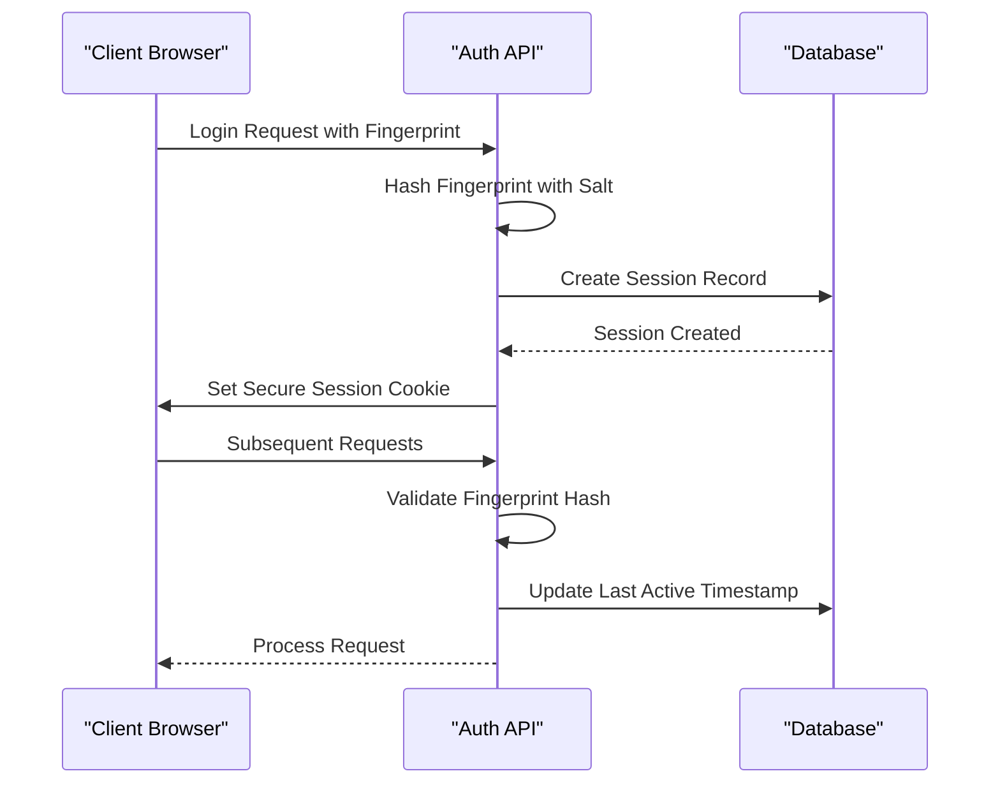
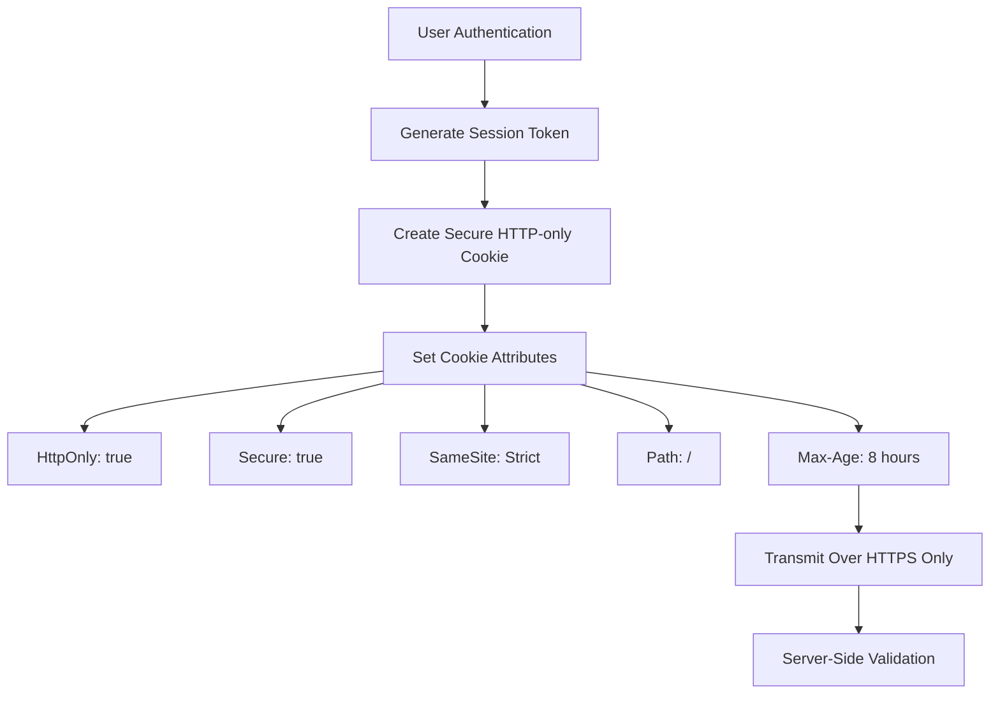
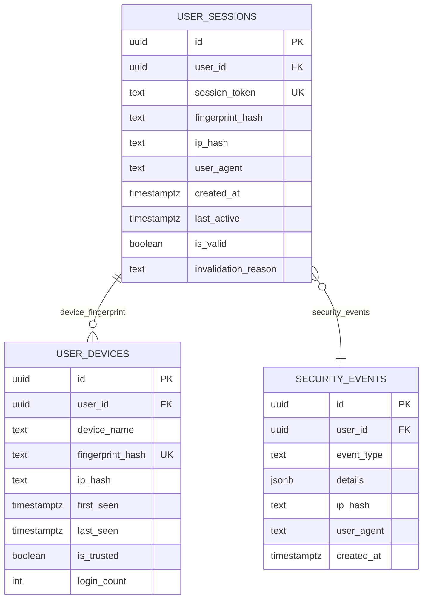
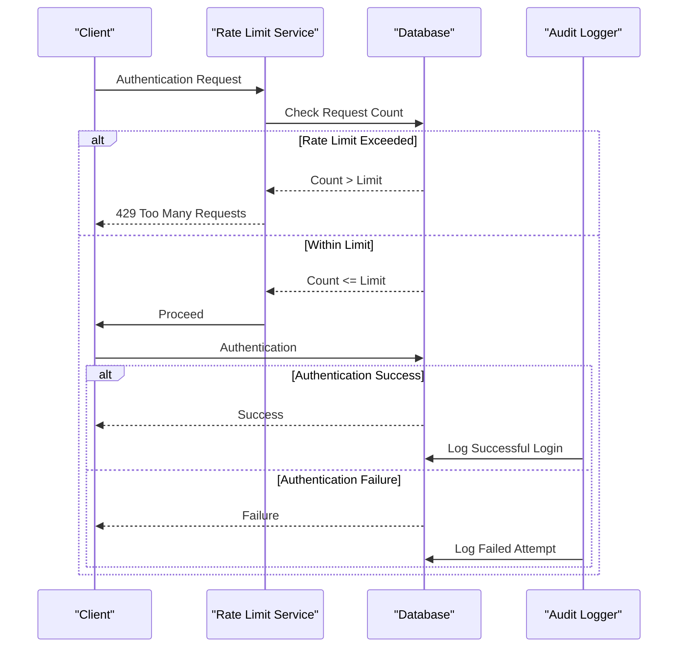
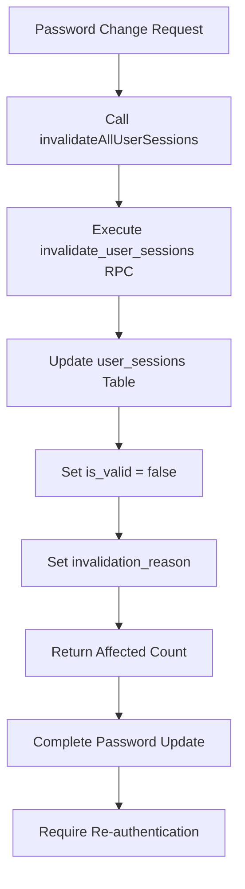
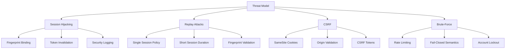
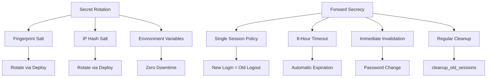

# Session Security Mechanisms

<cite>
**Referenced Files in This Document**   
- [fingerprint.ts](file://lib/fingerprint.ts)
- [session-security.ts](file://lib/session-security.ts)
- [security.ts](file://lib/security.ts)
- [rate-limit.ts](file://lib/rate-limit.ts)
- [20260111053538_session_security.sql](file://supabase/migrations/20260111053538_session_security.sql)
- [20260111_session_security.sql](file://supabase/migrations/20260111_session_security.sql)
- [login/route.ts](file://app/api/auth/login/route.ts)
- [logout/route.ts](file://app/api/auth/logout/route.ts)
- [sessions/route.ts](file://app/api/auth/sessions/route.ts)
- [audit-logs.ts](file://lib/supabase/audit-logs.ts)
</cite>

## Table of Contents
1. [Introduction](#introduction)
2. [Session Binding via Cryptographic Fingerprints](#session-binding-via-cryptographic-fingerprints)
3. [Secure Session Token Management](#secure-session-token-management)
4. [Server-Side Session Tracking](#server-side-session-tracking)
5. [Rate Limiting and Audit Logging](#rate-limiting-and-audit-logging)
6. [Global Session Invalidation](#global-session-invalidation)
7. [Threat Models Addressed](#threat-models-addressed)
8. [Secret Rotation and Forward Secrecy](#secret-rotation-and-forward-secrecy)
9. [Conclusion](#conclusion)

## Introduction
This document details the comprehensive session security mechanisms implemented in the School Management System. The architecture combines client-side device fingerprinting, server-side session validation, cryptographic hashing, and strict database policies to prevent session hijacking, replay attacks, CSRF, and brute-force attempts. The system enforces single-session-per-user policy, provides users with visibility into active sessions, and automatically detects and responds to suspicious activities.

**Section sources**
- [session-security.ts](file://lib/session-security.ts#L1-L373)
- [fingerprint.ts](file://lib/fingerprint.ts#L1-L68)

## Session Binding via Cryptographic Fingerprints

The system implements robust session binding using cryptographic fingerprints derived from non-PII client device characteristics. This mechanism ensures that each session is tightly bound to the specific device and browser used during authentication.

The client-side fingerprinting process collects the following characteristics:
- User agent string
- Browser language
- Timezone information
- Screen resolution
- Color depth
- Platform information
- Cookies enabled status
- Do Not Track setting

These characteristics are combined and hashed using SHA-256 with a server-side salt to create a unique fingerprint hash. The implementation uses a consistent data structure to ensure reliable fingerprint matching across sessions.

**Diagram sources**
- [fingerprint.ts](file://lib/fingerprint.ts#L8-L37)
- [session-security.ts](file://lib/session-security.ts#L45-L56)
- [login/route.ts](file://app/api/auth/login/route.ts#L80-L90)

## Secure Session Token Management

Session tokens are managed with stringent security measures to prevent unauthorized access and ensure confidentiality. The system implements multiple layers of protection for session tokens.

Session tokens are stored in HTTP-only, Secure cookies with Strict SameSite policy, preventing access via JavaScript and ensuring transmission only over HTTPS connections. The cookie configuration includes:
- `HttpOnly`: Prevents client-side script access
- `Secure`: Ensures transmission only over HTTPS
- `SameSite: Strict`: Prevents CSRF attacks
- Appropriate `maxAge` matching the session timeout

The session binding token is also stored in localStorage for client-side validation, with appropriate error handling for environments where localStorage is disabled.

**Diagram sources**
- [session-security.ts](file://lib/session-security.ts#L25-L26)
- [login/route.ts](file://app/api/auth/login/route.ts#L99-L107)
- [logout/route.ts](file://app/api/auth/logout/route.ts#L25)

## Server-Side Session Tracking

The system maintains a comprehensive server-side session tracking table to monitor and validate active sessions. The database schema is designed to provide robust security while preserving user privacy.

The `user_sessions` table contains the following fields:
- `user_id`: UUID reference to the authenticated user
- `session_token`: Unique token for session identification
- `fingerprint_hash`: SHA-256 hash of the device fingerprint
- `ip_hash`: Hashed IP address for privacy
- `user_agent`: Browser user agent string
- `created_at`: Session creation timestamp
- `last_active`: Last activity timestamp
- `is_valid`: Boolean indicating session validity
- `invalidation_reason`: Text describing why session was invalidated

**Diagram sources**
- [20260111053538_session_security.sql](file://supabase/migrations/20260111053538_session_security.sql#L5-L16)
- [20260111_session_security.sql](file://supabase/migrations/20260111_session_security.sql#L5-L19)

## Rate Limiting and Audit Logging

The system implements comprehensive rate limiting and audit logging to detect and prevent suspicious activities. These mechanisms provide defense against brute-force attacks and enable monitoring of security events.

Rate limiting is enforced at the API level using a Redis-backed system that tracks requests by identifier (IP or User ID) and endpoint. The login endpoint implements strict rate limiting with fail-closed semantics to prevent brute-force attacks.

Audit logging captures security-relevant events including:
- New device detection
- Session hijack attempts
- IP address changes
- Password changes
- MFA configuration changes

Security events are stored in the `security_events` table with detailed context for forensic analysis.

**Diagram sources**
- [rate-limit.ts](file://lib/rate-limit.ts#L1-L56)
- [audit-logs.ts](file://lib/supabase/audit-logs.ts#L1-L321)
- [login/route.ts](file://app/api/auth/login/route.ts#L12-L21)

## Global Session Invalidation

The system provides a robust mechanism for invalidating all active sessions for a user, which is critical for security during password changes or suspected compromise. The `invalidateAllUserSessions` function ensures that all existing sessions are terminated when a user's credentials change.

When a user changes their password or requests to log out from all devices, the system:
1. Calls the `invalidate_user_sessions` database function
2. Updates all active sessions to `is_valid = false`
3. Records the invalidation reason
4. Returns the count of invalidated sessions

This mechanism ensures that even if an attacker has obtained a valid session token, that session will be immediately invalidated upon password change.

**Diagram sources**
- [session-security.ts](file://lib/session-security.ts#L253-L272)
- [sessions/route.ts](file://app/api/auth/sessions/route.ts#L54)
- [20260111053538_session_security.sql](file://supabase/migrations/20260111053538_session_security.sql#L72-L87)

## Threat Models Addressed

The session security system is designed to address multiple threat models through layered defenses.

### Session Hijacking Prevention
The system prevents session hijacking by binding each session to a cryptographic fingerprint of the client device. If an attacker obtains a session token and attempts to use it from a different device, the fingerprint mismatch will be detected, the session will be invalidated, and a security event will be logged.

### Replay Attacks
Replay attacks are prevented through the combination of short-lived sessions, fingerprint binding, and the single-session-per-user policy. Even if an attacker captures a valid session token, they cannot replay it from a different context.

### CSRF Protection
CSRF protection is implemented through multiple mechanisms:
- SameSite=Strict cookie policy
- Origin validation in API routes
- Anti-CSRF tokens for state-changing operations

### Brute-Force Attempts
Brute-force protection is enforced through rate limiting on authentication endpoints. The system limits login attempts to 5 per minute per IP address with fail-closed semantics, making brute-force attacks impractical.

**Diagram sources**
- [session-security.ts](file://lib/session-security.ts#L154-L227)
- [security.ts](file://lib/security.ts#L20-L67)
- [rate-limit.ts](file://lib/rate-limit.ts#L25-L56)

## Secret Rotation and Forward Secrecy

The system implements practices that support secret rotation and forward secrecy, ensuring that compromise of current secrets does not affect the security of past sessions.

Cryptographic salts used for fingerprint and IP address hashing are configured through environment variables, allowing for rotation without database schema changes. The system is designed to support salt rotation by maintaining compatibility during transition periods.

Forward secrecy is achieved through:
- Single-session-per-user policy (new login invalidates previous sessions)
- Short session durations (8 hours maximum)
- Regular cleanup of old session records
- Automatic invalidation on credential changes

The system also implements a periodic cleanup function that removes session records older than 30 days or invalid sessions older than 7 days, reducing the attack surface and protecting user privacy.

**Diagram sources**
- [session-security.ts](file://lib/session-security.ts#L46)
- [security.ts](file://lib/security.ts#L12-L13)
- [20260111053538_session_security.sql](file://supabase/migrations/20260111053538_session_security.sql#L89-L105)

## Conclusion
The session security mechanisms in the School Management System provide a comprehensive defense against common web application threats. By combining client-side fingerprinting, server-side validation, cryptographic hashing, and strict database policies, the system effectively prevents session hijacking, replay attacks, CSRF, and brute-force attempts. The implementation balances security with usability, providing users with visibility into their active sessions while automatically protecting against suspicious activities. Regular secret rotation and forward secrecy practices ensure that the system remains secure even in the event of partial compromise.