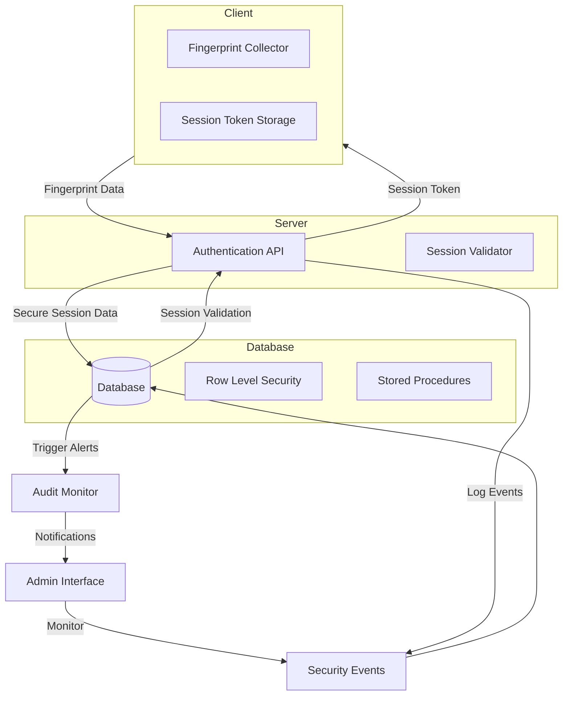
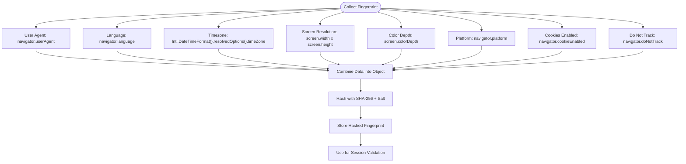
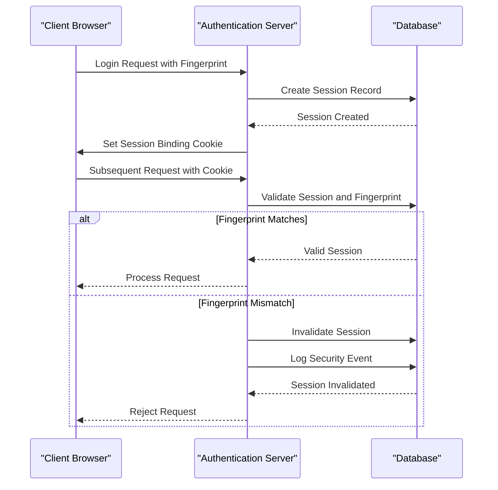
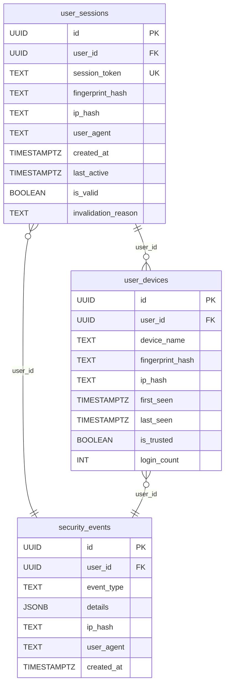
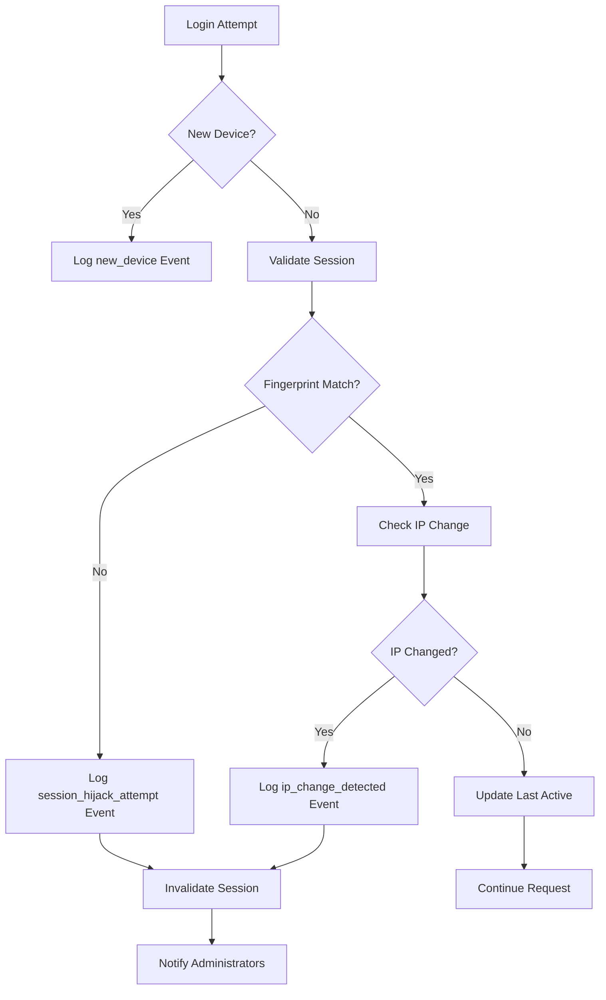
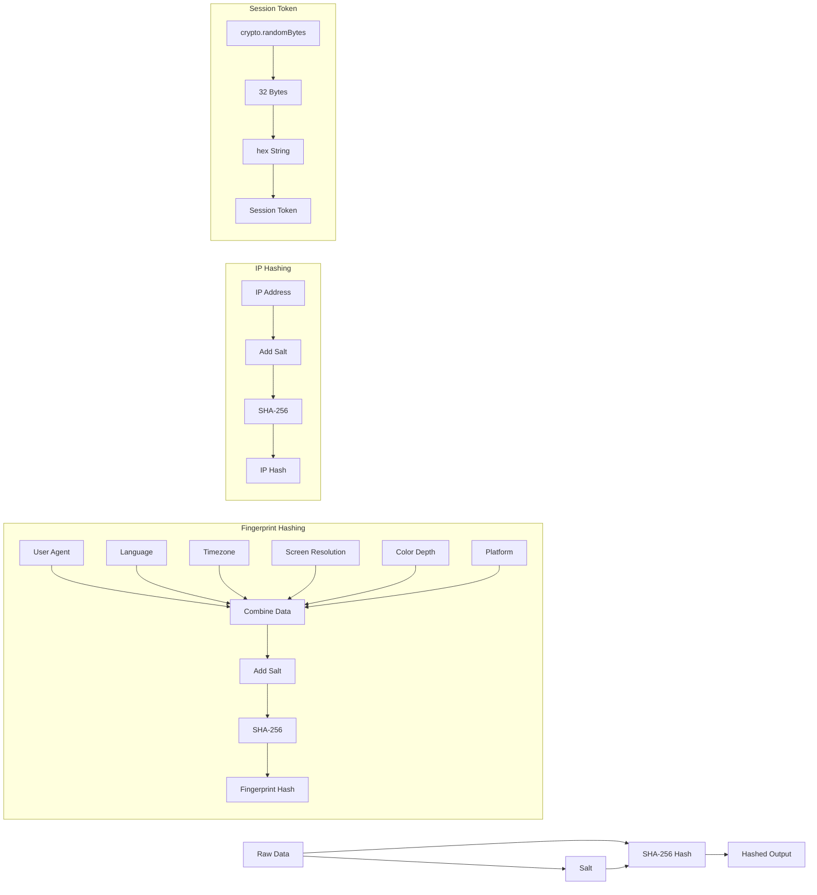
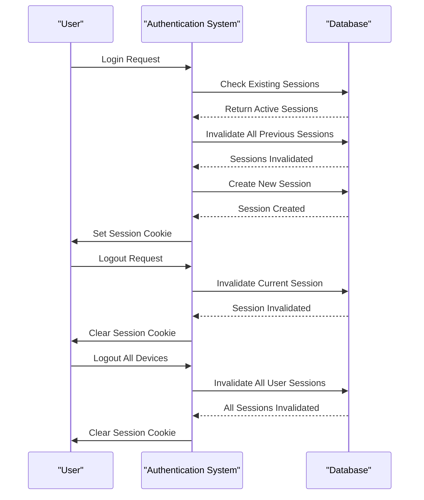

# Session Security Mechanisms

<cite>
**Referenced Files in This Document**   
- [session-security.ts](file://lib/session-security.ts)
- [fingerprint.ts](file://lib/fingerprint.ts)
- [security.ts](file://lib/security.ts)
- [20260111053538_session_security.sql](file://supabase/migrations/20260111053538_session_security.sql)
- [20260111_session_security.sql](file://supabase/migrations/20260111_session_security.sql)
- [login/route.ts](file://app/api/auth/login/route.ts)
- [logout/route.ts](file://app/api/auth/logout/route.ts)
- [sessions/route.ts](file://app/api/auth/sessions/route.ts)
- [use-session-timeout.ts](file://lib/hooks/use-session-timeout.ts)
- [active-sessions.tsx](file://components/active-sessions.tsx)
</cite>

## Table of Contents
1. [Introduction](#introduction)
2. [Session Security Architecture](#session-security-architecture)
3. [Device Fingerprinting Implementation](#device-fingerprinting-implementation)
4. [Session Binding and Validation](#session-binding-and-validation)
5. [Database Schema and Migrations](#database-schema-and-migrations)
6. [Anomaly Detection and Security Event Logging](#anomaly-detection-and-security-event-logging)
7. [Cryptographic Practices](#cryptographic-practices)
8. [Session Management and Invalidations](#session-management-and-invalidations)
9. [Performance and Scalability Considerations](#performance-and-scalability-considerations)

## Introduction

This document provides comprehensive documentation of the session security mechanisms implemented in the School Management System. The system employs a multi-layered approach to protect user sessions from hijacking, fixation, and other attacks. Key components include device fingerprinting, session binding, anomaly detection, and secure session management practices. The implementation leverages both client-side and server-side technologies to create a robust security framework that protects user accounts while maintaining usability.

The session security system is designed to detect and prevent unauthorized access through suspicious login attempts, validate session integrity across requests, and provide administrators with tools to monitor and respond to potential security threats. The architecture combines cryptographic techniques, database design, and application logic to create a comprehensive defense against session-based attacks.

## Session Security Architecture

The session security architecture consists of multiple interconnected components that work together to protect user sessions. The system implements device fingerprinting to uniquely identify client devices, session binding to associate sessions with specific devices, and anomaly detection to identify suspicious activities. The architecture is built on a foundation of secure database design with Row Level Security (RLS) policies and stored procedures that enforce security rules at the database level.

The system follows a defense-in-depth approach, with security controls implemented at multiple layers including the client, server, and database. Client-side components collect device fingerprints and manage session tokens, while server-side components validate sessions and enforce security policies. The database stores session information with cryptographic hashing of sensitive data and provides stored procedures for secure session management operations.

**Diagram sources**
- [session-security.ts](file://lib/session-security.ts)
- [fingerprint.ts](file://lib/fingerprint.ts)
- [20260111053538_session_security.sql](file://supabase/migrations/20260111053538_session_security.sql)

**Section sources**
- [session-security.ts](file://lib/session-security.ts#L1-L373)
- [fingerprint.ts](file://lib/fingerprint.ts#L1-L68)
- [20260111053538_session_security.sql](file://supabase/migrations/20260111053538_session_security.sql#L1-L106)

## Device Fingerprinting Implementation

The device fingerprinting system collects non-personally identifiable information (non-PII) from the client browser to create a unique identifier for each device. The fingerprint includes characteristics such as user agent, language, timezone, screen resolution, color depth, platform, and cookie support. This information is collected client-side and transmitted to the server during authentication.

The fingerprint data is hashed using SHA-256 with a salt to prevent reverse engineering while still allowing comparison of fingerprints. The system uses a configurable strictness level that determines how much the fingerprint can change before triggering security measures. This allows for minor variations in device characteristics while still detecting significant changes that may indicate session hijacking.

**Diagram sources**
- [fingerprint.ts](file://lib/fingerprint.ts#L22-L33)
- [session-security.ts](file://lib/session-security.ts#L45-L56)

**Section sources**
- [fingerprint.ts](file://lib/fingerprint.ts#L8-L33)
- [session-security.ts](file://lib/session-security.ts#L45-L56)

## Session Binding and Validation

The session binding mechanism creates a secure association between a user session and the device fingerprint. When a user logs in, the system creates a session record that includes the hashed fingerprint and IP address. A session binding token is generated and stored in an HttpOnly, Secure, SameSite cookie to prevent client-side access and cross-site scripting attacks.

During each subsequent request, the system validates the session by comparing the current device fingerprint with the stored fingerprint hash. If the fingerprints do not match, the system treats this as a potential hijacking attempt and invalidates the session. The validation process also checks for IP address changes when configured to do so, providing an additional layer of security.

**Diagram sources**
- [session-security.ts](file://lib/session-security.ts#L68-L143)
- [login/route.ts](file://app/api/auth/login/route.ts#L80-L108)

**Section sources**
- [session-security.ts](file://lib/session-security.ts#L68-L227)
- [login/route.ts](file://app/api/auth/login/route.ts#L80-L108)

## Database Schema and Migrations

The session security system introduces three new database tables through migration scripts: user_sessions, user_devices, and security_events. These tables are designed with security and performance in mind, including appropriate indexes, constraints, and Row Level Security (RLS) policies.

The user_sessions table stores active session information with a unique session token, hashed fingerprint, and IP address. The user_devices table tracks trusted devices for each user, allowing the system to identify known devices and detect new ones. The security_events table logs security-related events such as new device logins and potential hijacking attempts.

**Diagram sources**
- [20260111053538_session_security.sql](file://supabase/migrations/20260111053538_session_security.sql#L5-L30)
- [20260111_session_security.sql](file://supabase/migrations/20260111_session_security.sql#L5-L35)

**Section sources**
- [20260111053538_session_security.sql](file://supabase/migrations/20260111053538_session_security.sql#L5-L106)
- [20260111_session_security.sql](file://supabase/migrations/20260111_session_security.sql#L5-L115)

## Anomaly Detection and Security Event Logging

The system implements comprehensive anomaly detection and security event logging to identify and respond to suspicious activities. When a new device is detected during login, the system logs a "new_device" event with details about the device. If a fingerprint mismatch is detected during session validation, indicating a potential hijacking attempt, the system logs a "session_hijack_attempt" event and invalidates the session.

The security_events table stores detailed information about security-related events, including the event type, details in JSON format, hashed IP address, and user agent string. This information is used for monitoring, auditing, and incident response. Administrators can view security events through the audit logs interface and receive notifications for critical events.

**Diagram sources**
- [session-security.ts](file://lib/session-security.ts#L133-L214)
- [session-security.ts](file://lib/session-security.ts#L278-L297)

**Section sources**
- [session-security.ts](file://lib/session-security.ts#L133-L214)
- [session-security.ts](file://lib/session-security.ts#L278-L297)
- [audit-monitor.ts](file://lib/audit-monitor.ts#L14-L47)

## Cryptographic Practices

The system employs several cryptographic practices to protect sensitive data and ensure session security. Device fingerprints are hashed using SHA-256 with a salt to prevent reverse engineering while still allowing comparison. IP addresses are also hashed with SHA-256 and salted to protect user privacy while enabling abuse detection through hash comparison.

Session tokens are generated using cryptographically secure random bytes (32 bytes, 256 bits) to ensure unpredictability and prevent guessing attacks. The system uses environment variables for salts and secrets, with fallback values to ensure functionality in different deployment environments. All session-related cookies are configured with HttpOnly, Secure, and SameSite=strict attributes to prevent client-side access and cross-site request forgery attacks.

**Diagram sources**
- [session-security.ts](file://lib/session-security.ts#L45-L56)
- [security.ts](file://lib/security.ts#L11-L14)
- [session-security.ts](file://lib/session-security.ts#L61-L63)

**Section sources**
- [session-security.ts](file://lib/session-security.ts#L45-L56)
- [security.ts](file://lib/security.ts#L11-L14)
- [session-security.ts](file://lib/session-security.ts#L61-L63)

## Session Management and Invalidations

The session management system implements several mechanisms to protect against session fixation and hijacking attacks. When a user logs in, all previous sessions for that user are automatically invalidated to enforce single-session-per-user policy. This prevents attackers from using previously obtained session tokens.

The system provides multiple ways to invalidate sessions, including individual session invalidation, invalidation of all sessions for a user, and automatic cleanup of old sessions. The invalidate_user_sessions stored procedure efficiently updates multiple session records in a single database transaction. Sessions are automatically cleaned up after 30 days of creation or 7 days after invalidation to prevent database bloat.

**Diagram sources**
- [session-security.ts](file://lib/session-security.ts#L89-L92)
- [logout/route.ts](file://app/api/auth/logout/route.ts#L16-L18)
- [sessions/route.ts](file://app/api/auth/sessions/route.ts#L54-L57)

**Section sources**
- [session-security.ts](file://lib/session-security.ts#L89-L92)
- [logout/route.ts](file://app/api/auth/logout/route.ts#L16-L18)
- [sessions/route.ts](file://app/api/auth/sessions/route.ts#L54-L57)
- [session-security.ts](file://lib/session-security.ts#L253-L272)

## Performance and Scalability Considerations

The session security system is designed with performance and scalability in mind. Database indexes are created on frequently queried columns such as user_id, session_token, and event_type to ensure fast lookups. The system uses efficient database queries and batch operations to minimize latency.

The stored procedures for session invalidation and cleanup are optimized to perform bulk operations in a single transaction, reducing database round trips. The system implements client-side session timeout handling to reduce server load, with inactivity tracking performed in the browser and absolute timeout validation using JWT metadata.

To ensure scalability, the system limits the amount of data stored for each session while still maintaining sufficient information for security purposes. The automatic cleanup of old sessions prevents unbounded growth of the user_sessions table. The security event logging system is designed to handle high volumes of events without impacting authentication performance.

**Section sources**
- [20260111053538_session_security.sql](file://supabase/migrations/20260111053538_session_security.sql#L44-L51)
- [session-security.ts](file://lib/session-security.ts#L89-L92)
- [use-session-timeout.ts](file://lib/hooks/use-session-timeout.ts#L117-L145)
- [20260111053538_session_security.sql](file://supabase/migrations/20260111053538_session_security.sql#L98-L103)