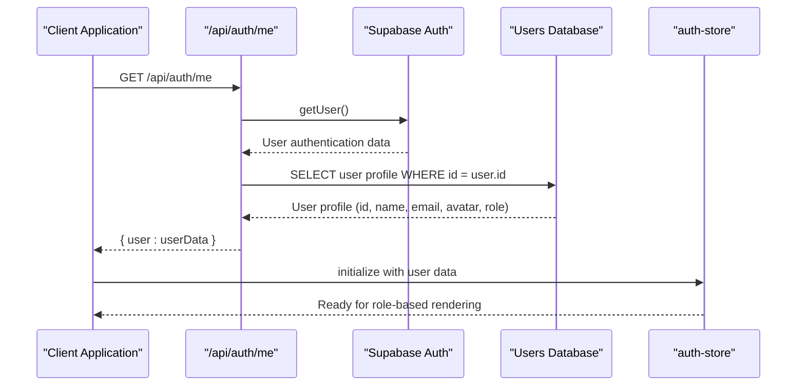
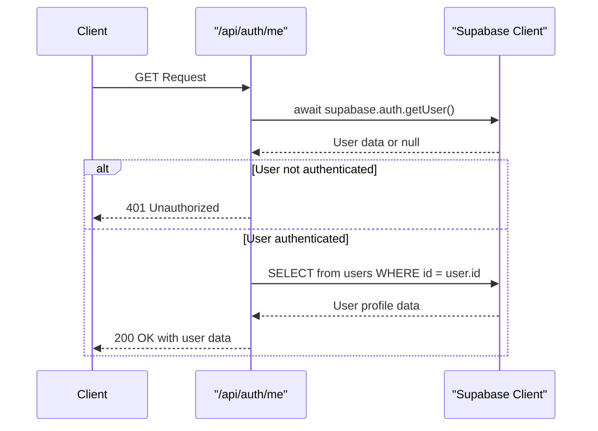
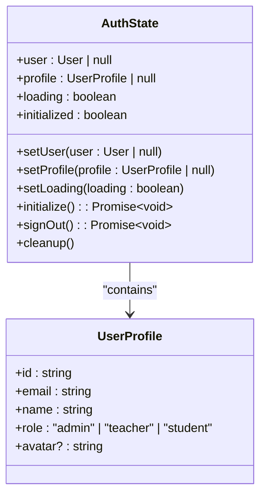
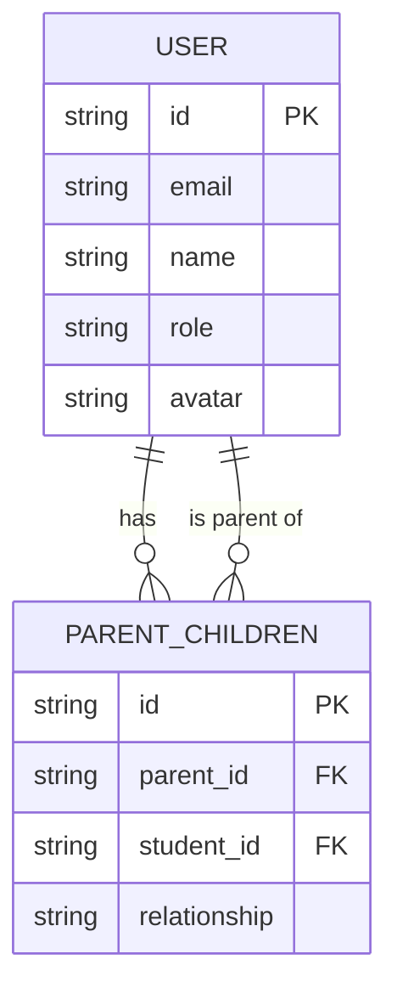
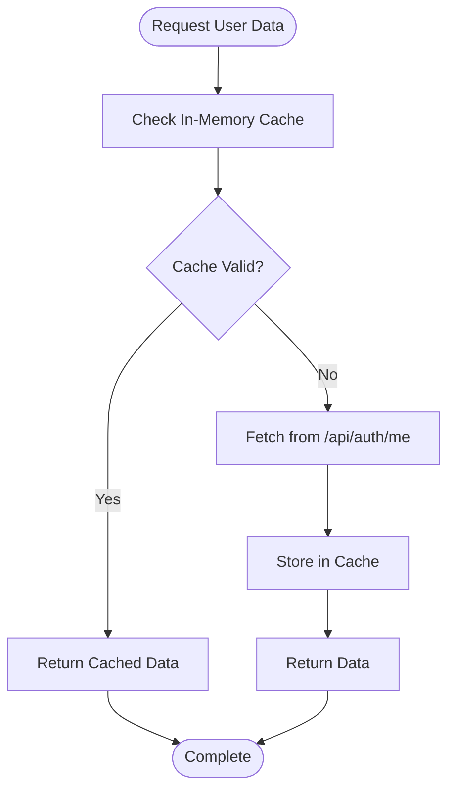
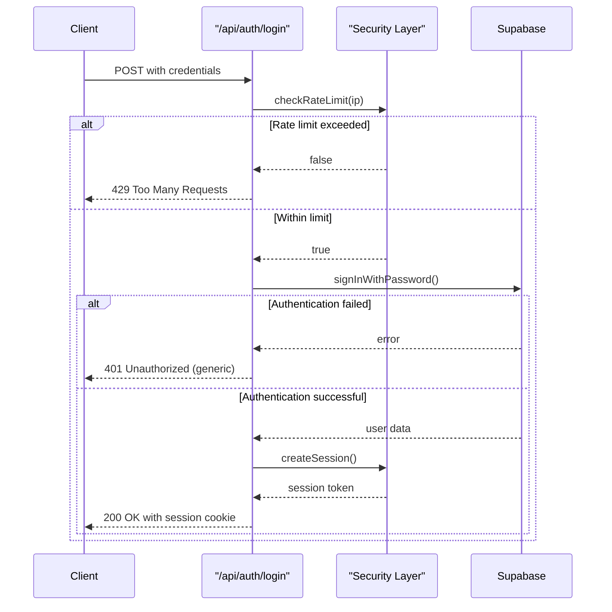

# User Context & Identity

<cite>
**Referenced Files in This Document**   
- [route.ts](file://app/api/auth/me/route.ts)
- [auth-store.ts](file://lib/auth-store.ts)
- [server.ts](file://lib/supabase/server.ts)
- [types.ts](file://lib/types.ts)
- [login/route.ts](file://app/api/auth/login/route.ts)
- [logout/route.ts](file://app/api/auth/logout/route.ts)
- [session-security.ts](file://lib/session-security.ts)
- [cache.ts](file://lib/cache.ts)
- [secure-fetch.ts](file://lib/secure-fetch.ts)
- [use-optimized-query.ts](file://lib/hooks/use-optimized-query.ts)
- [admin-session-guard.tsx](file://components/admin-session-guard.tsx)
- [20251219081806_fix_user_read_policy.sql](file://supabase/migrations/20251219081806_fix_user_read_policy.sql)
- [20260105082250_create_parent_tables.sql](file://supabase/migrations/20260105082250_create_parent_tables.sql)
</cite>

## Table of Contents
1. [Introduction](#introduction)
2. [Core Components](#core-components)
3. [Architecture Overview](#architecture-overview)
4. [Detailed Component Analysis](#detailed-component-analysis)
5. [Role-Based Access and UI Rendering](#role-based-access-and-ui-rendering)
6. [Caching and Performance Optimization](#caching-and-performance-optimization)
7. [Error Handling and Session Security](#error-handling-and-session-security)
8. [Conclusion](#conclusion)

## Introduction
This document provides a comprehensive analysis of user context retrieval and identity management in the School Management System. It focuses on the `/api/auth/me` endpoint's role in securely fetching authenticated user data, including role, profile, and permissions. The document explains how this information initializes the `auth-store` state and drives role-specific UI rendering across dashboards. It covers the data structure returned by the endpoint, caching strategies, error handling for invalid sessions, and how different roles (admin, teacher, student, parent) are distinguished and influence application behavior.

## Core Components

The user context and identity management system consists of several key components that work together to provide secure authentication and personalized user experiences. The `/api/auth/me` endpoint serves as the primary mechanism for retrieving authenticated user data from the server. This endpoint integrates with Supabase authentication and database systems to verify user identity and fetch profile information securely. The `auth-store` component manages the client-side state of the authenticated user, storing both the authentication token and user profile data. Session security mechanisms, including fingerprint binding and token validation, ensure that user sessions cannot be hijacked. Role-based access control policies in the database determine what data each user role can access, while client-side components use the user's role to render appropriate UI elements.

**Section sources**
- [route.ts](file://app/api/auth/me/route.ts#L1-L28)
- [auth-store.ts](file://lib/auth-store.ts#L1-L110)
- [session-security.ts](file://lib/session-security.ts#L1-L373)

## Architecture Overview

The user context and identity management architecture follows a layered approach with clear separation between client and server components. The flow begins with the client making a request to the `/api/auth/me` endpoint, which validates the user's authentication token through Supabase. Upon successful validation, the server queries the users table to retrieve the authenticated user's profile data, including their role and permissions. This data is then used to initialize the client-side `auth-store`, which becomes the single source of truth for user identity throughout the application session. The architecture incorporates multiple security layers, including RLS (Row Level Security) policies in the database, session binding with device fingerprinting, and role-based access controls that determine UI rendering and data access.

**Diagram sources**
- [route.ts](file://app/api/auth/me/route.ts#L1-L28)
- [auth-store.ts](file://lib/auth-store.ts#L1-L110)
- [server.ts](file://lib/supabase/server.ts#L1-L51)

## Detailed Component Analysis

### /api/auth/me Endpoint Analysis
The `/api/auth/me` endpoint is responsible for securely retrieving the authenticated user's profile data. It first validates the user's authentication token using Supabase's `getUser()` method. If no user is found, it returns a 401 Unauthorized response. For authenticated users, it queries the users table to retrieve specific fields (id, name, email, avatar, role) for the authenticated user only. This selective field retrieval enhances security by limiting exposure of sensitive user data. The endpoint implements proper error handling, returning a 500 Internal Server Error response for unexpected issues while logging errors for debugging purposes.

#### For API/Service Components:

**Diagram sources**
- [route.ts](file://app/api/auth/me/route.ts#L1-L28)

**Section sources**
- [route.ts](file://app/api/auth/me/route.ts#L1-L28)

### Auth Store Analysis
The `auth-store` is a Zustand-based state management solution that maintains user authentication state across the application. It stores the authenticated user object, profile data, loading state, and initialization status. The store includes methods to set user and profile data, control loading states, initialize the authentication state, sign out, and clean up resources. During initialization, it checks for an existing user session and retrieves the user's profile from the database. It also sets up an authentication state change listener that automatically updates the store when the user's authentication state changes (e.g., during login or logout). The store implements optimization features like subscription cleanup to prevent memory leaks.

#### For Object-Oriented Components:

**Diagram sources**
- [auth-store.ts](file://lib/auth-store.ts#L1-L110)

**Section sources**
- [auth-store.ts](file://lib/auth-store.ts#L1-L110)

## Role-Based Access and UI Rendering

The system implements a comprehensive role-based access control system with four primary roles: admin, teacher, student, and parent. These roles are defined in the database schema and enforced through RLS (Row Level Security) policies. The `/api/auth/me` endpoint returns the user's role as part of the profile data, which is then used to drive UI rendering and determine data access permissions.

The RLS policy in `20251219081806_fix_user_read_policy.sql` establishes that users can read their own data, while admins can read all user data. This policy enables role-based data access at the database level, ensuring that users can only access data they are authorized to view. For parents, the system implements additional relationships through the `parent_children` table, which establishes connections between parent accounts and their children's student accounts. This allows parents to view their children's grades and attendance while maintaining data privacy for other students.

Client-side components use the user's role to render appropriate UI elements and navigation options. For example, admin users see administrative controls and analytics, teachers see class management tools, students see their assignments and grades, and parents see their children's academic progress. The `admin-session-guard.tsx` component demonstrates how specific UI elements can be protected based on user role, wrapping admin-only functionality with role verification.

**Diagram sources**
- [types.ts](file://lib/types.ts#L1-L28)
- [20260105082250_create_parent_tables.sql](file://supabase/migrations/20260105082250_create_parent_tables.sql#L1-L32)
- [20251219081806_fix_user_read_policy.sql](file://supabase/migrations/20251219081806_fix_user_read_policy.sql#L1-L16)

**Section sources**
- [types.ts](file://lib/types.ts#L1-L28)
- [20260105082250_create_parent_tables.sql](file://supabase/migrations/20260105082250_create_parent_tables.sql#L1-L32)
- [20251219081806_fix_user_read_policy.sql](file://supabase/migrations/20251219081806_fix_user_read_policy.sql#L1-L16)

## Caching and Performance Optimization

The system implements multiple caching strategies to optimize performance and reduce redundant API calls. The `use-optimized-query.ts` hook provides client-side caching with configurable TTL (time-to-live) values, preventing duplicate API calls within the cache window. This hook also includes retry logic for transient network failures, enhancing reliability.

The `cache.ts` file implements both in-memory caching for client-side queries and integration with Next.js's `unstable_cache` for server-side caching. The in-memory cache stores query results with timestamps and automatically evicts old entries when the cache size exceeds 100 items. Server-side caching is used for dashboard data, student lists, and class lists, with appropriate revalidation intervals (60 seconds for dashboards, 120 seconds for students, 180 seconds for classes).

The `/api/auth/me` endpoint benefits from these caching mechanisms, as the user profile data retrieved during authentication can be cached and reused across different parts of the application. The `useOptimizedQuery` hook can be used to fetch user data with automatic caching, reducing the load on the authentication endpoint and improving response times for user context retrieval.

**Diagram sources**
- [cache.ts](file://lib/cache.ts#L1-L128)
- [use-optimized-query.ts](file://lib/hooks/use-optimized-query.ts#L1-L275)

**Section sources**
- [cache.ts](file://lib/cache.ts#L1-L128)
- [use-optimized-query.ts](file://lib/hooks/use-optimized-query.ts#L1-L275)

## Error Handling and Session Security

The system implements comprehensive error handling and session security measures to protect user data and maintain application integrity. The `/api/auth/me` endpoint includes proper error handling with specific responses for unauthorized access (401) and server errors (500), while logging detailed error information for debugging without exposing sensitive data to clients.

Session security is enhanced through multiple mechanisms. The `session-security.ts` file implements device fingerprinting, where client-side characteristics (user agent, screen resolution, timezone, etc.) are hashed and stored with the session. This prevents session hijacking, as any attempt to use the session from a different device will be detected and blocked. The system also implements single-session enforcement, automatically invalidating previous sessions when a user logs in from a new device.

The login process includes rate limiting to prevent brute force attacks, allowing only 5 attempts per minute from the same IP address. Password credentials are never exposed in error messages, preventing user enumeration attacks. The logout process invalidates the session both on the client and server sides, ensuring complete session termination.

**Diagram sources**
- [login/route.ts](file://app/api/auth/login/route.ts#L1-L117)
- [session-security.ts](file://lib/session-security.ts#L1-L373)
- [logout/route.ts](file://app/api/auth/logout/route.ts#L1-L36)

**Section sources**
- [login/route.ts](file://app/api/auth/login/route.ts#L1-L117)
- [session-security.ts](file://lib/session-security.ts#L1-L373)
- [logout/route.ts](file://app/api/auth/logout/route.ts#L1-L36)

## Conclusion
The user context and identity management system in the School Management System provides a secure and efficient mechanism for authenticating users and managing their identities throughout the application. The `/api/auth/me` endpoint serves as the cornerstone of this system, reliably retrieving authenticated user data that initializes the client-side `auth-store`. This user context drives role-based UI rendering, ensuring that each user sees only the functionality and data appropriate to their role (admin, teacher, student, or parent).

The architecture incorporates multiple security layers, including RLS policies, device fingerprinting, rate limiting, and proper error handling, to protect user data and prevent unauthorized access. Caching strategies optimize performance by reducing redundant API calls and improving response times. The system's modular design allows for easy extension and maintenance, with clear separation between authentication, authorization, and UI rendering concerns.

Overall, this implementation provides a robust foundation for user identity management that balances security, performance, and usability, enabling a personalized experience for all users while maintaining strict data access controls.