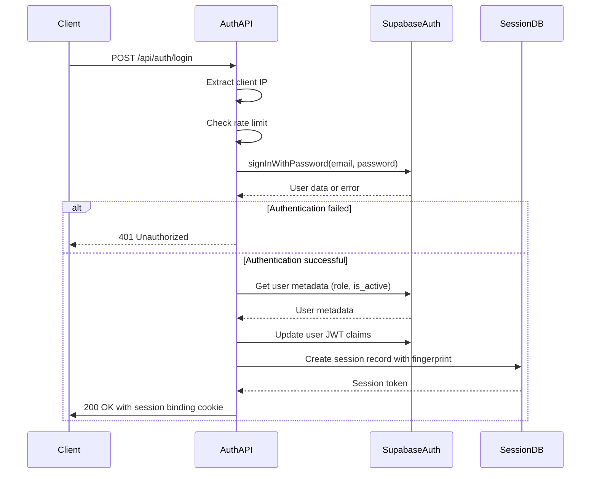
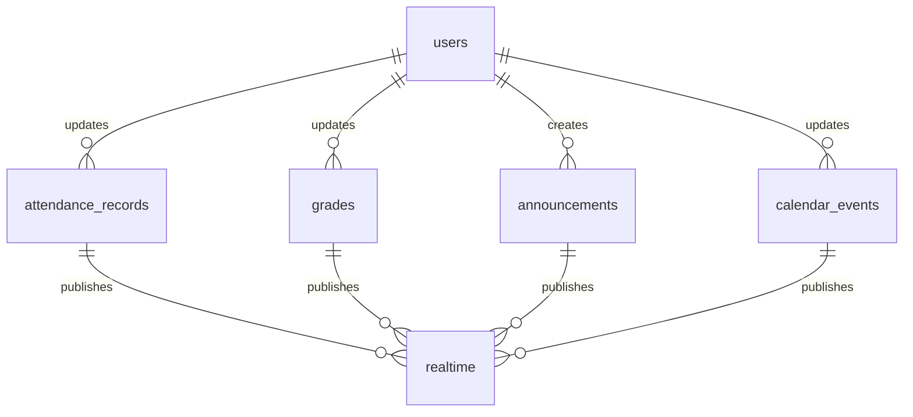
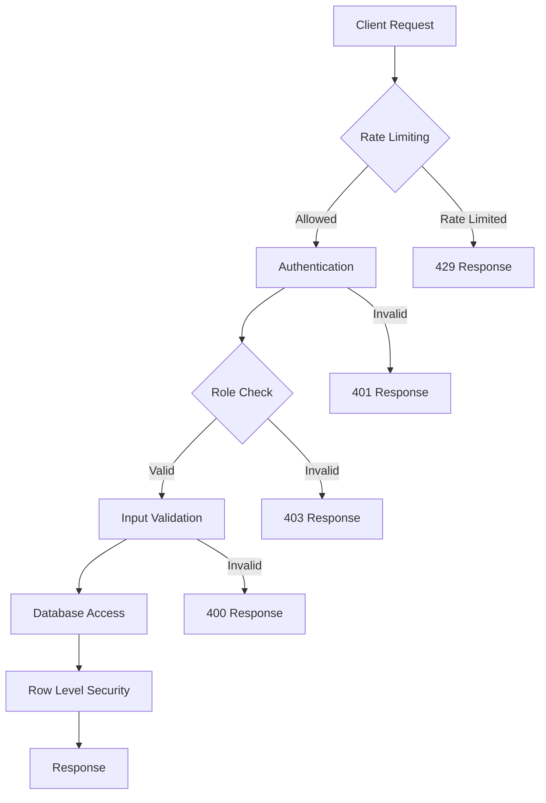

# Backend Architecture

<cite>
**Referenced Files in This Document**   
- [dashboard/route.ts](file://app/api/admin/dashboard/route.ts)
- [login/route.ts](file://app/api/auth/login/route.ts)
- [client.ts](file://lib/supabase/client.ts)
- [server.ts](file://lib/supabase/server.ts)
- [queries.ts](file://lib/supabase/queries.ts)
- [zoom/client.ts](file://lib/zoom/client.ts)
- [session-security.ts](file://lib/session-security.ts)
- [rate-limit.ts](file://lib/rate-limit.ts)
- [logger.ts](file://lib/logger.ts)
- [middleware.ts](file://lib/supabase/middleware.ts)
- [create_users_table.sql](file://supabase/migrations/20251219043432_create_users_table.sql)
- [add_rls_policies.sql](file://supabase/migrations/20251219044036_add_rls_policies.sql)
- [secure_realtime_rls.sql](file://supabase/migrations/20250226_secure_realtime_rls.sql)
</cite>

## Table of Contents
1. [Introduction](#introduction)
2. [API Endpoint Structure](#api-endpoint-structure)
3. [Database Architecture](#database-architecture)
4. [Service Layer Pattern](#service-layer-pattern)
5. [Authentication Flow](#authentication-flow)
6. [Real-time Data Synchronization](#real-time-data-synchronization)
7. [Background Processing Patterns](#background-processing-patterns)
8. [Error Handling](#error-handling)
9. [Security Considerations](#security-considerations)
10. [Component Diagrams](#component-diagrams)

## Introduction
The School-Management-System backend architecture is built on a modern stack with Next.js for server-side rendering and API routes, Supabase for database and authentication services, and Zoom API integration for virtual meetings. The system follows a role-based access control model with distinct interfaces and permissions for administrators, teachers, students, and parents. This document provides a comprehensive overview of the backend architecture, focusing on API design, database structure, service patterns, authentication mechanisms, and security implementations.

## API Endpoint Structure
The API endpoint structure in app/api/ follows a RESTful design pattern organized by user roles and feature domains. Each role has its dedicated namespace with endpoints specific to their responsibilities and access levels.

The architecture implements a hierarchical organization:
- Role-based routing (admin, teacher, student, parent)
- Feature domain grouping within each role
- Consistent naming conventions and HTTP method usage
- Centralized error handling and response formatting

The API routes are implemented as Next.js route handlers, providing server-side functionality for the application. Each endpoint performs authentication and authorization checks before processing requests, ensuring that users can only access data and functionality appropriate to their role.

**Section sources**
- [dashboard/route.ts](file://app/api/admin/dashboard/route.ts#L1-L125)
- [login/route.ts](file://app/api/auth/login/route.ts#L1-L117)

## Database Architecture
The database architecture is built on Supabase PostgreSQL with comprehensive Row Level Security (RLS) policies to ensure data isolation and security. The schema is designed to support the school management domain with entities for users, classes, attendance, grades, and other educational data.

Key database components include:
- users table with role-based access control
- student_profiles and teacher_profiles for role-specific information
- classes, attendance_records, and grades tables for academic data
- RLS policies that enforce data access rules at the database level

The migration files contain detailed SQL scripts that define the database schema and security policies. These migrations ensure consistent database structure across environments and provide version control for database changes.

```mermaid
erDiagram
users {
uuid id PK
text email UK
text name
text role
text avatar
boolean is_active
boolean must_change_password
timestamptz created_at
timestamptz updated_at
}
student_profiles {
uuid id PK FK
text grade
text section
date enrollment_date
text parent_name
text parent_phone
}
teacher_profiles {
uuid id PK FK
text subject
text department
date join_date
}
classes {
uuid id PK
text name
text subject
text grade
text section
uuid teacher_id FK
text room
text schedule
}
attendance_records {
uuid id PK
date date
text status
uuid student_id FK
uuid class_id FK
}
grades {
uuid id PK
numeric score
numeric max_score
text grade
text type
date date
uuid student_id FK
uuid class_id FK
}
users ||--o{ student_profiles : "1-to-1"
users ||--o{ teacher_profiles : "1-to-1"
users ||--o{ classes : "teaches"
users ||--o{ attendance_records : "records"
users ||--o{ grades : "receives"
classes ||--o{ attendance_records : "has"
classes ||--o{ grades : "has"
```

**Diagram sources**
- [create_users_table.sql](file://supabase/migrations/20251219043432_create_users_table.sql#L1-L32)
- [add_rls_policies.sql](file://supabase/migrations/20251219044036_add_rls_policies.sql#L1-L22)

## Service Layer Pattern
The service layer pattern in lib/ provides an abstraction between the API routes and the database/external services. This layer contains dedicated modules for Supabase queries and Zoom API integration, promoting code reuse and separation of concerns.

The service layer includes:
- Supabase client and query modules for database operations
- Zoom API client for meeting management and participant tracking
- Utility functions for common operations and data transformations
- Type definitions for consistent data handling

The Supabase service module provides both low-level client access and higher-level query functions, allowing developers to choose the appropriate level of abstraction for their needs. The Zoom API client implements Server-to-Server OAuth for secure authentication and provides methods for creating, updating, and managing Zoom meetings.

**Section sources**
- [client.ts](file://lib/supabase/client.ts#L1-L9)
- [queries.ts](file://lib/supabase/queries.ts#L1-L419)
- [zoom/client.ts](file://lib/zoom/client.ts#L1-L334)

## Authentication Flow
The authentication flow uses Supabase Auth with session management and role-based access control. The system implements a secure login process with rate limiting, session binding, and device fingerprinting to prevent unauthorized access.

Key components of the authentication flow:
- Supabase Auth for user authentication and JWT token management
- Session binding with device fingerprinting to prevent session hijacking
- Rate limiting to protect against brute force attacks
- Role-based access control using user metadata in JWT claims

The login process includes multiple security measures:
1. IP-based rate limiting to prevent brute force attacks
2. Device fingerprinting to detect session hijacking attempts
3. Session binding with HttpOnly, Secure cookies
4. Server-side session validation with absolute timeout



**Diagram sources**
- [login/route.ts](file://app/api/auth/login/route.ts#L1-L117)
- [session-security.ts](file://lib/session-security.ts#L1-L373)
- [rate-limit.ts](file://lib/rate-limit.ts#L1-L56)

## Real-time Data Synchronization
The system implements real-time data synchronization using Supabase's real-time capabilities. This allows multiple users to see updates to data as they occur, providing a collaborative experience for teachers, students, and administrators.

Real-time features include:
- Live updates to attendance records
- Instant grade notifications
- Real-time announcement distribution
- Synchronized calendar events

The real-time functionality is secured with Row Level Security policies that ensure users can only receive updates for data they are authorized to access. The system uses Supabase's subscription model to efficiently push updates to clients without excessive network traffic.



**Diagram sources**
- [secure_realtime_rls.sql](file://supabase/migrations/20250226_secure_realtime_rls.sql#L1-L10)

## Background Processing Patterns
The system implements background processing patterns for tasks that don't require immediate completion or that involve external service integration. These patterns improve user experience by reducing wait times and ensuring reliable execution of critical operations.

Background processing includes:
- Audit logging of user actions
- Security event monitoring
- Session cleanup and invalidation
- Rate limit tracking

The system uses Supabase's database functions and RPC calls to implement atomic operations for background tasks. This ensures data consistency and prevents race conditions in high-concurrency scenarios.

**Section sources**
- [session-security.ts](file://lib/session-security.ts#L1-L373)
- [rate-limit.ts](file://lib/rate-limit.ts#L1-L56)
- [logger.ts](file://lib/logger.ts#L1-L99)

## Error Handling
The system implements comprehensive error handling across all layers of the application. Error handling strategies are designed to provide meaningful feedback to users while protecting sensitive information and maintaining system stability.

Key error handling practices:
- Centralized error logging with sensitive data redaction
- User-friendly error messages that don't expose implementation details
- Graceful degradation when external services are unavailable
- Consistent HTTP status codes for different error types

The logger utility in lib/logger.ts provides structured logging with context information while automatically sanitizing sensitive data. This ensures that logs are useful for debugging without compromising security.

**Section sources**
- [logger.ts](file://lib/logger.ts#L1-L99)
- [dashboard/route.ts](file://app/api/admin/dashboard/route.ts#L121-L124)
- [login/route.ts](file://app/api/auth/login/route.ts#L114-L116)

## Security Considerations
The system implements multiple layers of security to protect user data and prevent unauthorized access. Security considerations are addressed at the network, application, and database levels.

Key security features:
- Input validation and sanitization
- Rate limiting for authentication endpoints
- Session binding with device fingerprinting
- Row Level Security policies in the database
- Audit logging of security-relevant events
- Protection against common web vulnerabilities

The system uses a defense-in-depth approach to security, with multiple overlapping controls that provide protection even if one control fails. Security measures are implemented consistently across all components of the system.



**Diagram sources**
- [rate-limit.ts](file://lib/rate-limit.ts#L1-L56)
- [session-security.ts](file://lib/session-security.ts#L1-L373)
- [add_rls_policies.sql](file://supabase/migrations/20251219044036_add_rls_policies.sql#L1-L22)