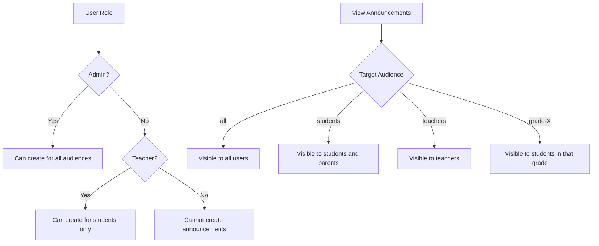
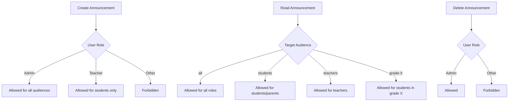
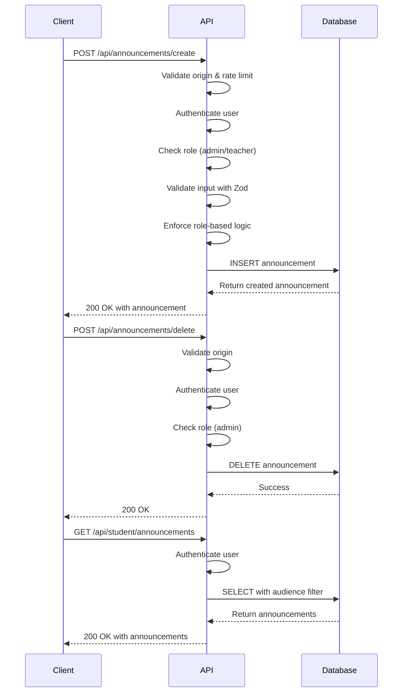
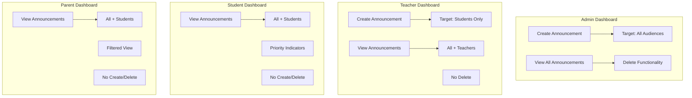

# Announcements and Communications

<cite>
**Referenced Files in This Document**   
- [create_communication_tables.sql](file://supabase/migrations/20251219043609_create_communication_tables.sql)
- [create.ts](file://app/api/announcements/create/route.ts)
- [delete.ts](file://app/api/announcements/delete/route.ts)
- [student/page.tsx](file://app/student/announcements/page.tsx)
- [teacher/page.tsx](file://app/teacher/announcements/page.tsx)
- [admin/page.tsx](file://app/admin/announcements/page.tsx)
- [queries.ts](file://lib/supabase/queries.ts)
- [types.ts](file://lib/supabase/types.ts)
- [validation-schemas.ts](file://lib/validation-schemas.ts)
</cite>

## Table of Contents
1. [Introduction](#introduction)
2. [Announcements Table Structure](#announcements-table-structure)
3. [Role-Based Access and Distribution](#role-based-access-and-distribution)
4. [Row-Level Security (RLS) Policies](#row-level-security-rls-policies)
5. [API Flow for Announcements](#api-flow-for-announcements)
6. [Dashboard Integration](#dashboard-integration)
7. [Real-Time Updates via Supabase Subscriptions](#real-time-updates-via-supabase-subscriptions)
8. [Data Retention and Soft Delete Patterns](#data-retention-and-soft-delete-patterns)

## Introduction
The announcements system in the School Management System enables administrators and teachers to communicate important information to students, parents, and staff. This document details the structure, access controls, API flow, and user interface integration for the announcements feature. The system leverages Supabase for database operations, real-time updates, and row-level security to ensure secure and efficient communication across different user roles.

## Announcements Table Structure
The `announcements` table is designed to store all school-wide communications with metadata for targeting and prioritization. The table includes the following fields:

- **id**: UUID primary key, automatically generated
- **title**: Text field for the announcement title (required)
- **content**: Text field for the announcement body (required)
- **author_id**: UUID referencing the `users` table, allows NULL on deletion
- **target_audience**: Text field specifying who should receive the announcement with values: `all`, `students`, `teachers`, `grade-10`, `grade-11`, `grade-12`
- **priority**: Text field indicating urgency with values: `normal`, `important`, `urgent`
- **expires_at**: TIMESTAMPTZ field for automatic expiration of announcements
- **created_at**: TIMESTAMPTZ field with default value of current timestamp

The table has row-level security enabled to control access based on user roles and audience targeting.

**Section sources**
- [create_communication_tables.sql](file://supabase/migrations/20251219043609_create_communication_tables.sql#L1-L35)
- [types.ts](file://lib/supabase/types.ts#L201-L210)

## Role-Based Access and Distribution
The system implements role-based access control for announcements, ensuring that users only see announcements relevant to their role and audience targeting:

- **Admins**: Can create announcements for all audiences (`all`, `students`, `teachers`, specific grades)
- **Teachers**: Can create announcements only for students
- **Students**: Can view announcements targeted to `all` or `students`
- **Parents**: Can view announcements targeted to `all` or `students` (as their children are students)
- **Teachers (as recipients)**: Can view announcements targeted to `all` or `teachers`

When displaying announcements, the system filters based on the user's role and the target audience of each announcement. For example, a teacher will see announcements targeted to "all" and "teachers", while a student will see announcements targeted to "all" and "students".

**Diagram sources**
- [create.ts](file://app/api/announcements/create/route.ts#L38-L59)
- [student/page.tsx](file://app/student/announcements/page.tsx#L38-L42)
- [teacher/page.tsx](file://app/teacher/announcements/page.tsx#L58-L59)
- [admin/page.tsx](file://app/admin/announcements/page.tsx#L58)

**Section sources**
- [create.ts](file://app/api/announcements/create/route.ts#L38-L59)
- [student/page.tsx](file://app/student/announcements/page.tsx#L38-L42)
- [teacher/page.tsx](file://app/teacher/announcements/page.tsx#L58-L59)
- [admin/page.tsx](file://app/admin/announcements/page.tsx#L58)
- [parent/page.tsx](file://app/parent/announcements/page.tsx#L25-L27)

## Row-Level Security (RLS) Policies
The announcements system implements strict row-level security policies to ensure data privacy and appropriate access:

- **Create Access**: Only users with "admin" or "teacher" roles can create announcements. Teachers are restricted to creating announcements with target_audience = "students".
- **Read Access**: Users can read announcements based on their role and the announcement's target_audience:
  - All users can read announcements with target_audience = "all"
  - Students and parents can read announcements with target_audience = "students"
  - Teachers can read announcements with target_audience = "teachers"
  - Users can read grade-specific announcements if they belong to that grade
- **Update Access**: Only admins can update announcements
- **Delete Access**: Only admins can delete announcements

The RLS policies are enforced at the database level and supplemented by application-level checks in the API routes for defense in depth.

**Diagram sources**
- [create.ts](file://app/api/announcements/create/route.ts#L29-L59)
- [delete.ts](file://app/api/announcements/delete/route.ts#L19-L28)
- [queries.ts](file://lib/supabase/queries.ts#L328-L330)

**Section sources**
- [create.ts](file://app/api/announcements/create/route.ts#L29-L59)
- [delete.ts](file://app/api/announcements/delete/route.ts#L19-L28)
- [queries.ts](file://lib/supabase/queries.ts#L328-L330)

## API Flow for Announcements
The announcements API consists of three main endpoints for creating, retrieving, and deleting announcements:

### Create Announcement Flow
1. Client sends POST request to `/api/announcements/create` with announcement data
2. Server validates origin (CSRF protection)
3. Rate limiting is applied (5 requests per minute per IP)
4. User authentication is verified
5. User role is checked (must be admin or teacher)
6. Input validation using Zod schema
7. Role-based logic enforcement (teachers can only target students)
8. Insert into announcements table
9. Return success response with created announcement

### Delete Announcement Flow
1. Client sends POST request to `/api/announcements/delete` with announcement ID
2. Server validates origin (CSRF protection)
3. User authentication is verified
4. User role is checked (must be admin)
5. Delete from announcements table
6. Return success response

### Retrieve Announcements Flow
1. Client sends GET request to role-specific endpoint (e.g., `/api/student/announcements`)
2. Server verifies user authentication
3. Queries announcements based on user role and target audience
4. Returns filtered announcements

**Diagram sources**
- [create.ts](file://app/api/announcements/create/route.ts)
- [delete.ts](file://app/api/announcements/delete/route.ts)
- [student/page.tsx](file://app/student/announcements/page.tsx#L38-L42)

**Section sources**
- [create.ts](file://app/api/announcements/create/route.ts)
- [delete.ts](file://app/api/announcements/delete/route.ts)
- [student/page.tsx](file://app/student/announcements/page.tsx#L38-L42)

## Dashboard Integration
Announcements are integrated into role-specific dashboards with tailored functionality:

### Admin Dashboard
- Full CRUD capabilities for announcements
- Can target announcements to all audiences
- Delete functionality available
- Displays all announcements regardless of target audience
- Form includes audience selection dropdown with all options

### Teacher Dashboard
- Create and read capabilities
- Can only target announcements to students
- No delete functionality
- Displays announcements targeted to "all" and "teachers"
- Form automatically sets target audience to "students"

### Student Dashboard
- Read-only access
- Displays announcements targeted to "all" and "students"
- Visual indicators for priority levels (normal, important, urgent)
- No creation or deletion capabilities

### Parent Dashboard
- Read-only access
- Displays announcements targeted to "all" and "students"
- Filtered view showing only relevant announcements
- Simplified interface focused on important information

**Diagram sources**
- [admin/page.tsx](file://app/admin/announcements/page.tsx)
- [teacher/page.tsx](file://app/teacher/announcements/page.tsx)
- [student/page.tsx](file://app/student/announcements/page.tsx)
- [parent/page.tsx](file://app/parent/announcements/page.tsx)

**Section sources**
- [admin/page.tsx](file://app/admin/announcements/page.tsx)
- [teacher/page.tsx](file://app/teacher/announcements/page.tsx)
- [student/page.tsx](file://app/student/announcements/page.tsx)
- [parent/page.tsx](file://app/parent/announcements/page.tsx)

## Real-Time Updates via Supabase Subscriptions
The system uses Supabase's real-time capabilities to provide instant updates when new announcements are created:

- Clients subscribe to the `announcements` table using Supabase's real-time channels
- When a new announcement is inserted, Supabase broadcasts the change to all subscribed clients
- The client application receives the real-time update and refreshes the announcements list
- Subscriptions are scoped to the user's role and audience targeting to prevent unauthorized access
- Connection state is monitored and subscriptions are re-established if disconnected

The real-time functionality ensures that users receive important announcements immediately without needing to refresh the page.

**Section sources**
- [student/page.tsx](file://app/student/announcements/page.tsx#L26-L58)
- [teacher/page.tsx](file://app/teacher/announcements/page.tsx#L41-L74)
- [admin/page.tsx](file://app/admin/announcements/page.tsx#L42-L73)

## Data Retention and Soft Delete Patterns
The current implementation uses hard deletes for announcements, with deletion restricted to administrators only:

- When an announcement is deleted, it is permanently removed from the database
- No soft delete mechanism (e.g., "deleted_at" flag) is currently implemented
- Deleted announcements are immediately removed from all user interfaces
- No audit trail of deleted announcements is maintained

Potential improvements to consider:
- Implement soft delete pattern using a "deleted_at" timestamp column
- Add audit logging for announcement deletions
- Implement data retention policies to automatically purge old announcements
- Add undelete functionality for recently deleted announcements

The system currently does not have automated data retention policies, so announcements persist indefinitely until manually deleted by an administrator.

**Section sources**
- [delete.ts](file://app/api/announcements/delete/route.ts)
- [admin/page.tsx](file://app/admin/announcements/page.tsx#L109-L128)