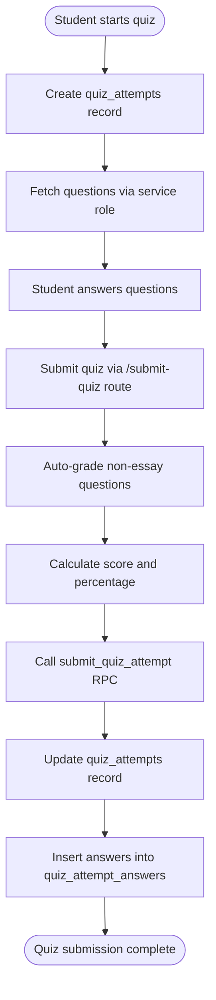

# Assignments and Quizzes

<cite>
**Referenced Files in This Document**   
- [20260105082224_create_assignments_table.sql](file://supabase/migrations/20260105082224_create_assignments_table.sql)
- [20251219043525_create_quizzes_tables.sql](file://supabase/migrations/20251219043525_create_quizzes_tables.sql)
- [20251219105024_create_quiz_attempt_answers.sql](file://supabase/migrations/20251219105024_create_quiz_attempt_answers.sql)
- [route.ts](file://app/api/assignments/route.ts)
- [submit/route.ts](file://app/api/assignments/submit/route.ts)
- [teacher/create-quiz/route.ts](file://app/api/teacher/create-quiz/route.ts)
- [student/start-quiz/route.ts](file://app/api/student/start-quiz/route.ts)
- [student/submit-quiz/route.ts](file://app/api/student/submit-quiz/route.ts)
- [types.ts](file://lib/supabase/types.ts)
- [database.types.ts](file://lib/database.types.ts)
- [storage.ts](file://lib/supabase/storage.ts)
- [database-helpers.ts](file://lib/database-helpers.ts)
</cite>

## Table of Contents
1. [Assignments Table](#assignments-table)
2. [Quizzes Table](#quizzes-table)
3. [Quiz Attempts and Answers](#quiz-attempts-and-answers)
4. [Row Level Security Policies](#row-level-security-policies)
5. [Submission Workflow](#submission-workflow)
6. [Auto-Grading Logic](#auto-grading-logic)
7. [Supabase Storage Integration](#supabase-storage-integration)
8. [Validation Rules](#validation-rules)
9. [API Routes Overview](#api-routes-overview)

## Assignments Table

The assignments table stores assessment tasks created by teachers for their classes. Each assignment contains metadata about the task and its requirements.

**Fields:**
- `id`: Unique identifier (UUID) for the assignment
- `title`: Required text field for the assignment title
- `description`: Optional text field for detailed instructions
- `class_id`: Foreign key referencing the class this assignment belongs to
- `due_date`: Required date field indicating submission deadline
- `max_score`: Integer representing the maximum possible score (default: 100)
- `allow_late_submission`: Boolean flag indicating if late submissions are accepted (default: true)
- `status`: Text field with check constraint allowing values: 'draft', 'published', 'closed' (default: 'draft')
- `created_at`: Timestamp of creation
- `updated_at`: Timestamp of last update

Supporting tables include:
- `assignment_attachments`: Stores files attached to assignments with name, type, URL, and size
- `assignment_submissions`: Tracks student submissions with status, score, and feedback
- `submission_files`: Stores files uploaded by students as part of their submissions

**Diagram sources**
- [20260105082224_create_assignments_table.sql](file://supabase/migrations/20260105082224_create_assignments_table.sql)

**Section sources**
- [20260105082224_create_assignments_table.sql](file://supabase/migrations/20260105082224_create_assignments_table.sql)
- [database.types.ts](file://lib/database.types.ts)
- [database-helpers.ts](file://lib/database-helpers.ts)

## Quizzes Table

The quizzes table manages online assessments with timed questions. Each quiz is associated with a specific class and teacher.

**Fields:**
- `id`: Unique identifier (UUID) for the quiz
- `title`: Required text field for the quiz title
- `class_id`: Foreign key referencing the class this quiz belongs to
- `teacher_id`: Foreign key referencing the teacher who created the quiz
- `description`: Optional text field for quiz instructions
- `duration`: Integer representing the time limit in minutes (default: 30)
- `due_date`: Optional date field for deadline
- `status`: Text field with check constraint allowing values: 'draft', 'published', 'closed' (default: 'draft')
- `created_at`: Timestamp of creation

Supporting tables include:
- `quiz_questions`: Stores individual questions with type, options, correct answer, and points
- `quiz_reopens`: Tracks instances where a quiz is reopened for specific students
- `quiz_attempts`: Records each student's attempt at the quiz
- `quiz_attempt_answers`: Stores individual question responses for each attempt

**Diagram sources**
- [20251219043525_create_quizzes_tables.sql](file://supabase/migrations/20251219043525_create_quizzes_tables.sql)
- [20251219105024_create_quiz_attempt_answers.sql](file://supabase/migrations/20251219105024_create_quiz_attempt_answers.sql)

**Section sources**
- [20251219043525_create_quizzes_tables.sql](file://supabase/migrations/20251219043525_create_quizzes_tables.sql)
- [20251219105024_create_quiz_attempt_answers.sql](file://supabase/migrations/20251219105024_create_quiz_attempt_answers.sql)
- [types.ts](file://lib/supabase/types.ts)
- [database.types.ts](file://lib/database.types.ts)

## Quiz Attempts and Answers

The quiz_attempts and quiz_attempt_answers tables work together to track student responses and assessment results.

### Quiz Attempts Table
- `id`: Unique identifier for the attempt
- `quiz_id`: References the quiz being attempted
- `student_id`: References the student making the attempt
- `score`: Numeric field for the calculated score
- `max_score`: Numeric field for the maximum possible score
- `percentage`: Calculated percentage score
- `needs_grading`: Boolean flag indicating if essay questions require manual grading
- `completed_at`: Timestamp when the attempt was completed

### Quiz Attempt Answers Table
- `id`: Unique identifier for the answer record
- `attempt_id`: References the quiz attempt
- `question_id`: References the quiz question
- `answer`: Text field storing the student's response
- `is_correct`: Boolean indicating if the answer was correct (for auto-graded questions)
- `points_awarded`: Numeric field for points given for this answer
- `graded_by`: References the teacher who manually graded this answer (if applicable)
- `graded_at`: Timestamp when manual grading was completed
- `created_at`: Timestamp of creation

The system uses a unique constraint on (attempt_id, question_id) to ensure each question is answered only once per attempt.

**Diagram sources**
- [20251219105024_create_quiz_attempt_answers.sql](file://supabase/migrations/20251219105024_create_quiz_attempt_answers.sql)
- [student/submit-quiz/route.ts](file://app/api/student/submit-quiz/route.ts)

**Section sources**
- [20251219105024_create_quiz_attempt_answers.sql](file://supabase/migrations/20251219105024_create_quiz_attempt_answers.sql)
- [student/start-quiz/route.ts](file://app/api/student/start-quiz/route.ts)
- [student/submit-quiz/route.ts](file://app/api/student/submit-quiz/route.ts)

## Row Level Security Policies

The system implements Row Level Security (RLS) policies to ensure data access is restricted based on user roles and relationships.

### Assignment Policies
- **Teachers can manage their assignments**: Teachers can create, read, update, and delete assignments where they are the teacher_id, or admins can manage all assignments
- **Students can view published assignments**: Students can view assignments that are published and belong to classes they are enrolled in
- **Students can submit and view their own submissions**: Students have full access to their own submission records
- **Teachers can view and grade submissions**: Teachers can access submissions for assignments they created
- **File access control**: Students can view their own submission files, while teachers can view files for submissions to their assignments

### Quiz Policies
- **Students can insert their own answers**: Students can only insert answers for their own quiz attempts
- **Students can view their own answers**: Students can only view answers from their own attempts
- **Teachers can view answers for their quizzes**: Teachers can view all answers for quizzes they created
- **Teachers can update answers for grading**: Teachers can update answer records when manually grading essay questions

These policies ensure that students can only submit to their enrolled classes, teachers can only manage assessments for their classes, and admins have full access across the system.

**Diagram sources**
- [20260105082224_create_assignments_table.sql](file://supabase/migrations/20260105082224_create_assignments_table.sql)
- [20251219105024_create_quiz_attempt_answers.sql](file://supabase/migrations/20251219105024_create_quiz_attempt_answers.sql)

**Section sources**
- [20260105082224_create_assignments_table.sql](file://supabase/migrations/20260105082224_create_assignments_table.sql)
- [20251219105024_create_quiz_attempt_answers.sql](file://supabase/migrations/20251219105024_create_quiz_attempt_answers.sql)

## Submission Workflow

The assignment submission workflow follows a structured process to ensure data integrity and proper access control.

### Assignment Submission Process
1. Student accesses the assignment details
2. System validates:
   - Assignment status is 'published'
   - Student is enrolled in the class
   - No prior submission exists
   - Current time vs. due date (for late submissions)
3. Student uploads files (if required) with URL validation
4. System creates submission record with appropriate status ('submitted' or 'late')
5. Submission files are stored in the submission_files table

### Quiz Submission Process
1. Student starts quiz via /start-quiz endpoint
2. System verifies:
   - Quiz status is 'published'
   - Student is enrolled in the class
   - No completed attempt exists
3. New attempt record is created if none exists
4. Questions are fetched using service role credentials
5. Student completes quiz within time limit
6. On submission, server validates:
   - Start time + duration vs. current time
   - Answer format and completeness
7. Auto-grading occurs for non-essay questions
8. RPC function submit_quiz_attempt updates the attempt record
9. Individual answers are stored in quiz_attempt_answers

**Diagram sources**
- [submit/route.ts](file://app/api/assignments/submit/route.ts)
- [student/submit-quiz/route.ts](file://app/api/student/submit-quiz/route.ts)

**Section sources**
- [submit/route.ts](file://app/api/assignments/submit/route.ts)
- [student/start-quiz/route.ts](file://app/api/student/start-quiz/route.ts)
- [student/submit-quiz/route.ts](file://app/api/student/submit-quiz/route.ts)

## Auto-Grading Logic

The system implements auto-grading for quizzes with different question types:

### Grading Rules by Question Type
- **Multiple Choice**: Answer must exactly match the correct_answer value
- **True/False**: Answer must exactly match the correct_answer value
- **Identification**: Answer is compared case-insensitive after trimming whitespace
- **Essay**: Always marked as incorrect initially, requires manual grading

### Scoring Process
1. For each submitted answer:
   - Retrieve the corresponding question from the quiz
   - Compare student answer with correct answer based on question type
   - Award full points if correct, zero points if incorrect
2. Calculate total score by summing points awarded
3. Calculate maximum possible score from all questions
4. Compute percentage score (rounded to nearest integer)
5. Set needs_grading flag if any essay questions were present

The auto-grading occurs server-side to prevent client manipulation. Essay questions are flagged for manual grading by the teacher.

**Diagram sources**
- [student/submit-quiz/route.ts](file://app/api/student/submit-quiz/route.ts)

**Section sources**
- [student/submit-quiz/route.ts](file://app/api/student/submit-quiz/route.ts)

## Supabase Storage Integration

Assignment submissions with file attachments are stored in Supabase Storage with strict security controls.

### Storage Configuration
- Files are stored in a dedicated storage bucket
- All file URLs are validated to ensure they originate from authorized storage
- The system checks that file URLs belong to the same Supabase project or end with '.supabase.co'

### File Validation
- URL validation ensures only authorized storage locations are used
- File size limits are enforced
- MIME type verification prevents content spoofing
- Content-Type is explicitly set during upload to prevent MIME sniffing attacks

### Security Measures
- Signed URLs with short expiration (5 minutes) for private materials
- Rate limiting on file operations
- Client-side validation before upload
- Server-side validation of file properties
- Unique file paths generated using user ID and random UUID

The storage integration ensures that student submissions are securely stored while maintaining accessibility for teachers during grading.

**Diagram sources**
- [storage.ts](file://lib/supabase/storage.ts)
- [submit/route.ts](file://app/api/assignments/submit/route.ts)

**Section sources**
- [storage.ts](file://lib/supabase/storage.ts)
- [submit/route.ts](file://app/api/assignments/submit/route.ts)

## Validation Rules

The system implements comprehensive validation rules at both the database and application levels.

### Database Constraints
- **Check constraints**: Ensure valid values for status fields (draft, published, closed)
- **Foreign key constraints**: Maintain referential integrity between related tables
- **Unique constraints**: Prevent duplicate submissions and answer records
- **Not null constraints**: Ensure required fields are populated
- **Default values**: Provide sensible defaults for optional fields

### Application-Level Validation
- **Zod schemas**: Validate incoming requests with detailed error messages
- **Role checks**: Verify user permissions before processing requests
- **Enrollment verification**: Confirm students are enrolled in relevant classes
- **State validation**: Check assignment/quiz status before allowing submissions
- **Rate limiting**: Prevent abuse of API endpoints

### Input Sanitization
- All user inputs are validated against defined schemas
- File URLs are restricted to authorized storage domains
- Special characters are properly escaped
- Maximum length limits are enforced on text fields
- Date formats are validated according to ISO standards

These validation rules ensure data integrity and prevent common security vulnerabilities such as injection attacks and unauthorized access.

**Section sources**
- [route.ts](file://app/api/assignments/route.ts)
- [submit/route.ts](file://app/api/assignments/submit/route.ts)
- [teacher/create-quiz/route.ts](file://app/api/teacher/create-quiz/route.ts)
- [database.types.ts](file://lib/database.types.ts)

## API Routes Overview

The system provides dedicated API routes for managing assignments and quizzes.

### Assignments Routes
- **GET /api/assignments**: Retrieves assignments with optional class filtering
- **POST /api/assignments**: Creates new assignments (teachers and admins only)
- **POST /api/assignments/submit**: Submits assignment responses with file attachments

### Quiz Routes
- **POST /api/teacher/create-quiz**: Creates new quizzes with questions (teachers only)
- **POST /api/student/start-quiz**: Initiates a quiz attempt for a student
- **POST /api/student/submit-quiz**: Submits completed quiz responses

### Security Features
- **CSRF protection**: Validates request origin headers
- **Rate limiting**: Prevents abuse of endpoints
- **Input validation**: Uses Zod schemas for comprehensive validation
- **Role verification**: Confirms user permissions before processing
- **IDOR prevention**: Validates ownership and enrollment relationships

Each route implements proper error handling with appropriate HTTP status codes and descriptive error messages.

**Section sources**
- [route.ts](file://app/api/assignments/route.ts)
- [submit/route.ts](file://app/api/assignments/submit/route.ts)
- [teacher/create-quiz/route.ts](file://app/api/teacher/create-quiz/route.ts)
- [student/start-quiz/route.ts](file://app/api/student/start-quiz/route.ts)
- [student/submit-quiz/route.ts](file://app/api/student/submit-quiz/route.ts)