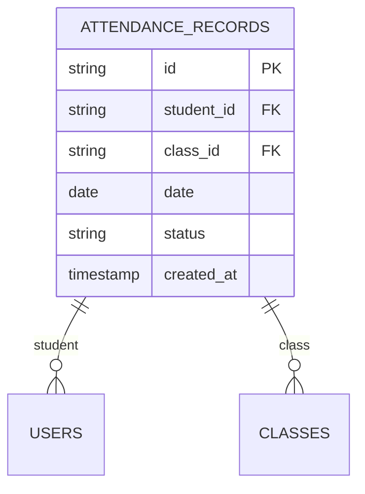
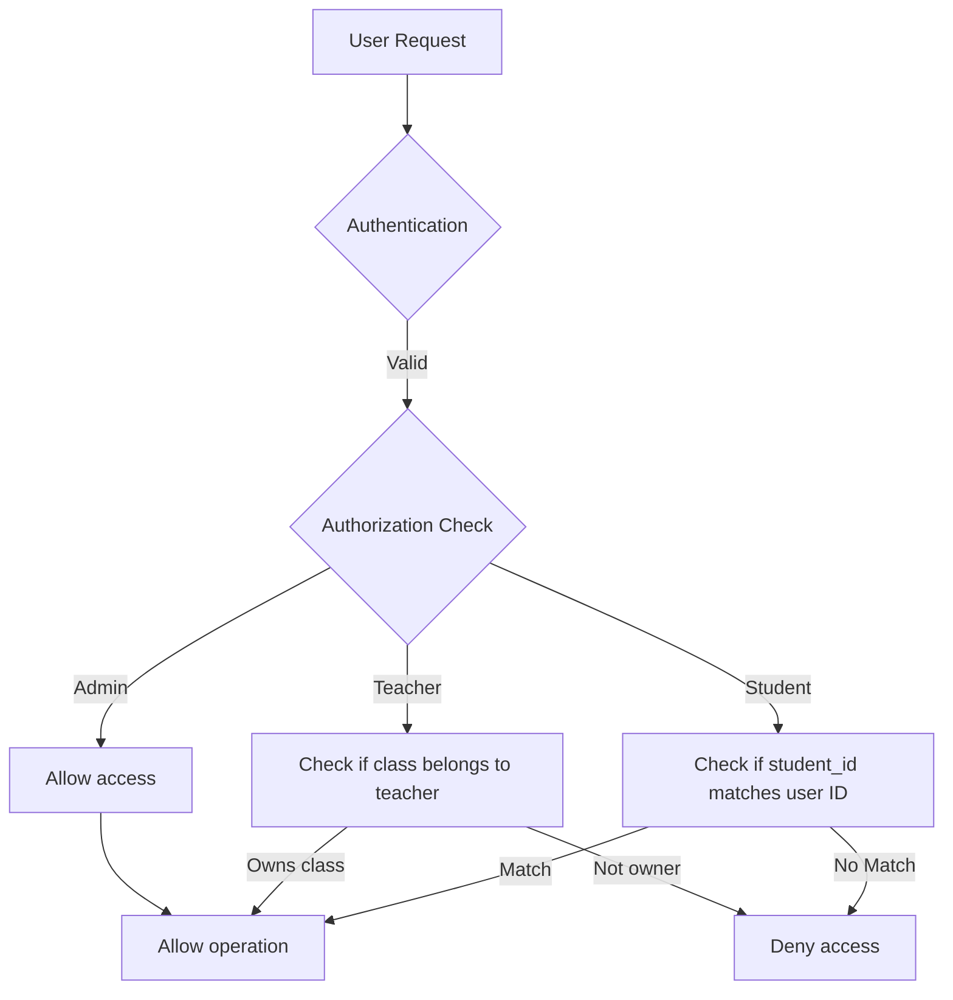
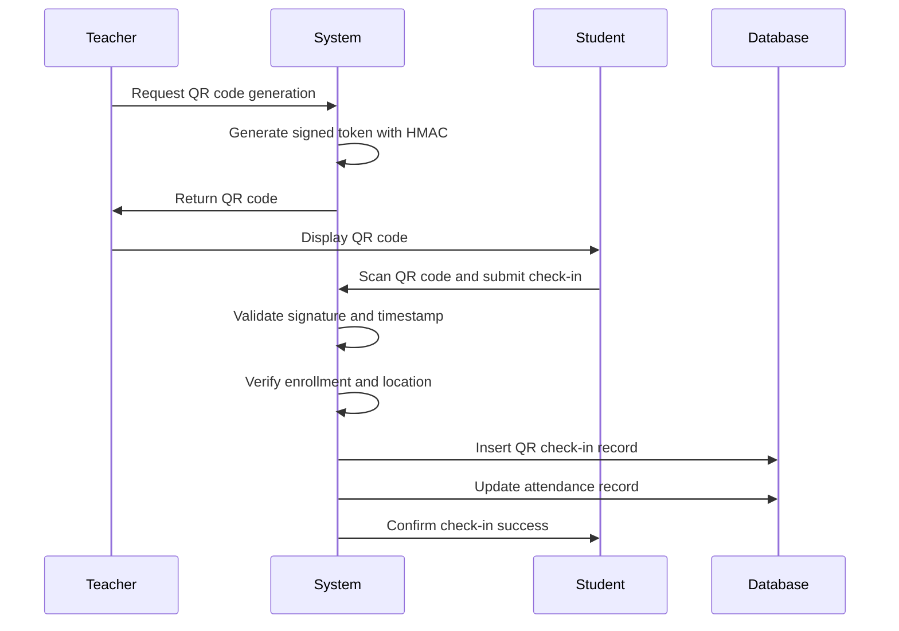
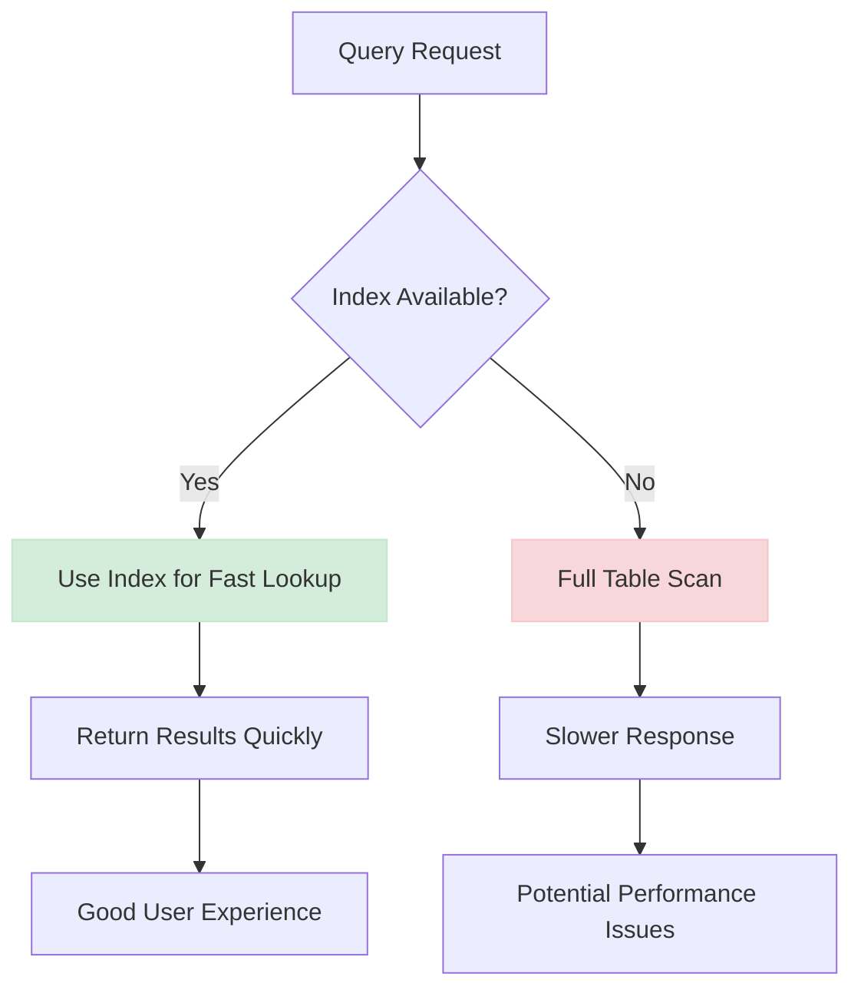
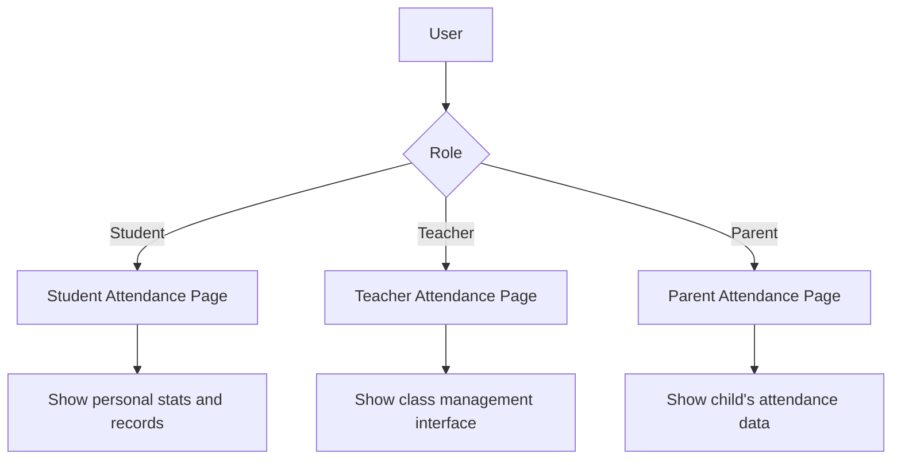

# Attendance System

<cite>
**Referenced Files in This Document**   
- [20251219043454_create_attendance_tables.sql](file://supabase/migrations/20251219043454_create_attendance_tables.sql)
- [20251219121408_add_attendance_unique_constraint.sql](file://supabase/migrations/20251219121408_add_attendance_unique_constraint.sql)
- [20251219121643_add_student_attendance_insert_policy.sql](file://supabase/migrations/20251219121643_add_student_attendance_insert_policy.sql)
- [20251219121650_add_student_attendance_update_policy.sql](file://supabase/migrations/20251219121650_add_student_attendance_update_policy.sql)
- [student/check-in/route.ts](file://app/api/student/check-in/route.ts)
- [teacher/generate-qr/route.ts](file://app/api/teacher/generate-qr/route.ts)
- [teacher/attendance/save/route.ts](file://app/api/teacher/attendance/save/route.ts)
- [teacher/attendance/class-data/route.ts](file://app/api/teacher/attendance/class-data/route.ts)
- [database.types.ts](file://lib/database.types.ts)
- [attendance-utils.ts](file://lib/attendance-utils.ts)
- [student/attendance/page.tsx](file://app/student/attendance/page.tsx)
- [teacher/attendance/page.tsx](file://app/teacher/attendance/page.tsx)
- [parent/attendance/page.tsx](file://app/parent/attendance/page.tsx)
- [20260108112143_performance_indexes.sql](file://supabase/migrations/20260108112143_performance_indexes.sql)
</cite>

## Table of Contents
1. [Introduction](#introduction)
2. [Attendance Records Table Structure](#attendance-records-table-structure)
3. [Unique Constraint](#unique-constraint)
4. [Row Level Security (RLS) Policies](#row-level-security-rls-policies)
5. [QR-Based Check-In Workflow](#qr-based-check-in-workflow)
6. [API Routes](#api-routes)
7. [Performance Considerations](#performance-considerations)
8. [Dashboard Display](#dashboard-display)
9. [Conclusion](#conclusion)

## Introduction
The attendance system in the School Management System provides a comprehensive solution for tracking student attendance through both manual entry by teachers and QR-based self-check-in by students. The system is designed with robust security, data integrity, and performance optimization in mind. This documentation details the database structure, security policies, workflow implementation, and user interface components that make up the attendance functionality.

## Attendance Records Table Structure
The `attendance_records` table is the central component of the attendance system, storing all attendance data with the following fields:

- **id**: UUID primary key, automatically generated
- **student_id**: UUID foreign key referencing the users table, with cascade delete
- **class_id**: UUID foreign key referencing the classes table, with cascade delete
- **date**: DATE field storing the attendance date
- **status**: TEXT field with constraint to allow only 'present', 'absent', 'late', or 'excused' values
- **created_at**: TIMESTAMPTZ field with default value of current timestamp

The table is designed to capture attendance for specific student-class-date combinations, ensuring accurate tracking of attendance patterns over time.

**Section sources**
- [20251219043454_create_attendance_tables.sql](file://supabase/migrations/20251219043454_create_attendance_tables.sql#L1-L8)
- [database.types.ts](file://lib/database.types.ts#L214-L239)

## Unique Constraint
To prevent duplicate attendance records for the same student in the same class on the same date, a unique constraint is implemented on the combination of student_id, class_id, and date fields. This constraint ensures data integrity by preventing accidental or malicious duplicate entries.

The unique constraint is implemented as a database-level unique index, which also provides performance benefits for queries that check for existing attendance records.

**Diagram sources**
- [20251219043454_create_attendance_tables.sql](file://supabase/migrations/20251219043454_create_attendance_tables.sql#L1-L8)
- [20251219121408_add_attendance_unique_constraint.sql](file://supabase/migrations/20251219121408_add_attendance_unique_constraint.sql#L1)

**Section sources**
- [20251219043454_create_attendance_tables.sql](file://supabase/migrations/20251219043454_create_attendance_tables.sql#L1-L8)
- [20251219121408_add_attendance_unique_constraint.sql](file://supabase/migrations/20251219121408_add_attendance_unique_constraint.sql#L1)

## Row Level Security (RLS) Policies
The attendance system implements granular Row Level Security (RLS) policies to ensure data privacy and appropriate access control:

- **Students**: Can insert and update their own attendance records via QR check-in
- **Teachers**: Can view and modify attendance records for their classes
- **Admins**: Have full access to all attendance records

The RLS policies are implemented at the database level, providing an additional security layer beyond application logic. The policies ensure that users can only access data they are authorized to see, even if they attempt to bypass the application interface.

**Diagram sources**
- [20251219121643_add_student_attendance_insert_policy.sql](file://supabase/migrations/20251219121643_add_student_attendance_insert_policy.sql#L1)
- [20251219121650_add_student_attendance_update_policy.sql](file://supabase/migrations/20251219121650_add_student_attendance_update_policy.sql#L1)

**Section sources**
- [20251219121643_add_student_attendance_insert_policy.sql](file://supabase/migrations/20251219121643_add_student_attendance_insert_policy.sql#L1)
- [20251219121650_add_student_attendance_update_policy.sql](file://supabase/migrations/20251219121650_add_student_attendance_update_policy.sql#L1)

## QR-Based Check-In Workflow
The QR-based check-in system allows students to record their attendance by scanning a dynamically generated QR code. The workflow involves several security measures to prevent fraud and ensure data integrity:

1. Teachers generate a QR code for their class session
2. The QR code contains a signed payload with session ID and timestamp
3. Students scan the QR code using their device
4. The system validates the QR code signature and expiration
5. Optional GPS location verification ensures the student is physically present
6. Attendance record is created or updated in the database

The system includes rate limiting and abuse detection to prevent automated check-ins from multiple accounts on the same network.

**Diagram sources**
- [teacher/generate-qr/route.ts](file://app/api/teacher/generate-qr/route.ts#L7-L79)
- [student/check-in/route.ts](file://app/api/student/check-in/route.ts#L23-L237)

**Section sources**
- [teacher/generate-qr/route.ts](file://app/api/teacher/generate-qr/route.ts#L7-L79)
- [student/check-in/route.ts](file://app/api/student/check-in/route.ts#L23-L237)

## API Routes
The attendance system exposes several API routes to support different user roles and functionality:

- **/api/teacher/generate-qr**: Generates a signed QR code token for a specific session
- **/api/student/check-in**: Processes student QR check-in requests with security validation
- **/api/teacher/attendance/save**: Allows teachers to save manual attendance records
- **/api/teacher/attendance/class-data**: Retrieves class enrollment and attendance data for a specific date

These API routes implement rate limiting, authentication, and authorization checks to ensure secure access to attendance functionality.

**Section sources**
- [teacher/generate-qr/route.ts](file://app/api/teacher/generate-qr/route.ts#L7-L79)
- [student/check-in/route.ts](file://app/api/student/check-in/route.ts#L23-L237)
- [teacher/attendance/save/route.ts](file://app/api/teacher/attendance/save/route.ts#L4-L58)
- [teacher/attendance/class-data/route.ts](file://app/api/teacher/attendance/class-data/route.ts#L4-L67)

## Performance Considerations
The attendance system includes several performance optimizations to ensure efficient data retrieval and reporting:

- **Indexing**: Strategic indexes on student_id, class_id, and date fields for fast querying
- **Composite indexes**: Multi-column indexes for common query patterns
- **Rate limiting**: Prevents abuse and ensures system stability
- **Caching**: Optimized query patterns reduce database load

The performance indexes are specifically designed to support common attendance reporting scenarios, such as viewing a student's attendance history or generating class attendance reports.

**Diagram sources**
- [20260108112143_performance_indexes.sql](file://supabase/migrations/20260108112143_performance_indexes.sql#L1-L104)

**Section sources**
- [20260108112143_performance_indexes.sql](file://supabase/migrations/20260108112143_performance_indexes.sql#L1-L104)

## Dashboard Display
Attendance data is displayed in user-specific dashboards with tailored views for different roles:

- **Student Dashboard**: Shows personal attendance statistics and recent records
- **Teacher Dashboard**: Provides class attendance management with date and class selection
- **Parent Dashboard**: Displays child's attendance rate and detailed statistics

The dashboards use visual elements like progress bars, badges, and statistics cards to present attendance information in an easily digestible format. The data is retrieved through secure API routes that enforce appropriate access controls.

**Diagram sources**
- [student/attendance/page.tsx](file://app/student/attendance/page.tsx#L1-L150)
- [teacher/attendance/page.tsx](file://app/teacher/attendance/page.tsx#L1-L253)
- [parent/attendance/page.tsx](file://app/parent/attendance/page.tsx#L1-L175)

**Section sources**
- [student/attendance/page.tsx](file://app/student/attendance/page.tsx#L1-L150)
- [teacher/attendance/page.tsx](file://app/teacher/attendance/page.tsx#L1-L253)
- [parent/attendance/page.tsx](file://app/parent/attendance/page.tsx#L1-L175)

## Conclusion
The attendance system in the School Management System provides a robust, secure, and user-friendly solution for tracking student attendance. By combining QR-based self-check-in with manual entry options, the system accommodates different use cases while maintaining data integrity through unique constraints and row-level security policies. The performance optimizations ensure that attendance data can be efficiently queried and reported, while the role-specific dashboards provide meaningful insights to students, teachers, and parents. The system's design prioritizes security, data accuracy, and usability, making it a reliable component of the overall school management solution.