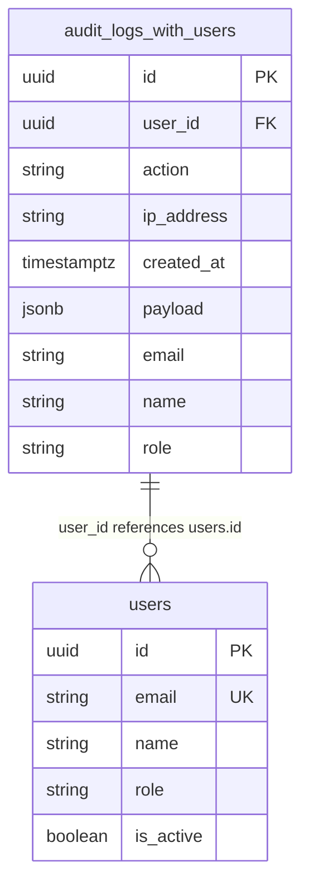
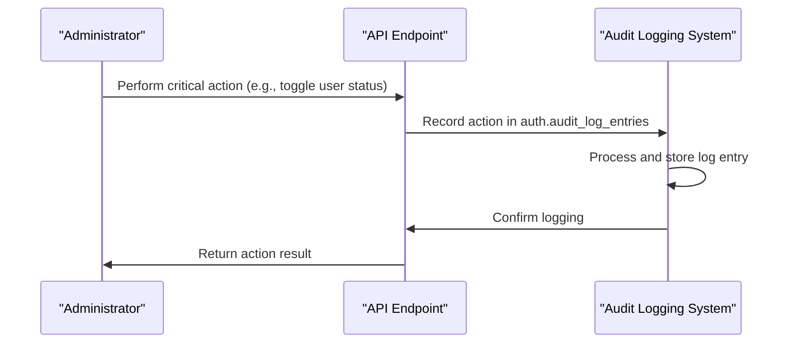
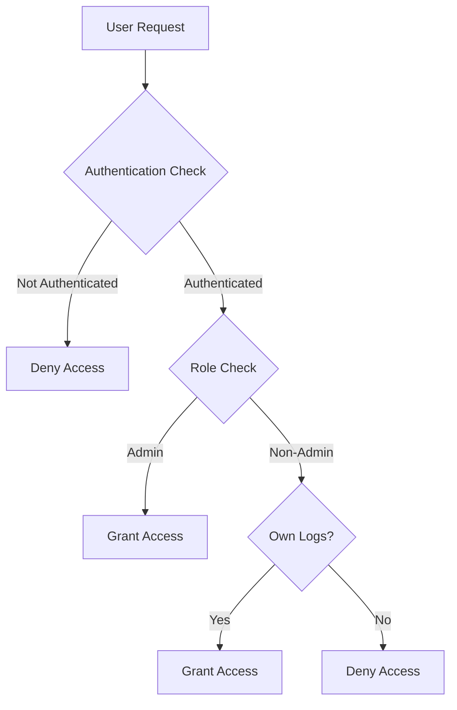
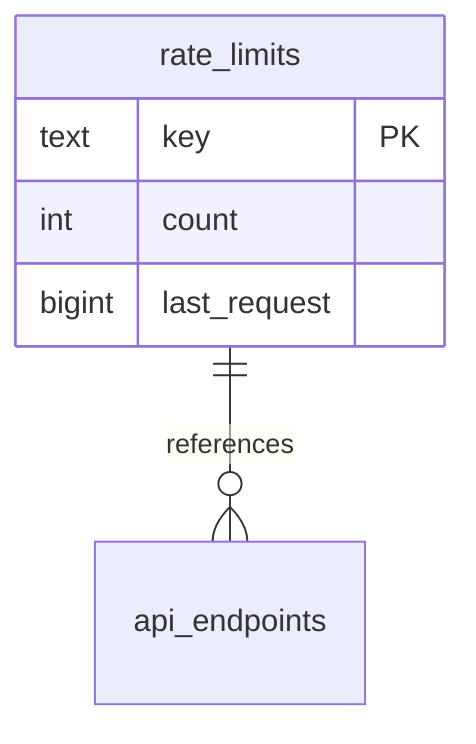
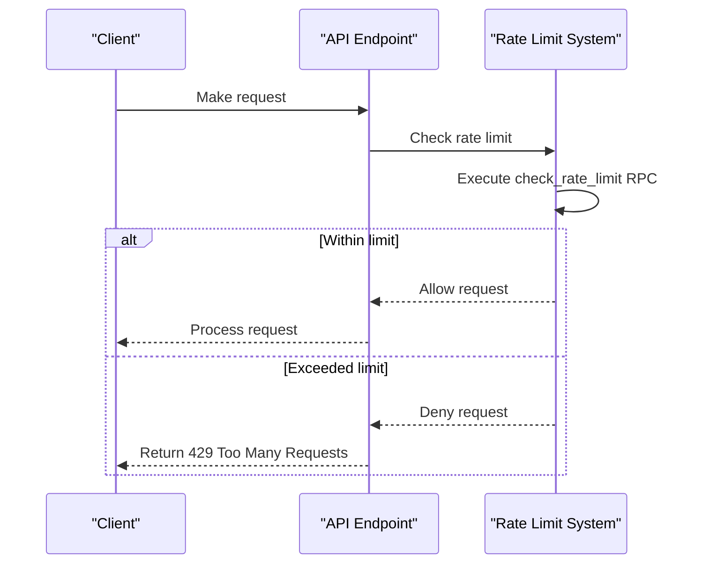
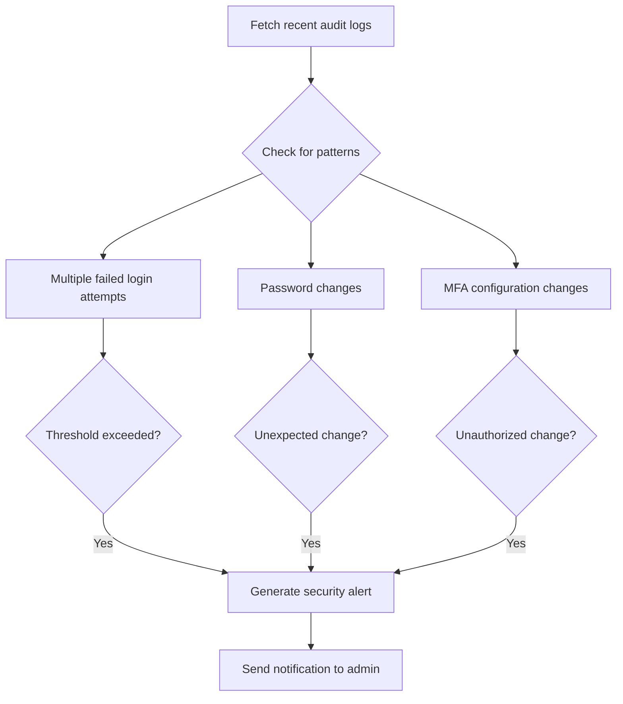
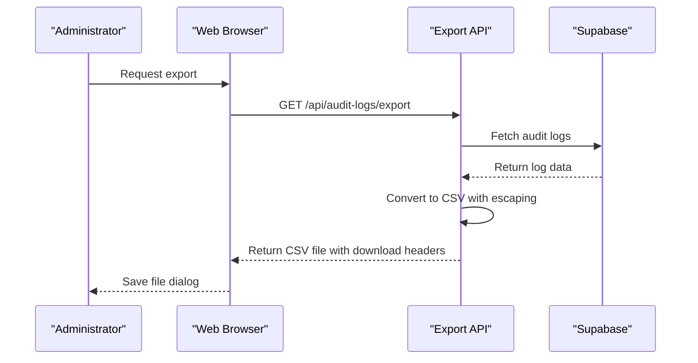
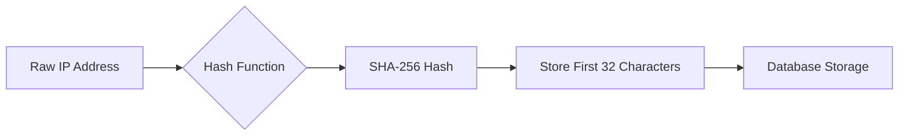

# Audit Logging and Security Monitoring

<cite>
**Referenced Files in This Document**   
- [audit-logs.ts](file://lib/supabase/audit-logs.ts)
- [route.ts](file://app/api/audit-logs/route.ts)
- [export/route.ts](file://app/api/audit-logs/export/route.ts)
- [audit-log-table.tsx](file://components/audit-log-table.tsx)
- [audit-log-filters.tsx](file://components/audit-log-filters.tsx)
- [audit-log-analytics.tsx](file://components/audit-log-analytics.tsx)
- [rate-limit.ts](file://lib/rate-limit.ts)
- [security.ts](file://lib/security.ts)
- [20260108_audit_logs_indexes.sql](file://supabase/migrations/20260108_audit_logs_indexes.sql)
- [20260101070340_rate_limit_table.sql](file://supabase/migrations/20260101070340_rate_limit_table.sql)
- [20260101070343_rate_limit_rpc.sql](file://supabase/migrations/20260101070343_rate_limit_rpc.sql)
- [20260110125232_hash_ip_addresses.sql](file://supabase/migrations/20260110125232_hash_ip_addresses.sql)
- [audit-monitor.ts](file://lib/audit-monitor.ts)
</cite>

## Table of Contents
1. [Introduction](#introduction)
2. [Audit Logs Table Structure](#audit-logs-table-structure)
3. [Critical Action Logging](#critical-action-logging)
4. [Row Level Security (RLS) Policies](#row-level-security-rls-policies)
5. [Rate Limiting System](#rate-limiting-system)
6. [Audit Log Querying and Monitoring](#audit-log-querying-and-monitoring)
7. [Export and Visualization](#export-and-visualization)
8. [Data Retention and Performance](#data-retention-and-performance)
9. [Privacy and Compliance](#privacy-and-compliance)

## Introduction
The audit logging system in the School Management System provides comprehensive security monitoring and tracking of critical actions across the platform. This documentation details the architecture, implementation, and security features of the audit logging infrastructure, including the audit_logs table structure, Row Level Security (RLS) policies, rate limiting mechanisms, and data privacy protections. The system is designed to ensure administrators can effectively monitor system activity, detect suspicious behavior, and maintain compliance with privacy regulations.

## Audit Logs Table Structure
The audit logging system is built around the `auth.audit_log_entries` table managed by Supabase Auth, which is enhanced with a public view for easier querying. The system captures comprehensive information about user actions and system events.

**Diagram sources**
- [20260108_audit_logs_indexes.sql](file://supabase/migrations/20260108_audit_logs_indexes.sql#L8-L20)
- [audit-logs.ts](file://lib/supabase/audit-logs.ts#L8-L18)

The `audit_logs_with_users` view extends the base audit log entries by joining with the users table to provide enriched information:

- **id**: Unique identifier for the audit log entry
- **user_id**: UUID of the user who performed the action (extracted from JSON payload)
- **action**: Type of action performed (e.g., login, user_updated_password)
- **ip_address**: IP address from which the action was performed
- **created_at**: Timestamp of when the action occurred
- **payload**: Full JSON payload containing detailed information about the action
- **email, name, role**: User information joined from the users table for easier querying

**Section sources**
- [20260108_audit_logs_indexes.sql](file://supabase/migrations/20260108_audit_logs_indexes.sql#L8-L20)
- [audit-logs.ts](file://lib/supabase/audit-logs.ts#L8-L18)

## Critical Action Logging
The system automatically logs critical actions across various domains including user management, grade modifications, and account linking. These actions are captured by Supabase Auth and made available through the audit logs system.

### User Status Changes
When an administrator toggles a user's status (active/inactive), this action is logged with the `user_modified` action type. The payload contains information about the user ID and the status change.

### Grade Modifications
Changes to student grades are logged through the system's grade management endpoints. When a teacher or administrator updates a grade, the action is recorded with relevant context including the student ID, class ID, and grade values.

### Account Linking
Parent-student account linking and unlinking actions are logged with specific action types. The `link-parent-child` and `unlink-parent-child` endpoints trigger audit log entries that capture the relationship changes between users.

**Diagram sources**
- [route.ts](file://app/api/admin/toggle-user-status/route.ts)
- [route.ts](file://app/api/admin/link-parent-child/route.ts)
- [route.ts](file://app/api/admin/unlink-parent-child/route.ts)

**Section sources**
- [audit-logs.ts](file://lib/supabase/audit-logs.ts)
- [route.ts](file://app/api/admin/toggle-user-status/route.ts)

## Row Level Security (RLS) Policies
The audit logging system implements strict Row Level Security (RLS) policies to ensure that only authorized users can access audit log data. These policies are enforced at the database level to provide robust security.

The RLS policies are implemented in the API routes rather than directly on the audit logs table, as the underlying `auth.audit_log_entries` table is managed by Supabase. The access control logic is implemented in the `/api/audit-logs/route.ts` file:

- Only users with the "admin" role can view all audit logs
- Non-admin users can only view their own audit log entries
- Unauthorized users are denied access entirely

This approach ensures that sensitive audit information is protected while still allowing users to view their own activity history.

**Diagram sources**
- [route.ts](file://app/api/audit-logs/route.ts#L35-L38)

**Section sources**
- [route.ts](file://app/api/audit-logs/route.ts#L35-L38)
- [audit-logs.ts](file://lib/supabase/audit-logs.ts)

## Rate Limiting System
The system implements a comprehensive rate limiting mechanism to prevent abuse and protect against brute force attacks. This is particularly important for authentication endpoints and other critical system functions.

The rate limiting system consists of:

- **rate_limits table**: Stores rate limit counters with a composite key of identifier and endpoint
- **check_rate_limit function**: Atomic PostgreSQL function that checks and increments counters
- **clean_rate_limits function**: Periodic cleanup of expired rate limit entries

The `check_rate_limit` RPC function provides atomic operations to prevent race conditions and ensure accurate rate limiting across concurrent requests. The system uses a sliding window approach to track request counts within specified time periods.

**Diagram sources**
- [20260101070340_rate_limit_table.sql](file://supabase/migrations/20260101070340_rate_limit_table.sql#L2-L6)
- [20260101070343_rate_limit_rpc.sql](file://supabase/migrations/20260101070343_rate_limit_rpc.sql#L2-L40)

The rate limiting system is implemented in the `rate-limit.ts` utility:

**Diagram sources**
- [rate-limit.ts](file://lib/rate-limit.ts#L25-L55)
- [20260101070343_rate_limit_rpc.sql](file://supabase/migrations/20260101070343_rate_limit_rpc.sql)

**Section sources**
- [rate-limit.ts](file://lib/rate-limit.ts#L25-L55)
- [20260101070340_rate_limit_table.sql](file://supabase/migrations/20260101070340_rate_limit_table.sql)
- [20260101070343_rate_limit_rpc.sql](file://supabase/migrations/20260101070343_rate_limit_rpc.sql)

## Audit Log Querying and Monitoring
The system provides robust querying capabilities for audit logs, enabling administrators to search, filter, and analyze security events. The querying system is designed to be both powerful and user-friendly.

### Query Parameters
The audit logs API supports multiple filtering parameters:
- **userId**: Filter logs by specific user ID
- **action**: Filter by action type (e.g., login, user_updated_password)
- **startDate/endDate**: Filter by date range
- **ipAddress**: Filter by IP address
- **page/pageSize**: Pagination controls

### Suspicious Activity Detection
The system includes automated detection of suspicious activity patterns:

The `detectSuspiciousActivity` function analyzes recent audit logs to identify potential security threats, such as multiple failed login attempts within a short time period. When suspicious patterns are detected, the system can generate alerts for administrators.

**Diagram sources**
- [audit-logs.ts](file://lib/supabase/audit-logs.ts#L150-L226)
- [audit-monitor.ts](file://lib/audit-monitor.ts#L24-L46)

**Section sources**
- [audit-logs.ts](file://lib/supabase/audit-logs.ts#L150-L226)
- [route.ts](file://app/api/audit-logs/route.ts#L40-L45)
- [audit-monitor.ts](file://lib/audit-monitor.ts#L24-L46)

## Export and Visualization
The audit logging system provides comprehensive export and visualization capabilities to support security monitoring and compliance reporting.

### Export Functionality
Administrators can export audit logs in CSV format through the `/api/audit-logs/export/route.ts` endpoint. The export functionality includes:

- Complete audit log data matching the specified filters
- Proper CSV escaping to prevent formula injection attacks
- Downloadable file with appropriate content disposition headers

**Diagram sources**
- [export/route.ts](file://app/api/audit-logs/export/route.ts)
- [audit-logs.ts](file://lib/supabase/audit-logs.ts#L244-L261)

### Dashboard Visualization
The admin dashboard provides visual analytics of audit log data through the `AuditLogAnalytics` component. Key metrics displayed include:

- Total logins over the past 30 days
- Failed login attempts requiring attention
- Authentication success rate
- Number of unique active users
- Top actions performed in the system

The `AuditLogTable` component displays detailed log entries in a tabular format with filtering capabilities, while the `AuditLogFilters` component provides an intuitive interface for narrowing down log entries based on various criteria.

**Section sources**
- [export/route.ts](file://app/api/audit-logs/export/route.ts)
- [audit-log-analytics.tsx](file://components/audit-log-analytics.tsx)
- [audit-log-table.tsx](file://components/audit-log-table.tsx)
- [audit-log-filters.tsx](file://components/audit-log-filters.tsx)

## Data Retention and Performance
The audit logging system is optimized for both performance and efficient data management. Various strategies are employed to ensure the system remains responsive even with large volumes of audit data.

### Indexing Strategy
The system implements targeted database indexes to optimize query performance:

- Indexes on frequently queried fields like user_id, action, and created_at
- Composite indexes for common query patterns
- Proper indexing of the audit logs view to support efficient filtering

The `20260108_performance_indexes.sql` migration file contains additional indexes for various tables in the system, contributing to overall performance optimization.

### Data Retention
While specific retention policies are not detailed in the provided code, the system is designed to handle historical data efficiently. The use of pagination in the audit log queries ensures that large result sets can be retrieved in manageable chunks without impacting system performance.

**Section sources**
- [20260108_audit_logs_indexes.sql](file://supabase/migrations/20260108_audit_logs_indexes.sql)
- [20260108_performance_indexes.sql](file://supabase/migrations/20260108_performance_indexes.sql)
- [audit-logs.ts](file://lib/supabase/audit-logs.ts#L52-L53)

## Privacy and Compliance
The audit logging system incorporates several privacy-preserving measures to comply with data protection regulations and protect user information.

### IP Address Hashing
To protect user privacy while still enabling abuse detection, IP addresses are hashed before storage:

The `hashIpAddress` function in `security.ts` implements this privacy protection by using SHA-256 hashing with a salt to prevent rainbow table attacks. This approach allows the system to detect abusive patterns (by comparing hash values) without storing personally identifiable information in plain text.

The `20260110125232_hash_ip_addresses.sql` migration adds the `ip_hash` column to the `qr_checkins` table, demonstrating the system's commitment to privacy-preserving data collection.

### Compliance Measures
The system incorporates several features to support compliance with privacy regulations:

- **Minimal data collection**: Only necessary information is logged
- **Access controls**: Strict RLS policies limit access to audit data
- **Data anonymization**: IP addresses are hashed to protect user identity
- **Audit trail**: All access to audit logs is itself logged for accountability

These measures ensure that the system balances security monitoring needs with user privacy rights.

**Diagram sources**
- [security.ts](file://lib/security.ts#L11-L14)
- [20260110125232_hash_ip_addresses.sql](file://supabase/migrations/20260110125232_hash_ip_addresses.sql#L6)

**Section sources**
- [security.ts](file://lib/security.ts#L11-L14)
- [20260110125232_hash_ip_addresses.sql](file://supabase/migrations/20260110125232_hash_ip_addresses.sql)
- [audit-logs.ts](file://lib/supabase/audit-logs.ts#L232-L239)