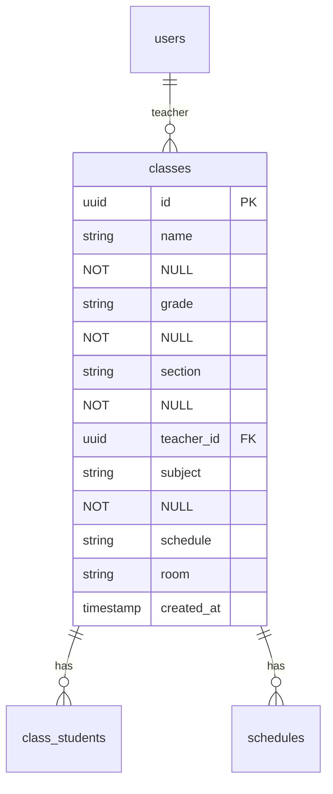
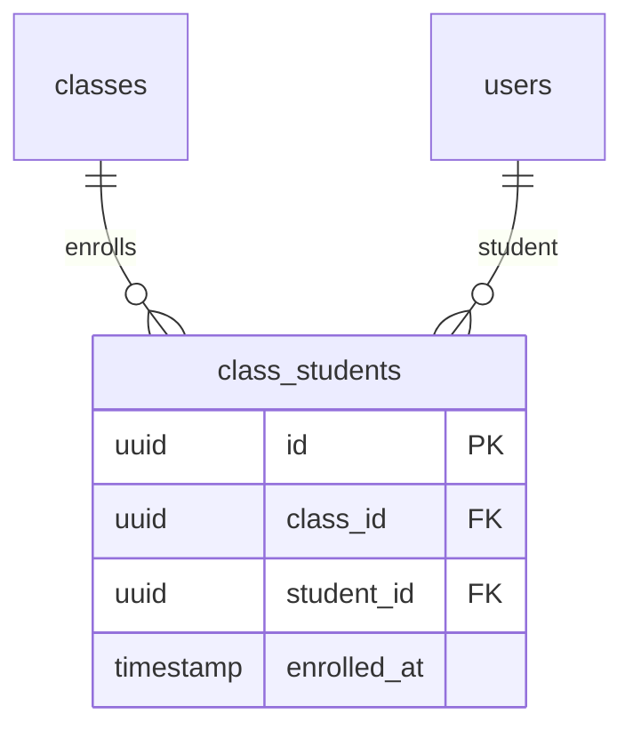
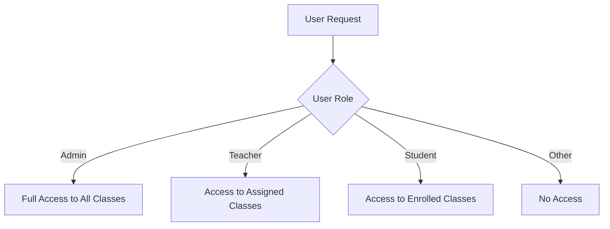
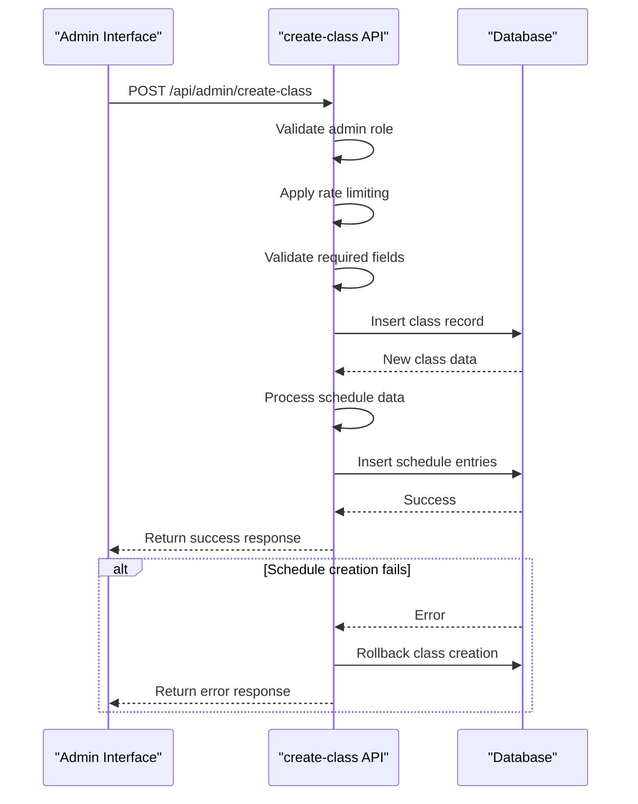
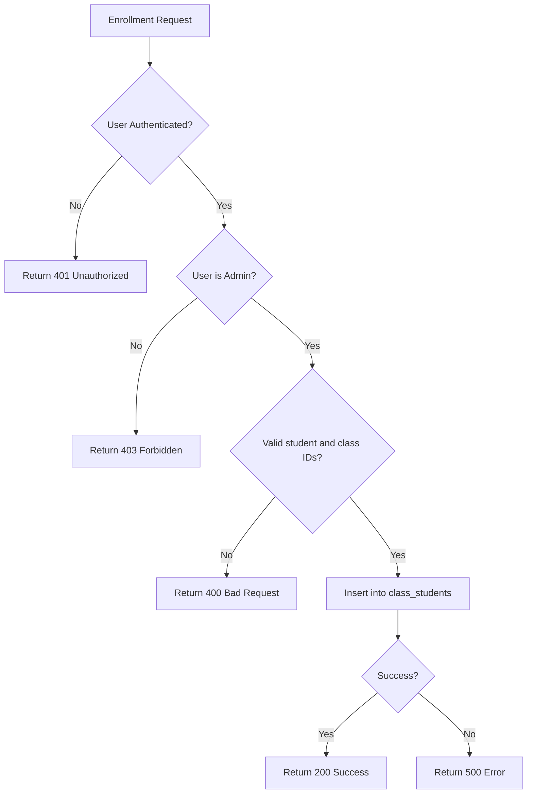
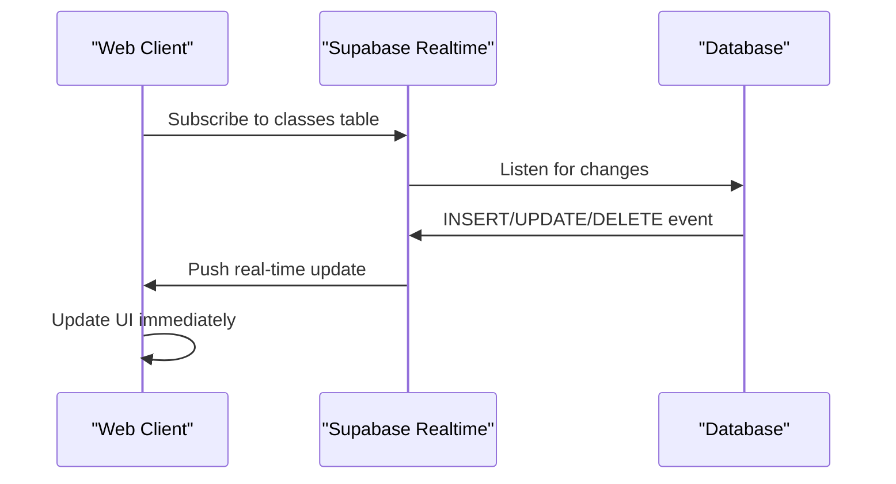

# Classes and Academic Structure

<cite>
**Referenced Files in This Document**   
- [20251219043440_create_classes_table.sql](file://supabase/migrations/20251219043440_create_classes_table.sql)
- [20251219043556_create_schedule_table.sql](file://supabase/migrations/20251219043556_create_schedule_table.sql)
- [create-class/route.ts](file://app/api/admin/create-class/route.ts)
- [enroll-student/route.ts](file://app/api/admin/enroll-student/route.ts)
- [unenroll-student/route.ts](file://app/api/admin/unenroll-student/route.ts)
- [classes/route.ts](file://app/api/teacher/classes/route.ts)
- [classes/route.ts](file://app/api/student/classes/route.ts)
- [page.tsx](file://app/admin/classes/page.tsx)
- [page.tsx](file://app/teacher/classes/page.tsx)
- [page.tsx](file://app/student/classes/page.tsx)
</cite>

## Table of Contents
1. [Introduction](#introduction)
2. [Classes Table Structure](#classes-table-structure)
3. [Class-Student Enrollment System](#class-student-enrollment-system)
4. [Row Level Security Policies](#row-level-security-policies)
5. [Class Creation Business Logic](#class-creation-business-logic)
6. [Student Enrollment and Unenrollment](#student-enrollment-and-unenrollment)
7. [Class Data Querying in Dashboards](#class-data-querying-in-dashboards)
8. [Real-time Updates with Supabase Subscriptions](#real-time-updates-with-supabase-subscriptions)
9. [Conclusion](#conclusion)

## Introduction
This document provides comprehensive documentation for the classes table and its relationship to students and teachers within the school management system. It details the database structure, business logic, security policies, and user interface implementations that govern class management, student enrollment, and access control. The system is designed to support administrators in creating and managing classes, teachers in accessing their assigned classes, and students in viewing their enrolled courses.

## Classes Table Structure

The classes table serves as the central entity for academic course management, storing essential information about each class including its name, subject, assigned teacher, and scheduling details. The table is implemented with proper relational constraints and timestamps for audit purposes.

**Diagram sources**
- [20251219043440_create_classes_table.sql](file://supabase/migrations/20251219043440_create_classes_table.sql)

**Section sources**
- [20251219043440_create_classes_table.sql](file://supabase/migrations/20251219043440_create_classes_table.sql)

### Field Definitions
- **id**: UUID primary key with default generation, uniquely identifying each class
- **name**: Text field storing the class name (e.g., "Algebra II", "World History")
- **grade**: Text field indicating the grade level (e.g., "10", "11", "12")
- **section**: Text field representing the section identifier (e.g., "A", "B", "C")
- **teacher_id**: UUID foreign key referencing the users table, establishing the teacher assignment relationship
- **subject**: Text field specifying the academic subject (e.g., "Mathematics", "English")
- **schedule**: Text field storing human-readable schedule information (e.g., "MWF 9:00 AM")
- **room**: Text field indicating the physical classroom location
- **created_at**: Timestamp with timezone recording when the class was created

The teacher_id field implements a foreign key relationship with the users table with ON DELETE SET NULL behavior, ensuring that if a teacher account is deleted, the class remains but with a null teacher assignment rather than being cascaded for deletion.

## Class-Student Enrollment System

The enrollment system uses a junction table called class_students to manage the many-to-many relationship between classes and students. This design allows students to enroll in multiple classes and classes to have multiple students, providing the flexibility needed for academic scheduling.

**Diagram sources**
- [20251219043440_create_classes_table.sql](file://supabase/migrations/20251219043440_create_classes_table.sql)

**Section sources**
- [20251219043440_create_classes_table.sql](file://supabase/migrations/20251219043440_create_classes_table.sql)

### Junction Table Structure
- **id**: UUID primary key for the enrollment record
- **class_id**: UUID foreign key referencing the classes table with ON DELETE CASCADE
- **student_id**: UUID foreign key referencing the users table with ON DELETE CASCADE
- **enrolled_at**: Timestamp with timezone recording when the student was enrolled

The table includes a unique constraint on the combination of class_id and student_id, preventing duplicate enrollments. The ON DELETE CASCADE behavior ensures that when a class is deleted, all associated enrollment records are automatically removed, maintaining referential integrity.

## Row Level Security Policies

The system implements comprehensive Row Level Security (RLS) policies to ensure that users can only access class data appropriate to their role and permissions. These policies are enforced at the database level, providing a secure foundation for the application.

**Diagram sources**
- [20251219044036_add_rls_policies.sql](file://supabase/migrations/20251219044036_add_rls_policies.sql)

**Section sources**
- [20251219044036_add_rls_policies.sql](file://supabase/migrations/20251219044036_add_rls_policies.sql)

### Security Policy Implementation
The RLS policies are configured as follows:

- **Administrators**: Have full access to all classes in the system, allowing them to create, read, update, and delete any class record
- **Teachers**: Can only view classes where they are assigned as the teacher (teacher_id matches their user ID)
- **Students**: Can only view classes in which they are enrolled, determined by checking the class_students junction table
- **Other users**: Have no access to class data unless specifically granted

These policies are implemented through PostgreSQL policies that evaluate the authenticated user's ID and role against the data being accessed, ensuring that unauthorized access attempts are blocked at the database level.

## Class Creation Business Logic

The class creation process is managed through a dedicated API endpoint that handles validation, rate limiting, and transactional integrity. The business logic ensures that classes are created with proper scheduling and that the system remains resilient to errors.

**Diagram sources**
- [create-class/route.ts](file://app/api/admin/create-class/route.ts)

**Section sources**
- [create-class/route.ts](file://app/api/admin/create-class/route.ts)

### Key Business Rules
- **Role verification**: Only users with the "admin" role can create classes
- **Rate limiting**: Administrators are limited to 10 class creations per minute to prevent abuse
- **Field validation**: Class name and subject are required fields
- **Transactional integrity**: If schedule creation fails, the class creation is rolled back to maintain data consistency
- **Schedule processing**: The system converts human-readable schedule codes (e.g., "MWF") and times into structured schedule entries

The API endpoint also handles the creation of corresponding schedule entries in the schedules table, breaking down the human-readable schedule into specific day and time records for precise calendar management.

## Student Enrollment and Unenrollment

Student enrollment and unenrollment are managed through dedicated API endpoints that provide secure, role-protected operations for modifying class membership. These endpoints implement proper authentication and authorization checks.

**Diagram sources**
- [enroll-student/route.ts](file://app/api/admin/enroll-student/route.ts)
- [unenroll-student/route.ts](file://app/api/admin/unenroll-student/route.ts)

**Section sources**
- [enroll-student/route.ts](file://app/api/admin/enroll-student/route.ts)
- [unenroll-student/route.ts](file://app/api/admin/unenroll-student/route.ts)

### Enrollment Process
The enrollment process follows these steps:
1. Authentication check to verify the user is logged in
2. Role verification to ensure the user is an administrator
3. Validation of studentId and classId parameters
4. Insertion of a new record into the class_students junction table
5. Return of success or error response

### Unenrollment Process
The unenrollment process follows these steps:
1. Authentication check to verify the user is logged in
2. Role verification to ensure the user is an administrator
3. Validation of enrollmentId parameter
4. Deletion of the specified enrollment record from class_students
5. Return of success or error response

Both operations are atomic and protected by database constraints to prevent invalid state changes.

## Class Data Querying in Dashboards

Different user roles access class data through role-specific API endpoints that return tailored information for their dashboards. These endpoints optimize data retrieval and presentation for the specific needs of each user type.

```mermaid
graph TB
subgraph "Admin Dashboard"
A[GET /api/admin/classes] --> B[Fetch all classes]
B --> C[Join with teacher data]
C --> D[Count enrolled students]
D --> E[Return comprehensive class list]
end
subgraph "Teacher Dashboard"
F[GET /api/teacher/classes] --> G[Filter by teacher_id]
G --> H[Count enrolled students]
H --> I[Return assigned classes]
end
subgraph "Student Dashboard"
J[GET /api/student/classes] --> K[Join through class_students]
K --> L[Fetch class and teacher data]
L --> M[Count total students]
M --> N[Return enrolled classes]
end
```

**Diagram sources**
- [classes/route.ts](file://app/api/teacher/classes/route.ts)
- [classes/route.ts](file://app/api/student/classes/route.ts)
- [page.tsx](file://app/admin/classes/page.tsx)

**Section sources**
- [classes/route.ts](file://app/api/teacher/classes/route.ts)
- [classes/route.ts](file://app/api/student/classes/route.ts)
- [page.tsx](file://app/admin/classes/page.tsx)

### Admin Dashboard Query
The admin dashboard queries all classes with additional information:
- Class details (name, grade, section, subject, schedule, room)
- Teacher assignment information (name)
- Student enrollment counts
- Sorting by class name

### Teacher Dashboard Query
The teacher dashboard queries only classes assigned to the current teacher:
- Filters classes where teacher_id matches the authenticated user's ID
- Includes student count for each class
- Returns essential class information for management purposes

### Student Dashboard Query
The student dashboard queries classes in which the student is enrolled:
- Joins class_students with classes and users tables
- Retrieves class information and teacher details
- Includes student count for class context
- Presents data in a student-friendly format

## Real-time Updates with Supabase Subscriptions

The system leverages Supabase's real-time capabilities to provide immediate updates to class information across clients. This ensures that all users see consistent data without requiring manual page refreshes.

**Diagram sources**
- [20251219082810_simplify_admin_update_policies.sql](file://supabase/migrations/20251219082810_simplify_admin_update_policies.sql)
- [20251219095015_enable_realtime_chat_messages.sql](file://supabase/migrations/20251219095015_enable_realtime_chat_messages.sql)

**Section sources**
- [20251219082810_simplify_admin_update_policies.sql](file://supabase/migrations/20251219082810_simplify_admin_update_policies.sql)
- [20251219095015_enable_realtime_chat_messages.sql](file://supabase/migrations/20251219095015_enable_realtime_chat_messages.sql)

When an administrator creates, updates, or deletes a class, or when students are enrolled or unenrolled, these changes are immediately pushed to all subscribed clients. The real-time functionality is enabled through Supabase's PostgreSQL LISTEN/NOTIFY system, which broadcasts database events to connected clients. This ensures that teachers see updated class rosters immediately and students see new classes as soon as they are enrolled.

## Conclusion
The classes and academic structure system provides a robust foundation for managing educational courses within the school management platform. Through a well-designed database schema with proper relationships, comprehensive security policies, and efficient business logic, the system enables administrators to manage classes effectively while ensuring that teachers and students have appropriate access to their relevant course information. The implementation of real-time updates enhances the user experience by providing immediate feedback on changes, creating a responsive and reliable academic management environment.