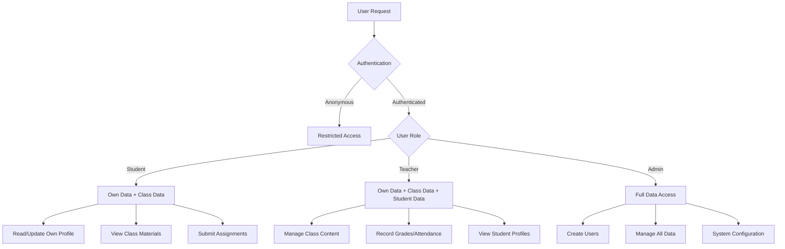

# Database Architecture

<cite>
**Referenced Files in This Document**   
- [20251219043432_create_users_table.sql](file://supabase/migrations/20251219043432_create_users_table.sql)
- [20251219043440_create_classes_table.sql](file://supabase/migrations/20251219043440_create_classes_table.sql)
- [20251219043454_create_attendance_tables.sql](file://supabase/migrations/20251219043454_create_attendance_tables.sql)
- [20251219043509_create_grades_tables.sql](file://supabase/migrations/20251219043509_create_grades_tables.sql)
- [20251219043525_create_quizzes_tables.sql](file://supabase/migrations/20251219043525_create_quizzes_tables.sql)
- [20251219043541_create_lessons_tables.sql](file://supabase/migrations/20251219043541_create_lessons_tables.sql)
- [20251219043556_create_schedule_table.sql](file://supabase/migrations/20251219043556_create_schedule_table.sql)
- [20251219043609_create_communication_tables.sql](file://supabase/migrations/20251219043609_create_communication_tables.sql)
- [20251219060333_add_deped_student_profile_fields.sql](file://supabase/migrations/20251219060333_add_deped_student_profile_fields.sql)
- [20251219080307_allow_admin_insert_users.sql](file://supabase/migrations/20251219080307_allow_admin_insert_users.sql)
- [20251219080314_allow_admin_manage_profiles.sql](file://supabase/migrations/20251219080314_allow_admin_manage_profiles.sql)
- [20251219081226_allow_admin_read_all_users.sql](file://supabase/migrations/20251219081226_allow_admin_read_all_users.sql)
- [20251219081806_fix_user_read_policy.sql](file://supabase/migrations/20251219081806_fix_user_read_policy.sql)
- [20251219082028_fix_teacher_profiles_rls.sql](file://supabase/migrations/20251219082028_fix_teacher_profiles_rls.sql)
- [20251219101254_add_lesson_materials_rls_policies.sql](file://supabase/migrations/20251219101254_add_lesson_materials_rls_policies.sql)
- [20260105000001_create_assignments_table.sql](file://supabase/migrations/20260105000001_create_assignments_table.sql)
- [20260110000001_create_zoom_meetings_table.sql](file://supabase/migrations/20260110000001_create_zoom_meetings_table.sql)
- [20260108115502_performance_indexes.sql](file://supabase/migrations/20260108115502_performance_indexes.sql)
</cite>

## Table of Contents
1. [Introduction](#introduction)
2. [Core Data Model](#core-data-model)
3. [User Management](#user-management)
4. [Class and Academic Structure](#class-and-academic-structure)
5. [Attendance System](#attendance-system)
6. [Grading and Assessment](#grading-and-assessment)
7. [Lesson and Content Management](#lesson-and-content-management)
8. [Scheduling](#scheduling)
9. [Communication and Notifications](#communication-and-notifications)
10. [Assignments and Quizzes](#assignments-and-quizzes)
11. [Zoom Integration](#zoom-integration)
12. [Row Level Security Policies](#row-level-security-policies)
13. [Data Validation and Constraints](#data-validation-and-constraints)
14. [Performance Optimization](#performance-optimization)
15. [Real-time Capabilities](#real-time-capabilities)
16. [Data Lifecycle and Backup](#data-lifecycle-and-backup)
17. [Database Schema Diagram](#database-schema-diagram)

## Introduction
This document provides comprehensive documentation for the Supabase PostgreSQL database schema used in the School Management System. The schema is designed to support a full-featured educational platform with robust user management, academic tracking, attendance monitoring, grading systems, lesson delivery, and communication tools. The database leverages PostgreSQL's advanced features including Row Level Security (RLS) for fine-grained access control, JSONB for flexible data storage, and UUIDs for secure record identification. The schema is implemented through a series of migration files that ensure version-controlled, reproducible database setup.

**Section sources**
- [20251219043432_create_users_table.sql](file://supabase/migrations/20251219043432_create_users_table.sql#L1-L32)
- [20251219043440_create_classes_table.sql](file://supabase/migrations/20251219043440_create_classes_table.sql#L1-L23)

## Core Data Model
The database schema is structured around core educational entities including users, classes, attendance, grades, assignments, lessons, and schedules. The data model follows a relational design with appropriate normalization while maintaining performance considerations for educational use cases. All tables use UUID primary keys for security and distributed system compatibility, with timestamps for creation and modification tracking. The schema supports role-based access through a user role system (admin, teacher, student) with corresponding profile tables that extend the base user information.

```mermaid
erDiagram
users ||--o{ student_profiles : "has"
users ||--o{ teacher_profiles : "has"
users ||--o{ attendance_records : "has"
users ||--o{ grades : "has"
users ||--o{ announcements : "authors"
users ||--o{ chat_messages : "sends"
users ||--o{ notifications : "receives"
users ||--o{ quizzes : "creates"
users ||--o{ lessons : "creates"
classes ||--o{ class_students : "contains"
classes ||--o{ attendance_records : "has"
classes ||--o{ grades : "has"
classes ||--o{ quizzes : "has"
classes ||--o{ lessons : "has"
classes ||--o{ schedules : "has"
lessons ||--o{ lesson_materials : "has"
quizzes ||--o{ quiz_questions : "contains"
quizzes ||--o{ quiz_attempts : "has"
quiz_attempts ||--o{ quiz_answers : "contains"
users {
uuid id PK
text email UK
text name
text role
text avatar
text phone
text address
timestamptz created_at
timestamptz updated_at
}
student_profiles {
uuid id PK FK
text grade
text section
date enrollment_date
text parent_name
text parent_phone
varchar lrn
varchar first_name
varchar middle_name
varchar last_name
}
teacher_profiles {
uuid id PK FK
text subject
text department
date join_date
}
classes {
uuid id PK
text name
text grade
text section
uuid teacher_id FK
text subject
text schedule
text room
timestamptz created_at
}
class_students {
uuid id PK
uuid class_id FK
uuid student_id FK
timestamptz enrolled_at
}
attendance_records {
uuid id PK
uuid student_id FK
uuid class_id FK
date date
text status
timestamptz created_at
}
grades {
uuid id PK
uuid student_id FK
uuid class_id FK
numeric score
numeric max_score
numeric percentage
numeric grade
text type
date date
timestamptz created_at
}
quizzes {
uuid id PK
text title
uuid class_id FK
uuid teacher_id FK
text description
integer duration
date due_date
text status
timestamptz created_at
}
lessons {
uuid id PK
text title
uuid class_id FK
uuid teacher_id FK
text description
text content
timestamptz created_at
timestamptz updated_at
}
schedules {
uuid id PK
uuid class_id FK
text day
time start_time
time end_time
text room
}
```

**Diagram sources**
- [20251219043432_create_users_table.sql](file://supabase/migrations/20251219043432_create_users_table.sql#L1-L32)
- [20251219043440_create_classes_table.sql](file://supabase/migrations/20251219043440_create_classes_table.sql#L1-L23)
- [20251219043454_create_attendance_tables.sql](file://supabase/migrations/20251219043454_create_attendance_tables.sql#L1-L35)
- [20251219043509_create_grades_tables.sql](file://supabase/migrations/20251219043509_create_grades_tables.sql#L1-L47)
- [20251219043525_create_quizzes_tables.sql](file://supabase/migrations/20251219043525_create_quizzes_tables.sql#L1-L60)
- [20251219043541_create_lessons_tables.sql](file://supabase/migrations/20251219043541_create_lessons_tables.sql#L1-L23)
- [20251219043556_create_schedule_table.sql](file://supabase/migrations/20251219043556_create_schedule_table.sql#L1-L11)

## User Management
The user management system is centered around the `users` table which stores core user information including authentication identifiers, contact details, and role assignments. The system implements a role-based access control model with three primary roles: admin, teacher, and student. Each user can have an extended profile through specialized tables (`student_profiles` and `teacher_profiles`) that inherit the user's UUID as both primary key and foreign key. The `student_profiles` table has been extended with DepEd (Department of Education) required fields to ensure compliance with Philippine educational regulations, including learner reference numbers (LRN), family background, and health information.

**Section sources**
- [20251219043432_create_users_table.sql](file://supabase/migrations/20251219043432_create_users_table.sql#L1-L32)
- [20251219060333_add_deped_student_profile_fields.sql](file://supabase/migrations/20251219060333_add_deped_student_profile_fields.sql#L1-L88)

## Class and Academic Structure
The academic structure is managed through the `classes` table which represents individual course offerings with attributes such as grade level, section, subject, and assigned teacher. Students are enrolled in classes through the `class_students` junction table, which establishes the many-to-many relationship between students and classes. Each class can have multiple schedules defined in the `schedules` table, specifying the days and times when the class meets. The schema supports multiple sections for the same grade and subject, allowing for differentiated instruction and cohort-based learning models.

**Section sources**
- [20251219043440_create_classes_table.sql](file://supabase/migrations/20251219043440_create_classes_table.sql#L1-L23)
- [20251219043556_create_schedule_table.sql](file://supabase/migrations/20251219043556_create_schedule_table.sql#L1-L11)

## Attendance System
The attendance system consists of multiple interconnected tables to support both traditional and technology-enhanced attendance tracking. The `attendance_records` table stores the official attendance status for students in classes, with valid statuses including present, absent, late, and excused. For technology-assisted attendance, the system implements a QR code-based check-in system using the `qr_attendance_sessions` and `qr_checkins` tables. Teachers can create attendance sessions with unique QR codes that students scan to check in, with optional location verification to prevent proxy attendance. The system enforces data integrity with unique constraints on class-student-date combinations.

**Section sources**
- [20251219043454_create_attendance_tables.sql](file://supabase/migrations/20251219043454_create_attendance_tables.sql#L1-L35)
- [20251219121408_add_attendance_unique_constraint.sql](file://supabase/migrations/20251219121408_add_attendance_unique_constraint.sql#L1-L5)

## Grading and Assessment
The grading system is implemented through the `grades` table which records assessment results for students across various assessment types including exams, quizzes, assignments, and projects. The system supports weighted grading through the `grade_weights` table, which allows teachers to define the relative importance of different assessment types for each class. Historical academic performance is tracked through the `grade_history` and `grade_history_subjects` tables, which store semester or annual summaries of student performance. The schema calculates and stores both raw scores and derived values such as percentages and final grades to optimize query performance.

**Section sources**
- [20251219043509_create_grades_tables.sql](file://supabase/migrations/20251219043509_create_grades_tables.sql#L1-L47)

## Lesson and Content Management
The lesson management system enables teachers to create and deliver instructional content through the `lessons` table, which stores lesson metadata and content. Each lesson can have multiple supporting materials stored in the `lesson_materials` table, which supports various content types including PDFs, videos, links, and documents. The materials are stored in Supabase Storage with URLs referenced in the database, allowing for efficient content delivery. The system implements Row Level Security policies that allow teachers to manage their own lesson materials while students can access materials for classes they are enrolled in.

**Section sources**
- [20251219043541_create_lessons_tables.sql](file://supabase/migrations/20251219043541_create_lessons_tables.sql#L1-L23)
- [20251219101254_add_lesson_materials_rls_policies.sql](file://supabase/migrations/20251219101254_add_lesson_materials_rls_policies.sql#L1-L10)

## Scheduling
The scheduling system is designed to manage class timetables through the `schedules` table, which defines when and where classes meet. Each schedule record specifies the day of the week, start and end times, and classroom location. The schema supports multiple schedule entries per class to accommodate complex timetables with different meeting patterns throughout the week. The day field is constrained to valid weekday values to ensure data consistency. This flexible scheduling model supports both traditional daily classes and block scheduling systems.

**Section sources**
- [20251219043556_create_schedule_table.sql](file://supabase/migrations/20251219043556_create_schedule_table.sql#L1-L11)

## Communication and Notifications
The communication system includes tables for announcements, chat messages, and notifications to facilitate information exchange within the school community. The `announcements` table supports targeted messaging with a `target_audience` field that can specify recipients by role or grade level, and a `priority` field to indicate message importance. The `chat_messages` table enables direct communication between users, while the `notifications` table provides a centralized system for delivering important updates about assignments, grades, attendance, and other academic events. All communication tables include timestamps for message creation to support chronological ordering.

**Section sources**
- [20251219043609_create_communication_tables.sql](file://supabase/migrations/20251219043609_create_communication_tables.sql#L1-L35)

## Assignments and Quizzes
The assessment system includes comprehensive support for both assignments and quizzes through dedicated tables. The `quizzes` table manages online assessments with configurable durations, due dates, and publication statuses. Each quiz contains multiple questions stored in the `quiz_questions` table, which supports various question types including multiple-choice, true-false, identification, and essay. Student attempts are tracked in the `quiz_attempts` table, with individual answers stored in the `quiz_answers` table. The system supports quiz reopens through the `quiz_reopens` table, allowing teachers to grant individual students additional attempts with customized due dates.

**Section sources**
- [20251219043525_create_quizzes_tables.sql](file://supabase/migrations/20251219043525_create_quizzes_tables.sql#L1-L60)
- [20260105000001_create_assignments_table.sql](file://supabase/migrations/20260105000001_create_assignments_table.sql#L1-L15)

## Zoom Integration
The system integrates with Zoom for virtual meetings through the `zoom_meetings` and `meeting_registrants` tables. The `zoom_meetings` table stores information about scheduled Zoom sessions including meeting IDs, join URLs, and scheduling details. The `meeting_registrants` table tracks which students have registered for specific meetings, supporting attendance tracking for virtual classes. The integration includes IP address hashing in the `hash_ip_addresses.sql` migration to enhance privacy and security for virtual meeting participants.

**Section sources**
- [20260110000001_create_zoom_meetings_table.sql](file://supabase/migrations/20260110000001_create_zoom_meetings_table.sql#L1-L15)
- [20260110125232_hash_ip_addresses.sql](file://supabase/migrations/20260110125232_hash_ip_addresses.sql#L1-L5)

## Row Level Security Policies
The database implements a comprehensive Row Level Security (RLS) model to enforce role-based access control at the database level. All tables have RLS enabled, with policies that restrict data access based on user identity and role. The security model follows the principle of least privilege, where users can only access data they own or have explicit permission to view. Key security policies include: users can read, insert, and update their own data; admins can create new users and manage all profiles; admins can read all user records; and authenticated users can view all teacher profiles. The policies are implemented through PostgreSQL security policies that evaluate session context and user roles.



**Diagram sources**
- [20251219044036_add_rls_policies.sql](file://supabase/migrations/20251219044036_add_rls_policies.sql#L1-L22)
- [20251219080307_allow_admin_insert_users.sql](file://supabase/migrations/20251219080307_allow_admin_insert_users.sql#L1-L12)
- [20251219081226_allow_admin_read_all_users.sql](file://supabase/migrations/20251219081226_allow_admin_read_all_users.sql#L1-L12)
- [20251219081806_fix_user_read_policy.sql](file://supabase/migrations/20251219081806_fix_user_read_policy.sql#L1-L17)
- [20251219082028_fix_teacher_profiles_rls.sql](file://supabase/migrations/20251219082028_fix_teacher_profiles_rls.sql#L1-L20)

**Section sources**
- [20251219044036_add_rls_policies.sql](file://supabase/migrations/20251219044036_add_rls_policies.sql#L1-L22)
- [20251219052436_fix_users_insert_policy.sql](file://supabase/migrations/20251219052436_fix_users_insert_policy.sql#L1-L15)
- [20251219080307_allow_admin_insert_users.sql](file://supabase/migrations/20251219080307_allow_admin_insert_users.sql#L1-L12)
- [20251219081226_allow_admin_read_all_users.sql](file://supabase/migrations/20251219081226_allow_admin_read_all_users.sql#L1-L12)

## Data Validation and Constraints
The database schema implements comprehensive data validation through PostgreSQL constraints to ensure data integrity and consistency. Key validation mechanisms include: check constraints on enumerated fields (role, status, day, etc.) to restrict values to predefined options; unique constraints on email addresses and LRNs to prevent duplicates; foreign key constraints to maintain referential integrity; and NOT NULL constraints on required fields. The schema also includes specialized constraints such as the unique index on non-null LRN values and check constraints on DepEd-specific fields like sex, enrollment status, and track. These constraints operate at the database level, providing a reliable enforcement layer that cannot be bypassed by application logic.

**Section sources**
- [20251219043432_create_users_table.sql](file://supabase/migrations/20251219043432_create_users_table.sql#L5)
- [20251219043454_create_attendance_tables.sql](file://supabase/migrations/20251219043454_create_attendance_tables.sql#L6)
- [20251219043556_create_schedule_table.sql](file://supabase/migrations/20251219043556_create_schedule_table.sql#L4)
- [20251219060333_add_deped_student_profile_fields.sql](file://supabase/migrations/20251219060333_add_deped_student_profile_fields.sql#L65-L84)

## Performance Optimization
The database schema includes several performance optimization strategies to ensure responsive application performance. Indexes are created on frequently queried columns such as foreign keys, status fields, and date columns to accelerate JOIN operations and WHERE clause filtering. The migration `20260108115502_performance_indexes.sql` specifically addresses performance by adding strategic indexes on key tables. The schema design minimizes redundant data while maintaining query efficiency through calculated fields (like percentages in the grades table) that avoid runtime calculations. The use of UUIDs, while providing security benefits, is balanced with appropriate indexing to maintain query performance. The system also leverages Supabase's real-time capabilities efficiently by structuring tables to support targeted subscriptions.

**Section sources**
- [20260108115502_performance_indexes.sql](file://supabase/migrations/20260108115502_performance_indexes.sql#L1-L10)
- [20251219043432_create_users_table.sql](file://supabase/migrations/20251219043432_create_users_table.sql#L3)
- [20251219043440_create_classes_table.sql](file://supabase/migrations/20251219043440_create_classes_table.sql#L6)

## Real-time Capabilities
The database schema is designed to support real-time functionality through Supabase's real-time engine. All relevant tables are configured to emit change events that can be subscribed to by the application frontend, enabling live updates without manual refreshing. This real-time capability supports features such as instant notification delivery, live attendance tracking, real-time grade updates, and collaborative lesson planning. The schema's use of standardized timestamps and status fields facilitates efficient change detection and event filtering. Security policies are carefully designed to work with real-time subscriptions, ensuring that users only receive real-time updates for data they have permission to access.

**Section sources**
- [20251219095015_enable_realtime_chat_messages.sql](file://supabase/migrations/20251219095015_enable_realtime_chat_messages.sql#L1-L5)
- [20251219101254_add_lesson_materials_rls_policies.sql](file://supabase/migrations/20251219101254_add_lesson_materials_rls_policies.sql#L1-L10)

## Data Lifecycle and Backup
The database implements a structured approach to data lifecycle management and backup strategies. While specific retention policies are not detailed in the migration files, the schema design supports data archiving through timestamped records and status fields that can be used to identify inactive or historical data. Supabase provides automated backups with point-in-time recovery capabilities, ensuring data durability and protection against accidental deletion or corruption. The use of UUIDs and referential integrity constraints ensures that data relationships remain consistent across backup and restore operations. The system's audit logging capabilities, though not fully detailed in the provided migrations, would typically be used to track data changes for compliance and recovery purposes.

**Section sources**
- [20251219043432_create_users_table.sql](file://supabase/migrations/20251219043432_create_users_table.sql#L9-L10)
- [20251219043440_create_classes_table.sql](file://supabase/migrations/20251219043440_create_classes_table.sql#L10)

## Database Schema Diagram
The following entity relationship diagram illustrates the complete database schema with all tables and their relationships. The diagram shows the core entities of the school management system and how they interconnect to support educational workflows. Primary keys, foreign keys, and cardinality are represented to provide a comprehensive view of the data model structure.

```mermaid
erDiagram
users ||--o{ student_profiles : "1-to-1"
users ||--o{ teacher_profiles : "1-to-1"
users ||--o{ attendance_records : "teaches/has"
users ||--o{ grades : "assesses/has"
users ||--o{ announcements : "authors"
users ||--o{ chat_messages : "sends/receives"
users ||--o{ notifications : "receives"
users ||--o{ quizzes : "creates"
users ||--o{ lessons : "creates"
users ||--o{ qr_attendance_sessions : "conducts"
users ||--o{ qr_checkins : "performs"
classes ||--o{ class_students : "contains"
classes ||--o{ attendance_records : "has"
classes ||--o{ grades : "has"
classes ||--o{ quizzes : "has"
classes ||--o{ lessons : "has"
classes ||--o{ schedules : "has"
classes ||--o{ qr_attendance_sessions : "has"
lessons ||--o{ lesson_materials : "has"
quizzes ||--o{ quiz_questions : "contains"
quizzes ||--o{ quiz_attempts : "has"
quiz_attempts ||--o{ quiz_answers : "contains"
quizzes ||--o{ quiz_reopens : "allows"
zoom_meetings ||--o{ meeting_registrants : "has"
users {
uuid id PK
text email UK
text name
text role
text avatar
text phone
text address
timestamptz created_at
timestamptz updated_at
}
student_profiles {
uuid id PK FK
text grade
text section
date enrollment_date
text parent_name
text parent_phone
varchar lrn UK
varchar first_name
varchar middle_name
varchar last_name
varchar name_extension
date birthdate
varchar sex
varchar birthplace_city
varchar birthplace_province
}
teacher_profiles {
uuid id PK FK
text subject
text department
date join_date
}
classes {
uuid id PK
text name
text grade
text section
uuid teacher_id FK
text subject
text schedule
text room
timestamptz created_at
}
class_students {
uuid id PK
uuid class_id FK
uuid student_id FK
timestamptz enrolled_at
}
attendance_records {
uuid id PK
uuid student_id FK
uuid class_id FK
date date
text status
timestamptz created_at
}
qr_attendance_sessions {
uuid id PK
uuid class_id FK
uuid teacher_id FK
date date
time start_time
time end_time
text qr_code UK
text status
boolean require_location
timestamptz created_at
}
qr_checkins {
uuid id PK
uuid session_id FK
uuid student_id FK
timestamptz checked_in_at
boolean location_verified
}
grades {
uuid id PK
uuid student_id FK
uuid class_id FK
numeric score
numeric max_score
numeric percentage
numeric grade
text type
date date
timestamptz created_at
}
grade_weights {
uuid id PK
uuid class_id FK UK
numeric quiz_weight
numeric exam_weight
numeric assignment_weight
numeric project_weight
}
grade_history {
uuid id PK
uuid student_id FK
text school_year
text grade_level
numeric general_average
text remarks
date promoted_date
timestamptz created_at
}
grade_history_subjects {
uuid id PK
uuid grade_history_id FK
text subject
numeric final_grade
text remarks
}
quizzes {
uuid id PK
text title
uuid class_id FK
uuid teacher_id FK
text description
integer duration
date due_date
text status
timestamptz created_at
}
quiz_questions {
uuid id PK
uuid quiz_id FK
text type
text question
jsonb options
text correct_answer
integer points
boolean case_sensitive
integer sort_order
}
quiz_attempts {
uuid id PK
uuid quiz_id FK
uuid student_id FK
numeric score
numeric max_score
numeric percentage
boolean needs_grading
timestamptz completed_at
}
quiz_answers {
uuid id PK
uuid attempt_id FK
uuid question_id FK
text answer
boolean is_correct
numeric manual_score
}
quiz_reopens {
uuid id PK
uuid quiz_id FK
uuid student_id FK
text reason
date new_due_date
timestamptz reopened_at
}
lessons {
uuid id PK
text title
uuid class_id FK
uuid teacher_id FK
text description
text content
timestamptz created_at
timestamptz updated_at
}
lesson_materials {
uuid id PK
uuid lesson_id FK
text name
text type
text url
text size
}
schedules {
uuid id PK
uuid class_id FK
text day
time start_time
time end_time
text room
}
announcements {
uuid id PK
text title
text content
uuid author_id FK
text target_audience
text priority
timestamptz expires_at
timestamptz created_at
}
chat_messages {
uuid id PK
uuid sender_id FK
uuid receiver_id FK
text content
boolean read
timestamptz created_at
}
notifications {
uuid id PK
uuid user_id FK
text title
text message
text type
boolean read
text link
timestamptz created_at
}
zoom_meetings {
uuid id PK
text meeting_id
text topic
timestamptz start_time
text join_url
text password
uuid created_by FK
timestamptz created_at
}
meeting_registrants {
uuid id PK
uuid meeting_id FK
uuid student_id FK
timestamptz registered_at
text status
}
```

**Diagram sources**
- [20251219043432_create_users_table.sql](file://supabase/migrations/20251219043432_create_users_table.sql#L1-L32)
- [20251219043440_create_classes_table.sql](file://supabase/migrations/20251219043440_create_classes_table.sql#L1-L23)
- [20251219043454_create_attendance_tables.sql](file://supabase/migrations/20251219043454_create_attendance_tables.sql#L1-L35)
- [20251219043509_create_grades_tables.sql](file://supabase/migrations/20251219043509_create_grades_tables.sql#L1-L47)
- [20251219043525_create_quizzes_tables.sql](file://supabase/migrations/20251219043525_create_quizzes_tables.sql#L1-L60)
- [20251219043541_create_lessons_tables.sql](file://supabase/migrations/20251219043541_create_lessons_tables.sql#L1-L23)
- [20251219043556_create_schedule_table.sql](file://supabase/migrations/20251219043556_create_schedule_table.sql#L1-L11)
- [20251219043609_create_communication_tables.sql](file://supabase/migrations/20251219043609_create_communication_tables.sql#L1-L35)
- [20260110000001_create_zoom_meetings_table.sql](file://supabase/migrations/20260110000001_create_zoom_meetings_table.sql#L1-L15)