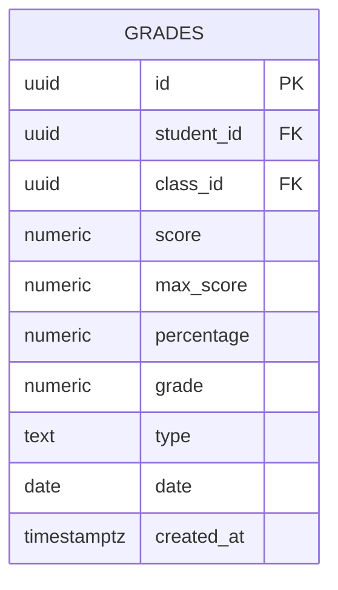
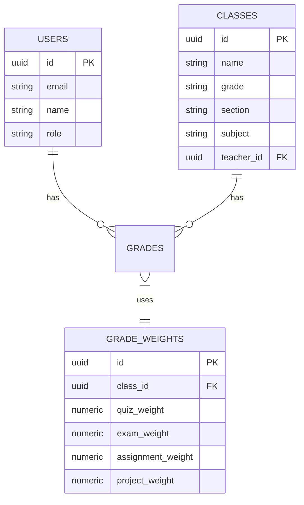
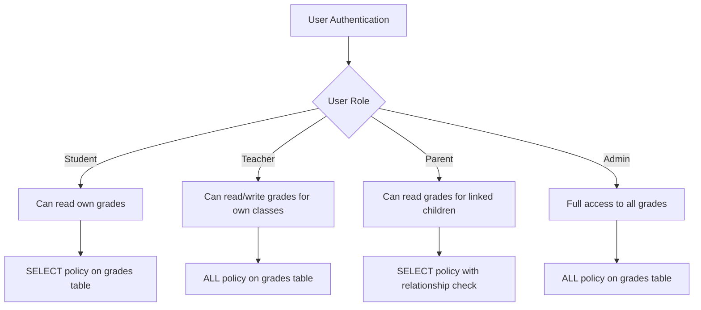
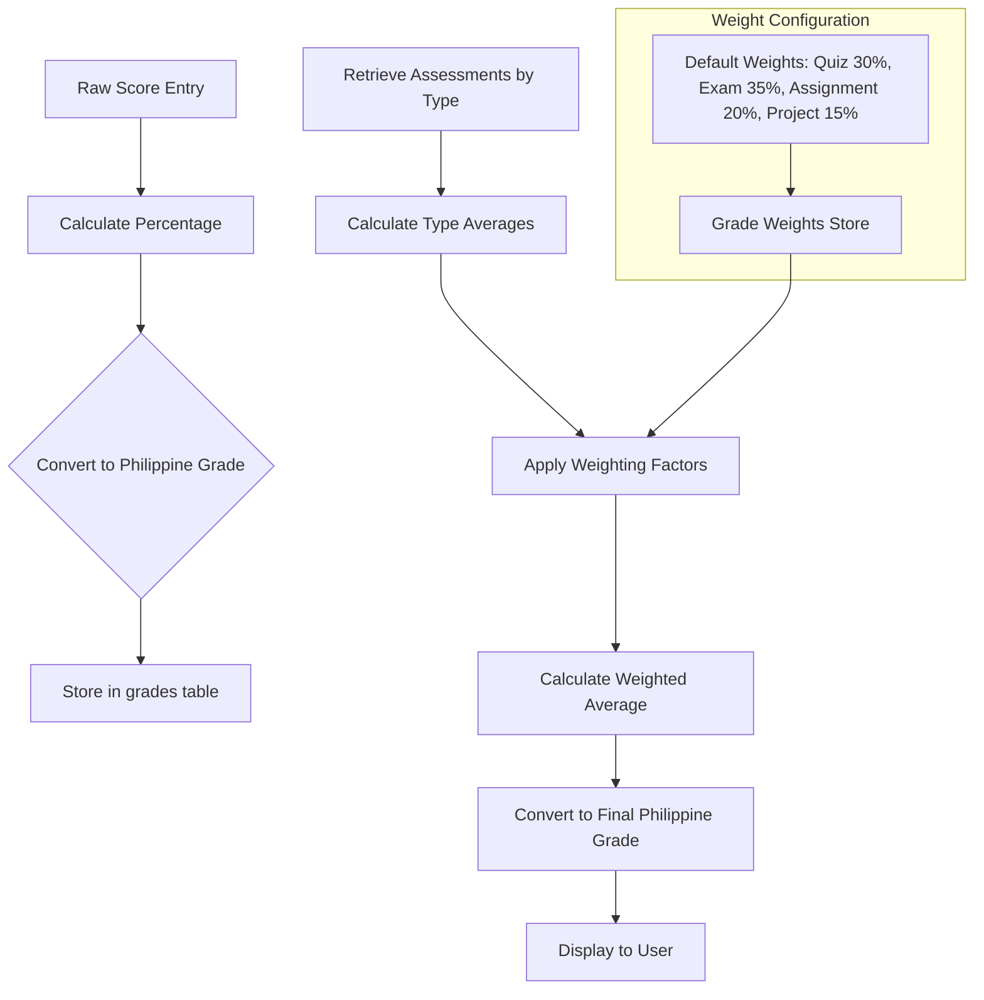
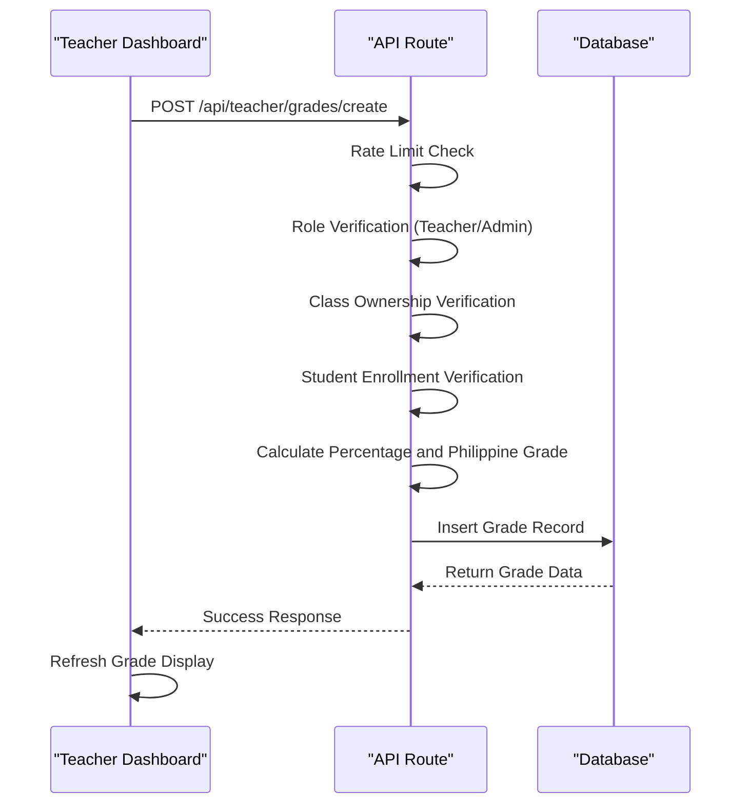
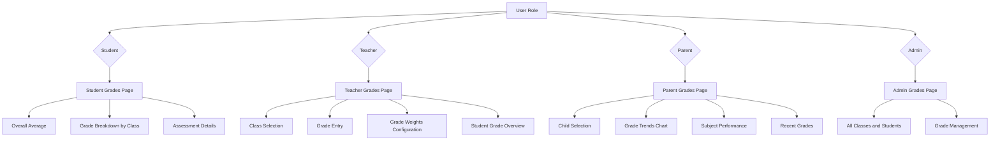

# Grades Management

<cite>
**Referenced Files in This Document**   
- [20251219043509_create_grades_tables.sql](file://supabase/migrations/20251219043509_create_grades_tables.sql)
- [20251219082305_add_write_policies.sql](file://supabase/migrations/20251219082305_add_write_policies.sql)
- [20251219082251_fix_all_rls_policies_v2.sql](file://supabase/migrations/20251219082251_fix_all_rls_policies_v2.sql)
- [types.ts](file://lib/supabase/types.ts)
- [grade-utils.ts](file://lib/grade-utils.ts)
- [grade-weights-store.ts](file://lib/grade-weights-store.ts)
- [create/route.ts](file://app/api/teacher/grades/create/route.ts)
- [route.ts](file://app/api/student/grades/route.ts)
- [page.tsx](file://app/teacher/grades/page.tsx)
- [page.tsx](file://app/student/grades/page.tsx)
- [page.tsx](file://app/parent/grades/page.tsx)
</cite>

## Table of Contents
1. [Introduction](#introduction)
2. [Grades Table Data Model](#grades-table-data-model)
3. [Relationships and Foreign Keys](#relationships-and-foreign-keys)
4. [Row Level Security (RLS) Policies](#row-level-security-rls-policies)
5. [Grading Logic and Calculations](#grading-logic-and-calculations)
6. [Grade Entry Workflow](#grade-entry-workflow)
7. [Grade Viewing Interfaces](#grade-viewing-interfaces)
8. [Data Integrity and Performance](#data-integrity-and-performance)
9. [Conclusion](#conclusion)

## Introduction
The grades management system in the School Management System implements a comprehensive solution for tracking student academic performance. This documentation details the data model for the grades table, including its fields, relationships, security policies, and business logic. The system supports the Philippine grading system with weighted averages for different assessment types (quizzes, assignments, exams, projects). The implementation includes robust Row Level Security (RLS) policies to ensure data privacy and appropriate access control for students, teachers, and administrators.

## Grades Table Data Model
The grades table serves as the central repository for student assessment records. It captures detailed information about each grade entry, including the assessment type, scores, and metadata.



**Diagram sources**
- [20251219043509_create_grades_tables.sql](file://supabase/migrations/20251219043509_create_grades_tables.sql#L1-L12)

**Section sources**
- [20251219043509_create_grades_tables.sql](file://supabase/migrations/20251219043509_create_grades_tables.sql#L1-L12)
- [types.ts](file://lib/supabase/types.ts#L135-L146)

The grades table contains the following fields:

- **id**: UUID primary key, automatically generated for each grade record
- **student_id**: UUID foreign key referencing the users table, establishing the student who received the grade
- **class_id**: UUID foreign key referencing the classes table, indicating which class the grade is for
- **score**: NUMERIC field storing the actual points earned by the student
- **max_score**: NUMERIC field with a default value of 100, representing the maximum possible points for the assessment
- **percentage**: NUMERIC field storing the percentage score (calculated as score/max_score * 100)
- **grade**: NUMERIC field storing the final Philippine grade (converted from percentage using a specific conversion algorithm)
- **type**: TEXT field with a CHECK constraint limiting values to 'exam', 'quiz', 'assignment', or 'project'
- **date**: DATE field recording when the assessment was administered
- **created_at**: TIMESTAMPTZ field with a default value of the current timestamp

The table implements ON DELETE CASCADE for both foreign keys, ensuring that if a student or class is deleted, all associated grades are automatically removed to maintain referential integrity.

## Relationships and Foreign Keys
The grades table is connected to other core entities in the system through foreign key relationships, creating a comprehensive academic record system.



**Diagram sources**
- [20251219043509_create_grades_tables.sql](file://supabase/migrations/20251219043509_create_grades_tables.sql#L1-L12)
- [types.ts](file://lib/supabase/types.ts#L4-L14)
- [types.ts](file://lib/supabase/types.ts#L114-L124)

**Section sources**
- [20251219043509_create_grades_tables.sql](file://supabase/migrations/20251219043509_create_grades_tables.sql#L1-L12)
- [types.ts](file://lib/supabase/types.ts#L4-L14)
- [types.ts](file://lib/supabase/types.ts#L114-L124)

The primary relationships are:

1. **Student Relationship**: The grades table references the users table through the student_id foreign key. This relationship enables linking grades to specific students and is used in conjunction with RLS policies to ensure students can only access their own grades.

2. **Class Relationship**: The grades table references the classes table through the class_id foreign key. This connection allows for organizing grades by class and subject, and is critical for teacher access control (teachers can only enter grades for their own classes).

3. **Grade Weights Relationship**: While not a direct foreign key, the grades table works in conjunction with the grade_weights table, which stores the weighting configuration for different assessment types by class. This relationship enables customized grading schemes for different classes.

## Row Level Security (RLS) Policies
The system implements comprehensive Row Level Security (RLS) policies to ensure appropriate access control for different user roles (students, teachers, parents, and administrators).



**Diagram sources**
- [20251219082305_add_write_policies.sql](file://supabase/migrations/20251219082305_add_write_policies.sql#L13-L17)
- [20251219082251_fix_all_rls_policies_v2.sql](file://supabase/migrations/20251219082251_fix_all_rls_policies_v2.sql#L15-L18)
- [create/route.ts](file://app/api/teacher/grades/create/route.ts#L6-L105)
- [route.ts](file://app/api/student/grades/route.ts#L4-L40)
- [route.ts](file://app/api/parent/child/[id]/grades/route.ts#L5-L61)

**Section sources**
- [20251219082305_add_write_policies.sql](file://supabase/migrations/20251219082305_add_write_policies.sql#L13-L17)
- [20251219082251_fix_all_rls_policies_v2.sql](file://supabase/migrations/20251219082251_fix_all_rls_policies_v2.sql#L15-L18)
- [create/route.ts](file://app/api/teacher/grades/create/route.ts#L6-L105)
- [route.ts](file://app/api/student/grades/route.ts#L4-L40)
- [route.ts](file://app/api/parent/child/[id]/grades/route.ts#L5-L61)

The RLS policies are implemented at both the database and application levels:

1. **Student Access**: Students can only view their own grades. This is enforced through a SELECT policy that requires the student_id to match the authenticated user's ID. The API route `/api/student/grades` implements additional server-side validation to ensure this policy.

2. **Teacher Access**: Teachers can create, read, update, and delete grades for classes they teach. The policy checks that the authenticated user is a teacher or admin and that they are the assigned teacher for the class. The API route `/api/teacher/grades/create` verifies both the teacher's role and their ownership of the class.

3. **Parent Access**: Parents can view grades for their linked children. This requires checking the parent_children relationship table to verify the parent-child relationship before allowing access to the child's grades. The API route `/api/parent/child/[id]/grades` implements this relationship check.

4. **Admin Access**: Administrators have full access to all grade records across the system, allowing them to manage grades for any student in any class.

These policies work in conjunction with application-level validation to provide defense in depth, ensuring data security even if one layer is compromised.

## Grading Logic and Calculations
The system implements a sophisticated grading logic that converts raw scores to Philippine grades using a weighted average calculation based on assessment type.



**Diagram sources**
- [grade-utils.ts](file://lib/grade-utils.ts#L1-L163)
- [grade-weights-store.ts](file://lib/grade-weights-store.ts#L1-L52)
- [page.tsx](file://app/teacher/grades/page.tsx#L58-L89)
- [page.tsx](file://app/student/grades/page.tsx#L72-L74)

**Section sources**
- [grade-utils.ts](file://lib/grade-utils.ts#L1-L163)
- [grade-weights-store.ts](file://lib/grade-weights-store.ts#L1-L52)
- [page.tsx](file://app/teacher/grades/page.tsx#L58-L89)
- [page.tsx](file://app/student/grades/page.tsx#L72-L74)

The grading process involves several key components:

1. **Percentage to Philippine Grade Conversion**: The `percentageToPhGrade` function converts a percentage score (0-100) to the Philippine grading scale (75-100 or below). This conversion follows the Philippine Department of Education standards, where 75 is the minimum passing grade.

2. **Weighted Average Calculation**: The `calculateFinalGrade` function computes the final grade by calculating the average percentage for each assessment type (quiz, exam, assignment, project), then applying the configured weights to compute a weighted average. The default weights are 30% for quizzes, 35% for exams, 20% for assignments, and 15% for projects.

3. **Grade Weights Store**: The system uses a Zustand store (`useGradeWeightsStore`) to manage grade weights by class. Teachers can customize the weights for their classes through the teacher dashboard, and these custom weights are applied when calculating final grades.

4. **Grade Information and Display**: The system provides functions to determine grade remarks (Excellent, Outstanding, etc.) and corresponding color variants for visual display in the user interface.

The calculation is performed on both the server and client sides to ensure consistency. The server calculates the grade when a new record is created, while the client performs the calculation for display purposes in the teacher and student dashboards.

## Grade Entry Workflow
The grade entry process is designed for teachers to efficiently input assessment scores while ensuring data integrity and proper access control.



**Diagram sources**
- [create/route.ts](file://app/api/teacher/grades/create/route.ts#L6-L105)
- [page.tsx](file://app/teacher/grades/page.tsx#L169-L203)

**Section sources**
- [create/route.ts](file://app/api/teacher/grades/create/route.ts#L6-L105)
- [page.tsx](file://app/teacher/grades/page.tsx#L169-L203)

The grade entry workflow involves the following steps:

1. **Teacher Initiation**: From the teacher dashboard (`/teacher/grades`), the teacher selects a class and clicks "Add Grade Entry" to open the grade entry dialog.

2. **Data Input**: The teacher selects a student, assessment type, and score (0-100). The interface provides real-time feedback, showing the calculated Philippine grade based on the entered score.

3. **API Request**: When the teacher submits the form, the frontend sends a POST request to `/api/teacher/grades/create` with the grade data.

4. **Server-Side Validation**: The API route performs several validation steps:
   - Rate limiting (20 grades per minute per teacher)
   - Role verification (ensuring the user is a teacher or admin)
   - Class ownership verification (ensuring the teacher teaches the specified class)
   - Student enrollment verification (ensuring the student is enrolled in the class)
   - Score validation (ensuring the score does not exceed the maximum)

5. **Grade Calculation**: The server calculates the percentage and converts it to a Philippine grade using the `percentageToPhGrade` function.

6. **Database Insertion**: The grade record is inserted into the database with all calculated fields.

7. **Response and Update**: The API returns the created grade record, and the frontend updates the display to show the new grade.

This workflow ensures data integrity while providing a user-friendly interface for teachers to enter grades efficiently.

## Grade Viewing Interfaces
The system provides tailored interfaces for different user roles to view grade information appropriate to their needs.



**Diagram sources**
- [page.tsx](file://app/student/grades/page.tsx#L1-L273)
- [page.tsx](file://app/teacher/grades/page.tsx#L1-L539)
- [page.tsx](file://app/parent/grades/page.tsx#L1-L214)

**Section sources**
- [page.tsx](file://app/student/grades/page.tsx#L1-L273)
- [page.tsx](file://app/teacher/grades/page.tsx#L1-L539)
- [page.tsx](file://app/parent/grades/page.tsx#L1-L214)

The grade viewing interfaces are role-specific:

1. **Student Interface**: The student grades page (`/student/grades`) displays the student's overall average, grade breakdown by class, and detailed assessment history. It includes visual elements like progress bars and badges to indicate performance levels according to the Philippine grading scale.

2. **Teacher Interface**: The teacher grades page (`/teacher/grades`) provides a comprehensive view of grades for their classes. Teachers can select a class, view all students and their grades, enter new grades, and configure grade weights for their classes. The interface shows final grades for each student based on the current weight configuration.

3. **Parent Interface**: The parent grades page (`/parent/grades`) offers a high-level view of their child's academic performance. It includes a grade trends chart showing performance over time, subject performance breakdown, and recent grades. Parents can view multiple children if linked.

4. **Admin Interface**: While not detailed in the provided code, administrators have access to all grade records across the system, allowing them to view and manage grades for any student in any class.

Each interface retrieves data through secure API routes that enforce RLS policies, ensuring users can only access data they are authorized to view.

## Data Integrity and Performance
The grades management system implements several strategies to ensure data integrity and optimize performance for grade-related operations.

```mermaid
graph TD
A[Data Integrity] --> B[Foreign Key Constraints]
A --> C[Check Constraints]
A --> D[NOT NULL Constraints]
A --> E[ON DELETE CASCADE]
F[Performance] --> G[Indexes]
F --> H[Rate Limiting]
F --> I[Caching]
F --> J[Optimized Queries]
B --> K[student_id references users.id]
B --> L[class_id references classes.id]
C --> M[type IN ('exam', 'quiz', 'assignment', 'project')]
D --> N[score, max_score, percentage, grade, date]
E --> O[Automatic cleanup of orphaned records]
G --> P[Indexes on foreign keys and date]
H --> Q[20 grades per minute per teacher]
I --> R[Client-side caching of grade weights]
J --> S[Server-side optimized queries]
```

**Diagram sources**
- [20251219043509_create_grades_tables.sql](file://supabase/migrations/20251219043509_create_grades_tables.sql#L1-L12)
- [create/route.ts](file://app/api/teacher/grades/create/route.ts#L16-L20)
- [grade-weights-store.ts](file://lib/grade-weights-store.ts#L1-L52)

**Section sources**
- [20251219043509_create_grades_tables.sql](file://supabase/migrations/20251219043509_create_grades_tables.sql#L1-L12)
- [create/route.ts](file://app/api/teacher/grades/create/route.ts#L16-L20)
- [grade-weights-store.ts](file://lib/grade-weights-store.ts#L1-L52)

Key data integrity and performance features include:

1. **Data Integrity Constraints**:
   - Foreign key constraints ensure grades are linked to valid students and classes
   - Check constraints restrict the assessment type to valid values
   - NOT NULL constraints ensure critical fields are always populated
   - ON DELETE CASCADE ensures referential integrity when related records are deleted

2. **Performance Optimizations**:
   - Indexes on foreign keys (student_id, class_id) and date fields to speed up queries
   - Rate limiting on grade creation (20 grades per minute per teacher) to prevent abuse
   - Client-side caching of grade weights using Zustand persist middleware to reduce database queries
   - Server-side optimized queries that use appropriate joins and filtering

3. **Security Measures**:
   - Row Level Security policies at the database level
   - Server-side validation in API routes as a second layer of security
   - Rate limiting to prevent denial-of-service attacks
   - Input validation to prevent injection attacks

These measures ensure the grades system is both reliable and performant, even with large volumes of data.

## Conclusion
The grades management system in the School Management System provides a comprehensive solution for tracking and managing student academic performance. The data model is well-designed with appropriate relationships between students, classes, and grades. The implementation of Row Level Security policies ensures data privacy and appropriate access control for different user roles. The grading logic follows Philippine standards with flexible weighting options for different assessment types. The system balances security, performance, and usability, providing tailored interfaces for students, teachers, parents, and administrators. The combination of database-level constraints, application-level validation, and user-friendly interfaces creates a robust system for academic record management.