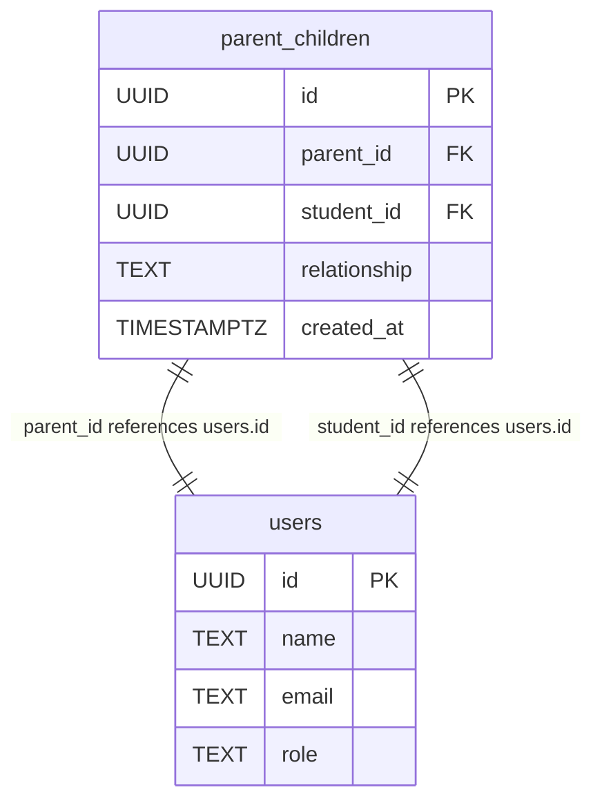
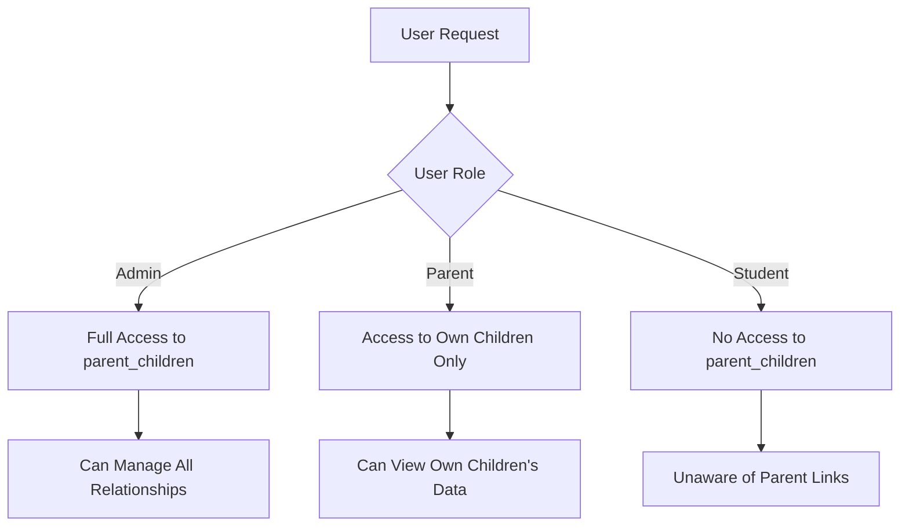
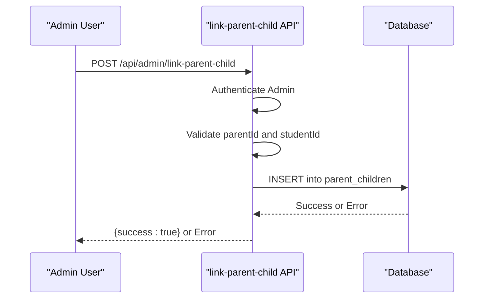
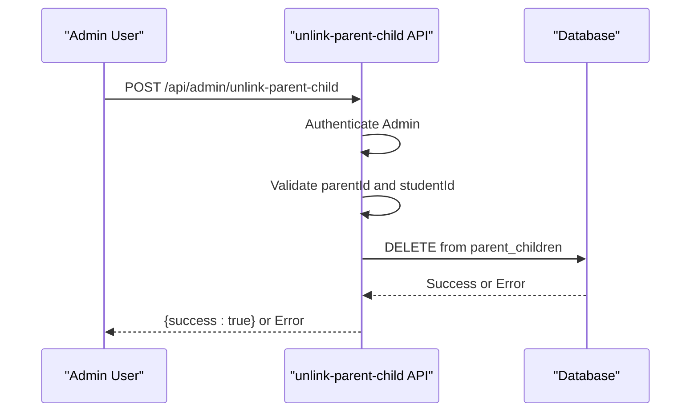
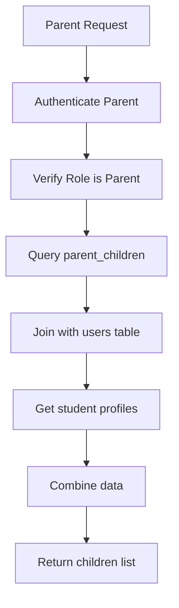
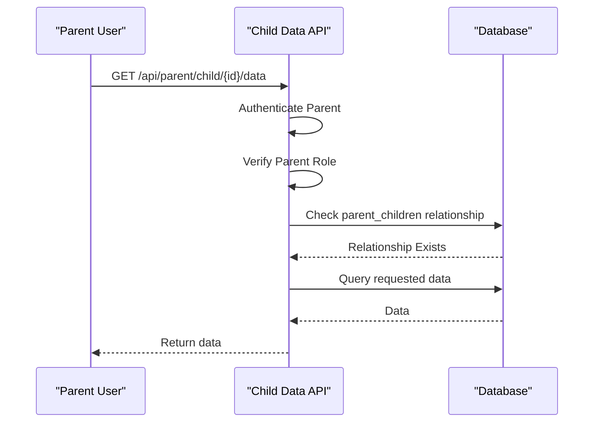
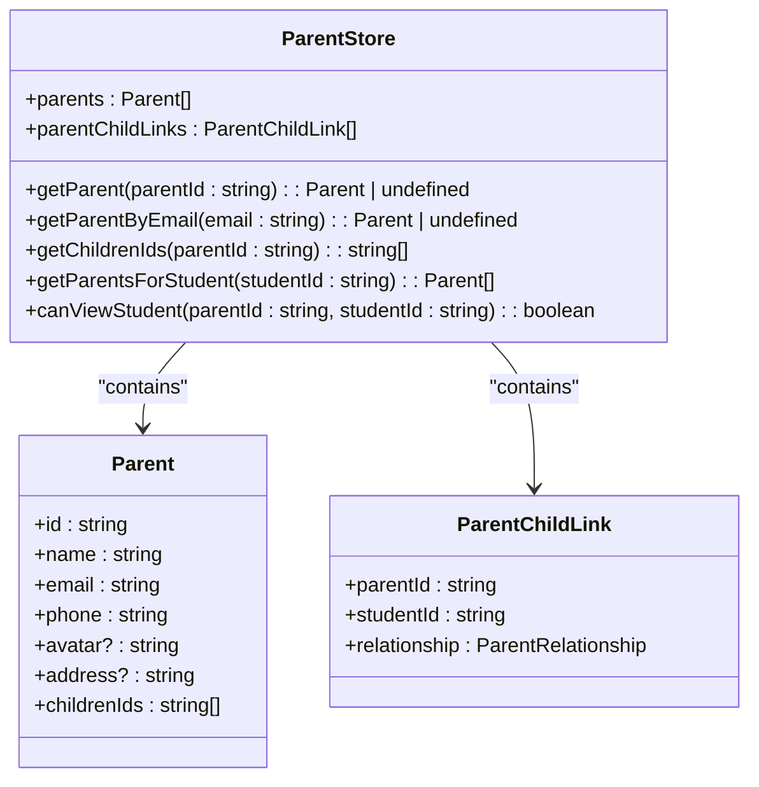

# Parent-Child Linking

<cite>
**Referenced Files in This Document**   
- [20260105082250_create_parent_tables.sql](file://supabase/migrations/20260105082250_create_parent_tables.sql)
- [link-parent-child/route.ts](file://app/api/admin/link-parent-child/route.ts)
- [unlink-parent-child/route.ts](file://app/api/admin/unlink-parent-child/route.ts)
- [children/route.ts](file://app/api/parent/children/route.ts)
- [child/[id]/grades/route.ts](file://app/api/parent/child/[id]/grades/route.ts)
- [child/[id]/attendance/route.ts](file://app/api/parent/child/[id]/attendance/route.ts)
- [parents/page.tsx](file://app/admin/parents/page.tsx)
- [parent-store.ts](file://lib/parent-store.ts)
</cite>

## Table of Contents
1. [Introduction](#introduction)
2. [Parent-Children Junction Table](#parent-children-junction-table)
3. [Row Level Security (RLS) Policies](#row-level-security-rls-policies)
4. [API Endpoints for Linking and Unlinking](#api-endpoints-for-linking-and-unlinking)
5. [Parent Dashboard Data Access](#parent-dashboard-data-access)
6. [Security Considerations](#security-considerations)

## Introduction
The parent-child linking system enables parents to access their children's academic information while maintaining strict data isolation and security. This document details the implementation of the parent_children junction table, RLS policies, API endpoints, and security mechanisms that govern this relationship in the school management system.

## Parent-Children Junction Table
The parent_children table serves as a junction table that establishes relationships between parent accounts and student accounts. This table uses foreign keys to reference the users table for both parents and students, ensuring referential integrity.

**Diagram sources**
- [20260105082250_create_parent_tables.sql](file://supabase/migrations/20260105082250_create_parent_tables.sql#L6-L13)

**Section sources**
- [20260105082250_create_parent_tables.sql](file://supabase/migrations/20260105082250_create_parent_tables.sql#L6-L13)

### Table Structure
The parent_children table contains the following columns:
- **id**: Primary key (UUID) with default generation
- **parent_id**: Foreign key referencing users(id) with ON DELETE CASCADE
- **student_id**: Foreign key referencing users(id) with ON DELETE CASCADE
- **relationship**: Text field with default value 'guardian' and constraint allowing only 'mother', 'father', 'guardian', or 'other'
- **created_at**: Timestamp with default value of current time
- **UNIQUE constraint** on (parent_id, student_id) to prevent duplicate relationships

The table also includes indexes on parent_id and student_id columns to optimize query performance for relationship lookups.

## Row Level Security (RLS) Policies
The system implements Row Level Security (RLS) policies to enforce data access controls based on user roles and relationships. These policies ensure that data isolation is maintained at the database level.

**Diagram sources**
- [20260105082250_create_parent_tables.sql](file://supabase/migrations/20260105082250_create_parent_tables.sql#L19-L48)

**Section sources**
- [20260105082250_create_parent_tables.sql](file://supabase/migrations/20260105082250_create_parent_tables.sql#L19-L48)

### Policy Details
The following RLS policies are implemented:

1. **"Parents can view their own children"**: Allows parents to SELECT from parent_children table only when parent_id matches their authenticated user ID (auth.uid())
2. **"Admin can manage all parent-child relationships"**: Grants administrators full access (FOR ALL) to the parent_children table
3. **Data access policies**: Enable parents to view their children's grades, attendance, and class enrollments through EXISTS subqueries that verify the parent-child relationship

These policies ensure that parents can only access data for students they are linked to, while students have no visibility into parent linking information.

## API Endpoints for Linking and Unlinking
The system provides API endpoints for managing parent-child relationships, with validation to prevent unauthorized access and circular references.

### Linking Endpoint
The POST /api/admin/link-parent-child endpoint allows administrators to create parent-child relationships.

**Diagram sources**
- [link-parent-child/route.ts](file://app/api/admin/link-parent-child/route.ts#L4-L61)

**Section sources**
- [link-parent-child/route.ts](file://app/api/admin/link-parent-child/route.ts#L4-L61)

### Unlinking Endpoint
The POST /api/admin/unlink-parent-child endpoint allows administrators to remove parent-child relationships.

**Diagram sources**
- [unlink-parent-child/route.ts](file://app/api/admin/unlink-parent-child/route.ts#L4-L51)

**Section sources**
- [unlink-parent-child/route.ts](file://app/api/admin/unlink-parent-child/route.ts#L4-L51)

### Validation and Error Handling
Both endpoints include validation to ensure:
- The requesting user is authenticated
- The requesting user has admin role
- Both parentId and studentId are provided
- The relationship does not already exist (for linking)
- Appropriate error responses are returned for validation failures or database errors

The linking endpoint specifically handles the unique constraint violation (error code "23505") to prevent duplicate relationships.

## Parent Dashboard Data Access
Parent dashboards fetch child data through the parent_children relationship, with data isolation maintained through RLS policies and API validation.

### Children Data Endpoint
The GET /api/parent/children endpoint retrieves a parent's linked children with their basic information.

**Diagram sources**
- [children/route.ts](file://app/api/parent/children/route.ts#L5-L74)

**Section sources**
- [children/route.ts](file://app/api/parent/children/route.ts#L5-L74)

### Child Data Endpoints
Specific endpoints allow parents to access their children's academic data:

1. **Grades**: GET /api/parent/child/[id]/grades
2. **Attendance**: GET /api/parent/child/[id]/attendance

Both endpoints follow a similar pattern:
1. Authenticate the parent user
2. Verify the user has parent role
3. Validate the parent-child relationship exists
4. Fetch the requested data with appropriate joins
5. Return the data to the parent

**Diagram sources**
- [child/[id]/grades/route.ts](file://app/api/parent/child/[id]/grades/route.ts#L5-L61)
- [child/[id]/attendance/route.ts](file://app/api/parent/child/[id]/attendance/route.ts#L6-L79)

**Section sources**
- [child/[id]/grades/route.ts](file://app/api/parent/child/[id]/grades/route.ts#L5-L61)
- [child/[id]/attendance/route.ts](file://app/api/parent/child/[id]/attendance/route.ts#L6-L79)

## Security Considerations
The parent-child linking system incorporates several security measures to protect student data and prevent unauthorized access.

### Audit Logging
While not explicitly shown in the analyzed files, the system's architecture includes audit logging capabilities through the audit_logs_with_users view and related utilities. This allows tracking of administrative actions related to parent-child linking for compliance and security monitoring.

### Data Isolation
The system maintains strict data isolation through:
- RLS policies that restrict data access based on relationships
- API-level validation of parent-child relationships
- Role-based access control
- The fact that students have no awareness of parent links to their accounts

### Prevention of Unauthorized Access
The system prevents unauthorized access to student records through:
- Authentication and role verification on all endpoints
- Explicit validation of parent-child relationships before data access
- Use of UUIDs for identifiers to prevent enumeration attacks
- Error messages that do not reveal the existence of records to unauthorized users

### Client-Side Security
The parent-store.ts file implements a client-side store that manages parent-child relationships in the frontend application, ensuring that only authorized data is displayed to parents.

**Diagram sources**
- [parent-store.ts](file://lib/parent-store.ts#L1-L65)

**Section sources**
- [parent-store.ts](file://lib/parent-store.ts#L1-L65)

The canViewStudent method in the ParentStore ensures that client-side access to student data is consistent with server-side authorization rules.