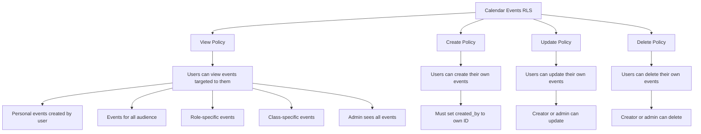
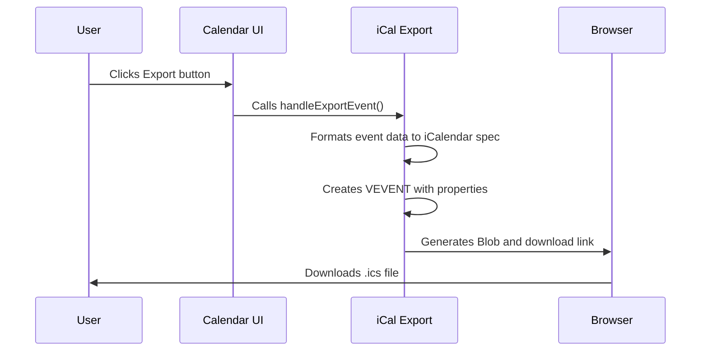
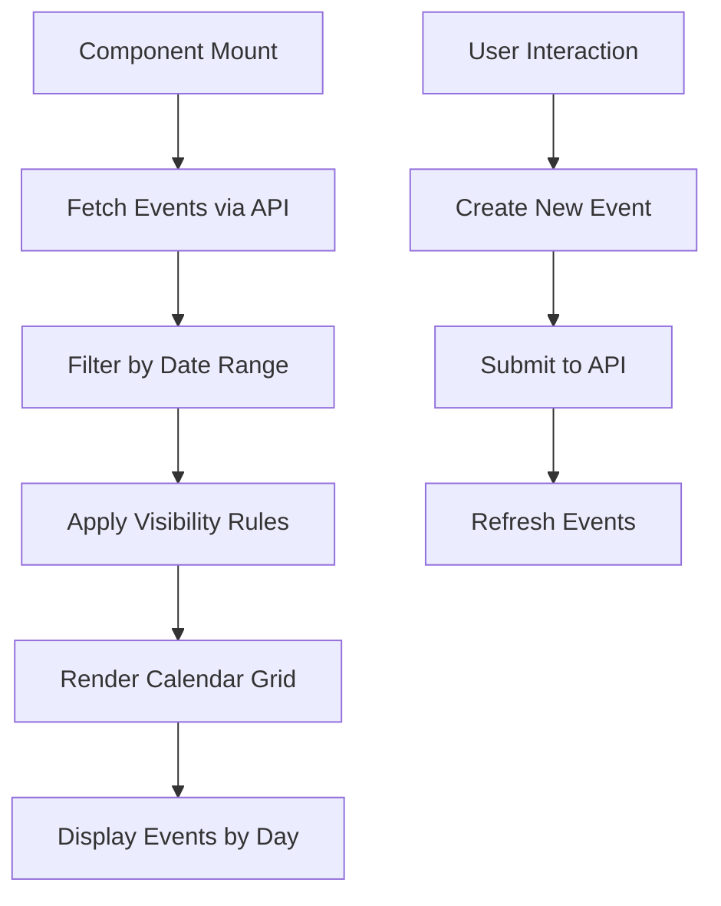

# Schedule and Calendar Events

<cite>
**Referenced Files in This Document**   
- [20251219043556_create_schedule_table.sql](file://supabase/migrations/20251219043556_create_schedule_table.sql)
- [20260105082237_create_calendar_events_table.sql](file://supabase/migrations/20260105082237_create_calendar_events_table.sql)
- [calendar/route.ts](file://app/api/calendar/route.ts)
- [admin/schedule/route.ts](file://app/api/admin/schedule/route.ts)
- [student/schedule/route.ts](file://app/api/student/schedule/route.ts)
- [calendar-view.tsx](file://components/calendar-view.tsx)
- [queries.ts](file://lib/supabase/queries.ts)
</cite>

## Table of Contents
1. [Schedule Table](#schedule-table)
2. [Calendar Events Table](#calendar-events-table)
3. [Recurring vs One-off Events](#recurring-vs-one-off-events)
4. [Row Level Security Policies](#row-level-security-policies)
5. [iCal Export Implementation](#ical-export-implementation)
6. [Calendar UI Component](#calendar-ui-component)

## Schedule Table

The `schedules` table defines recurring class times for the school management system. Each record represents a recurring class session with specific day, time, and location details.

### Field Definitions
- **id**: UUID primary key, automatically generated
- **class_id**: UUID foreign key referencing the `classes` table, with cascade delete
- **day**: Text field containing the day of the week (Monday through Sunday), with constraint validation
- **start_time**: TIME field indicating when the class session begins
- **end_time**: TIME field indicating when the class session ends
- **room**: Text field specifying the physical location or room where the class is held

The table is designed to store the regular weekly schedule for classes, allowing the system to display consistent class times across weeks without duplicating records.

**Section sources**
- [20251219043556_create_schedule_table.sql](file://supabase/migrations/20251219043556_create_schedule_table.sql#L1-L11)

## Calendar Events Table

The `calendar_events` table manages one-off events such as holidays, exams, meetings, and other special occasions that occur outside the regular class schedule.

### Field Definitions
- **id**: UUID primary key, automatically generated
- **title**: Required text field for the event title
- **description**: Optional text field for additional event details
- **type**: Text field with predefined values ('class', 'quiz', 'assignment', 'exam', 'holiday', 'meeting', 'other')
- **start_date**: Required DATE field indicating when the event begins
- **end_date**: Optional DATE field for multi-day events
- **start_time**: Optional TIME field for events with specific start times
- **end_time**: Optional TIME field for events with specific end times
- **all_day**: Boolean flag (default false) indicating if the event spans the entire day
- **location**: Optional text field for event venue
- **class_id**: Optional UUID foreign key linking to a specific class
- **created_by**: UUID foreign key referencing the user who created the event
- **target_audience**: Text field defining visibility ('all', 'students', 'teachers', 'class', 'personal')
- **color**: Optional text field for visual customization
- **created_at**: Timestamp with timezone, defaulting to current time
- **updated_at**: Timestamp with timezone, defaulting to current time

**Section sources**
- [20260105082237_create_calendar_events_table.sql](file://supabase/migrations/20260105082237_create_calendar_events_table.sql#L1-L57)

## Recurring vs One-off Events

The system distinguishes between recurring class schedules and one-off calendar events through two separate tables with different purposes.

### Schedule Table for Recurring Classes
The `schedules` table handles recurring class times by storing the day of the week and time range for each class session. This approach allows the system to display the same class schedule week after week without creating duplicate records. When rendering the calendar, the application can generate recurring events based on these schedule entries.

### Calendar Events for One-off Occurrences
The `calendar_events` table manages non-recurring events such as:
- School holidays
- Exams and quizzes
- Parent-teacher meetings
- Special assemblies
- Assignment deadlines

These events have specific start and end dates, and may include time components for precise scheduling. The system treats these as discrete events that appear only on specified dates.

This separation allows administrators to manage both the regular class timetable and special events independently, while providing a unified view in the calendar interface.

**Section sources**
- [20251219043556_create_schedule_table.sql](file://supabase/migrations/20251219043556_create_schedule_table.sql#L1-L11)
- [20260105082237_create_calendar_events_table.sql](file://supabase/migrations/20260105082237_create_calendar_events_table.sql#L1-L57)

## Row Level Security Policies

The system implements comprehensive Row Level Security (RLS) policies to control access to schedule and calendar events based on user roles and relationships.

### Calendar Events RLS Policies
The `calendar_events` table has the following RLS policies:

**Diagram sources**
- [20260105082237_create_calendar_events_table.sql](file://supabase/migrations/20260105082237_create_calendar_events_table.sql#L25-L50)

### Access Control by Role
- **Admins**: Can view, create, update, and delete all events regardless of audience
- **Teachers**: Can view events targeted to all, teachers, or their classes; can create personal events
- **Students**: Can view events targeted to all, students, or their enrolled classes
- **Parents**: Can view events relevant to their children through student accounts

The API enforces these policies through both database-level RLS and application-level filtering to ensure data privacy and appropriate access.

**Section sources**
- [20260105082237_create_calendar_events_table.sql](file://supabase/migrations/20260105082237_create_calendar_events_table.sql#L25-L50)
- [calendar/route.ts](file://app/api/calendar/route.ts#L67-L75)

## iCal Export Implementation

The system provides iCal export functionality allowing users to add calendar events to external calendar applications.

### Export Process
The iCal export is implemented in the `calendar-view.tsx` component with the following steps:

1. When a user clicks the export button, the `handleExportEvent` function is triggered
2. The function formats the event data according to the iCalendar (RFC 5545) specification
3. A VCALENDAR object is created with a VEVENT component containing the event details
4. The event is serialized into a text/calendar format with proper line endings
5. A downloadable .ics file is generated and triggered for download

### iCal Format Details
The exported iCal file includes:
- BEGIN:VCALENDAR and END:VCALENDAR wrappers
- VERSION:2.0 specification
- UID using the event ID and domain
- DTSTAMP with current timestamp
- DTSTART and DTEND with properly formatted timestamps
- SUMMARY (title), DESCRIPTION, and LOCATION fields
- Proper timezone handling with UTC timestamps

**Diagram sources**
- [calendar-view.tsx](file://components/calendar-view.tsx#L160-L202)

**Section sources**
- [calendar-view.tsx](file://components/calendar-view.tsx#L160-L202)

## Calendar UI Component

The calendar interface is implemented as a React component that provides a comprehensive view of both scheduled classes and calendar events.

### Component Structure
The `CalendarView` component renders a responsive calendar with the following features:

- Monthly view with navigation controls
- Event display with color-coding by type
- Day selection to view detailed event information
- Event creation dialog for authorized users
- iCal export capability for individual events

### Data Flow
The component follows this data flow pattern:

### Event Rendering
Events are rendered with visual indicators:
- Color-coded backgrounds by event type (class, quiz, exam, etc.)
- Truncated display of multiple events per day
- Detailed view when a specific date is selected
- Export button for adding events to external calendars

The component handles different user roles by conditionally rendering the "Add Event" button based on the `canCreate` prop, ensuring that only authorized users can create new events.

**Section sources**
- [calendar-view.tsx](file://components/calendar-view.tsx#L1-L497)
- [calendar/route.ts](file://app/api/calendar/route.ts#L5-L78)